# 主应用集成文档

<cite>
**本文档引用的文件**
- [main.cpp](file://main.cpp)
- [mainwindow.h](file://mainwindow.h)
- [mainwindow.cpp](file://mainwindow.cpp)
- [CMakeLists.txt](file://CMakeLists.txt)
- [AttendanceCheckClient开发文档.md](file://AttendanceCheckClient开发文档.md)
- [configmanager.h](file://config/configmanager.h)
- [configmanager.cpp](file://config/configmanager.cpp)
- [localstorage.h](file://LocalStorage/localstorage.h)
- [localstorage.cpp](file://LocalStorage/localstorage.cpp)
- [cameracapture.h](file://CameraCapture/cameracapture.h)
- [cameracapture.cpp](file://CameraCapture/cameracapture.cpp)
- [arcfaceengine.h](file://FaceRecognition/arcfaceengine.h)
- [arcfaceengine.cpp](file://FaceRecognition/arcfaceengine.cpp)
- [facerecognizer.h](file://FaceRecognition/facerecognizer.h)
- [facerecognizer.cpp](file://FaceRecognition/facerecognizer.cpp)
- [networkclient.h](file://NetworkClient/networkclient.h)
- [networkclient.cpp](file://NetworkClient/networkclient.cpp)
</cite>

## 更新摘要
**所做更改**
- 更新了多线程架构部分，反映网络客户端和人脸识别模块已移动到独立线程
- 新增了线程管理和跨线程通信的详细说明，特别强调Qt::QueuedConnection的使用
- 更新了架构图以体现新的线程分离设计
- 增强了性能考虑章节，重点说明多线程带来的UI响应性改善
- 新增了网络状态初始化的准确状态报告机制
- 强调了避免重复信号连接的最佳实践

## 目录
1. [项目概述](#项目概述)
2. [项目结构](#项目结构)
3. [核心组件](#核心组件)
4. [架构概览](#架构概览)
5. [详细组件分析](#详细组件分析)
6. [依赖关系分析](#依赖关系分析)
7. [性能考虑](#性能考虑)
8. [故障排除指南](#故障排除指南)
9. [结论](#结论)

## 项目概述

AttendanceCheckClient是一个基于Qt框架的局域网智能考勤系统打卡端应用。该系统部署在考勤现场，负责人脸识别采集、识别、本地打卡、断网缓存和TCP上传数据等核心功能。

### 项目定位
- **架构模式**：C/S局域网架构中的客户端
- **核心职责**：人脸识别打卡执行端
- **技术栈**：Qt 5.15/6.2+、C++11+、CMake、SQLite3、ArcFace人脸识别库

### 核心功能
1. **人脸识别**：使用ArcFace库进行人脸检测和识别
2. **本地打卡**：识别成功后生成打卡记录并存储到本地数据库
3. **断网缓存**：网络断开时，打卡记录存储在本地，待网络恢复后自动上传
4. **TCP上传**：主动连接管理端，定时或实时上传打卡记录
5. **设备状态监控**：显示网络连接状态、设备运行状态

**章节来源**
- [AttendanceCheckClient开发文档.md:1-121](file://AttendanceCheckClient开发文档.md#L1-L121)

## 项目结构

项目采用模块化设计，按照功能领域进行组织，并实现了多线程架构改进：

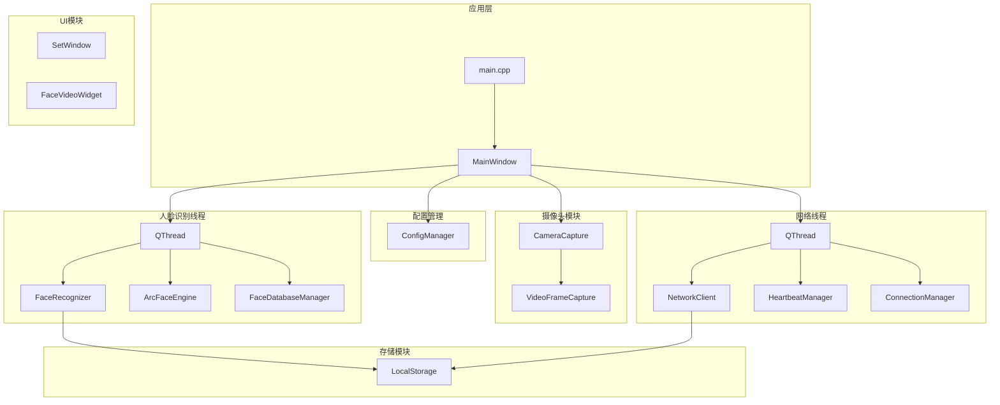

**图表来源**
- [main.cpp:12-45](file://main.cpp#L12-L45)
- [mainwindow.h:82-94](file://mainwindow.h#L82-L94)
- [mainwindow.cpp:74-118](file://mainwindow.cpp#L74-L118)

**章节来源**
- [CMakeLists.txt:19-58](file://CMakeLists.txt#L19-L58)

## 核心组件

### 应用入口点
主应用入口负责初始化配置管理器、数据库和主窗口，确保系统启动时具备完整的运行环境。

### 主窗口管理器
MainWindow作为应用的核心控制器，负责协调各个子系统的初始化和交互，包括：
- 摄像头初始化和视频流显示
- **多线程管理**：将人脸识别和网络客户端分别移动到独立线程
- **跨线程通信**：使用Qt::QueuedConnection确保线程间安全通信
- 数据库连接和本地存储
- UI界面的布局和事件处理

### 配置管理系统
ConfigManager提供统一的配置管理服务，支持网络设置、人脸识别参数、存储路径等配置项的读取和保存。

**章节来源**
- [main.cpp:22-38](file://main.cpp#L22-L38)
- [mainwindow.cpp:59-112](file://mainwindow.cpp#L59-L112)
- [configmanager.h:14-148](file://configmanager.h#L14-L148)

## 架构概览

系统采用分层架构设计，各层职责明确，耦合度低，并实现了多线程分离：

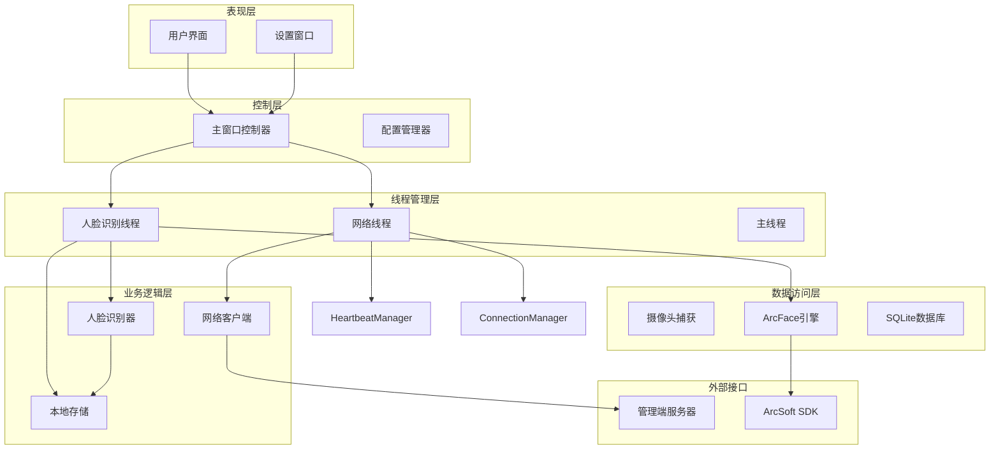

**图表来源**
- [mainwindow.h:82-94](file://mainwindow.h#L82-L94)
- [facerecognizer.h:35-107](file://facerecognizer.h#L35-L107)
- [networkclient.h:18-76](file://networkclient.h#L18-L76)

## 详细组件分析

### 主窗口组件分析

MainWindow是整个应用的核心控制器，负责协调各个子系统的初始化和运行，并实现了多线程架构改进。

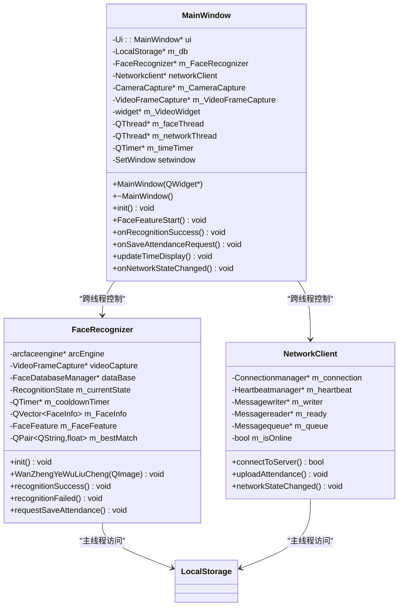

**图表来源**
- [mainwindow.h:22-94](file://mainwindow.h#L22-L94)
- [facerecognizer.h:35-107](file://facerecognizer.h#L35-L107)
- [networkclient.h:18-76](file://networkclient.h#L18-L76)

#### 多线程人脸识别流程序列图

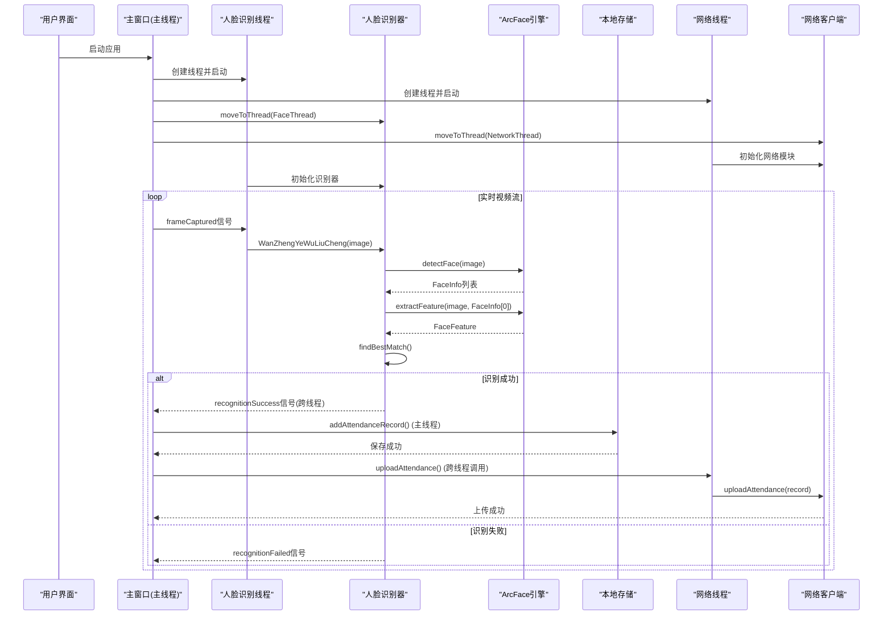

**图表来源**
- [mainwindow.cpp:132-172](file://mainwindow.cpp#L132-L172)
- [facerecognizer.cpp:46-196](file://facerecognizer.cpp#L46-L196)
- [networkclient.cpp:45-65](file://networkclient.cpp#L45-L65)

**章节来源**
- [mainwindow.cpp:9-32](file://mainwindow.cpp#L9-L32)
- [facerecognizer.cpp:25-43](file://facerecognizer.cpp#L25-L43)

### 配置管理系统分析

ConfigManager采用单例模式设计，提供统一的配置管理服务。

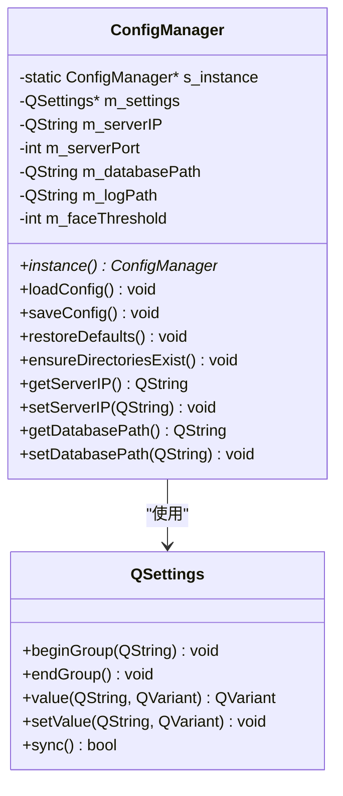

**图表来源**
- [configmanager.h:14-148](file://configmanager.h#L14-L148)
- [configmanager.cpp:8-43](file://configmanager.cpp#L8-L43)

#### 配置加载流程图

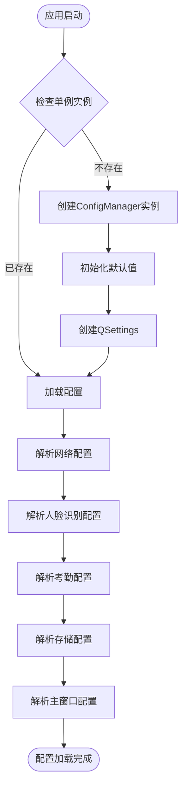

**图表来源**
- [configmanager.cpp:53-91](file://configmanager.cpp#L53-L91)

**章节来源**
- [configmanager.cpp:16-36](file://configmanager.cpp#L16-L36)
- [configmanager.cpp:93-130](file://configmanager.cpp#L93-L130)

### 人脸识别引擎分析

ArcFaceEngine提供人脸检测、特征提取和特征对比功能，采用单例模式确保全局唯一性。

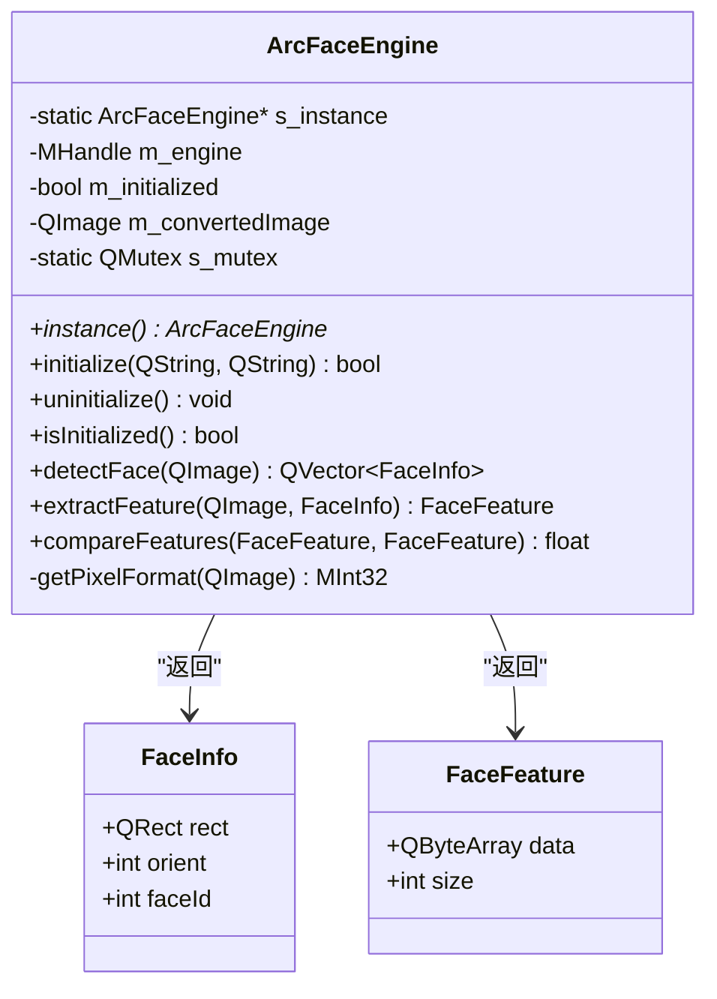

**图表来源**
- [arcfaceengine.h:21-115](file://arcfaceengine.h#L21-L115)
- [arcfaceengine.cpp:18-28](file://arcfaceengine.cpp#L18-L28)

#### 人脸识别状态机

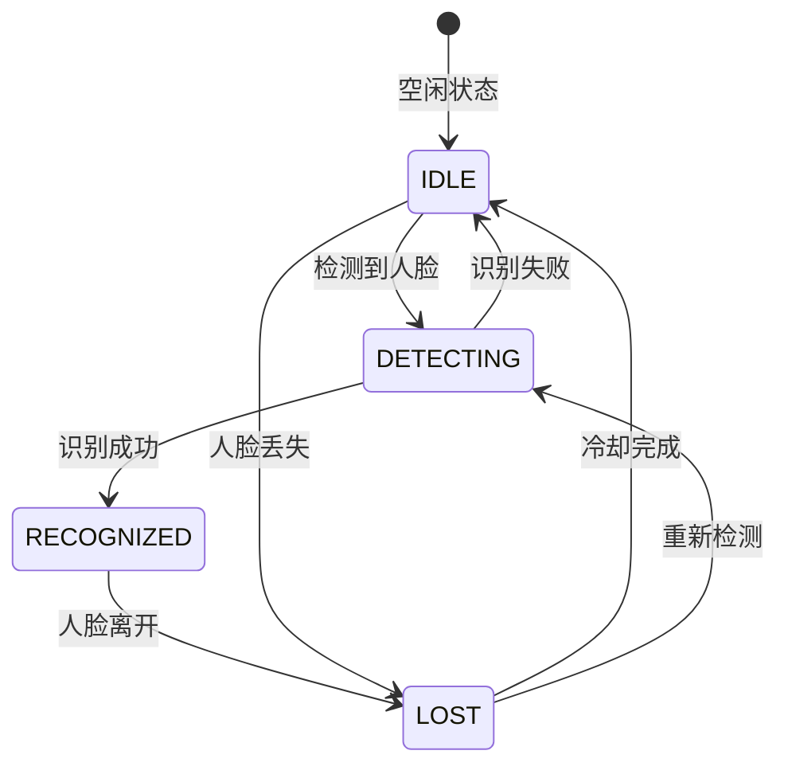

**图表来源**
- [facerecognizer.h:28-33](file://facerecognizer.h#L28-L33)
- [facerecognizer.cpp:199-214](file://facerecognizer.cpp#L199-L214)

**章节来源**
- [arcfaceengine.cpp:31-62](file://arcfaceengine.cpp#L31-L62)
- [facerecognizer.cpp:78-133](file://facerecognizer.cpp#L78-L133)

### 本地存储系统分析

LocalStorage提供SQLite数据库的封装，支持人员数据同步和打卡记录管理。

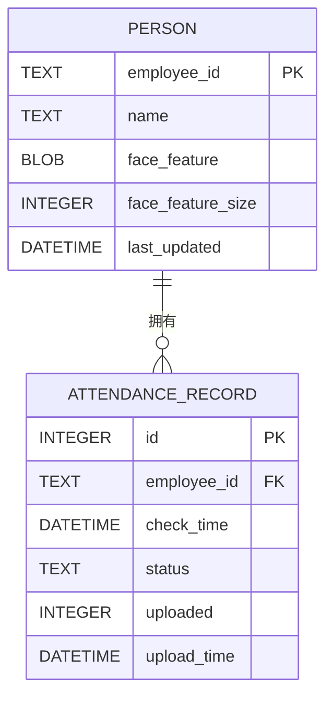

**图表来源**
- [localstorage.cpp:84-135](file://localstorage.cpp#L84-L135)

#### 数据库初始化流程

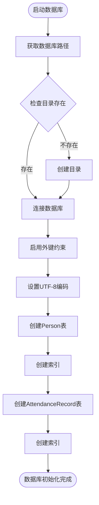

**图表来源**
- [localstorage.cpp:32-136](file://localstorage.cpp#L32-L136)

**章节来源**
- [localstorage.cpp:139-196](file://localstorage.cpp#L139-L196)
- [localstorage.cpp:198-239](file://localstorage.cpp#L198-L239)

### 网络客户端线程分析

NetworkClient实现了完整的网络通信功能，现已移动到独立线程中运行，确保UI响应性。

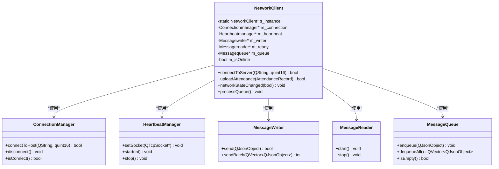

**图表来源**
- [networkclient.h:18-76](file://networkclient.h#L18-L76)
- [networkclient.cpp:234-244](file://networkclient.cpp#L234-L244)

#### 网络连接状态机

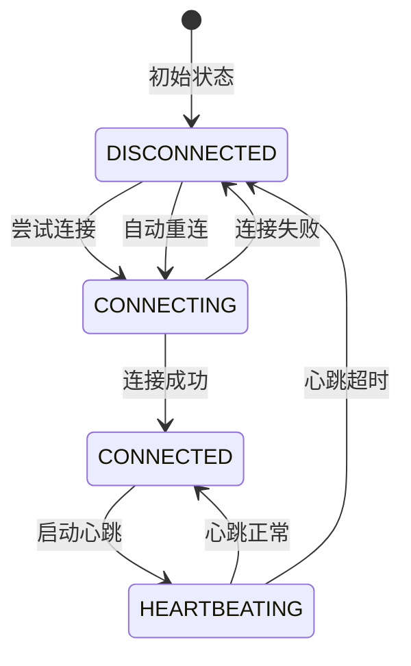

**图表来源**
- [networkclient.cpp:109-193](file://networkclient.cpp#L109-L193)

**章节来源**
- [networkclient.cpp:12-25](file://networkclient.cpp#L12-L25)
- [networkclient.cpp:282-322](file://networkclient.cpp#L282-L322)

## 依赖关系分析

系统采用模块化设计，各模块间依赖关系清晰，并实现了线程分离：

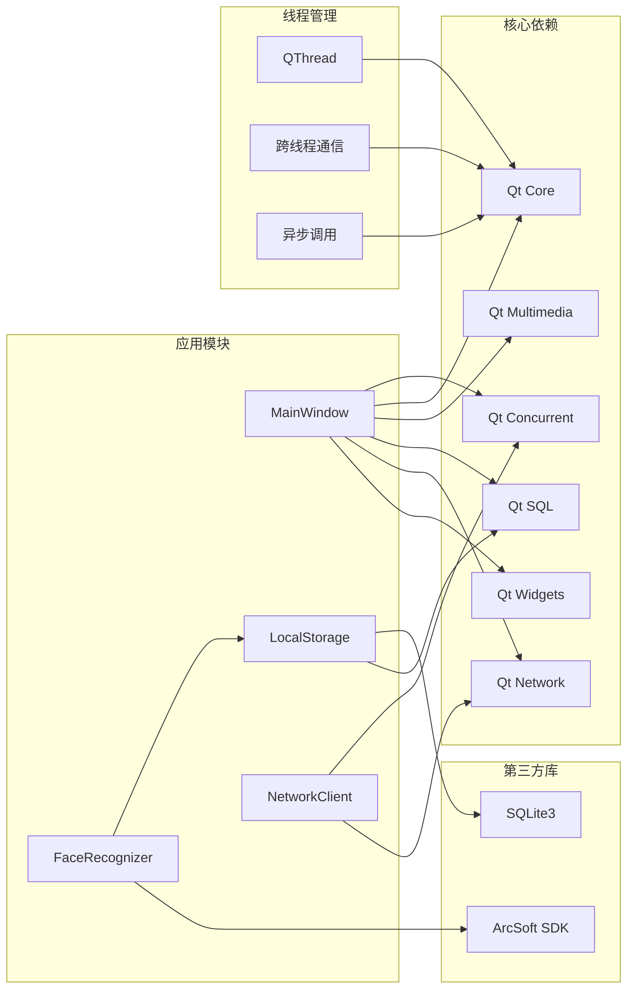

**图表来源**
- [CMakeLists.txt:16-17](file://CMakeLists.txt#L16-L17)
- [CMakeLists.txt:79-86](file://CMakeLists.txt#L79-L86)
- [mainwindow.cpp:74-103](file://mainwindow.cpp#L74-L103)

**章节来源**
- [CMakeLists.txt:72-86](file://CMakeLists.txt#L72-L86)

## 性能考虑

### 多线程架构改进

**更新** 系统已实现重要的多线程架构改进，显著提升了UI响应性和系统稳定性：

#### 线程分离策略
- **人脸识别线程**：将CPU密集型的人脸检测和特征提取任务分离到独立线程
- **网络通信线程**：将网络连接、心跳检测和消息处理迁移到专用线程
- **主线程专注UI**：确保UI操作完全在主线程执行，避免阻塞

#### 跨线程通信机制
- **Qt::QueuedConnection**：所有跨线程信号槽连接均使用队列连接方式
- **QMetaObject::invokeMethod**：通过异步方法调用确保线程安全
- **信号转发**：子线程通过信号将结果转发到主线程更新UI

#### 网络状态初始化
- **初始离线状态**：系统启动时网络状态初始设置为离线，提供准确的状态报告
- **避免重复连接**：通过initNetWorkStatus()方法确保networkStateChanged信号只连接一次
- **跨线程安全**：所有网络状态信号连接均使用Qt::QueuedConnection确保线程安全

#### 性能收益
- **UI响应性**：摄像头画面流畅显示，无卡顿现象
- **识别性能**：人脸识别算法在独立线程中高效运行
- **网络稳定性**：网络操作不影响UI交互
- **资源隔离**：各模块独立运行，互不干扰

### 内存管理
- ArcFace引擎采用单例模式，避免重复初始化
- 使用QMutex保护共享资源
- 及时释放摄像头资源

### 网络优化
- 心跳机制检测连接状态
- 断网缓存机制确保数据完整性
- 批量上传减少网络开销

**章节来源**
- [mainwindow.cpp:74-118](file://mainwindow.cpp#L74-L118)
- [mainwindow.cpp:132-172](file://mainwindow.cpp#L132-L172)
- [mainwindow.cpp:175-192](file://mainwindow.cpp#L175-L192)

## 故障排除指南

### 常见问题及解决方案

**摄像头无法初始化**
- 检查摄像头权限设置
- 确认摄像头设备正常工作
- 验证Qt Multimedia模块正确安装

**人脸识别失败**
- 检查ArcFace SDK激活状态
- 调整识别阈值配置
- 确认人脸图像质量

**数据库连接失败**
- 检查数据库文件路径
- 验证SQLite驱动安装
- 确认文件权限设置

**网络连接问题**
- 检查服务器IP和端口配置
- 验证防火墙设置
- 确认网络连通性

**多线程相关问题**
- **线程启动失败**：检查QThread对象创建和启动顺序
- **跨线程通信异常**：确认使用Qt::QueuedConnection连接
- **线程资源泄漏**：确保正确调用quit()和wait()方法
- **死锁问题**：检查QMutex使用，避免在不同线程间交叉使用
- **重复信号连接**：使用initNetWorkStatus()方法避免重复连接networkStateChanged信号

**网络状态显示问题**
- **状态不准确**：检查initNetWorkStatus()中的initial offline state设置
- **状态更新延迟**：确认Qt::QueuedConnection的正确使用
- **状态切换异常**：验证networkStateChanged信号的连接和处理

**章节来源**
- [cameracapture.cpp:14-32](file://cameracapture.cpp#L14-L32)
- [arcfaceengine.cpp:31-62](file://arcfaceengine.cpp#L31-L62)
- [localstorage.cpp:32-68](file://localstorage.cpp#L32-L68)
- [mainwindow.cpp:42-54](file://mainwindow.cpp#L42-L54)
- [mainwindow.cpp:175-192](file://mainwindow.cpp#L175-L192)

## 结论

AttendanceCheckClient系统采用模块化设计，具有良好的可维护性和扩展性。通过实施多线程架构改进，系统实现了以下重要提升：

### 主要改进成果
1. **多线程架构**：人脸识别和网络通信分离到独立线程，显著提升UI响应性
2. **跨线程通信**：使用Qt::QueuedConnection确保线程间安全通信
3. **模块化设计**：清晰的职责分离，便于维护和扩展
4. **容错机制**：断网缓存确保数据完整性
5. **配置管理**：灵活的配置选项满足不同需求
6. **网络状态管理**：初始离线状态确保准确的状态报告
7. **避免重复连接**：通过initNetWorkStatus()方法避免重复信号连接

### 技术亮点
- **线程安全**：所有跨线程操作均通过Qt信号槽机制实现
- **异步处理**：网络操作和人脸识别均采用异步模式
- **资源管理**：完善的线程生命周期管理，避免资源泄漏
- **性能优化**：CPU密集型任务与UI线程分离运行
- **状态管理**：准确的网络状态初始化和报告机制

### 未来发展方向
- 增加更多的日志记录和监控功能
- 优化人脸识别算法性能
- 扩展更多的人脸识别库支持
- 增强网络安全机制
- 考虑引入线程池管理机制进一步优化资源利用

通过这些改进，AttendanceCheckClient系统现在能够提供更加稳定、响应迅速的考勤识别体验，为实际部署提供了可靠的技术基础。