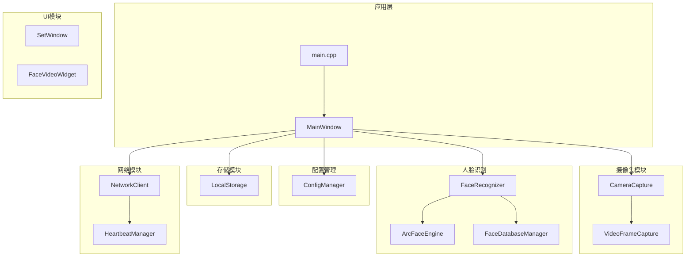
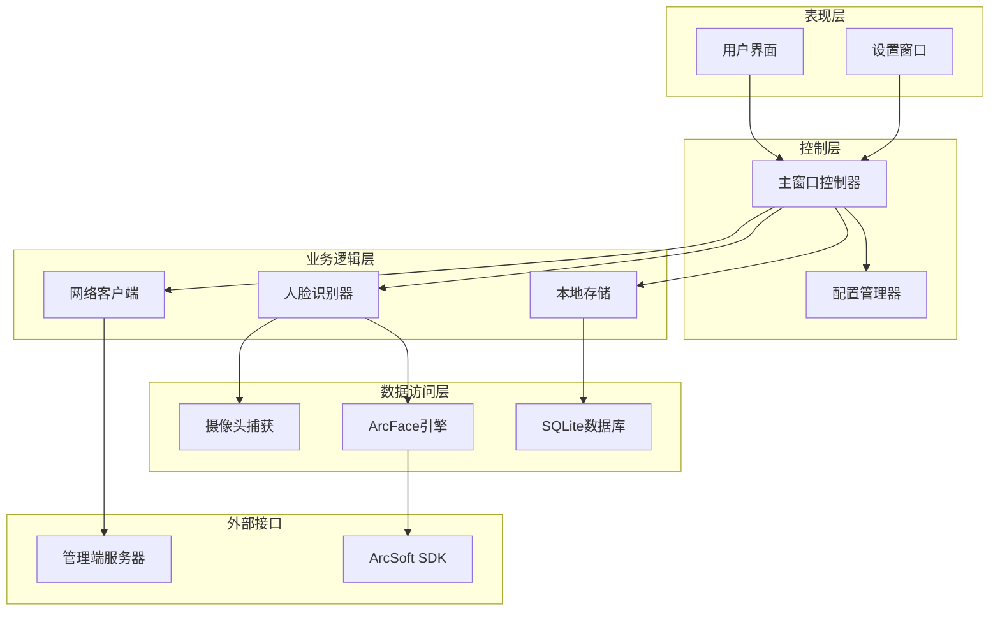
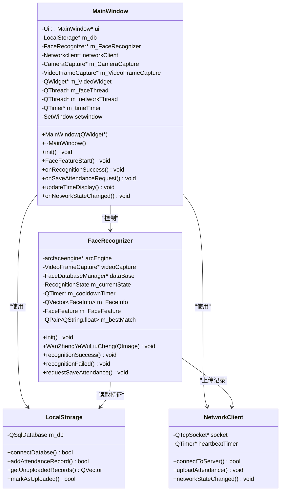
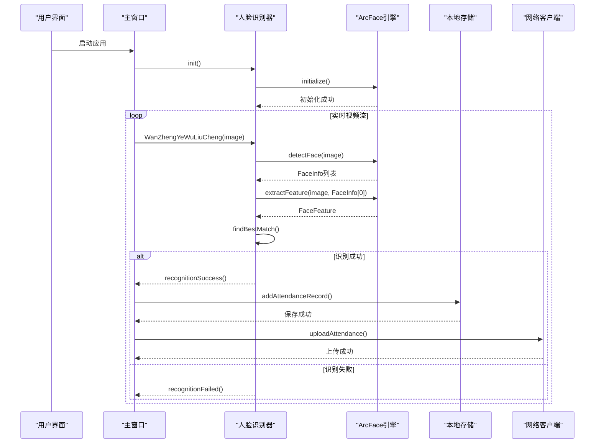
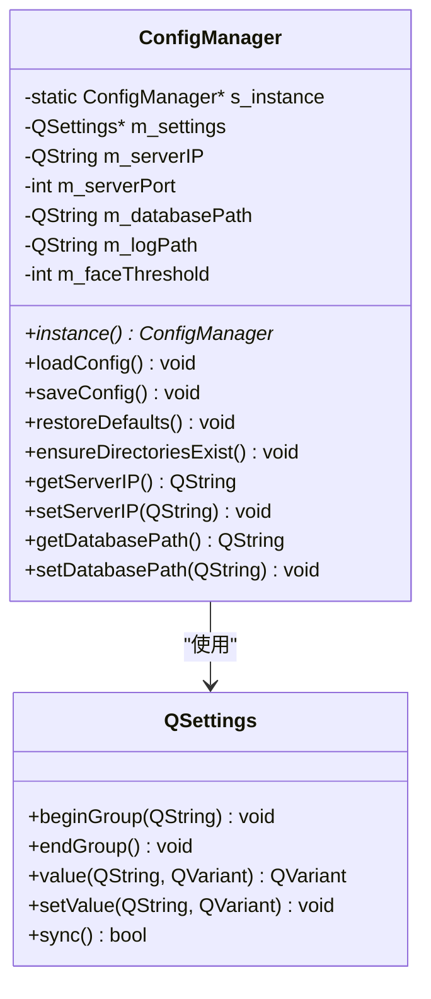
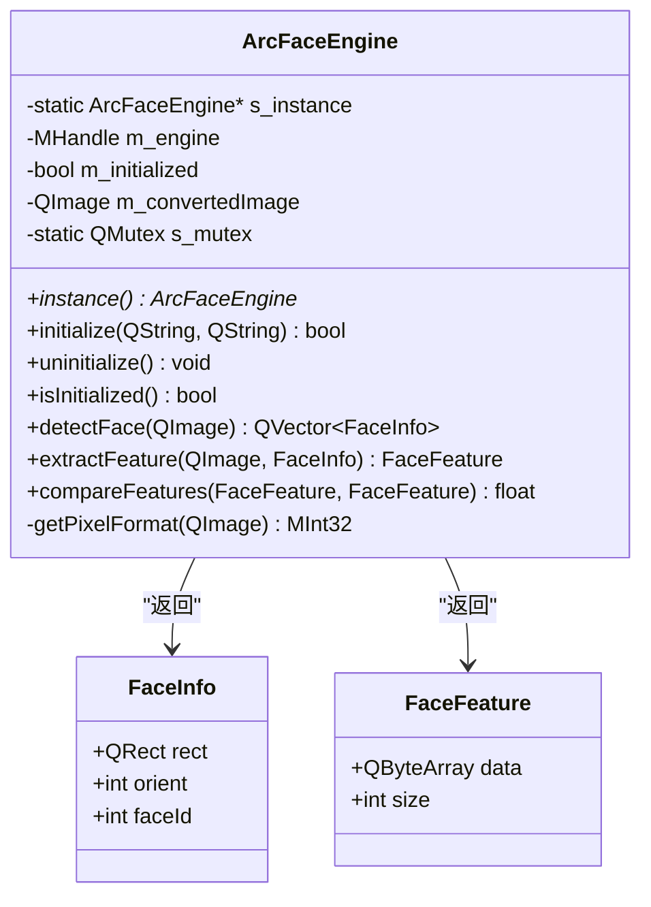
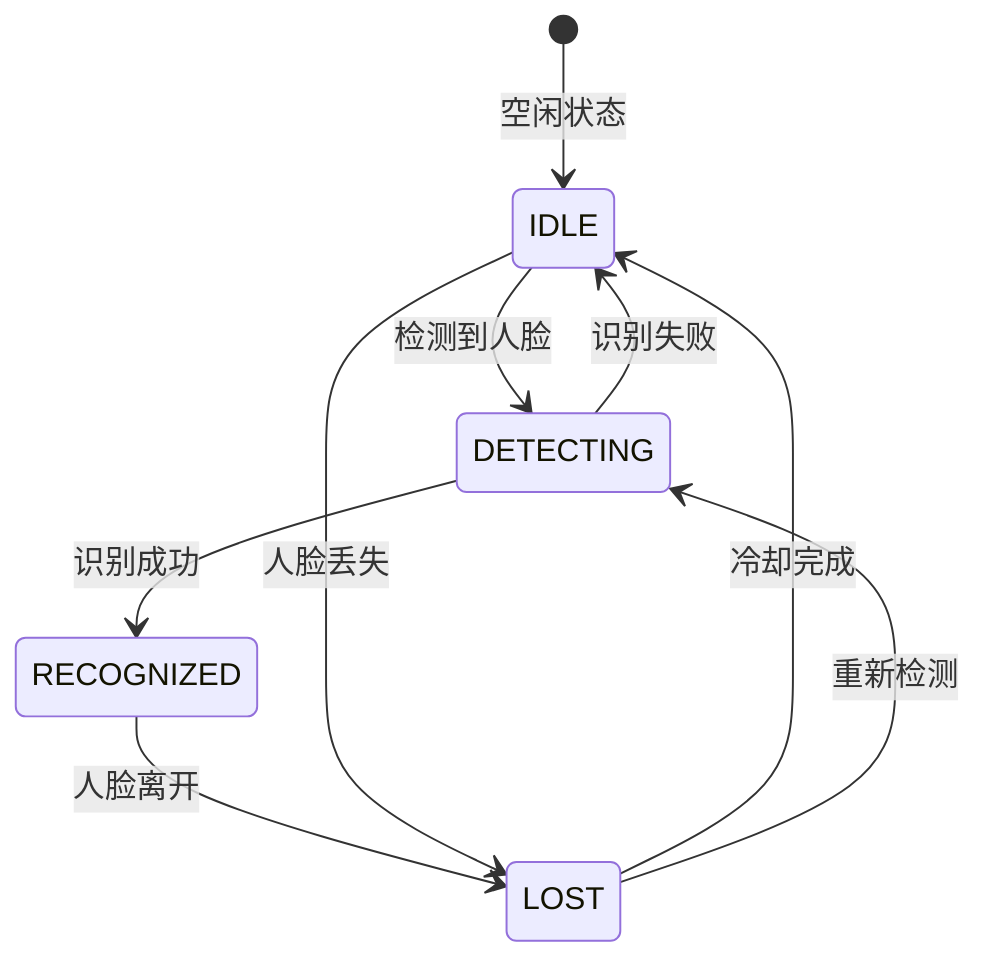
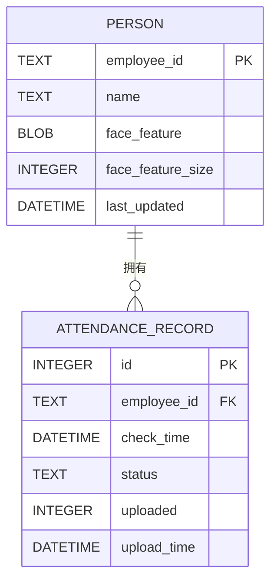
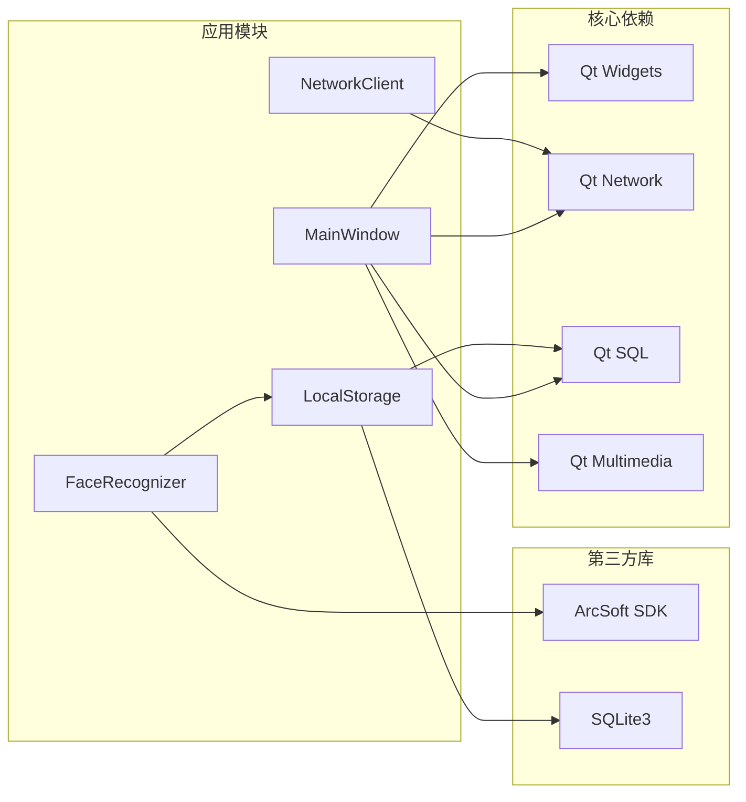

# 主应用集成文档

<cite>
**本文档引用的文件**
- [main.cpp](file://main.cpp)
- [mainwindow.h](file://mainwindow.h)
- [mainwindow.cpp](file://mainwindow.cpp)
- [CMakeLists.txt](file://CMakeLists.txt)
- [AttendanceCheckClient开发文档.md](file://AttendanceCheckClient开发文档.md)
- [configmanager.h](file://config/configmanager.h)
- [configmanager.cpp](file://config/configmanager.cpp)
- [localstorage.h](file://LocalStorage/localstorage.h)
- [localstorage.cpp](file://LocalStorage/localstorage.cpp)
- [cameracapture.h](file://CameraCapture/cameracapture.h)
- [cameracapture.cpp](file://CameraCapture/cameracapture.cpp)
- [arcfaceengine.h](file://FaceRecognition/arcfaceengine.h)
- [arcfaceengine.cpp](file://FaceRecognition/arcfaceengine.cpp)
- [facerecognizer.h](file://FaceRecognition/facerecognizer.h)
- [facerecognizer.cpp](file://FaceRecognition/facerecognizer.cpp)
</cite>

## 目录
1. [项目概述](#项目概述)
2. [项目结构](#项目结构)
3. [核心组件](#核心组件)
4. [架构概览](#架构概览)
5. [详细组件分析](#详细组件分析)
6. [依赖关系分析](#依赖关系分析)
7. [性能考虑](#性能考虑)
8. [故障排除指南](#故障排除指南)
9. [结论](#结论)

## 项目概述

AttendanceCheckClient是一个基于Qt框架的局域网智能考勤系统打卡端应用。该系统部署在考勤现场，负责人脸识别采集、识别、本地打卡、断网缓存和TCP上传数据等核心功能。

### 项目定位
- **架构模式**：C/S局域网架构中的客户端
- **核心职责**：人脸识别打卡执行端
- **技术栈**：Qt 5.15/6.2+、C++11+、CMake、SQLite3、ArcFace人脸识别库

### 核心功能
1. **人脸识别**：使用ArcFace库进行人脸检测和识别
2. **本地打卡**：识别成功后生成打卡记录并存储到本地数据库
3. **断网缓存**：网络断开时，打卡记录存储在本地，待网络恢复后自动上传
4. **TCP上传**：主动连接管理端，定时或实时上传打卡记录
5. **设备状态监控**：显示网络连接状态、设备运行状态

**章节来源**
- [AttendanceCheckClient开发文档.md:1-121](file://AttendanceCheckClient开发文档.md#L1-L121)

## 项目结构

项目采用模块化设计，按照功能领域进行组织：

**图表来源**
- [main.cpp:12-45](file://main.cpp#L12-L45)
- [mainwindow.h:22-94](file://mainwindow.h#L22-L94)

**章节来源**
- [CMakeLists.txt:19-58](file://CMakeLists.txt#L19-L58)

## 核心组件

### 应用入口点
主应用入口负责初始化配置管理器、数据库和主窗口，确保系统启动时具备完整的运行环境。

### 主窗口管理器
MainWindow作为应用的核心控制器，负责协调各个子系统的初始化和交互，包括：
- 摄像头初始化和视频流显示
- 人脸识别引擎的启动和配置
- 数据库连接和本地存储
- 网络客户端的连接和状态监控
- UI界面的布局和事件处理

### 配置管理系统
ConfigManager提供统一的配置管理服务，支持网络设置、人脸识别参数、存储路径等配置项的读取和保存。

**章节来源**
- [main.cpp:22-38](file://main.cpp#L22-L38)
- [mainwindow.cpp:59-112](file://mainwindow.cpp#L59-L112)
- [configmanager.h:14-148](file://configmanager.h#L14-L148)

## 架构概览

系统采用分层架构设计，各层职责明确，耦合度低：

**图表来源**
- [mainwindow.h:82-91](file://mainwindow.h#L82-L91)
- [facerecognizer.h:35-107](file://facerecognizer.h#L35-L107)

## 详细组件分析

### 主窗口组件分析

MainWindow是整个应用的核心控制器，负责协调各个子系统的初始化和运行。

**图表来源**
- [mainwindow.h:22-94](file://mainwindow.h#L22-L94)
- [facerecognizer.h:35-107](file://facerecognizer.h#L35-L107)
- [localstorage.h:15-49](file://localstorage.h#L15-L49)

#### 人脸识别流程序列图

**图表来源**
- [facerecognizer.cpp:46-196](file://facerecognizer.cpp#L46-L196)
- [mainwindow.cpp:185-242](file://mainwindow.cpp#L185-L242)

**章节来源**
- [mainwindow.cpp:9-32](file://mainwindow.cpp#L9-L32)
- [facerecognizer.cpp:25-43](file://facerecognizer.cpp#L25-L43)

### 配置管理系统分析

ConfigManager采用单例模式设计，提供统一的配置管理服务。

**图表来源**
- [configmanager.h:14-148](file://configmanager.h#L14-L148)
- [configmanager.cpp:8-43](file://configmanager.cpp#L8-L43)

#### 配置加载流程图

**图表来源**
- [configmanager.cpp:53-91](file://configmanager.cpp#L53-L91)

**章节来源**
- [configmanager.cpp:16-36](file://configmanager.cpp#L16-L36)
- [configmanager.cpp:93-130](file://configmanager.cpp#L93-L130)

### 人脸识别引擎分析

ArcFaceEngine提供人脸检测、特征提取和特征对比功能，采用单例模式确保全局唯一性。

**图表来源**
- [arcfaceengine.h:21-115](file://arcfaceengine.h#L21-L115)
- [arcfaceengine.cpp:18-28](file://arcfaceengine.cpp#L18-L28)

#### 人脸识别状态机

**图表来源**
- [facerecognizer.h:28-33](file://facerecognizer.h#L28-L33)
- [facerecognizer.cpp:199-214](file://facerecognizer.cpp#L199-L214)

**章节来源**
- [arcfaceengine.cpp:31-62](file://arcfaceengine.cpp#L31-L62)
- [facerecognizer.cpp:78-133](file://facerecognizer.cpp#L78-L133)

### 本地存储系统分析

LocalStorage提供SQLite数据库的封装，支持人员数据同步和打卡记录管理。

**图表来源**
- [localstorage.cpp:84-135](file://localstorage.cpp#L84-L135)

#### 数据库初始化流程

**图表来源**
- [localstorage.cpp:32-136](file://localstorage.cpp#L32-L136)

**章节来源**
- [localstorage.cpp:139-196](file://localstorage.cpp#L139-L196)
- [localstorage.cpp:198-239](file://localstorage.cpp#L198-L239)

## 依赖关系分析

系统采用模块化设计，各模块间依赖关系清晰：

**图表来源**
- [CMakeLists.txt:16-17](file://CMakeLists.txt#L16-L17)
- [CMakeLists.txt:79-86](file://CMakeLists.txt#L79-L86)

**章节来源**
- [CMakeLists.txt:72-86](file://CMakeLists.txt#L72-L86)

## 性能考虑

### 线程管理
系统采用多线程架构，将CPU密集型的人脸识别任务分离到独立线程，避免阻塞UI线程。

### 内存管理
- ArcFace引擎采用单例模式，避免重复初始化
- 使用QMutex保护共享资源
- 及时释放摄像头资源

### 网络优化
- 心跳机制检测连接状态
- 断网缓存机制确保数据完整性
- 批量上传减少网络开销

## 故障排除指南

### 常见问题及解决方案

**摄像头无法初始化**
- 检查摄像头权限设置
- 确认摄像头设备正常工作
- 验证Qt Multimedia模块正确安装

**人脸识别失败**
- 检查ArcFace SDK激活状态
- 调整识别阈值配置
- 确认人脸图像质量

**数据库连接失败**
- 检查数据库文件路径
- 验证SQLite驱动安装
- 确认文件权限设置

**网络连接问题**
- 检查服务器IP和端口配置
- 验证防火墙设置
- 确认网络连通性

**章节来源**
- [cameracapture.cpp:14-32](file://cameracapture.cpp#L14-L32)
- [arcfaceengine.cpp:31-62](file://arcfaceengine.cpp#L31-L62)
- [localstorage.cpp:32-68](file://localstorage.cpp#L32-L68)

## 结论

AttendanceCheckClient系统采用模块化设计，具有良好的可维护性和扩展性。通过合理的架构设计和组件划分，实现了人脸识别考勤的核心功能。系统的主要优势包括：

1. **模块化架构**：清晰的职责分离，便于维护和扩展
2. **多线程设计**：避免UI阻塞，提升用户体验
3. **容错机制**：断网缓存确保数据完整性
4. **配置管理**：灵活的配置选项满足不同需求

未来可以考虑的改进方向：
- 增加更多的日志记录和监控功能
- 优化人脸识别算法性能
- 扩展更多的人脸识别库支持
- 增强网络安全机制