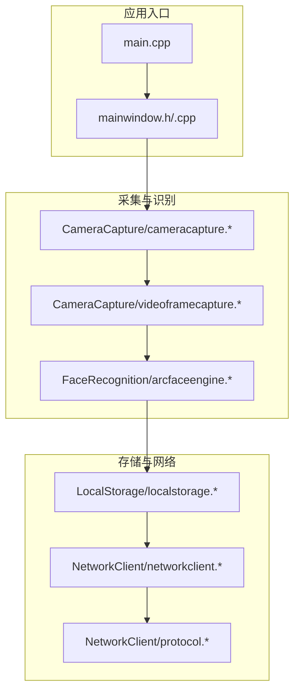
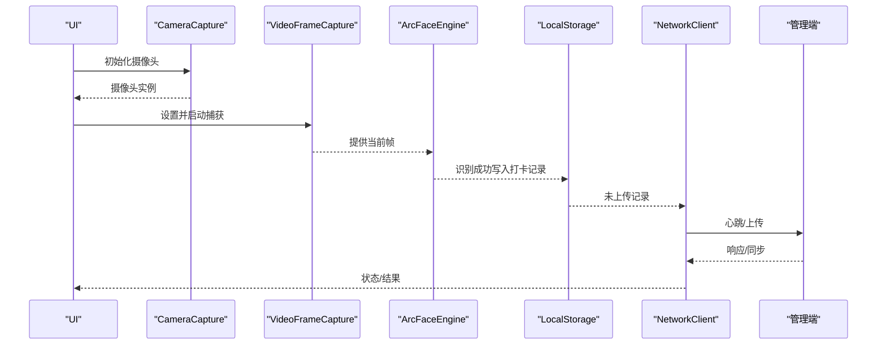
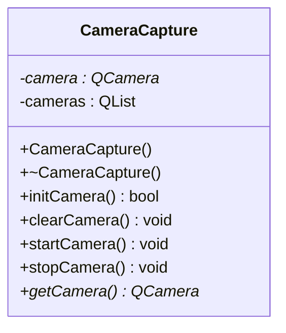
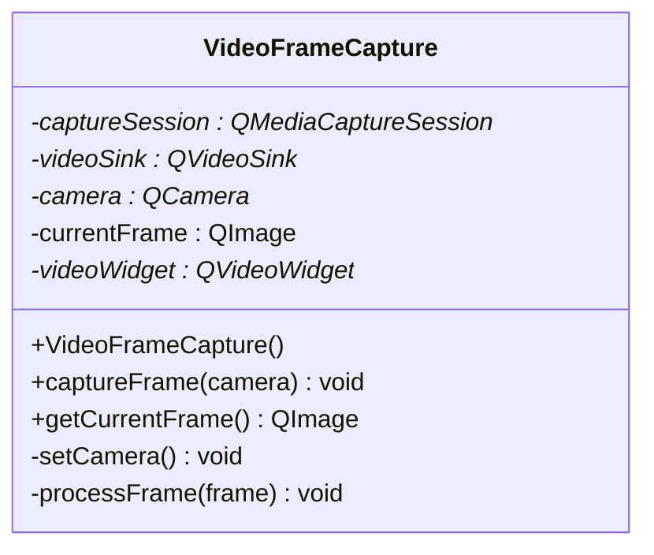
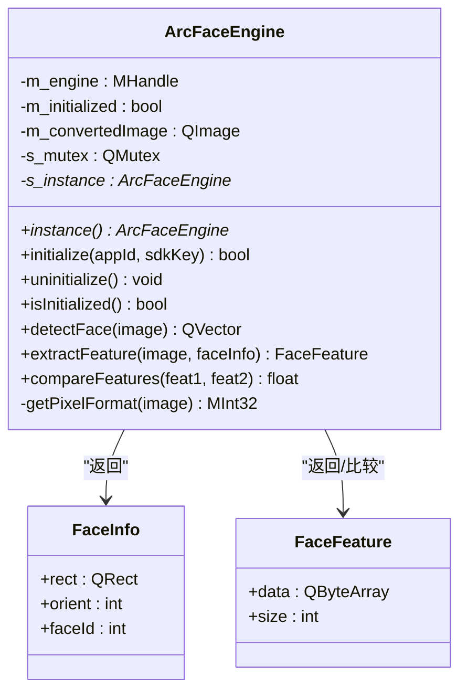
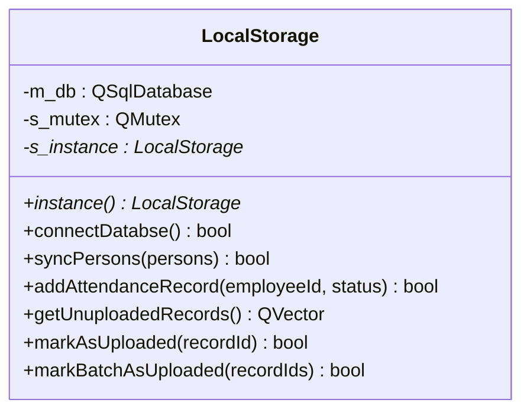
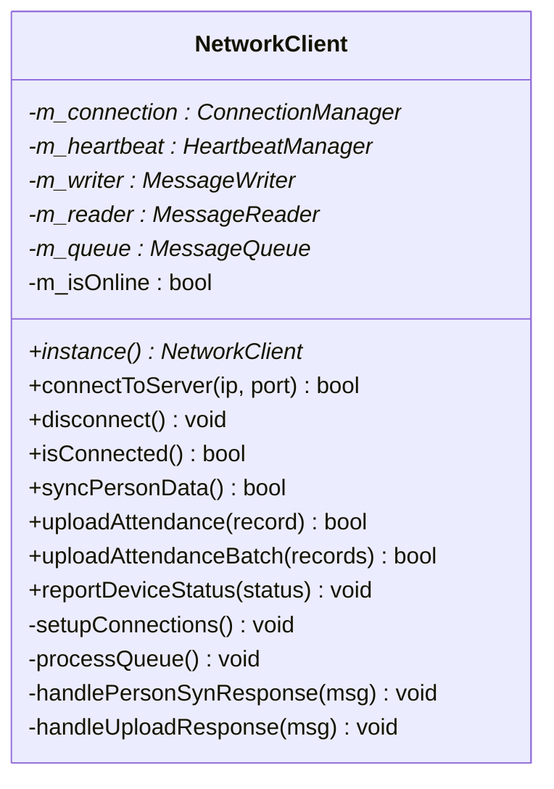
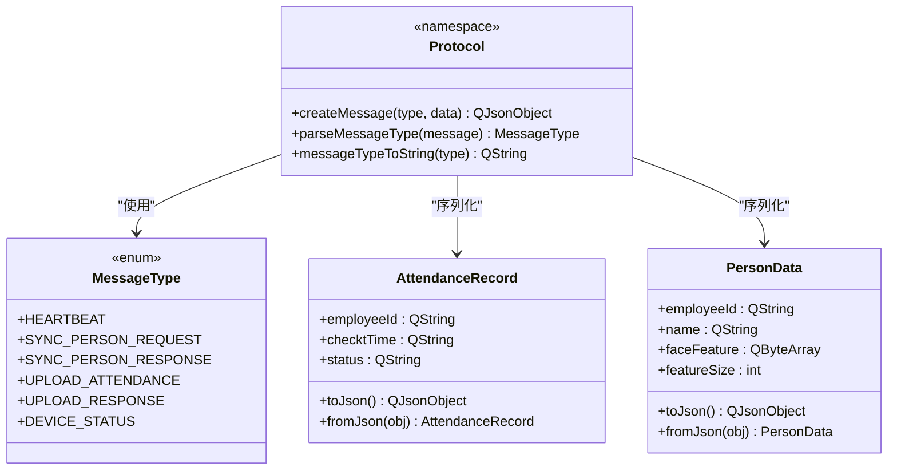
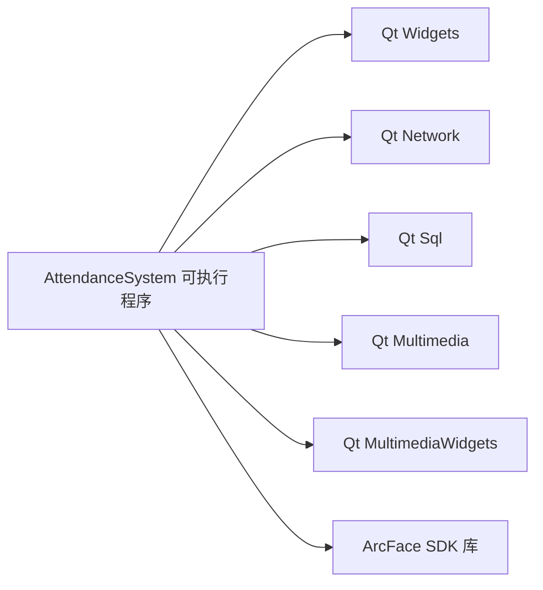

# 开发指南

<cite>
**本文引用的文件**
- [CMakeLists.txt](file://CMakeLists.txt)
- [main.cpp](file://main.cpp)
- [mainwindow.h](file://mainwindow.h)
- [mainwindow.cpp](file://mainwindow.cpp)
- [AttendanceCheckClient开发文档.md](file://AttendanceCheckClient开发文档.md)
- [CameraCapture/cameracapture.h](file://CameraCapture/cameracapture.h)
- [CameraCapture/cameracapture.cpp](file://CameraCapture/cameracapture.cpp)
- [CameraCapture/videoframecapture.h](file://CameraCapture/videoframecapture.h)
- [CameraCapture/videoframecapture.cpp](file://CameraCapture/videoframecapture.cpp)
- [FaceRecognition/arcfaceengine.h](file://FaceRecognition/arcfaceengine.h)
- [FaceRecognition/arcfaceengine.cpp](file://FaceRecognition/arcfaceengine.cpp)
- [LocalStorage/localstorage.h](file://LocalStorage/localstorage.h)
- [LocalStorage/localstorage.cpp](file://LocalStorage/localstorage.cpp)
- [NetworkClient/networkclient.h](file://NetworkClient/networkclient.h)
- [NetworkClient/networkclient.cpp](file://NetworkClient/networkclient.cpp)
- [NetworkClient/protocol.h](file://NetworkClient/protocol.h)
- [NetworkClient/protocol.cpp](file://NetworkClient/protocol.cpp)
</cite>

## 目录
1. [简介](#简介)
2. [项目结构](#项目结构)
3. [核心组件](#核心组件)
4. [架构总览](#架构总览)
5. [详细组件分析](#详细组件分析)
6. [依赖关系分析](#依赖关系分析)
7. [性能考虑](#性能考虑)
8. [故障排查指南](#故障排查指南)
9. [结论](#结论)
10. [附录](#附录)

## 简介
本开发指南面向参与“局域网智能考勤系统打卡端”的开发者，目标是帮助团队建立统一的代码规范、命名约定与架构设计原则；提供扩展开发与新功能添加流程；明确贡献指南、代码审查标准与版本管理策略；给出开发环境搭建、调试配置与测试流程；说明模块扩展方法、接口设计原则与向后兼容性保障；涵盖第三方库集成、依赖管理与版本升级策略；并规范文档编写、注释与API文档维护工作。

## 项目结构
项目采用按功能域分层的模块化组织方式，核心模块包括：
- CameraCapture：摄像头采集与视频帧捕获
- FaceRecognition：人脸识别引擎与特征管理
- LocalStorage：本地数据库与离线数据持久化
- NetworkClient：TCP 客户端、消息编解码、心跳与队列
- UI：基于 Qt 的主窗口界面
- third_party：第三方库（如 ArcFace SDK）

图表来源
- [CMakeLists.txt:19-55](file://CMakeLists.txt#L19-L55)
- [main.cpp:13-27](file://main.cpp#L13-L27)
- [mainwindow.h:11-21](file://mainwindow.h#L11-L21)
- [mainwindow.cpp:3-13](file://mainwindow.cpp#L3-L13)
- [CameraCapture/cameracapture.h:9-28](file://CameraCapture/cameracapture.h#L9-L28)
- [CameraCapture/videoframecapture.h:14-42](file://CameraCapture/videoframecapture.h#L14-L42)
- [FaceRecognition/arcfaceengine.h:21-112](file://FaceRecognition/arcfaceengine.h#L21-L112)
- [LocalStorage/localstorage.h:15-46](file://LocalStorage/localstorage.h#L15-L46)
- [NetworkClient/networkclient.h:17-73](file://NetworkClient/networkclient.h#L17-L73)
- [NetworkClient/protocol.h:15-58](file://NetworkClient/protocol.h#L15-L58)

章节来源
- [CMakeLists.txt:1-87](file://CMakeLists.txt#L1-L87)
- [main.cpp:1-28](file://main.cpp#L1-L28)
- [mainwindow.h:1-23](file://mainwindow.h#L1-L23)
- [mainwindow.cpp:1-14](file://mainwindow.cpp#L1-L14)
- [AttendanceCheckClient开发文档.md:1-121](file://AttendanceCheckClient开发文档.md#L1-L121)

## 核心组件
- 摄像头采集与视频帧捕获：负责设备发现、启动/停止、视频输出与帧回调
- 人脸识别引擎：封装 ArcSoft SDK，提供检测、特征提取、特征对比与单例管理
- 本地存储：SQLite 文件数据库，提供人员同步、打卡记录增删改查与批量上传标记
- 网络客户端：TCP 客户端、心跳、消息编解码、发送队列与断网缓存
- 协议定义：统一消息类型、结构体与序列化/反序列化

章节来源
- [CameraCapture/cameracapture.h:9-28](file://CameraCapture/cameracapture.h#L9-L28)
- [CameraCapture/cameracapture.cpp:14-71](file://CameraCapture/cameracapture.cpp#L14-L71)
- [CameraCapture/videoframecapture.h:14-42](file://CameraCapture/videoframecapture.h#L14-L42)
- [CameraCapture/videoframecapture.cpp:10-79](file://CameraCapture/videoframecapture.cpp#L10-L79)
- [FaceRecognition/arcfaceengine.h:21-112](file://FaceRecognition/arcfaceengine.h#L21-L112)
- [FaceRecognition/arcfaceengine.cpp:31-73](file://FaceRecognition/arcfaceengine.cpp#L31-L73)
- [LocalStorage/localstorage.h:15-46](file://LocalStorage/localstorage.h#L15-L46)
- [LocalStorage/localstorage.cpp:30-121](file://LocalStorage/localstorage.cpp#L30-L121)
- [NetworkClient/networkclient.h:17-73](file://NetworkClient/networkclient.h#L17-L73)
- [NetworkClient/networkclient.cpp:12-94](file://NetworkClient/networkclient.cpp#L12-L94)
- [NetworkClient/protocol.h:15-58](file://NetworkClient/protocol.h#L15-L58)
- [NetworkClient/protocol.cpp:42-61](file://NetworkClient/protocol.cpp#L42-L61)

## 架构总览
系统采用 C/S 局域网架构，打卡端作为客户端，负责：
- 采集视频帧并进行人脸识别
- 本地数据库落盘与离线缓存
- 通过 TCP 与管理端通信，定时心跳维持连接
- 断网时缓存消息，网络恢复后自动重试

图表来源
- [CameraCapture/cameracapture.cpp:14-33](file://CameraCapture/cameracapture.cpp#L14-L33)
- [CameraCapture/videoframecapture.cpp:10-79](file://CameraCapture/videoframecapture.cpp#L10-L79)
- [FaceRecognition/arcfaceengine.cpp:98-180](file://FaceRecognition/arcfaceengine.cpp#L98-L180)
- [LocalStorage/localstorage.cpp:184-224](file://LocalStorage/localstorage.cpp#L184-L224)
- [NetworkClient/networkclient.cpp:44-94](file://NetworkClient/networkclient.cpp#L44-L94)

## 详细组件分析

### 摄像头采集模块（CameraCapture）
- 职责：设备扫描、实例化、启动/停止、资源释放
- 关键点：线程安全、生命周期管理、错误日志
- 扩展建议：支持多摄像头选择、分辨率与帧率配置

图表来源
- [CameraCapture/cameracapture.h:9-28](file://CameraCapture/cameracapture.h#L9-L28)
- [CameraCapture/cameracapture.cpp:3-71](file://CameraCapture/cameracapture.cpp#L3-L71)

章节来源
- [CameraCapture/cameracapture.h:1-31](file://CameraCapture/cameracapture.h#L1-L31)
- [CameraCapture/cameracapture.cpp:1-72](file://CameraCapture/cameracapture.cpp#L1-L72)

### 视频帧捕获模块（VideoFrameCapture）
- 职责：建立捕获会话、绑定视频输出、接收帧并转换为 QImage
- 关键点：与 QVideoSink 的连接、帧处理回调、预览控件展示
- 扩展建议：支持不同像素格式、帧率控制、异步处理

图表来源
- [CameraCapture/videoframecapture.h:14-42](file://CameraCapture/videoframecapture.h#L14-L42)
- [CameraCapture/videoframecapture.cpp:6-79](file://CameraCapture/videoframecapture.cpp#L6-L79)

章节来源
- [CameraCapture/videoframecapture.h:1-45](file://CameraCapture/videoframecapture.h#L1-L45)
- [CameraCapture/videoframecapture.cpp:1-80](file://CameraCapture/videoframecapture.cpp#L1-L80)

### 人脸识别引擎（ArcFaceEngine）
- 职责：单例引擎、激活与初始化、人脸检测、特征提取、特征对比
- 关键点：像素格式转换、宽度对齐、线程安全、错误码处理
- 扩展建议：支持更多模型与算法、阈值动态调整、日志分级

图表来源
- [FaceRecognition/arcfaceengine.h:21-112](file://FaceRecognition/arcfaceengine.h#L21-L112)
- [FaceRecognition/arcfaceengine.cpp:18-73](file://FaceRecognition/arcfaceengine.cpp#L18-L73)

章节来源
- [FaceRecognition/arcfaceengine.h:1-115](file://FaceRecognition/arcfaceengine.h#L1-L115)
- [FaceRecognition/arcfaceengine.cpp:1-295](file://FaceRecognition/arcfaceengine.cpp#L1-L295)

### 本地存储模块（LocalStorage）
- 职责：数据库连接、建表与索引、人员同步、打卡记录增删改查、批量上传标记
- 关键点：事务封装、并发互斥、错误回滚、信号通知
- 扩展建议：支持增量同步、数据迁移脚本、备份与恢复

图表来源
- [LocalStorage/localstorage.h:15-46](file://LocalStorage/localstorage.h#L15-L46)
- [LocalStorage/localstorage.cpp:30-121](file://LocalStorage/localstorage.cpp#L30-L121)

章节来源
- [LocalStorage/localstorage.h:1-49](file://LocalStorage/localstorage.h#L1-L49)
- [LocalStorage/localstorage.cpp:1-346](file://LocalStorage/localstorage.cpp#L1-L346)

### 网络客户端（NetworkClient）
- 职责：连接管理、心跳、消息编解码、发送队列、断网缓存与重试
- 关键点：状态机、信号槽解耦、批量发送、错误处理
- 扩展建议：消息优先级、重试策略、TLS 加密、鉴权

图表来源
- [NetworkClient/networkclient.h:17-73](file://NetworkClient/networkclient.h#L17-L73)
- [NetworkClient/networkclient.cpp:221-312](file://NetworkClient/networkclient.cpp#L221-L312)

章节来源
- [NetworkClient/networkclient.h:1-75](file://NetworkClient/networkclient.h#L1-L75)
- [NetworkClient/networkclient.cpp:1-312](file://NetworkClient/networkclient.cpp#L1-L312)

### 协议定义（Protocol）
- 职责：消息类型枚举、结构体定义、序列化/反序列化、消息打包/解包
- 关键点：JSON 格式、类型安全、扩展性
- 扩展建议：版本字段、校验与签名、压缩传输

图表来源
- [NetworkClient/protocol.h:15-58](file://NetworkClient/protocol.h#L15-L58)
- [NetworkClient/protocol.cpp:42-61](file://NetworkClient/protocol.cpp#L42-L61)

章节来源
- [NetworkClient/protocol.h:1-61](file://NetworkClient/protocol.h#L1-L61)
- [NetworkClient/protocol.cpp:1-62](file://NetworkClient/protocol.cpp#L1-L62)

## 依赖关系分析
- 构建系统：CMake 管理 Qt 组件与第三方库链接
- 运行时依赖：Qt Widgets/Network/Sql/Multimedia/MultimediaWidgets
- 第三方库：ArcFace SDK（头文件与库文件）
- 模块间耦合：通过协议与单例进行弱耦合；网络客户端聚合多个子模块

图表来源
- [CMakeLists.txt:75-82](file://CMakeLists.txt#L75-L82)

章节来源
- [CMakeLists.txt:16-82](file://CMakeLists.txt#L16-L82)

## 性能考虑
- 图像处理：注意像素格式转换与宽度对齐，避免不必要的拷贝
- 数据库：合理索引、事务批量写入、避免频繁 IO
- 网络：批量发送、心跳间隔、断网缓存队列长度限制
- 线程：单例与互斥保护，避免竞态条件

## 故障排查指南
- 摄像头问题：确认设备扫描与实例化成功，检查启动/停止流程
- 识别失败：检查引擎初始化与激活状态、图像格式与尺寸
- 数据库异常：查看建表与索引创建日志，关注事务回滚
- 网络断开：观察心跳超时与重连机制，检查队列处理

章节来源
- [CameraCapture/cameracapture.cpp:14-71](file://CameraCapture/cameracapture.cpp#L14-L71)
- [FaceRecognition/arcfaceengine.cpp:31-73](file://FaceRecognition/arcfaceengine.cpp#L31-L73)
- [LocalStorage/localstorage.cpp:30-121](file://LocalStorage/localstorage.cpp#L30-L121)
- [NetworkClient/networkclient.cpp:108-181](file://NetworkClient/networkclient.cpp#L108-L181)

## 结论
本指南提供了从架构设计到模块实现、从开发流程到质量保障的完整参考。遵循统一的命名与代码规范、模块边界清晰、接口稳定、向后兼容，将有助于长期演进与团队协作。

## 附录

### 代码规范与命名约定
- 类名：大驼峰，如 ArcFaceEngine、VideoFrameCapture
- 方法/函数：小驼峰，如 connectDatabse、detectFace
- 常量/枚举：全大写加下划线，如 UPLOAD_ATTENDANCE
- 文件命名：模块名小写，头文件以 .h 结尾，实现以 .cpp 结尾
- 命名空间：Protocol 为纯命名空间，不使用类包装

章节来源
- [FaceRecognition/arcfaceengine.h:21-112](file://FaceRecognition/arcfaceengine.h#L21-L112)
- [NetworkClient/protocol.h:15-58](file://NetworkClient/protocol.h#L15-L58)

### 架构设计原则
- 单一职责：每个模块聚焦一个领域
- 依赖倒置：通过协议与接口解耦
- 开闭原则：对扩展开放，对修改封闭
- 向后兼容：协议字段扩展、默认值与兼容解析

章节来源
- [NetworkClient/networkclient.h:17-73](file://NetworkClient/networkclient.h#L17-L73)
- [NetworkClient/protocol.h:15-58](file://NetworkClient/protocol.h#L15-L58)

### 扩展开发指南与新功能添加流程
- 新模块接入：新增目录与 CMake 条目，声明头文件与实现文件
- 接口设计：先定义协议与数据结构，再实现具体逻辑
- 单元测试：针对关键函数（如协议编解码、数据库事务）编写测试
- 集成验证：在主窗口中接入 UI 交互，验证端到端流程

章节来源
- [CMakeLists.txt:19-55](file://CMakeLists.txt#L19-L55)
- [NetworkClient/protocol.cpp:42-61](file://NetworkClient/protocol.cpp#L42-L61)
- [mainwindow.h:11-21](file://mainwindow.h#L11-L21)

### 贡献指南、代码审查标准与版本管理策略
- 提交前检查：编译通过、单元测试通过、代码风格一致
- 代码审查：至少一名维护者同意，关注架构一致性与可维护性
- 分支策略：主干稳定，特性分支开发，发布打标签
- 版本号：语义化版本，变更日志记录重大改动

### 开发环境搭建、调试配置与测试流程
- 环境：Qt 5.15/6.x、CMake 3.16+、Windows/Linux
- 调试：启用 UTF-8 控制台编码，使用 qDebug 输出日志
- 测试：功能测试、网络断连测试、性能与稳定性测试

章节来源
- [main.cpp:15-19](file://main.cpp#L15-L19)
- [AttendanceCheckClient开发文档.md:92-106](file://AttendanceCheckClient开发文档.md#L92-L106)

### 模块扩展方法、接口设计原则与向后兼容性
- 扩展方法：新增模块目录与 CMake 条目，遵循协议与单例模式
- 接口设计：稳定的消息类型与结构体，提供序列化/反序列化
- 兼容性：保留旧字段、默认值、兼容解析函数

章节来源
- [CMakeLists.txt:19-55](file://CMakeLists.txt#L19-L55)
- [NetworkClient/protocol.h:15-58](file://NetworkClient/protocol.h#L15-L58)
- [NetworkClient/protocol.cpp:14-40](file://NetworkClient/protocol.cpp#L14-L40)

### 第三方库集成指南、依赖管理与版本升级策略
- 集成：将头文件与库文件纳入工程，CMake 中 include 与 link
- 依赖管理：集中配置在 CMakeLists.txt，避免硬编码路径
- 升级策略：先在测试环境验证，逐步替换并回归测试

章节来源
- [CMakeLists.txt:68-82](file://CMakeLists.txt#L68-L82)

### 文档编写规范、注释标准与 API 文档维护
- 注释：类与公共接口提供中文注释，解释用途与注意事项
- API 文档：协议与结构体定义清晰，示例说明典型用法
- 维护：随代码变更同步更新文档

章节来源
- [FaceRecognition/arcfaceengine.h:15-20](file://FaceRecognition/arcfaceengine.h#L15-L20)
- [NetworkClient/protocol.h:4-8](file://NetworkClient/protocol.h#L4-L8)