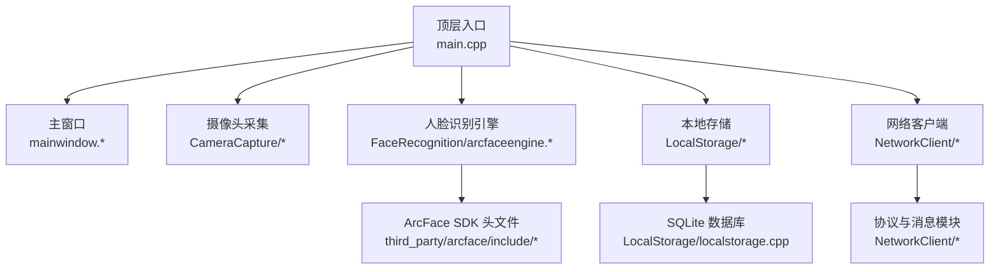
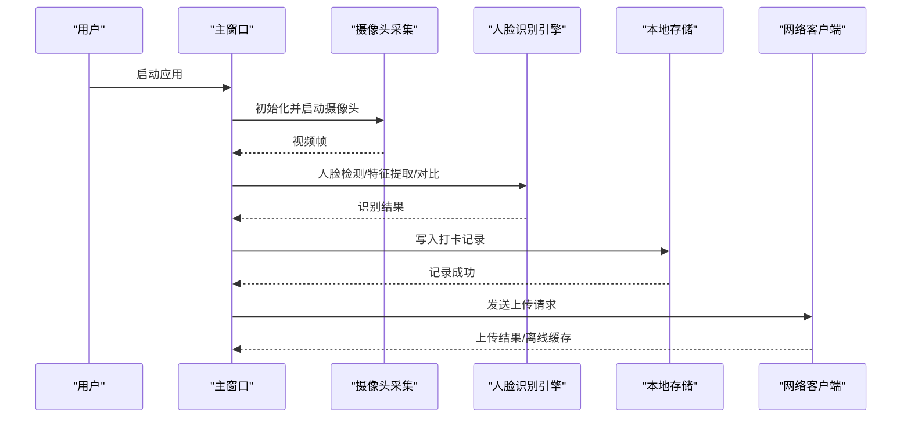
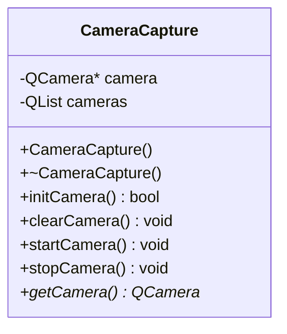
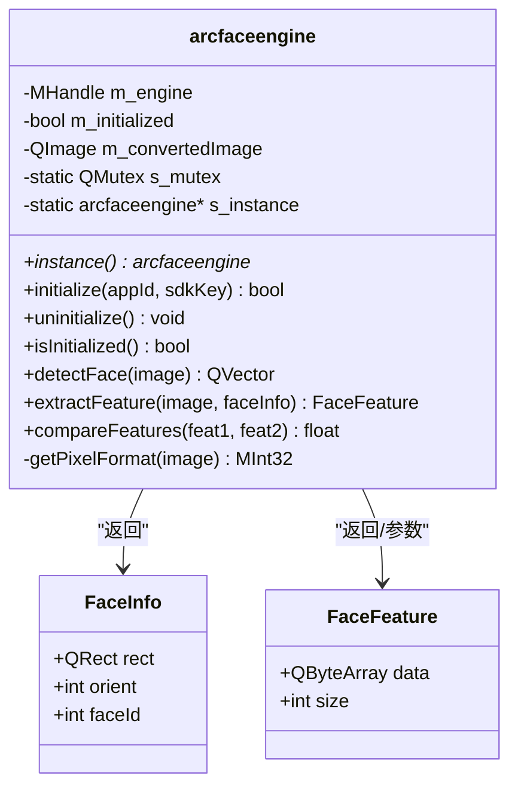
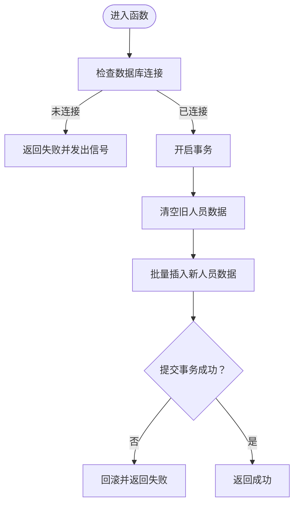
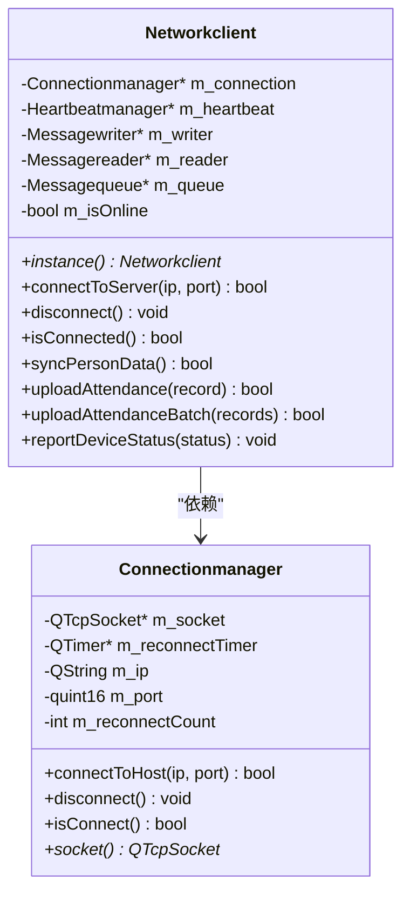
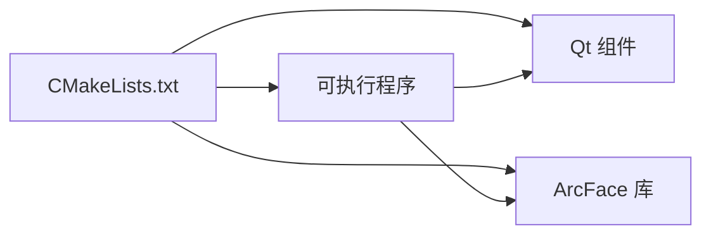

# 快速开始

<cite>
**本文引用的文件**
- [CMakeLists.txt](file://CMakeLists.txt)
- [main.cpp](file://main.cpp)
- [mainwindow.h](file://mainwindow.h)
- [mainwindow.cpp](file://mainwindow.cpp)
- [AttendanceCheckClient开发文档.md](file://AttendanceCheckClient开发文档.md)
- [arcsoft_face_sdk.h](file://third_party/arcface/include/arcsoft_face_sdk.h)
- [merror.h](file://third_party/arcface/include/merror.h)
- [arcfaceengine.h](file://FaceRecognition/arcfaceengine.h)
- [arcfaceengine.cpp](file://FaceRecognition/arcfaceengine.cpp)
- [cameracapture.h](file://CameraCapture/cameracapture.h)
- [cameracapture.cpp](file://CameraCapture/cameracapture.cpp)
- [localstorage.h](file://LocalStorage/localstorage.h)
- [localstorage.cpp](file://LocalStorage/localstorage.cpp)
- [networkclient.h](file://NetworkClient/networkclient.h)
- [connectionmanager.h](file://NetworkClient/connectionmanager.h)
</cite>

## 目录
1. [简介](#简介)
2. [项目结构](#项目结构)
3. [核心组件](#核心组件)
4. [架构总览](#架构总览)
5. [详细组件分析](#详细组件分析)
6. [依赖关系分析](#依赖关系分析)
7. [性能考虑](#性能考虑)
8. [故障排查指南](#故障排查指南)
9. [结论](#结论)
10. [附录](#附录)

## 简介
本指南面向首次接触 AttendanceSystem 的开发者，帮助你在 Windows、Linux、macOS 上快速完成环境准备、编译构建与首次运行。你将了解项目所需的技术栈（Qt、C++17、ArcFace SDK）、关键模块职责、编译安装步骤以及常见问题的解决思路。

## 项目结构
项目采用模块化组织，核心模块包括：摄像头采集、人脸识别（ArcFace）、本地存储（SQLite）、网络客户端（TCP）、UI 界面等。顶层 CMakeLists 负责统一编译配置与链接第三方库。

图表来源
- [main.cpp:13-27](file://main.cpp#L13-L27)
- [mainwindow.h:11-17](file://mainwindow.h#L11-L17)
- [CMakeLists.txt:19-55](file://CMakeLists.txt#L19-L55)

章节来源
- [CMakeLists.txt:1-87](file://CMakeLists.txt#L1-L87)
- [main.cpp:1-28](file://main.cpp#L1-L28)
- [mainwindow.h:1-23](file://mainwindow.h#L1-L23)
- [mainwindow.cpp:1-14](file://mainwindow.cpp#L1-L14)

## 核心组件
- 摄像头采集：负责扫描、初始化、启动/停止摄像头，输出视频帧供识别模块使用。
- 人脸识别引擎：封装 ArcFace SDK，提供人脸检测、特征提取、特征对比等能力，并以单例模式提供全局访问。
- 本地存储：基于 SQLite，负责人员数据同步、打卡记录的增删改查与上传状态标记。
- 网络客户端：负责与管理端建立 TCP 连接、心跳保活、消息收发、断网重连与离线缓存上传。
- UI：基于 Qt 的主窗口，承载业务交互与状态展示。

章节来源
- [cameracapture.h:9-28](file://CameraCapture/cameracapture.h#L9-L28)
- [arcfaceengine.h:21-112](file://FaceRecognition/arcfaceengine.h#L21-L112)
- [localstorage.h:15-46](file://LocalStorage/localstorage.h#L15-L46)
- [networkclient.h:17-74](file://NetworkClient/networkclient.h#L17-L74)
- [mainwindow.h:11-21](file://mainwindow.h#L11-L21)

## 架构总览
系统采用 C/S 局域网架构，客户端负责人脸采集与识别、本地记录与断网缓存、TCP 上报；服务端负责下发人员数据与接收打卡记录。核心流程：启动 → 初始化摄像头与人脸识别引擎 → 连接管理端 → 同步人员数据 → 实时采集识别 → 本地记录 → 上传或离线缓存。

图表来源
- [main.cpp:13-27](file://main.cpp#L13-L27)
- [cameracapture.cpp:14-33](file://CameraCapture/cameracapture.cpp#L14-L33)
- [arcfaceengine.cpp:97-180](file://FaceRecognition/arcfaceengine.cpp#L97-L180)
- [localstorage.cpp:183-224](file://LocalStorage/localstorage.cpp#L183-L224)
- [networkclient.h:24-34](file://NetworkClient/networkclient.h#L24-L34)

## 详细组件分析

### 摄像头采集模块
- 功能：扫描可用摄像头、初始化、启动/停止、释放资源。
- 关键点：使用 Qt 的多媒体设备接口，确保在多平台下行为一致；启动前检查设备可用性与状态。

图表来源
- [cameracapture.h:9-28](file://CameraCapture/cameracapture.h#L9-L28)
- [cameracapture.cpp:3-11](file://CameraCapture/cameracapture.cpp#L3-L11)

章节来源
- [cameracapture.h:1-31](file://CameraCapture/cameracapture.h#L1-L31)
- [cameracapture.cpp:1-72](file://CameraCapture/cameracapture.cpp#L1-L72)

### 人脸识别引擎（ArcFace）
- 功能：单例封装 ArcFace SDK，提供初始化、人脸检测、特征提取、特征对比。
- 关键点：图像格式转换（RGB/BGR）、宽度四字节对齐、错误码映射、线程安全互斥锁、生命周期管理。

图表来源
- [arcfaceengine.h:21-112](file://FaceRecognition/arcfaceengine.h#L21-L112)
- [arcfaceengine.cpp:30-79](file://FaceRecognition/arcfaceengine.cpp#L30-L79)

章节来源
- [arcfaceengine.h:1-115](file://FaceRecognition/arcfaceengine.h#L1-L115)
- [arcfaceengine.cpp:1-295](file://FaceRecognition/arcfaceengine.cpp#L1-L295)
- [merror.h:24-115](file://third_party/arcface/include/merror.h#L24-L115)

### 本地存储（SQLite）
- 功能：连接数据库、创建表与索引、人员数据同步、打卡记录增删改查、上传状态标记。
- 关键点：事务保证一致性；外键约束与索引提升查询效率；线程安全互斥锁。

图表来源
- [localstorage.cpp:123-181](file://LocalStorage/localstorage.cpp#L123-L181)

章节来源
- [localstorage.h:15-46](file://LocalStorage/localstorage.h#L15-L46)
- [localstorage.cpp:1-346](file://LocalStorage/localstorage.cpp#L1-L346)

### 网络客户端（TCP）
- 功能：连接管理、心跳保活、消息收发、断网重连、离线缓存上传。
- 关键点：模块化设计（连接、心跳、读写、队列、协议），通过单例统一对外接口。

图表来源
- [networkclient.h:17-74](file://NetworkClient/networkclient.h#L17-L74)
- [connectionmanager.h:8-42](file://NetworkClient/connectionmanager.h#L8-L42)

章节来源
- [networkclient.h:1-75](file://NetworkClient/networkclient.h#L1-L75)
- [connectionmanager.h:1-45](file://NetworkClient/connectionmanager.h#L1-L45)

## 依赖关系分析
- 构建系统：CMake 最低版本要求、C++17 标准、Qt 组件（Widgets、Network、Sql、Multimedia、MultimediaWidgets）。
- 第三方库：ArcFace SDK（头文件与库文件），按平台放置于 third_party/arcface 下。
- 运行时依赖：Qt 运行库、SQLite 驱动、系统摄像头驱动。

图表来源
- [CMakeLists.txt:16-17](file://CMakeLists.txt#L16-L17)
- [CMakeLists.txt:68-82](file://CMakeLists.txt#L68-L82)

章节来源
- [CMakeLists.txt:1-87](file://CMakeLists.txt#L1-L87)

## 性能考虑
- 图像预处理：确保输入图像格式与宽度对齐，避免 SDK 报错与性能损耗。
- 线程安全：识别引擎与数据库均使用互斥锁，避免并发冲突。
- 数据库优化：为常用查询字段建立索引，减少查询耗时。
- 网络策略：心跳保活与断线重连，降低网络抖动影响。

## 故障排查指南
- 启动后无画面
  - 检查摄像头权限与占用，确认 initCamera 成功。
  - 参考：[cameracapture.cpp:14-33](file://CameraCapture/cameracapture.cpp#L14-L33)
- 识别失败或报错
  - 确认 ArcFace SDK 激活与初始化成功，检查错误码。
  - 参考：[arcfaceengine.cpp:30-62](file://FaceRecognition/arcfaceengine.cpp#L30-L62)，[merror.h:24-115](file://third_party/arcface/include/merror.h#L24-L115)
- 无法连接管理端
  - 检查 IP/端口配置、网络连通性、心跳与重连机制。
  - 参考：[connectionmanager.h:16-18](file://NetworkClient/connectionmanager.h#L16-L18)
- 数据库无法打开或建表失败
  - 检查应用目录写权限、SQLite 驱动、数据库文件路径。
  - 参考：[localstorage.cpp:30-121](file://LocalStorage/localstorage.cpp#L30-L121)
- 上传失败或重复上传
  - 检查上传状态标记逻辑与事务提交。
  - 参考：[localstorage.cpp:260-299](file://LocalStorage/localstorage.cpp#L260-L299)

章节来源
- [cameracapture.cpp:14-33](file://CameraCapture/cameracapture.cpp#L14-L33)
- [arcfaceengine.cpp:30-62](file://FaceRecognition/arcfaceengine.cpp#L30-L62)
- [merror.h:24-115](file://third_party/arcface/include/merror.h#L24-L115)
- [connectionmanager.h:16-18](file://NetworkClient/connectionmanager.h#L16-L18)
- [localstorage.cpp:30-121](file://LocalStorage/localstorage.cpp#L30-L121)
- [localstorage.cpp:260-299](file://LocalStorage/localstorage.cpp#L260-L299)

## 结论
通过本指南，你可以在不同平台上完成 AttendanceSystem 的环境准备与编译运行。建议先验证摄像头与 ArcFace 激活，再逐步接入网络与数据库模块，最终完成端到端的识别与上传流程。

## 附录

### 环境要求
- Qt 版本：Qt 5.15 或 Qt 6.2+（CMake 自动识别）
- C++ 标准：C++17
- ArcFace SDK：按平台放置于 third_party/arcface/include 与 lib 目录
- 数据库：SQLite（Qt SQL 模块）

章节来源
- [CMakeLists.txt:9-10](file://CMakeLists.txt#L9-L10)
- [CMakeLists.txt:16-17](file://CMakeLists.txt#L16-L17)
- [CMakeLists.txt:68-73](file://CMakeLists.txt#L68-L73)

### 编译安装步骤（通用）
- 准备工作
  - 安装 Qt（含 CMake 工具链）
  - 准备 ArcFace SDK（头文件与对应平台的库文件）
- 配置与构建
  - 在项目根目录创建构建目录并配置：使用 CMake 指定 Qt 与 ArcFace 路径
  - 生成并编译工程
- 运行
  - 启动应用，确保摄像头可用、网络可达

章节来源
- [CMakeLists.txt:19-82](file://CMakeLists.txt#L19-L82)

### 首次运行指导
- 启动应用后，系统会尝试初始化摄像头与 ArcFace 引擎
- 连接管理端并同步人员数据
- 实时采集画面进行识别，识别成功后生成打卡记录
- 若网络异常，记录将被标记为未上传，待网络恢复后自动重试上传

章节来源
- [main.cpp:13-27](file://main.cpp#L13-L27)
- [AttendanceCheckClient开发文档.md:33-39](file://AttendanceCheckClient开发文档.md#L33-L39)

### 平台差异与注意事项
- Windows
  - 设置控制台编码为 UTF-8，避免日志乱码
  - 确保 ArcFace 库为 Windows 平台版本
  - 参考：[main.cpp:15-19](file://main.cpp#L15-L19)
- Linux/macOS
  - 确保 Qt Multimedia 模块可用，摄像头权限正常
  - ArcFace 库需与目标平台匹配（动态库路径正确）
- CMake 配置
  - Qt 版本自动识别（Qt6 使用 qt_add_executable 与 finalize）
  - ArcFace 头文件与库路径通过变量设置并链接

章节来源
- [main.cpp:7-11](file://main.cpp#L7-L11)
- [CMakeLists.txt:30-66](file://CMakeLists.txt#L30-L66)
- [CMakeLists.txt:68-82](file://CMakeLists.txt#L68-L82)