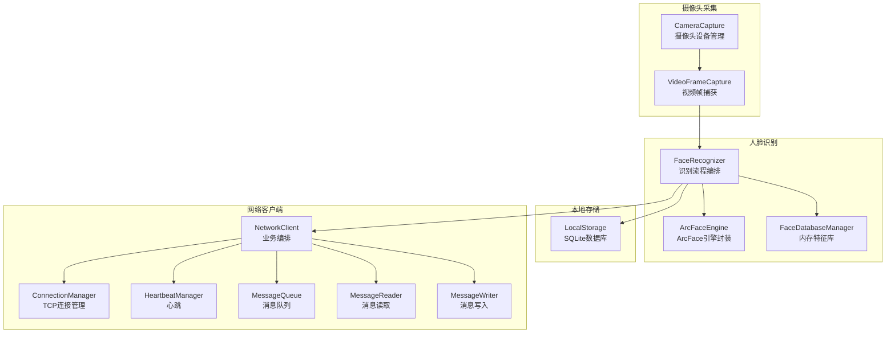
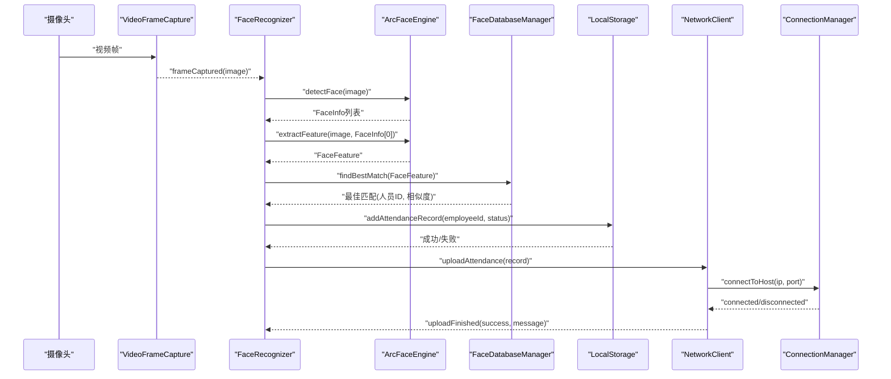
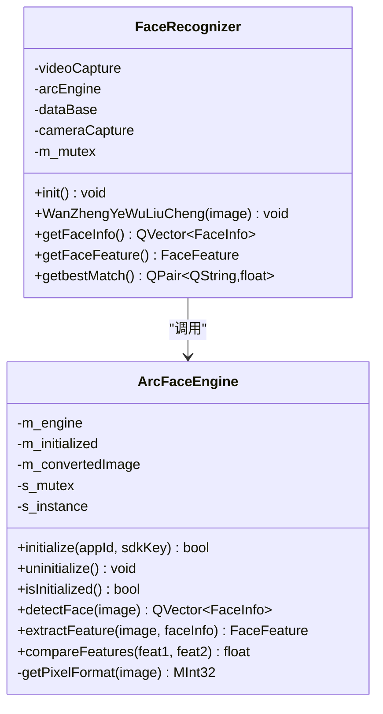
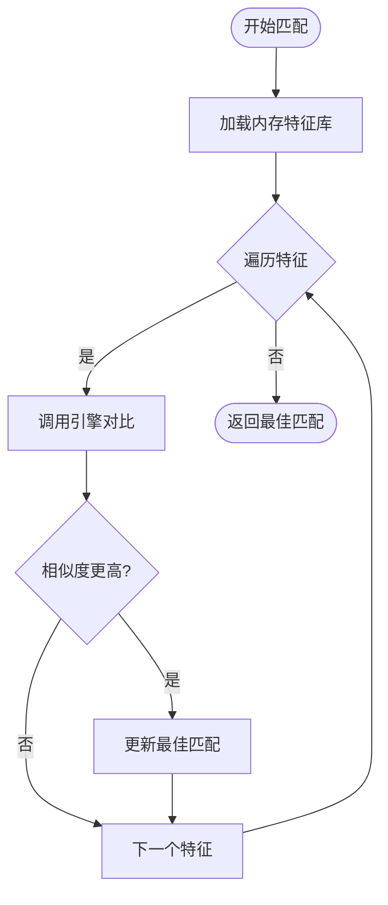
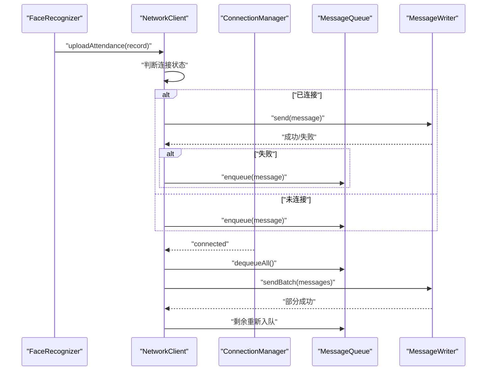
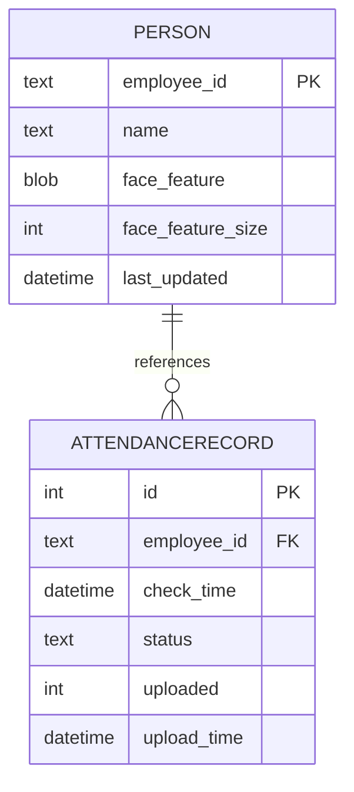
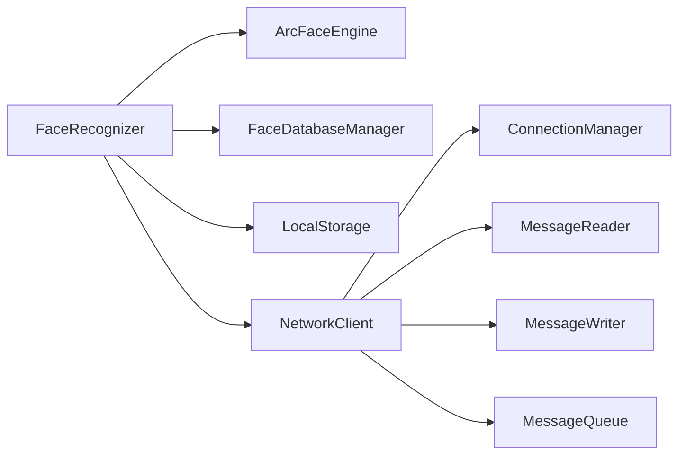

# 性能优化

<cite>
**本文引用的文件**
- [arcfaceengine.h](file://FaceRecognition/arcfaceengine.h)
- [arcfaceengine.cpp](file://FaceRecognition/arcfaceengine.cpp)
- [facerecognizer.h](file://FaceRecognition/facerecognizer.h)
- [facerecognizer.cpp](file://FaceRecognition/facerecognizer.cpp)
- [facedatabasemanager.h](file://FaceRecognition/facedatabasemanager.h)
- [facedatabasemanager.cpp](file://FaceRecognition/facedatabasemanager.cpp)
- [connectionmanager.h](file://NetworkClient/connectionmanager.h)
- [connectionmanager.cpp](file://NetworkClient/connectionmanager.cpp)
- [networkclient.h](file://NetworkClient/networkclient.h)
- [networkclient.cpp](file://NetworkClient/networkclient.cpp)
- [messagequeue.h](file://NetworkClient/messagequeue.h)
- [messagequeue.cpp](file://NetworkClient/messagequeue.cpp)
- [localstorage.h](file://LocalStorage/localstorage.h)
- [localstorage.cpp](file://LocalStorage/localstorage.cpp)
- [cameracapture.h](file://CameraCapture/cameracapture.h)
- [cameracapture.cpp](file://CameraCapture/cameracapture.cpp)
</cite>

## 目录
1. [简介](#简介)
2. [项目结构](#项目结构)
3. [核心组件](#核心组件)
4. [架构总览](#架构总览)
5. [详细组件分析](#详细组件分析)
6. [依赖关系分析](#依赖关系分析)
7. [性能考量](#性能考量)
8. [故障排查指南](#故障排查指南)
9. [结论](#结论)
10. [附录](#附录)

## 简介
本指南聚焦于人脸识别考勤系统的性能优化，围绕以下目标展开：
- 人脸识别引擎优化：ArcFace 参数调优、多线程与内存管理、实时性保障
- 网络传输优化：连接池与重连策略、消息批量发送、断网缓存与恢复
- 数据库访问优化：SQLite 索引、查询计划与事务批处理
- 通用优化技术：缓存策略、异步处理、资源复用与瓶颈识别
- 负载测试与监控：指标采集与评估方法

## 项目结构
系统采用分层模块化组织，主要模块包括：
- 摄像头采集层：负责视频帧采集与设备管理
- 人脸识别层：封装 ArcFace 引擎、特征提取与对比
- 本地存储层：SQLite 数据库与事务批处理
- 网络客户端层：连接管理、心跳、消息读写与队列缓存
- UI 层：主窗口（当前为占位）

图表来源
- [facerecognizer.cpp:20-51](file://FaceRecognition/facerecognizer.cpp#L20-L51)
- [arcfaceengine.cpp:31-73](file://FaceRecognition/arcfaceengine.cpp#L31-L73)
- [facedatabasemanager.cpp:16-49](file://FaceRecognition/facedatabasemanager.cpp#L16-L49)
- [localstorage.cpp:30-121](file://LocalStorage/localstorage.cpp#L30-L121)
- [networkclient.cpp:12-25](file://NetworkClient/networkclient.cpp#L12-L25)
- [connectionmanager.cpp:20-48](file://NetworkClient/connectionmanager.cpp#L20-L48)
- [messagequeue.cpp:8-17](file://NetworkClient/messagequeue.cpp#L8-L17)

章节来源
- [facerecognizer.h:25-58](file://FaceRecognition/facerecognizer.h#L25-L58)
- [facerecognizer.cpp:20-51](file://FaceRecognition/facerecognizer.cpp#L20-L51)
- [arcfaceengine.h:21-112](file://FaceRecognition/arcfaceengine.h#L21-L112)
- [arcfaceengine.cpp:31-73](file://FaceRecognition/arcfaceengine.cpp#L31-L73)
- [facedatabasemanager.h:9-44](file://FaceRecognition/facedatabasemanager.h#L9-L44)
- [facedatabasemanager.cpp:16-49](file://FaceRecognition/facedatabasemanager.cpp#L16-L49)
- [localstorage.h:15-46](file://LocalStorage/localstorage.h#L15-L46)
- [localstorage.cpp:30-121](file://LocalStorage/localstorage.cpp#L30-L121)
- [networkclient.h:17-73](file://NetworkClient/networkclient.h#L17-L73)
- [networkclient.cpp:12-25](file://NetworkClient/networkclient.cpp#L12-L25)
- [connectionmanager.h:8-42](file://NetworkClient/connectionmanager.h#L8-L42)
- [connectionmanager.cpp:20-48](file://NetworkClient/connectionmanager.cpp#L20-L48)
- [messagequeue.h:8-30](file://NetworkClient/messagequeue.h#L8-L30)
- [messagequeue.cpp:8-17](file://NetworkClient/messagequeue.cpp#L8-L17)

## 核心组件
- ArcFace 引擎封装：提供初始化、人脸检测、特征提取、特征对比与资源释放；内部维护单例与互斥锁，确保线程安全
- 人脸识别编排：串联摄像头采集、检测、特征提取、内存特征库对比与本地存储、网络上传
- 内存特征库：将数据库特征加载至内存，支持快速 1:N 匹配，并通过互斥锁保证并发安全
- 网络客户端：统一连接管理、心跳保活、消息读写、断网缓存与批量发送
- 本地存储：SQLite 文件数据库，提供人员同步、打卡记录增删改查与事务批处理
- 摄像头管理：设备发现、实例化、启停与句柄暴露

章节来源
- [arcfaceengine.h:21-112](file://FaceRecognition/arcfaceengine.h#L21-L112)
- [arcfaceengine.cpp:31-73](file://FaceRecognition/arcfaceengine.cpp#L31-L73)
- [facerecognizer.h:25-58](file://FaceRecognition/facerecognizer.h#L25-L58)
- [facerecognizer.cpp:20-51](file://FaceRecognition/facerecognizer.cpp#L20-L51)
- [facedatabasemanager.h:9-44](file://FaceRecognition/facedatabasemanager.h#L9-L44)
- [facedatabasemanager.cpp:58-88](file://FaceRecognition/facedatabasemanager.cpp#L58-L88)
- [networkclient.h:17-73](file://NetworkClient/networkclient.h#L17-L73)
- [networkclient.cpp:12-25](file://NetworkClient/networkclient.cpp#L12-L25)
- [localstorage.h:15-46](file://LocalStorage/localstorage.h#L15-L46)
- [localstorage.cpp:124-181](file://LocalStorage/localstorage.cpp#L124-L181)
- [cameracapture.h:9-28](file://CameraCapture/cameracapture.h#L9-L28)
- [cameracapture.cpp:14-33](file://CameraCapture/cameracapture.cpp#L14-L33)

## 架构总览
系统以“摄像头采集 → 识别编排 → 本地存储/网络上传”为主线，辅以“内存特征库”加速匹配、“消息队列”保障断网可靠传输。

图表来源
- [facerecognizer.cpp:53-88](file://FaceRecognition/facerecognizer.cpp#L53-L88)
- [arcfaceengine.cpp:98-180](file://FaceRecognition/arcfaceengine.cpp#L98-L180)
- [facedatabasemanager.cpp:58-88](file://FaceRecognition/facedatabasemanager.cpp#L58-L88)
- [localstorage.cpp:184-224](file://LocalStorage/localstorage.cpp#L184-L224)
- [networkclient.cpp:45-65](file://NetworkClient/networkclient.cpp#L45-L65)
- [connectionmanager.cpp:20-48](file://NetworkClient/connectionmanager.cpp#L20-L48)

## 详细组件分析

### 人脸识别引擎（ArcFace）优化
- 单例与线程安全：引擎封装为单例并通过互斥锁保护；建议在主线程初始化，避免多线程竞争
- 图像格式与对齐：检测与特征提取前进行 RGB→BGR 转换与宽度按 4 字节对齐，减少 SDK 内部处理开销
- 初始化参数要点（基于源码可见的调参点）
  - 检测模式：视频模式支持追踪
  - 角度模型：仅使用 0 度（正脸）以降低复杂度
  - 最小人脸尺寸：像素越小越灵敏但耗时增加
  - 最大人脸数：限制并发检测数量
- 多线程处理建议
  - 将检测/提取/对比拆分为独立线程池，避免阻塞 UI
  - 使用无锁环形缓冲区传递帧数据，降低锁竞争
- 内存管理
  - 缓存转换后的图像以复用内存，避免频繁分配
  - 对特征数据采用只读共享策略，避免重复拷贝

图表来源
- [arcfaceengine.h:21-112](file://FaceRecognition/arcfaceengine.h#L21-L112)
- [arcfaceengine.cpp:31-73](file://FaceRecognition/arcfaceengine.cpp#L31-L73)
- [facerecognizer.h:25-58](file://FaceRecognition/facerecognizer.h#L25-L58)
- [facerecognizer.cpp:20-51](file://FaceRecognition/facerecognizer.cpp#L20-L51)

章节来源
- [arcfaceengine.h:21-112](file://FaceRecognition/arcfaceengine.h#L21-L112)
- [arcfaceengine.cpp:31-73](file://FaceRecognition/arcfaceengine.cpp#L31-L73)
- [arcfaceengine.cpp:98-180](file://FaceRecognition/arcfaceengine.cpp#L98-L180)
- [arcfaceengine.cpp:183-249](file://FaceRecognition/arcfaceengine.cpp#L183-L249)
- [arcfaceengine.cpp:252-294](file://FaceRecognition/arcfaceengine.cpp#L252-L294)
- [facerecognizer.cpp:53-88](file://FaceRecognition/facerecognizer.cpp#L53-L88)

### 内存特征库与匹配优化
- 内存加载：启动时将数据库特征批量加载至内存，避免每次匹配重复 IO
- 快速 1:N 匹配：遍历内存特征，调用引擎对比，记录最高相似度与对应 ID
- 并发安全：使用互斥锁保护容器访问，避免多线程竞态
- 优化建议
  - 对特征向量进行分块缓存或 LRU 替换，控制内存占用
  - 在高并发场景引入分片锁，按人员 ID 哈希分段，降低锁粒度

图表来源
- [facedatabasemanager.cpp:58-88](file://FaceRecognition/facedatabasemanager.cpp#L58-L88)
- [arcfaceengine.cpp:252-294](file://FaceRecognition/arcfaceengine.cpp#L252-L294)

章节来源
- [facedatabasemanager.h:9-44](file://FaceRecognition/facedatabasemanager.h#L9-L44)
- [facedatabasemanager.cpp:16-49](file://FaceRecognition/facedatabasemanager.cpp#L16-L49)
- [facedatabasemanager.cpp:58-88](file://FaceRecognition/facedatabasemanager.cpp#L58-L88)

### 网络传输优化
- 连接管理：支持自动重连，指数回退上限 30 秒，避免风暴重试
- 断网缓存：消息队列在断网时缓存，恢复后批量发送
- 批量发送：支持批量上传打卡记录，减少握手与序列化开销
- 心跳保活：定期心跳检测链路健康，异常自动断开并触发重连

图表来源
- [networkclient.cpp:45-94](file://NetworkClient/networkclient.cpp#L45-L94)
- [networkclient.cpp:241-267](file://NetworkClient/networkclient.cpp#L241-L267)
- [connectionmanager.cpp:20-48](file://NetworkClient/connectionmanager.cpp#L20-L48)
- [messagequeue.cpp:33-44](file://NetworkClient/messagequeue.cpp#L33-L44)

章节来源
- [networkclient.h:17-73](file://NetworkClient/networkclient.h#L17-L73)
- [networkclient.cpp:45-94](file://NetworkClient/networkclient.cpp#L45-L94)
- [networkclient.cpp:241-267](file://NetworkClient/networkclient.cpp#L241-L267)
- [connectionmanager.h:8-42](file://NetworkClient/connectionmanager.h#L8-L42)
- [connectionmanager.cpp:20-48](file://NetworkClient/connectionmanager.cpp#L20-L48)
- [messagequeue.h:8-30](file://NetworkClient/messagequeue.h#L8-L30)
- [messagequeue.cpp:33-44](file://NetworkClient/messagequeue.cpp#L33-L44)

### SQLite 数据库访问优化
- 表结构与索引
  - 人员表：按主键与姓名建立索引，加速检索
  - 打卡记录表：按员工 ID 与时间建立索引，支持高效查询未上传记录
- 事务批处理
  - 同步人员数据与新增打卡记录均使用事务，显著降低写放大
  - 批量插入使用预编译语句与绑定参数，避免 SQL 注入与重复解析
- 查询优化
  - 未上传记录按时间升序查询，便于批量上传
  - 更新字段时使用原子更新，减少锁持有时间

图表来源
- [localstorage.cpp:69-117](file://LocalStorage/localstorage.cpp#L69-L117)

章节来源
- [localstorage.h:15-46](file://LocalStorage/localstorage.h#L15-L46)
- [localstorage.cpp:69-121](file://LocalStorage/localstorage.cpp#L69-L121)
- [localstorage.cpp:124-181](file://LocalStorage/localstorage.cpp#L124-L181)
- [localstorage.cpp:184-224](file://LocalStorage/localstorage.cpp#L184-L224)
- [localstorage.cpp:227-258](file://LocalStorage/localstorage.cpp#L227-L258)
- [localstorage.cpp:261-298](file://LocalStorage/localstorage.cpp#L261-L298)
- [localstorage.cpp:303-344](file://LocalStorage/localstorage.cpp#L303-L344)

## 依赖关系分析
- 组件耦合
  - FaceRecognizer 依赖 ArcFaceEngine、FaceDatabaseManager、LocalStorage、NetworkClient
  - NetworkClient 依赖 ConnectionManager、MessageReader、MessageWriter、MessageQueue
  - LocalStorage 与数据库驱动耦合，需关注事务与索引策略
- 外部依赖
  - ArcSoft SDK（引擎初始化、检测、提取、对比）
  - Qt 框架（QCamera、QSqlDatabase、QTcpSocket、QTimer 等）

图表来源
- [facerecognizer.cpp:20-51](file://FaceRecognition/facerecognizer.cpp#L20-L51)
- [networkclient.cpp:12-25](file://NetworkClient/networkclient.cpp#L12-L25)

章节来源
- [facerecognizer.h:25-58](file://FaceRecognition/facerecognizer.h#L25-L58)
- [networkclient.h:17-73](file://NetworkClient/networkclient.h#L17-L73)

## 性能考量

### 人脸识别实时性优化
- 减少图像转换与拷贝：在引擎内部缓存转换后的图像，避免每帧重复转换
- 降低检测复杂度：固定角度（0 度）、适当增大最小人脸尺寸以提升速度
- 多线程流水线：检测/提取/对比三阶段并行，必要时引入无锁队列
- 采样策略：对高频视频流进行降采样，如每 N 帧处理一次
- 结果缓存：对连续相同人脸的特征进行短期缓存，避免重复对比

章节来源
- [arcfaceengine.cpp:115-140](file://FaceRecognition/arcfaceengine.cpp#L115-L140)
- [arcfaceengine.cpp:197-216](file://FaceRecognition/arcfaceengine.cpp#L197-L216)
- [facerecognizer.cpp:53-88](file://FaceRecognition/facerecognizer.cpp#L53-L88)

### 网络通信效率提升
- 连接池与长连接：保持单一长连接，避免频繁握手
- 批量发送：批量上传打卡记录，减少 RTT 与序列化开销
- 断网缓存：消息队列在断网时缓存，恢复后一次性批量发送
- 心跳与重连：合理的心跳周期与指数回退，避免风暴重试
- 压缩传输：可选启用压缩（如 Gzip）以降低带宽占用（需服务端配合）

章节来源
- [networkclient.cpp:67-94](file://NetworkClient/networkclient.cpp#L67-L94)
- [networkclient.cpp:241-267](file://NetworkClient/networkclient.cpp#L241-L267)
- [connectionmanager.cpp:73-76](file://NetworkClient/connectionmanager.cpp#L73-L76)

### 数据库访问性能改进
- 索引优化：为常用查询字段建立索引（人员姓名、打卡记录员工 ID、时间）
- 事务批处理：批量插入与更新使用事务，减少日志与锁开销
- 预编译语句：绑定参数避免重复解析与注入风险
- 分页与排序：按时间升序查询未上传记录，便于分批上传
- WAL 模式：可考虑启用 WAL 以提升并发读写性能（需评估）

章节来源
- [localstorage.cpp:82-117](file://LocalStorage/localstorage.cpp#L82-L117)
- [localstorage.cpp:124-181](file://LocalStorage/localstorage.cpp#L124-L181)
- [localstorage.cpp:227-258](file://LocalStorage/localstorage.cpp#L227-L258)

### 通用优化技术
- 缓存策略：内存特征库、图像转换缓存、最近匹配结果缓存
- 异步处理：识别流程与网络上传异步化，避免阻塞主线程
- 资源复用：引擎与数据库连接复用，避免频繁创建销毁
- 监控与告警：统计识别耗时、网络发送耗时、数据库写入耗时与失败率

章节来源
- [facedatabasemanager.cpp:16-49](file://FaceRecognition/facedatabasemanager.cpp#L16-L49)
- [arcfaceengine.cpp:31-73](file://FaceRecognition/arcfaceengine.cpp#L31-L73)
- [localstorage.cpp:30-121](file://LocalStorage/localstorage.cpp#L30-L121)

## 故障排查指南
- 引擎初始化失败
  - 检查 AppId/SdkKey 是否正确
  - 确认网络可访问激活接口
- 人脸检测/提取失败
  - 检查图像格式与宽度对齐
  - 确认引擎已初始化且未被释放
- 匹配结果异常
  - 检查内存特征库是否加载成功
  - 核对相似度阈值设置
- 网络连接问题
  - 查看重连计数与延迟
  - 检查心跳超时与错误信号
- 断网后消息丢失
  - 确认消息队列是否正确入队与出队
  - 核对批量发送后的剩余消息重新入队逻辑
- 数据库写入失败
  - 检查事务开启与提交
  - 核对索引与约束冲突

章节来源
- [arcfaceengine.cpp:31-73](file://FaceRecognition/arcfaceengine.cpp#L31-L73)
- [arcfaceengine.cpp:158-161](file://FaceRecognition/arcfaceengine.cpp#L158-L161)
- [facedatabasemanager.cpp:16-49](file://FaceRecognition/facedatabasemanager.cpp#L16-L49)
- [connectionmanager.cpp:79-103](file://NetworkClient/connectionmanager.cpp#L79-L103)
- [networkclient.cpp:241-267](file://NetworkClient/networkclient.cpp#L241-L267)
- [localstorage.cpp:135-177](file://LocalStorage/localstorage.cpp#L135-L177)

## 结论
通过在引擎参数、内存特征库、网络队列与数据库事务等方面的系统性优化，可显著提升人脸识别考勤系统的实时性与稳定性。建议在生产环境中持续监控关键指标，结合负载测试迭代调参，逐步收敛性能瓶颈。

## 附录

### 性能监控指标建议
- 人脸识别
  - 检测耗时、特征提取耗时、对比耗时、帧率
  - 相似度分布、误识率、漏识率
- 网络传输
  - 连接成功率、平均重连耗时、批量发送吞吐
  - 发送失败率、队列积压时长
- 数据库访问
  - 插入/查询/更新耗时、事务提交耗时、索引命中率
  - 锁等待时间、死锁次数

### 负载测试策略
- 人脸识别：模拟不同分辨率与帧率，逐步提高并发线程数，观察 CPU/内存与 FPS 变化
- 网络传输：构造高并发上传场景，验证批量发送与断网恢复能力
- 数据库：压力写入与查询混合场景，评估索引与事务策略效果