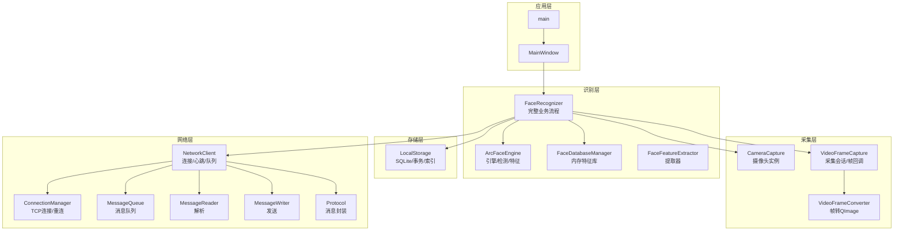
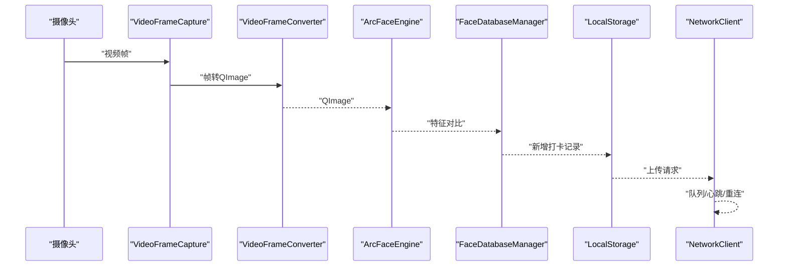
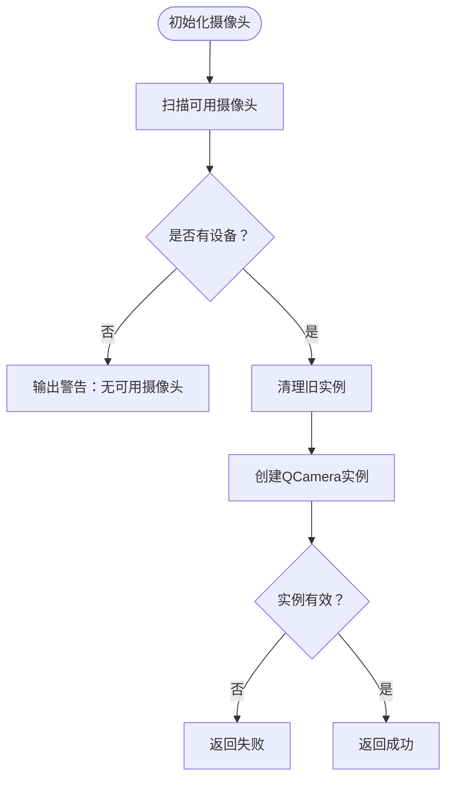
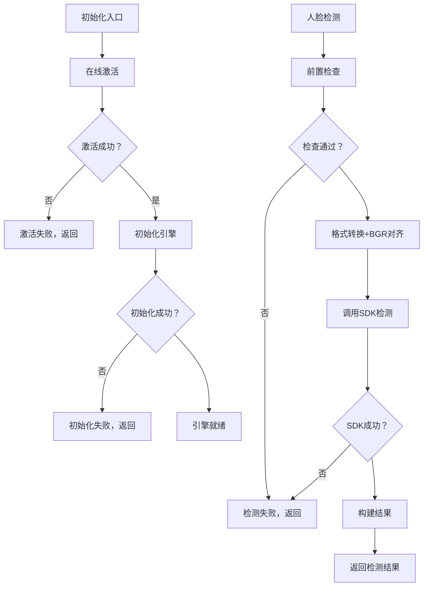
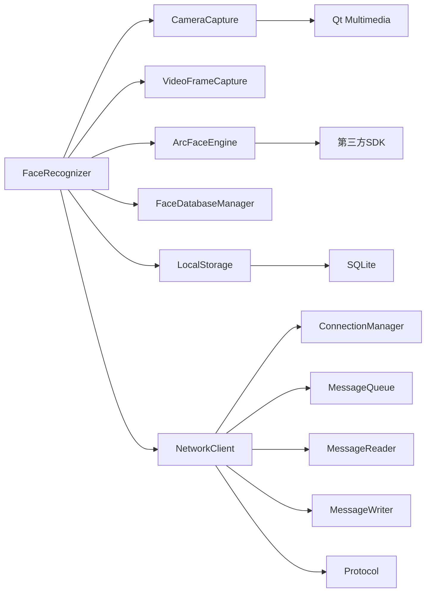

# 故障排除

<cite>
**本文引用的文件**
- [main.cpp](file://main.cpp)
- [mainwindow.cpp](file://mainwindow.cpp)
- [mainwindow.h](file://mainwindow.h)
- [CameraCapture/cameracapture.cpp](file://CameraCapture/cameracapture.cpp)
- [CameraCapture/videoframecapture.cpp](file://CameraCapture/videoframecapture.cpp)
- [CameraCapture/videoframeconverter.cpp](file://CameraCapture/videoframeconverter.cpp)
- [FaceRecognition/arcfaceengine.cpp](file://FaceRecognition/arcfaceengine.cpp)
- [FaceRecognition/facedatabasemanager.cpp](file://FaceRecognition/facedatabasemanager.cpp)
- [FaceRecognition/facefeatureextractor.cpp](file://FaceRecognition/facefeatureextractor.cpp)
- [FaceRecognition/facerecognizer.cpp](file://FaceRecognition/facerecognizer.cpp)
- [LocalStorage/localstorage.cpp](file://LocalStorage/localstorage.cpp)
- [NetworkClient/networkclient.cpp](file://NetworkClient/networkclient.cpp)
- [NetworkClient/connectionmanager.cpp](file://NetworkClient/connectionmanager.cpp)
- [NetworkClient/messagequeue.cpp](file://NetworkClient/messagequeue.cpp)
- [NetworkClient/messagereader.cpp](file://NetworkClient/messagereader.cpp)
- [NetworkClient/messagewriter.cpp](file://NetworkClient/messagewriter.cpp)
- [NetworkClient/protocol.cpp](file://NetworkClient/protocol.cpp)
- [third_party/dlib/include/dlib/error.h](file://third_party/dlib/include/dlib/error.h)
</cite>

## 目录
1. [简介](#简介)
2. [项目结构](#项目结构)
3. [核心组件](#核心组件)
4. [架构总览](#架构总览)
5. [详细组件分析](#详细组件分析)
6. [依赖关系分析](#依赖关系分析)
7. [性能考虑](#性能考虑)
8. [故障排除指南](#故障排除指南)
9. [结论](#结论)
10. [附录](#附录)

## 简介
本指南面向运维与开发人员，围绕摄像头无法识别、人脸识别失败、网络连接异常、数据库操作错误、ArcFace引擎初始化失败、网络协议错误、SQLite数据库损坏、系统性能问题与资源占用过高、内存泄漏与跨模块故障等场景，提供系统化的诊断方法、日志分析要点、状态检查流程与修复建议。文档以代码级事实为基础，辅以可视化流程图，帮助快速定位与解决问题。

## 项目结构
系统采用模块化分层设计：
- 应用入口与界面：main/mainWindow
- 摄像头采集：CameraCapture（设备发现、采集会话、帧转换）
- 人脸识别：FaceRecognition（引擎、特征提取、数据库管理、识别流程）
- 本地存储：LocalStorage（SQLite数据库初始化、事务、读写）
- 网络通信：NetworkClient（连接管理、心跳、消息队列、协议封装）

图表来源
- [main.cpp:13-27](file://main.cpp#L13-L27)
- [mainwindow.cpp:3-13](file://mainwindow.cpp#L3-L13)
- [CameraCapture/cameracapture.cpp:15-71](file://CameraCapture/cameracapture.cpp#L15-L71)
- [CameraCapture/videoframecapture.cpp:10-79](file://CameraCapture/videoframecapture.cpp#L10-L79)
- [FaceRecognition/arcfaceengine.cpp:31-73](file://FaceRecognition/arcfaceengine.cpp#L31-L73)
- [FaceRecognition/facedatabasemanager.cpp:16-49](file://FaceRecognition/facedatabasemanager.cpp#L16-L49)
- [FaceRecognition/facefeatureextractor.cpp:5-23](file://FaceRecognition/facefeatureextractor.cpp#L5-L23)
- [FaceRecognition/facerecognizer.cpp:20-88](file://FaceRecognition/facerecognizer.cpp#L20-L88)
- [LocalStorage/localstorage.cpp:30-121](file://LocalStorage/localstorage.cpp#L30-L121)
- [NetworkClient/networkclient.cpp:12-137](file://NetworkClient/networkclient.cpp#L12-L137)
- [NetworkClient/connectionmanager.cpp:20-48](file://NetworkClient/connectionmanager.cpp#L20-L48)
- [NetworkClient/messagequeue.cpp:8-66](file://NetworkClient/messagequeue.cpp#L8-L66)
- [NetworkClient/messagereader.cpp:82-94](file://NetworkClient/messagereader.cpp#L82-L94)
- [NetworkClient/messagewriter.cpp:61](file://NetworkClient/messagewriter.cpp#L61)

章节来源
- [main.cpp:13-27](file://main.cpp#L13-L27)
- [mainwindow.cpp:3-13](file://mainwindow.cpp#L3-L13)

## 核心组件
- 摄像头模块：负责设备发现、实例化、启停与帧输出；异常通常表现为“无可用摄像头”“帧无效”“无法映射”等日志。
- ArcFace引擎：负责激活、初始化、人脸检测、特征提取与特征对比；异常包括“激活失败/初始化失败/检测失败/提取失败/对比失败”等。
- 数据库模块：负责SQLite初始化、建表、索引、事务与读写；异常包括“打开失败/建表失败/事务失败/查询失败”等。
- 网络模块：负责TCP连接、心跳、消息收发与队列；异常包括“连接被拒绝/主机未找到/超时/JSON解析失败/发送失败”等。
- 识别流程：整合采集、检测、提取、对比、落库与上报，是跨模块的关键链路。

章节来源
- [CameraCapture/cameracapture.cpp:15-71](file://CameraCapture/cameracapture.cpp#L15-L71)
- [FaceRecognition/arcfaceengine.cpp:31-73](file://FaceRecognition/arcfaceengine.cpp#L31-L73)
- [LocalStorage/localstorage.cpp:30-121](file://LocalStorage/localstorage.cpp#L30-L121)
- [NetworkClient/networkclient.cpp:12-137](file://NetworkClient/networkclient.cpp#L12-L137)

## 架构总览
识别主流程：摄像头采集帧 → 转换为QImage → ArcFace检测/提取 → 内存特征库对比 → 本地落库 → 网络上报。

图表来源
- [CameraCapture/videoframecapture.cpp:71-79](file://CameraCapture/videoframecapture.cpp#L71-L79)
- [CameraCapture/videoframeconverter.cpp:19-76](file://CameraCapture/videoframeconverter.cpp#L19-L76)
- [FaceRecognition/arcfaceengine.cpp:98-180](file://FaceRecognition/arcfaceengine.cpp#L98-L180)
- [FaceRecognition/facedatabasemanager.cpp:58-88](file://FaceRecognition/facedatabasemanager.cpp#L58-L88)
- [LocalStorage/localstorage.cpp:184-224](file://LocalStorage/localstorage.cpp#L184-L224)
- [NetworkClient/networkclient.cpp:45-65](file://NetworkClient/networkclient.cpp#L45-L65)

## 详细组件分析

### 摄像头模块（CameraCapture）
- 设备发现与实例化：若无可用设备，将输出“无可用摄像头”。应检查设备权限、驱动与占用情况。
- 生命周期管理：启动/停止前检查活跃状态，释放时先stop再delete，避免资源泄漏。
- 帧处理：通过VideoFrameCapture接入QMediaCaptureSession，连接videoSink的帧变更信号，转换为QImage并发出frameCaptured信号。

图表来源
- [CameraCapture/cameracapture.cpp:5-33](file://CameraCapture/cameracapture.cpp#L5-L33)

章节来源
- [CameraCapture/cameracapture.cpp:15-71](file://CameraCapture/cameracapture.cpp#L15-L71)
- [CameraCapture/videoframecapture.cpp:22-62](file://CameraCapture/videoframecapture.cpp#L22-L62)

### ArcFace引擎（ArcFaceEngine）
- 初始化流程：在线激活（首次联网）、引擎初始化（检测/识别/年龄/性别功能掩码、视频模式、角度、最小人脸、最大人数）。
- 图像预处理：格式转换（RGB/BGR）、宽度按4字节对齐裁剪、构造SDK图像结构。
- 检测/提取/对比：分别输出错误码与日志，便于定位失败阶段。

图表来源
- [FaceRecognition/arcfaceengine.cpp:31-73](file://FaceRecognition/arcfaceengine.cpp#L31-L73)
- [FaceRecognition/arcfaceengine.cpp:98-180](file://FaceRecognition/arcfaceengine.cpp#L98-L180)

章节来源
- [FaceRecognition/arcfaceengine.cpp:31-73](file://FaceRecognition/arcfaceengine.cpp#L31-L73)
- [FaceRecognition/arcfaceengine.cpp:98-180](file://FaceRecognition/arcfaceengine.cpp#L98-L180)

### 人脸特征库（FaceDatabaseManager）
- 加载：从数据库读取特征，放入内存数组；并发访问使用互斥锁保护。
- 匹配：遍历内存特征，调用引擎对比，返回最佳匹配ID与相似度。

章节来源
- [FaceRecognition/facedatabasemanager.cpp:16-49](file://FaceRecognition/facedatabasemanager.cpp#L16-L49)
- [FaceRecognition/facedatabasemanager.cpp:58-88](file://FaceRecognition/facedatabasemanager.cpp#L58-L88)

### 识别流程（FaceRecognizer）
- 初始化：创建VideoFrameCapture、ArcFaceEngine、CameraCapture，启动摄像头，建立帧捕获信号链。
- 业务流程：检测→提取→对比→阈值判定→本地落库→网络上报。

章节来源
- [FaceRecognition/facerecognizer.cpp:20-88](file://FaceRecognition/facerecognizer.cpp#L20-L88)

### 本地存储（LocalStorage）
- 初始化：创建data目录、连接SQLite、启用外键与UTF-8、建表与索引。
- 同步/落库/查询：使用事务保证一致性；未上传记录查询与标记上传。

章节来源
- [LocalStorage/localstorage.cpp:30-121](file://LocalStorage/localstorage.cpp#L30-L121)
- [LocalStorage/localstorage.cpp:124-181](file://LocalStorage/localstorage.cpp#L124-L181)
- [LocalStorage/localstorage.cpp:184-224](file://LocalStorage/localstorage.cpp#L184-L224)
- [LocalStorage/localstorage.cpp:227-258](file://LocalStorage/localstorage.cpp#L227-L258)
- [LocalStorage/localstorage.cpp:261-299](file://LocalStorage/localstorage.cpp#L261-L299)
- [LocalStorage/localstorage.cpp:303-345](file://LocalStorage/localstorage.cpp#L303-L345)

### 网络客户端（NetworkClient）
- 连接管理：通过ConnectionManager发起TCP连接，断线自动重连；状态变化触发队列处理。
- 心跳与消息：启动心跳，监听心跳超时触发重连；消息发送失败入队，网络恢复后批量重发。
- 协议封装：统一消息类型与字段，解析未知消息并记录。

章节来源
- [NetworkClient/networkclient.cpp:12-137](file://NetworkClient/networkclient.cpp#L12-L137)
- [NetworkClient/networkclient.cpp:165-181](file://NetworkClient/networkclient.cpp#L165-L181)
- [NetworkClient/networkclient.cpp:184-203](file://NetworkClient/networkclient.cpp#L184-L203)
- [NetworkClient/networkclient.cpp:241-267](file://NetworkClient/networkclient.cpp#L241-L267)
- [NetworkClient/networkclient.cpp:269-299](file://NetworkClient/networkclient.cpp#L269-L299)
- [NetworkClient/networkclient.cpp:302-310](file://NetworkClient/networkclient.cpp#L302-L310)

### 连接管理（ConnectionManager）
- 错误分类：连接被拒绝、主机未找到、超时、网络错误等，统一映射为可读错误信息。
- 重连策略：指数回退，上限30秒，主动断开时重置计数。

章节来源
- [NetworkClient/connectionmanager.cpp:20-48](file://NetworkClient/connectionmanager.cpp#L20-L48)
- [NetworkClient/connectionmanager.cpp:79-103](file://NetworkClient/connectionmanager.cpp#L79-L103)
- [NetworkClient/connectionmanager.cpp:105-109](file://NetworkClient/connectionmanager.cpp#L105-L109)

### 消息队列（MessageQueue）
- 线程安全：入队/出队/清空均使用互斥锁；提供批量出队与队列状态查询。

章节来源
- [NetworkClient/messagequeue.cpp:8-66](file://NetworkClient/messagequeue.cpp#L8-L66)

### 协议与消息（Protocol/MessageReader/MessageWriter）
- 协议封装：统一消息类型与载荷；消息读取端对JSON解析失败进行告警与错误上报。
- 发送失败：通过错误字符串上报，便于定位网络侧问题。

章节来源
- [NetworkClient/messagereader.cpp:82-94](file://NetworkClient/messagereader.cpp#L82-L94)
- [NetworkClient/messagewriter.cpp:61](file://NetworkClient/messagewriter.cpp#L61)

## 依赖关系分析
- FaceRecognizer依赖CameraCapture、VideoFrameCapture、ArcFaceEngine、FaceDatabaseManager、LocalStorage、NetworkClient。
- ArcFaceEngine依赖第三方SDK（错误码来自SDK）。
- NetworkClient依赖ConnectionManager、MessageQueue、MessageReader、MessageWriter、Protocol。
- LocalStorage依赖SQLite驱动与事务API。
- CameraCapture依赖Qt Multimedia框架。

图表来源
- [FaceRecognition/facerecognizer.cpp:20-51](file://FaceRecognition/facerecognizer.cpp#L20-L51)
- [NetworkClient/networkclient.cpp:222-231](file://NetworkClient/networkclient.cpp#L222-L231)
- [CameraCapture/cameracapture.cpp:5-6](file://CameraCapture/cameracapture.cpp#L5-L6)

章节来源
- [FaceRecognition/facerecognizer.cpp:20-51](file://FaceRecognition/facerecognizer.cpp#L20-L51)
- [NetworkClient/networkclient.cpp:222-231](file://NetworkClient/networkclient.cpp#L222-L231)
- [CameraCapture/cameracapture.cpp:5-6](file://CameraCapture/cameracapture.cpp#L5-L6)

## 性能考虑
- 图像预处理成本：BGR转换与宽度对齐裁剪存在CPU开销，建议在低分辨率或合适帧率下运行。
- 特征对比复杂度：内存特征库规模越大，对比耗时越高；可通过索引与阈值优化减少无效对比。
- 网络队列批处理：批量发送与重试可降低网络抖动影响，但需控制队列长度避免内存压力。
- SQLite事务：批量写入使用事务可显著提升吞吐，注意异常回滚与日志记录。

[本节为通用指导，无需列出具体文件来源]

## 故障排除指南

### 一、摄像头无法识别
- 现象与日志
  - “无可用摄像头”
  - 视频帧无效/无法映射/QImage创建失败
- 诊断步骤
  1) 检查设备权限与驱动状态。
  2) 确认摄像头未被其他程序占用。
  3) 查看CameraCapture初始化日志，确认设备列表非空。
  4) 检查VideoFrameConverter的像素格式与转换路径。
- 解决方案
  - 更换USB端口/更换摄像头。
  - 在系统设置中允许应用访问摄像头。
  - 重启应用或系统后重试。
- 相关文件
  - [CameraCapture/cameracapture.cpp:18](file://CameraCapture/cameracapture.cpp#L18)
  - [CameraCapture/videoframeconverter.cpp:19-52](file://CameraCapture/videoframeconverter.cpp#L19-L52)

章节来源
- [CameraCapture/cameracapture.cpp:18](file://CameraCapture/cameracapture.cpp#L18)
- [CameraCapture/videoframeconverter.cpp:19-52](file://CameraCapture/videoframeconverter.cpp#L19-L52)

### 二、人脸识别失败
- 现象与日志
  - “引擎未初始化”“输入图像为空”
  - “人脸检测失败/特征提取失败/特征对比失败”
- 诊断步骤
  1) 确认ArcFaceEngine初始化成功日志。
  2) 检查图像格式与宽度对齐，确认BGR转换正确。
  3) 核对内存特征库是否加载成功。
  4) 检查相似度阈值是否合理。
- 解决方案
  - 重新初始化引擎（检查AppID/SdkKey与网络）。
  - 调整最小人脸尺寸、检测模式或角度限制。
  - 清空并重新加载特征库。
- 相关文件
  - [FaceRecognition/arcfaceengine.cpp:103-110](file://FaceRecognition/arcfaceengine.cpp#L103-L110)
  - [FaceRecognition/arcfaceengine.cpp:158](file://FaceRecognition/arcfaceengine.cpp#L158)
  - [FaceRecognition/arcfaceengine.cpp:238](file://FaceRecognition/arcfaceengine.cpp#L238)
  - [FaceRecognition/facedatabasemanager.cpp:16-49](file://FaceRecognition/facedatabasemanager.cpp#L16-L49)

章节来源
- [FaceRecognition/arcfaceengine.cpp:103-110](file://FaceRecognition/arcfaceengine.cpp#L103-L110)
- [FaceRecognition/arcfaceengine.cpp:158](file://FaceRecognition/arcfaceengine.cpp#L158)
- [FaceRecognition/arcfaceengine.cpp:238](file://FaceRecognition/arcfaceengine.cpp#L238)
- [FaceRecognition/facedatabasemanager.cpp:16-49](file://FaceRecognition/facedatabasemanager.cpp#L16-L49)

### 三、网络连接异常
- 现象与日志
  - “连接被拒绝，服务器未启动”
  - “主机未找到，请检查IP地址”
  - “连接超时”
  - “网络错误”
- 诊断步骤
  1) 检查目标IP与端口可达性。
  2) 查看ConnectionManager错误映射与重连计数。
  3) 确认心跳超时与断线处理逻辑。
- 解决方案
  - 修正IP/端口配置。
  - 排查防火墙与中间网络设备。
  - 适当增大超时与重连间隔。
- 相关文件
  - [NetworkClient/connectionmanager.cpp:82-103](file://NetworkClient/connectionmanager.cpp#L82-L103)
  - [NetworkClient/networkclient.cpp:206-213](file://NetworkClient/networkclient.cpp#L206-L213)

章节来源
- [NetworkClient/connectionmanager.cpp:82-103](file://NetworkClient/connectionmanager.cpp#L82-L103)
- [NetworkClient/networkclient.cpp:206-213](file://NetworkClient/networkclient.cpp#L206-L213)

### 四、数据库操作错误
- 现象与日志
  - “数据库打开失败/建表失败/事务失败/查询失败”
  - “目录创建失败”
- 诊断步骤
  1) 检查data目录是否存在与可写。
  2) 确认SQLite驱动与编码设置。
  3) 核对建表SQL与索引创建结果。
  4) 检查事务开启/提交/回滚是否成对出现。
- 解决方案
  - 手动创建data目录并赋予写权限。
  - 重建数据库与索引。
  - 修复异常事务后重试。
- 相关文件
  - [LocalStorage/localstorage.cpp:32-53](file://LocalStorage/localstorage.cpp#L32-L53)
  - [LocalStorage/localstorage.cpp:68-121](file://LocalStorage/localstorage.cpp#L68-L121)
  - [LocalStorage/localstorage.cpp:134-177](file://LocalStorage/localstorage.cpp#L134-L177)

章节来源
- [LocalStorage/localstorage.cpp:32-53](file://LocalStorage/localstorage.cpp#L32-L53)
- [LocalStorage/localstorage.cpp:68-121](file://LocalStorage/localstorage.cpp#L68-L121)
- [LocalStorage/localstorage.cpp:134-177](file://LocalStorage/localstorage.cpp#L134-L177)

### 五、ArcFace引擎初始化失败
- 现象与日志
  - “激活失败，错误码：...”
  - “初始化失败，错误码：...”
- 诊断步骤
  1) 确认AppID/SdkKey正确且网络可用。
  2) 检查初始化参数（功能掩码、检测模式、角度、最小人脸、最大人数）。
  3) 查看SDK返回的错误码含义。
- 解决方案
  - 重新联网激活或检查离线许可。
  - 调整参数以适配硬件与场景。
- 相关文件
  - [FaceRecognition/arcfaceengine.cpp:39-43](file://FaceRecognition/arcfaceengine.cpp#L39-L43)
  - [FaceRecognition/arcfaceengine.cpp:53-61](file://FaceRecognition/arcfaceengine.cpp#L53-L61)

章节来源
- [FaceRecognition/arcfaceengine.cpp:39-43](file://FaceRecognition/arcfaceengine.cpp#L39-L43)
- [FaceRecognition/arcfaceengine.cpp:53-61](file://FaceRecognition/arcfaceengine.cpp#L53-L61)

### 六、网络协议错误
- 现象与日志
  - “JSON解析失败：...（位置：...）”
  - “解析结果不是JSON对象”
  - “写入失败：...”
- 诊断步骤
  1) 检查消息体结构与字段完整性。
  2) 核对协议封装与解析两端一致。
  3) 查看MessageWriter的错误字符串。
- 解决方案
  - 修正消息格式与字段类型。
  - 统一协议版本与字段命名。
- 相关文件
  - [NetworkClient/messagereader.cpp:82-94](file://NetworkClient/messagereader.cpp#L82-L94)
  - [NetworkClient/messagewriter.cpp:61](file://NetworkClient/messagewriter.cpp#L61)

章节来源
- [NetworkClient/messagereader.cpp:82-94](file://NetworkClient/messagereader.cpp#L82-L94)
- [NetworkClient/messagewriter.cpp:61](file://NetworkClient/messagewriter.cpp#L61)

### 七、SQLite数据库损坏
- 现象与日志
  - “查询失败/事务失败/建表失败”伴随底层错误。
- 诊断步骤
  1) 备份当前数据库文件。
  2) 使用SQLite工具检查完整性（如pragma integrity_check）。
  3) 若损坏严重，删除重建并重新同步人员数据。
- 解决方案
  1) 修复：执行完整性检查与修复命令。
  2) 迁移：备份后重建数据库，重新导入人员与记录。
- 相关文件
  - [LocalStorage/localstorage.cpp:29-31](file://LocalStorage/localstorage.cpp#L29-L31)
  - [LocalStorage/localstorage.cpp:134-177](file://LocalStorage/localstorage.cpp#L134-L177)

章节来源
- [LocalStorage/localstorage.cpp:29-31](file://LocalStorage/localstorage.cpp#L29-L31)
- [LocalStorage/localstorage.cpp:134-177](file://LocalStorage/localstorage.cpp#L134-L177)

### 八、系统性能问题与资源占用过高
- 现象
  - CPU/内存持续升高；帧率下降；识别延迟增大。
- 诊断步骤
  1) 评估图像分辨率与帧率设置。
  2) 检查特征库规模与对比频率。
  3) 观察网络队列积压与批量发送策略。
  4) 监控SQLite写入频率与事务大小。
- 解决方案
  1) 降低分辨率或帧率。
  2) 优化阈值与检测参数。
  3) 控制队列长度，定期清理。
  4) 分批写入与异步处理。
- 相关文件
  - [FaceRecognition/arcfaceengine.cpp:112-152](file://FaceRecognition/arcfaceengine.cpp#L112-L152)
  - [NetworkClient/networkclient.cpp:257-266](file://NetworkClient/networkclient.cpp#L257-L266)
  - [LocalStorage/localstorage.cpp:152-177](file://LocalStorage/localstorage.cpp#L152-L177)

章节来源
- [FaceRecognition/arcfaceengine.cpp:112-152](file://FaceRecognition/arcfaceengine.cpp#L112-L152)
- [NetworkClient/networkclient.cpp:257-266](file://NetworkClient/networkclient.cpp#L257-L266)
- [LocalStorage/localstorage.cpp:152-177](file://LocalStorage/localstorage.cpp#L152-L177)

### 九、内存泄漏与资源占用
- 现象
  - 进程内存持续增长；摄像头/网络对象未释放。
- 诊断步骤
  1) 检查CameraCapture生命周期（stop→delete）。
  2) 确认ArcFaceEngine析构与uninitialize调用。
  3) 核查NetworkClient在断开时清理writer/reader。
- 解决方案
  1) 在析构中显式释放资源。
  2) 使用智能指针或RAII模式。
  3) 定期重启服务以回收异常泄漏。
- 相关文件
  - [CameraCapture/cameracapture.cpp:36-45](file://CameraCapture/cameracapture.cpp#L36-L45)
  - [FaceRecognition/arcfaceengine.cpp:12-16](file://FaceRecognition/arcfaceengine.cpp#L12-L16)
  - [NetworkClient/networkclient.cpp:141-161](file://NetworkClient/networkclient.cpp#L141-L161)

章节来源
- [CameraCapture/cameracapture.cpp:36-45](file://CameraCapture/cameracapture.cpp#L36-L45)
- [FaceRecognition/arcfaceengine.cpp:12-16](file://FaceRecognition/arcfaceengine.cpp#L12-L16)
- [NetworkClient/networkclient.cpp:141-161](file://NetworkClient/networkclient.cpp#L141-L161)

### 十、跨模块故障综合诊断
- 典型链路
  - 摄像头→采集→检测→提取→对比→落库→上报
- 关联性
  - 任一环节失败都会阻断后续流程；例如引擎未初始化会导致检测/提取失败；网络异常导致上报失败并入队；数据库异常导致落库失败。
- 诊断方法
  1) 逐段验证：摄像头→引擎→数据库→网络。
  2) 查看各模块日志中的错误码与上下文。
  3) 使用最小化流程（仅摄像头→引擎）验证核心能力。
- 相关文件
  - [FaceRecognition/facerecognizer.cpp:53-88](file://FaceRecognition/facerecognizer.cpp#L53-L88)
  - [NetworkClient/networkclient.cpp:241-267](file://NetworkClient/networkclient.cpp#L241-L267)
  - [LocalStorage/localstorage.cpp:184-224](file://LocalStorage/localstorage.cpp#L184-L224)

章节来源
- [FaceRecognition/facerecognizer.cpp:53-88](file://FaceRecognition/facerecognizer.cpp#L53-L88)
- [NetworkClient/networkclient.cpp:241-267](file://NetworkClient/networkclient.cpp#L241-L267)
- [LocalStorage/localstorage.cpp:184-224](file://LocalStorage/localstorage.cpp#L184-L224)

## 结论
本指南基于代码事实梳理了系统关键模块与故障点，提供了从日志到根因的闭环诊断路径。建议在生产环境部署时：
- 开启详细日志与错误上报；
- 制定标准化的重试与降级策略；
- 定期巡检数据库完整性与网络连通性；
- 对关键参数（分辨率、帧率、阈值、队列长度）进行基准测试与容量规划。

[本节为总结性内容，无需列出具体文件来源]

## 附录

### A. 日志分析清单
- 摄像头：设备列表、帧转换、无效帧
- 引擎：激活/初始化/检测/提取/对比日志
- 数据库：连接/建表/事务/查询
- 网络：连接/心跳/队列/解析/发送

章节来源
- [CameraCapture/videoframeconverter.cpp:19-76](file://CameraCapture/videoframeconverter.cpp#L19-L76)
- [FaceRecognition/arcfaceengine.cpp:40-72](file://FaceRecognition/arcfaceengine.cpp#L40-L72)
- [LocalStorage/localstorage.cpp:49-53](file://LocalStorage/localstorage.cpp#L49-L53)
- [NetworkClient/connectionmanager.cpp:55-62](file://NetworkClient/connectionmanager.cpp#L55-L62)

### B. 预防性维护建议
- 定期检查摄像头权限与驱动；
- 监控引擎初始化与特征库加载；
- 周期性SQLite完整性检查；
- 网络连通性与心跳健康检查；
- 队列长度与批量策略优化。

章节来源
- [NetworkClient/networkclient.cpp:122-137](file://NetworkClient/networkclient.cpp#L122-L137)
- [LocalStorage/localstorage.cpp:68-121](file://LocalStorage/localstorage.cpp#L68-L121)