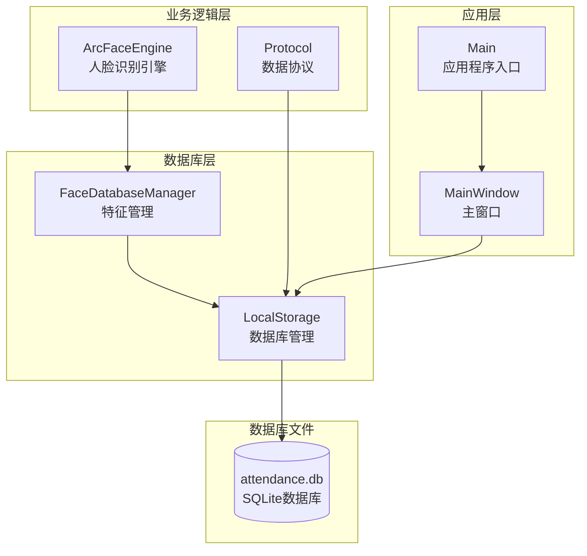
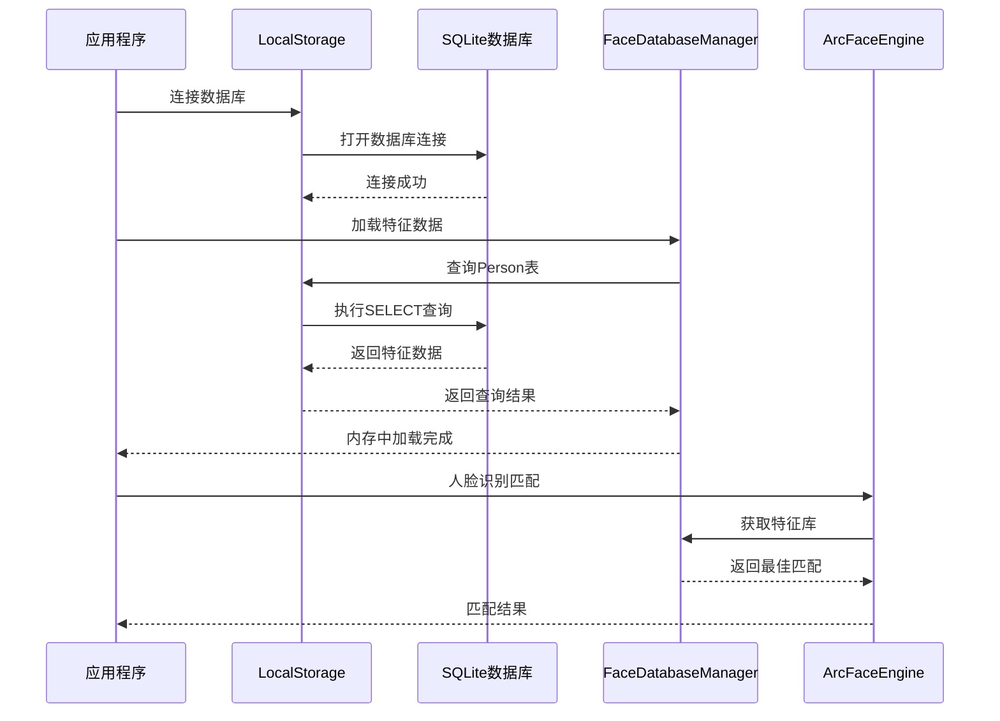
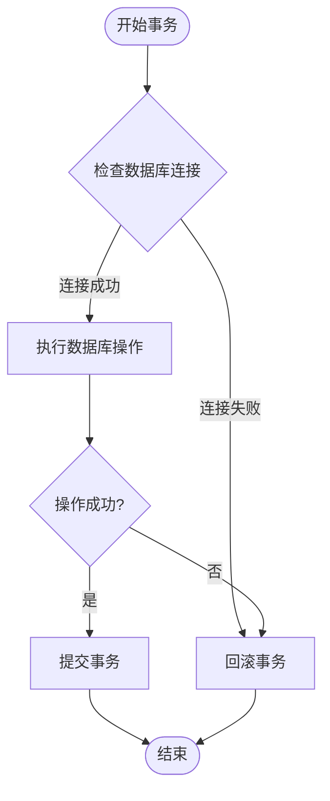
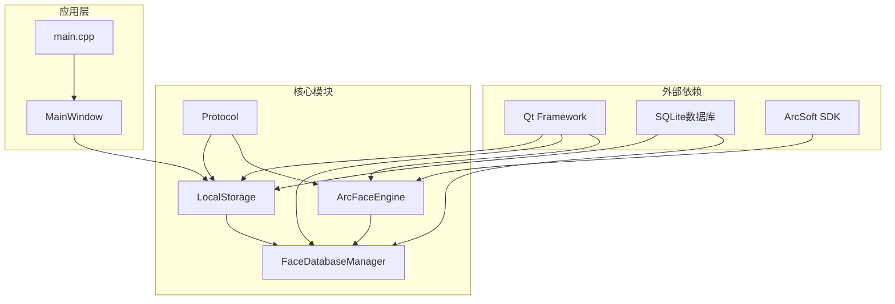

# 数据库设计

<cite>
**本文档引用的文件**
- [localstorage.h](file://LocalStorage/localstorage.h)
- [localstorage.cpp](file://LocalStorage/localstorage.cpp)
- [facedatabasemanager.h](file://FaceRecognition/facedatabasemanager.h)
- [facedatabasemanager.cpp](file://FaceRecognition/facedatabasemanager.cpp)
- [protocol.h](file://NetworkClient/protocol.h)
- [arcfaceengine.h](file://FaceRecognition/arcfaceengine.h)
- [main.cpp](file://main.cpp)
</cite>

## 目录
1. [简介](#简介)
2. [项目结构](#项目结构)
3. [核心组件](#核心组件)
4. [架构概览](#架构概览)
5. [详细组件分析](#详细组件分析)
6. [依赖关系分析](#依赖关系分析)
7. [性能考虑](#性能考虑)
8. [故障排除指南](#故障排除指南)
9. [结论](#结论)
10. [附录](#附录)

## 简介

本文件为考勤系统的数据库设计文档，专注于SQLite数据库在人员管理、打卡记录和人脸识别特征存储方面的应用。该系统采用Qt框架和SQLite数据库，实现了完整的本地数据存储解决方案，包括人员数据同步、打卡记录管理和人脸识别特征存储。

系统主要包含三个核心数据表：
- **Person表**：存储人员基本信息和人脸特征数据
- **AttendanceRecord表**：存储打卡记录和上传状态
- **人脸识别特征库**：内存中的特征数据缓存

## 项目结构

考勤系统的数据库相关组件分布如下：

**图表来源**
- [localstorage.cpp:30-121](file://LocalStorage/localstorage.cpp#L30-L121)
- [facedatabasemanager.cpp:15-49](file://FaceRecognition/facedatabasemanager.cpp#L15-L49)
- [protocol.h:15-58](file://NetworkClient/protocol.h#L15-L58)

**章节来源**
- [localstorage.h:15-46](file://LocalStorage/localstorage.h#L15-L46)
- [facedatabasemanager.h:9-44](file://FaceRecognition/facedatabasemanager.h#L9-L44)
- [protocol.h:15-58](file://NetworkClient/protocol.h#L15-L58)

## 核心组件

### 数据库连接管理

LocalStorage类负责整个数据库的连接和管理，采用单例模式确保全局唯一性。

**章节来源**
- [localstorage.h:19-23](file://LocalStorage/localstorage.h#L19-L23)
- [localstorage.cpp:8-28](file://LocalStorage/localstorage.cpp#L8-L28)

### 人员数据管理

FaceDatabaseManager类负责人脸识别特征的内存管理，提供快速的人脸匹配功能。

**章节来源**
- [facedatabasemanager.h:25-39](file://FaceRecognition/facedatabasemanager.h#L25-L39)
- [facedatabasemanager.cpp:6-13](file://FaceRecognition/facedatabasemanager.cpp#L6-L13)

### 数据协议定义

Protocol命名空间定义了系统间通信的数据结构和消息类型。

**章节来源**
- [protocol.h:15-58](file://NetworkClient/protocol.h#L15-L58)

## 架构概览

系统采用分层架构设计，数据库层通过LocalStorage类统一管理，业务逻辑层通过Protocol定义数据结构，人脸识别层通过ArcFaceEngine提供特征提取和匹配功能。

**图表来源**
- [localstorage.cpp:30-121](file://LocalStorage/localstorage.cpp#L30-L121)
- [facedatabasemanager.cpp:15-49](file://FaceRecognition/facedatabasemanager.cpp#L15-L49)
- [arcfaceengine.h:48-90](file://FaceRecognition/arcfaceengine.h#L48-L90)

## 详细组件分析

### Person表设计

Person表是系统的核心数据表，存储人员基本信息和人脸特征数据。

#### 表结构定义

| 字段名 | 数据类型 | 约束条件 | 描述 |
|--------|----------|----------|------|
| employee_id | TEXT | NOT NULL, PRIMARY KEY | 员工ID，主键 |
| name | TEXT | NOT NULL | 姓名 |
| face_feature | BLOB | NOT NULL | 人脸特征数据（二进制） |
| face_feature_size | INTEGER | NOT NULL | 特征数据大小（字节） |
| last_updated | DATETIME | DEFAULT CURRENT_TIMESTAMP | 最后更新时间 |

#### 索引设计

- **idx_person_name**: 在name字段上建立索引，优化姓名查询性能

**章节来源**
- [localstorage.cpp:69-87](file://LocalStorage/localstorage.cpp#L69-L87)

### AttendanceRecord表设计

AttendanceRecord表存储所有打卡记录，支持离线记录和在线上传功能。

#### 表结构定义

| 字段名 | 数据类型 | 约束条件 | 描述 |
|--------|----------|----------|------|
| id | INTEGER | PRIMARY KEY, AUTOINCREMENT | 记录ID，自增主键 |
| employee_id | TEXT | NOT NULL | 员工ID，外键关联Person表 |
| check_time | DATETIME | NOT NULL, DEFAULT CURRENT_TIMESTAMP | 打卡时间 |
| status | TEXT | NOT NULL, DEFAULT '正常' | 打卡状态，枚举值 |
| uploaded | INTEGER | NOT NULL, DEFAULT 0 | 上传状态标识 |
| upload_time | DATETIME | NULL | 上传时间 |

#### 外键约束和检查约束

- **外键约束**: employee_id REFERENCES Person(employee_id) ON DELETE CASCADE
- **检查约束**: status IN ('正常','迟到','早退','缺勤')

#### 索引设计

- **idx_record_employee_id**: 在employee_id字段上建立索引，优化按员工查询
- **idx_record_check_time**: 在check_time字段上建立索引，优化时间范围查询

**章节来源**
- [localstorage.cpp:89-117](file://LocalStorage/localstorage.cpp#L89-L117)

### 数据访问模式

系统采用多种数据访问模式以满足不同的业务需求：

#### 1. 事务处理模式

所有数据库操作都采用事务处理，确保数据一致性和完整性。

**图表来源**
- [localstorage.cpp:134-177](file://LocalStorage/localstorage.cpp#L134-L177)

#### 2. 批量操作模式

人员数据同步采用批量插入模式，提高数据导入效率。

**章节来源**
- [localstorage.cpp:124-181](file://LocalStorage/localstorage.cpp#L124-L181)

#### 3. 缓存访问模式

人脸识别特征采用内存缓存模式，减少数据库查询开销。

**章节来源**
- [facedatabasemanager.cpp:15-49](file://FaceRecognition/facedatabasemanager.cpp#L15-L49)

### 数据验证规则

系统实施多层次的数据验证规则：

#### 1. 数据库层面约束

- **主键约束**: 确保employee_id唯一性
- **外键约束**: 维护数据引用完整性
- **检查约束**: 限制status字段的有效值
- **默认值约束**: 自动设置时间戳和状态值

#### 2. 应用层面验证

- **业务规则验证**: 状态字段只能取特定枚举值
- **数据类型验证**: 确保数据类型正确性
- **业务逻辑验证**: 防止重复打卡等业务冲突

**章节来源**
- [localstorage.cpp:97-98](file://LocalStorage/localstorage.cpp#L97-L98)
- [protocol.h:29-39](file://NetworkClient/protocol.h#L29-L39)

## 依赖关系分析

系统各组件之间的依赖关系如下：

**图表来源**
- [localstorage.h:4-14](file://LocalStorage/localstorage.h#L4-L14)
- [facedatabasemanager.h:4-7](file://FaceRecognition/facedatabasemanager.h#L4-L7)
- [arcfaceengine.h:12-13](file://FaceRecognition/arcfaceengine.h#L12-L13)

**章节来源**
- [main.cpp:13-27](file://main.cpp#L13-L27)

## 性能考虑

### 数据库性能优化

#### 1. 索引策略

- **Person表**: 在name字段建立索引，优化人员查询
- **AttendanceRecord表**: 在employee_id和check_time字段建立复合索引
- **查询优化**: 使用适当的WHERE条件和ORDER BY子句

#### 2. 事务优化

- **批量操作**: 合理使用事务减少磁盘I/O
- **锁机制**: 使用互斥锁确保线程安全
- **错误处理**: 及时回滚失败的事务

#### 3. 内存管理

- **特征缓存**: 将常用特征数据加载到内存
- **内存清理**: 程序退出时及时清理内存资源
- **并发控制**: 使用互斥锁保护共享资源

### 缓存策略

系统采用混合缓存策略：

#### 1. 内存缓存

- **特征数据缓存**: 将Person表中的特征数据加载到内存
- **缓存更新**: 程序启动时加载，数据同步时更新
- **内存监控**: 定期检查内存使用情况

#### 2. 数据库缓存

- **连接池**: 复用数据库连接减少开销
- **预编译语句**: 使用预编译语句提高查询效率
- **批量操作**: 减少网络往返次数

**章节来源**
- [localstorage.cpp:134-177](file://LocalStorage/localstorage.cpp#L134-L177)
- [facedatabasemanager.cpp:15-49](file://FaceRecognition/facedatabasemanager.cpp#L15-L49)

## 故障排除指南

### 常见问题及解决方案

#### 1. 数据库连接失败

**症状**: 数据库无法打开或连接超时
**原因**: 
- 数据库文件权限问题
- 数据库文件损坏
- 路径配置错误

**解决方案**:
- 检查应用程序目录权限
- 验证数据库文件完整性
- 确认数据库路径配置正确

#### 2. 外键约束错误

**症状**: 删除或更新操作失败
**原因**: 存在外键约束违反
**解决方案**:
- 先删除或更新相关记录
- 检查数据一致性
- 使用级联删除功能

#### 3. 事务处理异常

**症状**: 数据库锁定或死锁
**原因**: 事务未正确提交或回滚
**解决方案**:
- 确保所有事务都有相应的提交或回滚
- 合理设置事务超时时间
- 避免长时间持有数据库锁

**章节来源**
- [localstorage.cpp:49-61](file://LocalStorage/localstorage.cpp#L49-L61)
- [localstorage.cpp:134-177](file://LocalStorage/localstorage.cpp#L134-L177)

## 结论

本考勤系统的数据库设计充分考虑了SQLite数据库的特点和考勤场景的需求。通过合理的表结构设计、完善的约束机制和优化的访问模式，系统能够高效地处理人员管理、打卡记录和人脸识别特征存储等核心业务。

系统的主要优势包括：
- **数据完整性**: 通过外键约束和检查约束确保数据一致性
- **性能优化**: 合理的索引设计和缓存策略提升查询效率
- **可靠性**: 事务处理和错误恢复机制保证数据安全
- **扩展性**: 清晰的架构设计便于功能扩展和维护

## 附录

### 示例数据

#### Person表示例数据

| employee_id | name | face_feature_size | last_updated |
|-------------|------|-------------------|--------------|
| EMP001 | 张三 | 512 | 2024-01-15 09:30:00 |
| EMP002 | 李四 | 512 | 2024-01-15 10:15:00 |

#### AttendanceRecord表示例数据

| id | employee_id | check_time | status | uploaded | upload_time |
|----|-------------|------------|--------|----------|-------------|
| 1 | EMP001 | 2024-01-15 09:30:00 | 正常 | 1 | 2024-01-15 14:20:00 |
| 2 | EMP002 | 2024-01-15 09:45:00 | 迟到 | 1 | 2024-01-15 14:22:00 |

### 数据生命周期管理

#### 数据保留策略

- **人员数据**: 永久保存，除非员工离职或数据变更
- **打卡记录**: 保存最近12个月的记录
- **系统日志**: 保存最近30天的操作日志

#### 归档规则

- **定期归档**: 每月自动归档超过保留期限的数据
- **压缩存储**: 归档数据采用压缩格式存储
- **索引重建**: 归档后重建必要的索引以保证查询性能

### 数据迁移路径

#### 版本升级流程

#### 迁移注意事项

- **数据备份**: 升级前必须完整备份所有数据
- **兼容性测试**: 确保新旧版本数据兼容
- **回滚准备**: 准备数据回滚方案
- **用户通知**: 提前通知用户系统维护计划

### 数据安全和隐私保护

#### 访问控制

- **数据库加密**: 使用SQLite加密扩展保护敏感数据
- **权限管理**: 严格控制数据库文件访问权限
- **审计日志**: 记录所有数据库访问和修改操作

#### 隐私保护

- **最小化原则**: 仅收集必要的个人信息
- **数据脱敏**: 在非生产环境中使用脱敏数据
- **合规性**: 遵循相关法律法规要求