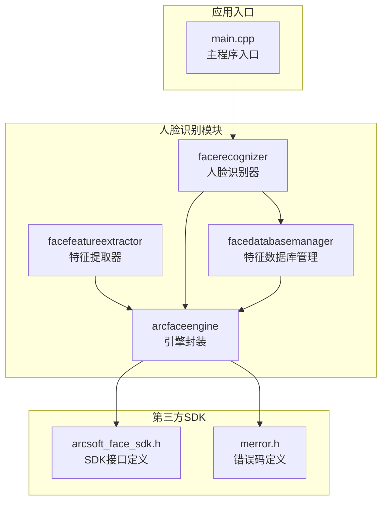
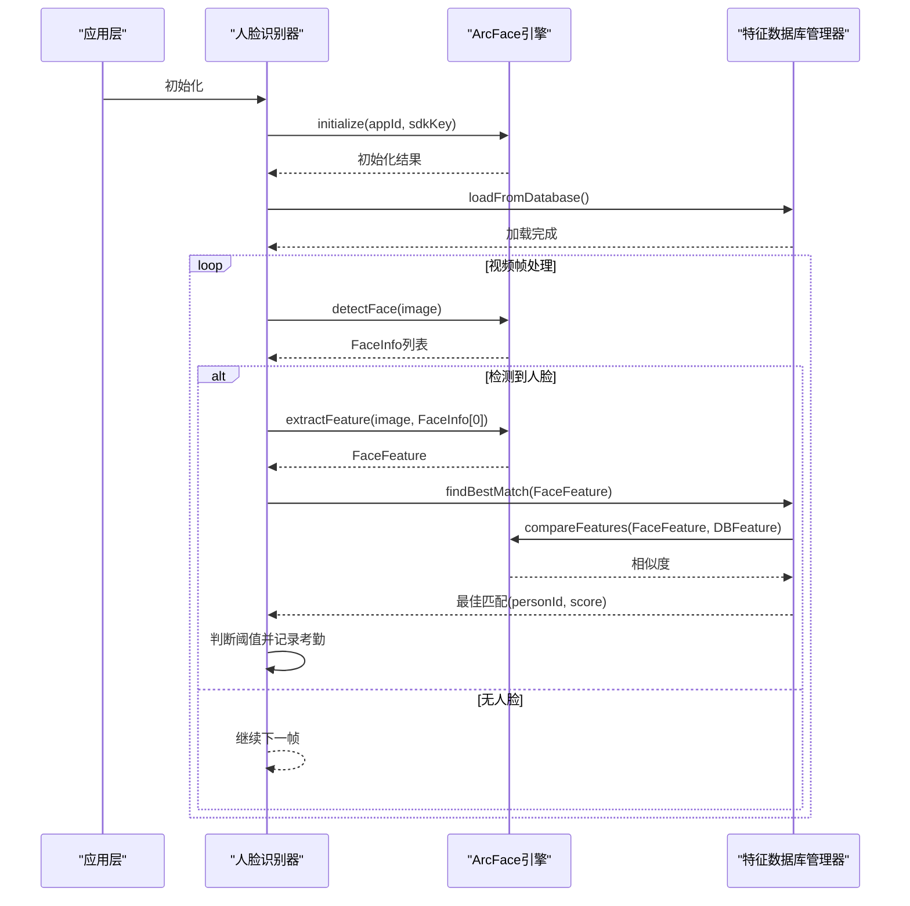
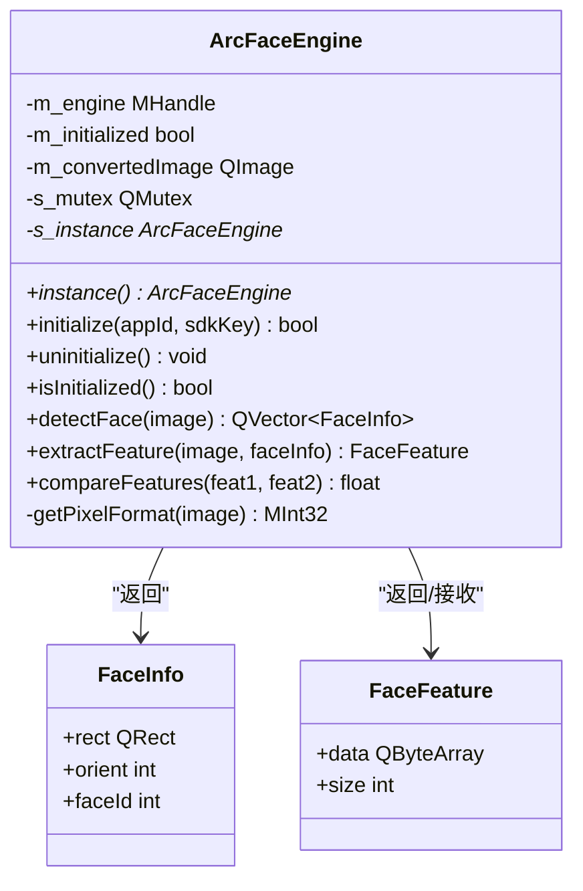
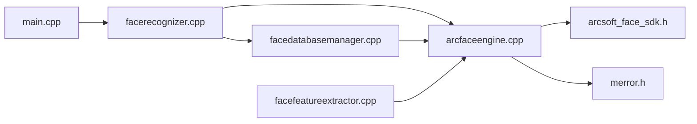

# ArcFace引擎封装

<cite>
**本文档引用的文件**
- [arcfaceengine.h](file://FaceRecognition/arcfaceengine.h)
- [arcfaceengine.cpp](file://FaceRecognition/arcfaceengine.cpp)
- [facefeatureextractor.h](file://FaceRecognition/facefeatureextractor.h)
- [facefeatureextractor.cpp](file://FaceRecognition/facefeatureextractor.cpp)
- [facerecognizer.h](file://FaceRecognition/facerecognizer.h)
- [facerecognizer.cpp](file://FaceRecognition/facerecognizer.cpp)
- [facedatabasemanager.h](file://FaceRecognition/facedatabasemanager.h)
- [facedatabasemanager.cpp](file://FaceRecognition/facedatabasemanager.cpp)
- [arcsoft_face_sdk.h](file://third_party/arcface/include/arcsoft_face_sdk.h)
- [merror.h](file://third_party/arcface/include/merror.h)
- [main.cpp](file://main.cpp)
</cite>

## 目录
1. [简介](#简介)
2. [项目结构](#项目结构)
3. [核心组件](#核心组件)
4. [架构总览](#架构总览)
5. [详细组件分析](#详细组件分析)
6. [依赖关系分析](#依赖关系分析)
7. [性能考虑](#性能考虑)
8. [故障排除指南](#故障排除指南)
9. [结论](#结论)
10. [附录](#附录)

## 简介
本技术文档围绕ArcFace引擎封装组件展开，系统性阐述了基于虹软ArcSoft SDK的人脸识别解决方案在Qt环境中的集成与封装。文档重点覆盖以下方面：
- ArcSoft SDK的集成方式与关键API映射
- 单例模式实现与线程安全机制
- 数据结构定义与用途说明（FaceInfo、FaceFeature）
- 初始化与生命周期管理（initialize、uninitialize、isInitialized）
- 核心功能实现原理与调用流程（detectFace、extractFeature、compareFeatures）
- 实际使用示例与最佳实践
- 错误处理机制、内存管理策略与性能优化建议

## 项目结构
该项目采用模块化组织，人脸识别相关逻辑集中在FaceRecognition目录，第三方SDK头文件位于third_party/arcface/include，主程序入口位于根目录。

图表来源
- [arcfaceengine.h:1-115](file://FaceRecognition/arcfaceengine.h#L1-L115)
- [arcsoft_face_sdk.h:1-379](file://third_party/arcface/include/arcsoft_face_sdk.h#L1-L379)
- [merror.h:1-119](file://third_party/arcface/include/merror.h#L1-L119)
- [facefeatureextractor.cpp:1-24](file://FaceRecognition/facefeatureextractor.cpp#L1-L24)
- [facerecognizer.cpp:1-107](file://FaceRecognition/facerecognizer.cpp#L1-L107)
- [facedatabasemanager.cpp:1-95](file://FaceRecognition/facedatabasemanager.cpp#L1-L95)
- [main.cpp:1-28](file://main.cpp#L1-L28)

章节来源
- [arcfaceengine.h:1-115](file://FaceRecognition/arcfaceengine.h#L1-L115)
- [arcsoft_face_sdk.h:1-379](file://third_party/arcface/include/arcsoft_face_sdk.h#L1-L379)
- [merror.h:1-119](file://third_party/arcface/include/merror.h#L1-L119)
- [facefeatureextractor.cpp:1-24](file://FaceRecognition/facefeatureextractor.cpp#L1-L24)
- [facerecognizer.cpp:1-107](file://FaceRecognition/facerecognizer.cpp#L1-L107)
- [facedatabasemanager.cpp:1-95](file://FaceRecognition/facedatabasemanager.cpp#L1-L95)
- [main.cpp:1-28](file://main.cpp#L1-L28)

## 核心组件
本节概述四个核心组件及其职责：
- arcfaceengine：ArcSoft SDK的高层封装，提供单例、初始化、人脸检测、特征提取、特征对比等能力
- facefeatureextractor：面向业务的特征提取器，简化单张人脸特征提取流程
- facerecognizer：人脸识别器，负责视频流处理、人脸检测、特征提取、特征对比与考勤记录
- facedatabasemanager：特征数据库管理器，负责将数据库中的人脸特征加载到内存，提供快速1:N匹配

章节来源
- [arcfaceengine.h:15-115](file://FaceRecognition/arcfaceengine.h#L15-L115)
- [facefeatureextractor.h:1-17](file://FaceRecognition/facefeatureextractor.h#L1-L17)
- [facerecognizer.h:1-61](file://FaceRecognition/facerecognizer.h#L1-L61)
- [facedatabasemanager.h:1-47](file://FaceRecognition/facedatabasemanager.h#L1-L47)

## 架构总览
ArcFace引擎封装采用分层架构：
- 应用层：facerecognizer负责业务流程编排
- 引擎层：arcfaceengine封装SDK调用，提供统一接口
- 数据层：facedatabasemanager负责特征数据的加载与匹配
- 外部依赖：ArcSoft SDK与错误码定义

图表来源
- [facerecognizer.cpp:20-88](file://FaceRecognition/facerecognizer.cpp#L20-L88)
- [arcfaceengine.cpp:31-294](file://FaceRecognition/arcfaceengine.cpp#L31-L294)
- [facedatabasemanager.cpp:16-88](file://FaceRecognition/facedatabasemanager.cpp#L16-L88)

## 详细组件分析

### ArcFace引擎封装（arcfaceengine）
arcfaceengine是整个封装的核心，提供单例模式、线程安全、初始化与生命周期管理、人脸检测、特征提取、特征对比等能力。

- 单例模式与线程安全
  - 使用静态成员变量保存实例指针与互斥锁
  - 双重检查锁实现，避免竞态条件
  - 析构函数自动释放SDK资源，防止内存泄漏

- 数据结构定义
  - FaceInfo：包含人脸矩形区域、角度方向、追踪ID
  - FaceFeature：包含二进制特征数据与大小

- 初始化流程
  - 在线激活（联网一次，后续可离线）
  - 初始化引擎，配置检测模式、角度优先级、最小人脸尺寸、最大人脸数量、功能组合
  - 设置初始化状态标志

- 图像格式转换与对齐
  - 将QImage转换为RGB888并交换R/B通道以适配SDK的BGR24格式
  - 宽度按4字节对齐，确保SDK兼容性

- 人脸检测
  - 调用ASFDetectFacesEx进行检测
  - 将SDK返回的矩形坐标转换为QRect
  - 支持视频模式下的追踪ID

- 特征提取
  - 调用ASFFaceFeatureExtractEx提取单张人脸特征
  - 将SDK特征复制到自定义结构中

- 特征对比
  - 调用ASFFaceFeatureCompare进行相似度计算
  - 返回0.0-1.0范围的置信度

图表来源
- [arcfaceengine.h:21-115](file://FaceRecognition/arcfaceengine.h#L21-L115)
- [arcfaceengine.cpp:18-294](file://FaceRecognition/arcfaceengine.cpp#L18-L294)

章节来源
- [arcfaceengine.h:15-115](file://FaceRecognition/arcfaceengine.h#L15-L115)
- [arcfaceengine.cpp:18-294](file://FaceRecognition/arcfaceengine.cpp#L18-L294)

### 特征提取器（facefeatureextractor）
该组件提供简化的特征提取接口，内部通过单例获取ArcFace引擎实例，依次执行检测与特征提取。

- 主要流程
  - 检查引擎初始化状态
  - 调用detectFace获取人脸信息
  - 若检测到人脸，提取第一个目标的特征
  - 返回FaceFeature

- 适用场景
  - 快速提取单张图片中的人脸特征
  - 作为业务层的轻量封装

章节来源
- [facefeatureextractor.h:1-17](file://FaceRecognition/facefeatureextractor.h#L1-L17)
- [facefeatureextractor.cpp:1-24](file://FaceRecognition/facefeatureextractor.cpp#L1-L24)

### 人脸识别器（facerecognizer）
人脸识别器负责完整的业务流程：初始化、视频帧捕获、人脸检测、特征提取、特征对比、考勤记录与上传。

- 初始化流程
  - 创建视频帧捕获实例并连接信号槽
  - 通过单例初始化ArcFace引擎
  - 加载特征数据库至内存
  - 初始化并启动摄像头

- 业务流程
  - 捕获视频帧后触发处理函数
  - 检测人脸，提取特征，进行1:N匹配
  - 当相似度超过阈值（如0.8）时，保存本地考勤记录并尝试上传

- 线程安全
  - 使用QMutex保护共享成员变量
  - 所有对外访问均使用QMutexLocker

章节来源
- [facerecognizer.h:1-61](file://FaceRecognition/facerecognizer.h#L1-L61)
- [facerecognizer.cpp:20-107](file://FaceRecognition/facerecognizer.cpp#L20-L107)

### 特征数据库管理器（facedatabasemanager）
负责将数据库中的人脸特征加载到内存，提供快速1:N匹配能力。

- 功能要点
  - 单例模式，确保全局唯一
  - 加载时将特征数据与大小保存到内存结构体
  - 查找最佳匹配时遍历内存中的特征，调用ArcFace引擎进行对比

- 线程安全
  - 使用QMutex保护内存中的特征库
  - 所有访问均在作用域锁内完成

章节来源
- [facedatabasemanager.h:1-47](file://FaceRecognition/facedatabasemanager.h#L1-L47)
- [facedatabasemanager.cpp:1-95](file://FaceRecognition/facedatabasemanager.cpp#L1-L95)

## 依赖关系分析
ArcFace引擎封装的依赖关系清晰，遵循“应用层-引擎层-数据层-外部SDK”的分层设计。

图表来源
- [facerecognizer.cpp:1-107](file://FaceRecognition/facerecognizer.cpp#L1-L107)
- [arcfaceengine.cpp:1-295](file://FaceRecognition/arcfaceengine.cpp#L1-L295)
- [facedatabasemanager.cpp:1-95](file://FaceRecognition/facedatabasemanager.cpp#L1-L95)
- [facefeatureextractor.cpp:1-24](file://FaceRecognition/facefeatureextractor.cpp#L1-L24)
- [arcsoft_face_sdk.h:1-379](file://third_party/arcface/include/arcsoft_face_sdk.h#L1-L379)
- [merror.h:1-119](file://third_party/arcface/include/merror.h#L1-L119)
- [main.cpp:1-28](file://main.cpp#L1-L28)

章节来源
- [facerecognizer.cpp:1-107](file://FaceRecognition/facerecognizer.cpp#L1-L107)
- [arcfaceengine.cpp:1-295](file://FaceRecognition/arcfaceengine.cpp#L1-L295)
- [facedatabasemanager.cpp:1-95](file://FaceRecognition/facedatabasemanager.cpp#L1-L95)
- [facefeatureextractor.cpp:1-24](file://FaceRecognition/facefeatureextractor.cpp#L1-L24)
- [arcsoft_face_sdk.h:1-379](file://third_party/arcface/include/arcsoft_face_sdk.h#L1-L379)
- [merror.h:1-119](file://third_party/arcface/include/merror.h#L1-L119)
- [main.cpp:1-28](file://main.cpp#L1-L28)

## 性能考虑
- 图像格式与对齐
  - 将RGB888的R/B通道交换为BGR24，满足SDK输入要求
  - 宽度按4字节对齐，减少SDK内部处理开销

- 检测参数调优
  - detectFaceScaleVal：影响最小人脸检测尺寸，数值越大检测越快但可能漏检小人脸
  - detectFaceMaxNum：限制最大检测人数，降低CPU占用
  - detectMode：VIDEO模式支持追踪，适合视频流场景

- 内存管理
  - 引擎析构时自动释放SDK资源
  - 特征数据通过QByteArray拷贝，避免悬垂指针
  - 数据库管理器使用QVector存储特征，便于快速遍历

- 线程安全
  - 单例与数据库管理器均使用互斥锁保护共享资源
  - 人脸识别器在访问共享成员变量时使用QMutexLocker

- I/O与网络
  - 激活只需联网一次，后续可离线使用
  - 考勤记录上传采用异步方式，避免阻塞主线程

[本节为通用性能指导，无需特定文件来源]

## 故障排除指南
- 初始化失败
  - 检查AppId与SDKKey是否正确
  - 确认网络连通性（首次激活需要联网）
  - 查看错误码，常见错误包括激活失败、SDK未激活、参数为空等

- 人脸检测失败
  - 确认图像格式与尺寸满足SDK要求（宽度需四字节对齐）
  - 检查引擎初始化状态与输入图像有效性

- 特征提取失败
  - 确保输入图像为RGB888并已正确转换为BGR24
  - 检查人脸区域是否包含清晰面部，角度是否在允许范围内

- 特征对比异常
  - 确认特征数据大小与二进制格式正确
  - 检查特征来源是否一致（相同SDK版本）

- 线程安全问题
  - 确保对共享资源的访问均在互斥锁保护下进行
  - 避免在多线程环境中直接修改共享数据

章节来源
- [arcfaceengine.cpp:31-73](file://FaceRecognition/arcfaceengine.cpp#L31-L73)
- [arcfaceengine.cpp:98-180](file://FaceRecognition/arcfaceengine.cpp#L98-L180)
- [arcfaceengine.cpp:183-249](file://FaceRecognition/arcfaceengine.cpp#L183-L249)
- [arcfaceengine.cpp:252-294](file://FaceRecognition/arcfaceengine.cpp#L252-L294)
- [merror.h:68-119](file://third_party/arcface/include/merror.h#L68-L119)

## 结论
ArcFace引擎封装通过清晰的分层设计与完善的错误处理机制，实现了对ArcSoft SDK的高效封装。单例模式与线程安全措施确保了系统的稳定性，而内存管理与性能优化策略则提升了运行效率。结合特征数据库管理器与人脸识别器，系统能够稳定地完成从视频流到考勤记录的完整业务流程。

[本节为总结性内容，无需特定文件来源]

## 附录

### 数据结构定义与用途
- FaceInfo
  - rect：人脸矩形区域（左上角坐标 + 宽高）
  - orient：人脸角度方向（用于特征提取时的角度校正）
  - faceId：人脸追踪ID（视频模式下用于追踪同一人脸）

- FaceFeature
  - data：特征数据（二进制格式，SDK内部定义）
  - size：特征数据大小（字节）

章节来源
- [arcfaceengine.h:25-42](file://FaceRecognition/arcfaceengine.h#L25-L42)

### 初始化与生命周期管理
- initialize(appId, sdkKey)
  - 参数：应用ID、SDK密钥
  - 功能：在线激活 + 初始化引擎
  - 返回：初始化成功返回true

- uninitialize()
  - 功能：释放SDK引擎资源

- isInitialized()
  - 功能：检查引擎初始化状态

章节来源
- [arcfaceengine.h:50-67](file://FaceRecognition/arcfaceengine.h#L50-L67)
- [arcfaceengine.cpp:31-73](file://FaceRecognition/arcfaceengine.cpp#L31-L73)

### 核心功能实现原理与调用流程
- detectFace(image)
  - 步骤：格式转换、宽度对齐、构造SDK图像结构、调用ASFDetectFacesEx、转换结果
  - 输出：人脸信息列表（包含矩形、角度、追踪ID）

- extractFeature(image, faceInfo)
  - 步骤：格式转换、宽度对齐、构造SDK图像结构、构造单人脸信息、调用ASFFaceFeatureExtractEx
  - 输出：人脸特征数据

- compareFeatures(feature1, feature2)
  - 步骤：构造SDK特征结构、调用ASFFaceFeatureCompare
  - 输出：相似度分数（0.0-1.0）

章节来源
- [arcfaceengine.cpp:98-180](file://FaceRecognition/arcfaceengine.cpp#L98-L180)
- [arcfaceengine.cpp:183-249](file://FaceRecognition/arcfaceengine.cpp#L183-L249)
- [arcfaceengine.cpp:252-294](file://FaceRecognition/arcfaceengine.cpp#L252-L294)

### 实际使用示例（步骤说明）
- 初始化引擎
  - 通过单例获取引擎实例
  - 调用initialize传入AppId与SDKKey
  - 检查初始化结果

- 人脸检测
  - 调用detectFace传入QImage
  - 检查返回的人脸信息列表

- 提取特征
  - 从检测结果中选择目标人脸
  - 调用extractFeature传入图像与人脸信息

- 计算相似度
  - 调用compareFeatures传入两个特征
  - 根据相似度阈值判断是否为同一人

章节来源
- [facefeatureextractor.cpp:5-23](file://FaceRecognition/facefeatureextractor.cpp#L5-L23)
- [facerecognizer.cpp:53-88](file://FaceRecognition/facerecognizer.cpp#L53-L88)