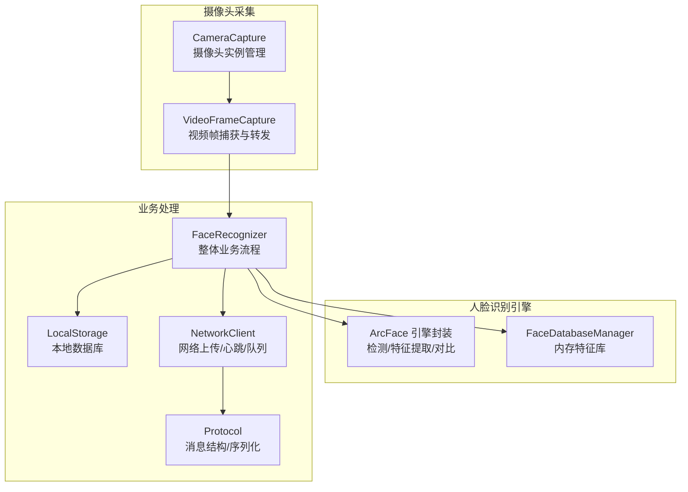
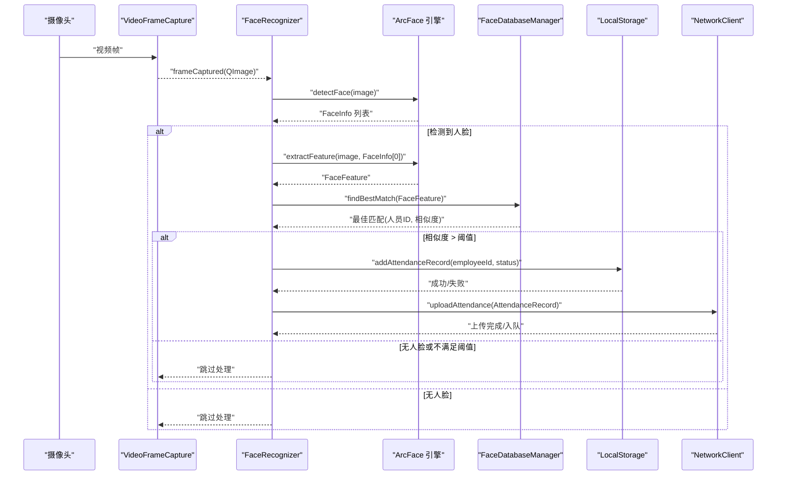
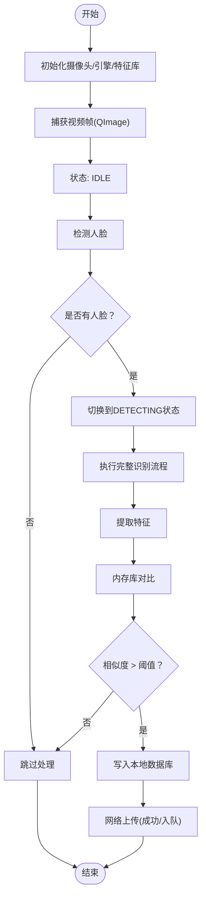
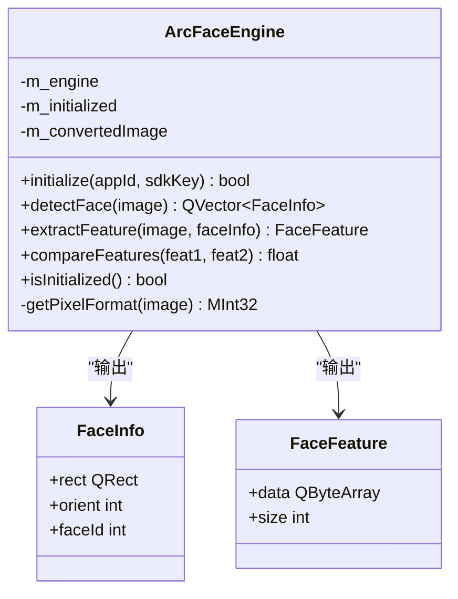
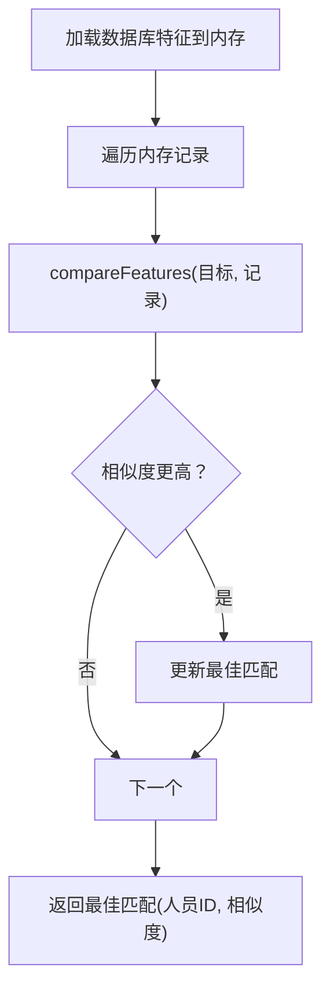
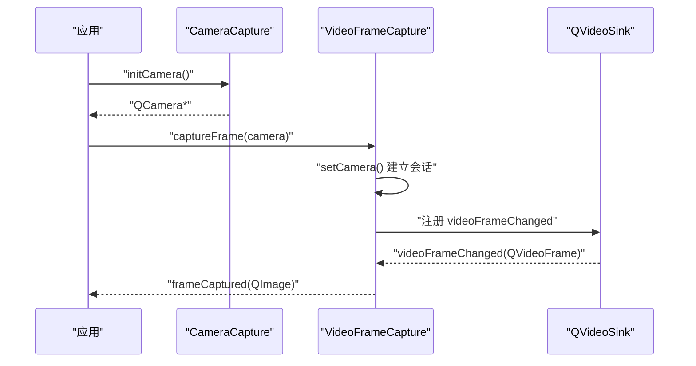
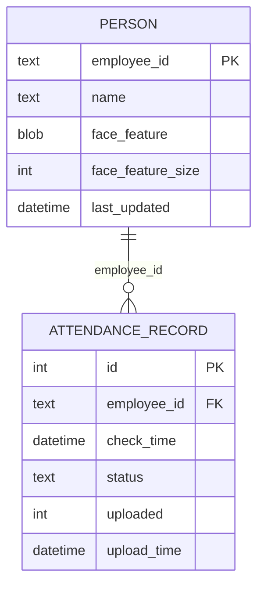
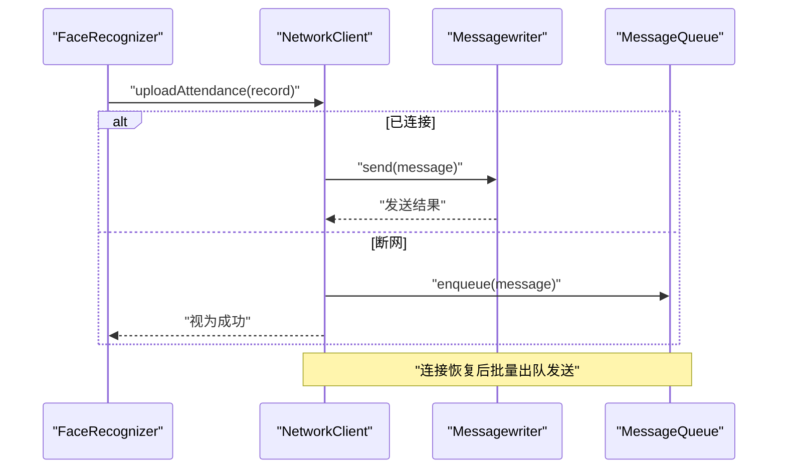
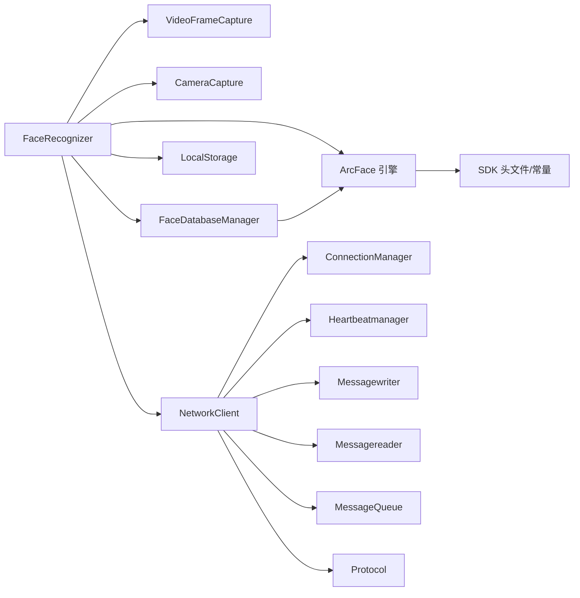
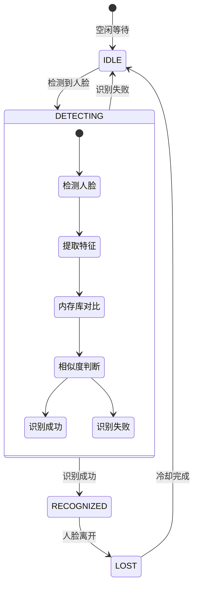

# 人脸识别器

<cite>
**本文引用的文件**
- [facerecognizer.h](file://FaceRecognition/facerecognizer.h)
- [facerecognizer.cpp](file://FaceRecognition/facerecognizer.cpp)
- [arcfaceengine.h](file://FaceRecognition/arcfaceengine.h)
- [arcfaceengine.cpp](file://FaceRecognition/arcfaceengine.cpp)
- [facefeatureextractor.h](file://FaceRecognition/facefeatureextractor.h)
- [facefeatureextractor.cpp](file://FaceRecognition/facefeatureextractor.cpp)
- [facedatabasemanager.h](file://FaceRecognition/facedatabasemanager.h)
- [facedatabasemanager.cpp](file://FaceRecognition/facedatabasemanager.cpp)
- [cameracapture.h](file://CameraCapture/cameracapture.h)
- [cameracapture.cpp](file://CameraCapture/cameracapture.cpp)
- [videoframecapture.h](file://CameraCapture/videoframecapture.h)
- [videoframecapture.cpp](file://CameraCapture/videoframecapture.cpp)
- [localstorage.h](file://LocalStorage/localstorage.h)
- [localstorage.cpp](file://LocalStorage/localstorage.cpp)
- [networkclient.h](file://NetworkClient/networkclient.h)
- [networkclient.cpp](file://NetworkClient/networkclient.cpp)
- [protocol.h](file://NetworkClient/protocol.h)
- [protocol.cpp](file://NetworkClient/protocol.cpp)
- [configmanager.h](file://Config/configmanager.h)
- [configmanager.cpp](file://Config/configmanager.cpp)
</cite>

## 更新摘要
**变更内容**
- 修复了FaceRecognizer::handleIdleState方法，将人脸检测调用从检测阶段移动到识别阶段，改善了人脸识别流程的逻辑顺序
- 更新了状态机流程图，反映了新的检测时机
- 修正了识别流程的时序关系，确保检测与识别操作的正确顺序

## 目录
1. [简介](#简介)
2. [项目结构](#项目结构)
3. [核心组件](#核心组件)
4. [架构总览](#架构总览)
5. [详细组件分析](#详细组件分析)
6. [依赖关系分析](#依赖关系分析)
7. [性能考量](#性能考量)
8. [故障排查指南](#故障排查指南)
9. [结论](#结论)
10. [附录](#附录)

## 简介
本文件为人脸识别器组件的技术文档，面向希望理解并扩展该系统的人脸识别流程、参数策略、性能优化与工程实践的读者。文档覆盖从摄像头采集、实时检测、特征提取、相似度计算、结果判定、识别阈值与误识别处理、超时控制、到识别结果后处理（时间戳、历史、统计）、以及与网络模块的集成与离线容错等全链路内容，并提供可追溯的源码路径以便进一步查阅。

## 项目结构
人脸识别子系统位于 FaceRecognition 目录，围绕"摄像头采集 → 引擎检测与特征提取 → 内存特征库对比 → 结果判定与落库/上报"的主干流程组织；同时通过 CameraCapture、VideoFrameCapture、LocalStorage、NetworkClient 等模块实现采集、存储与网络能力。

**图表来源**
- [facerecognizer.cpp:20-51](file://FaceRecognition/facerecognizer.cpp#L20-L51)
- [arcfaceengine.cpp:30-79](file://FaceRecognition/arcfaceengine.cpp#L30-L79)
- [facedatabasemanager.cpp:15-49](file://FaceRecognition/facedatabasemanager.cpp#L15-L49)
- [cameracapture.cpp:14-33](file://CameraCapture/cameracapture.cpp#L14-L33)
- [videoframecapture.cpp:10-19](file://CameraCapture/videoframecapture.cpp#L10-L19)
- [networkclient.cpp:12-25](file://NetworkClient/networkclient.cpp#L12-L25)
- [protocol.cpp:42-61](file://NetworkClient/protocol.cpp#L42-L61)

**章节来源**
- [facerecognizer.h:25-58](file://FaceRecognition/facerecognizer.h#L25-L58)
- [facerecognizer.cpp:20-51](file://FaceRecognition/facerecognizer.cpp#L20-L51)
- [arcfaceengine.h:21-112](file://FaceRecognition/arcfaceengine.h#L21-L112)
- [arcfaceengine.cpp:30-79](file://FaceRecognition/arcfaceengine.cpp#L30-L79)
- [facedatabasemanager.h:9-44](file://FaceRecognition/facedatabasemanager.h#L9-L44)
- [facedatabasemanager.cpp:15-49](file://FaceRecognition/facedatabasemanager.cpp#L15-L49)
- [cameracapture.h:9-28](file://CameraCapture/cameracapture.h#L9-L28)
- [cameracapture.cpp:14-33](file://CameraCapture/cameracapture.cpp#L14-L33)
- [videoframecapture.h:14-42](file://CameraCapture/videoframecapture.h#L14-L42)
- [videoframecapture.cpp:10-19](file://CameraCapture/videoframecapture.cpp#L10-L19)
- [localstorage.h:15-46](file://LocalStorage/localstorage.h#L15-L46)
- [localstorage.cpp:30-121](file://LocalStorage/localstorage.cpp#L30-L121)
- [networkclient.h:17-73](file://NetworkClient/networkclient.h#L17-L73)
- [networkclient.cpp:12-25](file://NetworkClient/networkclient.cpp#L12-L25)
- [protocol.h:15-58](file://NetworkClient/protocol.h#L15-L58)
- [protocol.cpp:42-61](file://NetworkClient/protocol.cpp#L42-L61)

## 核心组件
- FaceRecognizer：人脸识别器主控制器，负责初始化摄像头、视频帧捕获、人脸检测、特征提取、特征对比、结果判定与落库/上报。
- ArcFace 引擎封装：提供人脸检测、特征提取、特征对比的统一接口，内部完成像素格式转换、SDK 参数配置与错误处理。
- FaceDatabaseManager：内存特征库管理，负责从数据库加载特征、提供快速 1:N 匹配、线程安全访问。
- CameraCapture/VideoFrameCapture：摄像头实例管理与视频帧捕获，将 QVideoFrame 转换为 QImage 并发出 frameCaptured 信号。
- LocalStorage：SQLite 本地数据库，提供人员表与打卡记录表、事务性同步与上传状态标记。
- NetworkClient/Protocol：网络客户端与协议编解码，支持心跳、消息队列、离线缓存与批量上传。

**章节来源**
- [facerecognizer.h:25-58](file://FaceRecognition/facerecognizer.h#L25-L58)
- [arcfaceengine.h:21-112](file://FaceRecognition/arcfaceengine.h#L21-L112)
- [facedatabasemanager.h:9-44](file://FaceRecognition/facedatabasemanager.h#L9-L44)
- [cameracapture.h:9-28](file://CameraCapture/cameracapture.h#L9-L28)
- [videoframecapture.h:14-42](file://CameraCapture/videoframecapture.h#L14-L42)
- [localstorage.h:15-46](file://LocalStorage/localstorage.h#L15-L46)
- [networkclient.h:17-73](file://NetworkClient/networkclient.h#L17-L73)
- [protocol.h:15-58](file://NetworkClient/protocol.h#L15-L58)

## 架构总览
人脸识别端到端流程如下：

**图表来源**
- [facerecognizer.cpp:53-88](file://FaceRecognition/facerecognizer.cpp#L53-L88)
- [arcfaceengine.cpp:97-180](file://FaceRecognition/arcfaceengine.cpp#L97-L180)
- [arcfaceengine.cpp:182-249](file://FaceRecognition/arcfaceengine.cpp#L182-L249)
- [facedatabasemanager.cpp:58-88](file://FaceRecognition/facedatabasemanager.cpp#L58-L88)
- [localstorage.cpp:183-224](file://LocalStorage/localstorage.cpp#L183-L224)
- [networkclient.cpp:44-65](file://NetworkClient/networkclient.cpp#L44-L65)

## 详细组件分析

### FaceRecognizer：整体业务流程与线程安全
- 初始化流程：创建 VideoFrameCapture、连接 frameCaptured 信号；初始化 ArcFace 引擎（含 APPID/KEY）、加载内存特征库；初始化摄像头并启动捕获。
- 业务流程：在收到 QImage 后，按"检测 → 提取 → 对比 → 判定 → 落库/上报"顺序执行；使用互斥锁保护共享状态。
- 结果判定：当最佳匹配相似度超过阈值（默认 0.8）时，记录打卡并尝试上传；若网络异常则入队缓存。

**更新** 修复了状态机中的检测时机，现在在识别阶段进行人脸检测，确保检测与识别操作的正确顺序。

**图表来源**
- [facerecognizer.cpp:20-51](file://FaceRecognition/facerecognizer.cpp#L20-L51)
- [facerecognizer.cpp:53-88](file://FaceRecognition/facerecognizer.cpp#L53-L88)
- [facerecognizer.cpp:78-96](file://FaceRecognition/facerecognizer.cpp#L78-L96)

**章节来源**
- [facerecognizer.h:25-58](file://FaceRecognition/facerecognizer.h#L25-L58)
- [facerecognizer.cpp:20-51](file://FaceRecognition/facerecognizer.cpp#L20-L51)
- [facerecognizer.cpp:53-88](file://FaceRecognition/facerecognizer.cpp#L53-L88)

### ArcFace 引擎封装：检测/特征提取/对比
- 单例模式：全局仅一实例，线程安全初始化。
- 检测流程：图像格式转换（RGB/BGR 对齐与宽度对齐）、构造 SDK 图像结构、调用检测接口、转换为自定义 FaceInfo。
- 特征提取：基于检测框与角度信息提取特征，返回二进制特征向量。
- 特征对比：计算相似度（0~1），提供阈值参考（一般 0.8 以上为同一人）。

**图表来源**
- [arcfaceengine.h:21-112](file://FaceRecognition/arcfaceengine.h#L21-L112)
- [arcfaceengine.cpp:97-180](file://FaceRecognition/arcfaceengine.cpp#L97-L180)
- [arcfaceengine.cpp:182-249](file://FaceRecognition/arcfaceengine.cpp#L182-L249)
- [arcfaceengine.cpp:251-294](file://FaceRecognition/arcfaceengine.cpp#L251-L294)

**章节来源**
- [arcfaceengine.h:21-112](file://FaceRecognition/arcfaceengine.h#L21-L112)
- [arcfaceengine.cpp:30-79](file://FaceRecognition/arcfaceengine.cpp#L30-L79)
- [arcfaceengine.cpp:97-180](file://FaceRecognition/arcfaceengine.cpp#L97-L180)
- [arcfaceengine.cpp:182-249](file://FaceRecognition/arcfaceengine.cpp#L182-L249)
- [arcfaceengine.cpp:251-294](file://FaceRecognition/arcfaceengine.cpp#L251-L294)

### FaceDatabaseManager：内存特征库与 1:N 匹配
- 数据加载：从数据库读取人员特征（employee_id/name/face_feature/face_feature_size），放入内存向量。
- 匹配策略：遍历内存库，逐条与目标特征对比，记录最大相似度及对应人员 ID。
- 线程安全：使用互斥锁保护读写。

**图表来源**
- [facedatabasemanager.cpp:15-49](file://FaceRecognition/facedatabasemanager.cpp#L15-L49)
- [facedatabasemanager.cpp:58-88](file://FaceRecognition/facedatabasemanager.cpp#L58-L88)

**章节来源**
- [facedatabasemanager.h:9-44](file://FaceRecognition/facedatabasemanager.h#L9-L44)
- [facedatabasemanager.cpp:15-49](file://FaceRecognition/facedatabasemanager.cpp#L15-L49)
- [facedatabasemanager.cpp:58-88](file://FaceRecognition/facedatabasemanager.cpp#L58-L88)

### 摄像头采集与视频帧处理
- CameraCapture：扫描可用摄像头、创建 QCamera 实例、启动/停止。
- VideoFrameCapture：建立 QMediaCaptureSession，连接 QVideoSink，在回调中将 QVideoFrame 转换为 QImage 并发出 frameCaptured 信号。

**图表来源**
- [cameracapture.cpp:14-33](file://CameraCapture/cameracapture.cpp#L14-L33)
- [videoframecapture.cpp:21-62](file://CameraCapture/videoframecapture.cpp#L21-L62)
- [videoframecapture.cpp:70-79](file://CameraCapture/videoframecapture.cpp#L70-L79)

**章节来源**
- [cameracapture.h:9-28](file://CameraCapture/cameracapture.h#L9-L28)
- [cameracapture.cpp:14-33](file://CameraCapture/cameracapture.cpp#L14-L33)
- [videoframecapture.h:14-42](file://CameraCapture/videoframecapture.h#L14-L42)
- [videoframecapture.cpp:21-62](file://CameraCapture/videoframecapture.cpp#L21-L62)
- [videoframecapture.cpp:70-79](file://CameraCapture/videoframecapture.cpp#L70-L79)

### 本地存储与识别后处理
- 数据库初始化：创建 Person 与 AttendanceRecord 表，设置索引与约束。
- 事务性写入：同步人员数据、添加打卡记录均使用事务，失败回滚。
- 上传状态：记录 uploaded/upload_time 字段，支持批量标记与查询未上传记录。

**图表来源**
- [localstorage.cpp:68-121](file://LocalStorage/localstorage.cpp#L68-L121)
- [localstorage.cpp:183-224](file://LocalStorage/localstorage.cpp#L183-L224)
- [localstorage.cpp:226-258](file://LocalStorage/localstorage.cpp#L226-L258)

**章节来源**
- [localstorage.h:15-46](file://LocalStorage/localstorage.h#L15-L46)
- [localstorage.cpp:30-121](file://LocalStorage/localstorage.cpp#L30-L121)
- [localstorage.cpp:183-224](file://LocalStorage/localstorage.cpp#L183-L224)
- [localstorage.cpp:226-258](file://LocalStorage/localstorage.cpp#L226-L258)

### 网络客户端与协议
- 连接管理：ConnectionManager 提供连接/断开与状态变化信号；HeartbeatManager 维持心跳；MessageQueue 缓存待发送消息。
- 业务接口：同步人员数据、上传打卡记录（单条/批量）、上报设备状态。
- 协议编解码：Protocol 定义消息类型与结构体，提供 JSON 序列化/反序列化。

**图表来源**
- [networkclient.cpp:44-65](file://NetworkClient/networkclient.cpp#L44-L65)
- [networkclient.cpp:241-267](file://NetworkClient/networkclient.cpp#L241-L267)
- [protocol.cpp:42-61](file://NetworkClient/protocol.cpp#L42-L61)

**章节来源**
- [networkclient.h:17-73](file://NetworkClient/networkclient.h#L17-L73)
- [networkclient.cpp:12-25](file://NetworkClient/networkclient.cpp#L12-L25)
- [networkclient.cpp:44-65](file://NetworkClient/networkclient.cpp#L44-L65)
- [networkclient.cpp:241-267](file://NetworkClient/networkclient.cpp#L241-L267)
- [protocol.h:15-58](file://NetworkClient/protocol.h#L15-L58)
- [protocol.cpp:42-61](file://NetworkClient/protocol.cpp#L42-L61)

## 依赖关系分析
- FaceRecognizer 依赖 VideoFrameCapture、CameraCapture、ArcFace 引擎、FaceDatabaseManager、LocalStorage、NetworkClient。
- ArcFace 引擎依赖 SDK 头文件与错误码常量，内部维护引擎句柄与互斥锁。
- FaceDatabaseManager 依赖 ArcFace 引擎进行特征对比。
- NetworkClient 依赖 ConnectionManager、Heartbeatmanager、Messagewriter、Messagereader、MessageQueue。
- Protocol 为网络层提供消息结构与序列化工具。

**图表来源**
- [facerecognizer.h:4-24](file://FaceRecognition/facerecognizer.h#L4-L24)
- [arcfaceengine.h:12-13](file://FaceRecognition/arcfaceengine.h#L12-L13)
- [facedatabasemanager.h:7](file://FaceRecognition/facedatabasemanager.h#L7)
- [networkclient.h:8-15](file://NetworkClient/networkclient.h#L8-L15)
- [protocol.h:10-14](file://NetworkClient/protocol.h#L10-L14)

**章节来源**
- [facerecognizer.h:4-24](file://FaceRecognition/facerecognizer.h#L4-L24)
- [arcfaceengine.h:12-13](file://FaceRecognition/arcfaceengine.h#L12-L13)
- [facedatabasemanager.h:7](file://FaceRecognition/facedatabasemanager.h#L7)
- [networkclient.h:8-15](file://NetworkClient/networkclient.h#L8-L15)
- [protocol.h:10-14](file://NetworkClient/protocol.h#L10-L14)

## 性能考量
- 帧率与处理周期
  - 当前实现为"每帧触发一次识别"，若需降低 CPU 占用，可在 VideoFrameCapture 侧引入采样策略（如每 N 帧处理一次）或在 FaceRecognizer 中增加"冷却窗口"以避免重复判定。
  - 参考路径：[videoframecapture.cpp:70-79](file://CameraCapture/videoframecapture.cpp#L70-L79)，[facerecognizer.cpp:53-88](file://FaceRecognition/facerecognizer.cpp#L53-L88)
- 图像格式与对齐
  - 引擎要求 BGR24 与宽度对齐（4 的倍数），已在引擎封装内完成转换与裁剪，避免额外处理开销。
  - 参考路径：[arcfaceengine.cpp:115-140](file://FaceRecognition/arcfaceengine.cpp#L115-L140)
- 特征库规模与对比效率
  - 内存库为 O(N) 对比，N 较大时可考虑索引/降维/分桶策略；当前实现适合中小规模特征库。
  - 参考路径：[facedatabasemanager.cpp:58-88](file://FaceRecognition/facedatabasemanager.cpp#L58-L88)
- 线程安全与锁粒度
  - 使用 QMutex 保护共享状态，建议尽量缩短临界区，必要时拆分读写锁或异步化对比。
  - 参考路径：[facerecognizer.h:57](file://FaceRecognition/facerecognizer.h#L57)，[facedatabasemanager.cpp:60-62](file://FaceRecognition/facedatabasemanager.cpp#L60-L62)
- 网络与离线容错
  - 发送失败或断网时入队缓存，恢复后批量重试；建议限制队列长度与单次批量大小，避免内存膨胀。
  - 参考路径：[networkclient.cpp:44-65](file://NetworkClient/networkclient.cpp#L44-L65)，[networkclient.cpp:241-267](file://NetworkClient/networkclient.cpp#L241-L267)

## 故障排查指南
- 引擎初始化失败
  - 检查 APPID/KEY 是否正确，确认激活状态与网络连通性。
  - 参考路径：[arcfaceengine.cpp:30-62](file://FaceRecognition/arcfaceengine.cpp#L30-L62)
- 摄像头初始化失败
  - 确认设备枚举与权限，检查 QMediaDevices 返回的摄像头列表。
  - 参考路径：[cameracapture.cpp:14-33](file://CameraCapture/cameracapture.cpp#L14-L33)
- 无人脸或识别阈值过低
  - 调整 ArcFace 初始化参数（最小人脸尺寸、最大人脸数、检测模式）；提高阈值或优化图像质量。
  - 参考路径：[arcfaceengine.cpp:47-57](file://FaceRecognition/arcfaceengine.cpp#L47-L57)，[facerecognizer.cpp:70-71](file://FaceRecognition/facerecognizer.cpp#L70-L71)
- 数据库写入失败
  - 检查数据库连接、事务开启与回滚日志；确认表结构与索引创建成功。
  - 参考路径：[localstorage.cpp:30-121](file://LocalStorage/localstorage.cpp#L30-L121)，[localstorage.cpp:183-224](file://LocalStorage/localstorage.cpp#L183-L224)
- 网络上传失败
  - 查看连接状态与心跳超时日志；检查消息队列是否积压；确认服务端可达。
  - 参考路径：[networkclient.cpp:108-138](file://NetworkClient/networkclient.cpp#L108-L138)，[networkclient.cpp:205-213](file://NetworkClient/networkclient.cpp#L205-L213)

**章节来源**
- [arcfaceengine.cpp:30-62](file://FaceRecognition/arcfaceengine.cpp#L30-L62)
- [cameracapture.cpp:14-33](file://CameraCapture/cameracapture.cpp#L14-L33)
- [facerecognizer.cpp:70-71](file://FaceRecognition/facerecognizer.cpp#L70-L71)
- [localstorage.cpp:30-121](file://LocalStorage/localstorage.cpp#L30-L121)
- [localstorage.cpp:183-224](file://LocalStorage/localstorage.cpp#L183-L224)
- [networkclient.cpp:108-138](file://NetworkClient/networkclient.cpp#L108-L138)
- [networkclient.cpp:205-213](file://NetworkClient/networkclient.cpp#L205-L213)

## 结论
该人脸识别器以清晰的模块划分实现了从摄像头采集到识别、落库与上报的完整闭环。通过 ArcFace 引擎封装、内存特征库与 SQLite 本地存储，以及网络层的心跳、队列与批量上传机制，系统具备较好的稳定性与可扩展性。建议在生产环境中进一步完善帧采样策略、阈值动态调整、特征库索引优化与网络限流等能力，以提升鲁棒性与性能。

## 附录

### 关键参数与策略
- 识别阈值：当前实现使用 0.8 作为判定阈值，可根据场景调整。
  - 参考路径：[facerecognizer.cpp:70-71](file://FaceRecognition/facerecognizer.cpp#L70-L71)
- 引擎初始化参数：检测模式、角度模型、最小人脸尺寸、最大人脸数等。
  - 参考路径：[arcfaceengine.cpp:47-57](file://FaceRecognition/arcfaceengine.cpp#L47-L57)
- 网络离线策略：断网缓存、批量重试、心跳超时自动重连。
  - 参考路径：[networkclient.cpp:44-65](file://NetworkClient/networkclient.cpp#L44-L65)，[networkclient.cpp:205-213](file://NetworkClient/networkclient.cpp#L205-L213)

### 识别精度评估与性能基准
- 评估方法建议
  - 准备标注数据集（正样本：同人不同图；负样本：不同人），统计 TPR/FPR，绘制 ROC 曲线，确定最优阈值。
  - 在不同光照、姿态、遮挡条件下测试，记录平均检测耗时与识别耗时。
- 性能基准建议
  - 使用帧采样与多线程分离（采集/处理/网络）以提升吞吐；对特征库进行分桶/索引优化；限制网络批量大小与队列长度。

### 实际代码示例路径（不含具体代码）
- 初始化与启动流程
  - [facerecognizer.cpp:20-51](file://FaceRecognition/facerecognizer.cpp#L20-L51)
- 人脸检测与特征提取
  - [arcfaceengine.cpp:97-180](file://FaceRecognition/arcfaceengine.cpp#L97-L180)
  - [arcfaceengine.cpp:182-249](file://FaceRecognition/arcfaceengine.cpp#L182-L249)
- 内存库对比与最佳匹配
  - [facedatabasemanager.cpp:58-88](file://FaceRecognition/facedatabasemanager.cpp#L58-L88)
- 打卡记录落库与上传
  - [localstorage.cpp:183-224](file://LocalStorage/localstorage.cpp#L183-L224)
  - [networkclient.cpp:44-65](file://NetworkClient/networkclient.cpp#L44-L65)
- 协议与消息编解码
  - [protocol.cpp:42-61](file://NetworkClient/protocol.cpp#L42-L61)

### 状态机流程图更新
**更新** 修正了状态机流程图，反映了最新的检测时机变更。

**图表来源**
- [facerecognizer.cpp:78-96](file://FaceRecognition/facerecognizer.cpp#L78-L96)
- [facerecognizer.cpp:107-122](file://FaceRecognition/facerecognizer.cpp#L107-L122)
- [facerecognizer.cpp:136-196](file://FaceRecognition/facerecognizer.cpp#L136-L196)