# 人脸识别模块

<cite>
**本文档引用的文件**
- [arcfaceengine.h](file://FaceRecognition/arcfaceengine.h)
- [arcfaceengine.cpp](file://FaceRecognition/arcfaceengine.cpp)
- [facefeatureextractor.h](file://FaceRecognition/facefeatureextractor.h)
- [facefeatureextractor.cpp](file://FaceRecognition/facefeatureextractor.cpp)
- [facerecognizer.h](file://FaceRecognition/facerecognizer.h)
- [facerecognizer.cpp](file://FaceRecognition/facerecognizer.cpp)
- [facedatabasemanager.h](file://FaceRecognition/facedatabasemanager.h)
- [facedatabasemanager.cpp](file://FaceRecognition/facedatabasemanager.cpp)
- [configmanager.h](file://Config/configmanager.h)
- [configmanager.cpp](file://Config/configmanager.cpp)
- [arcsoft_face_sdk.h](file://third_party/arcface/include/arcsoft_face_sdk.h)
- [cameracapture.h](file://CameraCapture/cameracapture.h)
- [videoframecapture.h](file://CameraCapture/videoframecapture.h)
- [localstorage.h](file://LocalStorage/localstorage.h)
- [networkclient.h](file://NetworkClient/networkclient.h)
</cite>

## 更新摘要
**变更内容**
- 增强了人脸识别器的状态机实现，包含完整的状态管理机制
- 新增配置管理集成，支持动态参数配置
- 改进了错误处理和线程安全机制
- 实现了冷却时间机制，防止重复识别
- 增加了ConfigManager类的配置参数读取功能

## 目录
1. [简介](#简介)
2. [项目结构](#项目结构)
3. [核心组件](#核心组件)
4. [架构概览](#架构概览)
5. [详细组件分析](#详细组件分析)
6. [依赖关系分析](#依赖关系分析)
7. [性能考虑](#性能考虑)
8. [故障排除指南](#故障排除指南)
9. [结论](#结论)

## 简介

人脸识别模块是一个基于ArcSoft ArcFace SDK构建的完整人脸检测与识别系统。该模块实现了从摄像头采集、人脸检测、特征提取、特征对比到数据库管理的全流程人脸识别功能。系统采用Qt框架开发，集成了ArcSoft SDK的人脸检测和特征提取能力，提供了高性能、线程安全的人脸识别解决方案。

**更新** 新增了增强的状态机实现、配置管理集成和改进的错误处理机制。

## 项目结构

人脸识别模块位于`FaceRecognition`目录下，主要包含以下核心文件：

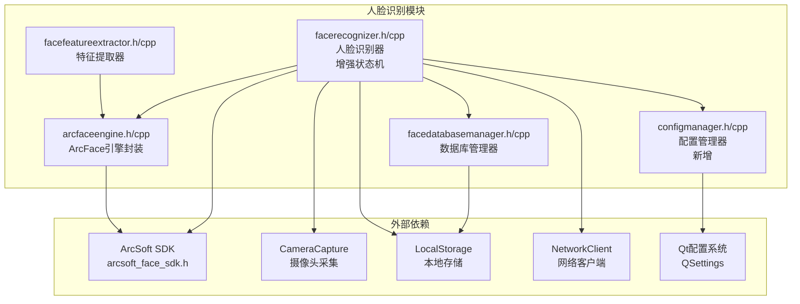

**图表来源**
- [arcfaceengine.h:1-115](file://FaceRecognition/arcfaceengine.h#L1-L115)
- [facerecognizer.h:1-107](file://FaceRecognition/facerecognizer.h#L1-L107)
- [facedatabasemanager.h:1-47](file://FaceRecognition/facedatabasemanager.h#L1-L47)
- [configmanager.h:1-148](file://Config/configmanager.h#L1-L148)

**章节来源**
- [arcfaceengine.h:1-115](file://FaceRecognition/arcfaceengine.h#L1-L115)
- [facerecognizer.h:1-107](file://FaceRecognition/facerecognizer.h#L1-L107)
- [facedatabasemanager.h:1-47](file://FaceRecognition/facedatabasemanager.h#L1-L47)
- [configmanager.h:1-148](file://Config/configmanager.h#L1-L148)

## 核心组件

### ArcFace引擎封装

ArcFace引擎封装类是整个系统的核心，负责与ArcSoft SDK进行交互。它提供了人脸检测、特征提取和特征对比等核心功能，并采用了单例模式确保全局唯一性。

**章节来源**
- [arcfaceengine.h:21-115](file://FaceRecognition/arcfaceengine.h#L21-L115)
- [arcfaceengine.cpp:31-73](file://FaceRecognition/arcfaceengine.cpp#L31-L73)

### 增强的人脸识别器状态机

**新增** 人脸识别器现在实现了完整的状态机架构，包含四种状态：

- **IDLE（空闲）**：等待检测到人脸
- **DETECTING（检测中）**：正在处理识别
- **RECOGNIZED（已识别）**：已识别成功，处于冷却中
- **LOST（丢失）**：人脸离开，准备重置

状态机通过`RecognitionState`枚举和`setState()`方法实现，提供了更好的流程控制和错误恢复能力。

**章节来源**
- [facerecognizer.h:28-33](file://FaceRecognition/facerecognizer.h#L28-L33)
- [facerecognizer.cpp:199-214](file://FaceRecognition/facerecognizer.cpp#L199-L214)

### 配置管理集成

**新增** ConfigManager类提供了统一的配置管理功能，支持：

- ArcFace SDK配置参数（AppId、SdkKey）
- 人脸识别参数（相似度阈值、最大人脸数量等）
- 网络连接参数
- 考勤规则设置
- 存储路径配置

配置数据存储在INI格式的配置文件中，支持动态读取和保存。

**章节来源**
- [configmanager.h:14-148](file://Config/configmanager.h#L14-L148)
- [configmanager.cpp:53-130](file://Config/configmanager.cpp#L53-L130)

### 数据结构定义

系统定义了两个关键的数据结构：

1. **FaceInfo结构体**：存储单张人脸的检测结果
   - `rect`: 人脸矩形区域（左上角坐标 + 宽高）
   - `orient`: 人脸角度方向（0-360度）
   - `faceId`: 人脸追踪ID

2. **FaceFeature结构体**：存储提取的人脸特征向量
   - `data`: 特征数据（二进制格式）
   - `size`: 特征数据大小（字节）

**章节来源**
- [arcfaceengine.h:28-42](file://FaceRecognition/arcfaceengine.h#L28-L42)

### 特征数据库管理器

特征数据库管理器负责管理内存中的特征库，提供特征加载、查找最佳匹配等功能。它使用单例模式和线程安全机制确保多线程环境下的数据一致性。

**章节来源**
- [facedatabasemanager.h:9-47](file://FaceRecognition/facedatabasemanager.h#L9-L47)
- [facedatabasemanager.cpp:15-95](file://FaceRecognition/facedatabasemanager.cpp#L15-L95)

## 架构概览

系统采用分层架构设计，从底层的SDK封装到上层的应用逻辑，形成了清晰的职责分离：

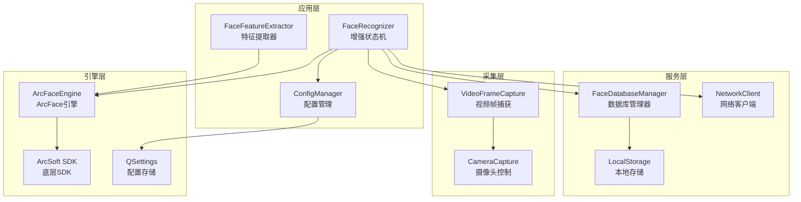

**图表来源**
- [facerecognizer.h:35-107](file://FaceRecognition/facerecognizer.h#L35-L107)
- [arcfaceengine.h:21-115](file://FaceRecognition/arcfaceengine.h#L21-L115)
- [facedatabasemanager.h:9-47](file://FaceRecognition/facedatabasemanager.h#L9-L47)
- [configmanager.h:14-148](file://Config/configmanager.h#L14-L148)

## 详细组件分析

### ArcFace引擎实现

ArcFace引擎实现了完整的单例模式，确保在整个应用程序中只有一个引擎实例存在。其初始化过程包括SDK激活和引擎创建两个步骤。

#### 初始化流程

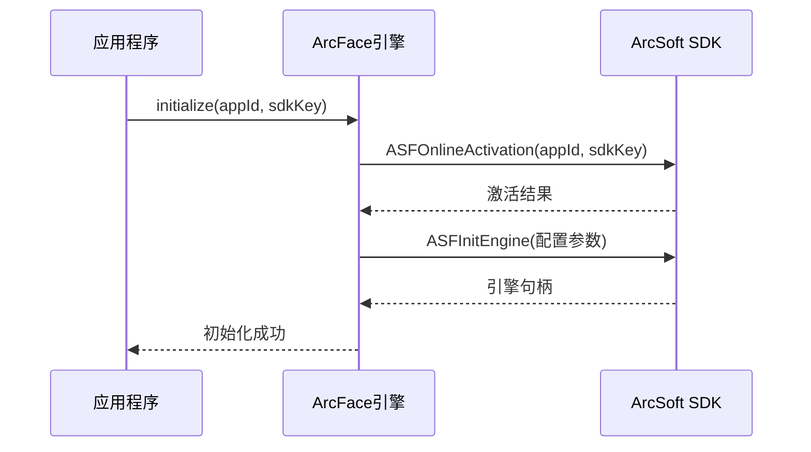

**图表来源**
- [arcfaceengine.cpp:31-62](file://FaceRecognition/arcfaceengine.cpp#L31-L62)

#### 人脸检测实现

人脸检测过程涉及图像格式转换、像素格式调整和SDK调用等多个步骤：

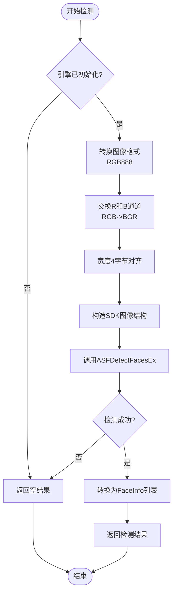

**图表来源**
- [arcfaceengine.cpp:97-180](file://FaceRecognition/arcfaceengine.cpp#L97-L180)

**章节来源**
- [arcfaceengine.cpp:97-180](file://FaceRecognition/arcfaceengine.cpp#L97-L180)

### 增强的人脸识别器状态机

**新增** 人脸识别器现在实现了完整的状态机架构，提供更好的流程控制：

#### 状态机架构

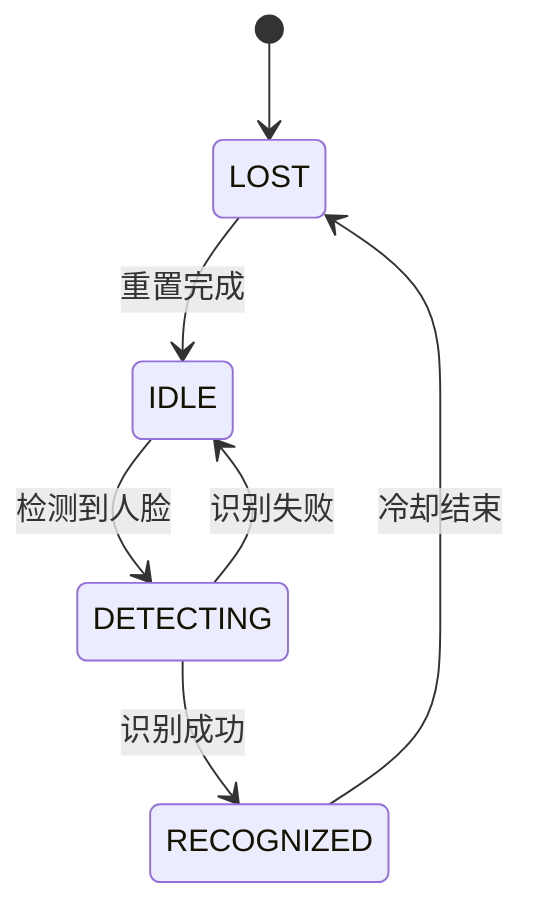

#### 状态处理流程

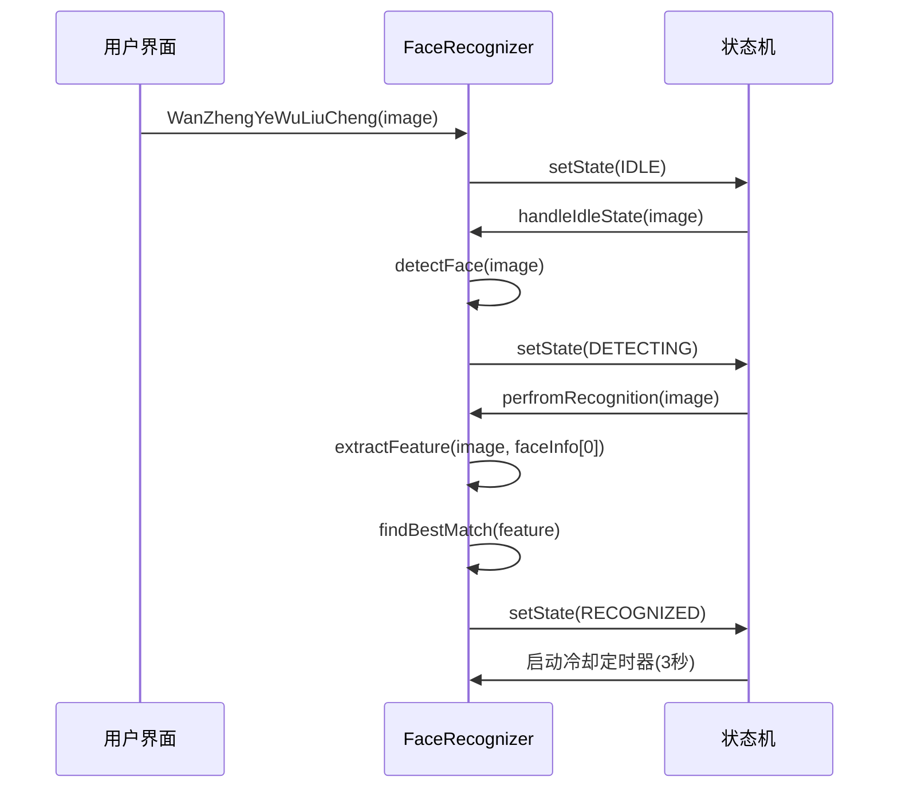

**图表来源**
- [facerecognizer.cpp:46-75](file://FaceRecognition/facerecognizer.cpp#L46-L75)
- [facerecognizer.cpp:78-133](file://FaceRecognition/facerecognizer.cpp#L78-L133)

**章节来源**
- [facerecognizer.cpp:46-214](file://FaceRecognition/facerecognizer.cpp#L46-L214)

### 配置管理器实现

**新增** ConfigManager类提供了统一的配置管理功能：

#### 配置参数分类

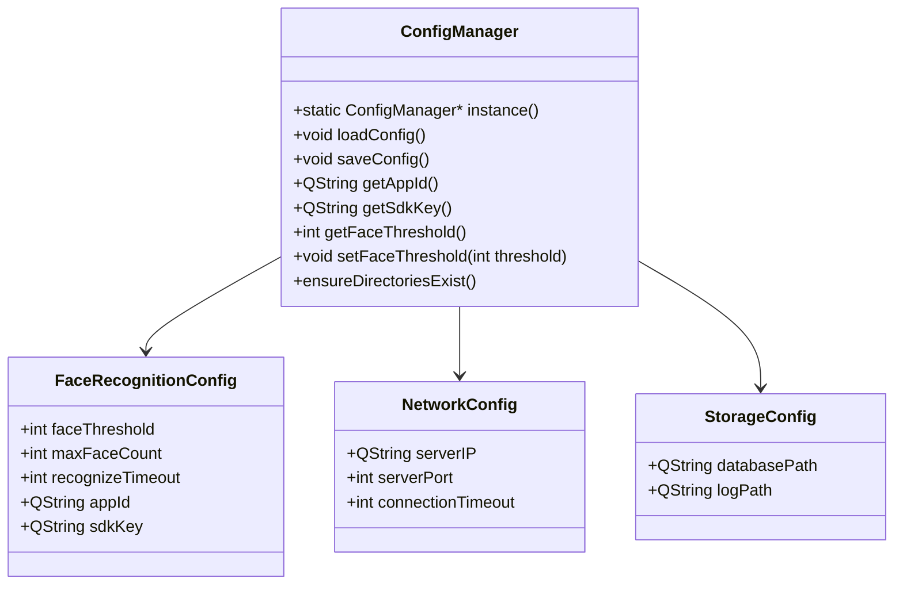

**图表来源**
- [configmanager.h:14-148](file://Config/configmanager.h#L14-L148)

**章节来源**
- [configmanager.cpp:53-130](file://Config/configmanager.cpp#L53-L130)

### 特征提取与对比

特征提取和对比是人脸识别的核心算法实现：

#### 特征提取流程

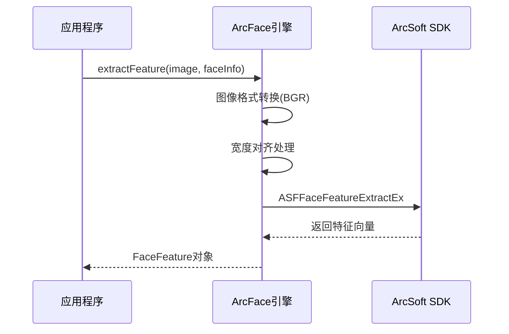

**图表来源**
- [arcfaceengine.cpp:182-249](file://FaceRecognition/arcfaceengine.cpp#L182-L249)

#### 特征对比算法

特征对比使用ArcSoft SDK提供的`ASFFaceFeatureCompare`函数，返回0.0-1.0之间的相似度分数。

**章节来源**
- [arcfaceengine.cpp:182-294](file://FaceRecognition/arcfaceengine.cpp#L182-L294)

### 数据库管理器

数据库管理器负责管理内存中的特征库，提供高效的特征查找和匹配功能：

#### 内存特征库结构

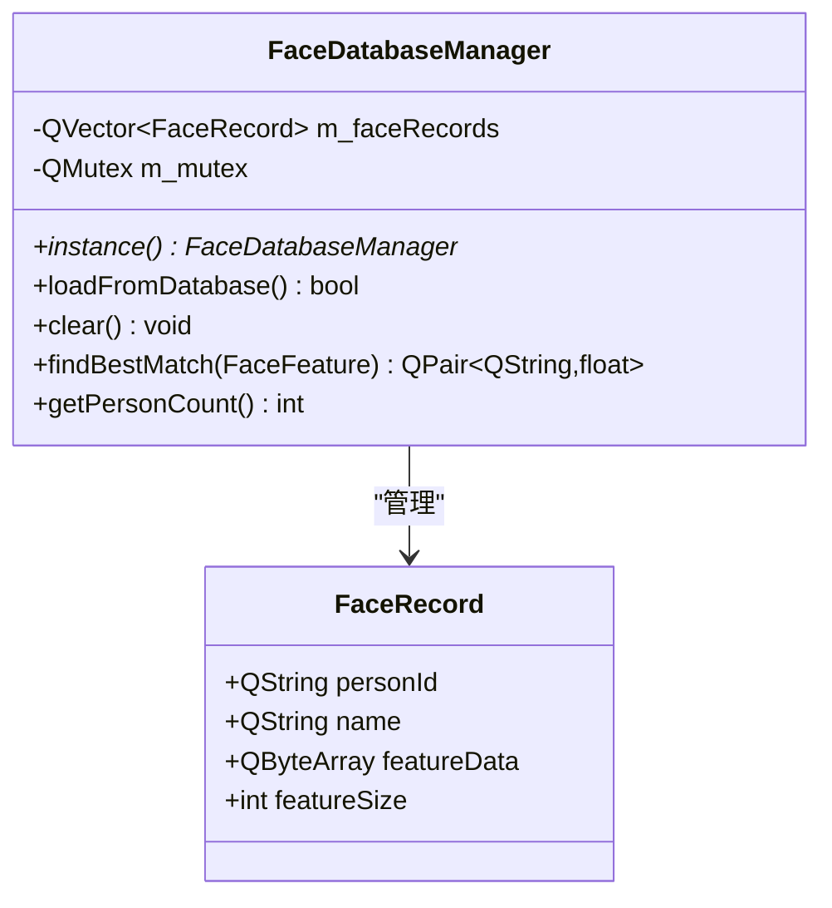

**图表来源**
- [facedatabasemanager.h:18-44](file://FaceRecognition/facedatabasemanager.h#L18-L44)

**章节来源**
- [facedatabasemanager.cpp:58-88](file://FaceRecognition/facedatabasemanager.cpp#L58-L88)

### 特征提取器

**更新** 特征提取器现在更加简洁，专注于单一职责：

#### 特征提取流程

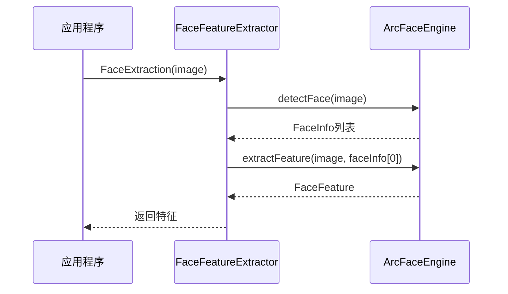

**图表来源**
- [facefeatureextractor.cpp:5-23](file://FaceRecognition/facefeatureextractor.cpp#L5-L23)

**章节来源**
- [facefeatureextractor.cpp:5-23](file://FaceRecognition/facefeatureextractor.cpp#L5-L23)

### 摄像头集成

系统通过`VideoFrameCapture`和`CameraCapture`类集成摄像头功能：

#### 摄像头工作流程

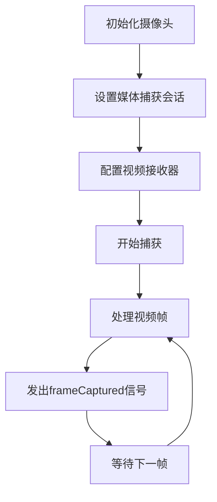

**图表来源**
- [videoframecapture.h:14-45](file://CameraCapture/videoframecapture.h#L14-L45)

**章节来源**
- [cameracapture.h:9-31](file://CameraCapture/cameracapture.h#L9-L31)

## 依赖关系分析

系统采用模块化设计，各组件之间的依赖关系清晰明确：

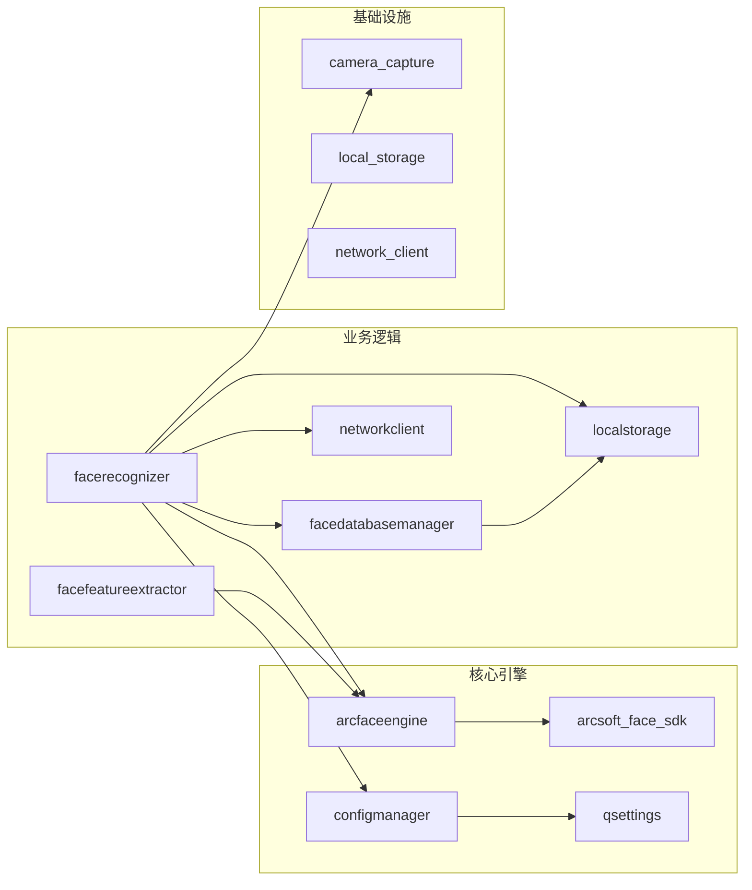

**图表来源**
- [arcfaceengine.h:12-13](file://FaceRecognition/arcfaceengine.h#L12-L13)
- [facerecognizer.h:4-26](file://FaceRecognition/facerecognizer.h#L4-L26)
- [configmanager.h:14-148](file://Config/configmanager.h#L14-L148)

**章节来源**
- [arcsoft_face_sdk.h:18-379](file://third_party/arcface/include/arcsoft_face_sdk.h#L18-L379)

## 性能考虑

### 增强的线程安全机制

**更新** 系统在多个层面实现了改进的线程安全：

1. **状态机线程安全**：使用`QMutexLocker`保护状态机的共享数据
2. **数据库访问保护**：使用`QMutexLocker`保护特征库的并发访问
3. **共享数据保护**：人脸识别器使用互斥锁保护检测结果、特征数据和状态信息
4. **配置访问保护**：ConfigManager使用线程安全的单例模式

### 冷却时间机制

**新增** 实现了3秒的冷却时间机制，防止重复识别同一人脸：

- 在`RECOGNIZED`状态下启动3秒冷却定时器
- 冷却期间如果检测到同一人脸，直接跳过重复识别
- 冷却结束后自动回到`IDLE`状态

### 图像处理优化

1. **像素格式转换**：直接在内存中进行RGB/BGR通道交换，避免额外的内存分配
2. **宽度对齐**：确保图像宽度为4的倍数，满足SDK要求
3. **内存复用**：重用转换后的图像缓冲区，减少内存分配次数

### 性能优化策略

1. **特征库内存管理**：在应用启动时一次性加载所有特征到内存，避免运行时频繁的数据库查询
2. **相似度阈值优化**：从ConfigManager读取配置的相似度阈值，支持动态调整
3. **异步处理**：视频帧捕获和人脸识别处理采用异步方式，避免阻塞UI线程
4. **状态机优化**：通过状态机避免重复处理，提高处理效率

## 故障排除指南

### 常见问题及解决方案

#### 引擎初始化失败

**症状**：`initialize()`返回false，日志显示激活或初始化失败

**可能原因**：
1. ArcSoft SDK密钥无效
2. 网络连接问题导致在线激活失败
3. SDK版本不兼容

**解决方法**：
1. 检查AppId和SDKKey的有效性
2. 确保网络连接正常
3. 更新到最新版本的SDK

#### 人脸检测失败

**症状**：`detectFace()`返回空结果

**可能原因**：
1. 图像格式不支持
2. 人脸尺寸过小
3. 图像质量差

**解决方法**：
1. 确保输入图像是有效的QImage格式
2. 调整检测参数中的最小人脸尺寸
3. 改善摄像头光照条件

#### 特征提取失败

**症状**：`extractFeature()`返回空特征

**可能原因**：
1. 人脸角度过大
2. 图像分辨率不足
3. 人脸被遮挡

**解决方法**：
1. 确保人脸正面朝向摄像头
2. 提高图像分辨率
3. 清理人脸遮挡物

#### 状态机异常

**新增** **症状**：人脸识别器状态异常，无法正常切换状态

**可能原因**：
1. 线程竞争导致状态冲突
2. 冷却定时器未正确启动
3. 配置参数错误

**解决方法**：
1. 检查QMutexLocker的使用是否正确
2. 确认冷却定时器的启动和停止逻辑
3. 验证ConfigManager中的配置参数

#### 配置加载失败

**新增** **症状**：ConfigManager无法正确加载配置文件

**可能原因**：
1. 配置文件路径不存在
2. 配置文件格式错误
3. 权限问题

**解决方法**：
1. 检查配置文件路径是否存在
2. 验证配置文件的INI格式
3. 确保应用程序有文件读写权限

**章节来源**
- [arcfaceengine.cpp:31-73](file://FaceRecognition/arcfaceengine.cpp#L31-L73)
- [arcfaceengine.cpp:97-180](file://FaceRecognition/arcfaceengine.cpp#L97-L180)
- [facerecognizer.cpp:199-214](file://FaceRecognition/facerecognizer.cpp#L199-L214)
- [configmanager.cpp:53-91](file://Config/configmanager.cpp#L53-L91)

## 结论

人脸识别模块是一个功能完整、架构清晰的人脸识别系统。通过合理的模块划分和设计模式应用，系统实现了高性能、线程安全的人脸识别功能。主要特点包括：

1. **完整的功能链路**：从摄像头采集到人脸识别再到数据库管理的完整流程
2. **增强的状态机架构**：提供更好的流程控制和错误恢复能力
3. **统一的配置管理**：支持动态参数配置和持久化存储
4. **高效的性能表现**：通过内存特征库和优化的图像处理算法实现快速识别
5. **可靠的稳定性**：完善的错误处理和线程安全机制确保系统稳定运行
6. **良好的扩展性**：模块化的架构设计便于功能扩展和维护

**更新** 新增的状态机实现、配置管理集成和改进的错误处理机制使系统更加健壮和灵活，能够更好地适应实际生产环境的需求。

该系统为考勤管理应用提供了坚实的技术基础，能够满足现代企业对人脸识别考勤系统的需求。