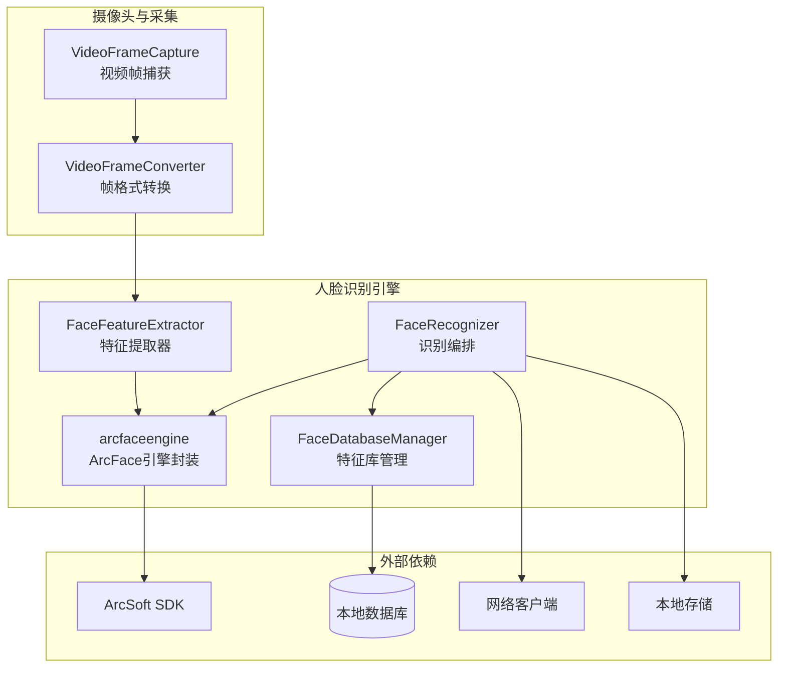
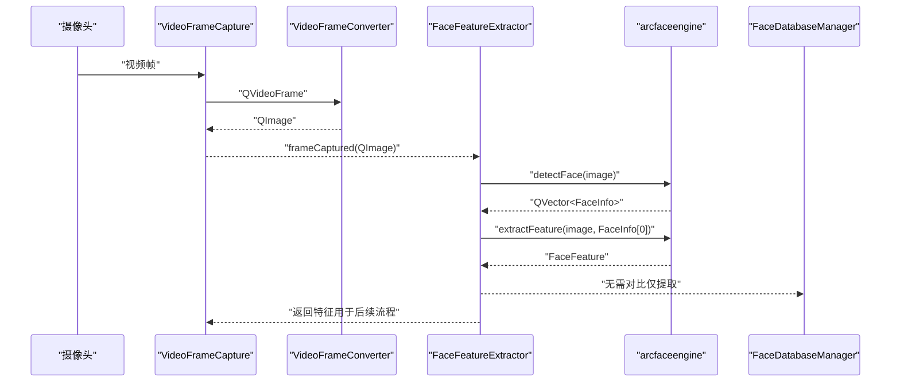
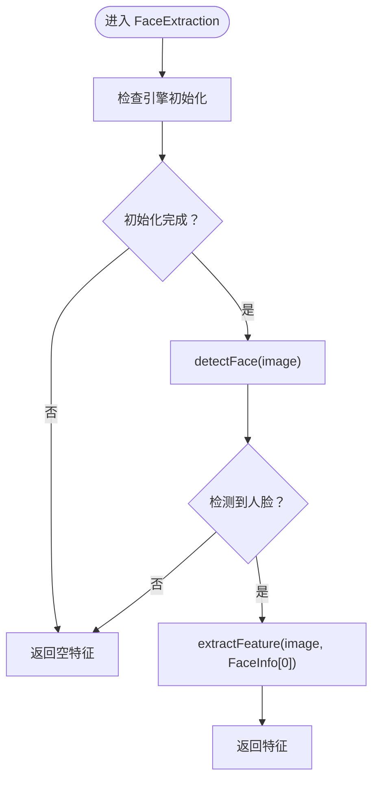
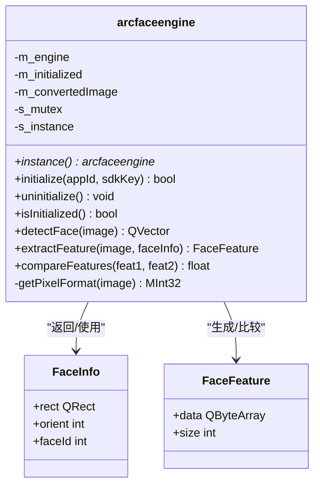
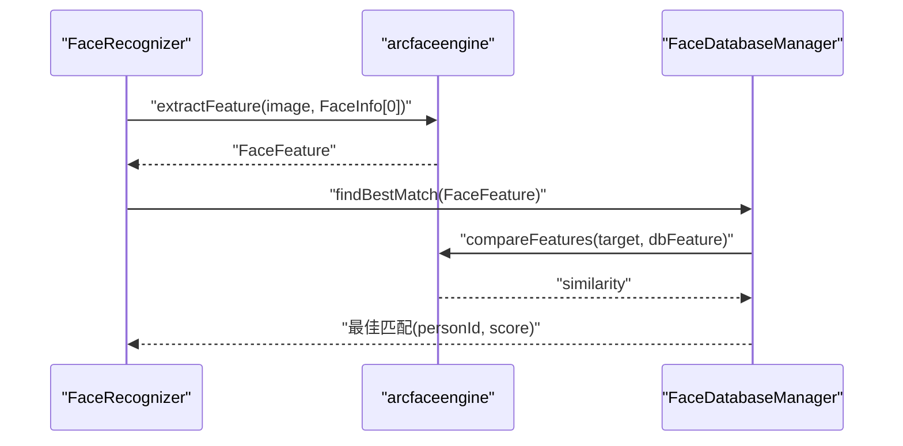
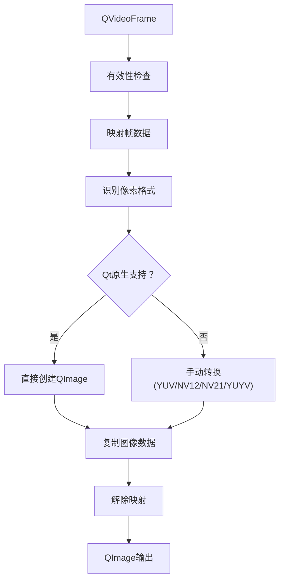
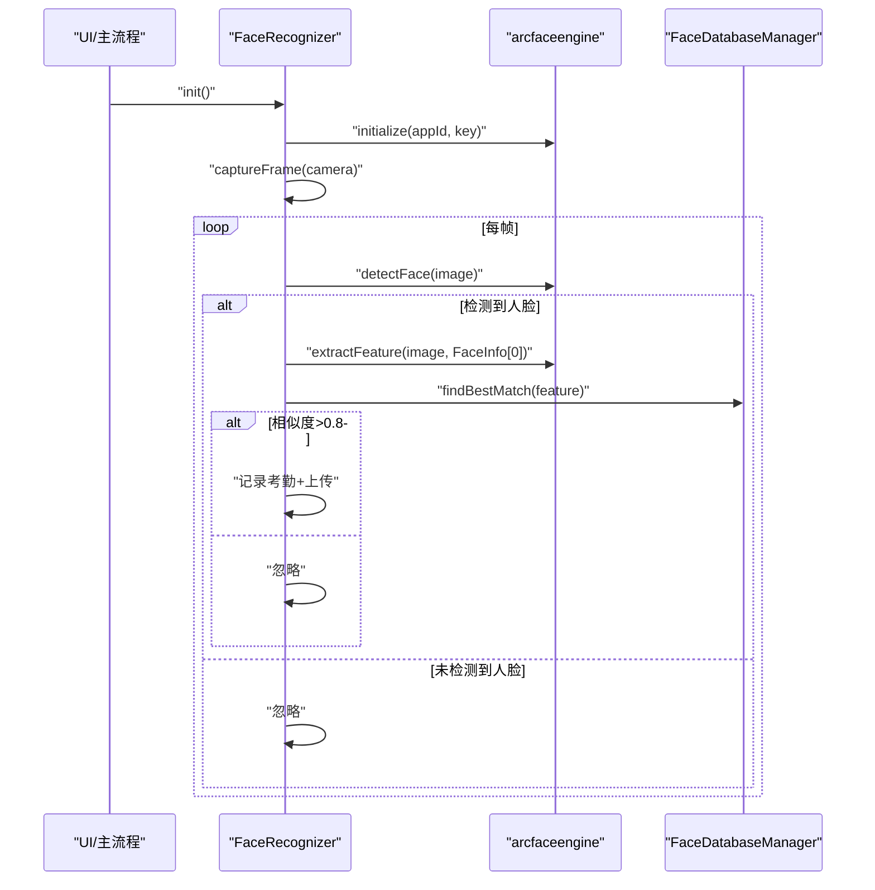
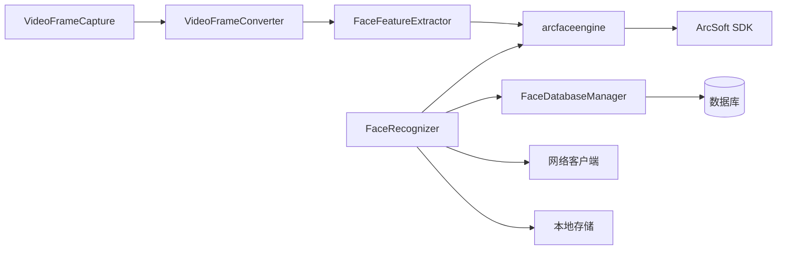

# 特征提取器

<cite>
**本文引用的文件**
- [facefeatureextractor.h](file://FaceRecognition/facefeatureextractor.h)
- [facefeatureextractor.cpp](file://FaceRecognition/facefeatureextractor.cpp)
- [arcfaceengine.h](file://FaceRecognition/arcfaceengine.h)
- [arcfaceengine.cpp](file://FaceRecognition/arcfaceengine.cpp)
- [facerecognizer.h](file://FaceRecognition/facerecognizer.h)
- [facerecognizer.cpp](file://FaceRecognition/facerecognizer.cpp)
- [facedatabasemanager.h](file://FaceRecognition/facedatabasemanager.h)
- [facedatabasemanager.cpp](file://FaceRecognition/facedatabasemanager.cpp)
- [videoframecapture.h](file://CameraCapture/videoframecapture.h)
- [videoframecapture.cpp](file://CameraCapture/videoframecapture.cpp)
- [videoframeconverter.h](file://CameraCapture/videoframeconverter.h)
- [videoframeconverter.cpp](file://CameraCapture/videoframeconverter.cpp)
</cite>

## 目录
1. [简介](#简介)
2. [项目结构](#项目结构)
3. [核心组件](#核心组件)
4. [架构总览](#架构总览)
5. [详细组件分析](#详细组件分析)
6. [依赖关系分析](#依赖关系分析)
7. [性能考虑](#性能考虑)
8. [故障排查指南](#故障排查指南)
9. [结论](#结论)
10. [附录](#附录)

## 简介
本技术文档围绕“特征提取器”组件展开，系统性阐述人脸特征提取的算法原理、数据处理流程与质量评估机制。文档覆盖输入图像的预处理、人脸检测与对齐、特征向量生成、与ArcFace引擎的协作方式（含多帧融合与稳定性评估）、质量判断标准、失败处理与重试策略、以及性能监控与调试工具使用等高级主题。同时提供面向实际工程的代码示例路径，帮助读者在模糊图像、低质量场景下实现稳定可靠的高质量特征提取。

## 项目结构
特征提取器位于人脸识别子系统中，主要由以下模块组成：
- 视频帧采集与转换：负责从摄像头捕获视频帧并转换为QImage，适配多种摄像头格式（YUV/NV12/NV21/YUYV等）。
- 人脸检测与特征提取：基于ArcFace引擎完成人脸检测、特征提取与相似度对比。
- 特征数据库管理：将数据库中的人脸特征加载至内存，支持快速1:N匹配。
- 识别流程编排：整合采集、检测、提取、对比与考勤记录上传的完整业务流程。

图表来源
- [videoframecapture.cpp:70-79](file://CameraCapture/videoframecapture.cpp#L70-L79)
- [videoframeconverter.cpp:16-85](file://CameraCapture/videoframeconverter.cpp#L16-L85)
- [facefeatureextractor.cpp:5-23](file://FaceRecognition/facefeatureextractor.cpp#L5-L23)
- [arcfaceengine.cpp:98-180](file://FaceRecognition/arcfaceengine.cpp#L98-L180)
- [facerecognizer.cpp:53-88](file://FaceRecognition/facerecognizer.cpp#L53-L88)
- [facedatabasemanager.cpp:16-49](file://FaceRecognition/facedatabasemanager.cpp#L16-L49)

章节来源
- [videoframecapture.h:14-42](file://CameraCapture/videoframecapture.h#L14-L42)
- [videoframeconverter.h:25-69](file://CameraCapture/videoframeconverter.h#L25-L69)
- [arcfaceengine.h:21-112](file://FaceRecognition/arcfaceengine.h#L21-L112)
- [facefeatureextractor.h:7-14](file://FaceRecognition/facefeatureextractor.h#L7-L14)
- [facerecognizer.h:25-58](file://FaceRecognition/facerecognizer.h#L25-L58)
- [facedatabasemanager.h:9-44](file://FaceRecognition/facedatabasemanager.h#L9-L44)

## 核心组件
- 特征提取器（FaceFeatureExtractor）
  - 职责：调用ArcFace引擎进行人脸检测与特征提取，返回特征向量。
  - 关键点：对引擎初始化状态、检测结果进行前置校验；仅对首个检测到的人脸提取特征。
- ArcFace引擎封装（arcfaceengine）
  - 职责：提供单例模式的引擎实例，封装人脸检测、特征提取、特征对比等能力。
  - 关键点：图像格式转换（RGB/BGR对齐）、宽度4字节对齐、SDK图像结构构造、错误码处理。
- 特征数据库管理（FaceDatabaseManager）
  - 职责：从数据库加载特征到内存，提供1:N匹配与最佳匹配查找。
  - 关键点：线程安全的内存特征库、特征对比与阈值筛选。
- 识别编排（FaceRecognizer）
  - 职责：整合采集、检测、提取、对比与考勤记录上传的业务流程。
  - 关键点：多线程保护、相似度阈值控制、网络上传与本地存储联动。

章节来源
- [facefeatureextractor.h:7-14](file://FaceRecognition/facefeatureextractor.h#L7-L14)
- [facefeatureextractor.cpp:5-23](file://FaceRecognition/facefeatureextractor.cpp#L5-L23)
- [arcfaceengine.h:21-112](file://FaceRecognition/arcfaceengine.h#L21-L112)
- [arcfaceengine.cpp:31-79](file://FaceRecognition/arcfaceengine.cpp#L31-L79)
- [facedatabasemanager.h:17-44](file://FaceRecognition/facedatabasemanager.h#L17-L44)
- [facedatabasemanager.cpp:58-88](file://FaceRecognition/facedatabasemanager.cpp#L58-L88)
- [facerecognizer.h:25-58](file://FaceRecognition/facerecognizer.h#L25-L58)
- [facerecognizer.cpp:53-88](file://FaceRecognition/facerecognizer.cpp#L53-L88)

## 架构总览
特征提取器在系统中的位置与交互如下：

图表来源
- [videoframecapture.cpp:70-79](file://CameraCapture/videoframecapture.cpp#L70-L79)
- [videoframeconverter.cpp:16-85](file://CameraCapture/videoframeconverter.cpp#L16-L85)
- [facefeatureextractor.cpp:5-23](file://FaceRecognition/facefeatureextractor.cpp#L5-L23)
- [arcfaceengine.cpp:98-180](file://FaceRecognition/arcfaceengine.cpp#L98-L180)

章节来源
- [facerecognizer.cpp:53-88](file://FaceRecognition/facerecognizer.cpp#L53-L88)
- [arcfaceengine.cpp:182-249](file://FaceRecognition/arcfaceengine.cpp#L182-L249)

## 详细组件分析

### 组件一：特征提取器（FaceFeatureExtractor）
- 功能职责
  - 以单帧图像为输入，通过ArcFace引擎检测人脸并提取特征向量。
  - 返回特征向量结构体，包含二进制特征数据与大小。
- 关键流程
  - 引擎初始化检查 → 人脸检测 → 取首个检测结果 → 特征提取 → 返回。
- 错误处理
  - 引擎未初始化、检测不到人脸时返回空特征，避免后续流程崩溃。
- 适用场景
  - 单帧抓拍、静态图像特征提取；作为识别流程中的“特征生成阶段”。

图表来源
- [facefeatureextractor.cpp:5-23](file://FaceRecognition/facefeatureextractor.cpp#L5-L23)
- [arcfaceengine.cpp:98-180](file://FaceRecognition/arcfaceengine.cpp#L98-L180)

章节来源
- [facefeatureextractor.h:7-14](file://FaceRecognition/facefeatureextractor.h#L7-L14)
- [facefeatureextractor.cpp:5-23](file://FaceRecognition/facefeatureextractor.cpp#L5-L23)

### 组件二：ArcFace引擎封装（arcfaceengine）
- 单例模式与线程安全
  - 双重检查锁实现，静态成员互斥锁保障并发安全。
- 图像预处理
  - 像素格式适配：RGB888/BGR、灰度图等；默认RGB888。
  - 宽度对齐：按4字节对齐裁剪，满足SDK要求。
  - BGR通道交换：将RGB转换为BGR以适配SDK。
- 人脸检测
  - 返回人脸矩形、朝向（角度）与追踪ID；支持视频模式追踪。
- 特征提取
  - 基于指定人脸区域与朝向进行特征提取；返回二进制特征数据与大小。
- 特征对比
  - 生活照对比模式，返回0.0~1.0相似度；一般阈值≥0.8判定同一人。
- 错误处理
  - 初始化失败、检测失败、提取失败均返回空或警告日志。

图表来源
- [arcfaceengine.h:21-112](file://FaceRecognition/arcfaceengine.h#L21-L112)
- [arcfaceengine.cpp:31-79](file://FaceRecognition/arcfaceengine.cpp#L31-L79)

章节来源
- [arcfaceengine.h:21-112](file://FaceRecognition/arcfaceengine.h#L21-L112)
- [arcfaceengine.cpp:31-79](file://FaceRecognition/arcfaceengine.cpp#L31-L79)
- [arcfaceengine.cpp:98-180](file://FaceRecognition/arcfaceengine.cpp#L98-L180)
- [arcfaceengine.cpp:182-249](file://FaceRecognition/arcfaceengine.cpp#L182-L249)
- [arcfaceengine.cpp:251-294](file://FaceRecognition/arcfaceengine.cpp#L251-L294)

### 组件三：特征数据库管理（FaceDatabaseManager）
- 职责
  - 启动时从数据库加载特征到内存；提供最佳匹配查找；线程安全。
- 匹配策略
  - 与目标特征逐一对比，记录最高相似度与对应人员ID。
- 与识别流程协作
  - 在识别编排中，先提取特征，再交由数据库管理器进行1:N对比。

图表来源
- [facerecognizer.cpp:64-68](file://FaceRecognition/facerecognizer.cpp#L64-L68)
- [facedatabasemanager.cpp:58-88](file://FaceRecognition/facedatabasemanager.cpp#L58-L88)
- [arcfaceengine.cpp:251-294](file://FaceRecognition/arcfaceengine.cpp#L251-L294)

章节来源
- [facedatabasemanager.h:17-44](file://FaceRecognition/facedatabasemanager.h#L17-L44)
- [facedatabasemanager.cpp:16-49](file://FaceRecognition/facedatabasemanager.cpp#L16-L49)
- [facedatabasemanager.cpp:58-88](file://FaceRecognition/facedatabasemanager.cpp#L58-L88)

### 组件四：视频帧采集与转换（VideoFrameCapture/VideoFrameConverter）
- 视频帧采集
  - 通过QMediaCaptureSession与QVideoSink接收视频帧，触发frameCaptured信号。
- 帧格式转换
  - 自动识别Qt原生支持格式并直接转换；对YUV/NV12/NV21/YUYV等格式进行手动转换。
  - 支持YUV420P、NV12/NV21、YUYV等常见摄像头格式，确保后续图像处理一致性。

图表来源
- [videoframecapture.cpp:70-79](file://CameraCapture/videoframecapture.cpp#L70-L79)
- [videoframeconverter.cpp:16-85](file://CameraCapture/videoframeconverter.cpp#L16-L85)
- [videoframeconverter.cpp:99-187](file://CameraCapture/videoframeconverter.cpp#L99-L187)
- [videoframeconverter.cpp:199-245](file://CameraCapture/videoframeconverter.cpp#L199-L245)

章节来源
- [videoframecapture.h:14-42](file://CameraCapture/videoframecapture.h#L14-L42)
- [videoframecapture.cpp:10-19](file://CameraCapture/videoframecapture.cpp#L10-L19)
- [videoframecapture.cpp:70-79](file://CameraCapture/videoframecapture.cpp#L70-L79)
- [videoframeconverter.h:25-69](file://CameraCapture/videoframeconverter.h#L25-L69)
- [videoframeconverter.cpp:16-85](file://CameraCapture/videoframeconverter.cpp#L16-L85)

### 组件五：识别编排（FaceRecognizer）
- 整体流程
  - 初始化摄像头与引擎 → 启动视频采集 → 捕获帧 → 人脸检测 → 特征提取 → 1:N对比 → 判定与记录。
- 多帧融合与稳定性
  - 当前实现为单帧处理；建议在上层引入滑动窗口统计（如多帧相似度均值、方差）以提升稳定性。
- 异常检测与重试
  - 检测不到人脸或相似度不足时跳过；可在外层增加重试计数与失败回退策略。

图表来源
- [facerecognizer.cpp:20-51](file://FaceRecognition/facerecognizer.cpp#L20-L51)
- [facerecognizer.cpp:53-88](file://FaceRecognition/facerecognizer.cpp#L53-L88)

章节来源
- [facerecognizer.h:25-58](file://FaceRecognition/facerecognizer.h#L25-L58)
- [facerecognizer.cpp:20-51](file://FaceRecognition/facerecognizer.cpp#L20-L51)
- [facerecognizer.cpp:53-88](file://FaceRecognition/facerecognizer.cpp#L53-L88)

## 依赖关系分析
- 组件耦合
  - FaceFeatureExtractor依赖arcfaceengine；FaceRecognizer依赖arcfaceengine与FaceDatabaseManager。
  - VideoFrameCapture与VideoFrameConverter为采集层，向上游提供统一的QImage接口。
- 外部依赖
  - ArcSoft SDK：提供人脸检测、特征提取、特征对比能力。
  - 本地数据库：存储人员信息与特征数据。
  - 网络客户端：上传考勤记录。
- 潜在风险
  - 图像格式与对齐问题可能导致检测/提取失败。
  - 多线程访问特征库需注意互斥锁保护。

图表来源
- [videoframecapture.cpp:70-79](file://CameraCapture/videoframecapture.cpp#L70-L79)
- [videoframeconverter.cpp:16-85](file://CameraCapture/videoframeconverter.cpp#L16-L85)
- [facefeatureextractor.cpp:5-23](file://FaceRecognition/facefeatureextractor.cpp#L5-L23)
- [arcfaceengine.cpp:31-79](file://FaceRecognition/arcfaceengine.cpp#L31-L79)
- [facerecognizer.cpp:53-88](file://FaceRecognition/facerecognizer.cpp#L53-L88)
- [facedatabasemanager.cpp:16-49](file://FaceRecognition/facedatabasemanager.cpp#L16-L49)

章节来源
- [arcfaceengine.h:106-111](file://FaceRecognition/arcfaceengine.h#L106-L111)
- [facerecognizer.cpp:20-51](file://FaceRecognition/facerecognizer.cpp#L20-L51)

## 性能考虑
- 图像预处理开销
  - 像素格式转换与BGR通道交换、宽度对齐裁剪均为CPU密集操作，建议在专用线程执行。
- 检测与提取延迟
  - ArcFace引擎初始化与检测/提取为耗时操作，应避免在UI线程调用。
- 内存占用
  - 特征库加载至内存，建议按需加载与懒加载策略；定期清理无效特征。
- 多帧融合
  - 引入滑动窗口（如最近N帧）统计相似度均值与方差，降低误判率；仅当稳定性达标时才提交识别结果。

## 故障排查指南
- 常见问题与定位
  - 引擎未初始化：检查initialize返回值与AppID/SdkKey配置。
  - 图像为空或格式不支持：确认VideoFrameConverter转换流程与摄像头格式。
  - 检测不到人脸：调整最小人脸尺寸、光照条件或摄像头角度。
  - 提取失败：检查宽度对齐与像素格式；必要时重新捕获帧。
  - 相似度偏低：确认特征库完整性与对比模式（生活照vs证件照）。
- 日志与调试
  - 引擎与采集模块均输出详细调试信息，便于定位问题。
  - 建议在关键节点增加时间戳与统计指标（检测耗时、提取耗时、对比耗时）。

章节来源
- [arcfaceengine.cpp:31-79](file://FaceRecognition/arcfaceengine.cpp#L31-L79)
- [arcfaceengine.cpp:98-180](file://FaceRecognition/arcfaceengine.cpp#L98-L180)
- [arcfaceengine.cpp:182-249](file://FaceRecognition/arcfaceengine.cpp#L182-L249)
- [arcfaceengine.cpp:251-294](file://FaceRecognition/arcfaceengine.cpp#L251-L294)
- [videoframeconverter.cpp:16-85](file://CameraCapture/videoframeconverter.cpp#L16-L85)

## 结论
特征提取器通过清晰的模块划分与严谨的错误处理，实现了从视频帧到特征向量的稳定输出。结合ArcFace引擎的检测与对比能力，可在实际考勤场景中实现高效、准确的人脸识别。为进一步提升鲁棒性，建议引入多帧融合、稳定性评估与重试机制，并在上层增加性能监控与可视化调试工具。

## 附录

### 实战示例（代码路径）
- 单帧特征提取
  - [facefeatureextractor.cpp:5-23](file://FaceRecognition/facefeatureextractor.cpp#L5-L23)
- 人脸检测与特征提取（识别流程）
  - [arcfaceengine.cpp:98-180](file://FaceRecognition/arcfaceengine.cpp#L98-L180)
  - [arcfaceengine.cpp:182-249](file://FaceRecognition/arcfaceengine.cpp#L182-L249)
- 1:N特征对比与最佳匹配
  - [facedatabasemanager.cpp:58-88](file://FaceRecognition/facedatabasemanager.cpp#L58-L88)
- 视频帧采集与格式转换
  - [videoframecapture.cpp:70-79](file://CameraCapture/videoframecapture.cpp#L70-L79)
  - [videoframeconverter.cpp:16-85](file://CameraCapture/videoframeconverter.cpp#L16-L85)
- 识别编排与考勤记录
  - [facerecognizer.cpp:53-88](file://FaceRecognition/facerecognizer.cpp#L53-L88)

### 质量评估与阈值建议
- 相似度阈值
  - ≥0.8：极可能是同一人；建议用于考勤签到。
  - 0.6~0.8：可能同一人；建议二次确认或增加多帧融合。
  - <0.6：不太可能是同一人；建议拒绝并提示重拍。
- 多帧融合策略
  - 计算N帧相似度均值与方差；均值较高且方差较小视为稳定；仅稳定结果提交识别。

### 容错设计与重试机制
- 失败处理
  - 引擎未初始化：返回空特征并记录日志；上层应提示用户重试或检查授权。
  - 检测不到人脸：跳过当前帧；可增加“无人提示”与“引导对准”的UI反馈。
  - 提取失败：重试一次当前帧；若仍失败，提示用户调整姿态或光线。
- 重试与回退
  - 多帧连续失败时，切换到备用策略（如更高分辨率帧、不同角度帧）或提示用户重新拍摄。