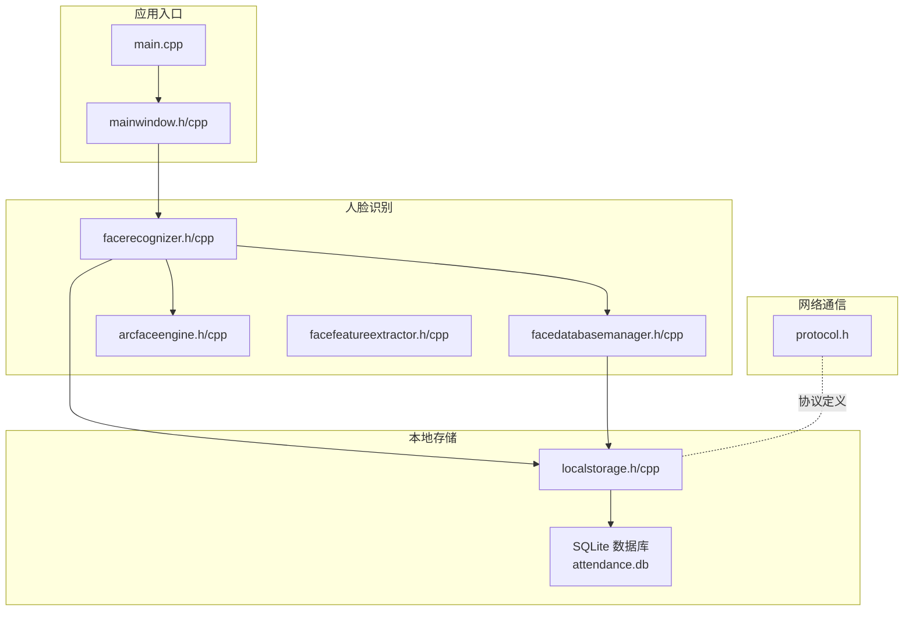
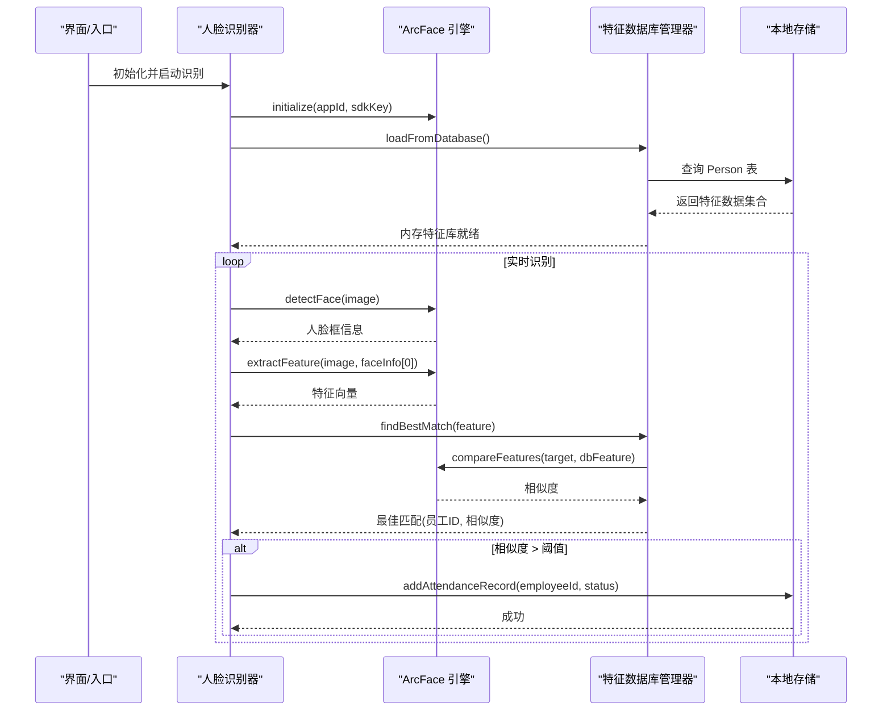
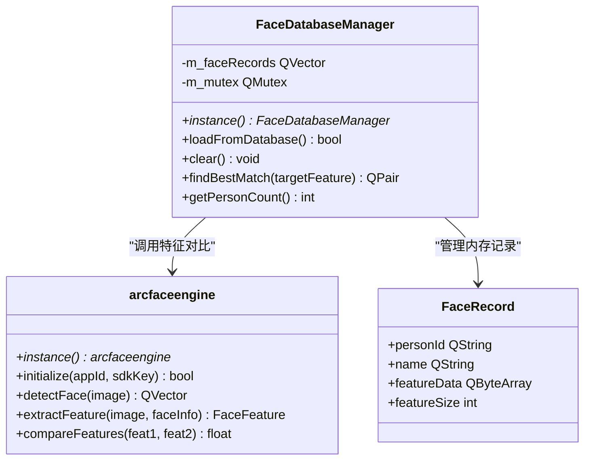
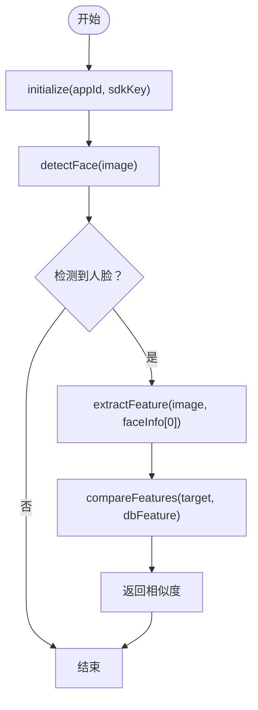
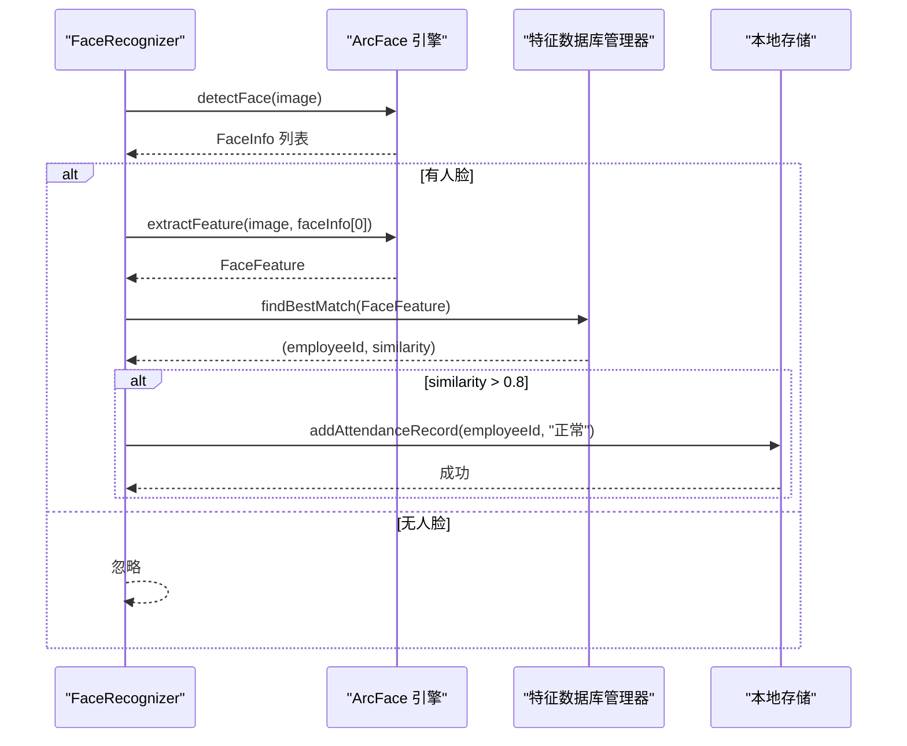
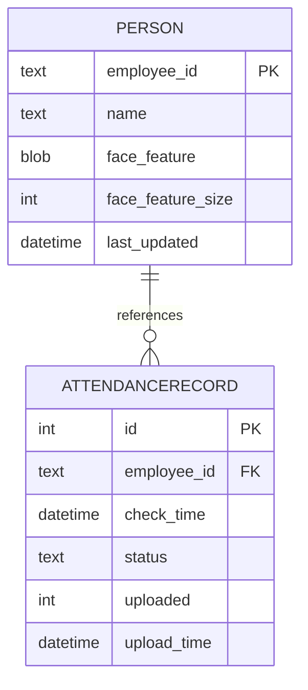
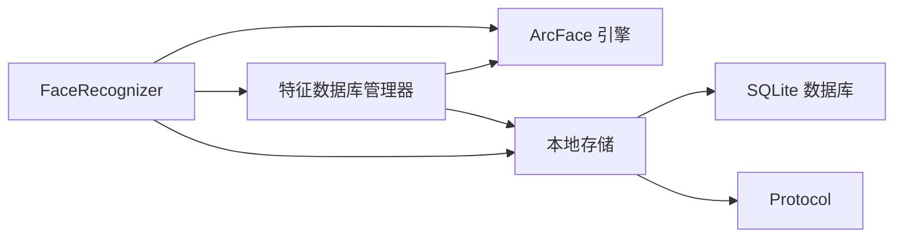

# 特征数据库管理

<cite>
**本文引用的文件**
- [facedatabasemanager.h](file://FaceRecognition/facedatabasemanager.h)
- [facedatabasemanager.cpp](file://FaceRecognition/facedatabasemanager.cpp)
- [arcfaceengine.h](file://FaceRecognition/arcfaceengine.h)
- [arcfaceengine.cpp](file://FaceRecognition/arcfaceengine.cpp)
- [facefeatureextractor.h](file://FaceRecognition/facefeatureextractor.h)
- [facefeatureextractor.cpp](file://FaceRecognition/facefeatureextractor.cpp)
- [facerecognizer.h](file://FaceRecognition/facerecognizer.h)
- [facerecognizer.cpp](file://FaceRecognition/facerecognizer.cpp)
- [localstorage.h](file://LocalStorage/localstorage.h)
- [localstorage.cpp](file://LocalStorage/localstorage.cpp)
- [protocol.h](file://NetworkClient/protocol.h)
- [main.cpp](file://main.cpp)
- [mainwindow.h](file://mainwindow.h)
- [mainwindow.cpp](file://mainwindow.cpp)
</cite>

## 目录
1. [简介](#简介)
2. [项目结构](#项目结构)
3. [核心组件](#核心组件)
4. [架构总览](#架构总览)
5. [详细组件分析](#详细组件分析)
6. [依赖关系分析](#依赖关系分析)
7. [性能考虑](#性能考虑)
8. [故障排查指南](#故障排查指南)
9. [结论](#结论)
10. [附录](#附录)

## 简介
本技术文档围绕“特征数据库管理”组件展开，系统性阐述人脸特征数据的存储、检索、更新与删除机制；数据库表结构设计、索引策略与数据一致性保障；持久化存储方案、缓存机制与批量操作接口；以及与 ArcFace 引擎的集成方式（特征导入导出、同步机制、版本管理建议）。文档还提供常见操作的代码示例路径，帮助开发者快速落地实现，并总结数据库性能优化、并发访问控制与备份恢复的最佳实践。

## 项目结构
本项目采用模块化组织，人脸识别子系统位于 FaceRecognition 目录，本地存储位于 LocalStorage 目录，网络协议与客户端位于 NetworkClient 目录。入口程序位于根目录。

图表来源
- [main.cpp:13-27](file://main.cpp#L13-L27)
- [mainwindow.h:11-21](file://mainwindow.h#L11-L21)
- [facerecognizer.cpp:20-51](file://FaceRecognition/facerecognizer.cpp#L20-L51)
- [facedatabasemanager.cpp:16-49](file://FaceRecognition/facedatabasemanager.cpp#L16-L49)
- [localstorage.cpp:30-121](file://LocalStorage/localstorage.cpp#L30-L121)

章节来源
- [main.cpp:13-27](file://main.cpp#L13-L27)
- [mainwindow.h:11-21](file://mainwindow.h#L11-L21)
- [facerecognizer.cpp:20-51](file://FaceRecognition/facerecognizer.cpp#L20-L51)
- [facedatabasemanager.cpp:16-49](file://FaceRecognition/facedatabasemanager.cpp#L16-L49)
- [localstorage.cpp:30-121](file://LocalStorage/localstorage.cpp#L30-L121)

## 核心组件
- 特征数据库管理器（FaceDatabaseManager）
  - 负责从数据库加载人脸特征到内存，提供快速 1:N 匹配能力，并在进程生命周期内维护内存中的特征库。
  - 关键接口：加载、清空、查找最佳匹配、获取人数。
- ArcFace 引擎（arcfaceengine）
  - 封装虹软 ArcFace SDK，提供人脸检测、特征提取、特征对比等能力，采用单例模式与线程安全互斥锁。
- 特征提取器（FaceFeatureExtractor）
  - 组合 ArcFace 引擎，完成从图像到特征向量的完整流程。
- 人脸识别器（FaceRecognizer）
  - 整合摄像头、引擎、数据库管理器与本地存储，形成完整的识别流水线。
- 本地存储（LocalStorage）
  - SQLite 文件数据库，负责人员特征与考勤记录的持久化、批量同步与上传标记。

章节来源
- [facedatabasemanager.h:9-44](file://FaceRecognition/facedatabasemanager.h#L9-L44)
- [facedatabasemanager.cpp:16-94](file://FaceRecognition/facedatabasemanager.cpp#L16-L94)
- [arcfaceengine.h:21-112](file://FaceRecognition/arcfaceengine.h#L21-L112)
- [arcfaceengine.cpp:31-79](file://FaceRecognition/arcfaceengine.cpp#L31-L79)
- [facefeatureextractor.h:7-14](file://FaceRecognition/facefeatureextractor.h#L7-L14)
- [facefeatureextractor.cpp:5-23](file://FaceRecognition/facefeatureextractor.cpp#L5-L23)
- [facerecognizer.h:25-58](file://FaceRecognition/facerecognizer.h#L25-L58)
- [facerecognizer.cpp:20-88](file://FaceRecognition/facerecognizer.cpp#L20-L88)
- [localstorage.h:15-46](file://LocalStorage/localstorage.h#L15-L46)
- [localstorage.cpp:30-121](file://LocalStorage/localstorage.cpp#L30-L121)

## 架构总览
特征数据库管理组件贯穿“数据入库—内存缓存—实时匹配—持久化记录”的闭环。整体流程如下：

图表来源
- [facerecognizer.cpp:20-88](file://FaceRecognition/facerecognizer.cpp#L20-L88)
- [facedatabasemanager.cpp:16-94](file://FaceRecognition/facedatabasemanager.cpp#L16-L94)
- [arcfaceengine.cpp:98-294](file://FaceRecognition/arcfaceengine.cpp#L98-L294)
- [localstorage.cpp:183-224](file://LocalStorage/localstorage.cpp#L183-L224)

## 详细组件分析

### 特征数据库管理器（FaceDatabaseManager）
- 设计要点
  - 单例模式，全局共享内存特征库。
  - 使用互斥锁保护内存容器，确保多线程安全。
  - 1:N 匹配采用线性扫描，对每条内存记录调用引擎进行相似度比较，返回最佳匹配。
- 关键接口与行为
  - 加载：从 Person 表读取特征二进制与大小，构建内存记录。
  - 清空：退出或重载时清空内存。
  - 匹配：遍历内存记录，调用引擎对比，维护最高相似度与对应员工 ID。
  - 访问：提供人数统计与受保护的读取接口。
- 复杂度与性能
  - 单次匹配复杂度 O(N)，N 为内存特征数量；适合中小规模特征库。
  - 可通过索引与分片策略优化，或引入近似最近邻库（如 FAISS）以降低时间复杂度。

图表来源
- [facedatabasemanager.h:9-44](file://FaceRecognition/facedatabasemanager.h#L9-L44)
- [facedatabasemanager.cpp:16-94](file://FaceRecognition/facedatabasemanager.cpp#L16-L94)
- [arcfaceengine.h:21-112](file://FaceRecognition/arcfaceengine.h#L21-L112)

章节来源
- [facedatabasemanager.h:9-44](file://FaceRecognition/facedatabasemanager.h#L9-L44)
- [facedatabasemanager.cpp:16-94](file://FaceRecognition/facedatabasemanager.cpp#L16-L94)

### ArcFace 引擎（arcfaceengine）
- 设计要点
  - 单例模式，线程安全；提供初始化、反初始化、检测、提取、对比等接口。
  - 图像格式转换与宽度对齐处理，满足 SDK 像素格式与对齐要求。
- 关键接口与行为
  - initialize：在线激活 + 引擎初始化，设置检测模式、角度、最小人脸尺寸与最大人脸数。
  - detectFace：返回人脸框、角度与追踪 ID。
  - extractFeature：从指定人脸区域提取特征向量。
  - compareFeatures：计算两张特征向量的相似度。
- 错误处理
  - 对未初始化、空图像、SDK 调用失败等情况进行日志输出与短路返回。

图表来源
- [arcfaceengine.cpp:31-79](file://FaceRecognition/arcfaceengine.cpp#L31-L79)
- [arcfaceengine.cpp:98-180](file://FaceRecognition/arcfaceengine.cpp#L98-L180)
- [arcfaceengine.cpp:183-249](file://FaceRecognition/arcfaceengine.cpp#L183-L249)
- [arcfaceengine.cpp:252-294](file://FaceRecognition/arcfaceengine.cpp#L252-L294)

章节来源
- [arcfaceengine.h:21-112](file://FaceRecognition/arcfaceengine.h#L21-L112)
- [arcfaceengine.cpp:31-79](file://FaceRecognition/arcfaceengine.cpp#L31-L79)
- [arcfaceengine.cpp:98-180](file://FaceRecognition/arcfaceengine.cpp#L98-L180)
- [arcfaceengine.cpp:183-249](file://FaceRecognition/arcfaceengine.cpp#L183-L249)
- [arcfaceengine.cpp:252-294](file://FaceRecognition/arcfaceengine.cpp#L252-L294)

### 特征提取器（FaceFeatureExtractor）
- 设计要点
  - 封装检测与提取流程，若未初始化或未检测到人脸则返回空特征。
- 关键接口与行为
  - FaceExtraction：组合 detectFace 与 extractFeature，返回特征向量。

章节来源
- [facefeatureextractor.h:7-14](file://FaceRecognition/facefeatureextractor.h#L7-L14)
- [facefeatureextractor.cpp:5-23](file://FaceRecognition/facefeatureextractor.cpp#L5-L23)

### 人脸识别器（FaceRecognizer）
- 设计要点
  - 负责初始化摄像头、引擎与数据库管理器，驱动识别流水线。
  - 在相似度超过阈值时，写入本地考勤记录并触发上传。
- 关键接口与行为
  - init：初始化引擎、加载特征、启动摄像头与视频帧捕获。
  - WanZhengYeWuLiuCheng：检测—提取—对比—记录—上传的完整流程。
  - 提供获取人脸信息、特征与匹配结果的只读接口。

图表来源
- [facerecognizer.cpp:20-88](file://FaceRecognition/facerecognizer.cpp#L20-L88)
- [facedatabasemanager.cpp:58-88](file://FaceRecognition/facedatabasemanager.cpp#L58-L88)
- [localstorage.cpp:183-224](file://LocalStorage/localstorage.cpp#L183-L224)

章节来源
- [facerecognizer.h:25-58](file://FaceRecognition/facerecognizer.h#L25-L58)
- [facerecognizer.cpp:20-88](file://FaceRecognition/facerecognizer.cpp#L20-L88)

### 本地存储（LocalStorage）
- 设计要点
  - 单例模式，线程安全；SQLite 文件数据库，自动创建目录与数据库文件。
  - 初始化时创建 Person 与 AttendanceRecord 表，并建立必要索引。
  - 支持人员数据同步（事务）、考勤记录增删改查与上传标记。
- 表结构与索引
  - Person：主键 employee_id，字段包含姓名、特征二进制与大小、更新时间；索引 idx_person_name。
  - AttendanceRecord：自增主键 id，外键 employee_id 引用 Person，字段包含打卡时间、状态、上传标记与上传时间；索引 idx_record_employee_id 与 idx_record_check_time。
- 批量操作
  - syncPersons：开启事务，清空并批量插入人员特征，提升导入效率。
  - addAttendanceRecord/getUnuploadedRecords/markAsUploaded/markBatchAsUploaded：均采用事务保证原子性。

图表来源
- [localstorage.cpp:68-121](file://LocalStorage/localstorage.cpp#L68-L121)

章节来源
- [localstorage.h:15-46](file://LocalStorage/localstorage.h#L15-L46)
- [localstorage.cpp:30-121](file://LocalStorage/localstorage.cpp#L30-L121)
- [localstorage.cpp:123-181](file://LocalStorage/localstorage.cpp#L123-L181)
- [localstorage.cpp:183-224](file://LocalStorage/localstorage.cpp#L183-L224)
- [localstorage.cpp:226-258](file://LocalStorage/localstorage.cpp#L226-L258)
- [localstorage.cpp:260-299](file://LocalStorage/localstorage.cpp#L260-L299)
- [localstorage.cpp:302-345](file://LocalStorage/localstorage.cpp#L302-L345)

### 与 ArcFace 引擎的集成
- 特征导入
  - 通过 syncPersons 将 Protocol::PersonData 的特征二进制与大小写入 Person 表，随后由 FaceDatabaseManager 加载至内存。
- 特征导出
  - 从 Person 表读取特征二进制与大小，封装为 Protocol::PersonData，便于网络传输或备份。
- 同步机制
  - 采用 SQLite 事务保证导入一致性；网络层通过 Protocol 定义消息类型与结构。
- 版本管理建议
  - 在 Person 表增加版本号字段，配合导入时的版本比较与增量更新策略，避免覆盖新特征。

章节来源
- [localstorage.cpp:123-181](file://LocalStorage/localstorage.cpp#L123-L181)
- [facedatabasemanager.cpp:16-49](file://FaceRecognition/facedatabasemanager.cpp#L16-L49)
- [protocol.h:41-49](file://NetworkClient/protocol.h#L41-L49)

## 依赖关系分析
- 组件耦合
  - FaceRecognizer 依赖 ArcFace 引擎、特征数据库管理器与本地存储。
  - FaceDatabaseManager 依赖 ArcFace 引擎与 LocalStorage。
  - LocalStorage 依赖 SQLite 与 Protocol。
- 外部依赖
  - ArcSoft SDK（通过 arcfaceengine 封装）。
  - Qt SQL（QSqlDatabase/QSqlQuery）与 SQLite 驱动。
- 循环依赖
  - 当前结构无明显循环依赖，接口清晰。

图表来源
- [facerecognizer.h:25-58](file://FaceRecognition/facerecognizer.h#L25-L58)
- [facedatabasemanager.h:9-44](file://FaceRecognition/facedatabasemanager.h#L9-L44)
- [localstorage.h:15-46](file://LocalStorage/localstorage.h#L15-L46)

章节来源
- [facerecognizer.h:25-58](file://FaceRecognition/facerecognizer.h#L25-L58)
- [facedatabasemanager.h:9-44](file://FaceRecognition/facedatabasemanager.h#L9-L44)
- [localstorage.h:15-46](file://LocalStorage/localstorage.h#L15-L46)

## 性能考虑
- 内存缓存策略
  - 将特征全量加载至内存，避免每次匹配都访问磁盘，显著降低延迟；适合中小规模特征库。
- 线程安全
  - 使用 QMutex 保护共享数据结构，避免竞态条件；建议在高频调用路径减少锁粒度。
- 索引优化
  - Person 表已建立 name 索引；可按查询场景增加复合索引或基于特征哈希的二级索引。
- 批量导入
  - 使用事务批量插入，极大提升导入吞吐；建议分批处理超大规模数据。
- 引擎参数
  - 合理设置最小人脸尺寸与最大人脸数，平衡精度与性能。
- 近似检索
  - 对于大规模特征库，建议引入 FAISS 等向量检索库，将 O(N) 降为近似 O(log N) 或更低。

## 故障排查指南
- 引擎未初始化
  - 现象：检测/提取/对比返回空或零值。
  - 排查：确认 initialize 是否成功，appid/sdkKey 是否正确。
- 图像格式与对齐问题
  - 现象：检测失败或提取异常。
  - 排查：检查图像格式转换与宽度对齐逻辑。
- 数据库连接失败
  - 现象：无法创建/打开数据库或建表失败。
  - 排查：确认 data 目录可写、SQLite 驱动可用、PRAGMA 设置成功。
- 事务失败
  - 现象：同步或记录写入失败回滚。
  - 排查：检查事务开启、SQL 执行与提交流程。
- 匹配结果异常
  - 现象：相似度为 0 或最佳匹配错误。
  - 排查：确认特征提取成功、特征大小一致、阈值设置合理。

章节来源
- [arcfaceengine.cpp:31-79](file://FaceRecognition/arcfaceengine.cpp#L31-L79)
- [arcfaceengine.cpp:98-180](file://FaceRecognition/arcfaceengine.cpp#L98-L180)
- [arcfaceengine.cpp:183-249](file://FaceRecognition/arcfaceengine.cpp#L183-L249)
- [arcfaceengine.cpp:252-294](file://FaceRecognition/arcfaceengine.cpp#L252-L294)
- [localstorage.cpp:30-121](file://LocalStorage/localstorage.cpp#L30-L121)
- [localstorage.cpp:123-181](file://LocalStorage/localstorage.cpp#L123-L181)
- [facedatabasemanager.cpp:58-88](file://FaceRecognition/facedatabasemanager.cpp#L58-L88)

## 结论
特征数据库管理组件通过“内存缓存 + 引擎对比 + 本地持久化”的架构，实现了高效的人脸识别与考勤记录能力。当前实现简洁可靠，适合中小规模部署；对于更大规模与更高性能需求，建议引入向量检索库与更细粒度的并发控制策略。

## 附录

### 常见操作示例（代码路径）
- 添加人员特征（导入）
  - 通过协议结构体封装特征二进制与大小，调用本地存储的批量同步接口。
  - 示例路径：[localstorage.cpp:123-181](file://LocalStorage/localstorage.cpp#L123-L181)
- 查询匹配结果（识别）
  - 从摄像头捕获图像，经引擎检测与提取，交由数据库管理器进行 1:N 匹配。
  - 示例路径：[facerecognizer.cpp:53-88](file://FaceRecognition/facerecognizer.cpp#L53-L88)、[facedatabasemanager.cpp:58-88](file://FaceRecognition/facedatabasemanager.cpp#L58-L88)
- 更新特征数据（替换）
  - 使用批量同步接口清空并重新导入目标人员的最新特征。
  - 示例路径：[localstorage.cpp:123-181](file://LocalStorage/localstorage.cpp#L123-L181)
- 删除无效数据（清理）
  - 通过删除人员记录或标记无效状态，后续导入时覆盖重建。
  - 示例路径：[localstorage.cpp:143-149](file://LocalStorage/localstorage.cpp#L143-L149)
- 批量操作接口
  - 批量导入：syncPersons；批量标记上传：markBatchAsUploaded。
  - 示例路径：[localstorage.cpp:123-181](file://LocalStorage/localstorage.cpp#L123-L181)、[localstorage.cpp:302-345](file://LocalStorage/localstorage.cpp#L302-L345)

### 数据库表结构与索引
- Person 表
  - 字段：employee_id（主键）、name、face_feature（BLOB）、face_feature_size、last_updated。
  - 索引：idx_person_name(name)。
- AttendanceRecord 表
  - 字段：id（自增主键）、employee_id（外键）、check_time、status、uploaded、upload_time。
  - 索引：idx_record_employee_id(employee_id)、idx_record_check_time(check_time)。

章节来源
- [localstorage.cpp:68-121](file://LocalStorage/localstorage.cpp#L68-L121)