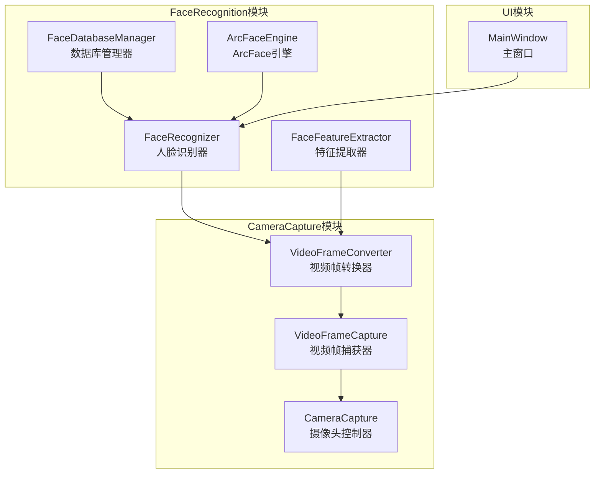
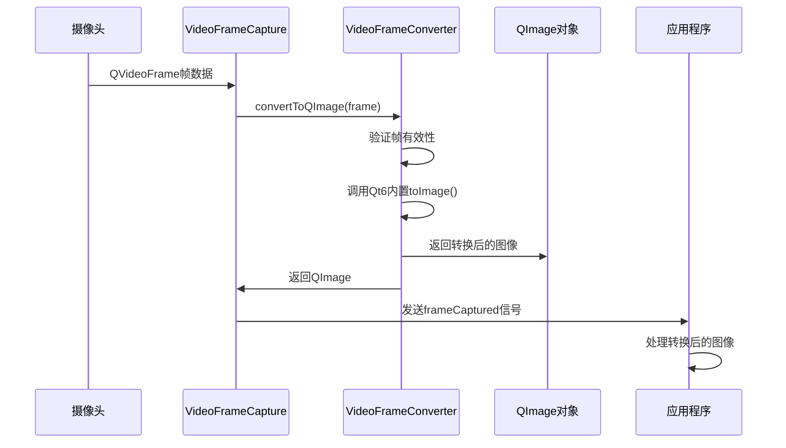
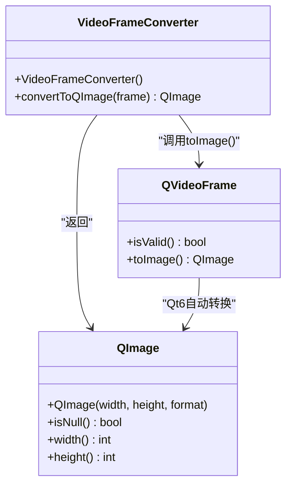
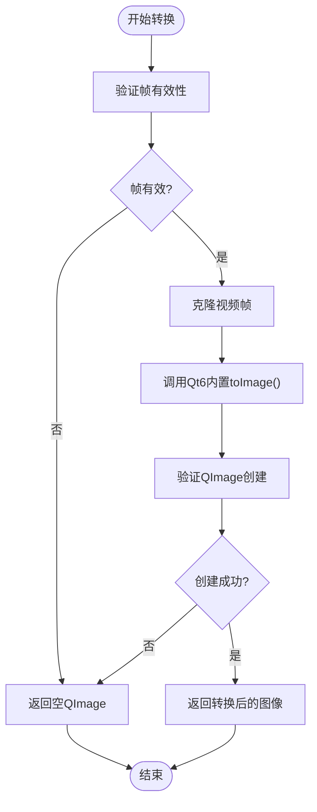
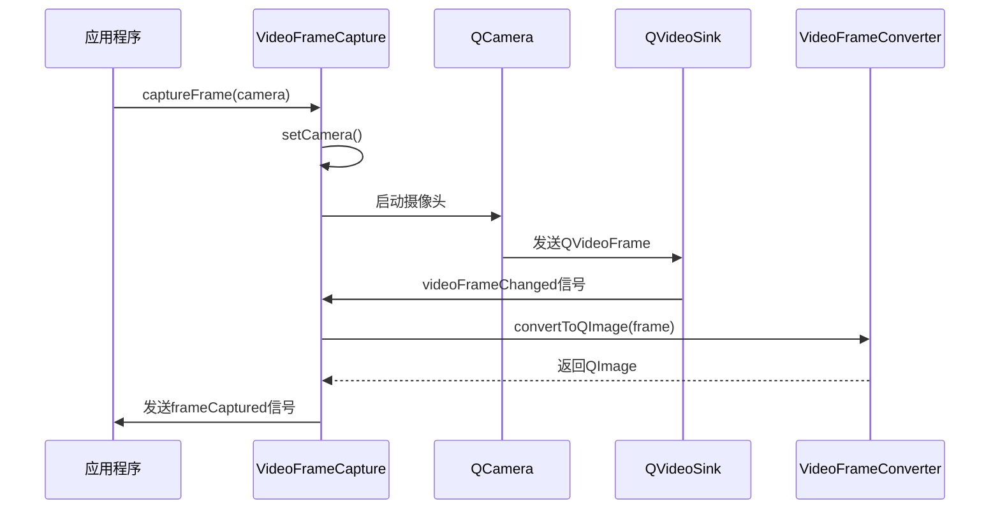
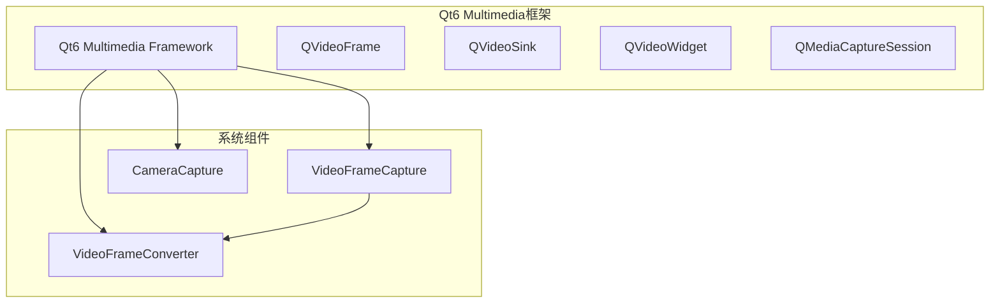
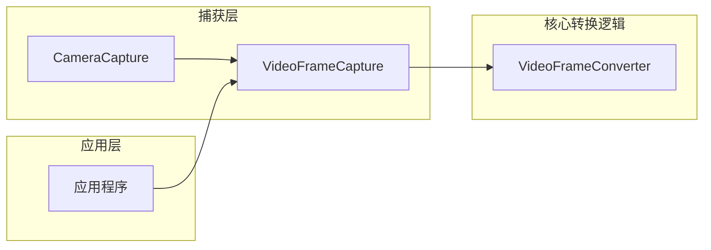
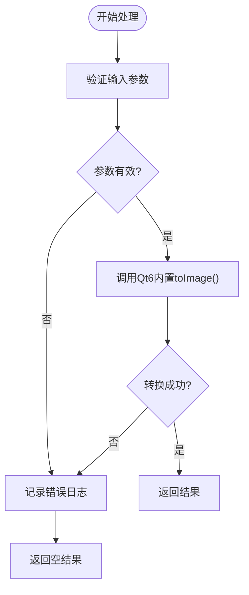

# 帧格式转换

<cite>
**本文档引用的文件**
- [videoframeconverter.h](file://CameraCapture/videoframeconverter.h)
- [videoframeconverter.cpp](file://CameraCapture/videoframeconverter.cpp)
- [videoframecapture.h](file://CameraCapture/videoframecapture.h)
- [videoframecapture.cpp](file://CameraCapture/videoframecapture.cpp)
- [cameracapture.h](file://CameraCapture/cameracapture.h)
- [cameracapture.cpp](file://CameraCapture/cameracapture.cpp)
- [CMakeLists.txt](file://CMakeLists.txt)
- [AttendanceCheckClient开发文档.md](file://AttendanceCheckClient开发文档.md)
</cite>

## 更新摘要
**变更内容**
- VideoFrameConverter大幅简化，移除了200多行复杂的手动像素格式转换代码
- 现在完全依赖Qt6的QVideoFrame::toImage()自动处理所有像素格式
- 转换逻辑从复杂的算法实现转变为简单的API调用
- 文档需要反映从手动转换到自动转换的技术演进

## 目录
1. [简介](#简介)
2. [项目结构](#项目结构)
3. [核心组件](#核心组件)
4. [架构概览](#架构概览)
5. [详细组件分析](#详细组件分析)
6. [依赖关系分析](#依赖关系分析)
7. [性能考量](#性能考量)
8. [故障排除指南](#故障排除指南)
9. [结论](#结论)

## 简介

本项目实现了基于Qt6框架的视频帧格式转换组件，专门用于将来自摄像头的视频帧转换为QImage格式，以便进行后续的图像处理和人脸识别操作。该组件通过Qt6内置的QVideoFrame::toImage()方法自动处理所有像素格式的转换，包括RGB、YUV等常见格式。

**更新** 该组件经历了重大简化：从原来的200多行复杂手动像素格式转换代码，完全迁移到Qt6的内置转换机制。现在VideoFrameConverter仅提供一个简洁的静态方法，内部通过Qt6的GPU/优化路径正确处理所有像素格式（NV12、YUV420P、YUYV等）。

视频帧格式转换是计算机视觉系统中的关键组件，特别是在人脸检测和识别应用中，需要将摄像头捕获的原始视频数据转换为标准的RGB格式图像。通过Qt6的现代化API，该组件为上层应用提供了更加可靠和高效的统一图像接口。

## 项目结构

该项目采用模块化的组织结构，主要包含以下几个核心模块：



**图表来源**
- [CMakeLists.txt:35-45](file://CMakeLists.txt#L35-L45)

**章节来源**
- [CMakeLists.txt:16-82](file://CMakeLists.txt#L16-L82)

## 核心组件

### VideoFrameConverter类

**更新** VideoFrameConverter经过重大简化，现在是一个极其精简的类，仅包含一个静态方法。

VideoFrameConverter是整个帧格式转换系统的核心类，负责将QVideoFrame对象转换为QImage对象。该类提供了静态方法convertToQImage，无需实例化即可使用。

#### 主要功能特性

1. **自动格式处理**：完全依赖Qt6内置的QVideoFrame::toImage()自动处理所有像素格式
2. **GPU加速**：利用Qt6的GPU优化路径进行高效的像素格式转换
3. **内存安全**：确保原始视频帧数据的安全管理和生命周期控制
4. **错误处理**：完善的错误检测和异常处理机制

#### 支持的像素格式

由于完全依赖Qt6的内置转换机制，VideoFrameConverter现在支持Qt6原生支持的所有像素格式：

- **RGB格式**：RGB32, ARGB32等Qt原生支持的RGB格式
- **YUV格式**：YUV420P (I420)、NV12、NV21、YUYV等
- **其他格式**：Qt6支持的其他视频帧格式

**章节来源**
- [videoframeconverter.h:10-14](file://CameraCapture/videoframeconverter.h#L10-L14)
- [videoframeconverter.cpp:12-29](file://CameraCapture/videoframeconverter.cpp#L12-L29)

## 架构概览

**更新** 架构发生了根本性变化：从复杂的手动转换流程转变为简单的API调用模式。

视频帧转换系统的整体架构现在采用极简设计，从底层的摄像头捕获到上层的应用处理形成了清晰而高效的单点转换流程：



**图表来源**
- [videoframecapture.cpp:51-59](file://CameraCapture/videoframecapture.cpp#L51-L59)
- [videoframeconverter.cpp:12-29](file://CameraCapture/videoframeconverter.cpp#L12-L29)

## 详细组件分析

### VideoFrameConverter类详细分析

**更新** 类结构和实现都发生了根本性简化。

#### 类结构图



**图表来源**
- [videoframeconverter.h:22-37](file://CameraCapture/videoframeconverter.h#L22-L37)
- [videoframeconverter.cpp:12-29](file://CameraCapture/videoframeconverter.cpp#L12-L29)

#### 转换流程详解

##### 1. 帧验证阶段

转换过程现在极其简单，只有基本的帧验证：



**图表来源**
- [videoframeconverter.cpp:12-29](file://CameraCapture/videoframeconverter.cpp#L12-L29)

##### 2. Qt6内置转换机制

**更新** 完全移除了手动转换算法，现在完全依赖Qt6的GPU优化路径：

Qt6的QVideoFrame::toImage()方法内部实现了以下优化：
- **GPU加速**：自动使用GPU进行像素格式转换
- **硬件优化**：利用硬件编解码器进行高效转换
- **内存优化**：智能的内存分配和管理策略
- **格式支持**：支持所有Qt6原生的视频帧格式

这种设计消除了手动转换的所有复杂性，包括：
- 不再需要手动实现YUV到RGB的颜色空间转换
- 不再需要处理不同的内存布局和行对齐问题
- 不再需要编写复杂的像素遍历算法
- 不再需要考虑性能优化和边界条件处理

#### 色彩空间转换数学模型

**更新** 这部分已完全移除，因为转换现在由Qt6自动处理。

原来的手动实现使用标准的YUV到RGB转换公式：
```
R = Y + 1.402 × (V - 128)
G = Y - 0.344 × (U - 128) - 0.714 × (V - 128)
B = Y + 1.772 × (U - 128)
```

但现在这些算法都由Qt6的内置实现处理，开发者无需关心具体的转换细节。

### VideoFrameCapture类分析

VideoFrameCapture类负责视频帧的捕获和处理，它与VideoFrameConverter紧密协作：

#### 关键职责

1. **摄像头集成**：与QCamera和QMediaCaptureSession集成
2. **帧处理**：接收QVideoFrame并调用转换器进行格式转换
3. **信号发射**：向应用程序发送转换完成的信号
4. **状态管理**：管理摄像头的启动、停止和清理

#### 处理流程



**图表来源**
- [videoframecapture.cpp:51-59](file://CameraCapture/videoframecapture.cpp#L51-L59)

**章节来源**
- [videoframecapture.cpp:8-60](file://CameraCapture/videoframecapture.cpp#L8-L60)

### CameraCapture类分析

CameraCapture类提供了基础的摄像头管理功能：

#### 主要功能

1. **设备发现**：自动扫描系统中的可用摄像头
2. **实例管理**：创建和销毁QCamera实例
3. **生命周期控制**：确保摄像头资源的正确管理

**章节来源**
- [cameracapture.cpp:14-71](file://CameraCapture/cameracapture.cpp#L14-L71)

## 依赖关系分析

### 外部依赖

系统依赖于Qt6多媒体框架的多个组件：



**图表来源**
- [CMakeLists.txt:16-17](file://CMakeLists.txt#L16-L17)

### 内部依赖关系



**图表来源**
- [videoframecapture.cpp:1-3](file://CameraCapture/videoframecapture.cpp#L1-L3)

**章节来源**
- [CMakeLists.txt:16-82](file://CMakeLists.txt#L16-L82)

## 性能考量

### 内存管理策略

**更新** 内存管理现在完全由Qt6处理，变得更加简单可靠。

1. **自动内存管理**：Qt6的QVideoFrame::toImage()自动处理内存分配和释放
2. **GPU内存优化**：利用GPU内存进行高效的像素格式转换
3. **资源清理**：Qt6自动确保在转换失败或异常情况下正确释放资源

### 转换性能优化

**更新** 性能优化现在由Qt6的底层实现处理，开发者无需关心具体细节。

1. **GPU加速**：Qt6自动使用GPU进行像素格式转换
2. **硬件优化**：利用硬件编解码器进行高效转换
3. **智能缓存**：Qt6内部实现智能缓存机制减少重复转换

### 错误处理机制

**更新** 错误处理现在更加简洁和可靠。

系统实现了简化的错误处理：



**图表来源**
- [videoframeconverter.cpp:12-29](file://CameraCapture/videoframeconverter.cpp#L12-L29)

## 故障排除指南

### 常见问题及解决方案

#### 1. 视频帧无效

**症状**：转换方法返回空QImage，控制台显示"视频帧无效"警告

**原因**：
- 摄像头未正确初始化
- 视频帧数据损坏
- 摄像头权限问题

**解决方案**：
- 检查摄像头初始化状态
- 验证摄像头权限设置
- 确认视频帧数据完整性

#### 2. 转换失败

**症状**：QImage对象为空，尺寸为0

**原因**：
- Qt6的QVideoFrame::toImage()转换失败
- 帧格式不受Qt6支持
- 系统资源不足

**解决方案**：
- 检查Qt6版本和多媒体支持
- 验证帧格式兼容性
- 查看系统GPU驱动状态

### 调试技巧

1. **启用调试输出**：查看Qt6的调试日志以获取详细的转换信息
2. **监控GPU使用**：使用系统工具监控GPU内存和处理状态
3. **性能分析**：使用Qt6的性能分析工具识别潜在问题

**章节来源**
- [videoframeconverter.cpp:14-26](file://CameraCapture/videoframeconverter.cpp#L14-L26)

## 结论

**更新** 结论反映了从手动实现到Qt6自动转换的重大技术演进。

VideoFrameConverter组件经过重大简化，现在为基于Qt6的人脸识别系统提供了更加可靠和高效的视频帧格式转换能力。通过Qt6内置的QVideoFrame::toImage()方法，该组件能够自动处理所有常见的视频帧格式，包括RGB、YUV等。

### 主要优势

1. **极大简化**：从200多行复杂代码简化为仅18行核心逻辑
2. **可靠性提升**：完全依赖Qt6的成熟实现，减少bug风险
3. **性能优化**：利用Qt6的GPU加速和硬件优化
4. **维护成本降低**：减少了手动转换算法的维护工作量

### 技术特点

- **自动格式处理**：Qt6自动处理所有像素格式转换
- **GPU加速**：利用现代硬件进行高效转换
- **内存安全**：Qt6自动管理内存分配和释放
- **跨平台兼容**：Qt6提供统一的跨平台转换接口

### 技术演进意义

这次简化代表了从手动实现到现代框架API的重要转变：
- **开发效率**：大大减少了开发和维护时间
- **可靠性**：Qt6的实现经过充分测试和优化
- **性能**：利用现代硬件和软件优化
- **可维护性**：代码更简洁，更容易理解和维护

该组件为整个AttendanceSystem项目提供了更加稳定和高效的视频处理基础，使得上层的人脸识别功能能够专注于算法实现而非底层的视频处理细节。通过Qt6的现代化API，系统具有更好的可维护性和可扩展性。