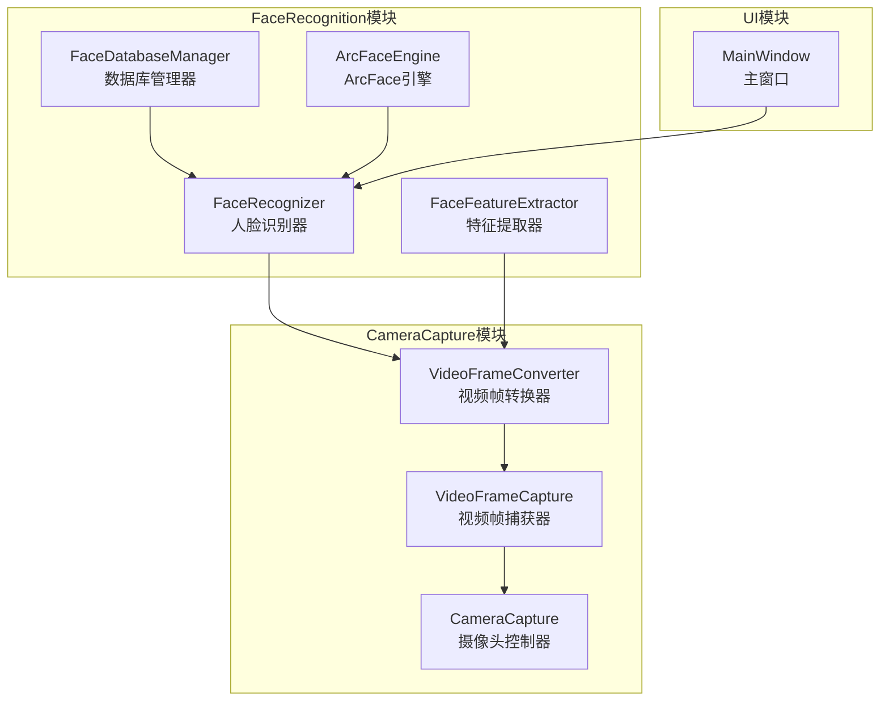
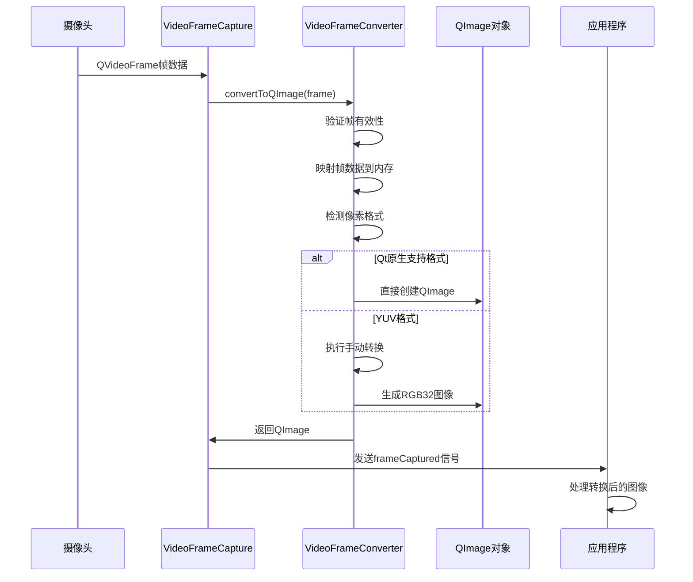
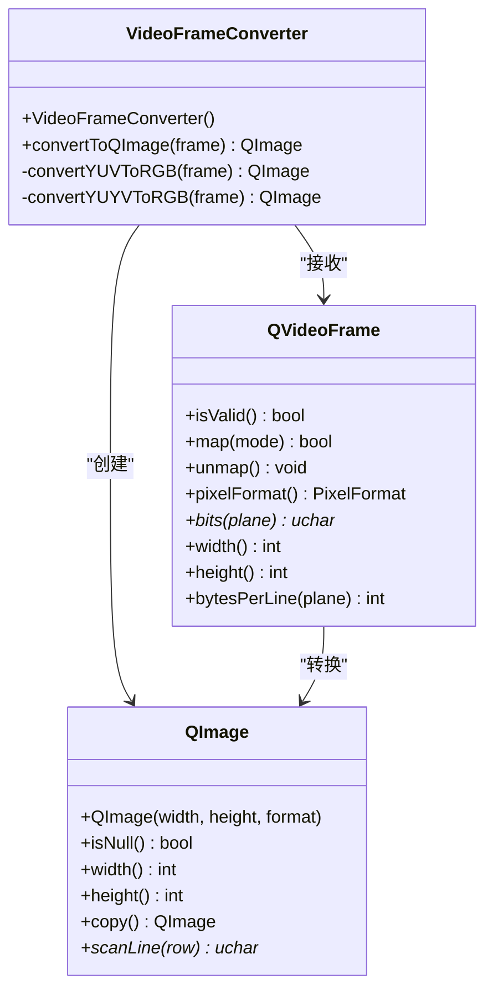
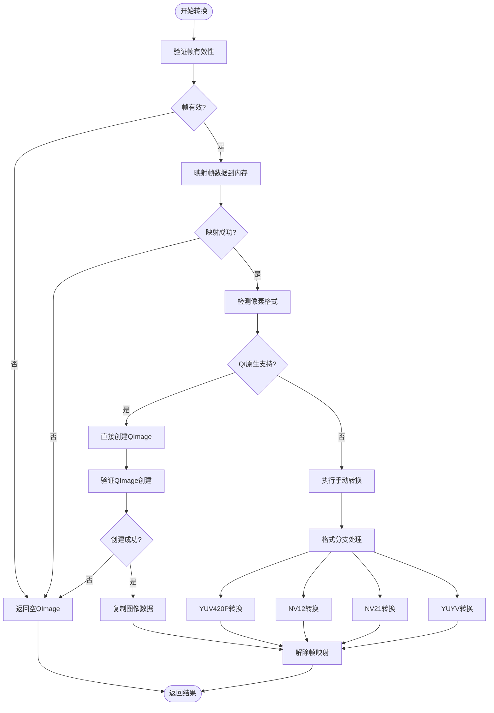
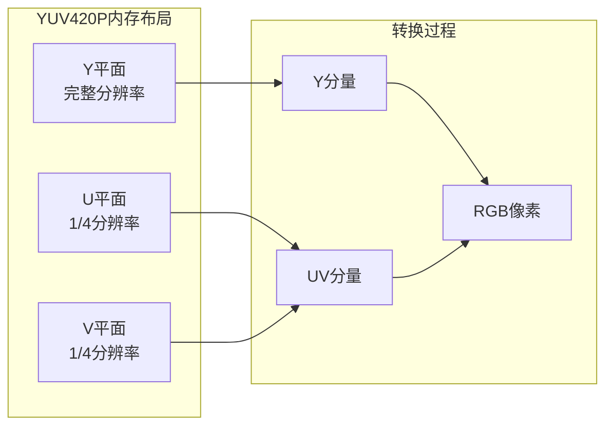
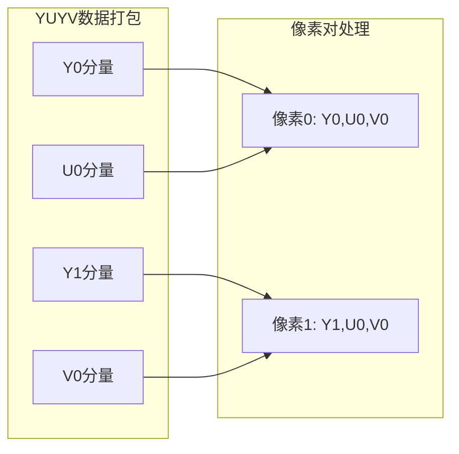
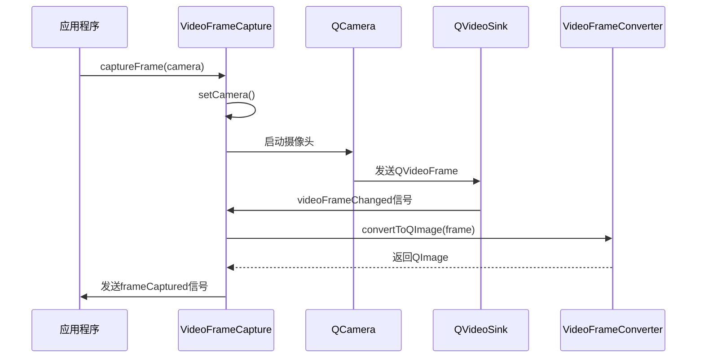
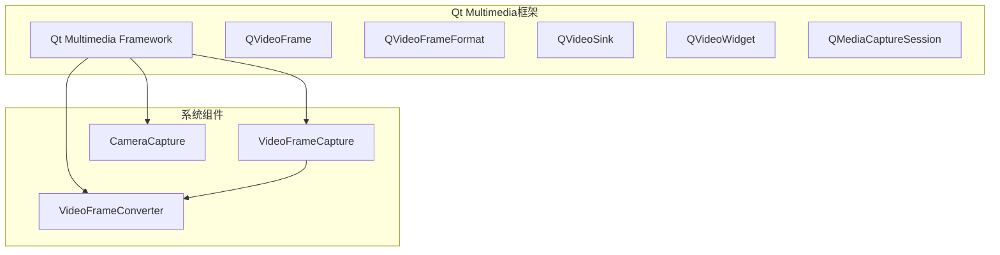
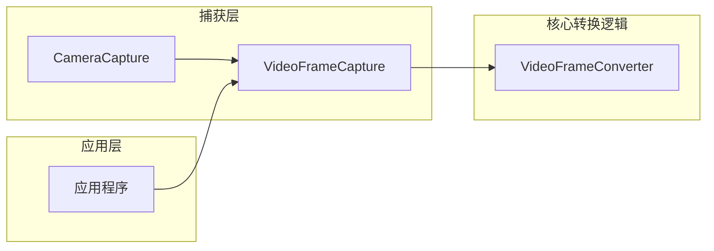
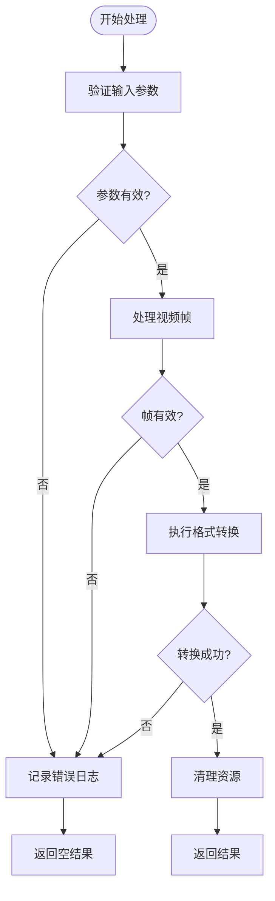

# 帧格式转换

<cite>
**本文档引用的文件**
- [videoframeconverter.h](file://CameraCapture/videoframeconverter.h)
- [videoframeconverter.cpp](file://CameraCapture/videoframeconverter.cpp)
- [videoframecapture.h](file://CameraCapture/videoframecapture.h)
- [videoframecapture.cpp](file://CameraCapture/videoframecapture.cpp)
- [cameracapture.h](file://CameraCapture/cameracapture.h)
- [cameracapture.cpp](file://CameraCapture/cameracapture.cpp)
- [CMakeLists.txt](file://CMakeLists.txt)
</cite>

## 目录
1. [简介](#简介)
2. [项目结构](#项目结构)
3. [核心组件](#核心组件)
4. [架构概览](#架构概览)
5. [详细组件分析](#详细组件分析)
6. [依赖关系分析](#依赖关系分析)
7. [性能考量](#性能考量)
8. [故障排除指南](#故障排除指南)
9. [结论](#结论)

## 简介

本项目实现了基于Qt框架的视频帧格式转换组件，专门用于将来自摄像头的视频帧转换为QImage格式，以便进行后续的图像处理和人脸识别操作。该组件支持多种常见的视频帧格式，包括Qt原生支持的RGB格式和常见的YUV格式（YUV420P、NV12、NV21、YUYV）。

视频帧格式转换是计算机视觉系统中的关键组件，特别是在人脸检测和识别应用中，需要将摄像头捕获的原始视频数据转换为标准的RGB格式图像。本组件通过智能检测和自动转换机制，为上层应用提供了统一的图像接口。

## 项目结构

该项目采用模块化的组织结构，主要包含以下几个核心模块：



**图表来源**
- [CMakeLists.txt:35-45](file://CMakeLists.txt#L35-L45)

**章节来源**
- [CMakeLists.txt:16-82](file://CMakeLists.txt#L16-L82)

## 核心组件

### VideoFrameConverter类

VideoFrameConverter是整个帧格式转换系统的核心类，负责将QVideoFrame对象转换为QImage对象。该类提供了静态方法，无需实例化即可使用。

#### 主要功能特性

1. **智能格式检测**：自动识别输入视频帧的像素格式
2. **多格式支持**：支持Qt原生支持的RGB格式和YUV格式
3. **内存安全**：确保原始视频帧数据的安全管理和生命周期控制
4. **错误处理**：完善的错误检测和异常处理机制

#### 支持的像素格式

| 格式类型 | 格式标识 | 描述 | 应用场景 |
|---------|----------|------|----------|
| RGB | RGB32, ARGB32 | Qt原生支持的RGB格式 | 通用图像处理 |
| YUV | YUV420P (I420) | 分离平面的YUV格式 | 传统视频编码 |
| YUV | NV12 | UV交错的YUV格式 | 移动设备摄像头 |
| YUV | NV21 | VU交错的YUV格式 | 某些移动设备 |
| YUV | YUYV (YUY2) | 打包的YUV 4:2:2格式 | 实时视频传输 |

**章节来源**
- [videoframeconverter.h:10-14](file://CameraCapture/videoframeconverter.h#L10-L14)
- [videoframeconverter.cpp:65-78](file://CameraCapture/videoframeconverter.cpp#L65-L78)

## 架构概览

视频帧转换系统的整体架构采用分层设计，从底层的摄像头捕获到上层的应用处理形成了清晰的数据流：



**图表来源**
- [videoframecapture.cpp:71-79](file://CameraCapture/videoframecapture.cpp#L71-L79)
- [videoframeconverter.cpp:16-85](file://CameraCapture/videoframeconverter.cpp#L16-L85)

## 详细组件分析

### VideoFrameConverter类详细分析

#### 类结构图



**图表来源**
- [videoframeconverter.h:25-68](file://CameraCapture/videoframeconverter.h#L25-L68)
- [videoframeconverter.cpp:16-85](file://CameraCapture/videoframeconverter.cpp#L16-L85)

#### 转换流程详解

##### 1. 帧验证阶段

转换过程的第一步是对输入的QVideoFrame进行完整性检查：



**图表来源**
- [videoframeconverter.cpp:16-85](file://CameraCapture/videoframeconverter.cpp#L16-L85)

##### 2. YUV到RGB转换算法

对于YUV格式的视频帧，系统实现了精确的色彩空间转换算法：

###### YUV420P (I420)格式转换

YUV420P是最常见的YUV格式之一，采用分离的平面存储方式：



**图表来源**
- [videoframeconverter.cpp:113-144](file://CameraCapture/videoframeconverter.cpp#L113-L144)

###### NV12/NV21格式转换

NV12和NV21格式采用交错的UV平面存储，主要区别在于UV分量的顺序：

| 格式 | 存储顺序 | 应用场景 |
|------|----------|----------|
| NV12 | Y + UVUVUV... | Android设备、大多数移动设备 |
| NV21 | Y + VUVUVU... | 某些移动设备、特定硬件 |

**章节来源**
- [videoframeconverter.cpp:145-183](file://CameraCapture/videoframeconverter.cpp#L145-L183)

##### 3. YUYV格式转换

YUYV（YUY2）是一种打包的YUV 4:2:2格式，每个4字节包含两个像素的信息：



**图表来源**
- [videoframeconverter.cpp:199-245](file://CameraCapture/videoframeconverter.cpp#L199-L245)

#### 色彩空间转换数学模型

系统使用标准的YUV到RGB转换公式：

```
R = Y + 1.402 × (V - 128)
G = Y - 0.344 × (U - 128) - 0.714 × (V - 128)
B = Y + 1.772 × (U - 128)
```

其中：
- Y：亮度分量，范围0-255
- U、V：色度分量，范围0-255，中心值为128
- R、G、B：RGB分量，范围0-255

**章节来源**
- [videoframeconverter.cpp:88-98](file://CameraCapture/videoframeconverter.cpp#L88-L98)

### VideoFrameCapture类分析

VideoFrameCapture类负责视频帧的捕获和处理，它与VideoFrameConverter紧密协作：

#### 关键职责

1. **摄像头集成**：与QCamera和QMediaCaptureSession集成
2. **帧处理**：接收QVideoFrame并调用转换器进行格式转换
3. **信号发射**：向应用程序发送转换完成的信号
4. **状态管理**：管理摄像头的启动、停止和清理

#### 处理流程



**图表来源**
- [videoframecapture.cpp:71-79](file://CameraCapture/videoframecapture.cpp#L71-L79)

**章节来源**
- [videoframecapture.cpp:10-80](file://CameraCapture/videoframecapture.cpp#L10-L80)

### CameraCapture类分析

CameraCapture类提供了基础的摄像头管理功能：

#### 主要功能

1. **设备发现**：自动扫描系统中的可用摄像头
2. **实例管理**：创建和销毁QCamera实例
3. **生命周期控制**：确保摄像头资源的正确管理

**章节来源**
- [cameracapture.cpp:14-71](file://CameraCapture/cameracapture.cpp#L14-L71)

## 依赖关系分析

### 外部依赖

系统依赖于Qt多媒体框架的多个组件：



**图表来源**
- [CMakeLists.txt:16-17](file://CMakeLists.txt#L16-L17)

### 内部依赖关系



**图表来源**
- [videoframecapture.cpp:2-3](file://CameraCapture/videoframecapture.cpp#L2-L3)

**章节来源**
- [CMakeLists.txt:16-82](file://CMakeLists.txt#L16-L82)

## 性能考量

### 内存管理策略

1. **帧数据映射**：使用QVideoFrame::map()方法临时映射帧数据到内存
2. **数据复制**：转换完成后立即复制QImage数据，避免原始帧数据失效
3. **资源清理**：确保在转换失败或异常情况下正确释放资源

### 转换性能优化

1. **格式检测优化**：优先使用Qt原生支持的格式，避免不必要的转换
2. **内存布局优化**：针对不同YUV格式采用最优的内存访问模式
3. **循环优化**：使用高效的像素遍历算法减少计算开销

### 错误处理机制

系统实现了多层次的错误处理：



**图表来源**
- [videoframeconverter.cpp:18-84](file://CameraCapture/videoframeconverter.cpp#L18-L84)

## 故障排除指南

### 常见问题及解决方案

#### 1. 视频帧无效

**症状**：转换方法返回空QImage，控制台显示"视频帧无效"警告

**原因**：
- 摄像头未正确初始化
- 视频帧数据损坏
- 摄像头权限问题

**解决方案**：
- 检查摄像头初始化状态
- 验证摄像头权限设置
- 确认视频帧数据完整性

#### 2. 帧映射失败

**症状**：转换过程中出现"无法映射视频帧"错误

**原因**：
- QVideoFrame::map()调用失败
- 内存不足
- 帧数据已被释放

**解决方案**：
- 检查系统内存使用情况
- 确保帧数据的有效性
- 重新初始化摄像头

#### 3. 图像创建失败

**症状**：QImage对象为空，尺寸为0

**原因**：
- 分配内存失败
- 帧尺寸无效
- 格式转换错误

**解决方案**：
- 检查目标图像格式兼容性
- 验证帧尺寸参数
- 查看转换算法实现

### 调试技巧

1. **启用调试输出**：取消注释调试语句以获取详细的帧信息
2. **监控内存使用**：使用系统工具监控内存分配和释放
3. **性能分析**：使用性能分析工具识别转换瓶颈

**章节来源**
- [videoframeconverter.cpp:19-84](file://CameraCapture/videoframeconverter.cpp#L19-L84)

## 结论

VideoFrameConverter组件为基于Qt的人脸识别系统提供了可靠的视频帧格式转换能力。通过智能的格式检测、精确的色彩空间转换算法和完善的错误处理机制，该组件能够高效地处理各种常见的视频帧格式。

### 主要优势

1. **广泛兼容性**：支持多种主流视频帧格式
2. **高性能实现**：优化的内存管理和转换算法
3. **健壮性**：完善的错误处理和资源管理
4. **易用性**：简洁的API设计和清晰的使用示例

### 技术特点

- **内存安全**：确保原始视频帧数据的安全管理和生命周期控制
- **格式透明**：对上层应用隐藏底层格式差异
- **实时性能**：适合实时视频处理应用
- **扩展性**：易于添加新的像素格式支持

该组件为整个AttendanceSystem项目提供了坚实的基础，使得上层的人脸识别功能能够专注于算法实现而非底层的视频处理细节。通过模块化的架构设计，系统具有良好的可维护性和可扩展性。