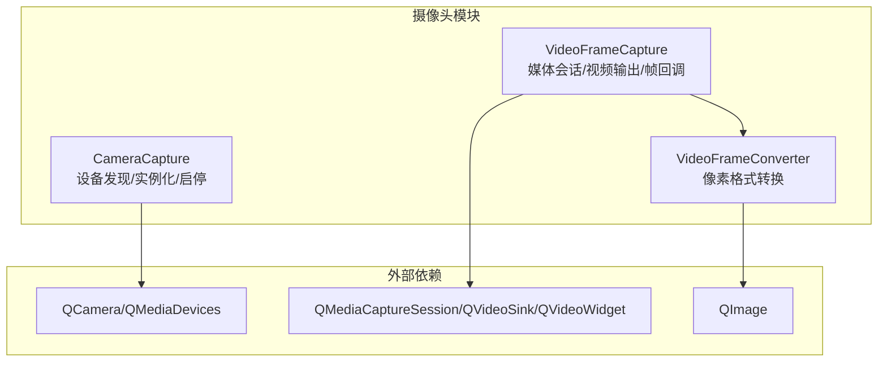
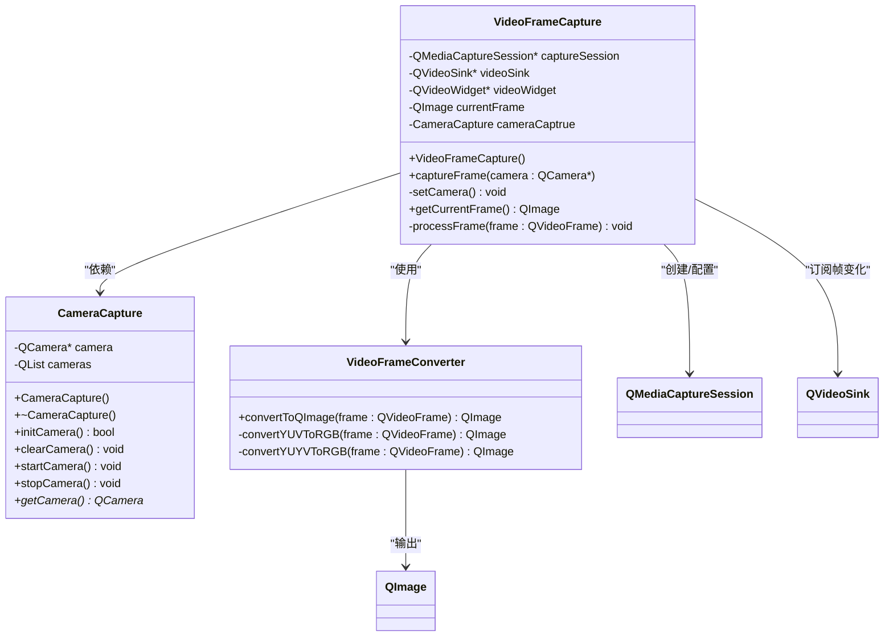
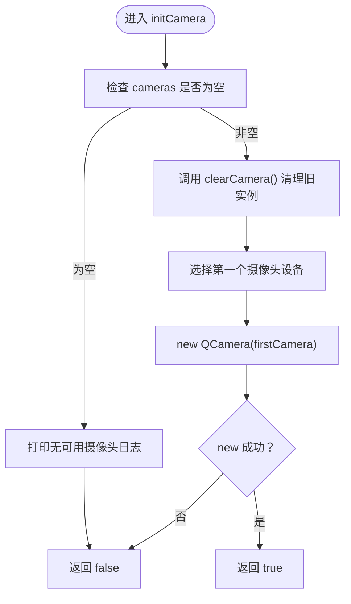
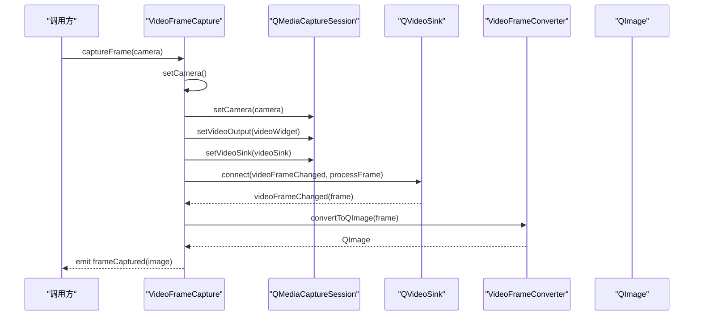
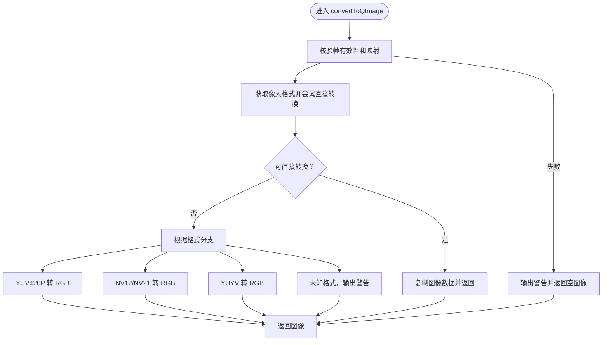
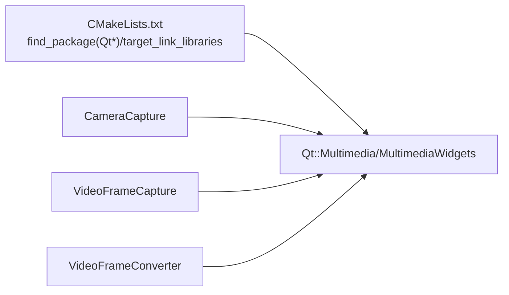

# 摄像头基础控制

<cite>
**本文引用的文件**
- [CameraCapture/cameracapture.h](file://CameraCapture/cameracapture.h)
- [CameraCapture/cameracapture.cpp](file://CameraCapture/cameracapture.cpp)
- [CameraCapture/videoframecapture.h](file://CameraCapture/videoframecapture.h)
- [CameraCapture/videoframecapture.cpp](file://CameraCapture/videoframecapture.cpp)
- [CameraCapture/videoframeconverter.h](file://CameraCapture/videoframeconverter.h)
- [CameraCapture/videoframeconverter.cpp](file://CameraCapture/videoframeconverter.cpp)
- [CMakeLists.txt](file://CMakeLists.txt)
- [AttendanceCheckClient开发文档.md](file://AttendanceCheckClient开发文档.md)
- [mainwindow.h](file://mainwindow.h)
- [mainwindow.cpp](file://mainwindow.cpp)
</cite>

## 目录
1. [简介](#简介)
2. [项目结构](#项目结构)
3. [核心组件](#核心组件)
4. [架构总览](#架构总览)
5. [详细组件分析](#详细组件分析)
6. [依赖关系分析](#依赖关系分析)
7. [性能考虑](#性能考虑)
8. [故障排查指南](#故障排查指南)
9. [结论](#结论)
10. [附录](#附录)

## 简介
本文件面向“摄像头基础控制”模块，围绕 CameraCapture 类及其配套的视频帧采集与转换能力，系统性阐述摄像头设备发现、初始化、生命周期管理、错误处理与最佳实践。文档同时给出关键方法的调用序列与时序图，帮助开发者在 Qt Multimedia 框架下正确集成摄像头功能，并在实际业务（如人脸识别打卡）中高效复用。

## 项目结构
摄像头相关代码位于 CameraCapture 目录，主要由三层组成：
- 基础控制层：CameraCapture，负责设备发现、实例化、启停与资源释放
- 视频采集层：VideoFrameCapture，负责建立媒体捕获会话、接收视频帧并触发转换
- 帧转换层：VideoFrameConverter，负责将不同像素格式的视频帧转换为 QImage

图表来源
- [CameraCapture/cameracapture.h:1-31](file://CameraCapture/cameracapture.h#L1-L31)
- [CameraCapture/cameracapture.cpp:1-72](file://CameraCapture/cameracapture.cpp#L1-L72)
- [CameraCapture/videoframecapture.h:1-45](file://CameraCapture/videoframecapture.h#L1-L45)
- [CameraCapture/videoframecapture.cpp:1-80](file://CameraCapture/videoframecapture.cpp#L1-L80)
- [CameraCapture/videoframeconverter.h:1-72](file://CameraCapture/videoframeconverter.h#L1-L72)
- [CameraCapture/videoframeconverter.cpp:1-246](file://CameraCapture/videoframeconverter.cpp#L1-L246)

章节来源
- [CMakeLists.txt:16-82](file://CMakeLists.txt#L16-L82)
- [AttendanceCheckClient开发文档.md:22-30](file://AttendanceCheckClient开发文档.md#L22-L30)

## 核心组件
- CameraCapture：封装摄像头设备发现、实例化、启停与资源释放；提供 getCamera 获取底层 QCamera 指针
- VideoFrameCapture：基于 QMediaCaptureSession 建立媒体会话，绑定 QVideoWidget 作为视频输出，并通过 QVideoSink 接收帧变化信号
- VideoFrameConverter：将 QVideoFrame 转换为 QImage，覆盖 Qt 原生支持格式与常见 YUV/YUYV 等格式

章节来源
- [CameraCapture/cameracapture.h:9-28](file://CameraCapture/cameracapture.h#L9-L28)
- [CameraCapture/cameracapture.cpp:3-71](file://CameraCapture/cameracapture.cpp#L3-L71)
- [CameraCapture/videoframecapture.h:14-42](file://CameraCapture/videoframecapture.h#L14-L42)
- [CameraCapture/videoframecapture.cpp:10-79](file://CameraCapture/videoframecapture.cpp#L10-L79)
- [CameraCapture/videoframeconverter.h:25-72](file://CameraCapture/videoframeconverter.h#L25-L72)
- [CameraCapture/videoframeconverter.cpp:16-85](file://CameraCapture/videoframeconverter.cpp#L16-L85)

## 架构总览
摄像头控制采用“控制层 + 采集层 + 转换层”的分层设计，职责清晰、耦合度低，便于扩展与维护。

图表来源
- [CameraCapture/cameracapture.h:9-28](file://CameraCapture/cameracapture.h#L9-L28)
- [CameraCapture/videoframecapture.h:14-42](file://CameraCapture/videoframecapture.h#L14-L42)
- [CameraCapture/videoframeconverter.h:25-72](file://CameraCapture/videoframeconverter.h#L25-L72)

## 详细组件分析

### CameraCapture 组件分析
- 设备发现：构造函数中通过 QMediaDevices::videoInputs() 获取可用摄像头列表
- 初始化：initCamera() 检查设备列表非空，先清理旧实例，再以第一个设备实例化 QCamera
- 生命周期：析构时调用 clearCamera()；startCamera()/stopCamera() 仅在必要时启停
- 资源释放：clearCamera() 在存在活动状态时先 stop()，再 delete 并置空指针

图表来源
- [CameraCapture/cameracapture.cpp:15-33](file://CameraCapture/cameracapture.cpp#L15-L33)

章节来源
- [CameraCapture/cameracapture.h:13-28](file://CameraCapture/cameracapture.h#L13-L28)
- [CameraCapture/cameracapture.cpp:3-71](file://CameraCapture/cameracapture.cpp#L3-L71)

### VideoFrameCapture 组件分析
- 会话建立：captureFrame() 接收外部传入的 QCamera 指针，内部创建 QMediaCaptureSession 并绑定摄像头
- 视频输出：创建 QVideoWidget 并设置为视频输出，同时获取其 QVideoSink
- 帧回调：订阅 QVideoSink::videoFrameChanged 信号，在槽函数中调用 VideoFrameConverter 转换为 QImage，并发出 frameCaptured 信号
- 当前帧：提供 getCurrentFrame() 返回最近一次转换成功的图像

图表来源
- [CameraCapture/videoframecapture.cpp:10-79](file://CameraCapture/videoframecapture.cpp#L10-L79)
- [CameraCapture/videoframeconverter.cpp:16-85](file://CameraCapture/videoframeconverter.cpp#L16-L85)

章节来源
- [CameraCapture/videoframecapture.h:14-42](file://CameraCapture/videoframecapture.h#L14-L42)
- [CameraCapture/videoframecapture.cpp:10-79](file://CameraCapture/videoframecapture.cpp#L10-L79)

### VideoFrameConverter 组件分析
- 自动识别：convertToQImage() 先尝试使用 QVideoFrameFormat::imageFormatFromPixelFormat() 判断是否可直接创建 QImage
- 直接转换：若支持，按 bytesPerLine 正确构造 QImage，并 copy 一份避免 unmap 后数据失效
- 手动转换：对 YUV420P、NV12/NV21、YUYV 等格式，分别实现对应的 YUV→RGB 转换
- 错误处理：对无效帧、映射失败、未知格式等情况输出警告并返回空图像

图表来源
- [CameraCapture/videoframeconverter.cpp:16-85](file://CameraCapture/videoframeconverter.cpp#L16-L85)
- [CameraCapture/videoframeconverter.cpp:99-187](file://CameraCapture/videoframeconverter.cpp#L99-L187)
- [CameraCapture/videoframeconverter.cpp:199-245](file://CameraCapture/videoframeconverter.cpp#L199-L245)

章节来源
- [CameraCapture/videoframeconverter.h:25-72](file://CameraCapture/videoframeconverter.h#L25-L72)
- [CameraCapture/videoframeconverter.cpp:16-246](file://CameraCapture/videoframeconverter.cpp#L16-L246)

## 依赖关系分析
- Qt 模块依赖：CMake 中明确链接 Qt::Multimedia 与 Qt::MultimediaWidgets，确保 QCamera、QMediaDevices、QMediaCaptureSession、QVideoSink、QVideoWidget 可用
- 组件耦合：VideoFrameCapture 对 CameraCapture 存在组合关系（持有实例），但对外通过 QCamera 指针解耦；VideoFrameConverter 与具体设备无关，仅依赖 Qt 媒体框架

图表来源
- [CMakeLists.txt:16-82](file://CMakeLists.txt#L16-L82)

章节来源
- [CMakeLists.txt:16-82](file://CMakeLists.txt#L16-L82)

## 性能考虑
- 帧映射与拷贝：VideoFrameConverter 在直接转换路径中会 copy 图像，避免 unmap 后数据失效，但会带来额外内存占用；建议在高频回调场景中评估内存峰值
- 像素格式分支：对 YUV/NV12/NV21/YUYV 的手动转换为纯 CPU 实现，复杂度与分辨率成正比；建议在高分辨率场景下考虑降帧率或降低分辨率
- 会话与输出：VideoFrameCapture 通过 QVideoWidget 显示预览，若仅需后台采集可移除视频输出以节省资源
- 生命周期：CameraCapture 的启停逻辑避免重复 start，减少不必要的资源切换

## 故障排查指南
- 无可用摄像头
  - 现象：initCamera() 返回 false，控制台打印无可用摄像头
  - 排查：确认系统已接入摄像头设备，检查驱动与权限；确认 QMediaDevices::videoInputs() 返回非空
  - 参考路径：[CameraCapture/cameracapture.cpp:18-21](file://CameraCapture/cameracapture.cpp#L18-L21)
- 帧无效或映射失败
  - 现象：convertToQImage() 返回空图像并输出警告
  - 排查：确认 QVideoFrame 有效且可映射；检查像素格式是否受支持；确认 QVideoSink 信号连接正常
  - 参考路径：[CameraCapture/videoframeconverter.cpp:19-30](file://CameraCapture/videoframeconverter.cpp#L19-L30)
- 未知像素格式
  - 现象：convertToQImage() 输出未知格式警告
  - 排查：确认摄像头输出格式是否为 YUV420P/NV12/NV21/YUYV 等之一；必要时扩展转换分支
  - 参考路径：[CameraCapture/videoframeconverter.cpp:77-78](file://CameraCapture/videoframeconverter.cpp#L77-L78)
- 重复启停导致资源冲突
  - 现象：start/stop 异常或崩溃
  - 排查：确保在 clearCamera() 后再重新 initCamera()；避免在未 stop 的情况下重复 start
  - 参考路径：[CameraCapture/cameracapture.cpp:36-65](file://CameraCapture/cameracapture.cpp#L36-L65)

章节来源
- [CameraCapture/cameracapture.cpp:18-33](file://CameraCapture/cameracapture.cpp#L18-L33)
- [CameraCapture/videoframeconverter.cpp:19-30](file://CameraCapture/videoframeconverter.cpp#L19-L30)
- [CameraCapture/videoframeconverter.cpp:77-85](file://CameraCapture/videoframeconverter.cpp#L77-L85)
- [CameraCapture/cameracapture.cpp:36-65](file://CameraCapture/cameracapture.cpp#L36-L65)

## 结论
CameraCapture 及其配套组件提供了完整的摄像头基础控制能力：设备发现、实例化、启停与资源释放；结合 VideoFrameCapture 的媒体会话与帧回调，以及 VideoFrameConverter 的多格式转换，形成从设备到图像的完整链路。遵循本文的调用顺序与最佳实践，可在 Qt Multimedia 框架下稳定地集成摄像头功能，并为上层人脸识别等业务提供高质量的视频输入。

## 附录

### 关键方法与使用场景
- initCamera()
  - 场景：应用启动时初始化摄像头，选择首个可用设备
  - 注意：需在调用前确保 QMediaDevices::videoInputs() 返回非空
  - 参考路径：[CameraCapture/cameracapture.cpp:15-33](file://CameraCapture/cameracapture.cpp#L15-L33)
- startCamera()/stopCamera()
  - 场景：开始/暂停视频采集；避免重复 start
  - 参考路径：[CameraCapture/cameracapture.cpp:48-65](file://CameraCapture/cameracapture.cpp#L48-L65)
- clearCamera()
  - 场景：释放摄像头实例，退出或切换设备前调用
  - 参考路径：[CameraCapture/cameracapture.cpp:36-45](file://CameraCapture/cameracapture.cpp#L36-L45)
- captureFrame(QCamera*)
  - 场景：将已有 QCamera 注入到采集会话，建立视频输出与帧回调
  - 参考路径：[CameraCapture/videoframecapture.cpp:10-19](file://CameraCapture/videoframecapture.cpp#L10-L19)
- getCurrentFrame()
  - 场景：获取最近一次转换成功的 QImage，供后续处理（如人脸识别）
  - 参考路径：[CameraCapture/videoframecapture.cpp:65-68](file://CameraCapture/videoframecapture.cpp#L65-L68)

### Qt Multimedia 最佳实践
- 权限与设备可见性
  - 在桌面平台，确保摄像头驱动正常；在 Android/iOS 平台，遵循系统权限申请流程
  - 使用 QMediaDevices::videoInputs() 获取设备列表，避免硬编码设备名
- 生命周期管理
  - 先 stop 再 delete，避免资源泄漏；析构时统一走 clearCamera()
- 帧处理
  - 在 processFrame 中尽量轻量化处理，避免阻塞 QVideoSink 的回调线程
  - 如需进一步处理，建议异步队列或后台线程
- 转换策略
  - 优先使用 Qt 原生支持的像素格式，减少手动转换成本
  - 对 YUV/NV12/NV21/YUYV 等格式，注意内存对齐与行字节宽度

### 示例参考路径
- 初始化摄像头与启动采集
  - [CameraCapture/cameracapture.cpp:15-33](file://CameraCapture/cameracapture.cpp#L15-L33)
  - [CameraCapture/videoframecapture.cpp:10-19](file://CameraCapture/videoframecapture.cpp#L10-L19)
- 获取当前帧并处理
  - [CameraCapture/videoframecapture.cpp:65-79](file://CameraCapture/videoframecapture.cpp#L65-L79)
  - [CameraCapture/videoframeconverter.cpp:16-85](file://CameraCapture/videoframeconverter.cpp#L16-L85)