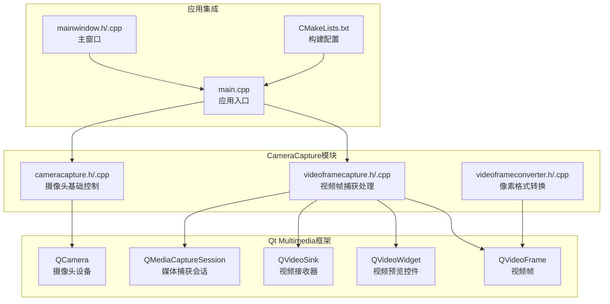
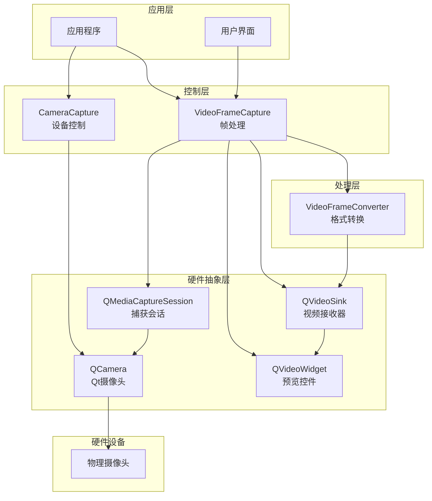
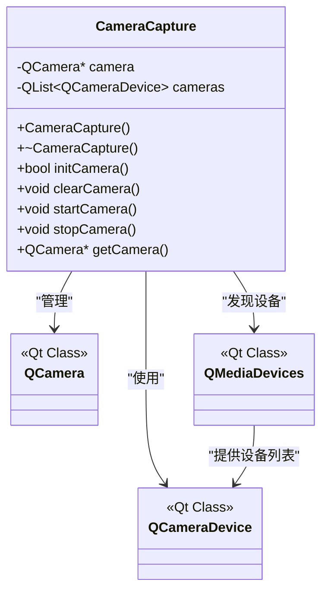
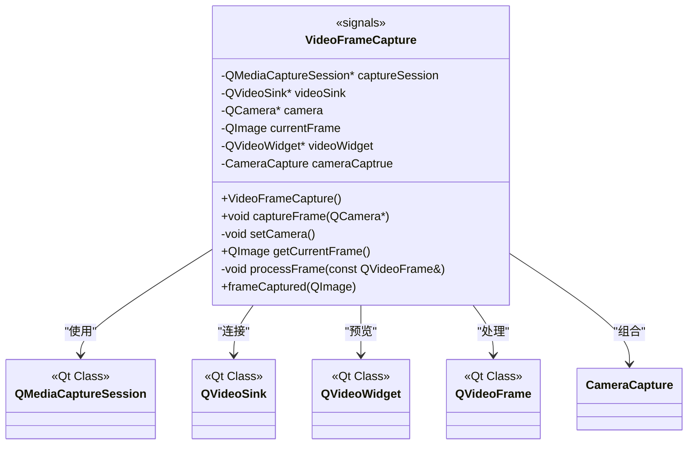
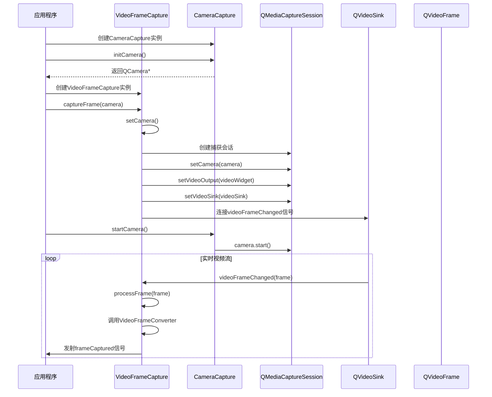
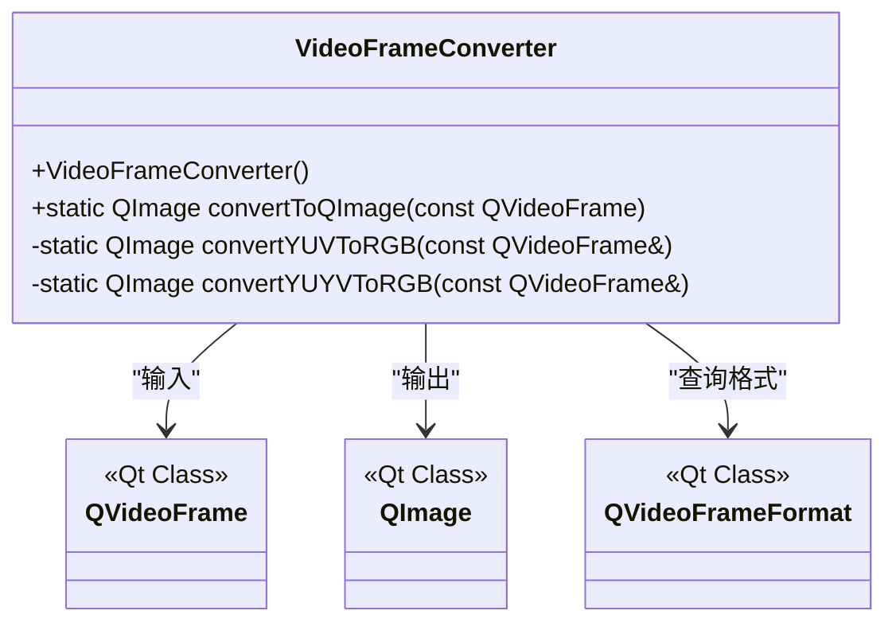
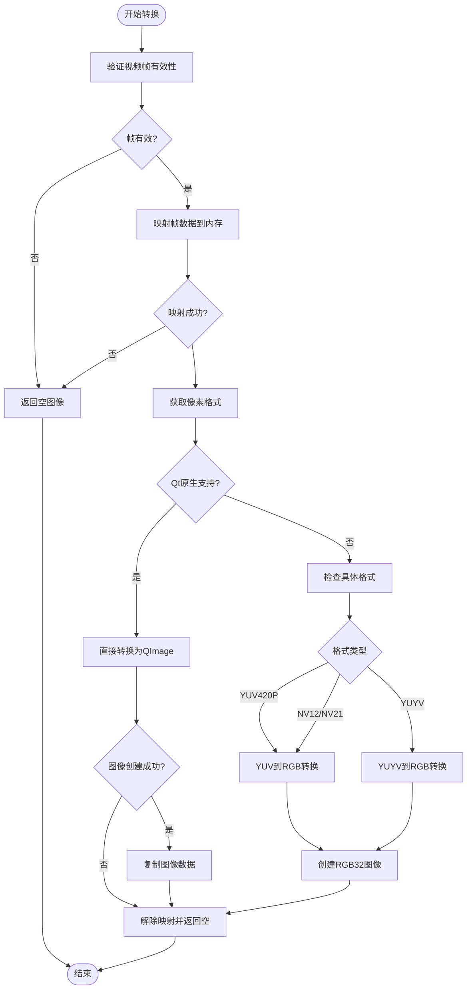
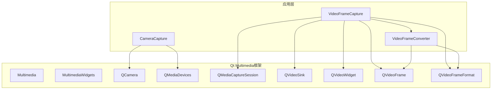
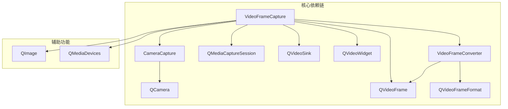

# 摄像头采集模块

<cite>
**本文档引用的文件**
- [cameracapture.h](file://CameraCapture/cameracapture.h)
- [cameracapture.cpp](file://CameraCapture/cameracapture.cpp)
- [videoframecapture.h](file://CameraCapture/videoframecapture.h)
- [videoframecapture.cpp](file://CameraCapture/videoframecapture.cpp)
- [videoframeconverter.h](file://CameraCapture/videoframeconverter.h)
- [videoframeconverter.cpp](file://CameraCapture/videoframeconverter.cpp)
- [CMakeLists.txt](file://CMakeLists.txt)
- [main.cpp](file://main.cpp)
- [mainwindow.h](file://mainwindow.h)
- [mainwindow.cpp](file://mainwindow.cpp)
</cite>

## 目录
1. [简介](#简介)
2. [项目结构](#项目结构)
3. [核心组件](#核心组件)
4. [架构概览](#架构概览)
5. [详细组件分析](#详细组件分析)
6. [依赖关系分析](#依赖关系分析)
7. [性能考虑](#性能考虑)
8. [故障排除指南](#故障排除指南)
9. [结论](#结论)
10. [附录](#附录)

## 简介

摄像头采集模块是基于Qt Multimedia框架构建的视频采集系统，专门用于人脸识别应用中的实时视频流处理。该模块提供了完整的摄像头设备管理、视频帧捕获、像素格式转换等功能，支持多种常见的视频格式（YUV420P、NV12、NV21、YUYV等），并实现了高效的帧格式转换机制。

本模块采用分层架构设计，通过CameraCapture基础设备控制类、VideoFrameCapture视频流处理类和VideoFrameConverter像素格式转换类的协同工作，实现了从硬件设备到可处理图像数据的完整链路。

## 项目结构

摄像头采集模块位于项目根目录的CameraCapture子目录中，包含四个核心文件：



**图表来源**
- [cameracapture.h:1-31](file://CameraCapture/cameracapture.h#L1-L31)
- [videoframecapture.h:1-45](file://CameraCapture/videoframecapture.h#L1-L45)
- [videoframeconverter.h:1-72](file://CameraCapture/videoframeconverter.h#L1-L72)

**章节来源**
- [CMakeLists.txt:16-82](file://CMakeLists.txt#L16-L82)
- [main.cpp:13-27](file://main.cpp#L13-L27)

## 核心组件

### CameraCapture 基础设备控制类

CameraCapture类是摄像头采集模块的基础控制类，负责摄像头设备的发现、初始化、启动和停止操作。该类封装了Qt Multimedia框架中的QCamera类，提供了简化的API接口。

主要功能特性：
- 自动扫描系统可用的摄像头设备
- 单例模式管理摄像头实例
- 设备状态监控和生命周期管理
- 基础的错误处理机制

关键API接口：
- `initCamera()`: 初始化摄像头设备，返回布尔值表示成功与否
- `startCamera()`: 启动摄像头采集
- `stopCamera()`: 停止摄像头采集
- `clearCamera()`: 释放摄像头资源
- `getCamera()`: 获取内部QCamera实例指针

### VideoFrameCapture 视频流处理类

VideoFrameCapture类负责视频流的捕获和处理，继承自QObject以支持Qt的信号槽机制。该类通过QMediaCaptureSession建立摄像头与视频接收器之间的连接，实现实时视频帧的捕获和处理。

核心功能：
- 建立媒体捕获会话连接
- 实时视频帧接收和处理
- 预览控件集成（QVideoWidget）
- 帧数据到QImage的转换
- 异步帧捕获通知机制

**章节来源**
- [cameracapture.h:9-28](file://CameraCapture/cameracapture.h#L9-L28)
- [cameracapture.cpp:14-71](file://CameraCapture/cameracapture.cpp#L14-L71)
- [videoframecapture.h:14-42](file://CameraCapture/videoframecapture.h#L14-L42)
- [videoframecapture.cpp:10-79](file://CameraCapture/videoframecapture.cpp#L10-L79)

## 架构概览

摄像头采集模块采用分层架构设计，各组件职责明确，耦合度低，便于维护和扩展：



**图表来源**
- [cameracapture.h:9-28](file://CameraCapture/cameracapture.h#L9-L28)
- [videoframecapture.h:14-42](file://CameraCapture/videoframecapture.h#L14-L42)
- [videoframeconverter.h:25-69](file://CameraCapture/videoframeconverter.h#L25-L69)

## 详细组件分析

### CameraCapture 类详细分析

CameraCapture类是整个摄像头采集系统的核心基础类，提供了设备级别的控制能力。

#### 类结构图



**图表来源**
- [cameracapture.h:9-28](file://CameraCapture/cameracapture.h#L9-L28)

#### 关键实现细节

1. **设备发现机制**：通过QMediaDevices::videoInputs()静态方法自动扫描系统中的可用摄像头设备，存储在QList<QCameraDevice>中。

2. **设备初始化流程**：
   - 检查可用设备列表是否为空
   - 清理之前的摄像头实例
   - 使用第一个可用设备创建QCamera实例
   - 返回初始化结果

3. **资源管理**：实现了完整的RAII模式，确保摄像头资源的正确分配和释放。

**章节来源**
- [cameracapture.cpp:3-71](file://CameraCapture/cameracapture.cpp#L3-L71)

### VideoFrameCapture 类详细分析

VideoFrameCapture类负责视频流的捕获和处理，是连接硬件设备和应用逻辑的桥梁。

#### 类结构图



**图表来源**
- [videoframecapture.h:14-42](file://CameraCapture/videoframecapture.h#L14-L42)

#### 视频捕获流程



**图表来源**
- [videoframecapture.cpp:10-79](file://CameraCapture/videoframecapture.cpp#L10-L79)

#### 关键处理逻辑

1. **捕获会话建立**：通过QMediaCaptureSession将QCamera、QVideoWidget和QVideoSink连接起来，形成完整的视频采集链路。

2. **实时帧处理**：当QVideoSink检测到新的视频帧时，通过processFrame槽函数接收帧数据，调用VideoFrameConverter进行格式转换。

3. **异步通知机制**：转换完成后通过frameCaptured信号向应用程序发送通知，实现非阻塞的数据传输。

**章节来源**
- [videoframecapture.cpp:22-79](file://CameraCapture/videoframecapture.cpp#L22-L79)

### VideoFrameConverter 类详细分析

VideoFrameConverter类是像素格式转换的核心组件，支持多种常见的视频帧格式转换。

#### 类结构图



**图表来源**
- [videoframeconverter.h:25-69](file://CameraCapture/videoframeconverter.h#L25-L69)

#### 支持的像素格式

| 格式名称 | 描述 | 特点 |
|---------|------|------|
| RGB32 | Qt原生支持 | 直接转换，性能最佳 |
| ARGB32 | Qt原生支持 | 直接转换，支持透明度 |
| YUV420P | I420格式 | 分离平面存储，压缩率高 |
| NV12 | 交错UV平面 | 移动设备常用格式 |
| NV21 | 交错VU平面 | 与NV12类似，但UV顺序相反 |
| YUYV | YUY2打包格式 | 4:2:2下采样，效率较高 |

#### 转换算法实现



**图表来源**
- [videoframeconverter.cpp:16-85](file://CameraCapture/videoframeconverter.cpp#L16-L85)

#### YUV到RGB转换算法

对于YUV格式的转换，采用了标准的YUV到RGB色彩空间转换公式：

```
R = Y + 1.402 × (V - 128)
G = Y - 0.344 × (U - 128) - 0.714 × (V - 128)
B = Y + 1.772 × (U - 128)
```

其中Y、U、V的取值范围都是0-255，中心值为128。

**章节来源**
- [videoframeconverter.cpp:99-245](file://CameraCapture/videoframeconverter.cpp#L99-L245)

## 依赖关系分析

### 外部依赖关系

摄像头采集模块主要依赖Qt Multimedia框架的以下组件：



**图表来源**
- [CMakeLists.txt:16-82](file://CMakeLists.txt#L16-L82)

### 内部依赖关系

模块内部组件之间的依赖关系清晰且层次分明：



**图表来源**
- [cameracapture.h:23-24](file://CameraCapture/cameracapture.h#L23-L24)
- [videoframecapture.h:29-34](file://CameraCapture/videoframecapture.h#L29-L34)

**章节来源**
- [CMakeLists.txt:16-82](file://CMakeLists.txt#L16-L82)

## 性能考虑

### 内存管理优化

1. **帧数据映射策略**：VideoFrameConverter使用QVideoFrame::map()方法临时映射帧数据到内存，避免长期持有大量数据导致的内存压力。

2. **图像数据复制**：在解除帧映射后立即复制QImage数据，确保数据安全性的同时避免内存泄漏。

3. **资源生命周期管理**：CameraCapture类实现了完整的RAII模式，确保摄像头资源的正确释放。

### 处理效率优化

1. **格式检测优先**：先检查Qt原生支持的格式，避免不必要的手动转换开销。

2. **循环优化**：YUV转换算法使用高效的循环结构，减少不必要的计算。

3. **内存对齐处理**：正确处理bytesPerLine参数，确保图像数据的正确对齐。

### 实时性能保证

1. **异步处理机制**：通过Qt的信号槽机制实现异步帧处理，避免阻塞主线程。

2. **预览控件分离**：视频预览和帧处理使用不同的路径，减少相互影响。

3. **错误快速返回**：遇到无效帧或转换失败时快速返回，避免浪费处理时间。

## 故障排除指南

### 常见问题及解决方案

#### 1. 无可用摄像头设备

**症状**：initCamera()返回false，日志显示"无可用摄像头"

**原因分析**：
- 系统没有安装任何摄像头设备
- 摄像头驱动程序未正确安装
- 权限不足无法访问摄像头

**解决方法**：
```cpp
// 检查可用设备数量
if (cameras.isEmpty()) {
    qDebug() << "系统中没有检测到可用的摄像头设备";
    return false;
}

// 检查设备权限
QCamera camera(cameras[0]);
if (!camera.cameraDevice().isNull()) {
    qDebug() << "摄像头设备信息：" << camera.cameraDevice().description();
}
```

#### 2. 帧映射失败

**症状**：convertToQImage()返回空图像，日志显示"无法映射视频帧"

**原因分析**：
- QVideoFrame数据不可访问
- 内存不足导致映射失败
- 帧数据已被释放

**解决方法**：
```cpp
// 检查帧有效性
if (!frame.isValid()) {
    qWarning() << "视频帧无效";
    return QImage();
}

// 确保帧数据可访问
QVideoFrame cloneFrame = frame;
if (!cloneFrame.map(QVideoFrame::ReadOnly)) {
    qWarning() << "无法映射视频帧到内存";
    return QImage();
}
```

#### 3. 格式转换异常

**症状**：未知的像素格式警告，转换结果为空

**原因分析**：
- 不支持的视频格式
- 帧数据损坏
- 格式描述符错误

**解决方法**：
```cpp
// 添加格式支持检查
QVideoFrameFormat::PixelFormat pixelFormat = cloneFrame.pixelFormat();
switch (pixelFormat) {
    case QVideoFrameFormat::Format_YUV420P:
    case QVideoFrameFormat::Format_NV12:
    case QVideoFrameFormat::Format_NV21:
        // YUV格式处理
        break;
    case QVideoFrameFormat::Format_YUYV:
        // YUYV格式处理
        break;
    default:
        qWarning() << "不支持的像素格式:" << pixelFormat;
        break;
}
```

#### 4. 预览显示问题

**症状**：视频预览正常但帧处理失败

**原因分析**：
- QVideoWidget配置错误
- QVideoSink连接问题
- 捕获会话设置不当

**解决方法**：
```cpp
// 确保预览控件正确配置
if (videoWidget) {
    videoWidget->show();
    videoWidget->resize(640, 480);
}

// 检查视频输出设置
if (captureSession) {
    captureSession->setVideoOutput(videoWidget);
    captureSession->setVideoSink(videoSink);
}
```

**章节来源**
- [cameracapture.cpp:18-32](file://CameraCapture/cameracapture.cpp#L18-L32)
- [videoframeconverter.cpp:19-30](file://CameraCapture/videoframeconverter.cpp#L19-L30)
- [videoframecapture.cpp:41-61](file://CameraCapture/videoframecapture.cpp#L41-L61)

## 结论

摄像头采集模块基于Qt Multimedia框架构建，提供了完整的视频采集解决方案。通过CameraCapture、VideoFrameCapture和VideoFrameConverter三个核心类的协作，实现了从硬件设备到可处理图像数据的完整链路。

该模块的主要优势包括：
1. **模块化设计**：清晰的职责分离，便于维护和扩展
2. **多格式支持**：支持多种常见的视频格式转换
3. **性能优化**：高效的内存管理和异步处理机制
4. **错误处理**：完善的错误检测和处理机制
5. **平台兼容**：基于Qt框架，支持多平台部署

在实际应用中，建议重点关注以下方面：
- 设备权限和可用性检查
- 内存管理和资源释放
- 帧格式的兼容性和转换效率
- 异步处理的线程安全问题

## 附录

### API使用示例

#### 基本使用流程

```cpp
// 1. 创建摄像头控制实例
CameraCapture* cameraControl = new CameraCapture();

// 2. 初始化摄像头
if (!cameraControl->initCamera()) {
    qDebug() << "摄像头初始化失败";
    return;
}

// 3. 创建视频帧捕获实例
VideoFrameCapture* frameCapture = new VideoFrameCapture();

// 4. 开始视频捕获
frameCapture->captureFrame(cameraControl->getCamera());

// 5. 处理捕获的帧
connect(frameCapture, &VideoFrameCapture::frameCaptured, 
        [](const QImage& image) {
            // 处理图像数据
            processImage(image);
        });
```

#### 高级配置选项

```cpp
// 设置摄像头参数
QCamera* camera = cameraControl->getCamera();
QCameraInfo cameraInfo = QCameraInfo(camera->cameraDevice());

// 获取支持的分辨率
QList<QSize> resolutions = cameraInfo.supportedResolutions();
for (const QSize& size : resolutions) {
    qDebug() << "支持的分辨率:" << size.width() << "x" << size.height();
}

// 设置帧率
QCameraSettings settings;
settings.setFrameRate(30);
camera->setCameraSettings(settings);
```

### 构建配置说明

模块使用CMake进行构建，需要Qt6的Multimedia和MultimediaWidgets组件支持。主要配置包括：

- **Qt版本检测**：自动适配Qt5和Qt6的不同语法
- **组件链接**：正确链接Qt Multimedia相关库
- **编译选项**：启用C++17标准和UTF-8支持

**章节来源**
- [CMakeLists.txt:16-82](file://CMakeLists.txt#L16-L82)
- [main.cpp:13-27](file://main.cpp#L13-L27)