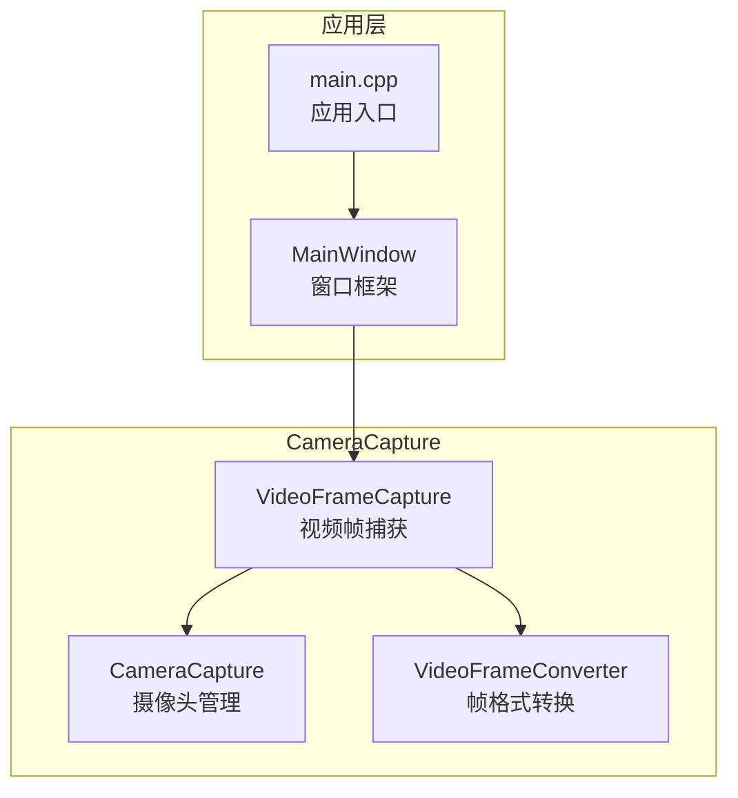
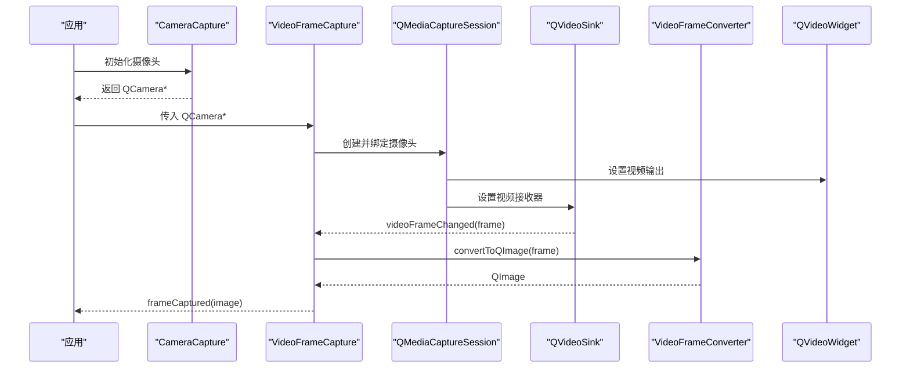
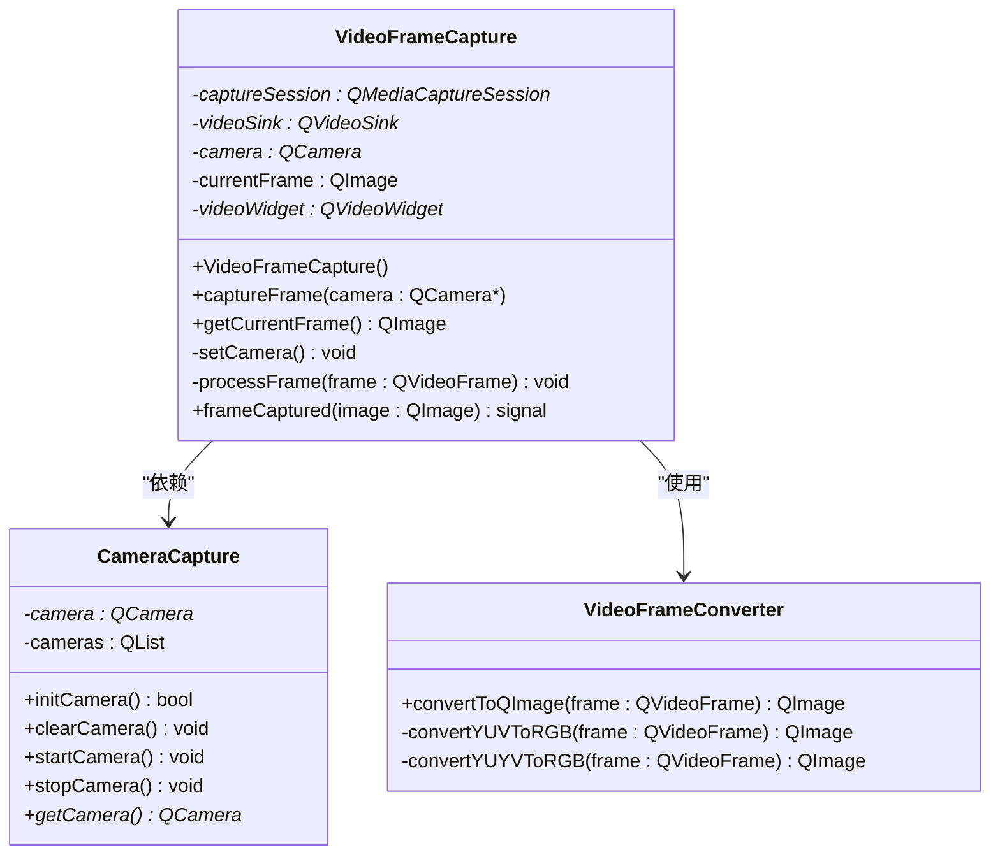
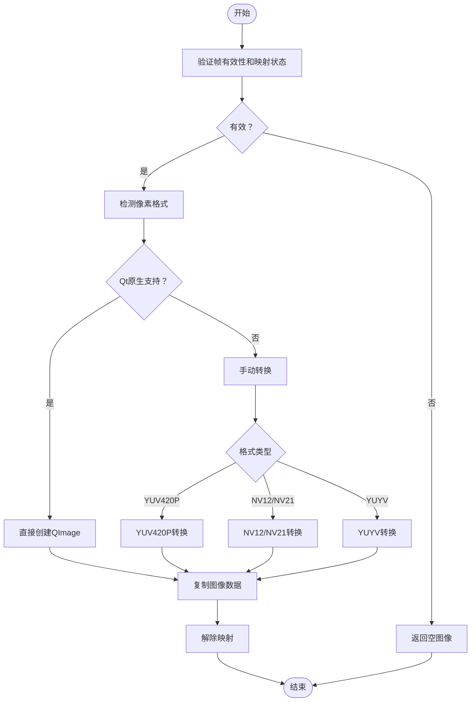
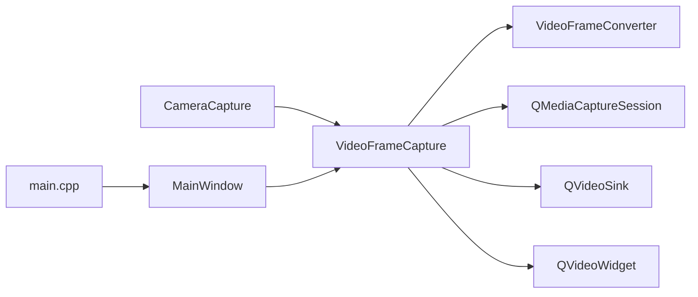

# 视频帧捕获

<cite>
**本文引用的文件**
- [videoframecapture.h](file://CameraCapture/videoframecapture.h)
- [videoframecapture.cpp](file://CameraCapture/videoframecapture.cpp)
- [cameracapture.h](file://CameraCapture/cameracapture.h)
- [cameracapture.cpp](file://CameraCapture/cameracapture.cpp)
- [videoframeconverter.h](file://CameraCapture/videoframeconverter.h)
- [videoframeconverter.cpp](file://CameraCapture/videoframeconverter.cpp)
- [main.cpp](file://main.cpp)
- [mainwindow.h](file://mainwindow.h)
- [mainwindow.cpp](file://mainwindow.cpp)
</cite>

## 目录
1. [简介](#简介)
2. [项目结构](#项目结构)
3. [核心组件](#核心组件)
4. [架构总览](#架构总览)
5. [详细组件分析](#详细组件分析)
6. [依赖关系分析](#依赖关系分析)
7. [性能考虑](#性能考虑)
8. [故障排查指南](#故障排查指南)
9. [结论](#结论)
10. [附录](#附录)

## 简介
本技术文档围绕视频帧捕获组件进行系统性说明，重点解析 VideoFrameCapture 类的视频流处理机制，涵盖视频帧的实时捕获、缓冲与帧率控制、启动/停止机制、帧数据获取与处理流程、内存管理策略以及参数调优方法。文档同时提供错误处理、异常恢复与性能监控的关键技术要点，并通过图示帮助读者理解组件间的交互关系与数据流向。

## 项目结构
本项目采用模块化组织，视频帧捕获相关代码集中在 CameraCapture 子目录中，主要由以下文件构成：
- videoframecapture.*：视频帧捕获与信号发射
- cameracapture.*：摄像头设备初始化与启停
- videoframeconverter.*：视频帧格式转换为 QImage
- main.cpp、mainwindow.*：应用入口与窗口框架

图表来源
- [videoframecapture.h:14-42](file://CameraCapture/videoframecapture.h#L14-L42)
- [cameracapture.h:9-28](file://CameraCapture/cameracapture.h#L9-L28)
- [videoframeconverter.h:25-42](file://CameraCapture/videoframeconverter.h#L25-L42)
- [main.cpp:13-26](file://main.cpp#L13-L26)
- [mainwindow.h:11-21](file://mainwindow.h#L11-L21)

章节来源
- [videoframecapture.h:1-45](file://CameraCapture/videoframecapture.h#L1-L45)
- [cameracapture.h:1-31](file://CameraCapture/cameracapture.h#L1-L31)
- [videoframeconverter.h:1-72](file://CameraCapture/videoframeconverter.h#L1-L72)
- [main.cpp:1-28](file://main.cpp#L1-L28)
- [mainwindow.h:1-23](file://mainwindow.h#L1-L23)

## 核心组件
- VideoFrameCapture：负责建立媒体捕获会话、连接视频帧变更信号、将 QVideoFrame 转换为 QImage 并发出帧捕获信号。
- CameraCapture：负责扫描可用摄像头、创建 QCamera 实例、启动/停止摄像头。
- VideoFrameConverter：负责将 QVideoFrame 转换为 QImage，支持 Qt 原生格式与常见 YUV/NV12/NV21/YUYV 等格式的手动转换。

章节来源
- [videoframecapture.h:14-42](file://CameraCapture/videoframecapture.h#L14-L42)
- [cameracapture.h:9-28](file://CameraCapture/cameracapture.h#L9-L28)
- [videoframeconverter.h:25-42](file://CameraCapture/videoframeconverter.h#L25-L42)

## 架构总览
VideoFrameCapture 通过 QMediaCaptureSession 绑定摄像头，利用 QVideoSink 的 videoFrameChanged 信号驱动帧处理；VideoFrameConverter 负责将底层视频帧格式统一转换为 QImage，供上层业务使用。

图表来源
- [videoframecapture.cpp:10-19](file://CameraCapture/videoframecapture.cpp#L10-L19)
- [videoframecapture.cpp:22-61](file://CameraCapture/videoframecapture.cpp#L22-L61)
- [videoframecapture.cpp:71-79](file://CameraCapture/videoframecapture.cpp#L71-L79)
- [videoframeconverter.cpp:16-85](file://CameraCapture/videoframeconverter.cpp#L16-L85)

## 详细组件分析

### VideoFrameCapture 类
职责与关键点：
- 接收 QCamera 指针，创建 QMediaCaptureSession 并绑定摄像头。
- 通过 QVideoWidget 设置视频输出，获取 QVideoSink 并连接 videoFrameChanged 信号。
- 在帧到达时调用 VideoFrameConverter 进行格式转换，更新当前帧并发出 frameCaptured 信号。
- 提供 getCurrentFrame 获取最近一次转换成功的 QImage。

图表来源
- [videoframecapture.h:14-42](file://CameraCapture/videoframecapture.h#L14-L42)
- [cameracapture.h:9-28](file://CameraCapture/cameracapture.h#L9-L28)
- [videoframeconverter.h:25-69](file://CameraCapture/videoframeconverter.h#L25-L69)

章节来源
- [videoframecapture.h:14-42](file://CameraCapture/videoframecapture.h#L14-L42)
- [videoframecapture.cpp:6-19](file://CameraCapture/videoframecapture.cpp#L6-L19)
- [videoframecapture.cpp:22-61](file://CameraCapture/videoframecapture.cpp#L22-L61)
- [videoframecapture.cpp:71-79](file://CameraCapture/videoframecapture.cpp#L71-L79)

### CameraCapture 类
职责与关键点：
- 扫描可用摄像头设备列表，选择首个设备创建 QCamera 实例。
- 提供 initCamera/startCamera/stopCamera/clearCamera 等生命周期管理方法。
- 通过 getCamera 获取当前摄像头指针供 VideoFrameCapture 使用。

章节来源
- [cameracapture.h:9-28](file://CameraCapture/cameracapture.h#L9-L28)
- [cameracapture.cpp:3-33](file://CameraCapture/cameracapture.cpp#L3-L33)
- [cameracapture.cpp:48-65](file://CameraCapture/cameracapture.cpp#L48-L65)
- [cameracapture.cpp:67-71](file://CameraCapture/cameracapture.cpp#L67-L71)

### VideoFrameConverter 类
职责与关键点：
- convertToQImage：验证帧有效性、映射内存、识别像素格式、按需转换为 QImage。
- 支持的格式：Qt 原生支持的像素格式（直接创建 QImage），以及 YUV420P、NV12、NV21、YUYV 等常见格式的手动转换。
- YUV 转 RGB 使用标准公式，并对边界值进行裁剪。
- YUYV 采用每 4 字节处理 2 个像素的方式，共享 U/V 分量。

图表来源
- [videoframeconverter.cpp:16-85](file://CameraCapture/videoframeconverter.cpp#L16-L85)
- [videoframeconverter.cpp:99-187](file://CameraCapture/videoframeconverter.cpp#L99-L187)
- [videoframeconverter.cpp:199-245](file://CameraCapture/videoframeconverter.cpp#L199-L245)

章节来源
- [videoframeconverter.h:25-69](file://CameraCapture/videoframeconverter.h#L25-L69)
- [videoframeconverter.cpp:16-85](file://CameraCapture/videoframeconverter.cpp#L16-L85)
- [videoframeconverter.cpp:99-187](file://CameraCapture/videoframeconverter.cpp#L99-L187)
- [videoframeconverter.cpp:199-245](file://CameraCapture/videoframeconverter.cpp#L199-L245)

## 依赖关系分析
- VideoFrameCapture 依赖 CameraCapture 提供 QCamera 实例。
- VideoFrameCapture 通过 QMediaCaptureSession 与 QVideoSink 协作完成视频流的接收与转发。
- VideoFrameConverter 作为纯静态工具类，被 VideoFrameCapture 调用以完成格式转换。
- 应用入口 main.cpp 与 MainWindow 提供运行环境，但不直接参与视频捕获逻辑。

图表来源
- [videoframecapture.h:12-12](file://CameraCapture/videoframecapture.h#L12-L12)
- [videoframecapture.cpp:43-58](file://CameraCapture/videoframecapture.cpp#L43-L58)
- [cameracapture.h:23-24](file://CameraCapture/cameracapture.h#L23-L24)
- [main.cpp:13-26](file://main.cpp#L13-L26)

章节来源
- [videoframecapture.h:12-12](file://CameraCapture/videoframecapture.h#L12-L12)
- [videoframecapture.cpp:43-58](file://CameraCapture/videoframecapture.cpp#L43-L58)
- [cameracapture.h:23-24](file://CameraCapture/cameracapture.h#L23-L24)
- [main.cpp:13-26](file://main.cpp#L13-L26)

## 性能考虑
- 帧率控制与缓冲
  - 当前实现通过 QVideoSink::videoFrameChanged 信号驱动处理，未显式限制帧率或引入帧队列。若需控制帧率，可在 VideoFrameCapture::processFrame 中增加节流策略（例如基于时间戳的丢帧或定时器触发）。
  - 若存在多线程消费场景，建议在帧到达时仅做轻量处理（如复制必要字段），并将重计算放入后台线程。
- 内存管理
  - VideoFrameConverter 对 QVideoFrame 进行 map/unmap，确保在访问像素数据期间保持有效，结束后及时解除映射。
  - 转换得到的 QImage 通过 copy() 复制数据，避免与底层帧共享内存导致的生命周期问题。
- 图像尺寸与格式
  - 建议在摄像头初始化阶段设置合适的分辨率与像素格式，减少后续转换开销与内存占用。
  - 对于高分辨率输入，可考虑在 UI 层缩放显示，同时在业务处理层使用降采样后的图像副本。

章节来源
- [videoframeconverter.cpp:24-30](file://CameraCapture/videoframeconverter.cpp#L24-L30)
- [videoframeconverter.cpp:58-60](file://CameraCapture/videoframeconverter.cpp#L58-L60)
- [videoframeconverter.cpp:82-84](file://CameraCapture/videoframeconverter.cpp#L82-L84)

## 故障排查指南
- 无可用摄像头
  - 现象：initCamera 返回 false 或日志提示“无可用摄像头”。
  - 处理：检查设备枚举与权限，确认摄像头设备列表非空；必要时切换设备或启用备用设备。
- 帧无效或无法映射
  - 现象：convertToQImage 返回空图像，日志提示“视频帧无效”或“无法映射视频帧”。
  - 处理：确认 QVideoFrame 有效且可映射；检查摄像头是否正常启动、分辨率与格式是否受支持。
- 像素格式不受支持
  - 现象：日志提示“未知的像素格式”，转换失败。
  - 处理：确认目标格式是否在支持列表中；若为自定义格式，需扩展转换逻辑或调整摄像头参数。
- 帧处理卡顿
  - 现象：UI 卡顿或帧率下降。
  - 处理：减少每次转换的计算量，避免在主线程执行重计算；考虑降低分辨率或帧率；在业务层使用缓存帧而非实时重算。

章节来源
- [cameracapture.cpp:17-21](file://CameraCapture/cameracapture.cpp#L17-L21)
- [videoframeconverter.cpp:18-30](file://CameraCapture/videoframeconverter.cpp#L18-L30)
- [videoframeconverter.cpp:76-79](file://CameraCapture/videoframeconverter.cpp#L76-L79)

## 结论
VideoFrameCapture 通过 Qt 媒体框架实现了从摄像头到 QImage 的完整链路，具备良好的扩展性与跨平台能力。当前实现侧重于实时性与简洁性，未包含显式的帧率控制与缓冲策略。在实际工程中，可根据业务需求引入帧率节流、帧队列与后台处理等机制，以进一步提升稳定性与性能表现。

## 附录

### 参数调优方法
- 分辨率设置
  - 在摄像头初始化阶段设置合适的分辨率，以平衡清晰度与性能。
- 帧率配置
  - 可通过摄像头设备属性或媒体会话参数调整帧率；若需更细粒度控制，可在帧处理回调中加入节流逻辑。
- 像素格式
  - 优先选择 Qt 原生支持的格式，减少手动转换成本；对于 YUV/NV12/NV21/YUYV 等格式，确保转换路径正确。

### 实际使用场景示例（路径指引）
- 连续视频捕获
  - 初始化摄像头：参考 [CameraCapture::initCamera:15-33](file://CameraCapture/cameracapture.cpp#L15-L33)
  - 启动摄像头：参考 [CameraCapture::startCamera:48-55](file://CameraCapture/cameracapture.cpp#L48-L55)
  - 绑定捕获会话与帧处理：参考 [VideoFrameCapture::captureFrame:10-19](file://CameraCapture/videoframecapture.cpp#L10-L19) 与 [VideoFrameCapture::setCamera:22-61](file://CameraCapture/videoframecapture.cpp#L22-L61)
  - 获取帧：参考 [VideoFrameCapture::getCurrentFrame:65-68](file://CameraCapture/videoframecapture.cpp#L65-L68)
- 处理不同格式的视频帧
  - 转换入口：参考 [VideoFrameConverter::convertToQImage:16-85](file://CameraCapture/videoframeconverter.cpp#L16-L85)
  - YUV/NV12/NV21 转换：参考 [VideoFrameConverter::convertYUVToRGB:99-187](file://CameraCapture/videoframeconverter.cpp#L99-L187)
  - YUYV 转换：参考 [VideoFrameConverter::convertYUYVToRGB:199-245](file://CameraCapture/videoframeconverter.cpp#L199-L245)
- 优化捕获性能
  - 减少转换开销：尽量使用 Qt 原生支持的像素格式
  - 降低分辨率或帧率：在摄像头初始化阶段设置
  - 后台处理：将重计算移至后台线程，避免阻塞 UI