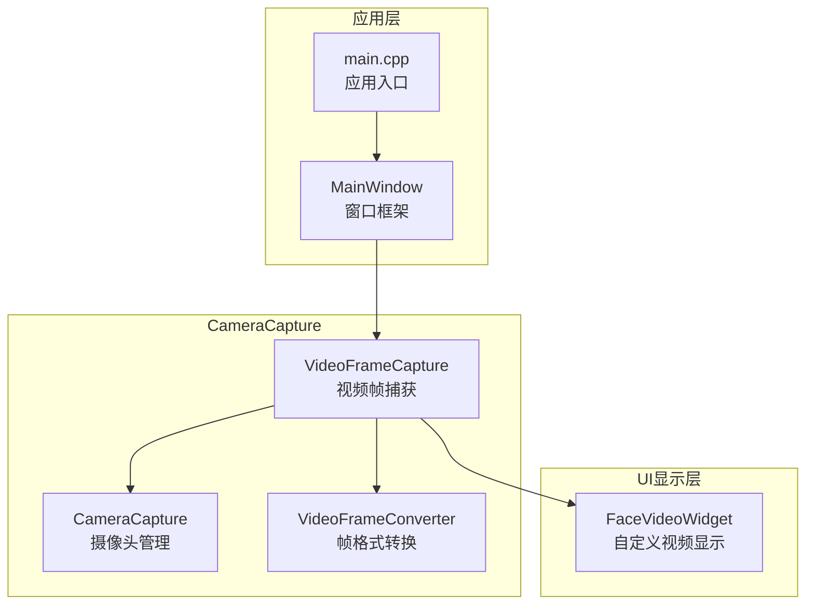
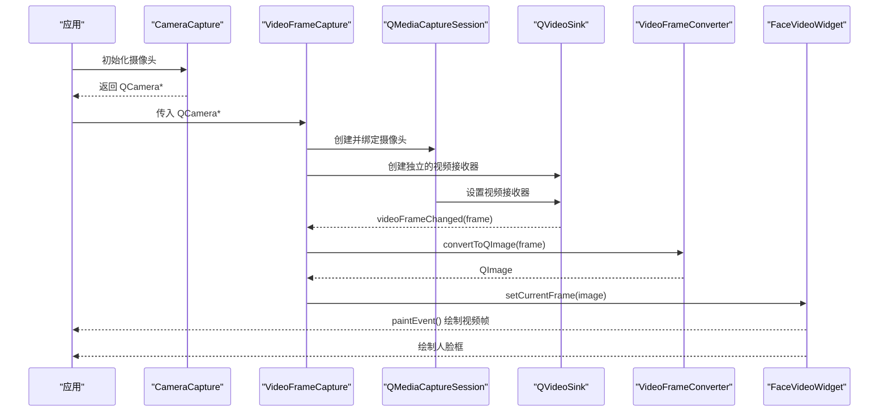
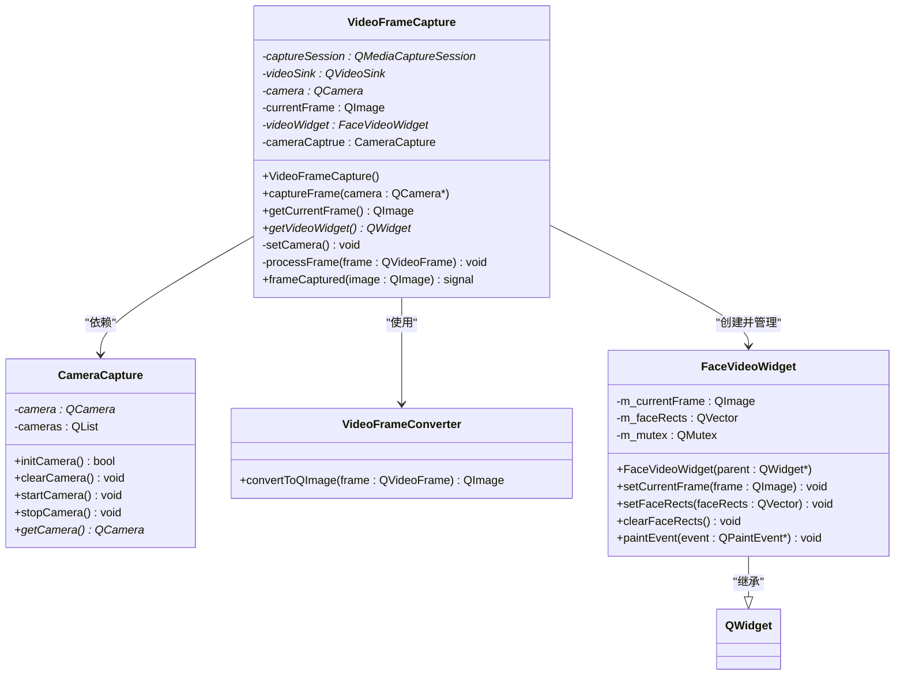
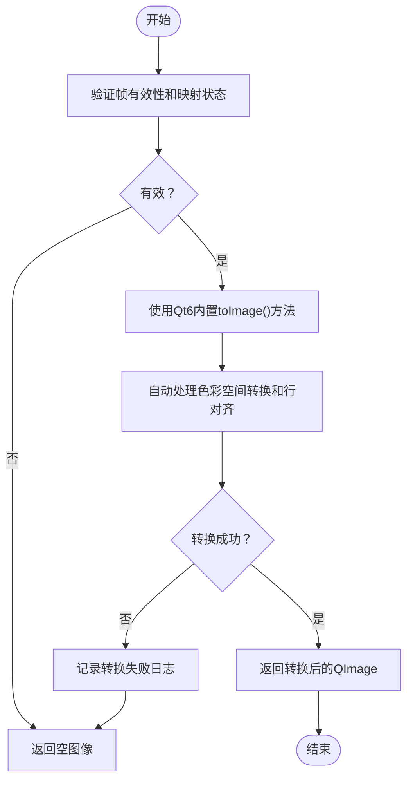
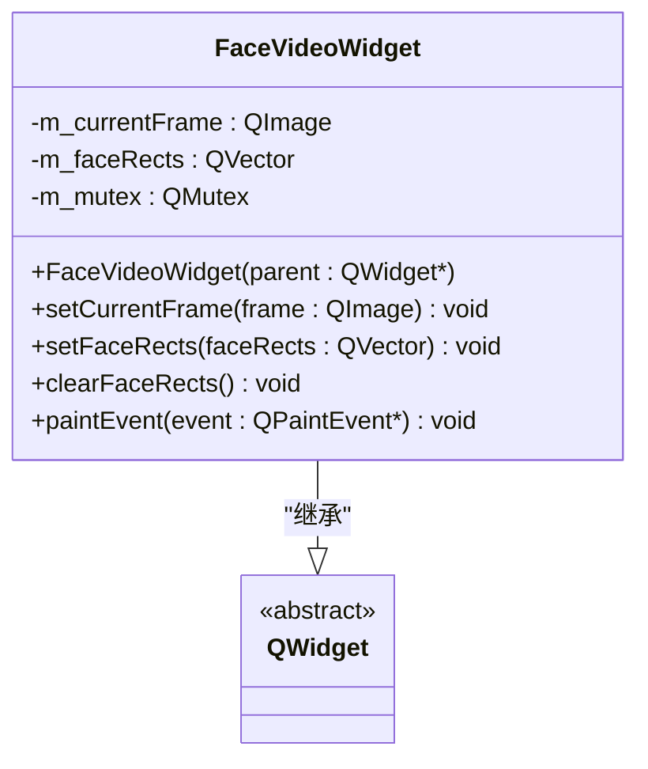
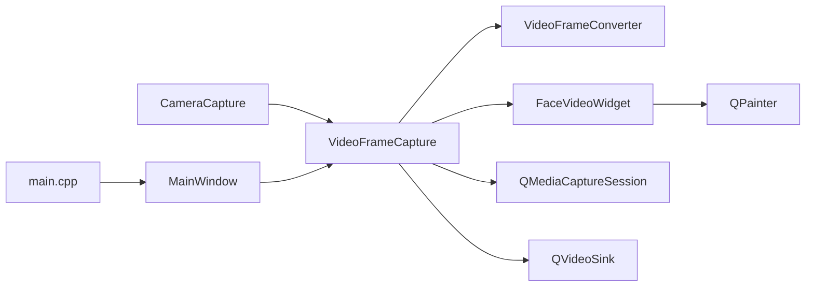

# 视频帧捕获

<cite>
**本文引用的文件**
- [videoframecapture.h](file://CameraCapture/videoframecapture.h)
- [videoframecapture.cpp](file://CameraCapture/videoframecapture.cpp)
- [cameracapture.h](file://CameraCapture/cameracapture.h)
- [cameracapture.cpp](file://CameraCapture/cameracapture.cpp)
- [videoframeconverter.h](file://CameraCapture/videoframeconverter.h)
- [videoframeconverter.cpp](file://CameraCapture/videoframeconverter.cpp)
- [facevideowidget.h](file://UI/facevideowidget.h)
- [facevideowidget.cpp](file://UI/facevideowidget.cpp)
- [main.cpp](file://main.cpp)
- [mainwindow.h](file://mainwindow.h)
- [mainwindow.cpp](file://mainwindow.cpp)
</cite>

## 更新摘要
**变更内容**
- 架构从QVideoWidget改为QWidget，VideoFrameCapture类重构以支持直接QPainter叠加
- getVideoWidget方法返回类型从QVideoWidget*改为QWidget*
- 新增FaceVideoWidget类，专门用于视频显示和人脸框绘制
- 改进的视频显示机制，避免硬件渲染层覆盖QPainter绘制
- 增强的人脸检测可视化功能，支持实时人脸框叠加

## 目录
1. [简介](#简介)
2. [项目结构](#项目结构)
3. [核心组件](#核心组件)
4. [架构总览](#架构总览)
5. [详细组件分析](#详细组件分析)
6. [依赖关系分析](#依赖关系分析)
7. [性能考虑](#性能考虑)
8. [故障排查指南](#故障排查指南)
9. [结论](#结论)
10. [附录](#附录)

## 简介
本技术文档围绕视频帧捕获组件进行系统性说明，重点解析 VideoFrameCapture 类的视频流处理机制，涵盖视频帧的实时捕获、缓冲与帧率控制、启动/停止机制、帧数据获取与处理流程、内存管理策略以及参数调优方法。文档同时提供错误处理、异常恢复与性能监控的关键技术要点，并通过图示帮助读者理解组件间的交互关系与数据流向。

**更新** 本次更新反映了架构的重大变更：从传统的QVideoWidget显示方式改为基于QWidget的自定义绘制方案，通过FaceVideoWidget实现视频帧的直接QPainter叠加，支持实时人脸检测框的绘制和显示。

## 项目结构
本项目采用模块化组织，视频帧捕获相关代码集中在 CameraCapture 子目录中，UI显示相关代码位于UI子目录，主要由以下文件构成：
- videoframecapture.*：视频帧捕获与信号发射
- cameracapture.*：摄像头设备初始化与启停
- videoframeconverter.*：视频帧格式转换为 QImage
- facevideowidget.*：自定义视频显示Widget，支持人脸框绘制
- main.cpp、mainwindow.*：应用入口与窗口框架

**图表来源**
- [videoframecapture.h:14-42](file://CameraCapture/videoframecapture.h#L14-L42)
- [cameracapture.h:9-28](file://CameraCapture/cameracapture.h#L9-L28)
- [videoframeconverter.h:25-42](file://CameraCapture/videoframeconverter.h#L25-L42)
- [facevideowidget.h:18-41](file://UI/facevideowidget.h#L18-L41)
- [main.cpp:13-26](file://main.cpp#L13-L26)
- [mainwindow.h:11-21](file://mainwindow.h#L11-L21)

**章节来源**
- [videoframecapture.h:1-45](file://CameraCapture/videoframecapture.h#L1-L45)
- [cameracapture.h:1-31](file://CameraCapture/cameracapture.h#L1-L31)
- [videoframeconverter.h:1-40](file://CameraCapture/videoframeconverter.h#L1-L40)
- [facevideowidget.h:1-44](file://UI/facevideowidget.h#L1-L44)
- [main.cpp:1-45](file://main.cpp#L1-L45)
- [mainwindow.h:1-94](file://mainwindow.h#L1-L94)

## 核心组件
- VideoFrameCapture：负责建立媒体捕获会话、连接视频帧变更信号、将 QVideoFrame 转换为 QImage 并发出帧捕获信号。**更新**：现在通过QVideoSink直接处理视频帧，避免硬件渲染层覆盖QPainter绘制。
- CameraCapture：负责扫描可用摄像头、创建 QCamera 实例、启动/停止摄像头。
- VideoFrameConverter：负责将 QVideoFrame 转换为 QImage，使用Qt6内置的toImage()方法自动处理所有像素格式。
- **新增** FaceVideoWidget：继承自QWidget，专门用于视频显示和人脸框绘制，支持实时人脸检测框的叠加显示。

**章节来源**
- [videoframecapture.h:14-42](file://CameraCapture/videoframecapture.h#L14-L42)
- [cameracapture.h:9-28](file://CameraCapture/cameracapture.h#L9-L28)
- [videoframeconverter.h:25-40](file://CameraCapture/videoframeconverter.h#L25-L40)
- [facevideowidget.h:18-41](file://UI/facevideowidget.h#L18-L41)

## 架构总览
VideoFrameCapture 通过 QMediaCaptureSession 绑定摄像头，利用 QVideoSink 的 videoFrameChanged 信号驱动帧处理；VideoFrameConverter 负责将底层视频帧格式统一转换为 QImage，供 FaceVideoWidget 进行自定义绘制和人脸框叠加显示。

**更新** 架构从传统的QVideoWidget硬件渲染改为基于QWidget的软件渲染，通过QVideoSink接收视频帧后直接传递给FaceVideoWidget进行QPainter绘制，支持实时人脸检测框的叠加显示。

**图表来源**
- [videoframecapture.cpp:8-17](file://CameraCapture/videoframecapture.cpp#L8-L17)
- [videoframecapture.cpp:20-36](file://CameraCapture/videoframecapture.cpp#L20-L36)
- [videoframecapture.cpp:51-59](file://CameraCapture/videoframecapture.cpp#L51-L59)
- [videoframeconverter.cpp:12-29](file://CameraCapture/videoframeconverter.cpp#L12-L29)
- [facevideowidget.cpp:7-14](file://UI/facevideowidget.cpp#L7-L14)

## 详细组件分析

### VideoFrameCapture 类
职责与关键点：
- 接收 QCamera 指针，创建 QMediaCaptureSession 并绑定摄像头。
- **更新**：创建独立的 QVideoSink 实例，不再使用 setVideoOutput 避免硬件渲染层覆盖 QPainter 绘制。
- 通过 FaceVideoWidget 设置视频输出，获取 QVideoSink 并连接 videoFrameChanged 信号。
- 在帧到达时调用 VideoFrameConverter 进行格式转换，更新当前帧并发出 frameCaptured 信号。
- 提供 getCurrentFrame 获取最近一次转换成功的 QImage。
- **更新**：getVideoWidget 方法返回 QWidget* 类型，兼容 FaceVideoWidget 的 QWidget 基类。

**更新** 架构重构的核心在于避免硬件渲染层覆盖自定义绘制。通过创建独立的 QVideoSink 实例，VideoFrameCapture 只负责接收视频帧并转换为 QImage，而不直接控制视频输出的硬件渲染。

**图表来源**
- [videoframecapture.h:14-42](file://CameraCapture/videoframecapture.h#L14-L42)
- [cameracapture.h:9-28](file://CameraCapture/cameracapture.h#L9-L28)
- [videoframeconverter.h:25-40](file://CameraCapture/videoframeconverter.h#L25-L40)
- [facevideowidget.h:18-41](file://UI/facevideowidget.h#L18-L41)

**章节来源**
- [videoframecapture.h:14-42](file://CameraCapture/videoframecapture.h#L14-L42)
- [videoframecapture.cpp:4-6](file://CameraCapture/videoframecapture.cpp#L4-L6)
- [videoframecapture.cpp:8-17](file://CameraCapture/videoframecapture.cpp#L8-L17)
- [videoframecapture.cpp:20-36](file://CameraCapture/videoframecapture.cpp#L20-L36)
- [videoframecapture.cpp:44-48](file://CameraCapture/videoframecapture.cpp#L44-L48)
- [videoframecapture.cpp:51-59](file://CameraCapture/videoframecapture.cpp#L51-L59)

### CameraCapture 类
职责与关键点：
- 扫描可用摄像头设备列表，选择首个设备创建 QCamera 实例。
- 提供 initCamera/startCamera/stopCamera/clearCamera 等生命周期管理方法。
- 通过 getCamera 获取当前摄像头指针供 VideoFrameCapture 使用。

**章节来源**
- [cameracapture.h:9-28](file://CameraCapture/cameracapture.h#L9-L28)
- [cameracapture.cpp:3-33](file://CameraCapture/cameracapture.cpp#L3-L33)
- [cameracapture.cpp:48-65](file://CameraCapture/cameracapture.cpp#L48-L65)
- [cameracapture.cpp:67-71](file://CameraCapture/cameracapture.cpp#L67-L71)

### VideoFrameConverter 类
职责与关键点：
- **更新**：使用 Qt6 内置的 QVideoFrame::toImage() 方法进行转换，自动处理所有像素格式（NV12、YUV420P、YUYV等）的色彩空间转换和行对齐。
- convertToQImage：验证帧有效性，使用 Qt6 内置方法进行高效转换。
- 支持的格式：Qt6 内置支持的所有像素格式，无需手动实现复杂的像素格式转换逻辑。

**更新** 转换逻辑简化为使用Qt6内置的toImage()方法，这提供了更好的性能和更广泛的格式支持。

**图表来源**
- [videoframeconverter.cpp:12-29](file://CameraCapture/videoframeconverter.cpp#L12-L29)

**章节来源**
- [videoframeconverter.h:25-40](file://CameraCapture/videoframeconverter.h#L25-L40)
- [videoframeconverter.cpp:12-29](file://CameraCapture/videoframeconverter.cpp#L12-L29)

### **新增** FaceVideoWidget 类
职责与关键点：
- 继承自 QWidget，专门用于视频显示和人脸框绘制。
- setCurrentFrame：设置当前帧图像，触发重绘。
- setFaceRects：设置人脸框信息，支持实时更新。
- clearFaceRects：清除所有人脸框。
- paintEvent：重写绘制事件，实现视频帧显示和人脸框叠加绘制。
- **线程安全**：使用 QMutex 保护共享数据，支持多线程安全访问。
- **缩放适配**：自动计算缩放比例，保持宽高比显示视频帧。
- **人脸框绘制**：支持绿色（识别成功）和红色（识别失败）的人脸框颜色区分。

**更新** 这是架构变更的核心组件，替代了传统的QVideoWidget，提供了完全自定义的绘制能力，支持实时人脸检测框的叠加显示。

**图表来源**
- [facevideowidget.h:18-41](file://UI/facevideowidget.h#L18-L41)

**章节来源**
- [facevideowidget.h:18-41](file://UI/facevideowidget.h#L18-L41)
- [facevideowidget.cpp:3-5](file://UI/facevideowidget.cpp#L3-L5)
- [facevideowidget.cpp:7-14](file://UI/facevideowidget.cpp#L7-L14)
- [facevideowidget.cpp:16-24](file://UI/facevideowidget.cpp#L16-L24)
- [facevideowidget.cpp:26-33](file://UI/facevideowidget.cpp#L26-L33)
- [facevideowidget.cpp:35-104](file://UI/facevideowidget.cpp#L35-L104)

## 依赖关系分析
- VideoFrameCapture 依赖 CameraCapture 提供 QCamera 实例。
- VideoFrameCapture 通过 QMediaCaptureSession 与 QVideoSink 协作完成视频流的接收与转发。
- VideoFrameConverter 作为纯静态工具类，被 VideoFrameCapture 调用以完成格式转换。
- **更新** VideoFrameCapture 现在管理 FaceVideoWidget 实例，作为视频显示的最终目的地。
- FaceVideoWidget 依赖 Qt 的 QPainter 进行自定义绘制。
- 应用入口 main.cpp 与 MainWindow 提供运行环境，但不直接参与视频捕获逻辑。

**更新** 依赖关系发生了重大变化，从依赖QVideoWidget转向依赖自定义的FaceVideoWidget，这使得整个架构更加灵活，能够支持复杂的自定义绘制需求。

**图表来源**
- [videoframecapture.h:12-12](file://CameraCapture/videoframecapture.h#L12-L12)
- [videoframecapture.cpp:24-36](file://CameraCapture/videoframecapture.cpp#L24-L36)
- [cameracapture.h:23-24](file://CameraCapture/cameracapture.h#L23-L24)
- [facevideowidget.h:4-9](file://UI/facevideowidget.h#L4-L9)
- [main.cpp:13-26](file://main.cpp#L13-L26)

**章节来源**
- [videoframecapture.h:12-12](file://CameraCapture/videoframecapture.h#L12-L12)
- [videoframecapture.cpp:24-36](file://CameraCapture/videoframecapture.cpp#L24-L36)
- [cameracapture.h:23-24](file://CameraCapture/cameracapture.h#L23-L24)
- [facevideowidget.h:4-9](file://UI/facevideowidget.h#L4-L9)
- [main.cpp:13-26](file://main.cpp#L13-L26)

## 性能考虑
- 帧率控制与缓冲
  - 当前实现通过 QVideoSink::videoFrameChanged 信号驱动处理，未显式限制帧率或引入帧队列。若需控制帧率，可在 VideoFrameCapture::processFrame 中增加节流策略（例如基于时间戳的丢帧或定时器触发）。
  - **更新** 由于FaceVideoWidget支持实时重绘，建议在帧处理中避免过于复杂的计算，将重计算放入后台线程。
- 内存管理
  - VideoFrameConverter 使用 Qt6 内置的 toImage() 方法进行高效转换，减少了手动内存管理的需求。
  - 转换得到的 QImage 通过 copy() 复制数据，避免与底层帧共享内存导致的生命周期问题。
  - **更新** FaceVideoWidget 使用 QMutex 保护共享数据，支持多线程安全访问，避免竞态条件。
- 图像尺寸与格式
  - 建议在摄像头初始化阶段设置合适的分辨率与像素格式，减少后续转换开销与内存占用。
  - **更新** FaceVideoWidget 自动处理缩放和居中显示，保持宽高比，无需在业务层重复计算。
- **新增** 绘制性能优化
  - FaceVideoWidget 使用 QPainter::Antialiasing 提升绘制质量，但可能影响性能。可根据需要调整渲染选项。
  - 人脸框绘制采用简单的矩形绘制，性能开销较小。

**更新** 性能考虑增加了对新架构的优化建议，特别是关于自定义绘制和线程安全的考虑。

**章节来源**
- [videoframeconverter.cpp:19-21](file://CameraCapture/videoframeconverter.cpp#L19-L21)
- [facevideowidget.cpp:40-42](file://UI/facevideowidget.cpp#L40-L42)
- [facevideowidget.cpp:55-64](file://UI/facevideowidget.cpp#L55-L64)

## 故障排查指南
- 无可用摄像头
  - 现象：initCamera 返回 false 或日志提示"无可用摄像头"。
  - 处理：检查设备枚举与权限，确认摄像头设备列表非空；必要时切换设备或启用备用设备。
- 帧无效或无法映射
  - 现象：convertToQImage 返回空图像，日志提示"视频帧无效"或"视频帧转换失败"。
  - 处理：确认 QVideoFrame 有效且可映射；检查摄像头是否正常启动、分辨率与格式是否受支持。
- **新增** FaceVideoWidget 无显示
  - 现象：视频画面无法显示或显示为黑色。
  - 处理：确认 setCurrentFrame 已正确调用；检查 FaceVideoWidget 的 paintEvent 是否被触发；验证 QImage 数据的有效性。
- **新增** 人脸框不显示
  - 现象：视频画面正常但人脸框不显示。
  - 处理：确认 setFaceRects 已正确调用；检查 FaceRectInfo 结构体的数据完整性；验证坐标转换逻辑。
- **新增** 线程安全问题
  - 现象：界面卡顿或崩溃，特别是在多线程环境下。
  - 处理：确认使用 QMutex 保护共享数据；避免在非主线程中直接访问 Qt 对象；使用 update() 触发重绘而不是直接调用 paintEvent。
- 帧处理卡顿
  - 现象：UI 卡顿或帧率下降。
  - 处理：减少每次转换的计算量，避免在主线程执行重计算；考虑降低分辨率或帧率；在业务层使用缓存帧而非实时重算。

**更新** 新增了针对FaceVideoWidget和新架构特有的故障排查指南。

**章节来源**
- [cameracapture.cpp:17-21](file://CameraCapture/cameracapture.cpp#L17-L21)
- [videoframeconverter.cpp:14-17](file://CameraCapture/videoframeconverter.cpp#L14-L17)
- [videoframeconverter.cpp:23-26](file://CameraCapture/videoframeconverter.cpp#L23-L26)
- [facevideowidget.cpp:47-50](file://UI/facevideowidget.cpp#L47-L50)
- [facevideowidget.cpp:10-13](file://UI/facevideowidget.cpp#L10-L13)

## 结论
VideoFrameCapture 通过 Qt 媒体框架实现了从摄像头到 QImage 的完整链路，具备良好的扩展性与跨平台能力。**更新** 架构重构后，通过 FaceVideoWidget 实现了完全自定义的视频显示和人脸框叠加功能，支持实时人脸检测的可视化显示。新架构避免了硬件渲染层对自定义绘制的干扰，提供了更高的灵活性和更好的性能表现。当前实现侧重于实时性与简洁性，未包含显式的帧率控制与缓冲策略。在实际工程中，可根据业务需求引入帧率节流、帧队列与后台处理等机制，以进一步提升稳定性与性能表现。

## 附录

### 参数调优方法
- 分辨率设置
  - 在摄像头初始化阶段设置合适的分辨率，以平衡清晰度与性能。
- 帧率配置
  - 可通过摄像头设备属性或媒体会话参数调整帧率；若需更细粒度控制，可在帧处理回调中加入节流逻辑。
- 像素格式
  - **更新** 优先使用 Qt6 内置支持的格式，自动处理色彩空间转换；对于特殊需求，可考虑在摄像头初始化阶段设置特定格式。
- **新增** FaceVideoWidget 调优
  - 抗锯齿设置：根据性能需求调整 QPainter::Antialiasing 选项。
  - 人脸框样式：可调整线条宽度、颜色和字体大小。

### 实际使用场景示例（路径指引）
- 连续视频捕获
  - 初始化摄像头：参考 [CameraCapture::initCamera:14-32](file://CameraCapture/cameracapture.cpp#L14-L32)
  - 启动摄像头：参考 [CameraCapture::startCamera:47-54](file://CameraCapture/cameracapture.cpp#L47-L54)
  - 绑定捕获会话与帧处理：参考 [VideoFrameCapture::captureFrame:8-17](file://CameraCapture/videoframecapture.cpp#L8-L17) 与 [VideoFrameCapture::setCamera:20-36](file://CameraCapture/videoframecapture.cpp#L20-L36)
  - 获取帧：参考 [VideoFrameCapture::getCurrentFrame:39-42](file://CameraCapture/videoframecapture.cpp#L39-L42)
- **新增** 自定义视频显示
  - 创建 FaceVideoWidget：参考 [VideoFrameCapture::setCamera:27-28](file://CameraCapture/videoframecapture.cpp#L27-L28)
  - 设置当前帧：参考 [FaceVideoWidget::setCurrentFrame:7-14](file://UI/facevideowidget.cpp#L7-L14)
  - 绘制人脸框：参考 [FaceVideoWidget::setFaceRects:16-24](file://UI/facevideowidget.cpp#L16-L24)
- **新增** 处理不同格式的视频帧
  - 转换入口：参考 [VideoFrameConverter::convertToQImage:12-29](file://CameraCapture/videoframeconverter.cpp#L12-L29)
  - 自动格式处理：Qt6 内置的 toImage() 方法自动处理所有像素格式
- 优化捕获性能
  - **更新** 利用 Qt6 内置转换：使用 VideoFrameConverter::convertToQImage 替代手动格式转换
  - 减少转换开销：Qt6 内置方法提供更好的性能
  - 降低分辨率或帧率：在摄像头初始化阶段设置
  - 后台处理：将重计算移至后台线程，避免阻塞 UI
  - **新增** 避免硬件渲染干扰：通过独立的 QVideoSink 和自定义绘制实现

**更新** 附录增加了针对新架构的使用示例和优化建议，特别是关于FaceVideoWidget的使用和Qt6内置转换方法的优势。