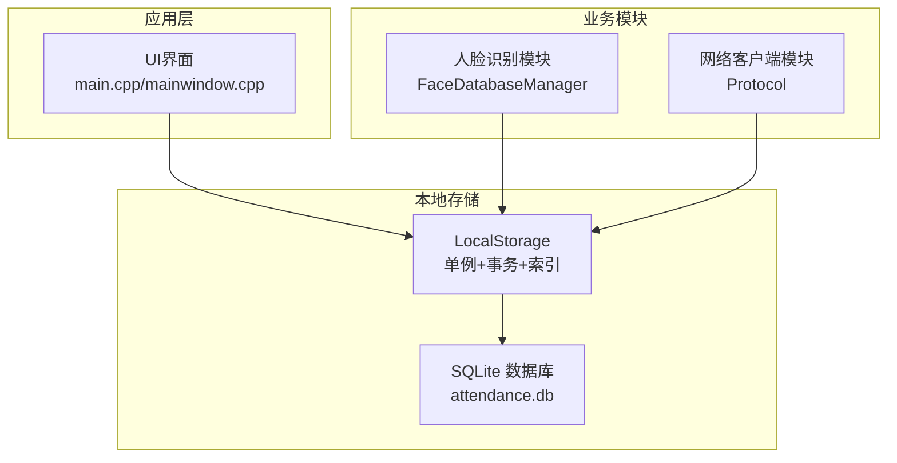
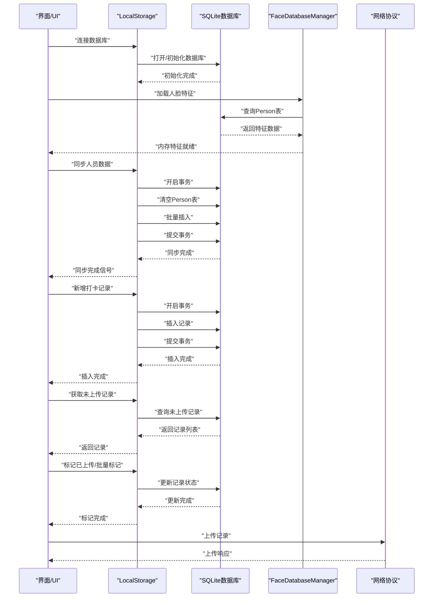
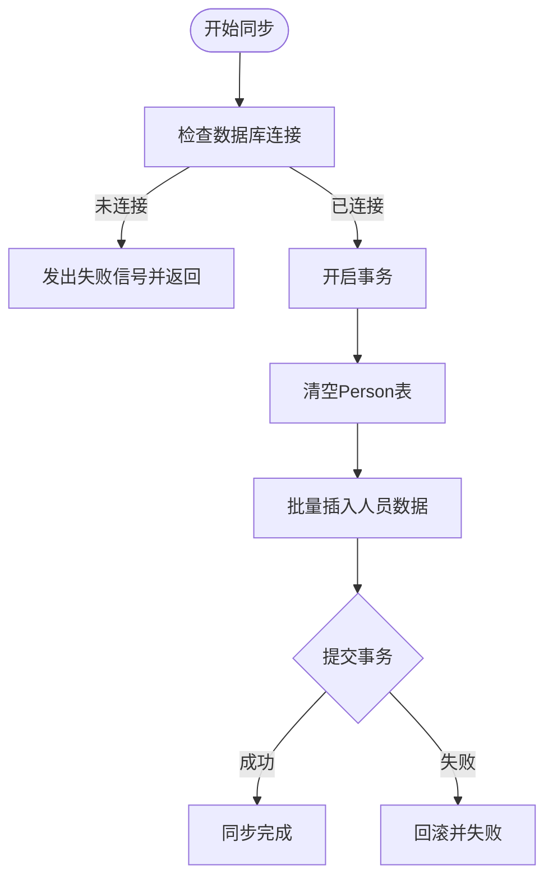
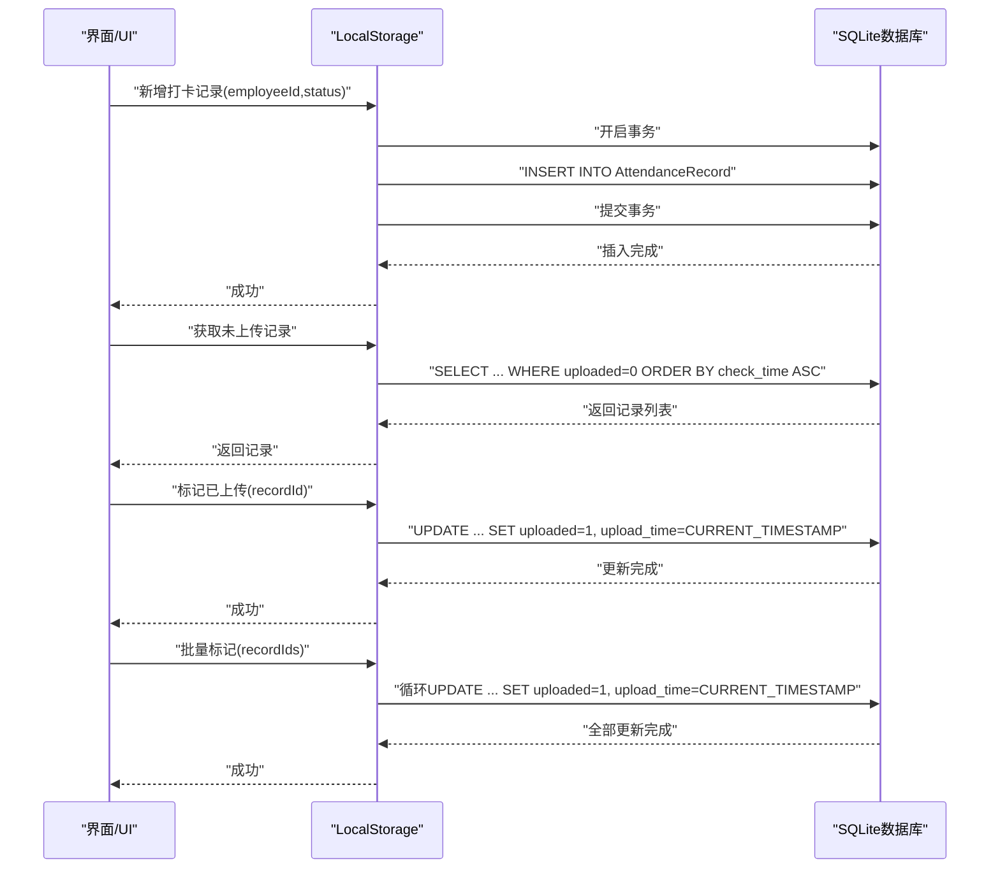
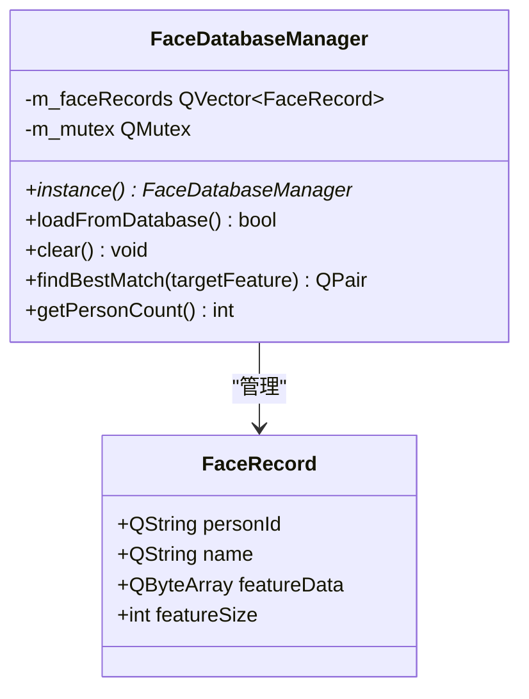
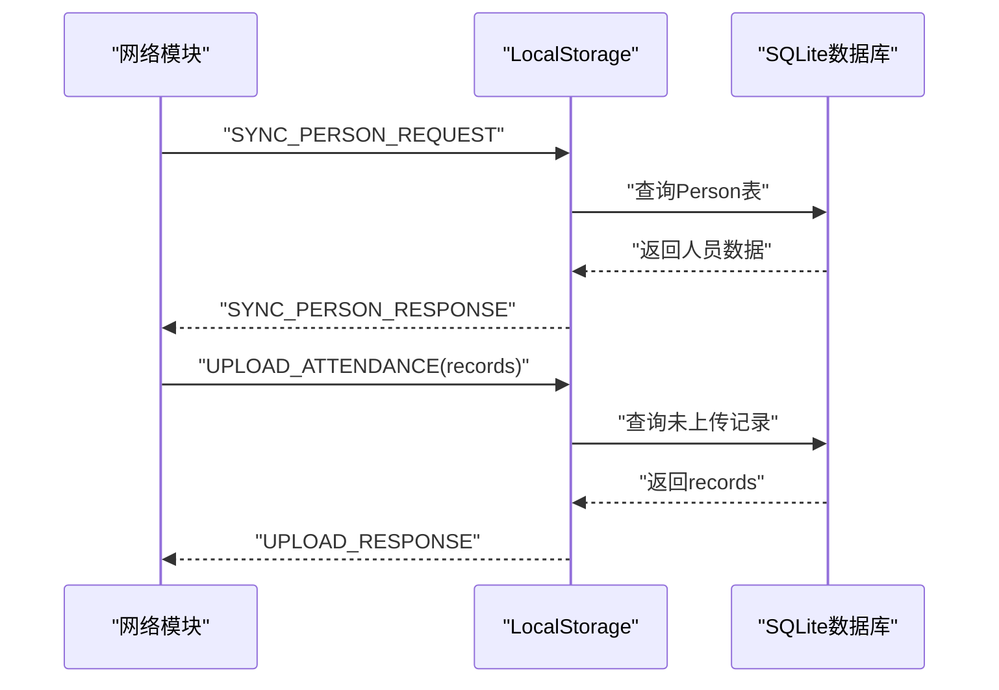
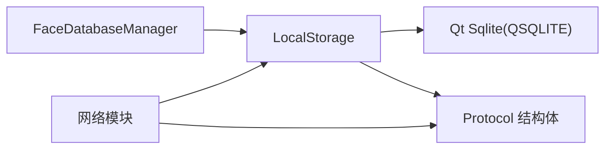

# 本地存储模块

<cite>
**本文档引用的文件**
- [localstorage.h](file://LocalStorage/localstorage.h)
- [localstorage.cpp](file://LocalStorage/localstorage.cpp)
- [protocol.h](file://NetworkClient/protocol.h)
- [facedatabasemanager.h](file://FaceRecognition/facedatabasemanager.h)
- [facedatabasemanager.cpp](file://FaceRecognition/facedatabasemanager.cpp)
- [main.cpp](file://main.cpp)
- [mainwindow.cpp](file://mainwindow.cpp)
</cite>

## 目录
1. [简介](#简介)
2. [项目结构](#项目结构)
3. [核心组件](#核心组件)
4. [架构总览](#架构总览)
5. [详细组件分析](#详细组件分析)
6. [依赖关系分析](#依赖关系分析)
7. [性能考虑](#性能考虑)
8. [故障排查指南](#故障排查指南)
9. [结论](#结论)
10. [附录](#附录)

## 简介
本文件为本地存储模块的技术文档，聚焦于基于SQLite的本地数据库设计与实现，涵盖数据库连接管理、人员数据同步、打卡记录管理、事务处理与数据一致性保障等关键能力。文档还解释了与人脸识别模块和网络模块的数据交互方式，并提供数据库迁移、备份恢复、性能调优等高级主题建议。

## 项目结构
本地存储模块位于独立目录中，采用Qt框架的单例模式封装数据库连接与操作，通过QSqlDatabase与QSqlQuery实现SQLite访问；同时与网络协议模块、人脸识别模块形成清晰的边界划分。

图表来源
- [localstorage.h:15-46](file://LocalStorage/localstorage.h#L15-L46)
- [localstorage.cpp:30-121](file://LocalStorage/localstorage.cpp#L30-L121)
- [facedatabasemanager.h:9-44](file://FaceRecognition/facedatabasemanager.h#L9-L44)
- [protocol.h:15-58](file://NetworkClient/protocol.h#L15-L58)

章节来源
- [localstorage.h:1-49](file://LocalStorage/localstorage.h#L1-L49)
- [localstorage.cpp:1-346](file://LocalStorage/localstorage.cpp#L1-L346)
- [main.cpp:1-28](file://main.cpp#L1-L28)
- [mainwindow.cpp:1-14](file://mainwindow.cpp#L1-L14)

## 核心组件
- 单例数据库管理器：提供全局唯一的数据库连接实例，确保线程安全与资源复用。
- 表结构与索引：定义人员表与打卡记录表，建立必要的索引以提升查询效率。
- 事务处理：在人员同步与打卡记录增删改查中使用事务，保证原子性与一致性。
- 人员同步：支持全量替换式同步，清空旧数据后批量插入新数据。
- 打卡记录管理：支持新增、查询未上传记录、标记已上传与批量标记。
- 与人脸识别模块集成：从数据库加载人脸特征到内存，支撑快速比对。
- 与网络模块集成：通过协议结构体传输人员与打卡记录数据。

章节来源
- [localstorage.h:18-37](file://LocalStorage/localstorage.h#L18-L37)
- [localstorage.cpp:30-121](file://LocalStorage/localstorage.cpp#L30-L121)
- [localstorage.cpp:124-181](file://LocalStorage/localstorage.cpp#L124-L181)
- [localstorage.cpp:184-224](file://LocalStorage/localstorage.cpp#L184-L224)
- [localstorage.cpp:227-258](file://LocalStorage/localstorage.cpp#L227-L258)
- [localstorage.cpp:261-299](file://LocalStorage/localstorage.cpp#L261-L299)
- [localstorage.cpp:303-345](file://LocalStorage/localstorage.cpp#L303-L345)
- [facedatabasemanager.cpp:16-49](file://FaceRecognition/facedatabasemanager.cpp#L16-L49)
- [protocol.h:28-49](file://NetworkClient/protocol.h#L28-L49)

## 架构总览
LocalStorage作为核心数据访问层，向上提供业务接口，向下通过SQLite持久化存储。人脸识别模块负责特征加载与比对，网络模块负责与服务器的数据交换。

图表来源
- [localstorage.cpp:30-121](file://LocalStorage/localstorage.cpp#L30-L121)
- [localstorage.cpp:124-181](file://LocalStorage/localstorage.cpp#L124-L181)
- [localstorage.cpp:184-224](file://LocalStorage/localstorage.cpp#L184-L224)
- [localstorage.cpp:227-258](file://LocalStorage/localstorage.cpp#L227-L258)
- [localstorage.cpp:261-299](file://LocalStorage/localstorage.cpp#L261-L299)
- [localstorage.cpp:303-345](file://LocalStorage/localstorage.cpp#L303-L345)
- [facedatabasemanager.cpp:16-49](file://FaceRecognition/facedatabasemanager.cpp#L16-L49)
- [protocol.h:17-26](file://NetworkClient/protocol.h#L17-L26)

## 详细组件分析

### 数据库连接与初始化
- 连接策略：使用QSqlDatabase("QSQLITE")连接本地文件数据库，路径位于应用目录下的data子目录。
- 初始化流程：
  - 启用外键约束与UTF-8编码。
  - 创建Person表与AttendanceRecord表，并建立必要索引。
  - Person表包含员工ID、姓名、人脸特征BLOB、特征长度与最后更新时间。
  - AttendanceRecord表包含自增ID、员工ID、打卡时间、状态、上传标志与上传时间，并设置外键约束与状态检查约束。
- 线程安全：通过静态互斥锁保护单例创建与数据库操作。

章节来源
- [localstorage.cpp:30-121](file://LocalStorage/localstorage.cpp#L30-L121)
- [localstorage.h:22-23](file://LocalStorage/localstorage.h#L22-L23)

### 人员数据同步
- 同步策略：全量替换式同步，先清空旧数据，再批量插入新数据。
- 实现要点：
  - 使用事务保证原子性，失败时回滚。
  - 预编译SQL语句，绑定参数，避免拼接风险。
  - 成功后发出同步完成信号，失败发出错误信号。

图表来源
- [localstorage.cpp:124-181](file://LocalStorage/localstorage.cpp#L124-L181)

章节来源
- [localstorage.cpp:124-181](file://LocalStorage/localstorage.cpp#L124-L181)

### 打卡记录管理
- 新增记录：开启事务，插入一条记录，提交事务。
- 查询未上传记录：按打卡时间升序查询uploaded=0的记录。
- 标记已上传：单条与批量两种方式，均使用事务与时间戳更新。
- 约束与索引：外键约束保证数据完整性；为employee_id与check_time建立索引，提升查询效率。

图表来源
- [localstorage.cpp:184-224](file://LocalStorage/localstorage.cpp#L184-L224)
- [localstorage.cpp:227-258](file://LocalStorage/localstorage.cpp#L227-L258)
- [localstorage.cpp:261-299](file://LocalStorage/localstorage.cpp#L261-L299)
- [localstorage.cpp:303-345](file://LocalStorage/localstorage.cpp#L303-L345)

章节来源
- [localstorage.cpp:184-224](file://LocalStorage/localstorage.cpp#L184-L224)
- [localstorage.cpp:227-258](file://LocalStorage/localstorage.cpp#L227-L258)
- [localstorage.cpp:261-299](file://LocalStorage/localstorage.cpp#L261-L299)
- [localstorage.cpp:303-345](file://LocalStorage/localstorage.cpp#L303-L345)

### 与人脸识别模块的数据交互
- 特征加载：启动时从Person表加载所有人脸特征到内存，便于快速比对。
- 内存结构：FaceRecord包含员工ID、姓名、特征二进制数据与长度。
- 线程安全：使用互斥锁保护内存中的特征库，避免并发冲突。

图表来源
- [facedatabasemanager.h:9-44](file://FaceRecognition/facedatabasemanager.h#L9-L44)
- [facedatabasemanager.cpp:16-49](file://FaceRecognition/facedatabasemanager.cpp#L16-L49)

章节来源
- [facedatabasemanager.h:17-38](file://FaceRecognition/facedatabasemanager.h#L17-L38)
- [facedatabasemanager.cpp:16-49](file://FaceRecognition/facedatabasemanager.cpp#L16-L49)

### 与网络模块的数据同步机制
- 协议结构：Protocol命名空间定义了消息类型、打卡记录结构与人员数据结构，支持JSON序列化/反序列化。
- 人员同步：网络模块下发SYNC_PERSON_REQUEST，本地存储模块返回SYNC_PERSON_RESPONSE，包含人员数据列表。
- 打卡上传：网络模块下发UPLOAD_ATTENDANCE，本地存储模块返回UPLOAD_RESPONSE，包含上传结果。
- 数据一致性：通过事务与状态字段保证上传前后的数据一致性。

图表来源
- [protocol.h:17-49](file://NetworkClient/protocol.h#L17-L49)
- [localstorage.cpp:227-258](file://LocalStorage/localstorage.cpp#L227-L258)

章节来源
- [protocol.h:17-49](file://NetworkClient/protocol.h#L17-L49)
- [localstorage.cpp:227-258](file://LocalStorage/localstorage.cpp#L227-L258)

## 依赖关系分析
- 组件耦合：
  - LocalStorage依赖Qt SQL模块与Protocol结构体。
  - FaceDatabaseManager依赖LocalStorage的Person表结构。
  - 网络模块依赖Protocol结构体与LocalStorage的查询接口。
- 外部依赖：
  - Qt Sqlite驱动（QSQLITE）。
  - SQLite引擎（由Qt Sqlite驱动提供）。

图表来源
- [localstorage.h:14](file://LocalStorage/localstorage.h#L14)
- [facedatabasemanager.h:7](file://FaceRecognition/facedatabasemanager.h#L7)
- [protocol.h:15-58](file://NetworkClient/protocol.h#L15-L58)

章节来源
- [localstorage.h:14](file://LocalStorage/localstorage.h#L14)
- [facedatabasemanager.h:7](file://FaceRecognition/facedatabasemanager.h#L7)
- [protocol.h:15-58](file://NetworkClient/protocol.h#L15-L58)

## 性能考虑
- 索引策略：
  - Person表：name索引，适合按姓名检索。
  - AttendanceRecord表：employee_id与check_time索引，分别满足按员工与时间排序查询。
- 批量操作：
  - 人员同步使用预编译语句与批量插入，减少SQL解析开销。
  - 打卡记录批量标记采用循环逐条更新，可考虑合并为IN子句或使用临时表分批更新以降低往返次数。
- 事务粒度：
  - 将多次写入合并到单个事务中，减少磁盘写入次数与锁竞争。
- 编码与约束：
  - 明确UTF-8编码与外键约束，避免跨模块兼容性问题。
- 建议优化：
  - 对高频查询建立复合索引（如按employee_id+check_time组合查询）。
  - 在高并发场景下，考虑读写分离与连接池配置。
  - 对大体量特征数据，可考虑压缩存储与分页加载。

[本节为通用性能指导，不直接分析具体文件]

## 故障排查指南
- 数据库连接失败：
  - 检查应用目录data子目录是否可创建与写入。
  - 查看数据库打开错误信息与最后错误描述。
- 事务失败：
  - 确认数据库已开启事务且无并发冲突。
  - 发生异常时及时回滚并重试。
- 同步失败：
  - 清空与批量插入过程中任一步失败都会导致回滚，检查每一步的错误信息。
- 查询异常：
  - 确认SQL语法与参数绑定正确，检查索引是否存在。
- 上传标记失败：
  - 单条与批量更新均使用事务，失败时会回滚，检查ID有效性与数据库状态。

章节来源
- [localstorage.cpp:49-53](file://LocalStorage/localstorage.cpp#L49-L53)
- [localstorage.cpp:135-139](file://LocalStorage/localstorage.cpp#L135-L139)
- [localstorage.cpp:161-166](file://LocalStorage/localstorage.cpp#L161-L166)
- [localstorage.cpp:207-212](file://LocalStorage/localstorage.cpp#L207-L212)
- [localstorage.cpp:282-286](file://LocalStorage/localstorage.cpp#L282-L286)
- [localstorage.cpp:327-332](file://LocalStorage/localstorage.cpp#L327-L332)

## 结论
本地存储模块通过SQLite实现了稳定可靠的本地数据持久化，结合事务与索引策略保障了数据一致性与查询性能。与人脸识别模块和网络模块的清晰边界设计，使得系统具备良好的扩展性与维护性。后续可在索引优化、批量更新策略与高并发场景下进一步完善。

[本节为总结性内容，不直接分析具体文件]

## 附录

### 数据库表结构与关系
- Person表
  - 字段：employee_id（主键）、name、face_feature（BLOB）、face_feature_size、last_updated（默认当前时间）
  - 约束：主键、默认值
  - 索引：idx_person_name(name)
- AttendanceRecord表
  - 字段：id（自增主键）、employee_id（外键关联Person.employee_id，级联删除）、check_time（默认当前时间）、status（默认“正常”，检查约束取值集合）、uploaded（默认0）、upload_time
  - 约束：外键、状态检查、默认值
  - 索引：idx_record_employee_id(employee_id)、idx_record_check_time(check_time)

章节来源
- [localstorage.cpp:69-75](file://LocalStorage/localstorage.cpp#L69-L75)
- [localstorage.cpp:89-99](file://LocalStorage/localstorage.cpp#L89-L99)
- [localstorage.cpp:81-87](file://LocalStorage/localstorage.cpp#L81-L87)
- [localstorage.cpp:105-117](file://LocalStorage/localstorage.cpp#L105-L117)

### 事务与数据一致性
- 人员同步：清空+批量插入，事务保证原子性。
- 打卡记录：新增、查询未上传、标记已上传/批量标记均使用事务。
- 外键约束：保证删除人员时级联删除其打卡记录，避免悬挂引用。

章节来源
- [localstorage.cpp:135-139](file://LocalStorage/localstorage.cpp#L135-L139)
- [localstorage.cpp:172-177](file://LocalStorage/localstorage.cpp#L172-L177)
- [localstorage.cpp:195-199](file://LocalStorage/localstorage.cpp#L195-L199)
- [localstorage.cpp:214-220](file://LocalStorage/localstorage.cpp#L214-L220)
- [localstorage.cpp:271-276](file://LocalStorage/localstorage.cpp#L271-L276)
- [localstorage.cpp:288-294](file://LocalStorage/localstorage.cpp#L288-L294)
- [localstorage.cpp:313-318](file://LocalStorage/localstorage.cpp#L313-L318)
- [localstorage.cpp:334-340](file://LocalStorage/localstorage.cpp#L334-L340)

### 与人脸识别模块的数据交互
- 启动时从Person表加载特征到内存，便于快速比对。
- 线程安全：使用互斥锁保护内存中的特征库。

章节来源
- [facedatabasemanager.cpp:16-49](file://FaceRecognition/facedatabasemanager.cpp#L16-L49)

### 与网络模块的数据同步机制
- 协议结构：定义消息类型、打卡记录与人员数据结构，支持JSON序列化/反序列化。
- 同步流程：网络模块请求同步人员数据，本地存储模块返回人员数据；上传打卡记录时，本地存储模块返回未上传记录与上传结果。

章节来源
- [protocol.h:17-49](file://NetworkClient/protocol.h#L17-L49)
- [localstorage.cpp:227-258](file://LocalStorage/localstorage.cpp#L227-L258)

### 高级主题建议
- 数据库迁移：
  - 通过版本控制脚本逐步升级表结构，保留历史数据。
  - 迁移前后进行完整性校验与回滚测试。
- 备份与恢复：
  - 定期备份SQLite文件，使用事务提交点模拟增量备份。
  - 恢复时验证数据一致性与索引完整性。
- 性能调优：
  - 基于查询分析结果增加复合索引。
  - 批量更新采用合并策略减少事务次数。
  - 在高并发场景下评估连接池与锁粒度。

[本节为通用指导，不直接分析具体文件]