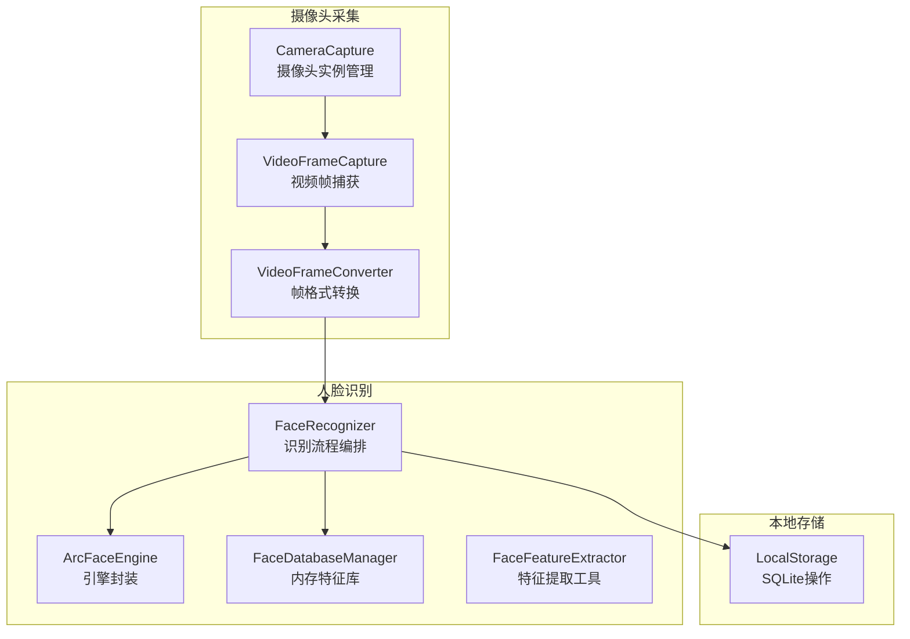
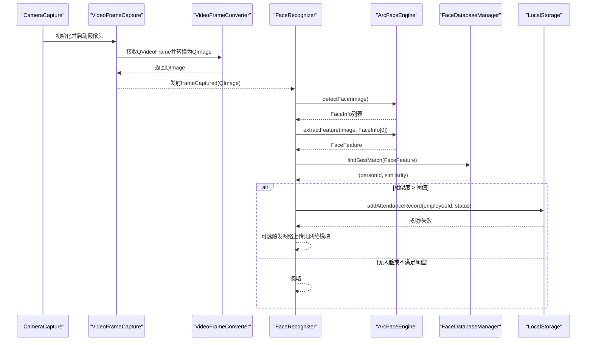
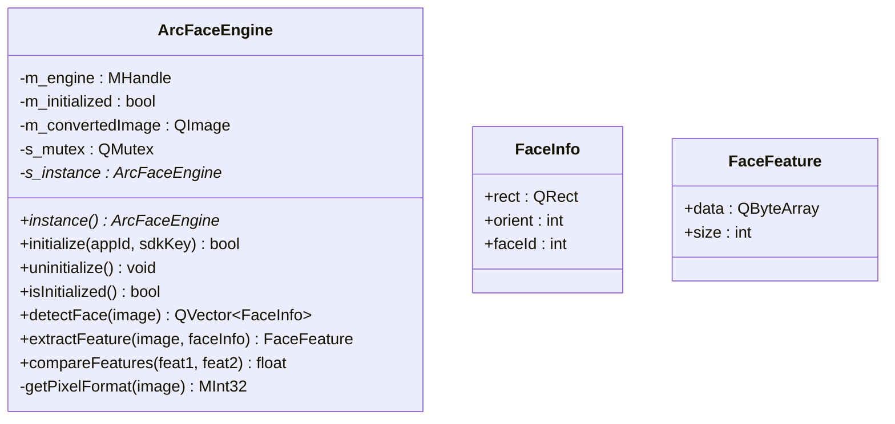
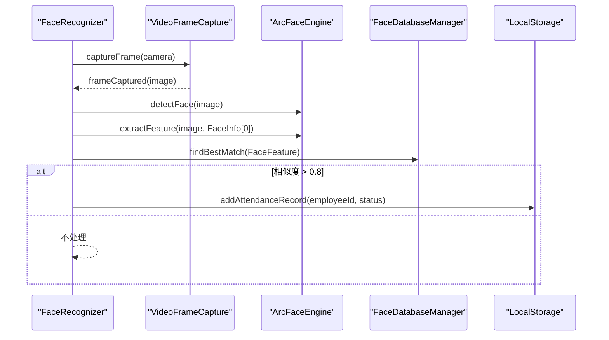
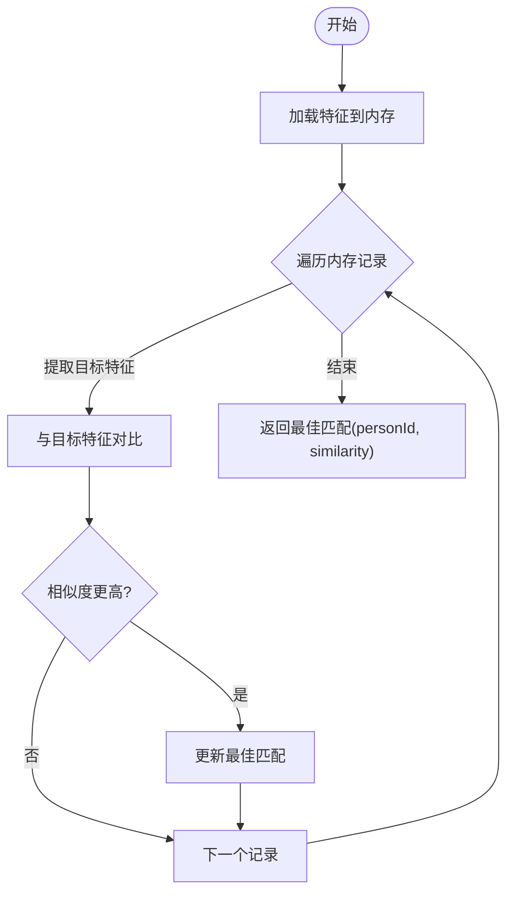
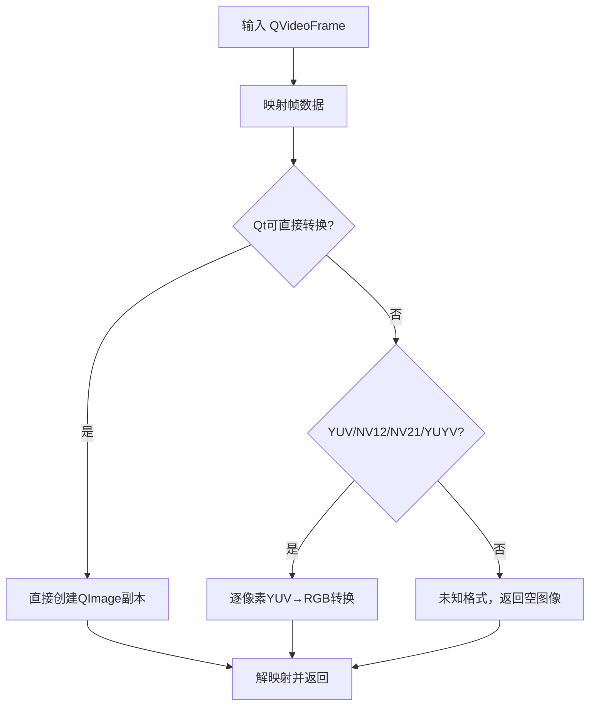
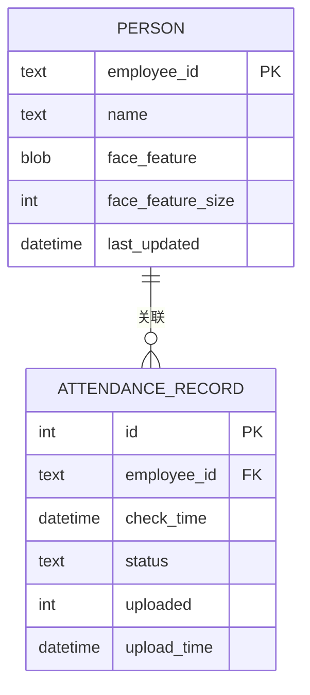
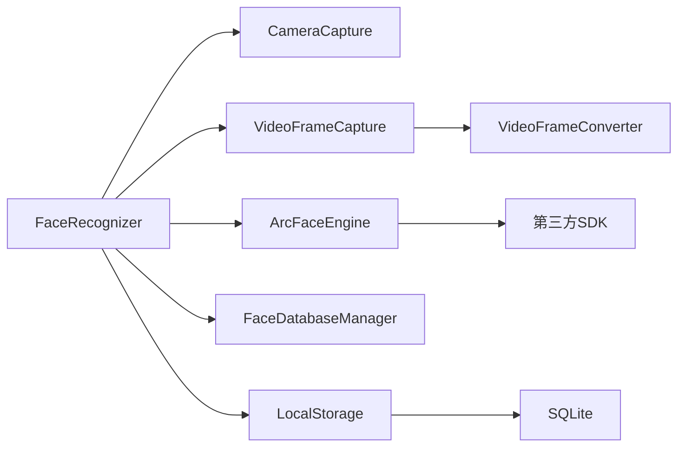

# 核心模块

<cite>
**本文引用的文件**
- [arcfaceengine.h](file://FaceRecognition/arcfaceengine.h)
- [arcfaceengine.cpp](file://FaceRecognition/arcfaceengine.cpp)
- [facerecognizer.h](file://FaceRecognition/facerecognizer.h)
- [facerecognizer.cpp](file://FaceRecognition/facerecognizer.cpp)
- [facefeatureextractor.h](file://FaceRecognition/facefeatureextractor.h)
- [facefeatureextractor.cpp](file://FaceRecognition/facefeatureextractor.cpp)
- [facedatabasemanager.h](file://FaceRecognition/facedatabasemanager.h)
- [facedatabasemanager.cpp](file://FaceRecognition/facedatabasemanager.cpp)
- [cameracapture.h](file://CameraCapture/cameracapture.h)
- [cameracapture.cpp](file://CameraCapture/cameracapture.cpp)
- [videoframecapture.h](file://CameraCapture/videoframecapture.h)
- [videoframecapture.cpp](file://CameraCapture/videoframecapture.cpp)
- [videoframeconverter.h](file://CameraCapture/videoframeconverter.h)
- [videoframeconverter.cpp](file://CameraCapture/videoframeconverter.cpp)
- [localstorage.h](file://LocalStorage/localstorage.h)
- [localstorage.cpp](file://LocalStorage/localstorage.cpp)
</cite>

## 目录
1. [简介](#简介)
2. [项目结构](#项目结构)
3. [核心组件](#核心组件)
4. [架构总览](#架构总览)
5. [详细组件分析](#详细组件分析)
6. [依赖分析](#依赖分析)
7. [性能考虑](#性能考虑)
8. [故障排查指南](#故障排查指南)
9. [结论](#结论)
10. [附录](#附录)

## 简介
本文件面向“核心模块”的技术文档，围绕人脸识别模块、摄像头采集模块、本地存储模块与网络客户端模块展开，系统性说明其架构、接口设计、调用关系、数据流、配置项与参数、返回值、常见问题与解决方案。文档以实际代码库为依据，既适合初学者理解整体工作流程，也为有经验的开发者提供足够的实现细节与优化建议。

## 项目结构
项目采用按功能域划分的模块化组织方式，核心模块包括：
- 人脸识别模块：ArcFace引擎封装、特征提取与对比、内存特征库管理
- 摄像头采集模块：Qt Multimedia摄像头控制、视频帧捕获与格式转换
- 本地存储模块：SQLite数据库操作、打卡记录持久化与事务控制
- 网络客户端模块：与网络层交互（本文件聚焦与本地存储的集成）

图表来源
- [cameracapture.h:1-31](file://CameraCapture/cameracapture.h#L1-L31)
- [videoframecapture.h:1-45](file://CameraCapture/videoframecapture.h#L1-L45)
- [videoframeconverter.h:1-72](file://CameraCapture/videoframeconverter.h#L1-L72)
- [arcfaceengine.h:1-115](file://FaceRecognition/arcfaceengine.h#L1-L115)
- [facedatabasemanager.h:1-47](file://FaceRecognition/facedatabasemanager.h#L1-L47)
- [facerecognizer.h:1-61](file://FaceRecognition/facerecognizer.h#L1-L61)
- [facefeatureextractor.h:1-17](file://FaceRecognition/facefeatureextractor.h#L1-L17)
- [localstorage.h:1-49](file://LocalStorage/localstorage.h#L1-L49)

章节来源
- [cameracapture.h:1-31](file://CameraCapture/cameracapture.h#L1-L31)
- [videoframecapture.h:1-45](file://CameraCapture/videoframecapture.h#L1-L45)
- [videoframeconverter.h:1-72](file://CameraCapture/videoframeconverter.h#L1-L72)
- [arcfaceengine.h:1-115](file://FaceRecognition/arcfaceengine.h#L1-L115)
- [facedatabasemanager.h:1-47](file://FaceRecognition/facedatabasemanager.h#L1-L47)
- [facerecognizer.h:1-61](file://FaceRecognition/facerecognizer.h#L1-L61)
- [facefeatureextractor.h:1-17](file://FaceRecognition/facefeatureextractor.h#L1-L17)
- [localstorage.h:1-49](file://LocalStorage/localstorage.h#L1-L49)

## 核心组件
- ArcFace引擎封装：提供人脸检测、特征提取、特征对比能力，采用单例模式，负责与第三方SDK的桥接与数据格式转换。
- 摄像头采集：通过Qt Multimedia控制摄像头，捕获视频帧并通过转换器统一为QImage供识别使用。
- 内存特征库：在应用启动时从数据库加载特征至内存，提供快速1:N匹配；支持线程安全访问。
- 本地存储：SQLite文件数据库，负责人员特征与打卡记录的持久化、事务控制与未上传记录管理。

章节来源
- [arcfaceengine.h:1-115](file://FaceRecognition/arcfaceengine.h#L1-L115)
- [arcfaceengine.cpp:1-295](file://FaceRecognition/arcfaceengine.cpp#L1-L295)
- [facedatabasemanager.h:1-47](file://FaceRecognition/facedatabasemanager.h#L1-L47)
- [facedatabasemanager.cpp:1-95](file://FaceRecognition/facedatabasemanager.cpp#L1-L95)
- [cameracapture.h:1-31](file://CameraCapture/cameracapture.h#L1-L31)
- [videoframecapture.h:1-45](file://CameraCapture/videoframecapture.h#L1-L45)
- [videoframeconverter.h:1-72](file://CameraCapture/videoframeconverter.h#L1-L72)
- [localstorage.h:1-49](file://LocalStorage/localstorage.h#L1-L49)
- [localstorage.cpp:1-346](file://LocalStorage/localstorage.cpp#L1-L346)

## 架构总览
整体流程：摄像头采集视频帧 → 转换为QImage → ArcFace检测人脸 → 提取特征 → 与内存特征库对比 → 匹配成功且阈值达标 → 本地记录打卡 → 尝试上传网络。

图表来源
- [facerecognizer.cpp:53-88](file://FaceRecognition/facerecognizer.cpp#L53-L88)
- [arcfaceengine.cpp:97-180](file://FaceRecognition/arcfaceengine.cpp#L97-L180)
- [facedatabasemanager.cpp:58-88](file://FaceRecognition/facedatabasemanager.cpp#L58-L88)
- [videoframecapture.cpp:70-79](file://CameraCapture/videoframecapture.cpp#L70-L79)
- [videoframeconverter.cpp:16-85](file://CameraCapture/videoframeconverter.cpp#L16-L85)
- [cameracapture.cpp:14-33](file://CameraCapture/cameracapture.cpp#L14-L33)

## 详细组件分析

### 人脸识别模块

#### ArcFace引擎封装（ArcFaceEngine）
- 单例模式：全局仅一实例，线程安全通过互斥锁保障。
- 主要职责：
  - 在线激活与初始化（包含检测、识别、年龄、性别等能力掩码）
  - 图像格式转换与对齐（SDK要求宽度为4的倍数）
  - 人脸检测：返回人脸矩形、角度、追踪ID
  - 特征提取：基于指定人脸区域提取特征向量
  - 特征对比：计算相似度（0.0-1.0），一般阈值≥0.8判定同一人
- 关键数据结构：
  - FaceInfo：包含矩形框、角度、追踪ID
  - FaceFeature：二进制特征数据与长度
- 错误处理：对未初始化、空图像、SDK返回码进行日志与短路返回

图表来源
- [arcfaceengine.h:21-115](file://FaceRecognition/arcfaceengine.h#L21-L115)

章节来源
- [arcfaceengine.h:1-115](file://FaceRecognition/arcfaceengine.h#L1-L115)
- [arcfaceengine.cpp:1-295](file://FaceRecognition/arcfaceengine.cpp#L1-L295)

#### 人脸识别编排（FaceRecognizer）
- 组合多个子模块：摄像头、视频帧捕获、ArcFace引擎、内存特征库、本地存储
- 初始化流程：创建视频捕获、初始化ArcFace引擎、加载特征库、初始化摄像头并启动捕获
- 识别流程：检测→提取→对比→阈值判断→本地记录→尝试上传（网络模块）
- 线程安全：使用互斥锁保护共享状态

图表来源
- [facerecognizer.cpp:20-51](file://FaceRecognition/facerecognizer.cpp#L20-L51)
- [facerecognizer.cpp:53-88](file://FaceRecognition/facerecognizer.cpp#L53-L88)

章节来源
- [facerecognizer.h:1-61](file://FaceRecognition/facerecognizer.h#L1-L61)
- [facerecognizer.cpp:1-107](file://FaceRecognition/facerecognizer.cpp#L1-L107)

#### 特征提取工具（FaceFeatureExtractor）
- 简化版特征提取：检测→提取，便于在其他场景复用
- 依赖ArcFaceEngine单例，若未初始化则返回空特征

章节来源
- [facefeatureextractor.h:1-17](file://FaceRecognition/facefeatureextractor.h#L1-L17)
- [facefeatureextractor.cpp:1-24](file://FaceRecognition/facefeatureextractor.cpp#L1-L24)

#### 内存特征库（FaceDatabaseManager）
- 单例模式：全局唯一实例
- 启动时从数据库加载特征到内存，提供快速1:N匹配
- 线程安全：读写均使用互斥锁
- 接口：加载、清空、查找最佳匹配、获取人数

图表来源
- [facedatabasemanager.cpp:58-88](file://FaceRecognition/facedatabasemanager.cpp#L58-L88)

章节来源
- [facedatabasemanager.h:1-47](file://FaceRecognition/facedatabasemanager.h#L1-L47)
- [facedatabasemanager.cpp:1-95](file://FaceRecognition/facedatabasemanager.cpp#L1-L95)

### 摄像头采集模块

#### 摄像头控制（CameraCapture）
- 功能：扫描设备、实例化QCamera、启动/停止/释放
- 注意：重复初始化会先清理旧实例，避免资源泄漏

章节来源
- [cameracapture.h:1-31](file://CameraCapture/cameracapture.h#L1-L31)
- [cameracapture.cpp:1-72](file://CameraCapture/cameracapture.cpp#L1-L72)

#### 视频帧捕获（VideoFrameCapture）
- 功能：建立媒体捕获会话、设置视频输出与接收器、监听帧变化
- 信号：frameCaptured(QImage)，供上层处理

章节来源
- [videoframecapture.h:1-45](file://CameraCapture/videoframecapture.h#L1-L45)
- [videoframecapture.cpp:1-80](file://CameraCapture/videoframecapture.cpp#L1-L80)

#### 视频帧格式转换（VideoFrameConverter）
- 支持格式：Qt原生支持的格式（直接转换）、YUV420P、NV12/NV21、YUYV
- 流程：验证帧有效性→映射→识别格式→选择转换路径→解映射
- YUV转换：按像素/采样点进行YUV→RGB转换，使用标准公式并裁剪到[0,255]

图表来源
- [videoframeconverter.cpp:16-85](file://CameraCapture/videoframeconverter.cpp#L16-L85)
- [videoframeconverter.cpp:99-187](file://CameraCapture/videoframeconverter.cpp#L99-L187)
- [videoframeconverter.cpp:199-245](file://CameraCapture/videoframeconverter.cpp#L199-L245)

章节来源
- [videoframeconverter.h:1-72](file://CameraCapture/videoframeconverter.h#L1-L72)
- [videoframeconverter.cpp:1-246](file://CameraCapture/videoframeconverter.cpp#L1-L246)

### 本地存储模块

#### SQLite操作（LocalStorage）
- 单例模式：全局唯一实例，线程安全
- 数据库初始化：创建Person与AttendanceRecord表，启用外键与UTF-8编码，建立必要索引
- 事务控制：人员同步与记录增删改均使用事务，失败回滚
- 接口：
  - 连接数据库
  - 同步人员（批量替换）
  - 添加打卡记录
  - 查询未上传记录
  - 标记单条/批量已上传

图表来源
- [localstorage.cpp:68-121](file://LocalStorage/localstorage.cpp#L68-L121)
- [localstorage.cpp:89-121](file://LocalStorage/localstorage.cpp#L89-L121)

章节来源
- [localstorage.h:1-49](file://LocalStorage/localstorage.h#L1-L49)
- [localstorage.cpp:1-346](file://LocalStorage/localstorage.cpp#L1-L346)

## 依赖分析
- FaceRecognizer依赖：
  - CameraCapture：提供QCamera实例
  - VideoFrameCapture：提供frameCaptured信号
  - ArcFaceEngine：提供检测/提取/对比
  - FaceDatabaseManager：提供内存特征库
  - LocalStorage：提供本地记录
- ArcFaceEngine依赖：
  - 第三方SDK头文件与错误码定义
  - Qt图像与线程同步组件
- VideoFrameConverter依赖：
  - Qt视频帧格式与图像转换工具
- LocalStorage依赖：
  - Qt SQL与SQLite驱动

图表来源
- [facerecognizer.h:4-24](file://FaceRecognition/facerecognizer.h#L4-L24)
- [arcfaceengine.h:12-13](file://FaceRecognition/arcfaceengine.h#L12-L13)
- [videoframecapture.h:12-12](file://CameraCapture/videoframecapture.h#L12-L12)
- [localstorage.h:14-14](file://LocalStorage/localstorage.h#L14-L14)

章节来源
- [facerecognizer.h:1-61](file://FaceRecognition/facerecognizer.h#L1-L61)
- [arcfaceengine.h:1-115](file://FaceRecognition/arcfaceengine.h#L1-L115)
- [videoframecapture.h:1-45](file://CameraCapture/videoframecapture.h#L1-L45)
- [localstorage.h:1-49](file://LocalStorage/localstorage.h#L1-L49)

## 性能考虑
- 图像格式与对齐：ArcFaceEngine在检测/提取前对图像进行RGB↔BGR转换与宽度对齐（4字节对齐），避免SDK报错并提升稳定性。
- 内存特征库：启动时一次性加载特征至内存，避免频繁IO；对比阶段为O(N)遍历，建议控制特征库规模或引入近似检索加速。
- 视频帧转换：YUV→RGB为纯CPU计算，建议在UI线程之外处理或降低分辨率/帧率以减轻负载。
- 事务与索引：LocalStorage对关键表建立索引，批量插入使用事务，显著提升同步效率与一致性。
- 线程安全：多处使用QMutex保护共享状态，避免竞态条件。

## 故障排查指南
- ArcFace引擎未初始化
  - 现象：检测/提取/对比返回空或失败
  - 排查：确认initialize返回true；检查AppId/SdkKey；确认网络可访问以完成在线激活
  - 参考
    - [arcfaceengine.cpp:31-62](file://FaceRecognition/arcfaceengine.cpp#L31-L62)
- 图像为空或格式异常
  - 现象：检测返回空列表
  - 排查：确认VideoFrameCapture转换成功；检查帧尺寸与格式；确保映射与解映射正确
  - 参考
    - [videoframeconverter.cpp:16-85](file://CameraCapture/videoframeconverter.cpp#L16-L85)
- 特征提取失败
  - 现象：返回空特征
  - 排查：确认人脸区域有效；角度信息用于校正；检查SDK返回码
  - 参考
    - [arcfaceengine.cpp:182-249](file://FaceRecognition/arcfaceengine.cpp#L182-L249)
- 特征对比阈值过低
  - 现象：未触发打卡记录
  - 排查：调整阈值（默认>0.8）；检查特征质量与环境光照
  - 参考
    - [facerecognizer.cpp:70-87](file://FaceRecognition/facerecognizer.cpp#L70-L87)
- 数据库连接失败
  - 现象：人员同步/记录增删失败
  - 排查：确认数据库文件路径与权限；检查PRAGMA设置；查看事务开启与提交日志
  - 参考
    - [localstorage.cpp:30-121](file://LocalStorage/localstorage.cpp#L30-L121)
    - [localstorage.cpp:123-181](file://LocalStorage/localstorage.cpp#L123-L181)
- 摄像头不可用
  - 现象：初始化失败或无画面
  - 排查：确认设备枚举结果；确保未被其他进程占用；检查权限
  - 参考
    - [cameracapture.cpp:14-33](file://CameraCapture/cameracapture.cpp#L14-L33)

章节来源
- [arcfaceengine.cpp:31-62](file://FaceRecognition/arcfaceengine.cpp#L31-L62)
- [arcfaceengine.cpp:182-249](file://FaceRecognition/arcfaceengine.cpp#L182-L249)
- [facerecognizer.cpp:70-87](file://FaceRecognition/facerecognizer.cpp#L70-L87)
- [localstorage.cpp:30-121](file://LocalStorage/localstorage.cpp#L30-L121)
- [localstorage.cpp:123-181](file://LocalStorage/localstorage.cpp#L123-L181)
- [cameracapture.cpp:14-33](file://CameraCapture/cameracapture.cpp#L14-L33)

## 结论
本系统以模块化方式整合了摄像头采集、人脸识别、内存特征库与本地存储，形成闭环的考勤识别链路。ArcFaceEngine提供了稳定的检测与对比能力，VideoFrameConverter覆盖主流视频帧格式，LocalStorage通过事务与索引保障数据一致性与性能。建议在生产环境中进一步优化特征库规模、引入异步处理与降采样策略，并完善网络上传模块的重试与断点续传机制。

## 附录

### 接口与参数速查（人脸识别）
- ArcFaceEngine.initialize(appId, sdkKey)：初始化引擎，返回bool
- ArcFaceEngine.detectFace(image)：返回QVector<FaceInfo>
- ArcFaceEngine.extractFeature(image, faceInfo)：返回FaceFeature
- ArcFaceEngine.compareFeatures(feat1, feat2)：返回float相似度
- FaceDatabaseManager.findBestMatch(targetFeature)：返回QPair<QString,float>
- FaceRecognizer.getFaceInfo()/getFaceFeature()/getbestMatch()：线程安全读取

章节来源
- [arcfaceengine.h:48-90](file://FaceRecognition/arcfaceengine.h#L48-L90)
- [facedatabasemanager.h:33-38](file://FaceRecognition/facedatabasemanager.h#L33-L38)
- [facerecognizer.h:52-57](file://FaceRecognition/facerecognizer.h#L52-L57)

### 接口与参数速查（摄像头采集）
- CameraCapture.initCamera()：初始化摄像头，返回bool
- VideoFrameCapture.captureFrame(camera)：启动捕获
- VideoFrameConverter.convertToQImage(frame)：返回QImage

章节来源
- [cameracapture.h:17-27](file://CameraCapture/cameracapture.h#L17-L27)
- [videoframecapture.h:18-26](file://CameraCapture/videoframecapture.h#L18-L26)
- [videoframeconverter.h:42-42](file://CameraCapture/videoframeconverter.h#L42-L42)

### 接口与参数速查（本地存储）
- LocalStorage.connectDatabse()：连接/初始化数据库
- LocalStorage.syncPersons(persons)：批量同步人员，返回bool
- LocalStorage.addAttendanceRecord(employeeId, status)：添加记录
- LocalStorage.getUnuploadedRecords()：返回未上传记录列表
- LocalStorage.markAsUploaded(id)/markBatchAsUploaded(ids)：标记上传

章节来源
- [localstorage.h:22-37](file://LocalStorage/localstorage.h#L22-L37)
- [localstorage.cpp:123-181](file://LocalStorage/localstorage.cpp#L123-L181)
- [localstorage.cpp:183-224](file://LocalStorage/localstorage.cpp#L183-L224)
- [localstorage.cpp:226-258](file://LocalStorage/localstorage.cpp#L226-L258)
- [localstorage.cpp:260-299](file://LocalStorage/localstorage.cpp#L260-L299)
- [localstorage.cpp:302-345](file://LocalStorage/localstorage.cpp#L302-L345)