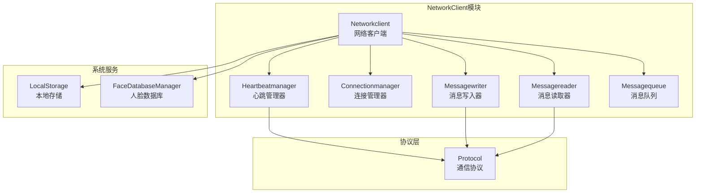
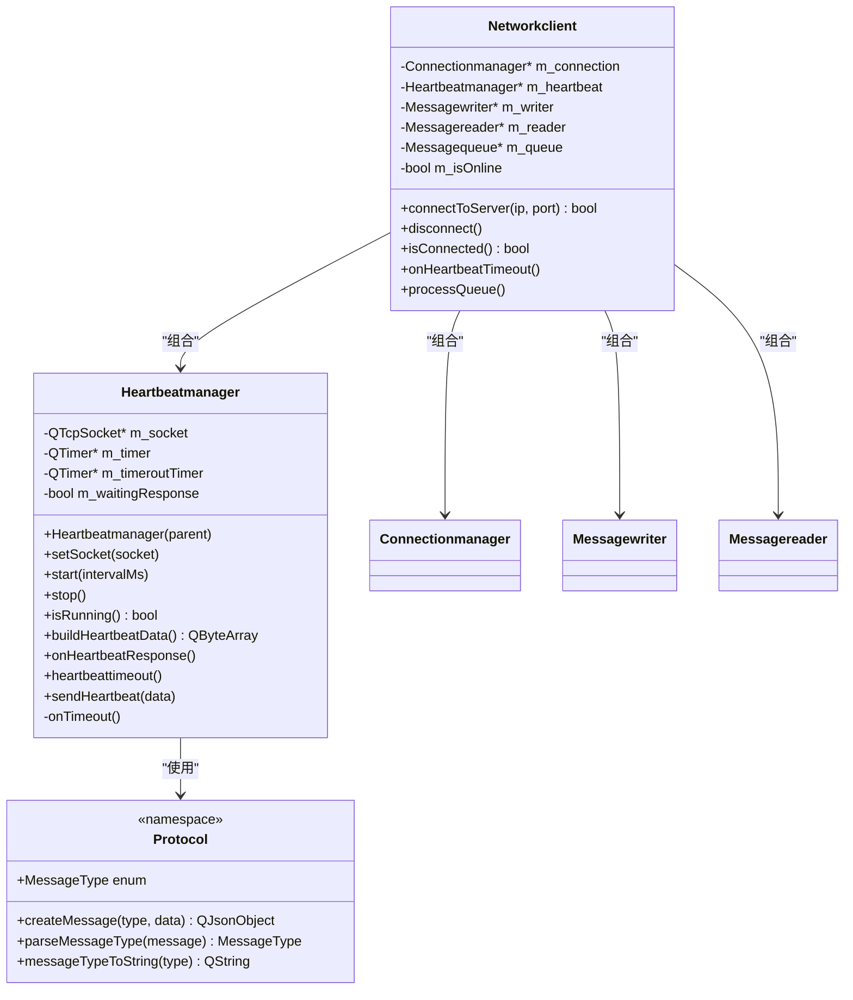
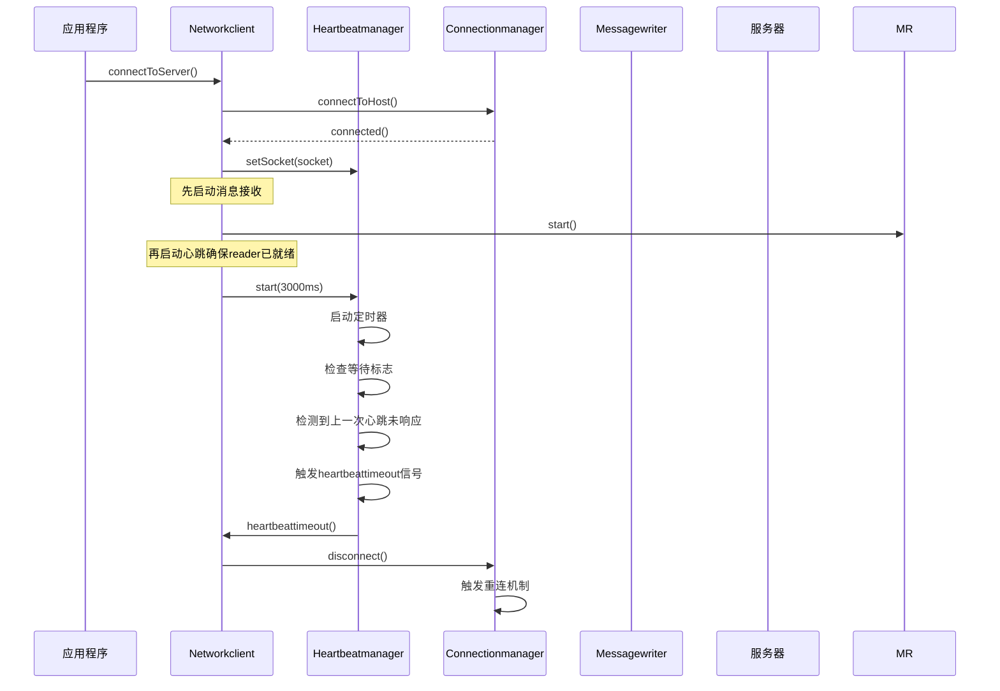
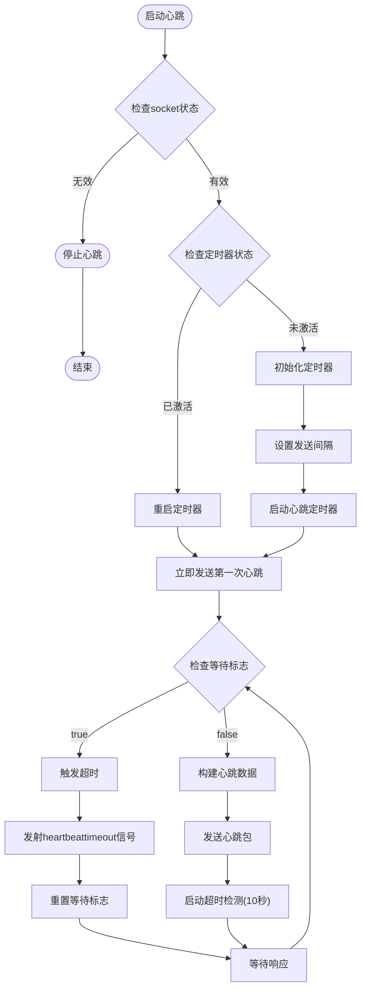
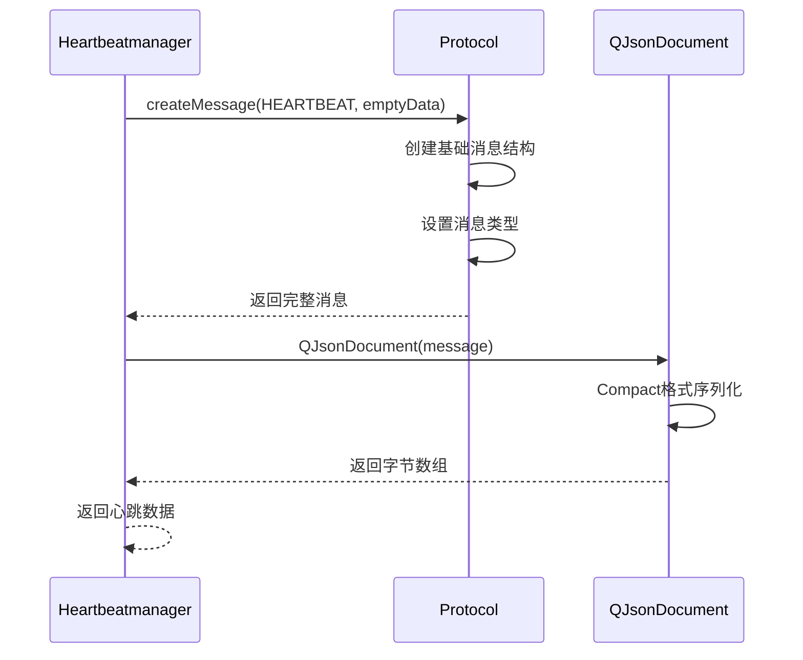
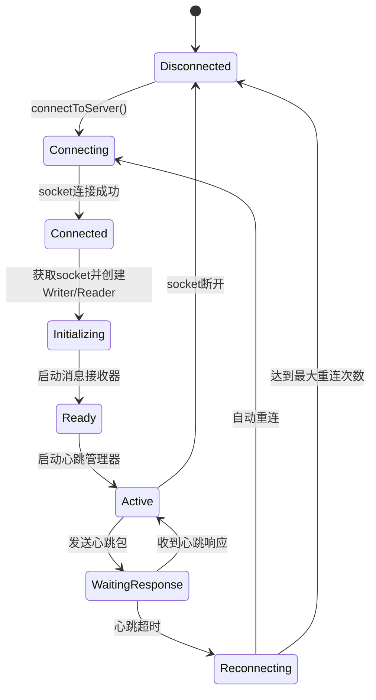
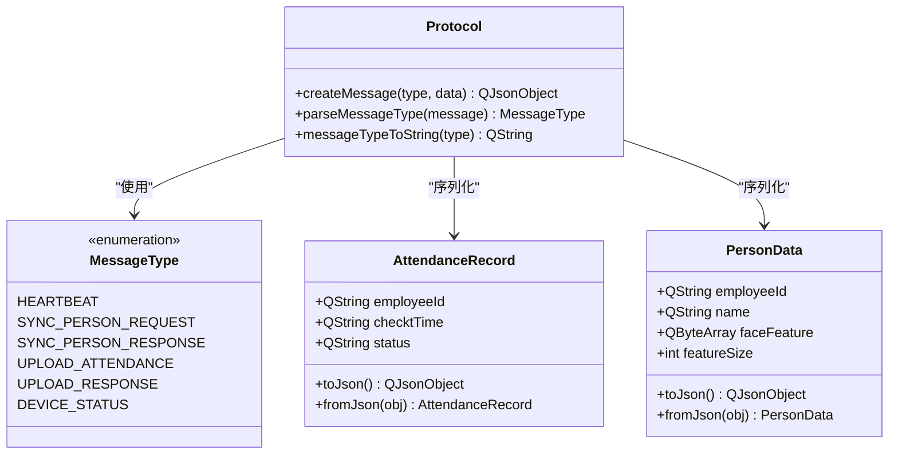
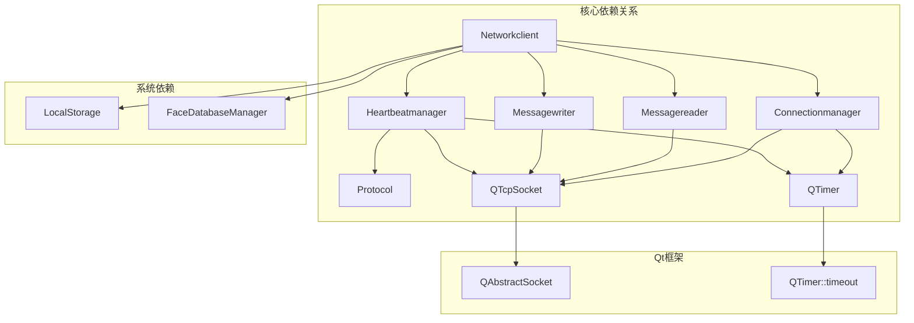

# 心跳管理器

<cite>
**本文引用的文件**
- [heartbeatmanager.h](file://NetworkClient/heartbeatmanager.h)
- [heartbeatmanager.cpp](file://NetworkClient/heartbeatmanager.cpp)
- [networkclient.h](file://NetworkClient/networkclient.h)
- [networkclient.cpp](file://NetworkClient/networkclient.cpp)
- [protocol.h](file://NetworkClient/protocol.h)
- [protocol.cpp](file://NetworkClient/protocol.cpp)
- [connectionmanager.h](file://NetworkClient/connectionmanager.h)
- [connectionmanager.cpp](file://NetworkClient/connectionmanager.cpp)
- [messagewriter.h](file://NetworkClient/messagewriter.h)
- [messagewriter.cpp](file://NetworkClient/messagewriter.cpp)
- [messagereader.h](file://NetworkClient/messagereader.h)
- [messagereader.cpp](file://NetworkClient/messagereader.cpp)
</cite>

## 更新摘要
**变更内容**
- 重大重构：移除了心跳管理器的自动启动功能，改为外部协调启动
- 超时检测时间从5秒调整为10秒，提升稳定性
- 新增了与消息写入器的信号槽协调机制，实现心跳包发送的解耦
- 增强了心跳响应处理的精确性，通过 `onHeartbeatResponse()` 方法重置等待状态

## 目录
1. [简介](#简介)
2. [项目结构](#项目结构)
3. [核心组件](#核心组件)
4. [架构概览](#架构概览)
5. [详细组件分析](#详细组件分析)
6. [依赖关系分析](#依赖关系-analysis)
7. [性能考虑](#性能考虑)
8. [故障排除指南](#故障排除指南)
9. [结论](#结论)

## 简介

心跳管理器是AttendanceCheckClient系统中的关键组件，负责维护与服务器的持续连接，通过定期发送心跳包来检测网络连通性和服务器存活状态。该组件采用Qt框架的信号槽机制，实现了可靠的连接保活功能，包括定时器管理、心跳包构造、响应处理和异常恢复机制。

**更新** 本次重大重构显著改变了心跳管理器的工作模式：移除了自动启动功能，改为外部协调启动；将超时检测时间从5秒延长至10秒；新增了与消息写入器的信号槽协调机制，实现了更精确的心跳包发送控制。

心跳管理器的核心功能包括：
- 心跳包格式标准化
- 发送间隔动态配置
- 超时检测与自动重连
- 状态监控与异常处理
- 与其他网络组件的无缝集成

## 项目结构

系统采用模块化设计，心跳管理器位于NetworkClient目录下，与连接管理、消息处理等组件协同工作：



**图表来源**
- [heartbeatmanager.h:1-44](file://NetworkClient/heartbeatmanager.h#L1-L44)
- [networkclient.h:18-77](file://NetworkClient/networkclient.h#L18-L77)
- [connectionmanager.h:1-45](file://NetworkClient/connectionmanager.h#L1-L45)

**章节来源**
- [heartbeatmanager.h:1-44](file://NetworkClient/heartbeatmanager.h#L1-L44)
- [networkclient.h:18-77](file://NetworkClient/networkclient.h#L18-L77)
- [connectionmanager.h:1-45](file://NetworkClient/connectionmanager.h#L1-L45)

## 核心组件

### 心跳管理器架构

心跳管理器采用面向对象设计，继承自QObject以支持Qt的信号槽机制：



**图表来源**
- [heartbeatmanager.h:10-40](file://NetworkClient/heartbeatmanager.h#L10-L40)
- [networkclient.h:18-77](file://NetworkClient/networkclient.h#L18-L77)
- [protocol.h:15-61](file://NetworkClient/protocol.h#L15-L61)

### 心跳包格式设计

心跳包采用标准化的JSON格式，遵循统一的协议规范：

| 字段名 | 数据类型 | 描述 | 示例 |
|--------|----------|------|------|
| type | String | 消息类型标识 | "HEARTBEAT" |
| data | Object | 心跳包数据内容 | {} (空对象) |

心跳包构建流程：
1. 创建基础消息结构
2. 设置消息类型为HEARTBEAT
3. 使用紧凑格式序列化为JSON
4. 通过信号发送给消息写入器

**章节来源**
- [heartbeatmanager.cpp:71-80](file://NetworkClient/heartbeatmanager.cpp#L71-L80)
- [protocol.cpp:42-48](file://NetworkClient/protocol.cpp#L42-L48)
- [protocol.h:19-26](file://NetworkClient/protocol.h#L19-L26)

## 架构概览

心跳管理器在整个网络架构中的位置和作用：



**更新** 重构后的架构变化：
- **外部协调启动**：Networkclient先启动消息接收器，确保能接收服务器响应后再启动心跳
- **10秒超时检测**：超时时间从5秒延长至10秒，提升网络不稳定环境下的稳定性
- **信号槽协调**：心跳包发送通过 `sendHeartbeat` 信号与消息写入器协调

**图表来源**
- [networkclient.cpp:109-139](file://NetworkClient/networkclient.cpp#L109-L139)
- [heartbeatmanager.cpp:82-108](file://NetworkClient/heartbeatmanager.cpp#L82-L108)
- [connectionmanager.cpp:105-110](file://NetworkClient/connectionmanager.cpp#L105-L110)

## 详细组件分析

### 心跳管理器核心功能

#### 定时器管理系统

心跳管理器使用两个定时器实现完整的保活机制：



**更新** 重构后的超时检测逻辑：
- **10秒超时时间**：从原来的5秒延长至10秒，减少误判
- **精确状态管理**：当检测到 `m_waitingResponse` 标志为true时，立即触发超时处理
- **外部启动控制**：不再自动启动，需由Networkclient协调启动时机

**图表来源**
- [heartbeatmanager.cpp:37-55](file://NetworkClient/heartbeatmanager.cpp#L37-L55)
- [heartbeatmanager.cpp:82-108](file://NetworkClient/heartbeatmanager.cpp#L82-L108)

#### 心跳包构造机制

心跳包构造遵循统一的协议格式，确保与服务器的兼容性：



**图表来源**
- [heartbeatmanager.cpp:71-80](file://NetworkClient/heartbeatmanager.cpp#L71-L80)
- [protocol.cpp:42-48](file://NetworkClient/protocol.cpp#L42-L48)

#### 超时检测与恢复机制

超时检测采用双定时器策略，确保准确的连接状态判断：

| 定时器类型 | 用途 | 默认间隔 | 特殊说明 |
|------------|------|----------|----------|
| 心跳发送定时器 | 定期发送心跳包 | 可配置(默认3秒) | 周期性任务 |
| 超时检测定时器 | 检测心跳响应 | 固定10秒 | 单次触发 |

**更新** 重构后的超时检测增强：
- **10秒超时时间**：提升网络不稳定环境下的稳定性
- **精确超时判断**：当 `m_waitingResponse` 标志为true时，立即触发超时处理
- **状态重置机制**：通过 `onHeartbeatResponse()` 方法精确重置等待状态

超时处理流程：
1. 发送心跳包后启动10秒超时检测
2. 如果在超时时间内收到响应，调用 `onHeartbeatResponse()` 方法重置等待标志
3. 如果超时仍未收到响应，发射 `heartbeattimeout` 信号
4. Networkclient收到信号后触发自动重连

**章节来源**
- [heartbeatmanager.cpp:14-22](file://NetworkClient/heartbeatmanager.cpp#L14-L22)
- [heartbeatmanager.cpp:82-108](file://NetworkClient/heartbeatmanager.cpp#L82-L108)
- [networkclient.cpp:219-226](file://NetworkClient/networkclient.cpp#L219-L226)

### 网络客户端集成

#### 事件驱动的连接管理

Networkclient通过信号槽机制与心跳管理器深度集成：



**更新** 重构后的集成流程：
- **先接收后发送**：Networkclient先启动消息接收器，确保能接收服务器响应
- **外部启动协调**：心跳管理器不再自动启动，需由Networkclient显式启动
- **精确状态同步**：收到心跳响应时调用 `onHeartbeatResponse()` 方法重置状态

**图表来源**
- [networkclient.cpp:109-139](file://NetworkClient/networkclient.cpp#L109-L139)
- [networkclient.cpp:142-174](file://NetworkClient/networkclient.cpp#L142-L174)
- [heartbeatmanager.cpp:24-35](file://NetworkClient/heartbeatmanager.cpp#L24-L35)

#### 消息处理与状态同步

心跳管理器与消息处理系统的协作：

| 组件 | 职责 | 交互方式 |
|------|------|----------|
| Heartbeatmanager | 发送心跳包 | 通过 `sendHeartbeat` 信号 |
| Networkclient | 处理心跳超时 | 通过 `heartbeattimeout` 信号 |
| Connectionmanager | 自动重连 | 断开连接后触发 |
| Messagewriter | 实际发送数据 | 接收心跳数据包并通过socket发送 |

**更新** 新增的信号槽协调机制：
- **sendHeartbeat信号**：心跳管理器通过此信号请求发送心跳包
- **onSendHeartbeat槽**：Networkclient接收信号并调用消息写入器发送
- **精确状态管理**：通过 `onHeartbeatResponse()` 方法确保状态正确重置

**章节来源**
- [networkclient.cpp:122-132](file://NetworkClient/networkclient.cpp#L122-L132)
- [networkclient.cpp:219-226](file://NetworkClient/networkclient.cpp#L219-L226)
- [networkclient.cpp:234-242](file://NetworkClient/networkclient.cpp#L234-L242)

### 协议层设计

#### 消息类型定义

协议层定义了完整的消息类型体系，心跳包是其中的重要组成部分：



**图表来源**
- [protocol.h:19-61](file://NetworkClient/protocol.h#L19-L61)
- [protocol.cpp:5-21](file://NetworkClient/protocol.cpp#L5-L21)
- [protocol.cpp:23-40](file://NetworkClient/protocol.cpp#L23-L40)

**章节来源**
- [protocol.h:15-61](file://NetworkClient/protocol.h#L15-L61)
- [protocol.cpp:42-78](file://NetworkClient/protocol.cpp#L42-L78)

## 依赖关系分析

### 组件间依赖图



**更新** 重构后的依赖关系变化：
- **外部启动依赖**：Networkclient现在负责协调心跳管理器的启动时机
- **信号槽解耦**：通过 `sendHeartbeat` 和 `onSendHeartbeat` 信号槽实现解耦
- **状态管理增强**：通过 `onHeartbeatResponse()` 方法实现精确的状态同步

**图表来源**
- [heartbeatmanager.h:4-8](file://NetworkClient/heartbeatmanager.h#L4-L8)
- [networkclient.h:8-15](file://NetworkClient/networkclient.h#L8-L15)
- [connectionmanager.h:5-6](file://NetworkClient/connectionmanager.h#L5-L6)

### 关键依赖特性

1. **松耦合设计**：心跳管理器通过信号槽与网络客户端解耦
2. **协议独立性**：心跳包格式完全由Protocol层定义
3. **异步通信**：所有网络操作基于Qt的异步机制
4. **错误隔离**：异常处理在各自组件内完成，不影响其他模块
5. **状态同步**：通过 `onHeartbeatResponse()` 方法实现精确的状态同步
6. **外部协调启动**：Networkclient负责协调各组件的启动顺序

**章节来源**
- [heartbeatmanager.h:10-40](file://NetworkClient/heartbeatmanager.h#L10-L40)
- [networkclient.h:18-77](file://NetworkClient/networkclient.h#L18-L77)

## 性能考虑

### 心跳参数调优指南

#### 发送间隔优化

| 场景 | 推荐间隔 | 说明 |
|------|----------|------|
| 高可靠性网络 | 2-3秒 | 最小化延迟，提高检测精度 |
| 移动网络环境 | 5-8秒 | 减少网络开销，适应不稳定环境 |
| 低带宽限制 | 10-15秒 | 最大化带宽利用率 |
| 实时性要求高 | 1-2秒 | 最小化检测延迟 |

#### 超时时间配置

**更新** 重构后的超时检测配置：
- **10秒超时时间**：从原来的5秒延长至10秒，提升稳定性
- **超时检测策略**：当 `m_waitingResponse` 标志为true时，立即触发超时处理
- **状态重置机制**：通过 `onHeartbeatResponse()` 方法确保状态正确重置

超时检测时间应满足以下关系：
```
超时时间 > 心跳间隔 × 1.5
```

推荐配置：
- 心跳间隔3秒：超时时间10秒
- 心跳间隔5秒：超时时间10秒
- 心跳间隔10秒：超时时间15秒

### 性能影响分析

#### CPU使用率
- 心跳定时器：极低CPU开销（毫秒级）
- JSON序列化：每次约0.1-0.5ms
- 网络I/O：主要取决于网络状况

#### 内存消耗
- 心跳包大小：约50-100字节
- 缓冲区管理：自动内存回收
- 定时器开销：每个定时器约1KB

#### 网络流量
- 正常情况：每3秒约100字节
- 月度流量：约432KB/月（按3秒间隔计算）

### 优化建议

1. **动态调整间隔**：根据网络质量动态调整心跳间隔
2. **批量处理**：在网络恢复时批量发送积压消息
3. **智能重连**：结合历史连接成功率调整重连策略
4. **状态管理优化**：利用 `onHeartbeatResponse()` 方法及时重置状态，避免不必要的超时检测
5. **外部启动协调**：确保消息接收器先启动，再启动心跳管理器

## 故障排除指南

### 常见问题诊断

#### 心跳超时问题

**症状**: 心跳频繁超时，连接不稳定

**可能原因**:
1. 网络延迟过高
2. 服务器负载过重
3. 心跳间隔设置过短
4. 客户端处理能力不足
5. **更新** `m_waitingResponse` 标志位逻辑错误
6. **更新** 超时时间设置不当（应为10秒）

**解决步骤**:
1. 检查网络延迟和丢包率
2. 增大心跳间隔至5-8秒
3. 监控服务器CPU和内存使用
4. 优化客户端消息处理逻辑
5. **更新** 确认 `onHeartbeatResponse()` 方法被正确调用
6. **更新** 验证超时时间为10秒配置

#### 心跳包发送失败

**症状**: 心跳包发送成功但无响应

**排查方法**:
1. 验证服务器是否正确处理心跳包
2. 检查防火墙和代理设置
3. 确认消息格式符合协议要求
4. 测试服务器端心跳处理逻辑
5. **更新** 检查 `sendHeartbeat` 信号是否正确连接到 `onSendHeartbeat` 槽

#### 连接状态异常

**症状**: 连接状态与实际不符

**处理方案**:
1. 检查socket状态监听
2. 验证信号槽连接完整性
3. 确认状态同步机制
4. **更新** 验证 `onHeartbeatResponse()` 方法的状态重置功能
5. **更新** 检查外部启动协调机制是否正常工作

### 调试工具和方法

#### 日志分析

**更新** 重构后的日志记录增强：
关键日志点：
- 心跳发送：`"心跳包已发送"`
- 超时检测：`"心跳超时，触发重连"`
- 连接状态：`"连接成功/断开"`
- 错误信息：详细的错误描述
- **更新** 状态重置：`"心跳响应已接收，重置等待状态"`
- **更新** 外部启动：`"未设置m_socket"`（当socket未准备好时）

#### 性能监控

建议监控指标：
- 心跳成功率
- 平均响应时间
- 连接维持时间
- 重连次数统计
- **更新** 状态重置成功率
- **更新** 信号槽连接状态

**章节来源**
- [heartbeatmanager.cpp:16-21](file://NetworkClient/heartbeatmanager.cpp#L16-L21)
- [networkclient.cpp:219-226](file://NetworkClient/networkclient.cpp#L219-L226)
- [connectionmanager.cpp:79-110](file://NetworkClient/connectionmanager.cpp#L79-L110)

## 结论

心跳管理器作为AttendanceCheckClient系统的核心组件，通过精心设计的架构和完善的错误处理机制，实现了可靠的连接保活功能。**更新** 本次重大重构显著提升了系统的稳定性和可靠性。

其主要优势包括：

1. **模块化设计**：清晰的职责分离和接口定义
2. **异步处理**：基于Qt信号槽的非阻塞通信
3. **容错性强**：完善的超时检测和自动重连机制
4. **性能优化**：可配置的心跳间隔和高效的序列化机制
5. **易于扩展**：标准化的协议接口支持功能扩展
6. **状态管理**：**更新** 通过 `onHeartbeatResponse()` 方法实现精确的状态同步和重置
7. **外部协调启动**：**更新** Networkclient负责协调各组件启动顺序，确保系统稳定性
8. **信号槽解耦**：**更新** 通过 `sendHeartbeat` 和 `onSendHeartbeat` 实现组件间的解耦

**更新** 本次重构的关键改进：
- **移除了自动启动功能**：改为外部协调启动，确保消息接收器先启动
- **超时时间调整**：从5秒延长至10秒，提升网络不稳定环境下的稳定性
- **新增信号槽协调机制**：实现心跳包发送的精确控制
- **增强状态管理**：通过 `onHeartbeatResponse()` 方法确保状态正确重置
- **改进日志记录**：提供更详细的调试信息

该组件的成功实施为整个系统的稳定运行奠定了坚实基础，为后续的功能扩展和性能优化提供了良好的技术支撑。