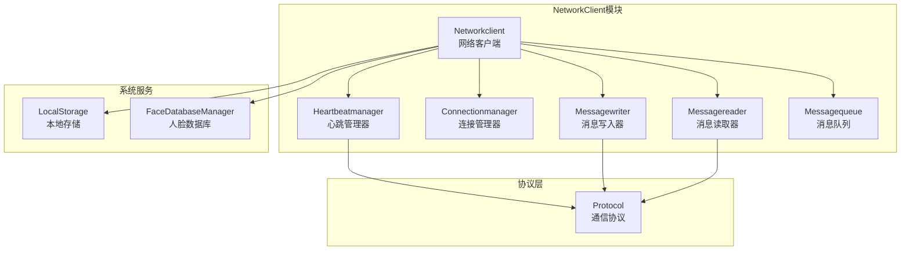
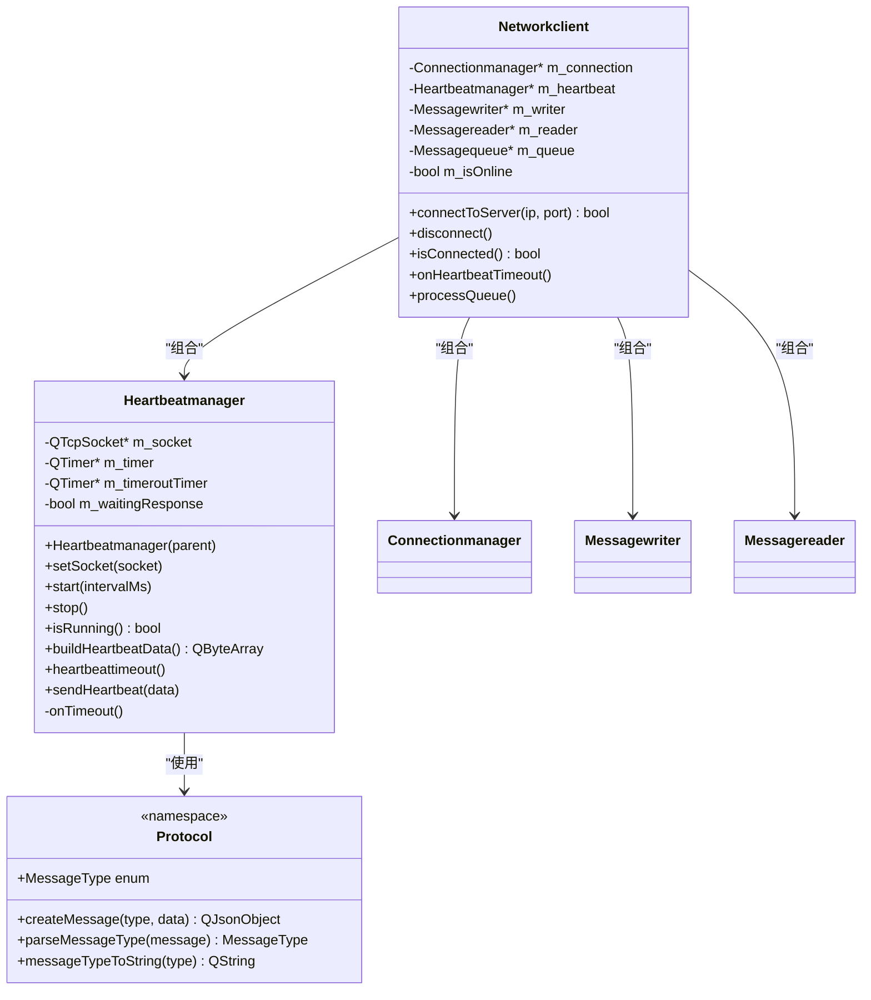
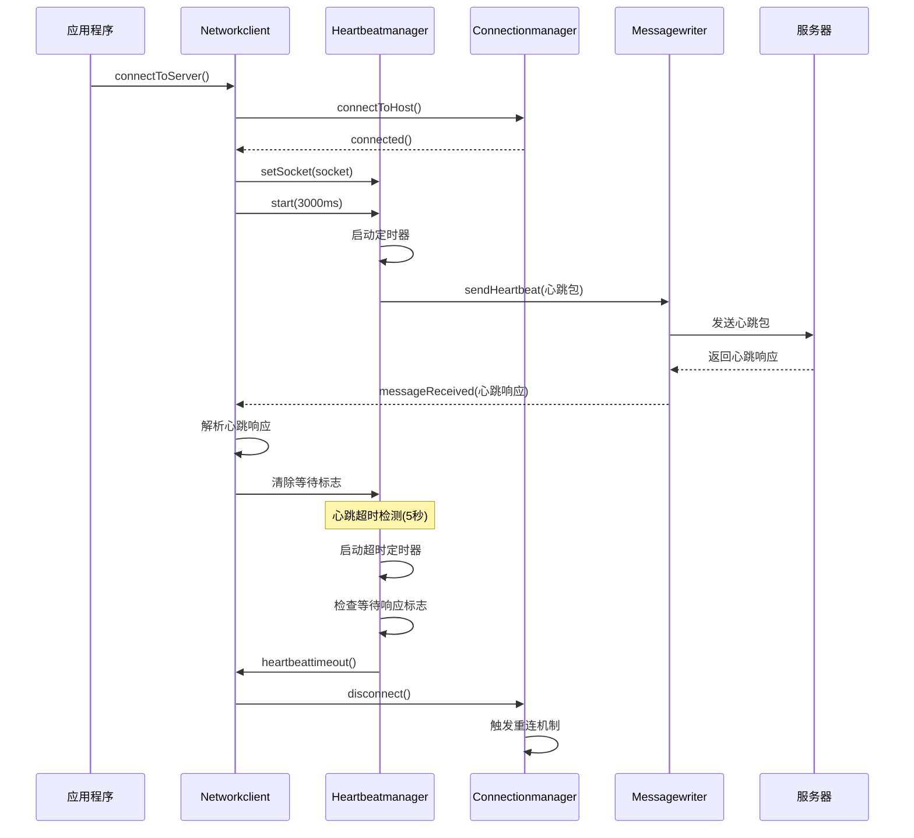
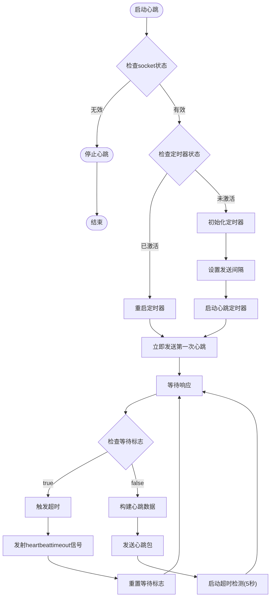
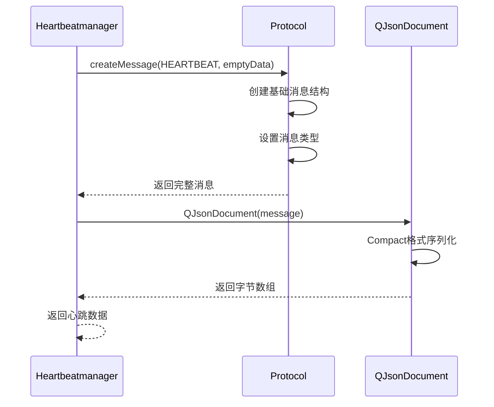
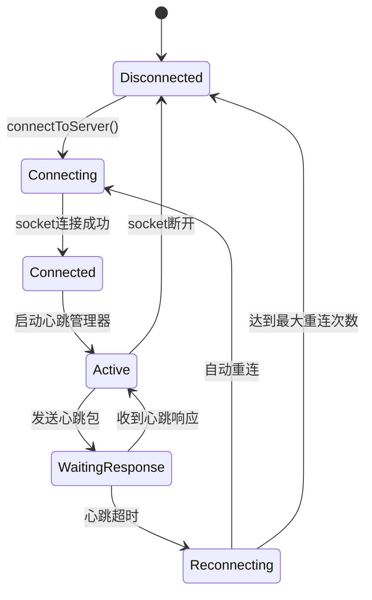
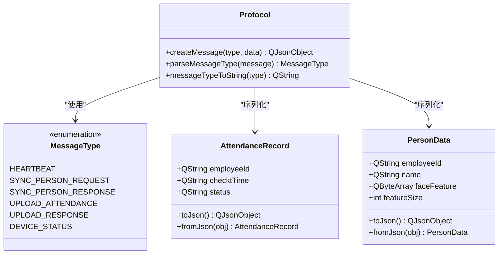
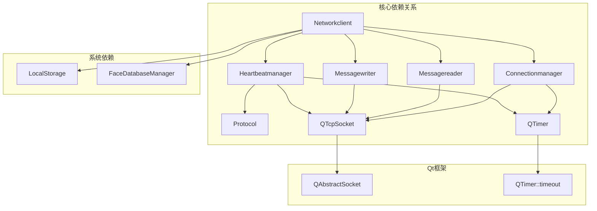

# 心跳管理器

<cite>
**本文引用的文件**
- [heartbeatmanager.h](file://NetworkClient/heartbeatmanager.h)
- [heartbeatmanager.cpp](file://NetworkClient/heartbeatmanager.cpp)
- [networkclient.h](file://NetworkClient/networkclient.h)
- [networkclient.cpp](file://NetworkClient/networkclient.cpp)
- [protocol.h](file://NetworkClient/protocol.h)
- [protocol.cpp](file://NetworkClient/protocol.cpp)
- [connectionmanager.h](file://NetworkClient/connectionmanager.h)
- [connectionmanager.cpp](file://NetworkClient/connectionmanager.cpp)
- [messagewriter.h](file://NetworkClient/messagewriter.h)
- [messagewriter.cpp](file://NetworkClient/messagewriter.cpp)
- [messagereader.h](file://NetworkClient/messagereader.h)
- [messagereader.cpp](file://NetworkClient/messagereader.cpp)
</cite>

## 目录
1. [简介](#简介)
2. [项目结构](#项目结构)
3. [核心组件](#核心组件)
4. [架构概览](#架构概览)
5. [详细组件分析](#详细组件分析)
6. [依赖关系分析](#依赖关系分析)
7. [性能考虑](#性能考虑)
8. [故障排除指南](#故障排除指南)
9. [结论](#结论)

## 简介

心跳管理器是AttendanceCheckClient系统中的关键组件，负责维护与服务器的持续连接，通过定期发送心跳包来检测网络连通性和服务器存活状态。该组件采用Qt框架的信号槽机制，实现了可靠的连接保活功能，包括定时器管理、心跳包构造、响应处理和异常恢复机制。

心跳管理器的核心功能包括：
- 心跳包格式标准化
- 发送间隔动态配置
- 超时检测与自动重连
- 状态监控与异常处理
- 与其他网络组件的无缝集成

## 项目结构

系统采用模块化设计，心跳管理器位于NetworkClient目录下，与连接管理、消息处理等组件协同工作：



**图表来源**
- [heartbeatmanager.h:1-41](file://NetworkClient/heartbeatmanager.h#L1-L41)
- [networkclient.h:17-75](file://NetworkClient/networkclient.h#L17-L75)
- [connectionmanager.h:8-45](file://NetworkClient/connectionmanager.h#L8-L45)

**章节来源**
- [heartbeatmanager.h:1-41](file://NetworkClient/heartbeatmanager.h#L1-L41)
- [networkclient.h:17-75](file://NetworkClient/networkclient.h#L17-L75)
- [connectionmanager.h:8-45](file://NetworkClient/connectionmanager.h#L8-L45)

## 核心组件

### 心跳管理器架构

心跳管理器采用面向对象设计，继承自QObject以支持Qt的信号槽机制：



**图表来源**
- [heartbeatmanager.h:10-38](file://NetworkClient/heartbeatmanager.h#L10-L38)
- [networkclient.h:17-73](file://NetworkClient/networkclient.h#L17-L73)
- [protocol.h:15-58](file://NetworkClient/protocol.h#L15-L58)

### 心跳包格式设计

心跳包采用标准化的JSON格式，遵循统一的协议规范：

| 字段名 | 数据类型 | 描述 | 示例 |
|--------|----------|------|------|
| type | String | 消息类型标识 | "HEARTBEAT" |
| data | Object | 心跳包数据内容 | {} (空对象) |

心跳包构建流程：
1. 创建基础消息结构
2. 设置消息类型为HEARTBEAT
3. 使用紧凑格式序列化为JSON
4. 通过信号发送给消息写入器

**章节来源**
- [heartbeatmanager.cpp:75-85](file://NetworkClient/heartbeatmanager.cpp#L75-L85)
- [protocol.cpp:42-48](file://NetworkClient/protocol.cpp#L42-L48)
- [protocol.h:19-26](file://NetworkClient/protocol.h#L19-L26)

## 架构概览

心跳管理器在整个网络架构中的位置和作用：



**图表来源**
- [networkclient.cpp:108-138](file://NetworkClient/networkclient.cpp#L108-L138)
- [heartbeatmanager.cpp:87-114](file://NetworkClient/heartbeatmanager.cpp#L87-L114)
- [connectionmanager.cpp:105-110](file://NetworkClient/connectionmanager.cpp#L105-L110)

## 详细组件分析

### 心跳管理器核心功能

#### 定时器管理系统

心跳管理器使用两个定时器实现完整的保活机制：



**图表来源**
- [heartbeatmanager.cpp:42-67](file://NetworkClient/heartbeatmanager.cpp#L42-L67)
- [heartbeatmanager.cpp:87-114](file://NetworkClient/heartbeatmanager.cpp#L87-L114)

#### 心跳包构造机制

心跳包构造遵循统一的协议格式，确保与服务器的兼容性：



**图表来源**
- [heartbeatmanager.cpp:75-85](file://NetworkClient/heartbeatmanager.cpp#L75-L85)
- [protocol.cpp:42-48](file://NetworkClient/protocol.cpp#L42-L48)

#### 超时检测与恢复机制

超时检测采用双定时器策略，确保准确的连接状态判断：

| 定时器类型 | 用途 | 默认间隔 | 特殊说明 |
|------------|------|----------|----------|
| 心跳发送定时器 | 定期发送心跳包 | 可配置(默认3秒) | 周期性任务 |
| 超时检测定时器 | 检测心跳响应 | 固定5秒 | 单次触发 |

超时处理流程：
1. 发送心跳包后启动5秒超时检测
2. 如果在超时时间内收到响应，清除等待标志
3. 如果超时仍未收到响应，发射heartbeattimeout信号
4. Networkclient收到信号后触发自动重连

**章节来源**
- [heartbeatmanager.cpp:14-22](file://NetworkClient/heartbeatmanager.cpp#L14-L22)
- [heartbeatmanager.cpp:87-114](file://NetworkClient/heartbeatmanager.cpp#L87-L114)
- [networkclient.cpp:205-213](file://NetworkClient/networkclient.cpp#L205-L213)

### 网络客户端集成

#### 事件驱动的连接管理

Networkclient通过信号槽机制与心跳管理器深度集成：



**图表来源**
- [networkclient.cpp:108-138](file://NetworkClient/networkclient.cpp#L108-L138)
- [networkclient.cpp:141-161](file://NetworkClient/networkclient.cpp#L141-L161)
- [heartbeatmanager.cpp:24-40](file://NetworkClient/heartbeatmanager.cpp#L24-L40)

#### 消息处理与状态同步

心跳管理器与消息处理系统的协作：

| 组件 | 职责 | 交互方式 |
|------|------|----------|
| Heartbeatmanager | 发送心跳包 | 通过sendHeartbeat信号 |
| Networkclient | 处理心跳超时 | 通过heartbeattimeout信号 |
| Connectionmanager | 自动重连 | 断开连接后触发 |
| Messagewriter | 实际发送数据 | 接收心跳数据包 |

**章节来源**
- [networkclient.cpp:122-132](file://NetworkClient/networkclient.cpp#L122-L132)
- [networkclient.cpp:205-213](file://NetworkClient/networkclient.cpp#L205-L213)

### 协议层设计

#### 消息类型定义

协议层定义了完整的消息类型体系，心跳包是其中的重要组成部分：



**图表来源**
- [protocol.h:19-49](file://NetworkClient/protocol.h#L19-L49)
- [protocol.cpp:5-21](file://NetworkClient/protocol.cpp#L5-L21)
- [protocol.cpp:23-40](file://NetworkClient/protocol.cpp#L23-L40)

**章节来源**
- [protocol.h:15-58](file://NetworkClient/protocol.h#L15-L58)
- [protocol.cpp:42-61](file://NetworkClient/protocol.cpp#L42-L61)

## 依赖关系分析

### 组件间依赖图



**图表来源**
- [heartbeatmanager.h:4-8](file://NetworkClient/heartbeatmanager.h#L4-L8)
- [networkclient.h:8-15](file://NetworkClient/networkclient.h#L8-L15)
- [connectionmanager.h:5-6](file://NetworkClient/connectionmanager.h#L5-L6)

### 关键依赖特性

1. **松耦合设计**: 心跳管理器通过信号槽与网络客户端解耦
2. **协议独立性**: 心跳包格式完全由Protocol层定义
3. **异步通信**: 所有网络操作基于Qt的异步机制
4. **错误隔离**: 异常处理在各自组件内完成，不影响其他模块

**章节来源**
- [heartbeatmanager.h:10-38](file://NetworkClient/heartbeatmanager.h#L10-L38)
- [networkclient.h:17-75](file://NetworkClient/networkclient.h#L17-L75)

## 性能考虑

### 心跳参数调优指南

#### 发送间隔优化

| 场景 | 推荐间隔 | 说明 |
|------|----------|------|
| 高可靠性网络 | 2-3秒 | 最小化延迟，提高检测精度 |
| 移动网络环境 | 5-8秒 | 减少网络开销，适应不稳定环境 |
| 低带宽限制 | 10-15秒 | 最大化带宽利用率 |
| 实时性要求高 | 1-2秒 | 最小化检测延迟 |

#### 超时时间配置

超时检测时间应满足以下关系：
```
超时时间 > 心跳间隔 × 1.5
```

推荐配置：
- 心跳间隔3秒：超时时间5秒
- 心跳间隔5秒：超时时间8秒
- 心跳间隔10秒：超时时间15秒

### 性能影响分析

#### CPU使用率
- 心跳定时器：极低CPU开销（毫秒级）
- JSON序列化：每次约0.1-0.5ms
- 网络I/O：主要取决于网络状况

#### 内存消耗
- 心跳包大小：约50-100字节
- 缓冲区管理：自动内存回收
- 定时器开销：每个定时器约1KB

#### 网络流量
- 正常情况：每3秒约100字节
- 月度流量：约432KB/月（按3秒间隔计算）

### 优化建议

1. **动态调整间隔**: 根据网络质量动态调整心跳间隔
2. **批量处理**: 在网络恢复时批量发送积压消息
3. **智能重连**: 结合历史连接成功率调整重连策略

## 故障排除指南

### 常见问题诊断

#### 心跳超时问题

**症状**: 心跳频繁超时，连接不稳定

**可能原因**:
1. 网络延迟过高
2. 服务器负载过重
3. 心跳间隔设置过短
4. 客户端处理能力不足

**解决步骤**:
1. 检查网络延迟和丢包率
2. 增大心跳间隔至5-8秒
3. 监控服务器CPU和内存使用
4. 优化客户端消息处理逻辑

#### 心跳包发送失败

**症状**: 心跳包发送成功但无响应

**排查方法**:
1. 验证服务器是否正确处理心跳包
2. 检查防火墙和代理设置
3. 确认消息格式符合协议要求
4. 测试服务器端心跳处理逻辑

#### 连接状态异常

**症状**: 连接状态与实际不符

**处理方案**:
1. 检查socket状态监听
2. 验证信号槽连接完整性
3. 确认状态同步机制
4. 实施状态回退保护

### 调试工具和方法

#### 日志分析

关键日志点：
- 心跳发送：`"心跳包已发送"`
- 超时检测：`"心跳超时，触发重连"`
- 连接状态：`"连接成功/断开"`
- 错误信息：详细的错误描述

#### 性能监控

建议监控指标：
- 心跳成功率
- 平均响应时间
- 连接维持时间
- 重连次数统计

**章节来源**
- [heartbeatmanager.cpp:16-21](file://NetworkClient/heartbeatmanager.cpp#L16-L21)
- [networkclient.cpp:205-213](file://NetworkClient/networkclient.cpp#L205-L213)
- [connectionmanager.cpp:79-103](file://NetworkClient/connectionmanager.cpp#L79-L103)

## 结论

心跳管理器作为AttendanceCheckClient系统的核心组件，通过精心设计的架构和完善的错误处理机制，实现了可靠的连接保活功能。其主要优势包括：

1. **模块化设计**: 清晰的职责分离和接口定义
2. **异步处理**: 基于Qt信号槽的非阻塞通信
3. **容错性强**: 完善的超时检测和自动重连机制
4. **性能优化**: 可配置的心跳间隔和高效的序列化机制
5. **易于扩展**: 标准化的协议接口支持功能扩展

该组件的成功实施为整个系统的稳定运行奠定了坚实基础，为后续的功能扩展和性能优化提供了良好的技术支撑。