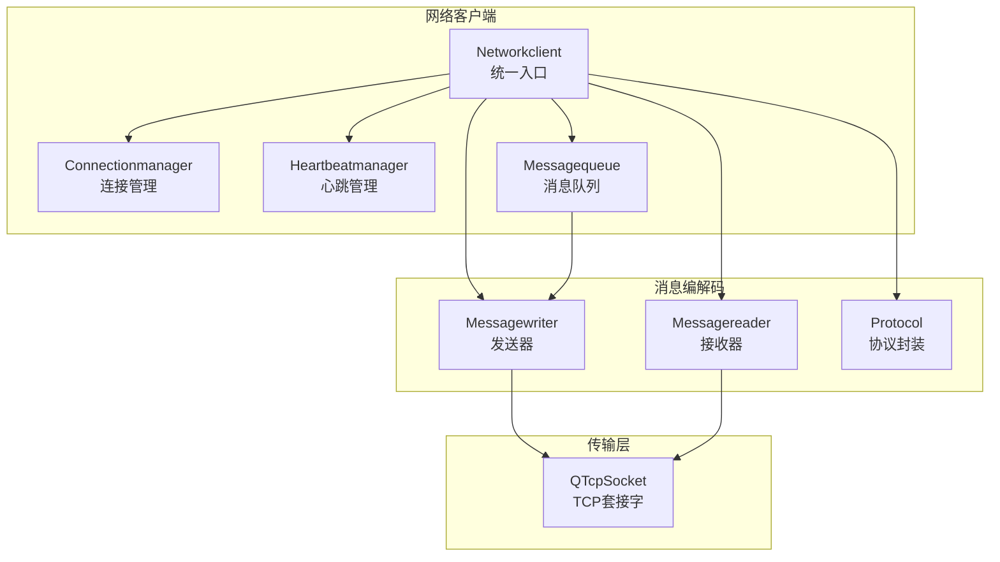
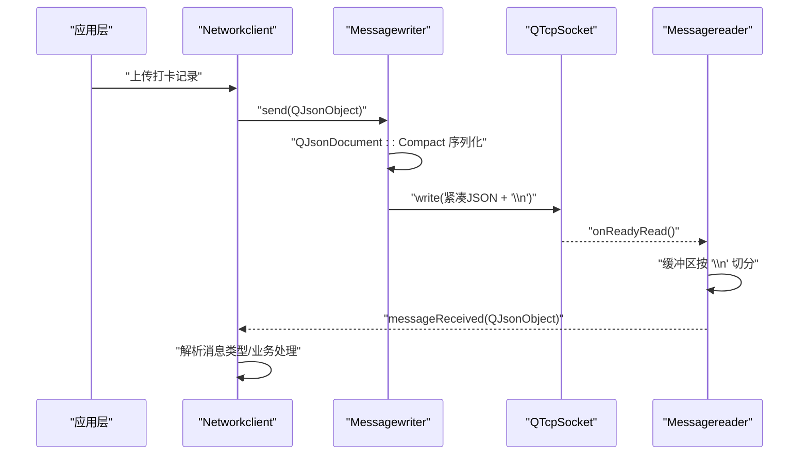
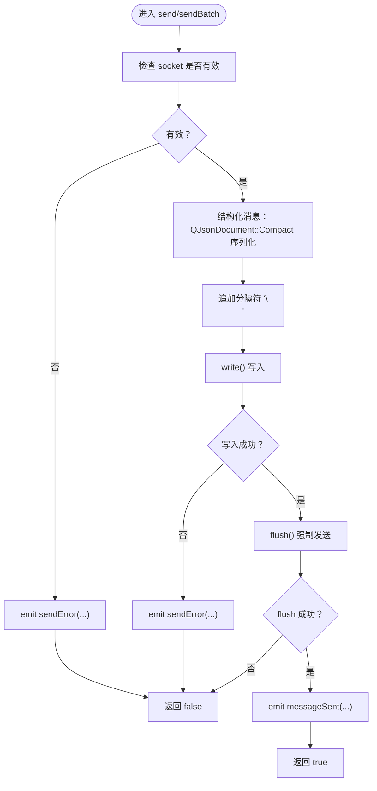
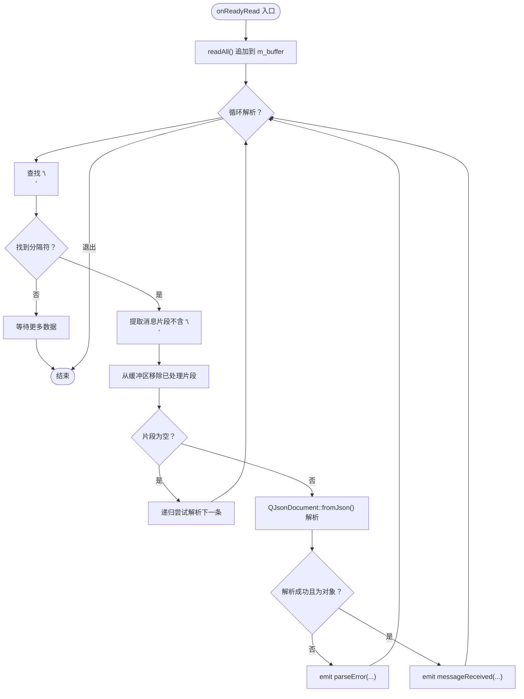
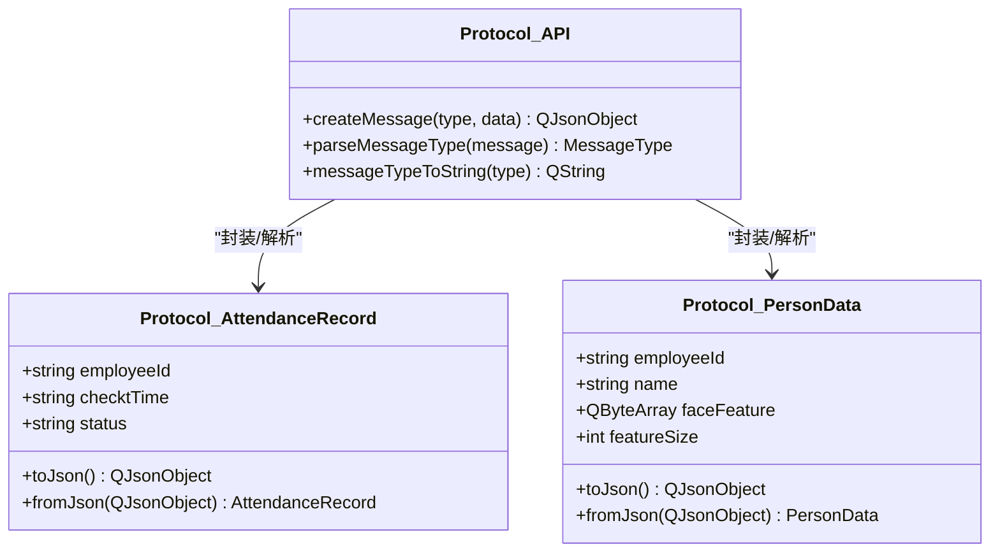
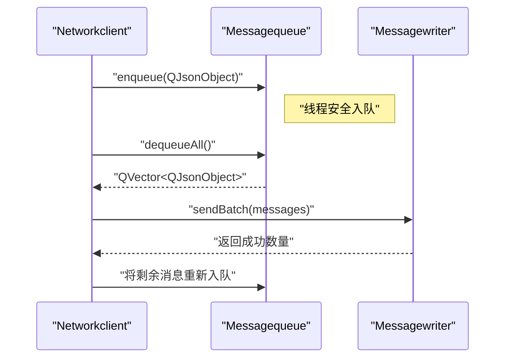
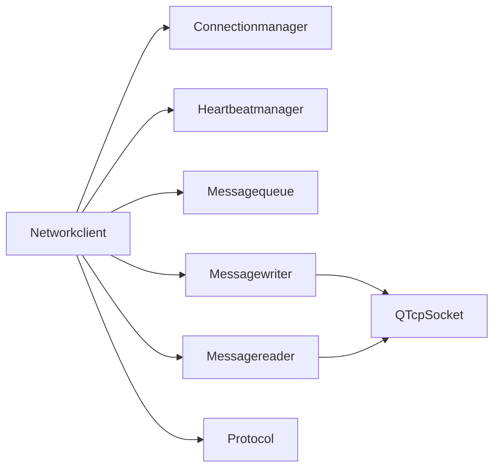

# 消息读写器

<cite>
**本文引用的文件**
- [messagereader.h](file://NetworkClient/messagereader.h)
- [messagereader.cpp](file://NetworkClient/messagereader.cpp)
- [messagewriter.h](file://NetworkClient/messagewriter.h)
- [messagewriter.cpp](file://NetworkClient/messagewriter.cpp)
- [messagequeue.h](file://NetworkClient/messagequeue.h)
- [messagequeue.cpp](file://NetworkClient/messagequeue.cpp)
- [networkclient.h](file://NetworkClient/networkclient.h)
- [networkclient.cpp](file://NetworkClient/networkclient.cpp)
- [protocol.h](file://NetworkClient/protocol.h)
- [protocol.cpp](file://NetworkClient/protocol.cpp)
- [connectionmanager.h](file://NetworkClient/connectionmanager.h)
- [heartbeatmanager.h](file://NetworkClient/heartbeatmanager.h)
</cite>

## 目录
1. [简介](#简介)
2. [项目结构](#项目结构)
3. [核心组件](#核心组件)
4. [架构总览](#架构总览)
5. [详细组件分析](#详细组件分析)
6. [依赖关系分析](#依赖关系分析)
7. [性能考量](#性能考量)
8. [故障排查指南](#故障排查指南)
9. [结论](#结论)
10. [附录](#附录)

## 简介
本文件围绕“消息读写器”组件，系统阐述消息序列化与反序列化机制、消息头部与分隔符约定、错误检测与异常处理、以及性能优化策略。重点覆盖以下方面：
- JSON 格式处理与紧凑序列化
- 二进制数据编码（Base64）与文本化传输
- 数据类型转换与协议封装
- 消息头部格式、校验与粘包处理
- 解析流程、数据验证与错误传播
- 批量发送、队列容错与网络恢复处理
- 扩展性、兼容性与安全建议

## 项目结构
消息读写器位于 NetworkClient 子模块，配合连接管理、心跳、协议与本地存储模块协同工作。

图表来源
- [networkclient.cpp:108-137](file://NetworkClient/networkclient.cpp#L108-L137)
- [messagewriter.cpp:13-76](file://NetworkClient/messagewriter.cpp#L13-L76)
- [messagereader.cpp:35-54](file://NetworkClient/messagereader.cpp#L35-L54)
- [messagequeue.cpp:8-44](file://NetworkClient/messagequeue.cpp#L8-L44)
- [protocol.cpp:42-48](file://NetworkClient/protocol.cpp#L42-L48)

章节来源
- [networkclient.h:17-74](file://NetworkClient/networkclient.h#L17-L74)
- [networkclient.cpp:1-312](file://NetworkClient/networkclient.cpp#L1-L312)

## 核心组件
- 消息发送器（Messagewriter）
  - 支持结构化 JSON 与原始二进制数据发送
  - 使用紧凑 JSON 序列化减少带宽
  - 统一追加分隔符（换行符）以实现消息边界
  - 发送后立即 flush，保证及时性
- 消息读取器（Messagereader）
  - 基于换行符的简单帧协议，处理粘包/拆包
  - 逐条 JSON 解析，失败时发出错误信号
- 消息队列（Messagequeue）
  - 线程安全的队列，断网缓存与恢复后批量发送
- 协议封装（Protocol）
  - 定义消息类型、结构体与序列化/反序列化
  - 对二进制特征数据采用 Base64 文本化传输
- 网络客户端（Networkclient）
  - 组装上述模块，处理业务接口与状态机

章节来源
- [messagewriter.h:8-33](file://NetworkClient/messagewriter.h#L8-L33)
- [messagewriter.cpp:13-128](file://NetworkClient/messagewriter.cpp#L13-L128)
- [messagereader.h:8-35](file://NetworkClient/messagereader.h#L8-L35)
- [messagereader.cpp:56-107](file://NetworkClient/messagereader.cpp#L56-L107)
- [messagequeue.h:8-30](file://NetworkClient/messagequeue.h#L8-L30)
- [messagequeue.cpp:8-70](file://NetworkClient/messagequeue.cpp#L8-L70)
- [protocol.h:15-58](file://NetworkClient/protocol.h#L15-L58)
- [protocol.cpp:5-40](file://NetworkClient/protocol.cpp#L5-L40)

## 架构总览
消息读写器通过 QTcpSocket 实现可靠传输，采用“JSON 文本 + 换行分隔”的轻量协议。发送侧将结构化对象序列化为紧凑 JSON 并追加分隔符；接收侧按分隔符切分缓冲区，逐条解析 JSON 并发出信号。断网时由队列缓存，网络恢复后批量发送。

图表来源
- [networkclient.cpp:44-65](file://NetworkClient/networkclient.cpp#L44-L65)
- [messagewriter.cpp:13-76](file://NetworkClient/messagewriter.cpp#L13-L76)
- [messagereader.cpp:35-54](file://NetworkClient/messagereader.cpp#L35-L54)

## 详细组件分析

### 消息发送器（Messagewriter）
- 序列化策略
  - 结构化消息：使用 QJsonDocument 并选择紧凑格式，去除空白字符，降低带宽与解析成本
  - 原始二进制：要求上层已序列化为字节流，发送前追加分隔符，确保接收端能正确切分
- 边界与分隔
  - 统一使用换行符作为消息分隔符，避免 TCP 流式协议无边界问题
- 错误处理
  - 检查 socket 状态与初始化有效性
  - 写入失败时读取底层错误字符串并通过信号上报
  - flush 失败时返回 false，调用方可据此重试或降级
- 批量发送
  - sendBatch 顺序发送，遇失败即中断，返回成功数量；未发送成功的消息由上层重新入队

图表来源
- [messagewriter.cpp:13-76](file://NetworkClient/messagewriter.cpp#L13-L76)
- [messagewriter.cpp:78-112](file://NetworkClient/messagewriter.cpp#L78-L112)
- [messagewriter.cpp:115-128](file://NetworkClient/messagewriter.cpp#L115-L128)

章节来源
- [messagewriter.h:8-33](file://NetworkClient/messagewriter.h#L8-L33)
- [messagewriter.cpp:13-128](file://NetworkClient/messagewriter.cpp#L13-L128)

### 消息读取器（Messagereader）
- 缓冲与切分
  - onReadyRead 读取所有可用数据，累积到 m_buffer
  - 循环尝试按换行符切分完整消息，避免粘包
- 解析与验证
  - 对每条消息执行 JSON 解析，非对象或解析失败均视为错误
  - 解析失败时发出 parseError 信号，便于上层诊断
- 空消息处理
  - 跳过空消息，继续尝试解析下一条

图表来源
- [messagereader.cpp:35-54](file://NetworkClient/messagereader.cpp#L35-L54)
- [messagereader.cpp:56-107](file://NetworkClient/messagereader.cpp#L56-L107)

章节来源
- [messagereader.h:8-35](file://NetworkClient/messagereader.h#L8-L35)
- [messagereader.cpp:35-107](file://NetworkClient/messagereader.cpp#L35-L107)

### 协议与数据模型（Protocol）
- 消息类型
  - 定义心跳、人员同步请求/响应、打卡上传、上传响应、设备状态等类型
- 结构体序列化
  - AttendanceRecord：将字段映射为 JSON 对象
  - PersonData：人脸特征为二进制，序列化时转换为 Base64 文本，接收时还原为二进制
- 消息封装
  - createMessage：为业务数据包裹统一头部（type/data），便于接收端识别与路由
  - parseMessageType：从 JSON 中解析消息类型字符串并映射为枚举

图表来源
- [protocol.h:19-49](file://NetworkClient/protocol.h#L19-L49)
- [protocol.cpp:5-40](file://NetworkClient/protocol.cpp#L5-L40)
- [protocol.cpp:42-61](file://NetworkClient/protocol.cpp#L42-L61)

章节来源
- [protocol.h:15-58](file://NetworkClient/protocol.h#L15-L58)
- [protocol.cpp:1-62](file://NetworkClient/protocol.cpp#L1-L62)

### 消息队列与容错（Messagequeue）
- 线程安全
  - 使用互斥锁保护入队/出队，避免并发冲突
- 缓存与恢复
  - 发送失败或断网时将消息入队
  - 网络恢复后批量出队并调用发送器批量发送
- 查询与清理
  - 提供 size、isEmpty、clear 等辅助接口

图表来源
- [messagequeue.cpp:33-44](file://NetworkClient/messagequeue.cpp#L33-L44)
- [networkclient.cpp:241-267](file://NetworkClient/networkclient.cpp#L241-L267)

章节来源
- [messagequeue.h:8-30](file://NetworkClient/messagequeue.h#L8-L30)
- [messagequeue.cpp:8-70](file://NetworkClient/messagequeue.cpp#L8-L70)
- [networkclient.cpp:241-267](file://NetworkClient/networkclient.cpp#L241-L267)

### 网络客户端集成（Networkclient）
- 生命周期与状态
  - 连接成功后创建发送器/读取器，启动心跳，开始接收
  - 断开时停止心跳与接收，清理资源，保留队列
- 业务接口
  - 同步人员数据、上传打卡记录、批量上传、上报设备状态
  - 断网时自动入队，网络恢复后处理队列
- 信号桥接
  - 将底层模块信号转换为业务信号，便于 UI 或其他模块订阅

章节来源
- [networkclient.h:17-74](file://NetworkClient/networkclient.h#L17-L74)
- [networkclient.cpp:108-137](file://NetworkClient/networkclient.cpp#L108-L137)
- [networkclient.cpp:140-161](file://NetworkClient/networkclient.cpp#L140-L161)
- [networkclient.cpp:164-181](file://NetworkClient/networkclient.cpp#L164-L181)
- [networkclient.cpp:183-203](file://NetworkClient/networkclient.cpp#L183-L203)
- [networkclient.cpp:269-309](file://NetworkClient/networkclient.cpp#L269-L309)

## 依赖关系分析
- 组件耦合
  - Networkclient 作为协调者，聚合 Connectionmanager、Heartbeatmanager、Messagewriter、Messagereader、Messagequeue
  - Protocol 与 Networkclient 松耦合，仅通过 QJsonObject 交互
- 外部依赖
  - QTcpSocket 提供底层传输
  - QJsonDocument/QJsonObject 提供序列化/反序列化
- 可能的循环依赖
  - 无直接循环依赖，模块职责清晰

图表来源
- [networkclient.h:66-70](file://NetworkClient/networkclient.h#L66-L70)
- [messagewriter.h](file://NetworkClient/messagewriter.h#L32)
- [messagereader.h](file://NetworkClient/messagereader.h#L33)

章节来源
- [networkclient.h:17-74](file://NetworkClient/networkclient.h#L17-L74)

## 性能考量
- 序列化
  - 紧凑 JSON 序列化显著降低带宽占用，适合高频消息场景
- 发送
  - flush 强制发送，避免内核缓冲延迟；批量发送 sendBatch 可减少系统调用次数
- 接收
  - 基于换行符的切分逻辑简单高效；循环解析避免重复拷贝
- 内存与线程
  - Messagequeue 使用互斥锁保障线程安全；建议在高并发场景限制队列长度并设置超时策略
- 建议
  - 对超大二进制（如特征向量）可考虑分片传输或压缩后再 Base64
  - 心跳间隔与超时阈值需结合网络质量动态调整

## 故障排查指南
- 发送失败
  - 检查 socket 初始化与连接状态
  - 关注 sendError 信号中的底层错误字符串
  - 若 flush 失败，确认网络拥塞或对端关闭
- 解析失败
  - parseError 信号携带错误描述与偏移位置
  - 核对发送端是否严格追加分隔符
- 粘包/半包
  - 确认发送端未遗漏分隔符
  - 接收端缓冲区是否被正确移除已处理片段
- 断网缓存
  - 网络恢复后检查队列是否被正确批量发送
  - 对失败项进行重试或降级处理

章节来源
- [messagewriter.cpp:61-71](file://NetworkClient/messagewriter.cpp#L61-L71)
- [messagewriter.cpp:105-107](file://NetworkClient/messagewriter.cpp#L105-L107)
- [messagereader.cpp:83-90](file://NetworkClient/messagereader.cpp#L83-L90)
- [networkclient.cpp:241-267](file://NetworkClient/networkclient.cpp#L241-L267)

## 结论
消息读写器以简洁可靠的协议实现了结构化与二进制数据的混合传输：紧凑 JSON 序列化、换行符分隔、线程安全队列与信号驱动的错误处理，满足实时性与稳定性的双重需求。通过 Protocol 封装与 Networkclient 协调，系统具备良好的扩展性与可维护性。

## 附录

### 消息格式与头部约定
- 统一头部
  - type：消息类型字符串（来自枚举）
  - data：业务数据对象
- 传输格式
  - 每条消息为一行 JSON，末尾追加分隔符（换行符）

章节来源
- [protocol.cpp:42-48](file://NetworkClient/protocol.cpp#L42-L48)
- [messagewriter.cpp:45-46](file://NetworkClient/messagewriter.cpp#L45-L46)
- [messagereader.cpp:69-72](file://NetworkClient/messagereader.cpp#L69-L72)

### 二进制数据编码策略
- 发送前将二进制特征转换为 Base64 文本，接收端再还原为二进制
- 优点：兼容 JSON 文本传输；缺点：体积增大约 33%

章节来源
- [protocol.cpp:23-40](file://NetworkClient/protocol.cpp#L23-L40)

### 错误检测与异常处理清单
- 发送侧
  - socket 有效性检查、连接状态检查、写入与 flush 失败检测
- 接收侧
  - JSON 解析错误、非对象结构、空消息跳过
- 上层
  - 队列入队/出队失败、批量发送中断、网络状态变化

章节来源
- [messagewriter.cpp:15-26](file://NetworkClient/messagewriter.cpp#L15-L26)
- [messagewriter.cpp:61-71](file://NetworkClient/messagewriter.cpp#L61-L71)
- [messagereader.cpp:83-97](file://NetworkClient/messagereader.cpp#L83-L97)
- [networkclient.cpp:241-267](file://NetworkClient/networkclient.cpp#L241-L267)

### 安全与兼容性建议
- 安全
  - 对敏感字段（如人员 ID、时间戳）进行最小暴露原则
  - 在传输层启用 TLS（若服务端支持），避免明文泄露
- 兼容性
  - 版本化消息类型字符串，新增类型时保持向后兼容
  - 对未知类型消息采取静默丢弃或记录日志策略
- 可观测性
  - 记录发送/接收统计、错误分布与耗时指标，便于定位瓶颈