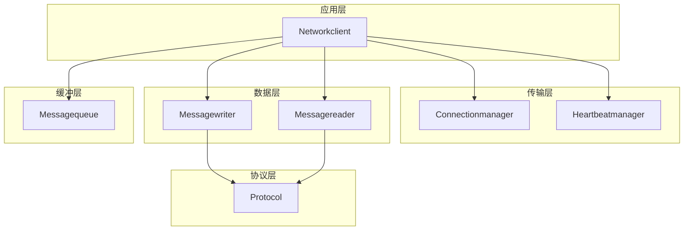
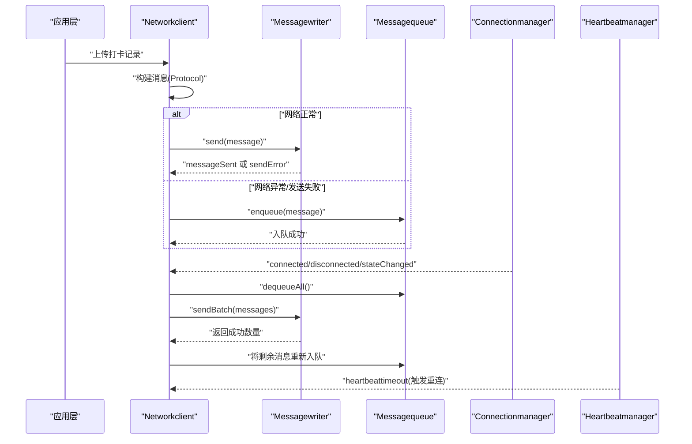
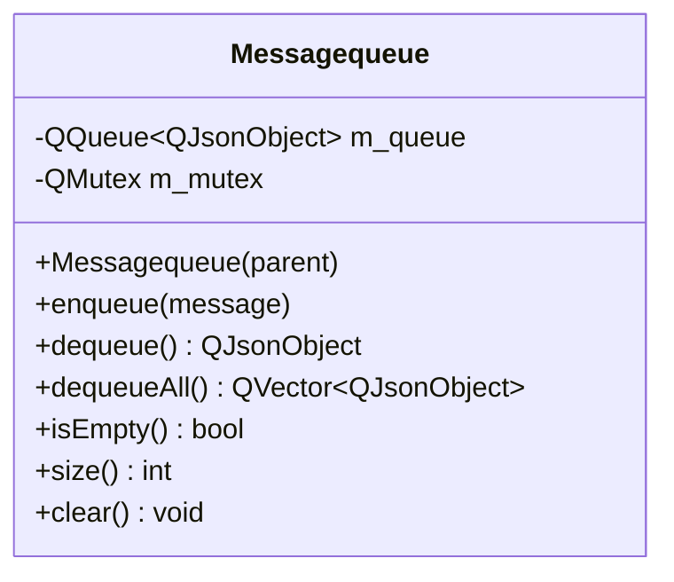
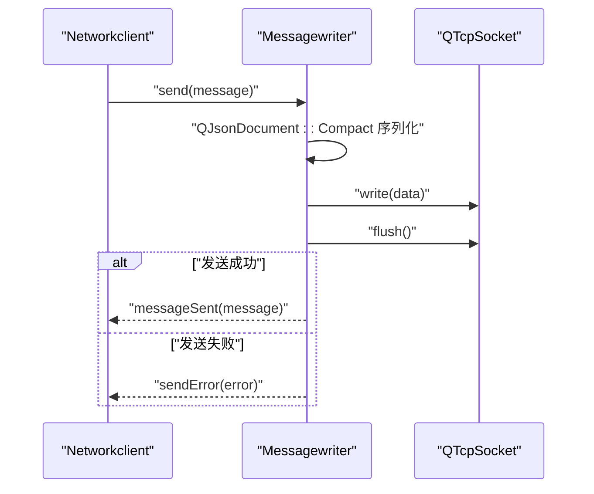
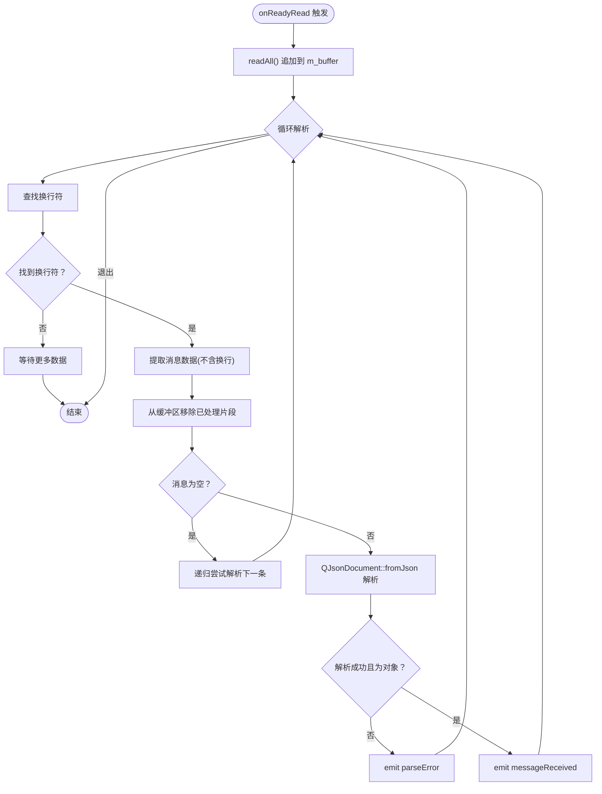
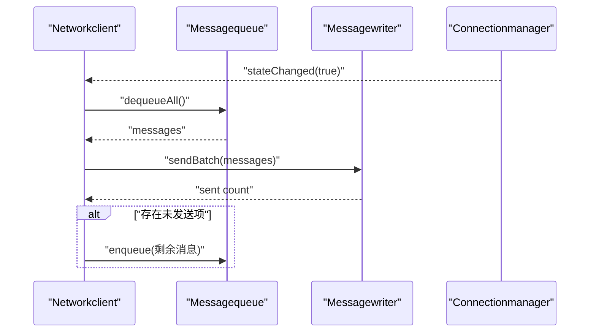
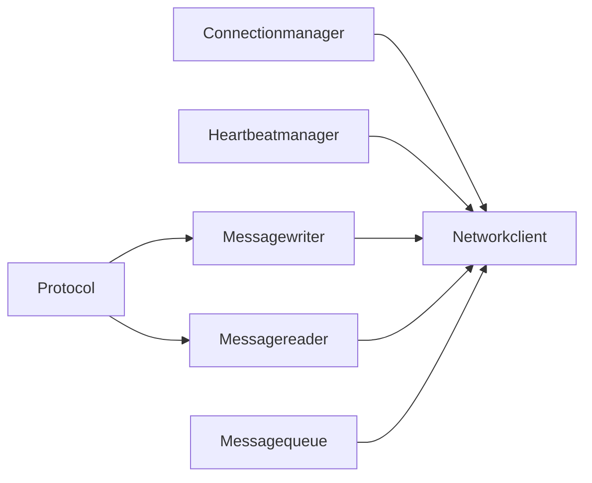

# 消息队列

<cite>
**本文引用的文件**
- [messagequeue.h](file://NetworkClient/messagequeue.h)
- [messagequeue.cpp](file://NetworkClient/messagequeue.cpp)
- [messagewriter.h](file://NetworkClient/messagewriter.h)
- [messagewriter.cpp](file://NetworkClient/messagewriter.cpp)
- [messagereader.h](file://NetworkClient/messagereader.h)
- [messagereader.cpp](file://NetworkClient/messagereader.cpp)
- [networkclient.h](file://NetworkClient/networkclient.h)
- [networkclient.cpp](file://NetworkClient/networkclient.cpp)
- [connectionmanager.h](file://NetworkClient/connectionmanager.h)
- [connectionmanager.cpp](file://NetworkClient/connectionmanager.cpp)
- [heartbeatmanager.h](file://NetworkClient/heartbeatmanager.h)
- [heartbeatmanager.cpp](file://NetworkClient/heartbeatmanager.cpp)
- [protocol.h](file://NetworkClient/protocol.h)
- [protocol.cpp](file://NetworkClient/protocol.cpp)
</cite>

## 目录
1. [简介](#简介)
2. [项目结构](#项目结构)
3. [核心组件](#核心组件)
4. [架构总览](#架构总览)
5. [详细组件分析](#详细组件分析)
6. [依赖关系分析](#依赖关系分析)
7. [性能与内存考量](#性能与内存考量)
8. [故障排查指南](#故障排查指南)
9. [结论](#结论)
10. [附录](#附录)

## 简介
本文件围绕消息队列组件进行系统化技术文档整理，重点覆盖以下方面：
- 消息缓冲与并发安全：基于互斥锁的线程安全队列入队/出队
- 队列管理策略：断网缓存、批量发送、重试与回退
- 序列化与协议：JSON序列化、消息分隔符、消息类型与结构
- 重传队列管理：断网期间入队、网络恢复后批量发送与回退
- 队列持久化：当前实现为内存队列，建议结合本地存储扩展
- 超时控制与资源清理：心跳超时触发重连、连接断开时的资源释放
- 性能优化与内存泄漏防护：紧凑序列化、flush 强制发送、合理生命周期管理

## 项目结构
消息队列相关代码位于 NetworkClient 子目录，采用“模块化+分层”的组织方式：
- 顶层客户端封装：Networkclient 组合 Connectionmanager、Heartbeatmanager、Messagewriter、Messagereader、Messagequeue
- 传输层：Connectionmanager 负责连接与重连；Heartbeatmanager 负责心跳与超时
- 数据层：Messagewriter 负责消息发送与批量发送；Messagereader 负责消息接收与解析
- 缓冲层：Messagequeue 提供线程安全的 JSON 消息队列
- 协议层：Protocol 定义消息类型与序列化/反序列化

图表来源
- [networkclient.cpp:221-231](file://NetworkClient/networkclient.cpp#L221-L231)
- [connectionmanager.cpp:3-18](file://NetworkClient/connectionmanager.cpp#L3-L18)
- [heartbeatmanager.cpp:4-22](file://NetworkClient/heartbeatmanager.cpp#L4-L22)
- [messagewriter.cpp:3-11](file://NetworkClient/messagewriter.cpp#L3-L11)
- [messagereader.cpp:3-11](file://NetworkClient/messagereader.cpp#L3-L11)
- [messagequeue.cpp:3-6](file://NetworkClient/messagequeue.cpp#L3-L6)

章节来源
- [networkclient.h:17-73](file://NetworkClient/networkclient.h#L17-L73)
- [networkclient.cpp:221-231](file://NetworkClient/networkclient.cpp#L221-L231)

## 核心组件
- Messagequeue：线程安全的 JSON 消息队列，提供入队、出队、批量出队、查询与清空
- Messagewriter：消息写入器，负责 JSON 序列化、添加分隔符、通过 TCP 发送、批量发送与错误信号
- Messagereader：消息读取器，负责从 TCP 读取数据、拼接缓冲、按换行符切分、JSON 解析与错误信号
- Networkclient：高层封装，协调连接、心跳、读写与队列处理，实现断网缓存与网络恢复后的批量重发
- Connectionmanager：连接管理与指数退避重连
- Heartbeatmanager：心跳发送与超时检测
- Protocol：消息类型与序列化/反序列化工具

章节来源
- [messagequeue.h:8-30](file://NetworkClient/messagequeue.h#L8-L30)
- [messagequeue.cpp:8-66](file://NetworkClient/messagequeue.cpp#L8-L66)
- [messagewriter.h:8-33](file://NetworkClient/messagewriter.h#L8-L33)
- [messagewriter.cpp:13-128](file://NetworkClient/messagewriter.cpp#L13-L128)
- [messagereader.h:8-35](file://NetworkClient/messagereader.h#L8-L35)
- [messagereader.cpp:35-107](file://NetworkClient/messagereader.cpp#L35-L107)
- [networkclient.h:17-73](file://NetworkClient/networkclient.h#L17-L73)
- [networkclient.cpp:108-267](file://NetworkClient/networkclient.cpp#L108-L267)
- [connectionmanager.h:8-42](file://NetworkClient/connectionmanager.h#L8-L42)
- [connectionmanager.cpp:20-77](file://NetworkClient/connectionmanager.cpp#L20-L77)
- [heartbeatmanager.h:10-38](file://NetworkClient/heartbeatmanager.h#L10-L38)
- [heartbeatmanager.cpp:24-113](file://NetworkClient/heartbeatmanager.cpp#L24-L113)
- [protocol.h:15-58](file://NetworkClient/protocol.h#L15-L58)
- [protocol.cpp:5-40](file://NetworkClient/protocol.cpp#L5-L40)

## 架构总览
消息从应用层产生，经过协议封装后进入队列；当网络正常时由写入器发送；若发送失败或断网，则入队缓存；网络恢复后由 Networkclient 批量从队列出队并发送，失败部分再次入队，形成“断网缓存—批量重发—失败回退”的闭环。

图表来源
- [networkclient.cpp:44-94](file://NetworkClient/networkclient.cpp#L44-L94)
- [networkclient.cpp:108-137](file://NetworkClient/networkclient.cpp#L108-L137)
- [networkclient.cpp:241-267](file://NetworkClient/networkclient.cpp#L241-L267)
- [messagewriter.cpp:13-76](file://NetworkClient/messagewriter.cpp#L13-L76)
- [messagewriter.cpp:115-128](file://NetworkClient/messagewriter.cpp#L115-L128)
- [messagequeue.cpp:33-44](file://NetworkClient/messagequeue.cpp#L33-L44)
- [connectionmanager.cpp:55-77](file://NetworkClient/connectionmanager.cpp#L55-L77)
- [heartbeatmanager.cpp:87-113](file://NetworkClient/heartbeatmanager.cpp#L87-L113)

## 详细组件分析

### Messagequeue：线程安全消息队列
- 设计要点
  - 使用 QQueue<QJsonObject> 作为底层容器
  - 使用 QMutex 与 QMutexLocker 保证并发安全
  - 提供 enqueue/dequeue/dequeueAll/isEmpty/size/clear 等基础操作
- 并发模型
  - 入队/出队/查询/清空均在临界区内执行，避免竞态
- 复杂度
  - 入队/出队/查询均为 O(1)，批量出队 O(n)
- 注意事项
  - 出队空队列会返回空 JSON 对象并输出警告
  - 清空时记录清除条数，便于监控

图表来源
- [messagequeue.h:8-30](file://NetworkClient/messagequeue.h#L8-L30)
- [messagequeue.cpp:8-66](file://NetworkClient/messagequeue.cpp#L8-L66)

章节来源
- [messagequeue.h:12-29](file://NetworkClient/messagequeue.h#L12-L29)
- [messagequeue.cpp:8-66](file://NetworkClient/messagequeue.cpp#L8-L66)

### Messagewriter：消息发送器
- 序列化与分隔
  - JSON 对象通过 QJsonDocument::Compact 序列化为字节流
  - 统一追加换行符作为消息分隔符，便于接收端按行解析
- 发送流程
  - 校验 socket 有效性与连接状态
  - write 到 socket 缓冲区，随后 flush 强制发送
  - 成功/失败分别发射 messageSent/sendError 信号
- 批量发送
  - sendBatch 遍历消息逐条发送，遇到失败即中断并返回已成功数量
- 错误处理
  - 基于 QTcpSocket::errorString 获取错误描述
  - 将错误通过信号上抛，便于上层处理

图表来源
- [messagewriter.cpp:13-76](file://NetworkClient/messagewriter.cpp#L13-L76)
- [messagewriter.cpp:115-128](file://NetworkClient/messagewriter.cpp#L115-L128)

章节来源
- [messagewriter.h:12-33](file://NetworkClient/messagewriter.h#L12-L33)
- [messagewriter.cpp:13-128](file://NetworkClient/messagewriter.cpp#L13-L128)

### Messagereader：消息读取器
- 接收与缓冲
  - 连接 socket 的 readyRead 信号，读取所有可用数据到 m_buffer
  - 循环尝试解析，直到缓冲区不足一条完整消息
- 解析与分隔
  - 以换行符为分隔符切分消息
  - 使用 QJsonDocument::fromJson 解析，失败则发射 parseError
- 边界处理
  - 跳过空消息，继续解析下一条
  - 仅接受 JSON 对象，否则视为解析失败

图表来源
- [messagereader.cpp:35-54](file://NetworkClient/messagereader.cpp#L35-L54)
- [messagereader.cpp:56-107](file://NetworkClient/messagereader.cpp#L56-L107)

章节来源
- [messagereader.h:12-35](file://NetworkClient/messagereader.h#L12-L35)
- [messagereader.cpp:35-107](file://NetworkClient/messagereader.cpp#L35-L107)

### Networkclient：高层编排与队列处理
- 断网缓存与网络恢复
  - 发送失败或断网时将消息入队
  - 连接成功/状态变为在线时，批量从队列出队并 sendBatch
  - 未成功发送的消息重新入队，形成可靠重试
- 业务接口
  - 同步人员数据、上传打卡记录、批量上传、上报设备状态
  - 基于 Protocol 构建标准消息结构
- 心跳与重连
  - 连接成功后启动心跳；心跳超时触发断开，交由 Connectionmanager 自动重连
- 资源清理
  - 连接断开时停止心跳、停止接收、删除 writer/reader 指针，避免悬挂

图表来源
- [networkclient.cpp:241-267](file://NetworkClient/networkclient.cpp#L241-L267)
- [messagequeue.cpp:33-44](file://NetworkClient/messagequeue.cpp#L33-L44)
- [messagewriter.cpp:115-128](file://NetworkClient/messagewriter.cpp#L115-L128)

章节来源
- [networkclient.h:17-73](file://NetworkClient/networkclient.h#L17-L73)
- [networkclient.cpp:108-181](file://NetworkClient/networkclient.cpp#L108-L181)
- [networkclient.cpp:241-267](file://NetworkClient/networkclient.cpp#L241-L267)

### Connectionmanager：连接与重连
- 连接控制
  - 保存目标 IP/端口，发起连接；若已连接则先断开再重连
- 重连策略
  - 指数退避（最多 5 次），单次延迟上限 30 秒
  - 主动断开时标记，避免无意义重连
- 状态信号
  - connected/disconnected/stateChanged/errorOccurred

章节来源
- [connectionmanager.h:8-42](file://NetworkClient/connectionmanager.h#L8-L42)
- [connectionmanager.cpp:20-109](file://NetworkClient/connectionmanager.cpp#L20-L109)

### Heartbeatmanager：心跳与超时
- 心跳发送
  - 定时器周期性触发，构建标准心跳消息并通过信号发送
- 超时检测
  - 若上次心跳未收到响应则判定超时，发射 heartbeattimeout 信号
  - 超时定时器单次触发，避免重复触发
- 生命周期
  - socket 连接/断开时自动启停

章节来源
- [heartbeatmanager.h:10-38](file://NetworkClient/heartbeatmanager.h#L10-L38)
- [heartbeatmanager.cpp:24-113](file://NetworkClient/heartbeatmanager.cpp#L24-L113)

### Protocol：消息类型与序列化
- 消息类型
  - HEARTBEAT、SYNC_PERSON_REQUEST/RESPONSE、UPLOAD_ATTENDANCE/RESPONSE、DEVICE_STATUS
- 结构体
  - AttendanceRecord、PersonData 提供 toJson/fromJson
- 工具函数
  - createMessage：统一消息包装
  - parseMessageType：从 JSON 解析消息类型
  - messageTypeToString：类型转字符串（日志）

章节来源
- [protocol.h:15-58](file://NetworkClient/protocol.h#L15-L58)
- [protocol.cpp:5-61](file://NetworkClient/protocol.cpp#L5-L61)

## 依赖关系分析
- 组件耦合
  - Networkclient 组合 Connectionmanager、Heartbeatmanager、Messagewriter、Messagereader、Messagequeue
  - Messagewriter/Messagereader 依赖 Protocol 进行消息结构化
- 信号与槽
  - Connectionmanager 的状态变化驱动 Networkclient 的队列处理与资源管理
  - Heartbeatmanager 的超时信号触发重连
  - Messagewriter 的发送结果与错误通过信号反馈给 Networkclient
- 可能的循环依赖
  - 无直接循环依赖；通过信号/槽解耦

图表来源
- [networkclient.cpp:221-239](file://NetworkClient/networkclient.cpp#L221-L239)
- [messagewriter.cpp:3-11](file://NetworkClient/messagewriter.cpp#L3-L11)
- [messagereader.cpp:3-11](file://NetworkClient/messagereader.cpp#L3-L11)
- [protocol.cpp:42-48](file://NetworkClient/protocol.cpp#L42-L48)

章节来源
- [networkclient.cpp:221-239](file://NetworkClient/networkclient.cpp#L221-L239)

## 性能与内存考量
- 序列化与传输
  - 使用 QJsonDocument::Compact 进行紧凑序列化，减少带宽占用
  - 发送前 flush 强制发送，降低系统缓冲等待带来的时延
- 批量处理
  - sendBatch 逐条发送并在失败处中断，避免无效重试
  - processQueue 批量出队后统一 sendBatch，提升吞吐
- 内存管理
  - Messagequeue 使用 QQueue 与 QMutex，生命周期由 Networkclient 管理
  - 连接断开时删除 writer/reader 指针，避免悬挂指针
- 队列容量与监控
  - 当前实现未限制队列长度，建议在业务侧设置上限并增加监控告警
- 重传与幂等
  - 未内置去重机制，建议在应用层对消息 ID 去重或在队列层维护去重集合

章节来源
- [messagewriter.cpp:42-71](file://NetworkClient/messagewriter.cpp#L42-L71)
- [networkclient.cpp:241-267](file://NetworkClient/networkclient.cpp#L241-L267)
- [messagequeue.cpp:8-66](file://NetworkClient/messagequeue.cpp#L8-L66)

## 故障排查指南
- 发送失败
  - 检查 socket 是否为空或未连接
  - 查看 sendError 信号携带的错误字符串
  - 确认 flush 是否成功
- 接收解析失败
  - 检查 Messagereader 的 parseError 信号
  - 确认发送端是否正确添加换行符
  - 核对 JSON 格式与对象结构
- 心跳超时
  - 检查 Heartbeatmanager 的 heartbeattimeout 信号
  - 关注 Connectionmanager 的 errorOccurred 信号
- 队列堆积
  - 监控 Messagequeue 的 size 与 dequeueAll 的处理速率
  - 检查 sendBatch 的返回值，确认未发送项是否重新入队

章节来源
- [messagewriter.cpp:16-26](file://NetworkClient/messagewriter.cpp#L16-L26)
- [messagewriter.cpp:61-71](file://NetworkClient/messagewriter.cpp#L61-L71)
- [messagereader.cpp:83-97](file://NetworkClient/messagereader.cpp#L83-L97)
- [heartbeatmanager.cpp:16-21](file://NetworkClient/heartbeatmanager.cpp#L16-L21)
- [connectionmanager.cpp:79-103](file://NetworkClient/connectionmanager.cpp#L79-L103)
- [networkclient.cpp:241-267](file://NetworkClient/networkclient.cpp#L241-L267)

## 结论
该消息队列组件通过“断网缓存—批量重发—失败回退”的机制，实现了在网络不稳定场景下的可靠性保障。其核心优势在于：
- 线程安全的队列与清晰的信号/槽解耦
- 紧凑序列化与强制 flush 的传输策略
- 心跳超时驱动的自动重连
建议后续增强：
- 队列容量限制与监控告警
- 消息去重与幂等处理
- 队列持久化（结合本地存储）
- 更细粒度的重试策略与退避参数可配置化

## 附录
- 代码示例路径（不展示具体代码，仅提供定位）
  - 消息入队与断网缓存：[networkclient.cpp:44-65](file://NetworkClient/networkclient.cpp#L44-L65)
  - 批量发送与回退：[networkclient.cpp:67-94](file://NetworkClient/networkclient.cpp#L67-L94)
  - 网络恢复后批量重发：[networkclient.cpp:241-267](file://NetworkClient/networkclient.cpp#L241-L267)
  - 队列查询与清空：[messagequeue.cpp:46-66](file://NetworkClient/messagequeue.cpp#L46-L66)
  - JSON 序列化与分隔符：[messagewriter.cpp:42-46](file://NetworkClient/messagewriter.cpp#L42-L46)
  - 接收端按行解析：[messagereader.cpp:59-72](file://NetworkClient/messagereader.cpp#L59-L72)
  - 心跳超时触发重连：[heartbeatmanager.cpp:16-21](file://NetworkClient/heartbeatmanager.cpp#L16-L21)