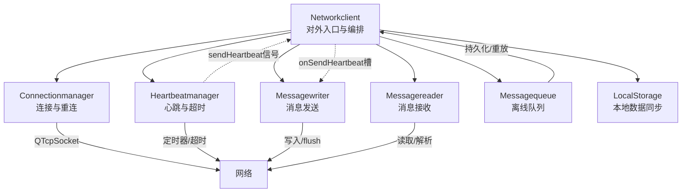
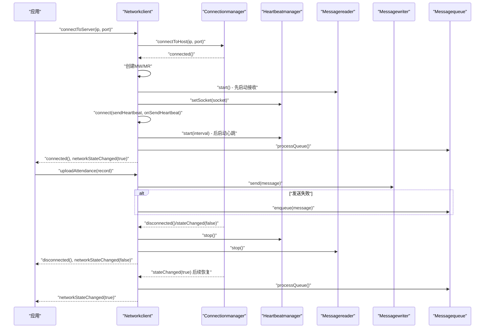
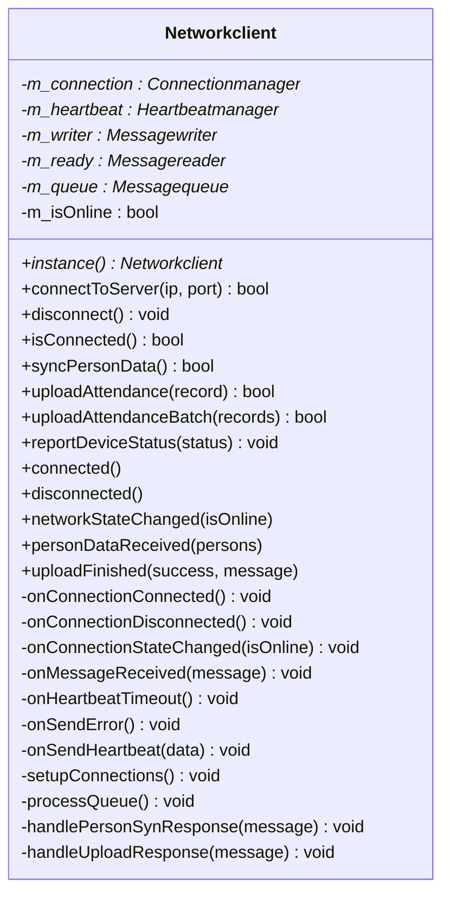
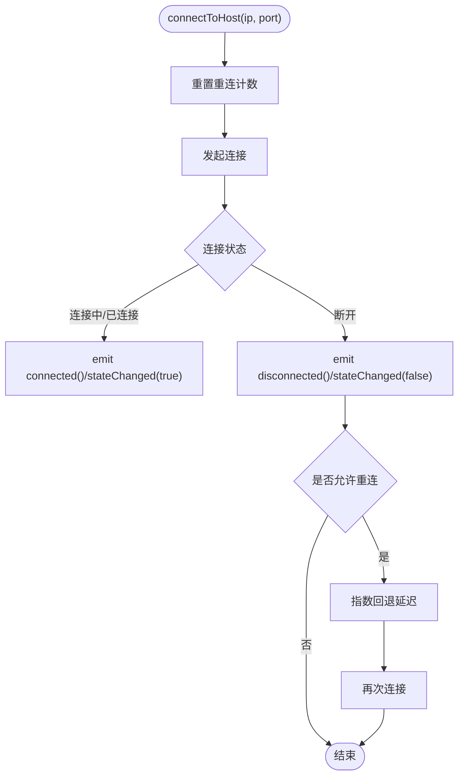
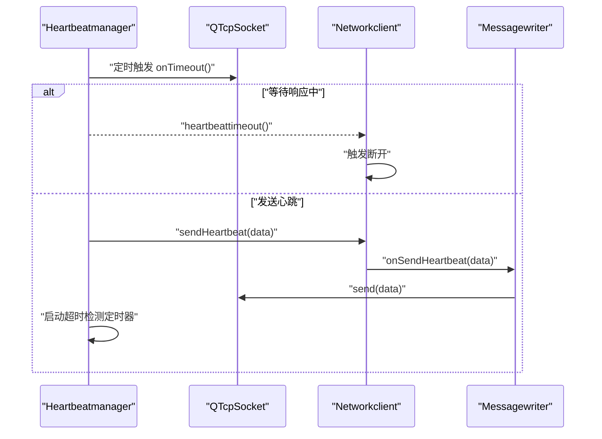
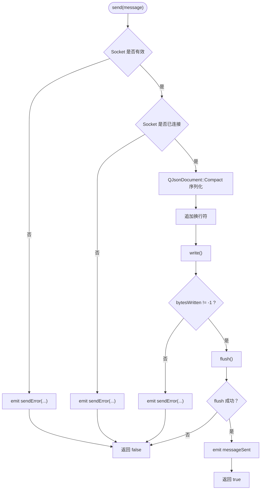
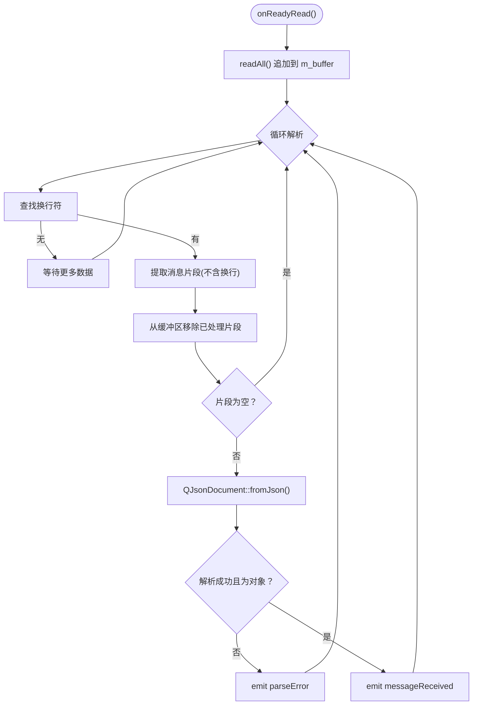
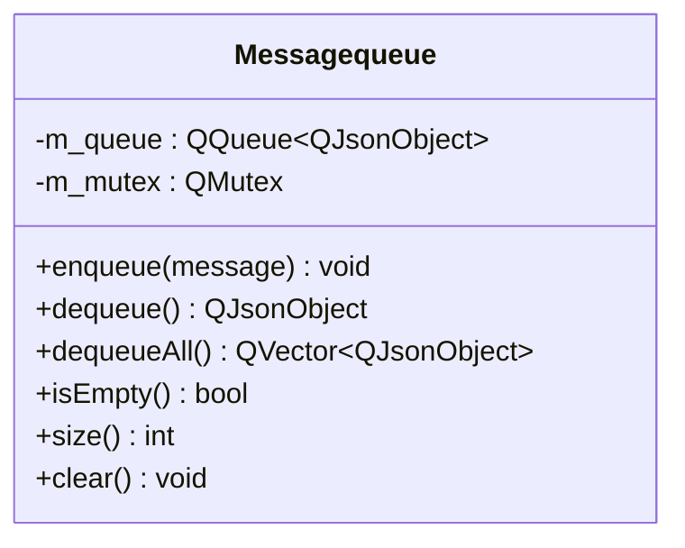
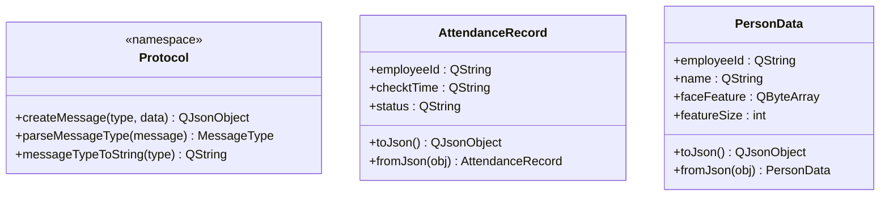
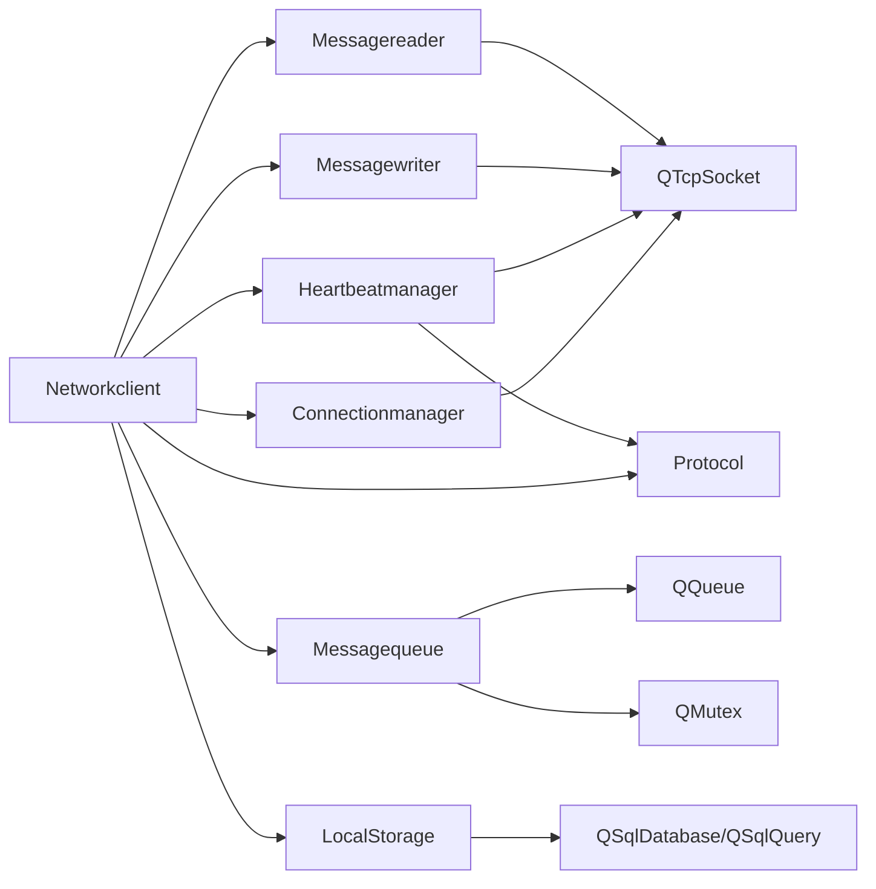

# 网络客户端核心

<cite>
**本文引用的文件**
- [networkclient.h](file://NetworkClient/networkclient.h)
- [networkclient.cpp](file://NetworkClient/networkclient.cpp)
- [connectionmanager.h](file://NetworkClient/connectionmanager.h)
- [connectionmanager.cpp](file://NetworkClient/connectionmanager.cpp)
- [heartbeatmanager.h](file://NetworkClient/heartbeatmanager.h)
- [heartbeatmanager.cpp](file://NetworkClient/heartbeatmanager.cpp)
- [messagewriter.h](file://NetworkClient/messagewriter.h)
- [messagewriter.cpp](file://NetworkClient/messagewriter.cpp)
- [messagereader.h](file://NetworkClient/messagereader.h)
- [messagereader.cpp](file://NetworkClient/messagereader.cpp)
- [messagequeue.h](file://NetworkClient/messagequeue.h)
- [messagequeue.cpp](file://NetworkClient/messagequeue.cpp)
- [protocol.h](file://NetworkClient/protocol.h)
- [protocol.cpp](file://NetworkClient/protocol.cpp)
- [localstorage.h](file://LocalStorage/localstorage.h)
- [localstorage.cpp](file://LocalStorage/localstorage.cpp)
</cite>

## 目录
1. [简介](#简介)
2. [项目结构](#项目结构)
3. [核心组件](#核心组件)
4. [架构总览](#架构总览)
5. [详细组件分析](#详细组件分析)
6. [依赖关系分析](#依赖关系分析)
7. [性能考虑](#性能考虑)
8. [故障排查指南](#故障排查指南)
9. [结论](#结论)
10. [附录](#附录)

## 简介
本文件面向网络客户端核心组件，系统性阐述 Networkclient 类的整体架构设计、单例模式实现、模块协调机制、业务接口设计、信号槽机制、事件处理流程与状态管理。重点覆盖连接状态管理、消息路由、错误传播与异常恢复，并提供客户端初始化、业务调用、状态监听与事件处理的完整流程参考。最后给出配置建议、性能监控与故障诊断策略。

## 项目结构
网络客户端位于 NetworkClient 目录，采用"职责分离 + 信号槽解耦"的模块化设计：
- Networkclient：对外唯一入口，聚合 Connectionmanager、Heartbeatmanager、Messagewriter、Messagereader、Messagequeue，并负责业务消息编排与状态广播。
- Connectionmanager：TCP 连接与重连控制。
- Heartbeatmanager：心跳发送与超时检测，通过信号槽机制分离心跳管理与消息发送职责。
- Messagewriter/Messagereader：消息序列化/反序列化与发送/接收。
- Messagequeue：消息持久化队列，保障离线场景下的可靠投递。
- Protocol：协议定义与序列化工具。
- LocalStorage：本地数据库访问与人员数据同步。

**图表来源**
- [networkclient.cpp:221-231](file://NetworkClient/networkclient.cpp#L221-L231)
- [connectionmanager.cpp:20-36](file://NetworkClient/connectionmanager.cpp#L20-L36)
- [heartbeatmanager.cpp:24-40](file://NetworkClient/heartbeatmanager.cpp#L24-L40)
- [messagewriter.cpp:13-76](file://NetworkClient/messagewriter.cpp#L13-L76)
- [messagereader.cpp:13-26](file://NetworkClient/messagereader.cpp#L13-L26)
- [messagequeue.cpp:3-6](file://NetworkClient/messagequeue.cpp#L3-L6)
- [localstorage.cpp:30-121](file://LocalStorage/localstorage.cpp#L30-L121)

**章节来源**
- [networkclient.h:17-73](file://NetworkClient/networkclient.h#L17-L73)
- [networkclient.cpp:221-231](file://NetworkClient/networkclient.cpp#L221-L231)

## 核心组件
- Networkclient
  - 单例：通过静态 instance() 获取全局实例，避免重复创建。
  - 连接管理：对外暴露 connectToServer/disconnect/isConnected；内部委托 Connectionmanager。
  - 业务接口：syncPersonData、uploadAttendance、uploadAttendanceBatch、reportDeviceStatus。
  - 信号：connected/disconnected/networkStateChanged；personDataReceived/uploadFinished。
  - 内部槽：onConnectionConnected/onConnectionDisconnected/onConnectionStateChanged、onMessageReceived/onHeartbeatTimeout/onSendError/onSendHeartbeat。
  - 状态：m_isOnline 维护在线状态；processQueue 批量重放队列；handlePersonSynResponse/handleUploadResponse 负责业务响应处理。
- Connectionmanager
  - 负责 TCP 连接、断开、状态变更与错误信号；内置指数回退重连计数。
- Heartbeatmanager
  - 心跳发送与超时检测；通过 sendHeartbeat 信号分离心跳管理与消息发送职责；支持 onHeartbeatResponse 处理心跳响应。
- Messagewriter/Messagereader
  - Writer：JSON 序列化、紧凑格式、换行分隔、flush 强制发送；支持原始字节发送；批量发送。
  - Reader：缓冲区拼接、按换行符切分、JSON 解析、错误信号。
- Messagequeue
  - 线程安全队列：入队/出队/清空；批量出队用于批量发送。
- Protocol
  - 消息类型枚举、结构体序列化/反序列化、消息封装/解析。
- LocalStorage
  - 数据库存取、人员同步（事务）、打卡记录增删改查。

**章节来源**
- [networkclient.h:21-73](file://NetworkClient/networkclient.h#L21-L73)
- [networkclient.cpp:221-312](file://NetworkClient/networkclient.cpp#L221-L312)
- [connectionmanager.h:8-42](file://NetworkClient/connectionmanager.h#L8-L42)
- [connectionmanager.cpp:3-110](file://NetworkClient/connectionmanager.cpp#L3-L110)
- [heartbeatmanager.h:10-38](file://NetworkClient/heartbeatmanager.h#L10-L38)
- [heartbeatmanager.cpp:4-114](file://NetworkClient/heartbeatmanager.cpp#L4-L114)
- [messagewriter.h:8-33](file://NetworkClient/messagewriter.h#L8-L33)
- [messagewriter.cpp:3-128](file://NetworkClient/messagewriter.cpp#L3-L128)
- [messagereader.h:8-35](file://NetworkClient/messagereader.h#L8-L35)
- [messagereader.cpp:3-108](file://NetworkClient/messagereader.cpp#L3-L108)
- [messagequeue.h:8-30](file://NetworkClient/messagequeue.h#L8-L30)
- [messagequeue.cpp:3-70](file://NetworkClient/messagequeue.cpp#L3-L70)
- [protocol.h:15-58](file://NetworkClient/protocol.h#L15-L58)
- [protocol.cpp:5-62](file://NetworkClient/protocol.cpp#L5-L62)
- [localstorage.h:15-46](file://LocalStorage/localstorage.h#L15-L46)
- [localstorage.cpp:7-346](file://LocalStorage/localstorage.cpp#L7-L346)

## 架构总览
Networkclient 作为门面，协调各子模块：
- 初始化阶段：构造函数创建 Connectionmanager、Heartbeatmanager、Messagequeue；setupConnections 建立信号槽。
- 连接阶段：Connectionmanager 触发 connected/disconnected/stateChanged；Networkclient 创建 Messagewriter/Messagereader 并启动 Heartbeatmanager；**重要变更**：先启动 Messagereader 接收，再启动 Heartbeatmanager，确保 reader 就绪后才能接收心跳响应；processQueue 重放队列。
- 业务阶段：业务接口将消息交由 Messagewriter 发送；若断网则入队；收到服务器响应时由 Messagereader 解析并转发给 Networkclient，再由其分派至具体处理函数。
- 断开阶段：清理 Writer/Reader；停止心跳与接收；维护 m_isOnline 并广播状态。

**更新** 连接序列改进确保了心跳响应的正确接收，通过信号槽分离机制实现了心跳管理与消息发送的职责分离。

**图表来源**
- [networkclient.cpp:108-181](file://NetworkClient/networkclient.cpp#L108-L181)
- [networkclient.cpp:233-239](file://NetworkClient/networkclient.cpp#L233-L239)
- [connectionmanager.cpp:55-77](file://NetworkClient/connectionmanager.cpp#L55-L77)
- [heartbeatmanager.cpp:24-40](file://NetworkClient/heartbeatmanager.cpp#L24-L40)
- [messagewriter.cpp:13-76](file://NetworkClient/messagewriter.cpp#L13-L76)
- [messagequeue.cpp:33-44](file://NetworkClient/messagequeue.cpp#L33-L44)

## 详细组件分析

### Networkclient 类
- 单例模式
  - 通过静态 instance() 返回唯一实例，避免重复创建与资源浪费。
- 信号槽机制
  - 与 Connectionmanager 建立连接/断开/状态变化信号槽。
  - 与 Messagereader 建立 messageReceived 信号槽；与 Messagewriter 建立 messageSent/sendError 信号槽。
  - **新增**：与 Heartbeatmanager 建立 sendHeartbeat 信号与 onSendHeartbeat 槽的连接，分离心跳管理与消息发送职责。
- 业务接口
  - 同步人员数据：构造请求消息，通过 Writer 发送；断网时记录日志但不阻塞。
  - 上传打卡记录：单条/批量；断网时入队；网络恢复后批量重放。
  - 上报设备状态：断网时入队，恢复后发送。
- 状态管理
  - m_isOnline 标记在线状态；onConnectionStateChanged 判断状态变化并触发 processQueue。
  - 心跳超时触发断开，促使 Connectionmanager 重连。
- 错误处理
  - Writer 发送失败时记录警告；Reader 解析失败时发出 parseError；Connectionmanager 将 Socket 错误映射为可读字符串。
- **连接序列优化**
  - onConnectionConnected 中先启动消息接收（m_ready->start()），再启动心跳（m_heartbeat->start(3000)），确保 reader 就绪后才能接收心跳响应。

**图表来源**
- [networkclient.h:17-73](file://NetworkClient/networkclient.h#L17-L73)
- [networkclient.cpp:221-312](file://NetworkClient/networkclient.cpp#L221-L312)

**章节来源**
- [networkclient.h:21-73](file://NetworkClient/networkclient.h#L21-L73)
- [networkclient.cpp:3-10](file://NetworkClient/networkclient.cpp#L3-L10)
- [networkclient.cpp:12-25](file://NetworkClient/networkclient.cpp#L12-L25)
- [networkclient.cpp:28-42](file://NetworkClient/networkclient.cpp#L28-L42)
- [networkclient.cpp:45-65](file://NetworkClient/networkclient.cpp#L45-L65)
- [networkclient.cpp:68-94](file://NetworkClient/networkclient.cpp#L68-L94)
- [networkclient.cpp:97-106](file://NetworkClient/networkclient.cpp#L97-L106)
- [networkclient.cpp:108-181](file://NetworkClient/networkclient.cpp#L108-L181)
- [networkclient.cpp:184-203](file://NetworkClient/networkclient.cpp#L184-L203)
- [networkclient.cpp:206-213](file://NetworkClient/networkclient.cpp#L206-L213)
- [networkclient.cpp:216-219](file://NetworkClient/networkclient.cpp#L216-L219)
- [networkclient.cpp:233-239](file://NetworkClient/networkclient.cpp#L233-L239)
- [networkclient.cpp:241-267](file://NetworkClient/networkclient.cpp#L241-L267)
- [networkclient.cpp:269-299](file://NetworkClient/networkclient.cpp#L269-L299)
- [networkclient.cpp:302-309](file://NetworkClient/networkclient.cpp#L302-L309)

### Connectionmanager 组件
- 职责：封装 QTcpSocket，提供连接/断开/状态查询；内置重连定时器，指数回退上限。
- 关键点：主动断开时标记计数以阻止重连；错误映射为用户可读字符串；状态变化触发上层。

**图表来源**
- [connectionmanager.cpp:20-36](file://NetworkClient/connectionmanager.cpp#L20-L36)
- [connectionmanager.cpp:55-77](file://NetworkClient/connectionmanager.cpp#L55-L77)
- [connectionmanager.cpp:105-109](file://NetworkClient/connectionmanager.cpp#L105-L109)

**章节来源**
- [connectionmanager.h:8-42](file://NetworkClient/connectionmanager.h#L8-L42)
- [connectionmanager.cpp:3-110](file://NetworkClient/connectionmanager.cpp#L3-L110)

### Heartbeatmanager 组件
- 职责：周期性发送心跳，等待响应；超时触发 heartbeattimeout 以驱动重连；**新增**：通过 sendHeartbeat 信号分离心跳管理与消息发送职责。
- 关键点：双定时器模型（发送定时器 + 超时检测定时器）；首次连接自动启动；断开停止；**新增**：onHeartbeatResponse 方法重置等待状态。

**图表来源**
- [heartbeatmanager.cpp:87-114](file://NetworkClient/heartbeatmanager.cpp#L87-L114)
- [heartbeatmanager.cpp:24-40](file://NetworkClient/heartbeatmanager.cpp#L24-L40)
- [networkclient.cpp:206-213](file://NetworkClient/networkclient.cpp#L206-L213)
- [networkclient.cpp:235-242](file://NetworkClient/networkclient.cpp#L235-L242)

**章节来源**
- [heartbeatmanager.h:10-38](file://NetworkClient/heartbeatmanager.h#L10-L38)
- [heartbeatmanager.cpp:4-114](file://NetworkClient/heartbeatmanager.cpp#L4-L114)

### Messagewriter 组件
- 职责：将 QJsonObject/QByteArray 序列化为字节流并通过 Socket 发送；支持批量发送；提供 messageSent/sendError 信号。
- 关键点：紧凑 JSON 格式减少带宽；统一追加换行符作为消息边界；flush 强制发送；错误通过 errorString 透传。

**图表来源**
- [messagewriter.cpp:13-76](file://NetworkClient/messagewriter.cpp#L13-L76)
- [messagewriter.cpp:78-112](file://NetworkClient/messagewriter.cpp#L78-L112)
- [messagewriter.cpp:115-128](file://NetworkClient/messagewriter.cpp#L115-L128)

**章节来源**
- [messagewriter.h:8-33](file://NetworkClient/messagewriter.h#L8-L33)
- [messagewriter.cpp:3-128](file://NetworkClient/messagewriter.cpp#L3-L128)

### Messagereader 组件
- 职责：在 readyRead 时读取数据到缓冲区，按换行符切分并解析 JSON；解析失败发出 parseError。
- 关键点：循环解析，处理粘包；缓冲区复用；仅当 doc 为对象时才认为解析成功。

**图表来源**
- [messagereader.cpp:35-54](file://NetworkClient/messagereader.cpp#L35-L54)
- [messagereader.cpp:56-107](file://NetworkClient/messagereader.cpp#L56-L107)

**章节来源**
- [messagereader.h:8-35](file://NetworkClient/messagereader.h#L8-L35)
- [messagereader.cpp:3-108](file://NetworkClient/messagereader.cpp#L3-L108)

### Messagequeue 组件
- 职责：线程安全的消息队列；支持入队/出队/批量出队/清空；提供 size/isEmpty 查询。
- 关键点：QMutexLocker 自动加锁；批量出队用于批量发送；断网期间缓存消息。

**图表来源**
- [messagequeue.h:8-30](file://NetworkClient/messagequeue.h#L8-L30)
- [messagequeue.cpp:3-6](file://NetworkClient/messagequeue.cpp#L3-L6)
- [messagequeue.cpp:8-44](file://NetworkClient/messagequeue.cpp#L8-L44)
- [messagequeue.cpp:52-56](file://NetworkClient/messagequeue.cpp#L52-L56)

**章节来源**
- [messagequeue.h:8-30](file://NetworkClient/messagequeue.h#L8-L30)
- [messagequeue.cpp:3-70](file://NetworkClient/messagequeue.cpp#L3-L70)

### Protocol 组件
- 职责：定义消息类型枚举、结构体（AttendanceRecord/PersonData）序列化/反序列化、消息封装/解析。
- 关键点：统一的 createMessage/parseMessageType/messageTypeToString；人员特征以 Base64 文本传输。

**图表来源**
- [protocol.h:15-58](file://NetworkClient/protocol.h#L15-L58)
- [protocol.cpp:5-40](file://NetworkClient/protocol.cpp#L5-L40)
- [protocol.cpp:42-61](file://NetworkClient/protocol.cpp#L42-L61)

**章节来源**
- [protocol.h:15-58](file://NetworkClient/protocol.h#L15-L58)
- [protocol.cpp:5-62](file://NetworkClient/protocol.cpp#L5-L62)

### LocalStorage 组件
- 职责：单例数据库访问；人员同步（事务）；打卡记录增删改查；提供 personsSyncCompleted/personsSyncFailed 信号。
- 关键点：数据库初始化（表与索引）、事务封装、线程安全（QMutexLocker）。

**章节来源**
- [localstorage.h:15-46](file://LocalStorage/localstorage.h#L15-L46)
- [localstorage.cpp:7-346](file://LocalStorage/localstorage.cpp#L7-L346)

## 依赖关系分析
- Networkclient 依赖 Connectionmanager、Heartbeatmanager、Messagewriter、Messagereader、Messagequeue、Protocol、LocalStorage。
- Connectionmanager 依赖 QTcpSocket 与 QTimer。
- Heartbeatmanager 依赖 QTcpSocket 与两个 QTimer；**新增**：依赖 Protocol 进行心跳消息构建。
- Messagewriter 依赖 QTcpSocket。
- Messagereader 依赖 QTcpSocket 与 QByteArray 缓冲。
- Messagequeue 依赖 QQueue 与 QMutex。
- Protocol 为纯工具命名空间，无外部依赖。
- LocalStorage 依赖 Qt SQL 模块与 SQLite。

**图表来源**
- [networkclient.cpp:221-231](file://NetworkClient/networkclient.cpp#L221-L231)
- [connectionmanager.cpp:5-14](file://NetworkClient/connectionmanager.cpp#L5-L14)
- [heartbeatmanager.cpp:33-39](file://NetworkClient/heartbeatmanager.cpp#L33-L39)
- [messagewriter.cpp:3-11](file://NetworkClient/messagewriter.cpp#L3-L11)
- [messagereader.cpp:3-11](file://NetworkClient/messagereader.cpp#L3-L11)
- [messagequeue.cpp:28-29](file://NetworkClient/messagequeue.cpp#L28-L29)
- [localstorage.cpp:46-121](file://LocalStorage/localstorage.cpp#L46-L121)

**章节来源**
- [networkclient.cpp:221-231](file://NetworkClient/networkclient.cpp#L221-L231)
- [connectionmanager.cpp:5-14](file://NetworkClient/connectionmanager.cpp#L5-L14)
- [heartbeatmanager.cpp:33-39](file://NetworkClient/heartbeatmanager.cpp#L33-L39)
- [messagewriter.cpp:3-11](file://NetworkClient/messagewriter.cpp#L3-L11)
- [messagereader.cpp:3-11](file://NetworkClient/messagereader.cpp#L3-L11)
- [messagequeue.cpp:28-29](file://NetworkClient/messagequeue.cpp#L28-L29)
- [localstorage.cpp:46-121](file://LocalStorage/localstorage.cpp#L46-L121)

## 性能考虑
- 序列化与传输
  - 使用紧凑 JSON（Compact）减少带宽占用；批量发送降低握手开销。
- 缓冲与粘包
  - Reader 使用缓冲区与换行符分隔，避免频繁分配；循环解析提升吞吐。
- 心跳与重连
  - 心跳间隔与超时检测配合，快速发现链路异常；Connectionmanager 指数回退避免风暴；**新增**：通过信号槽分离心跳管理与消息发送，减少耦合度。
- 线程安全
  - Messagequeue 使用互斥锁保护；LocalStorage 使用互斥锁保证数据库并发安全。
- I/O 强制刷新
  - Writer flush() 确保及时送达，减少等待延迟。
- **连接序列优化**
  - 先启动消息接收再启动心跳，确保 reader 就绪后才能接收心跳响应，避免心跳丢失。

## 故障排查指南
- 连接失败
  - 查看 Connectionmanager 的 errorOccurred 信号，区分"被拒绝/主机未找到/超时/网络错误"等场景。
  - 检查 IP/端口与防火墙；确认服务端可达。
- 心跳超时
  - 检查 Heartbeatmanager 是否启动；确认 Writer 正确发送心跳；查看 Networkclient 的 onHeartbeatTimeout 流程；**新增**：检查 sendHeartbeat 信号与 onSendHeartbeat 槽的连接是否正常。
- 发送失败
  - 检查 Messagewriter 的 sendError 信号；确认 Socket 状态与连接有效性；核对消息格式。
- 接收解析失败
  - 查看 Messagereader 的 parseError 信号；确认消息边界与 JSON 结构；检查缓冲区拼接逻辑。
- 断网重连
  - 确认 Connectionmanager 的重连计数与指数回退；观察 stateChanged 信号；验证 processQueue 是否在恢复后执行。
- 人员数据不同步
  - 检查 LocalStorage 的 personsSyncCompleted/personsSyncFailed 信号；确认事务提交与回滚路径；核对数据库初始化与索引。
- **连接序列问题**
  - 检查 onConnectionConnected 中的启动顺序：先启动 Messagereader，再启动 Heartbeatmanager；确认 reader 已就绪后才能接收心跳响应。

**章节来源**
- [connectionmanager.cpp:79-103](file://NetworkClient/connectionmanager.cpp#L79-L103)
- [heartbeatmanager.cpp:14-21](file://NetworkClient/heartbeatmanager.cpp#L14-L21)
- [messagewriter.cpp:16-26](file://NetworkClient/messagewriter.cpp#L16-L26)
- [messagewriter.cpp:61-64](file://NetworkClient/messagewriter.cpp#L61-L64)
- [messagereader.cpp:83-97](file://NetworkClient/messagereader.cpp#L83-L97)
- [networkclient.cpp:206-213](file://NetworkClient/networkclient.cpp#L206-L213)
- [localstorage.cpp:134-181](file://LocalStorage/localstorage.cpp#L134-L181)

## 结论
Networkclient 通过清晰的模块划分与信号槽解耦，实现了稳定可靠的网络通信与业务编排。其单例入口、队列容错、心跳保活与本地同步机制共同构成了高可用的客户端框架。**最新改进**包括连接序列优化（先启动消息接收再启动心跳）和心跳发送处理机制（通过信号槽分离心跳管理与消息发送职责），进一步提升了系统的可靠性与可维护性。建议在生产环境中结合日志与监控完善可观测性，并持续优化批量发送与数据库事务性能。

## 附录
- 客户端初始化与业务调用流程参考
  - 初始化：通过 Networkclient::instance() 获取实例；调用 connectToServer(ip, port) 建立连接。
  - 同步人员数据：调用 syncPersonData()；等待 personDataReceived 信号。
  - 上传打卡记录：调用 uploadAttendance()/uploadAttendanceBatch()；等待 uploadFinished 信号。
  - 上报设备状态：调用 reportDeviceStatus(status)。
  - 状态监听：订阅 connected/disconnected/networkStateChanged 信号。
  - 事件处理：在对应槽函数中处理业务逻辑（如刷新本地特征库、上报结果）。
- 配置建议
  - 心跳间隔与超时：根据网络质量调整 Heartbeatmanager 的 start(interval) 与超时检测。
  - 重连策略：合理设置 Connectionmanager 的最大重连次数与回退上限。
  - 队列容量：结合业务峰值评估 Messagequeue 的容量与持久化策略。
  - **新增**：心跳发送机制配置：确保 sendHeartbeat 信号与 onSendHeartbeat 槽的正确连接。
- 性能监控
  - 记录发送/接收速率、队列长度、错误率与重连次数；对关键路径（序列化、flush、解析）进行采样。
  - **新增**：监控心跳发送成功率、连接序列启动时间、信号槽连接状态。
- 故障诊断
  - 优先定位连接与心跳问题；其次检查消息序列化与解析；最后核查本地数据库事务与索引。
  - **新增**：检查连接序列是否正确执行（先启动接收，后启动心跳）；验证信号槽连接状态。