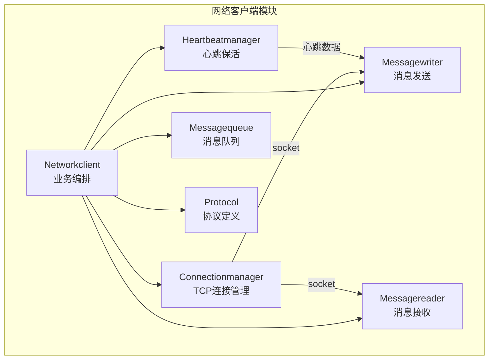
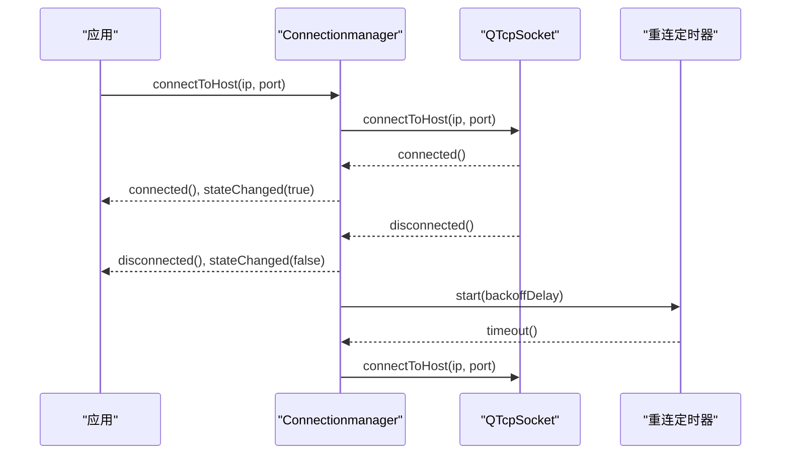
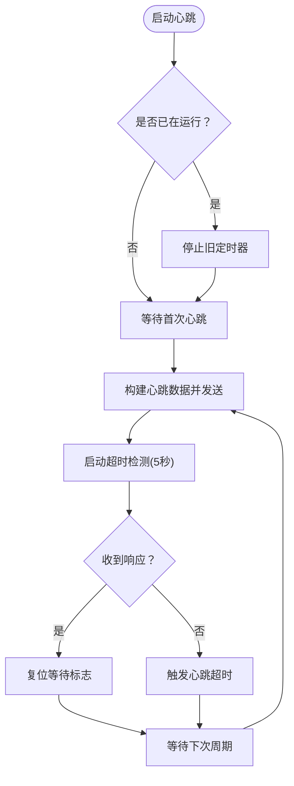
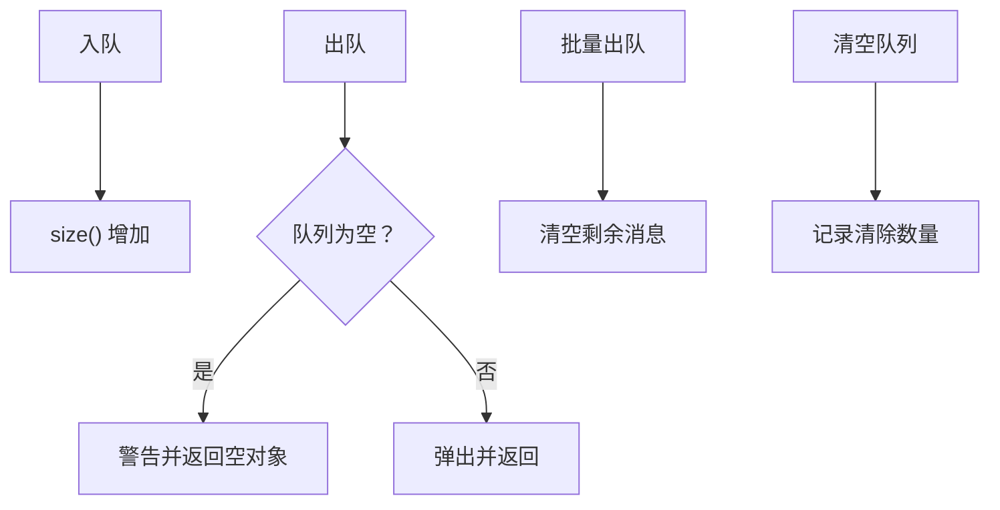
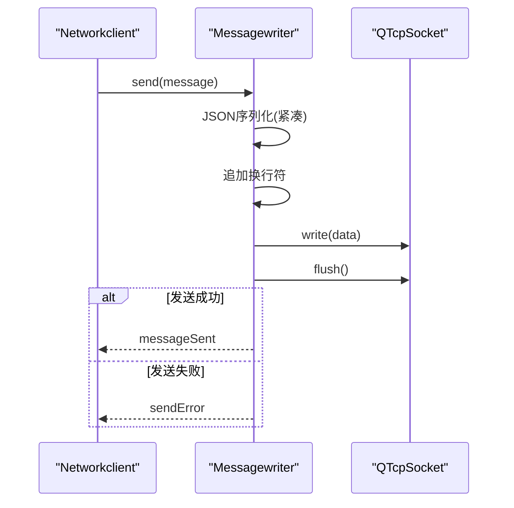
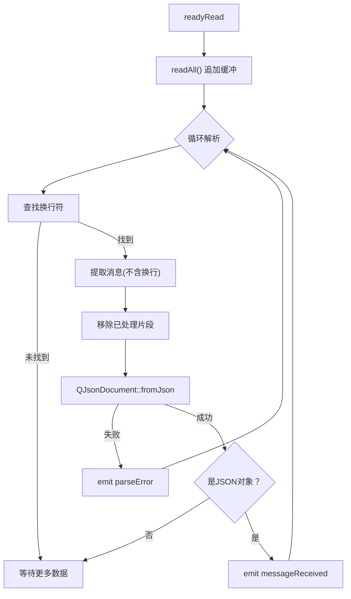
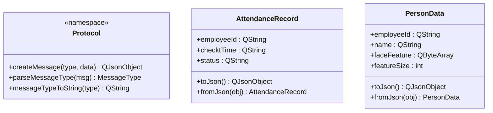
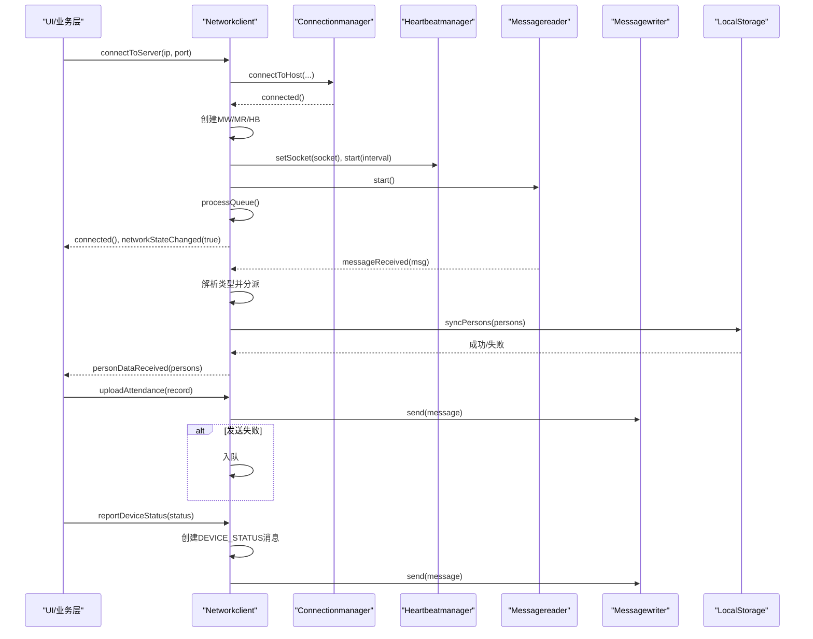
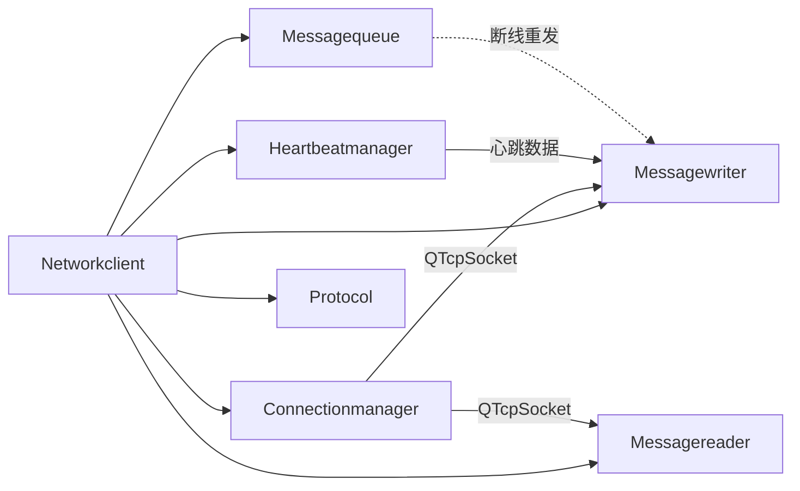

# 网络客户端模块

<cite>
**本文引用的文件**
- [networkclient.h](file://NetworkClient/networkclient.h)
- [networkclient.cpp](file://NetworkClient/networkclient.cpp)
- [connectionmanager.h](file://NetworkClient/connectionmanager.h)
- [connectionmanager.cpp](file://NetworkClient/connectionmanager.cpp)
- [heartbeatmanager.h](file://NetworkClient/heartbeatmanager.h)
- [heartbeatmanager.cpp](file://NetworkClient/heartbeatmanager.cpp)
- [messagequeue.h](file://NetworkClient/messagequeue.h)
- [messagequeue.cpp](file://NetworkClient/messagequeue.cpp)
- [messagewriter.h](file://NetworkClient/messagewriter.h)
- [messagewriter.cpp](file://NetworkClient/messagewriter.cpp)
- [messagereader.h](file://NetworkClient/messagereader.h)
- [messagereader.cpp](file://NetworkClient/messagereader.cpp)
- [protocol.h](file://NetworkClient/protocol.h)
- [protocol.cpp](file://NetworkClient/protocol.cpp)
- [localstorage.h](file://LocalStorage/localstorage.h)
- [localstorage.cpp](file://LocalStorage/localstorage.cpp)
</cite>

## 更新摘要
**变更内容**
- 增强网络协议处理，新增心跳消息和设备状态报告支持
- HeartbeatManager现在使用标准化的Protocol::HEARTBEAT消息类型
- Networkclient新增reportDeviceStatus()方法用于设备状态上报
- Protocol命名空间扩展，支持DEVICE_STATUS消息类型
- 心跳超时处理机制得到完善，提供更可靠的连接保活

## 目录
1. [简介](#简介)
2. [项目结构](#项目结构)
3. [核心组件](#核心组件)
4. [架构总览](#架构总览)
5. [详细组件分析](#详细组件分析)
6. [依赖关系分析](#依赖关系分析)
7. [性能考量](#性能考量)
8. [故障排查指南](#故障排查指南)
9. [结论](#结论)
10. [附录](#附录)

## 简介
本文件为网络客户端模块的全面技术文档，覆盖TCP连接管理、心跳保活、消息队列与重传、通信协议设计等核心能力。重点解释以下组件职责与交互：
- ConnectionManager：负责TCP连接建立、断开与自动重连
- HeartbeatManager：心跳保活与超时检测，支持标准化心跳消息
- MessageQueue：消息缓冲与断线重发
- MessageWriter/MessageReader：消息序列化、发送与解析
- Protocol：消息类型与数据结构定义，包含心跳和设备状态支持
- Networkclient：业务编排与事件处理中枢，支持设备状态上报

文档还提供典型流程图、类图与序列图，帮助读者快速理解系统工作原理与实现细节。

## 项目结构
网络客户端模块位于 NetworkClient 目录，采用"职责分离 + 事件驱动"的设计，通过信号槽连接各子模块，形成松耦合的通信栈。



**图表来源**
- [networkclient.cpp:221-231](file://NetworkClient/networkclient.cpp#L221-L231)
- [connectionmanager.cpp:3](file://NetworkClient/connectionmanager.cpp#L3-L18)
- [heartbeatmanager.cpp:4](file://NetworkClient/heartbeatmanager.cpp#L4-L22)
- [messagequeue.cpp:3](file://NetworkClient/messagequeue.cpp#L3-L6)
- [messagewriter.cpp:3](file://NetworkClient/messagewriter.cpp#L3-L11)
- [messagereader.cpp:3](file://NetworkClient/messagereader.cpp#L3-L11)
- [protocol.h:15](file://NetworkClient/protocol.h#L15-L58)

**章节来源**
- [networkclient.h:17-73](file://NetworkClient/networkclient.h#L17-L73)
- [networkclient.cpp:221-231](file://NetworkClient/networkclient.cpp#L221-L231)

## 核心组件
- Networkclient：对外唯一入口，封装连接、业务接口、事件转发与队列处理，新增设备状态上报功能
- Connectionmanager：封装QTcpSocket，提供连接、断开、错误与状态信号，内置指数回退重连
- Heartbeatmanager：周期性发送心跳，检测超时并触发重连，使用标准化心跳消息类型
- MessageQueue：线程安全队列，承载断线期间待发送消息
- MessageWriter：JSON序列化、紧凑格式、换行分隔、批量发送
- MessageReader：基于换行符的粘包处理、逐条解析、错误上报
- Protocol：消息类型枚举、数据结构、消息打包/解析工具，支持心跳和设备状态消息

**章节来源**
- [networkclient.h:21-64](file://NetworkClient/networkclient.h#L21-L64)
- [connectionmanager.h:12-27](file://NetworkClient/connectionmanager.h#L12-L27)
- [heartbeatmanager.h:14-27](file://NetworkClient/heartbeatmanager.h#L14-L27)
- [messagequeue.h:8-29](file://NetworkClient/messagequeue.h#L8-L29)
- [messagewriter.h:8-33](file://NetworkClient/messagewriter.h#L8-L33)
- [messagereader.h:8-35](file://NetworkClient/messagereader.h#L8-L35)
- [protocol.h:15-58](file://NetworkClient/protocol.h#L15-L58)

## 架构总览
整体采用"主控-子模块"架构，Networkclient作为中枢协调各子模块，通过信号槽解耦。Writer/Reader基于Socket双向数据通道，Heartbeat保障链路活性，MessageQueue提供可靠性保障。新增的设备状态上报功能通过标准化协议实现。

```mermaid
classDiagram
class Networkclient {
+connectToServer(ip, port) bool
+disconnect() void
+isConnected() bool
+syncPersonData() bool
+uploadAttendance(record) bool
+uploadAttendanceBatch(records) bool
+reportDeviceStatus(status) void
-processQueue() void
-handlePersonSynResponse(msg) void
-handleUploadResponse(msg) void
}
class Connectionmanager {
+connectToHost(ip, port) bool
+disconnect() void
+isConnect() bool
+socket() QTcpSocket*
-onSocketConnected() void
-onSocketDisconnected() void
-onSocketError(error) void
-onReconnectTimeout() void
}
class Heartbeatmanager {
+setSocket(socket) void
+start(intervalMs) void
+stop() void
+isRunning() bool
+buildHeartbeatData() QByteArray
-onTimeout() void
}
class Messagequeue {
+enqueue(msg) void
+dequeue() QJsonObject
+dequeueAll() QVector<QJsonObject>
+isEmpty() bool
+size() int
+clear() void
}
class Messagewriter {
+send(json) bool
+send(data) bool
+sendBatch(messages) int
}
class Messagereader {
+start() void
+stop() void
-onReadyRead() void
-tryParseMessage(out) bool
}
class Protocol {
<<namespace>>
+createMessage(type, data) QJsonObject
+parseMessageType(msg) MessageType
+messageTypeToString(type) QString
}
Networkclient --> Connectionmanager : "管理连接"
Networkclient --> Heartbeatmanager : "心跳保活"
Networkclient --> Messagequeue : "消息缓冲"
Networkclient --> Messagewriter : "发送消息"
Networkclient --> Messagereader : "接收消息"
Networkclient --> Protocol : "协议编解码"
Connectionmanager -->|"socket"| Messagewriter
Connectionmanager -->|"socket"| Messagereader
Heartbeatmanager -->|"心跳数据"| Messagewriter
```

**图表来源**
- [networkclient.h:17-73](file://NetworkClient/networkclient.h#L17-L73)
- [connectionmanager.h:8-42](file://NetworkClient/connectionmanager.h#L8-L42)
- [heartbeatmanager.h:10-38](file://NetworkClient/heartbeatmanager.h#L10-L38)
- [messagequeue.h:8-30](file://NetworkClient/messagequeue.h#L8-L30)
- [messagewriter.h:8-33](file://NetworkClient/messagewriter.h#L8-L33)
- [messagereader.h:8-35](file://NetworkClient/messagereader.h#L8-L35)
- [protocol.h:15-58](file://NetworkClient/protocol.h#L15-L58)

## 详细组件分析

### ConnectionManager：TCP连接管理与自动重连
- 职责
  - 维护QTcpSocket生命周期
  - 提供连接/断开/状态查询
  - 捕获Socket错误并上报
  - 指数回退重连（上限5次，最大延迟30秒）
- 关键行为
  - 连接成功：复位重连计数，发出connected/stateChanged(true)
  - 断开：发出disconnected/stateChanged(false)，按指数回退启动重连
  - 错误：映射常见错误类型并emit errorOccurred
- 并发与健壮性
  - 使用单次触发定时器避免重复任务
  - 重连次数与主动断开区分，避免无限重连



**图表来源**
- [connectionmanager.cpp:20-36](file://NetworkClient/connectionmanager.cpp#L20-L36)
- [connectionmanager.cpp:65-77](file://NetworkClient/connectionmanager.cpp#L65-L77)
- [connectionmanager.cpp:105-109](file://NetworkClient/connectionmanager.cpp#L105-L109)

**章节来源**
- [connectionmanager.h:12-27](file://NetworkClient/connectionmanager.h#L12-L27)
- [connectionmanager.cpp:3-18](file://NetworkClient/connectionmanager.cpp#L3-L18)
- [connectionmanager.cpp:20-36](file://NetworkClient/connectionmanager.cpp#L20-L36)
- [connectionmanager.cpp:65-77](file://NetworkClient/connectionmanager.cpp#L65-L77)
- [connectionmanager.cpp:105-109](file://NetworkClient/connectionmanager.cpp#L105-L109)

### HeartbeatManager：心跳保活与超时检测
- 职责
  - 周期发送心跳消息，检测超时并触发重连
  - 使用标准化Protocol::HEARTBEAT消息类型
  - 通过信号向外暴露心跳数据与超时事件
- 关键行为
  - start(intervalMs)：启动定时器，立即发送首次心跳
  - onTimeout()：若上次心跳未应答则判定超时；否则发送心跳并启动5秒超时检测
  - stop()：停止两个定时器并复位等待标志
  - buildHeartbeatData()：使用Protocol::createMessage创建标准化心跳消息
- 与Socket联动
  - Socket连接时自动启动，断开时停止



**图表来源**
- [heartbeatmanager.cpp:42-67](file://NetworkClient/heartbeatmanager.cpp#L42-L67)
- [heartbeatmanager.cpp:87-113](file://NetworkClient/heartbeatmanager.cpp#L87-L113)

**章节来源**
- [heartbeatmanager.h:14-27](file://NetworkClient/heartbeatmanager.h#L14-L27)
- [heartbeatmanager.cpp:4-22](file://NetworkClient/heartbeatmanager.cpp#L4-L22)
- [heartbeatmanager.cpp:42-67](file://NetworkClient/heartbeatmanager.cpp#L42-L67)
- [heartbeatmanager.cpp:87-113](file://NetworkClient/heartbeatmanager.cpp#L87-L113)

### MessageQueue：消息缓冲与断线重发
- 职责
  - 以线程安全的方式缓存待发送消息
  - 支持批量出队与清空
- 关键行为
  - 入队/出队均使用QMutexLocker保证原子性
  - 提供isEmpty/size/clear等查询与管理接口
- 与业务集成
  - 发送失败或断网时入队
  - 连接恢复后批量出队并重发



**图表来源**
- [messagequeue.cpp:8-17](file://NetworkClient/messagequeue.cpp#L8-L17)
- [messagequeue.cpp:19-31](file://NetworkClient/messagequeue.cpp#L19-L31)
- [messagequeue.cpp:33-44](file://NetworkClient/messagequeue.cpp#L33-L44)
- [messagequeue.cpp:52-56](file://NetworkClient/messagequeue.cpp#L52-L56)
- [messagequeue.cpp:58-66](file://NetworkClient/messagequeue.cpp#L58-L66)

**章节来源**
- [messagequeue.h:8-29](file://NetworkClient/messagequeue.h#L8-L29)
- [messagequeue.cpp:3-6](file://NetworkClient/messagequeue.cpp#L3-L6)
- [messagequeue.cpp:8-17](file://NetworkClient/messagequeue.cpp#L8-L17)
- [messagequeue.cpp:19-31](file://NetworkClient/messagequeue.cpp#L19-L31)
- [messagequeue.cpp:33-44](file://NetworkClient/messagequeue.cpp#L33-L44)
- [messagequeue.cpp:52-56](file://NetworkClient/messagequeue.cpp#L52-L56)
- [messagequeue.cpp:58-66](file://NetworkClient/messagequeue.cpp#L58-L66)

### MessageWriter：消息序列化与发送
- 序列化策略
  - JSON紧凑格式（Compact），去除空白字符，减少带宽
  - 每条消息以换行符结尾，便于接收方按行分割
- 发送流程
  - 参数校验（socket非空、已连接）
  - 序列化 + 换行
  - write + flush
  - 成功/失败分别emit对应信号
- 批量发送
  - 逐条send，遇错即停，返回成功条数



**图表来源**
- [messagewriter.cpp:13-76](file://NetworkClient/messagewriter.cpp#L13-L76)
- [messagewriter.cpp:115-128](file://NetworkClient/messagewriter.cpp#L115-L128)

**章节来源**
- [messagewriter.h:12-30](file://NetworkClient/messagewriter.h#L12-L30)
- [messagewriter.cpp:3-11](file://NetworkClient/messagewriter.cpp#L3-L11)
- [messagewriter.cpp:13-76](file://NetworkClient/messagewriter.cpp#L13-L76)
- [messagewriter.cpp:115-128](file://NetworkClient/messagewriter.cpp#L115-L128)

### MessageReader：接收解析与粘包处理
- 接收流程
  - 连接readyRead信号，readAll追加至缓冲区
  - 循环尝试解析，直到缓冲区不足
- 解析策略
  - 以换行符为分隔，逐条切分
  - QJsonDocument::fromJson解析，错误emit parseError
  - 仅当结果为对象时才认为有效消息
- 并发与健壮性
  - 使用QByteArray缓冲，避免跨多次readyRead的数据撕裂
  - 空消息递归尝试解析下一条



**图表来源**
- [messagereader.cpp:35-54](file://NetworkClient/messagereader.cpp#L35-L54)
- [messagereader.cpp:56-107](file://NetworkClient/messagereader.cpp#L56-L107)

**章节来源**
- [messagereader.h:12-25](file://NetworkClient/messagereader.h#L12-L25)
- [messagereader.cpp:13-33](file://NetworkClient/messagereader.cpp#L13-L33)
- [messagereader.cpp:35-54](file://NetworkClient/messagereader.cpp#L35-L54)
- [messagereader.cpp:56-107](file://NetworkClient/messagereader.cpp#L56-L107)

### Protocol：消息格式与数据模型
- 消息类型
  - HEARTBEAT：心跳包 - 保持连接活跃
  - SYNC_PERSON_REQUEST：请求同步人员数据
  - SYNC_PERSON_RESPONSE：人员数据同步响应
  - UPLOAD_ATTENDANCE：上传打卡记录
  - UPLOAD_RESPONSE：上传响应
  - DEVICE_STATUS：设备状态上报
- 数据结构
  - AttendanceRecord：员工ID、签到时间、状态
  - PersonData：员工ID、姓名、人脸特征（Base64）、特征长度
- 编解码
  - createMessage：统一包装type与data字段
  - messageTypeToString：类型转字符串，便于日志
  - 结构体toJson/fromJson：JSON <-> C++对象



**图表来源**
- [protocol.h:15-58](file://NetworkClient/protocol.h#L15-L58)
- [protocol.cpp:5-21](file://NetworkClient/protocol.cpp#L5-L21)
- [protocol.cpp:23-40](file://NetworkClient/protocol.cpp#L23-L40)
- [protocol.cpp:42-61](file://NetworkClient/protocol.cpp#L42-L61)

**章节来源**
- [protocol.h:17-26](file://NetworkClient/protocol.h#L17-L26)
- [protocol.h:29-49](file://NetworkClient/protocol.h#L29-L49)
- [protocol.cpp:5-21](file://NetworkClient/protocol.cpp#L5-L21)
- [protocol.cpp:23-40](file://NetworkClient/protocol.cpp#L23-L40)
- [protocol.cpp:42-61](file://NetworkClient/protocol.cpp#L42-L61)

### Networkclient：业务编排与事件处理
- 连接管理
  - connectToServer/disconnect/isConnected委托Connectionmanager
- 业务接口
  - 同步人员数据、上传打卡记录（单条/批量）、上报设备状态
  - 发送失败或断网时入队，连接恢复后批量重发
- 新增功能：设备状态报告
  - reportDeviceStatus()方法支持设备状态上报
  - 使用Protocol::DEVICE_STATUS消息类型
  - 支持断线重发机制
- 事件处理
  - 连接成功：创建Writer/Reader，启动心跳，启动接收，处理队列，发射状态信号
  - 断开：停止心跳与接收，释放Writer/Reader，发射状态信号
  - 心跳超时：断开连接，触发重连
  - 消息接收：按类型分派，解析人员同步响应与上传响应，处理心跳消息
- 与本地存储集成
  - 人员同步成功后刷新人脸特征库



**图表来源**
- [networkclient.cpp:108-138](file://NetworkClient/networkclient.cpp#L108-L138)
- [networkclient.cpp:141-161](file://NetworkClient/networkclient.cpp#L141-L161)
- [networkclient.cpp:184-203](file://NetworkClient/networkclient.cpp#L184-L203)
- [networkclient.cpp:269-299](file://NetworkClient/networkclient.cpp#L269-L299)

**章节来源**
- [networkclient.h:21-64](file://NetworkClient/networkclient.h#L21-L64)
- [networkclient.cpp:12-25](file://NetworkClient/networkclient.cpp#L12-L25)
- [networkclient.cpp:28-42](file://NetworkClient/networkclient.cpp#L28-L42)
- [networkclient.cpp:45-65](file://NetworkClient/networkclient.cpp#L45-L65)
- [networkclient.cpp:68-94](file://NetworkClient/networkclient.cpp#L68-L94)
- [networkclient.cpp:96-106](file://NetworkClient/networkclient.cpp#L96-L106)
- [networkclient.cpp:108-138](file://NetworkClient/networkclient.cpp#L108-L138)
- [networkclient.cpp:141-161](file://NetworkClient/networkclient.cpp#L141-L161)
- [networkclient.cpp:184-203](file://NetworkClient/networkclient.cpp#L184-L203)
- [networkclient.cpp:206-213](file://NetworkClient/networkclient.cpp#L206-L213)
- [networkclient.cpp:216-219](file://NetworkClient/networkclient.cpp#L216-L219)
- [networkclient.cpp:241-267](file://NetworkClient/networkclient.cpp#L241-L267)
- [networkclient.cpp:269-299](file://NetworkClient/networkclient.cpp#L269-L299)
- [networkclient.cpp:302-309](file://NetworkClient/networkclient.cpp#L302-L309)

## 依赖关系分析
- 组件耦合
  - Networkclient对各子模块存在强依赖，但通过信号槽降低耦合度
  - Writer/Reader依赖Socket，Heartbeat依赖Writer信号与Socket状态
  - MessageQueue独立于网络栈，仅依赖QMutex
- 外部依赖
  - QTcpSocket、QTimer、QJsonDocument、QSqlDatabase（LocalStorage）
- 潜在风险
  - 心跳超时直接断开连接，需确保上层能正确处理重连
  - 批量发送失败时的中断策略需与业务确认
  - 设备状态上报的业务逻辑需要正确实现



**图表来源**
- [networkclient.cpp:221-231](file://NetworkClient/networkclient.cpp#L221-L231)
- [connectionmanager.cpp:5-14](file://NetworkClient/connectionmanager.cpp#L5-L14)
- [heartbeatmanager.cpp:24-40](file://NetworkClient/heartbeatmanager.cpp#L24-L40)
- [messagewriter.cpp:3-11](file://NetworkClient/messagewriter.cpp#L3-L11)
- [messagereader.cpp:3-11](file://NetworkClient/messagereader.cpp#L3-L11)

**章节来源**
- [networkclient.h:8-15](file://NetworkClient/networkclient.h#L8-L15)
- [connectionmanager.h:4-6](file://NetworkClient/connectionmanager.h#L4-L6)
- [heartbeatmanager.h:4-8](file://NetworkClient/heartbeatmanager.h#L4-L8)
- [messagewriter.h:4-6](file://NetworkClient/messagewriter.h#L4-L6)
- [messagereader.h:4-6](file://NetworkClient/messagereader.h#L4-L6)

## 性能考量
- 序列化与传输
  - JSON紧凑格式减少带宽占用
  - 换行符分隔简化解析，避免额外头部
- 批量发送
  - 连接恢复后批量出队，减少握手次数
- 心跳策略
  - 固定周期发送，超时检测避免资源浪费
  - 标准化心跳消息类型提高兼容性
- 线程安全
  - 队列使用互斥锁，避免竞争条件
- I/O优化
  - flush确保及时发送，减少系统缓冲等待

## 故障排查指南
- 连接失败
  - 检查错误信号与错误字符串，确认IP/端口、防火墙、服务端状态
  - 观察重连定时器是否按指数回退启动
- 心跳超时
  - 确认发送路径是否正确，检查sendHeartbeat信号是否被消费
  - 查看超时检测定时器是否被意外停止
  - 验证心跳消息格式是否符合Protocol::HEARTBEAT标准
- 发送失败
  - 检查socket状态与errorString，确认连接状态
  - 确认Writer/Reader是否已创建并绑定正确socket
- 接收解析失败
  - 检查缓冲区数据是否完整，确认每条消息以换行符结尾
  - 核对JSON格式与字段名一致性
  - 验证消息类型解析是否正确
- 队列堆积
  - 检查Writer是否持续失败，确认网络恢复后processQueue是否执行
  - 监控队列size与dequeueAll批次大小
- 设备状态上报问题
  - 确认reportDeviceStatus()方法调用是否正确
  - 验证DEVICE_STATUS消息格式是否符合协议要求

**章节来源**
- [connectionmanager.cpp:79-103](file://NetworkClient/connectionmanager.cpp#L79-L103)
- [heartbeatmanager.cpp:14-21](file://NetworkClient/heartbeatmanager.cpp#L14-L21)
- [heartbeatmanager.cpp:87-113](file://NetworkClient/heartbeatmanager.cpp#L87-L113)
- [messagewriter.cpp:15-26](file://NetworkClient/messagewriter.cpp#L15-L26)
- [messagewriter.cpp:61-71](file://NetworkClient/messagewriter.cpp#L61-L71)
- [messagereader.cpp:80-97](file://NetworkClient/messagereader.cpp#L80-L97)
- [networkclient.cpp:241-267](file://NetworkClient/networkclient.cpp#L241-L267)

## 结论
该网络客户端模块以清晰的职责划分与事件驱动架构实现了可靠的TCP通信：ConnectionManager提供稳健的连接与重连，HeartbeatManager保障链路活性并支持标准化心跳消息，MessageQueue与Writer/Reader共同实现可靠的消息传输。配合Protocol的标准化消息格式与Networkclient的业务编排，系统具备良好的扩展性与可维护性。新增的设备状态上报功能进一步增强了系统的监控能力。

## 附录

### 典型流程示例（以路径代替代码）
- TCP连接建立
  - [connectToServer 调用:12-15](file://NetworkClient/networkclient.cpp#L12-L15)
  - [Connectionmanager::connectToHost:20-36](file://NetworkClient/connectionmanager.cpp#L20-L36)
  - [Socket connected 信号处理:55-63](file://NetworkClient/connectionmanager.cpp#L55-L63)
- 心跳保活
  - [Heartbeatmanager::start:42-60](file://NetworkClient/heartbeatmanager.cpp#L42-L60)
  - [心跳发送与超时检测:87-113](file://NetworkClient/heartbeatmanager.cpp#L87-L113)
  - [buildHeartbeatData使用Protocol::HEARTBEAT:76-85](file://NetworkClient/heartbeatmanager.cpp#L76-L85)
- 消息发送与接收
  - [Messagewriter::send(JSON):13-76](file://NetworkClient/messagewriter.cpp#L13-L76)
  - [Messagereader::onReadyRead:35-54](file://NetworkClient/messagereader.cpp#L35-L54)
  - [Messagereader::tryParseMessage:56-107](file://NetworkClient/messagereader.cpp#L56-L107)
- 协议解析
  - [Protocol::createMessage:42-48](file://NetworkClient/protocol.cpp#L42-L48)
  - [Protocol::parseMessageType:64-77](file://NetworkClient/protocol.cpp#L64-L77)
  - [Protocol::messageTypeToString:50-61](file://NetworkClient/protocol.cpp#L50-L61)
- 错误处理
  - [Connectionmanager::onSocketError:79-103](file://NetworkClient/connectionmanager.cpp#L79-L103)
  - [Messagewriter::sendError 信号:18-25](file://NetworkClient/messagewriter.cpp#L18-L25)
  - [Messagereader::parseError 信号:85-90](file://NetworkClient/messagereader.cpp#L85-L90)
- 设备状态上报
  - [Networkclient::reportDeviceStatus:96-106](file://NetworkClient/networkclient.cpp#L96-L106)
  - [Protocol::DEVICE_STATUS类型定义:25](file://NetworkClient/protocol.h#L25)

### 安全与并发建议
- 安全
  - 在生产环境建议引入TLS加密与认证机制
  - 对敏感字段（如人脸特征）在传输前进行二次保护
- 并发
  - 队列与数据库访问均使用互斥锁，避免竞态
  - Reader/Writer在主线程事件循环中运行，避免阻塞UI
- 心跳安全
  - 心跳消息应包含设备标识和时间戳，防止重放攻击
  - 心跳间隔应合理设置，避免网络拥塞