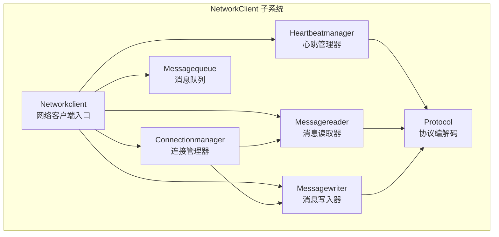
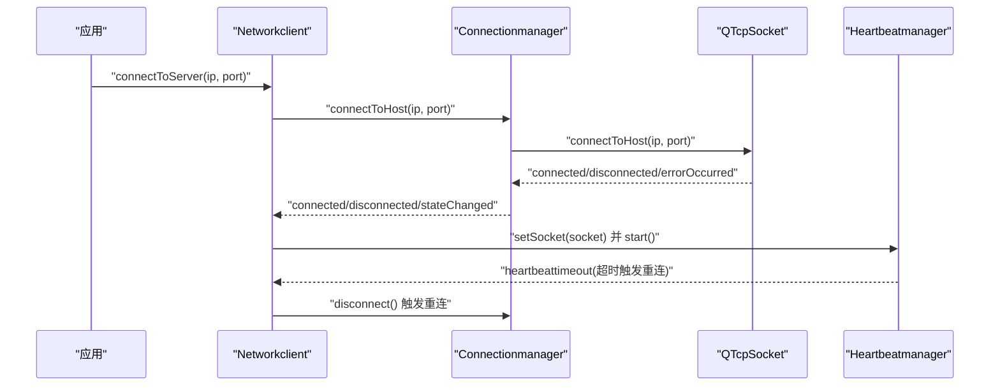
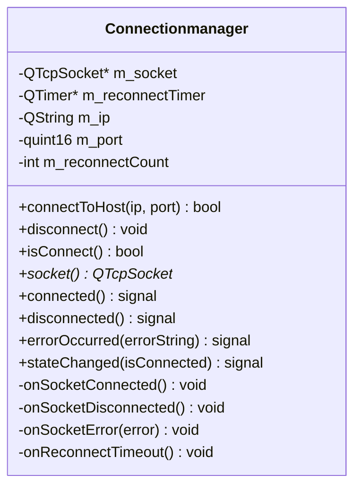
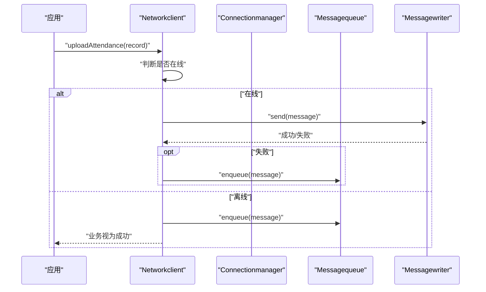
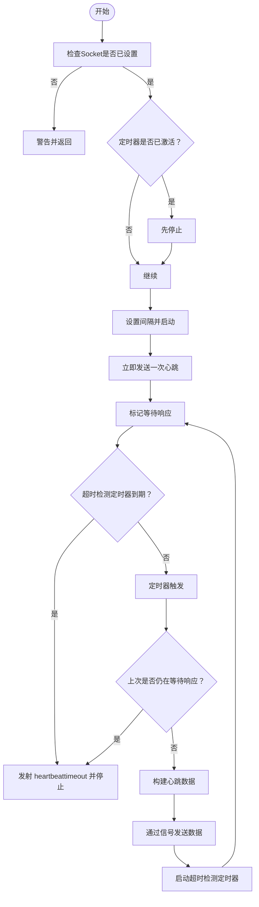
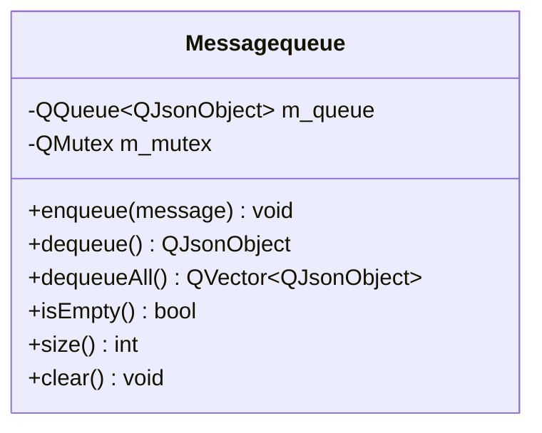
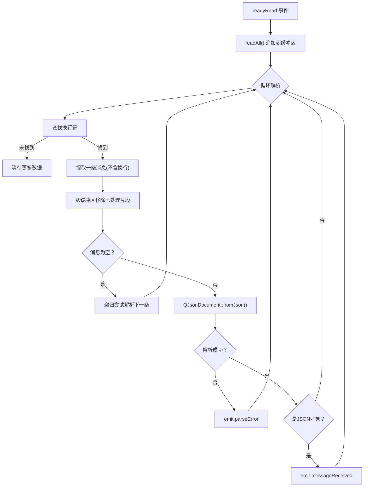
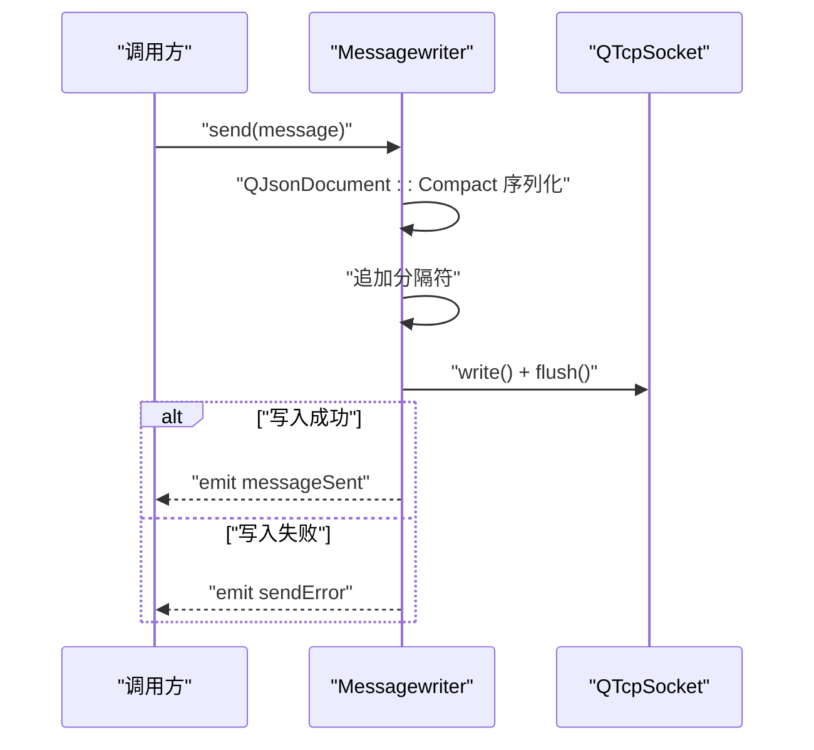
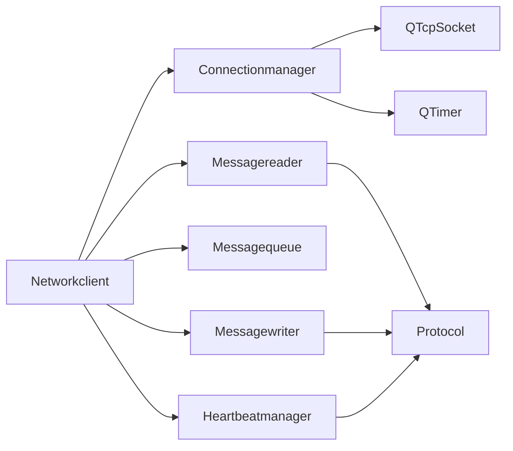

# 连接管理器

<cite>
**本文引用的文件**
- [connectionmanager.h](file://NetworkClient/connectionmanager.h)
- [connectionmanager.cpp](file://NetworkClient/connectionmanager.cpp)
- [networkclient.h](file://NetworkClient/networkclient.h)
- [networkclient.cpp](file://NetworkClient/networkclient.cpp)
- [heartbeatmanager.h](file://NetworkClient/heartbeatmanager.h)
- [heartbeatmanager.cpp](file://NetworkClient/heartbeatmanager.cpp)
- [messagequeue.h](file://NetworkClient/messagequeue.h)
- [messagequeue.cpp](file://NetworkClient/messagequeue.cpp)
- [protocol.h](file://NetworkClient/protocol.h)
- [protocol.cpp](file://NetworkClient/protocol.cpp)
- [messagewriter.h](file://NetworkClient/messagewriter.h)
- [messagewriter.cpp](file://NetworkClient/messagewriter.cpp)
- [messagereader.h](file://NetworkClient/messagereader.h)
- [messagereader.cpp](file://NetworkClient/messagereader.cpp)
</cite>

## 目录
1. [简介](#简介)
2. [项目结构](#项目结构)
3. [核心组件](#核心组件)
4. [架构总览](#架构总览)
5. [详细组件分析](#详细组件分析)
6. [依赖关系分析](#依赖关系分析)
7. [性能考量](#性能考量)
8. [故障排查指南](#故障排查指南)
9. [结论](#结论)
10. [附录](#附录)

## 简介
本文件围绕“连接管理器”组件展开，系统性阐述TCP连接的建立、维护与断开机制，覆盖Socket初始化、连接参数配置、连接状态监控、连接池管理、重连策略、异常处理与连接超时控制等关键实现。文档还记录连接状态信号发射、错误码映射、日志记录策略，并提供基于现有代码的完整流程示例路径，帮助开发者快速上手与排障。

## 项目结构
连接管理器位于 NetworkClient 子模块，与心跳管理、消息读写、消息队列、协议编解码共同构成网络客户端子系统。其职责是统一管理底层QTcpSocket生命周期、封装连接状态与错误事件，并驱动上层业务模块（如消息发送、接收、心跳保活）协同工作。

图表来源
- [networkclient.cpp:221-231](file://NetworkClient/networkclient.cpp#L221-L231)
- [connectionmanager.cpp:3-18](file://NetworkClient/connectionmanager.cpp#L3-L18)
- [heartbeatmanager.cpp:4-22](file://NetworkClient/heartbeatmanager.cpp#L4-L22)
- [messagequeue.cpp:3-6](file://NetworkClient/messagequeue.cpp#L3-L6)
- [messagereader.cpp:3-11](file://NetworkClient/messagereader.cpp#L3-L11)
- [messagewriter.cpp:3-11](file://NetworkClient/messagewriter.cpp#L3-L11)
- [protocol.cpp:42-61](file://NetworkClient/protocol.cpp#L42-L61)

章节来源
- [networkclient.h:17-75](file://NetworkClient/networkclient.h#L17-L75)
- [networkclient.cpp:221-231](file://NetworkClient/networkclient.cpp#L221-L231)

## 核心组件
- 连接管理器（Connectionmanager）
  - 负责Socket初始化、连接控制、状态信号发射、错误信号发射、重连策略与计数。
  - 关键接口：connectToHost、disconnect、isConnect、socket。
  - 关键信号：connected、disconnected、errorOccurred、stateChanged。
- 网络客户端（Networkclient）
  - 作为门面聚合连接管理、心跳、消息读写、消息队列与协议编解码。
  - 关键接口：connectToServer、disconnect、isConnected、业务接口（同步人员、上传打卡、上报设备状态）。
  - 关键信号：connected、disconnected、networkStateChanged、personDataReceived、uploadFinished。
- 心跳管理器（Heartbeatmanager）
  - 维护心跳发送与超时检测，超时后触发重连。
  - 关键接口：setSocket、start、stop、isRunning、buildHeartbeatData。
  - 关键信号：heartbeattimeout、sendHeartbeat。
- 消息队列（Messagequeue）
  - 线程安全的消息缓存容器，支持入队、出队、批量出队、查询与清空。
- 消息读取器（Messagereader）
  - 基于QTcpSocket::readyRead事件驱动，负责粘包拆分与JSON解析。
- 消息写入器（Messagewriter）
  - 负责消息序列化、追加分隔符、批量发送与错误回传。
- 协议编解码（Protocol）
  - 定义消息类型、数据结构与序列化/反序列化工具。

章节来源
- [connectionmanager.h:8-45](file://NetworkClient/connectionmanager.h#L8-L45)
- [connectionmanager.cpp:3-110](file://NetworkClient/connectionmanager.cpp#L3-L110)
- [networkclient.h:17-75](file://NetworkClient/networkclient.h#L17-L75)
- [networkclient.cpp:12-312](file://NetworkClient/networkclient.cpp#L12-L312)
- [heartbeatmanager.h:10-41](file://NetworkClient/heartbeatmanager.h#L10-L41)
- [heartbeatmanager.cpp:4-114](file://NetworkClient/heartbeatmanager.cpp#L4-L114)
- [messagequeue.h:8-33](file://NetworkClient/messagequeue.h#L8-L33)
- [messagequeue.cpp:3-70](file://NetworkClient/messagequeue.cpp#L3-L70)
- [messagereader.h:8-60](file://NetworkClient/messagereader.h#L8-L60)
- [messagereader.cpp:3-108](file://NetworkClient/messagereader.cpp#L3-L108)
- [messagewriter.h:8-50](file://NetworkClient/messagewriter.h#L8-L50)
- [messagewriter.cpp:3-128](file://NetworkClient/messagewriter.cpp#L3-L128)
- [protocol.h:15-61](file://NetworkClient/protocol.h#L15-L61)
- [protocol.cpp:42-61](file://NetworkClient/protocol.cpp#L42-L61)

## 架构总览
连接管理器在整体架构中处于“连接层”，向上为网络客户端提供统一的连接控制与状态事件；向下绑定QTcpSocket，负责连接生命周期与错误处理；并与心跳管理器协作维持链路活性。

图表来源
- [networkclient.cpp:12-25](file://NetworkClient/networkclient.cpp#L12-L25)
- [connectionmanager.cpp:20-36](file://NetworkClient/connectionmanager.cpp#L20-L36)
- [heartbeatmanager.cpp:24-40](file://NetworkClient/heartbeatmanager.cpp#L24-L40)

## 详细组件分析

### 连接管理器（Connectionmanager）
- Socket初始化与连接控制
  - 在构造函数中创建QTcpSocket与QTimer，并将Socket信号绑定至内部槽。
  - connectToHost负责保存目标地址、重置重连计数、断开旧连接并发起新连接。
  - disconnect停止重连定时器并将计数标记为主动断开，随后断开Socket。
  - isConnect返回Socket当前状态。
- 连接状态与错误信号
  - onSocketConnected：重置重连计数，发射connected与stateChanged(true)。
  - onSocketDisconnected：发射disconnected与stateChanged(false)，并根据重连计数与是否主动断开决定是否启动重连定时器。
  - onSocketError：将QAbstractSocket::SocketError映射为用户可读错误字符串并发射errorOccurred。
- 重连策略
  - 指数退避：延迟 = min(2^重连次数 * 1000ms, 30000ms)，最多重连MAX_RECONNECT次。
  - 主动断开时将重连计数设为MAX_RECONNECT以避免重连。
- 连接超时控制
  - 通过心跳管理器的超时检测间接触发重连；连接本身未显式设置Socket超时。

图表来源
- [connectionmanager.h:8-45](file://NetworkClient/connectionmanager.h#L8-L45)
- [connectionmanager.cpp:3-110](file://NetworkClient/connectionmanager.cpp#L3-L110)

章节来源
- [connectionmanager.h:12-42](file://NetworkClient/connectionmanager.h#L12-L42)
- [connectionmanager.cpp:20-110](file://NetworkClient/connectionmanager.cpp#L20-L110)

### 网络客户端（Networkclient）
- 门面职责
  - 代理连接管理器的连接/断开/状态查询。
  - 在连接成功时创建并装配消息读写器、启动心跳、启动消息接收、处理队列中的消息。
  - 在断开时清理资源并停止心跳与接收。
- 业务接口
  - 同步人员数据：构建请求消息并通过写入器发送。
  - 上传打卡记录：单条或批量上传，失败时入队缓存。
  - 上报设备状态：构建消息并发送或入队。
- 队列处理
  - 断网期间的消息入队；网络恢复后批量出队并尝试发送，失败部分重新入队。

图表来源
- [networkclient.cpp:45-65](file://NetworkClient/networkclient.cpp#L45-L65)
- [networkclient.cpp:67-94](file://NetworkClient/networkclient.cpp#L67-L94)
- [networkclient.cpp:96-106](file://NetworkClient/networkclient.cpp#L96-L106)

章节来源
- [networkclient.h:17-75](file://NetworkClient/networkclient.h#L17-L75)
- [networkclient.cpp:12-312](file://NetworkClient/networkclient.cpp#L12-L312)

### 心跳管理器（Heartbeatmanager）
- 心跳发送与超时检测
  - start启动定时器并立即发送首次心跳；若上次心跳未收到响应则判定超时。
  - 设置单次超时检测定时器（默认5000ms），超时后发射heartbeattimeout信号。
  - setSocket时自动绑定Socket连接/断开事件，在连接成功时启动心跳。
- 数据构建
  - buildHeartbeatData通过协议层创建标准心跳消息并序列化为字节流。

图表来源
- [heartbeatmanager.cpp:42-114](file://NetworkClient/heartbeatmanager.cpp#L42-L114)
- [protocol.cpp:76-85](file://NetworkClient/protocol.cpp#L76-L85)

章节来源
- [heartbeatmanager.h:10-41](file://NetworkClient/heartbeatmanager.h#L10-L41)
- [heartbeatmanager.cpp:4-114](file://NetworkClient/heartbeatmanager.cpp#L4-L114)

### 消息队列（Messagequeue）
- 线程安全
  - 使用QMutex保护队列操作，保证多线程环境下的数据一致性。
- 接口能力
  - 入队、出队、批量出队、查询长度、清空队列。

图表来源
- [messagequeue.h:8-33](file://NetworkClient/messagequeue.h#L8-L33)
- [messagequeue.cpp:3-70](file://NetworkClient/messagequeue.cpp#L3-L70)

章节来源
- [messagequeue.h:8-33](file://NetworkClient/messagequeue.h#L8-L33)
- [messagequeue.cpp:3-70](file://NetworkClient/messagequeue.cpp#L3-L70)

### 消息读取器（Messagereader）
- 事件驱动
  - 连接Socket的readyRead信号，读取所有可用数据到缓冲区。
- 粘包处理与JSON解析
  - 以换行符为消息边界拆分，逐条尝试解析为JSON对象，失败时保留到缓冲区等待后续数据。
  - 解析失败时发射parseError信号。

图表来源
- [messagereader.cpp:35-108](file://NetworkClient/messagereader.cpp#L35-L108)

章节来源
- [messagereader.h:8-60](file://NetworkClient/messagereader.h#L8-L60)
- [messagereader.cpp:3-108](file://NetworkClient/messagereader.cpp#L3-L108)

### 消息写入器（Messagewriter）
- 序列化与发送
  - 将QJsonObject序列化为紧凑格式的字节流并追加分隔符（换行符），随后flush强制发送。
  - 支持原始字节流直发，确保末尾带换行符。
- 批量发送
  - 逐条发送，遇到失败即中断，返回已成功数量。
- 错误处理
  - 写入失败时发射sendError信号，携带错误描述。

图表来源
- [messagewriter.cpp:13-76](file://NetworkClient/messagewriter.cpp#L13-L76)
- [messagewriter.cpp:78-112](file://NetworkClient/messagewriter.cpp#L78-L112)
- [messagewriter.cpp:115-128](file://NetworkClient/messagewriter.cpp#L115-L128)

章节来源
- [messagewriter.h:8-50](file://NetworkClient/messagewriter.h#L8-L50)
- [messagewriter.cpp:3-128](file://NetworkClient/messagewriter.cpp#L3-L128)

### 协议编解码（Protocol）
- 消息类型与数据结构
  - 定义心跳、同步人员、上传打卡、上传响应、设备状态等消息类型。
  - 定义打卡记录与人员数据结构，并提供toJson/fromJson。
- 消息打包与解析
  - createMessage：统一创建带type与data字段的消息对象。
  - parseMessageType：从消息中解析类型。
  - messageTypeToString：类型转字符串，便于日志输出。

章节来源
- [protocol.h:15-61](file://NetworkClient/protocol.h#L15-L61)
- [protocol.cpp:42-61](file://NetworkClient/protocol.cpp#L42-L61)

## 依赖关系分析
- 组件耦合
  - Networkclient聚合Connectionmanager、Heartbeatmanager、Messagequeue、Messagereader、Messagewriter，形成高内聚低耦合的门面模式。
  - Connectionmanager仅依赖QTcpSocket与QTimer，职责单一，便于测试与替换。
- 信号与槽
  - 大量使用Qt信号槽机制实现异步解耦，如Socket事件、心跳超时、消息发送/接收、状态变化等。
- 外部依赖
  - 依赖Qt网络与JSON模块；消息边界采用换行符，便于跨语言互通。

图表来源
- [networkclient.cpp:221-239](file://NetworkClient/networkclient.cpp#L221-L239)
- [connectionmanager.cpp:3-18](file://NetworkClient/connectionmanager.cpp#L3-L18)
- [heartbeatmanager.cpp:4-22](file://NetworkClient/heartbeatmanager.cpp#L4-L22)
- [protocol.cpp:42-61](file://NetworkClient/protocol.cpp#L42-L61)

章节来源
- [networkclient.cpp:221-239](file://NetworkClient/networkclient.cpp#L221-L239)
- [connectionmanager.cpp:3-18](file://NetworkClient/connectionmanager.cpp#L3-L18)

## 性能考量
- 序列化与传输
  - 使用紧凑JSON格式减少带宽占用；消息以换行符分隔，避免额外协议头开销。
- 批量发送
  - 批量发送接口在恢复后一次性处理队列，降低握手与调度成本。
- 缓冲与刷新
  - flush确保数据尽快送达，避免系统缓冲策略带来的延迟抖动。
- 心跳与超时
  - 心跳周期与超时检测结合，既保证链路活性又避免频繁重连。
- 线程安全
  - 消息队列使用互斥锁保护，避免并发竞争导致的数据损坏。

## 故障排查指南
- 连接失败
  - 检查错误信号：连接被拒绝、主机未找到、连接超时、网络错误等，对应不同提示信息。
  - 排查步骤：确认IP/端口正确、服务器已启动、防火墙放行、DNS解析正常。
- 断线重连
  - 观察重连次数与延迟：指数退避上限为30秒，超过最大次数不再重连。
  - 若为主动断开，重连计数会被标记为最大值，不会触发自动重连。
- 心跳超时
  - 心跳超时将触发断开与重连；检查网络质量、服务器负载与消息读写器是否正常工作。
- 消息解析失败
  - 查看解析错误信号，定位JSON格式问题或消息边界异常。
- 发送失败
  - 检查Socket状态、序列化结果与flush返回值；必要时启用更详细的日志。

章节来源
- [connectionmanager.cpp:79-103](file://NetworkClient/connectionmanager.cpp#L79-L103)
- [heartbeatmanager.cpp:16-21](file://NetworkClient/heartbeatmanager.cpp#L16-L21)
- [messagereader.cpp:83-97](file://NetworkClient/messagereader.cpp#L83-L97)
- [messagewriter.cpp:61-71](file://NetworkClient/messagewriter.cpp#L61-L71)

## 结论
连接管理器通过清晰的职责划分与信号槽解耦，实现了可靠的TCP连接生命周期管理与异常恢复。配合心跳保活、消息队列与读写器，形成了稳定高效的网络通信子系统。建议在生产环境中进一步完善连接超时配置、TLS加密与认证机制，并持续优化日志粒度与告警策略。

## 附录

### 建立TCP连接的完整流程（示例路径）
- 连接建立
  - 调用入口：[networkclient.cpp:12-15](file://NetworkClient/networkclient.cpp#L12-L15)
  - 实际连接：[connectionmanager.cpp:20-36](file://NetworkClient/connectionmanager.cpp#L20-L36)
  - Socket事件绑定：[connectionmanager.cpp:9-14](file://NetworkClient/connectionmanager.cpp#L9-L14)
- 监听连接状态变化
  - 订阅信号：[networkclient.cpp:233-239](file://NetworkClient/networkclient.cpp#L233-L239)
  - 状态处理：[networkclient.cpp:165-181](file://NetworkClient/networkclient.cpp#L165-L181)
- 处理连接异常
  - 错误映射与发射：[connectionmanager.cpp:79-103](file://NetworkClient/connectionmanager.cpp#L79-L103)
  - 心跳超时触发重连：[heartbeatmanager.cpp:16-21](file://NetworkClient/heartbeatmanager.cpp#L16-L21)
- 心跳保活
  - 启动与发送：[heartbeatmanager.cpp:42-60](file://NetworkClient/heartbeatmanager.cpp#L42-L60)
  - 超时检测：[heartbeatmanager.cpp:14-21](file://NetworkClient/heartbeatmanager.cpp#L14-L21)
- 消息发送与队列处理
  - 单条发送：[networkclient.cpp:45-65](file://NetworkClient/networkclient.cpp#L45-L65)
  - 批量发送：[networkclient.cpp:67-94](file://NetworkClient/networkclient.cpp#L67-L94)
  - 队列出入队：[messagequeue.cpp:8-44](file://NetworkClient/messagequeue.cpp#L8-L44)
- 消息解析
  - 读取与解析：[messagereader.cpp:35-108](file://NetworkClient/messagereader.cpp#L35-L108)