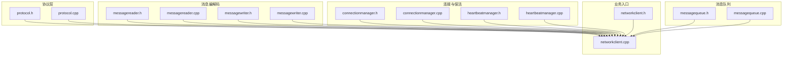
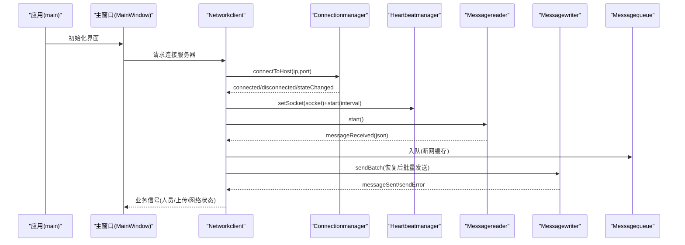
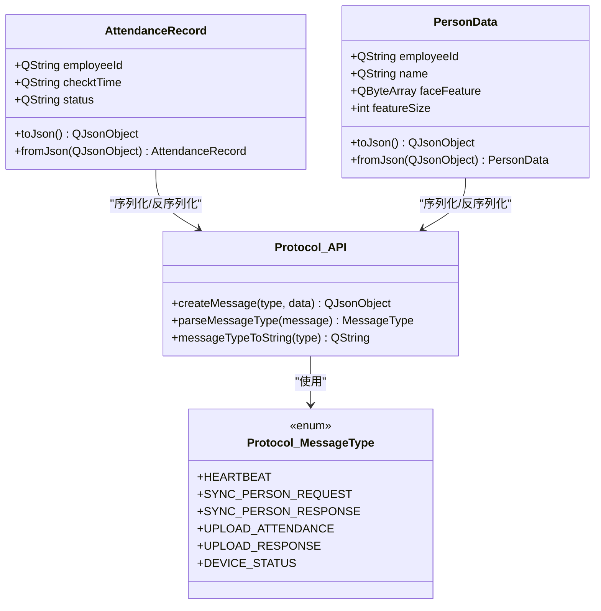
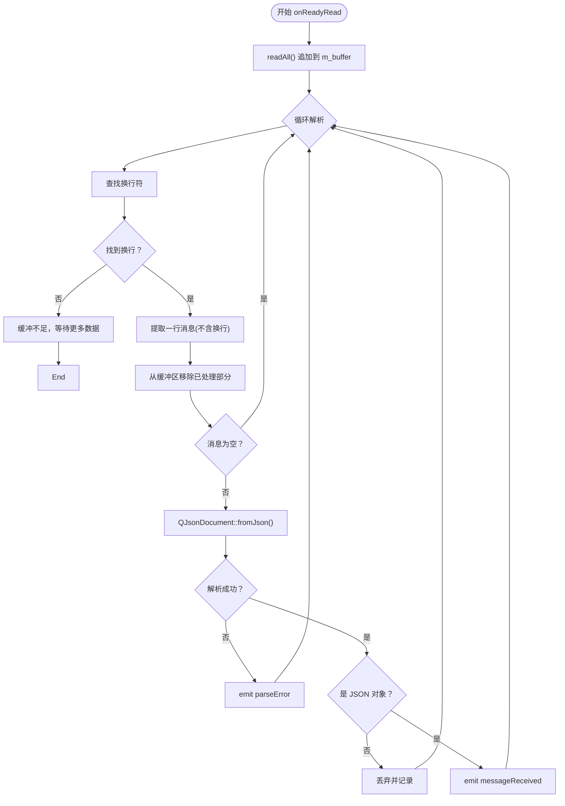
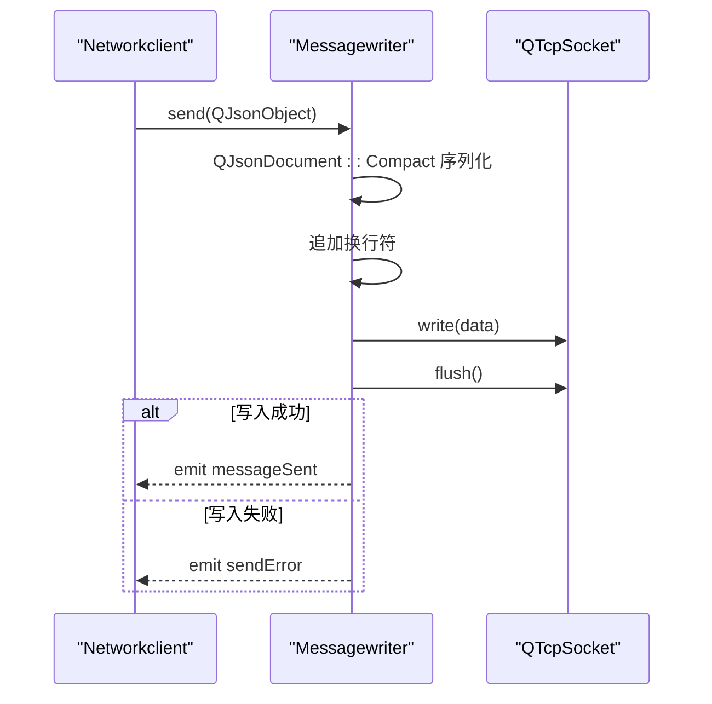
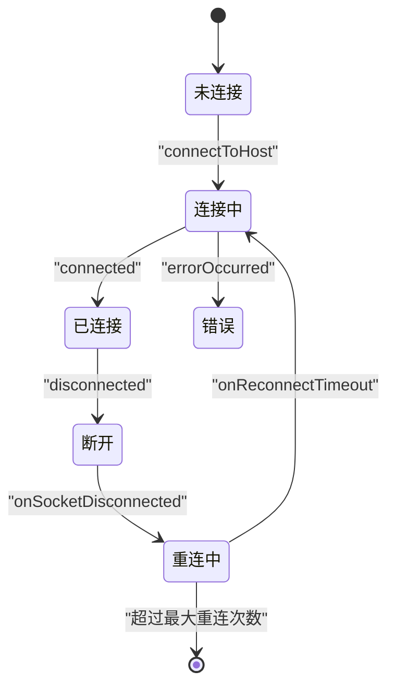
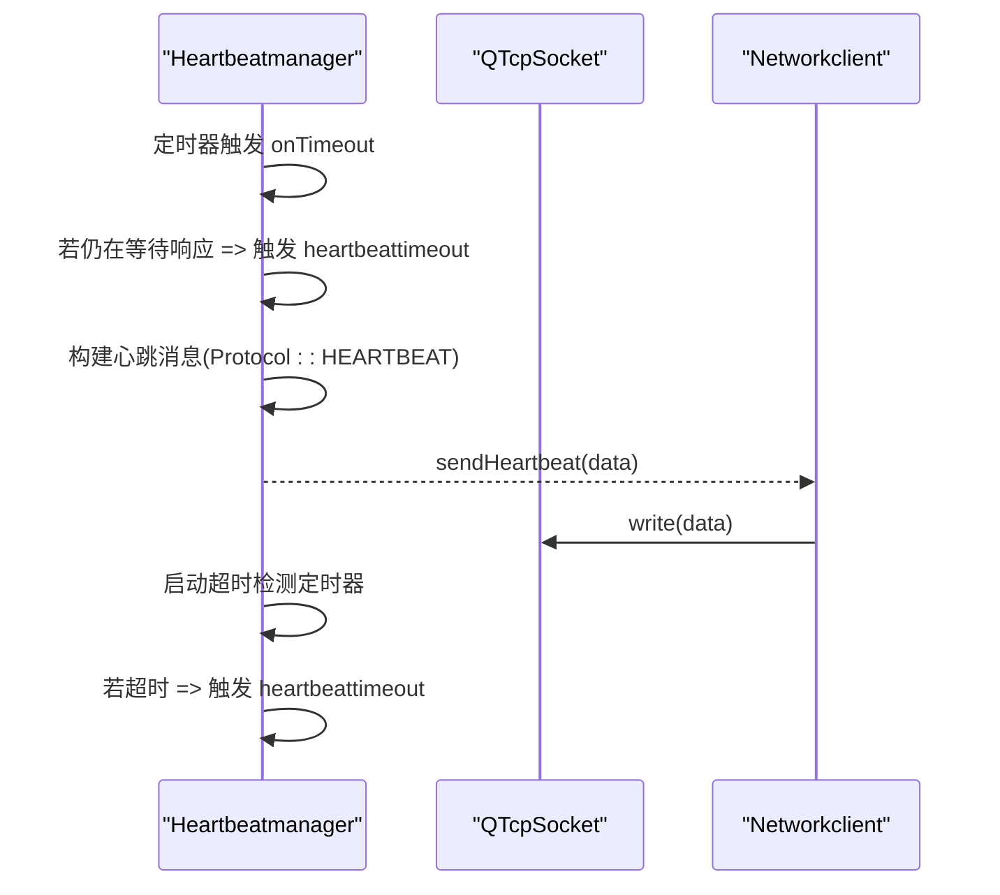
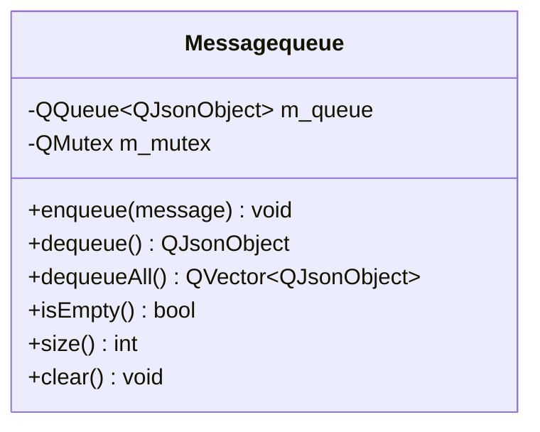
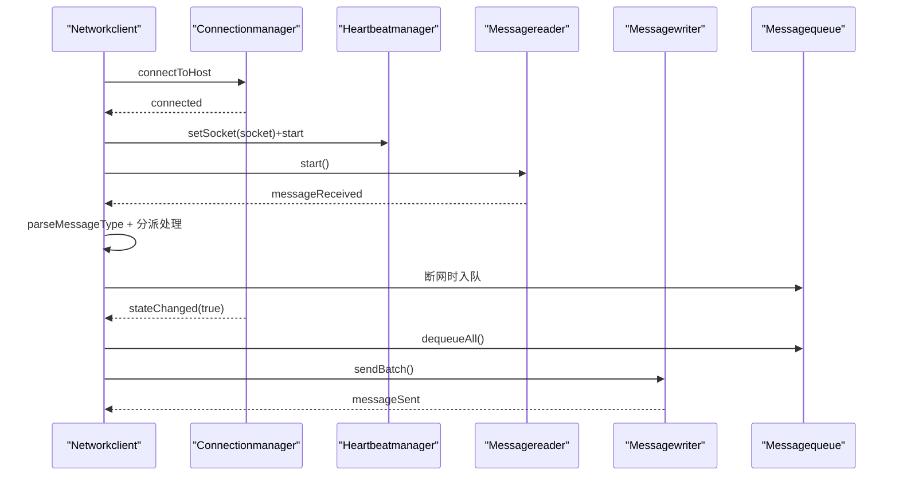
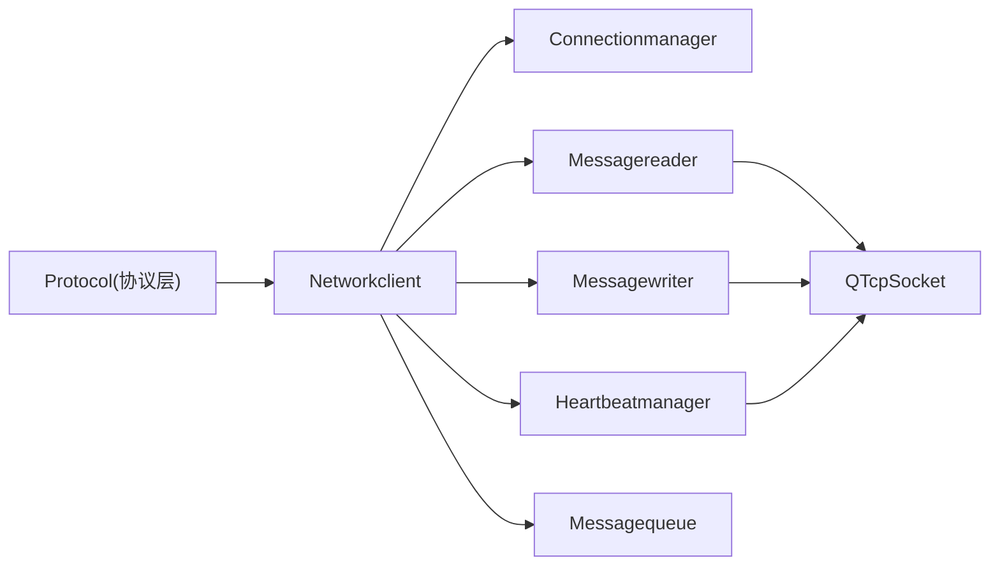

# 通信协议

<cite>
**本文引用的文件**
- [protocol.h](file://NetworkClient/protocol.h)
- [protocol.cpp](file://NetworkClient/protocol.cpp)
- [messagereader.h](file://NetworkClient/messagereader.h)
- [messagereader.cpp](file://NetworkClient/messagereader.cpp)
- [messagewriter.h](file://NetworkClient/messagewriter.h)
- [messagewriter.cpp](file://NetworkClient/messagewriter.cpp)
- [networkclient.h](file://NetworkClient/networkclient.h)
- [networkclient.cpp](file://NetworkClient/networkclient.cpp)
- [connectionmanager.h](file://NetworkClient/connectionmanager.h)
- [connectionmanager.cpp](file://NetworkClient/connectionmanager.cpp)
- [heartbeatmanager.h](file://NetworkClient/heartbeatmanager.h)
- [heartbeatmanager.cpp](file://NetworkClient/heartbeatmanager.cpp)
- [messagequeue.h](file://NetworkClient/messagequeue.h)
- [messagequeue.cpp](file://NetworkClient/messagequeue.cpp)
- [main.cpp](file://main.cpp)
- [mainwindow.h](file://mainwindow.h)
- [mainwindow.cpp](file://mainwindow.cpp)
</cite>

## 目录
1. [简介](#简介)
2. [项目结构](#项目结构)
3. [核心组件](#核心组件)
4. [架构总览](#架构总览)
5. [详细组件分析](#详细组件分析)
6. [依赖关系分析](#依赖关系分析)
7. [性能与可靠性考量](#性能与可靠性考量)
8. [故障排查指南](#故障排查指南)
9. [结论](#结论)
10. [附录：协议文档与示例路径](#附录协议文档与示例路径)

## 简介
本文件面向“通信协议组件”的技术文档，围绕协议格式定义、消息类型、字段规范、版本管理策略、解析器实现、消息验证与错误处理、扩展与兼容性、性能优化与安全建议展开。文档以仓库中的 NetworkClient 子系统为核心，结合协议层、消息读写器、连接管理、心跳与消息队列等模块，给出从数据结构到运行时行为的完整说明，并提供可直接定位到源码的示例路径。

## 项目结构
NetworkClient 子系统采用“协议层 + 读写器 + 连接管理 + 心跳 + 队列 + 上层业务”的分层组织方式，协议层负责消息类型与数据结构定义；读写器负责消息的序列化/反序列化与网络发送；连接管理负责 TCP 连接与重连；心跳负责保活与超时检测；消息队列负责断网缓存与批量恢复发送；业务层通过统一的 Networkclient 汇聚各模块。

图示来源
- [protocol.h](file://NetworkClient/protocol.h)
- [protocol.cpp](file://NetworkClient/protocol.cpp)
- [messagereader.h](file://NetworkClient/messagereader.h)
- [messagereader.cpp](file://NetworkClient/messagereader.cpp)
- [messagewriter.h](file://NetworkClient/messagewriter.h)
- [messagewriter.cpp](file://NetworkClient/messagewriter.cpp)
- [connectionmanager.h](file://NetworkClient/connectionmanager.h)
- [connectionmanager.cpp](file://NetworkClient/connectionmanager.cpp)
- [heartbeatmanager.h](file://NetworkClient/heartbeatmanager.h)
- [heartbeatmanager.cpp](file://NetworkClient/heartbeatmanager.cpp)
- [messagequeue.h](file://NetworkClient/messagequeue.h)
- [messagequeue.cpp](file://NetworkClient/messagequeue.cpp)
- [networkclient.h](file://NetworkClient/networkclient.h)
- [networkclient.cpp](file://NetworkClient/networkclient.cpp)

章节来源
- [networkclient.h](file://NetworkClient/networkclient.h)
- [networkclient.cpp](file://NetworkClient/networkclient.cpp)

## 核心组件
- 协议层（Protocol）
  - 消息类型枚举：心跳、人员同步请求/响应、打卡上传、上传响应、设备状态上报
  - 数据结构：打卡记录、人员数据（含人脸特征二进制需 Base64 编码）
  - 序列化/反序列化：对象与 JSON 的互转
  - 消息打包/解析：统一消息结构（type + data），类型转字符串
- 消息读取器（Messagereader）
  - 基于 TCP Socket 的就绪事件驱动
  - 缓冲区拼接与按换行符切分，逐条 JSON 解析
  - 解析成功/失败分别发出信号
- 消息写入器（Messagewriter）
  - 支持 JSON 对象与原始字节流发送
  - 使用紧凑 JSON 序列化，末尾追加换行符作为消息边界
  - 发送成功/失败信号
- 连接管理（Connectionmanager）
  - 维护 TCP 套接字与重连定时器
  - 按指数回退策略限制最大重连次数
  - 连接状态变更与错误信号
- 心跳管理（Heartbeatmanager）
  - 周期发送心跳，等待响应并在超时后触发重连
- 消息队列（Messagequeue）
  - 线程安全的队列，支持批量出队与统计
- 业务入口（Networkclient）
  - 统一对外接口：连接、同步人员、上传打卡、上报设备状态
  - 事件聚合与状态机：连接成功/断开、网络状态变化、消息处理、心跳超时、发送错误

章节来源
- [protocol.h](file://NetworkClient/protocol.h)
- [protocol.cpp](file://NetworkClient/protocol.cpp)
- [messagereader.h](file://NetworkClient/messagereader.h)
- [messagereader.cpp](file://NetworkClient/messagereader.cpp)
- [messagewriter.h](file://NetworkClient/messagewriter.h)
- [messagewriter.cpp](file://NetworkClient/messagewriter.cpp)
- [connectionmanager.h](file://NetworkClient/connectionmanager.h)
- [connectionmanager.cpp](file://NetworkClient/connectionmanager.cpp)
- [heartbeatmanager.h](file://NetworkClient/heartbeatmanager.h)
- [heartbeatmanager.cpp](file://NetworkClient/heartbeatmanager.cpp)
- [messagequeue.h](file://NetworkClient/messagequeue.h)
- [messagequeue.cpp](file://NetworkClient/messagequeue.cpp)
- [networkclient.h](file://NetworkClient/networkclient.h)
- [networkclient.cpp](file://NetworkClient/networkclient.cpp)

## 架构总览
下图展示了从应用启动到业务消息交互的全链路：UI 启动应用，Networkclient 作为门面协调各子模块；协议层定义消息格式；读写器负责编解码与边界；连接管理负责连接生命周期；心跳保障长连接健康；断网时消息入队，网络恢复后批量发送。

图示来源
- [main.cpp](file://main.cpp)
- [mainwindow.h](file://mainwindow.h)
- [mainwindow.cpp](file://mainwindow.cpp)
- [networkclient.cpp](file://NetworkClient/networkclient.cpp)
- [connectionmanager.cpp](file://NetworkClient/connectionmanager.cpp)
- [heartbeatmanager.cpp](file://NetworkClient/heartbeatmanager.cpp)
- [messagereader.cpp](file://NetworkClient/messagereader.cpp)
- [messagewriter.cpp](file://NetworkClient/messagewriter.cpp)
- [messagequeue.cpp](file://NetworkClient/messagequeue.cpp)

## 详细组件分析

### 协议层（Protocol）
- 消息类型
  - 心跳包：保持连接活跃
  - 同步人员请求/响应：拉取/下发人员数据
  - 打卡上传/响应：上传考勤记录与服务端确认
  - 设备状态上报：设备运行状态
- 数据结构
  - 打卡记录：员工号、时间、状态
  - 人员数据：员工号、姓名、人脸特征（二进制需 Base64 文本化）、特征长度
- 序列化/反序列化
  - 对象转 JSON：toJson
  - JSON 转对象：fromJson（静态工厂）
- 消息封装
  - createMessage：统一消息结构 {type, data}
  - parseMessageType：从 JSON 解析消息类型
  - messageTypeToString：类型转字符串（日志/调试）

图示来源
- [protocol.h](file://NetworkClient/protocol.h)
- [protocol.cpp](file://NetworkClient/protocol.cpp)

章节来源
- [protocol.h](file://NetworkClient/protocol.h)
- [protocol.cpp](file://NetworkClient/protocol.cpp)

### 消息读取器（Messagereader）
- 关键点
  - 基于 readyRead 事件驱动，读取到缓冲区
  - 循环解析：按换行符切分完整消息
  - JSON 解析失败发出 parseError 信号
  - 支持粘包/拆包场景
- 错误处理
  - 无换行符：等待更多数据
  - JSON 不是对象：记录并丢弃
  - 解析异常：输出原始数据与偏移，发出错误信号

图示来源
- [messagereader.cpp](file://NetworkClient/messagereader.cpp)

章节来源
- [messagereader.h](file://NetworkClient/messagereader.h)
- [messagereader.cpp](file://NetworkClient/messagereader.cpp)

### 消息写入器（Messagewriter）
- 关键点
  - 支持 JSON 对象与原始字节流发送
  - 紧凑 JSON 序列化减少带宽
  - 发送后 flush 强制写出
  - 成功/失败分别发出信号
- 批量发送
  - sendBatch：顺序发送，遇错中断并返回已成功数量

图示来源
- [messagewriter.cpp](file://NetworkClient/messagewriter.cpp)

章节来源
- [messagewriter.h](file://NetworkClient/messagewriter.h)
- [messagewriter.cpp](file://NetworkClient/messagewriter.cpp)

### 连接管理（Connectionmanager）
- 关键点
  - 维护 QTcpSocket 与重连定时器
  - 指数回退（最多 5 次）+ 最大延迟上限
  - 连接状态变化与错误分类（拒绝、关闭、不可达、超时、网络错误）
- 与 Networkclient 的协作
  - Networkclient 在连接成功时创建 Writer/Reader 并启动心跳
  - 断开时清理资源并发出状态信号

图示来源
- [connectionmanager.cpp](file://NetworkClient/connectionmanager.cpp)

章节来源
- [connectionmanager.h](file://NetworkClient/connectionmanager.h)
- [connectionmanager.cpp](file://NetworkClient/connectionmanager.cpp)

### 心跳管理（Heartbeatmanager）
- 关键点
  - 周期发送心跳，等待响应并在超时后发出 heartbeattimeout
  - 通过 sendHeartbeat 信号将心跳数据交由外部发送
- 与 Networkclient 的协作
  - Networkclient 在连接成功时设置 socket 并启动心跳
  - 超时触发断开，促使 Connectionmanager 重连

图示来源
- [heartbeatmanager.cpp](file://NetworkClient/heartbeatmanager.cpp)

章节来源
- [heartbeatmanager.h](file://NetworkClient/heartbeatmanager.h)
- [heartbeatmanager.cpp](file://NetworkClient/heartbeatmanager.cpp)

### 消息队列（Messagequeue）
- 关键点
  - 线程安全：QMutexLocker 保护入队/出队
  - 支持批量出队与清空
  - 用于断网缓存与网络恢复后的批量发送

图示来源
- [messagequeue.h](file://NetworkClient/messagequeue.h)
- [messagequeue.cpp](file://NetworkClient/messagequeue.cpp)

章节来源
- [messagequeue.h](file://NetworkClient/messagequeue.h)
- [messagequeue.cpp](file://NetworkClient/messagequeue.cpp)

### 业务入口（Networkclient）
- 关键点
  - 统一对外接口：连接、同步人员、上传打卡、上报设备状态
  - 事件聚合：连接成功/断开、网络状态变化、消息处理、心跳超时、发送错误
  - 断网缓存与恢复：上传与状态上报在断网时入队，网络恢复后批量发送
  - 人员同步：解析响应数组，写入本地存储并刷新特征库

图示来源
- [networkclient.cpp](file://NetworkClient/networkclient.cpp)

章节来源
- [networkclient.h](file://NetworkClient/networkclient.h)
- [networkclient.cpp](file://NetworkClient/networkclient.cpp)

## 依赖关系分析
- 协议层被所有业务与读写器依赖
- Networkclient 聚合 Connectionmanager、Heartbeatmanager、Messagewriter、Messagereader、Messagequeue
- 读写器与连接管理通过 QTcpSocket 交互
- 心跳管理通过信号将心跳数据交给外部发送
- 消息队列被 Networkclient 用于断网缓存

图示来源
- [protocol.h](file://NetworkClient/protocol.h)
- [networkclient.h](file://NetworkClient/networkclient.h)
- [connectionmanager.h](file://NetworkClient/connectionmanager.h)
- [heartbeatmanager.h](file://NetworkClient/heartbeatmanager.h)
- [messagereader.h](file://NetworkClient/messagereader.h)
- [messagewriter.h](file://NetworkClient/messagewriter.h)
- [messagequeue.h](file://NetworkClient/messagequeue.h)

章节来源
- [networkclient.cpp](file://NetworkClient/networkclient.cpp)

## 性能与可靠性考量
- 序列化与边界
  - 使用紧凑 JSON（去除空白）降低带宽
  - 以换行符作为消息边界，避免粘包/拆包问题
- 发送可靠性
  - flush 强制写出，减少系统缓冲延迟
  - sendBatch 顺序发送，遇错中断，保证有序性
- 断网与恢复
  - 消息队列线程安全，支持批量恢复发送
  - 网络恢复后优先发送缓存，再处理新消息
- 连接与保活
  - 指数回退重连，避免风暴
  - 心跳超时触发重连，保障长连接健康
- 资源管理
  - 连接断开时及时释放 Reader/Writer，避免资源泄漏

[本节为通用性能讨论，无需特定文件引用]

## 故障排查指南
- JSON 解析失败
  - 现象：Messagereader 发出 parseError，日志包含错误描述与偏移
  - 排查：检查消息边界（换行符）、消息完整性、字段类型
  - 参考路径：[messagereader.cpp](file://NetworkClient/messagereader.cpp)
- 发送失败
  - 现象：Messagewriter 发出 sendError，检查 socket 状态与错误字符串
  - 排查：确认连接状态、缓冲区写入返回值、flush 是否成功
  - 参考路径：[messagewriter.cpp](file://NetworkClient/messagewriter.cpp)
- 心跳超时
  - 现象：Heartbeatmanager 触发 heartbeattimeout，Connectionmanager 开始重连
  - 排查：网络质量、服务器负载、超时阈值设置
  - 参考路径：[heartbeatmanager.cpp](file://NetworkClient/heartbeatmanager.cpp)，[connectionmanager.cpp](file://NetworkClient/connectionmanager.cpp)
- 断网缓存堆积
  - 现象：Messagequeue.size 增大，批量发送中断
  - 排查：网络恢复后 sendBatch 返回值，逐条定位失败原因
  - 参考路径：[messagequeue.cpp](file://NetworkClient/messagequeue.cpp)，[networkclient.cpp](file://NetworkClient/networkclient.cpp)

章节来源
- [messagereader.cpp](file://NetworkClient/messagereader.cpp)
- [messagewriter.cpp](file://NetworkClient/messagewriter.cpp)
- [heartbeatmanager.cpp](file://NetworkClient/heartbeatmanager.cpp)
- [connectionmanager.cpp](file://NetworkClient/connectionmanager.cpp)
- [messagequeue.cpp](file://NetworkClient/messagequeue.cpp)
- [networkclient.cpp](file://NetworkClient/networkclient.cpp)

## 结论
该通信协议组件以简洁的 JSON 消息格式与明确的分层职责实现了稳定可靠的长连接通信。协议层提供统一的数据模型与序列化能力，读写器负责边界与可靠性，连接与心跳保障链路健康，消息队列提供断网容错。整体设计具备良好的扩展性与可维护性，适合在设备侧与服务端之间进行高效、可控的业务数据交换。

[本节为总结性内容，无需特定文件引用]

## 附录：协议文档与示例路径
- 协议格式定义
  - 消息类型与字段：参见 [protocol.h](file://NetworkClient/protocol.h)
  - 数据结构序列化/反序列化：参见 [protocol.cpp](file://NetworkClient/protocol.cpp)
- 消息构造与解析
  - 构造统一消息：参见 [protocol.cpp](file://NetworkClient/protocol.cpp)
  - 解析消息类型：参见 [protocol.cpp](file://NetworkClient/protocol.cpp)
  - 读取器解析流程：参见 [messagereader.cpp](file://NetworkClient/messagereader.cpp)
- 版本管理与扩展
  - 当前版本：基于固定字段集合的 v1
  - 扩展建议：新增 type 字段枚举与 data 字段结构，保持向后兼容（新增字段设为可选，旧版本忽略）
  - 参考路径：[protocol.h](file://NetworkClient/protocol.h)，[protocol.cpp](file://NetworkClient/protocol.cpp)
- 错误码与异常处理
  - 连接错误分类：参见 [connectionmanager.cpp](file://NetworkClient/connectionmanager.cpp)
  - JSON 解析错误：参见 [messagereader.cpp](file://NetworkClient/messagereader.cpp)
  - 发送错误：参见 [messagewriter.cpp](file://NetworkClient/messagewriter.cpp)
- 性能优化
  - 紧凑 JSON 序列化：参见 [messagewriter.cpp](file://NetworkClient/messagewriter.cpp)
  - 批量发送与断网恢复：参见 [networkclient.cpp](file://NetworkClient/networkclient.cpp)，[messagequeue.cpp](file://NetworkClient/messagequeue.cpp)
- 安全考虑
  - 传输层加密：建议在现有 TCP 层之上启用 TLS
  - 认证与鉴权：在握手阶段引入令牌校验
  - 输入校验：读取器与业务层均应校验必填字段与类型
  - 参考路径：[messagereader.cpp](file://NetworkClient/messagereader.cpp)，[networkclient.cpp](file://NetworkClient/networkclient.cpp)
- 测试验证与部署
  - 单元测试：针对 Protocol::fromJson/toJson、Messagereader::tryParseMessage、Messagewriter::send 进行边界与异常测试
  - 集成测试：模拟断网/重连/心跳超时，验证队列与恢复逻辑
  - 部署注意：确保服务器端正确识别换行符边界与紧凑 JSON；监控 parseError 与 sendError 指标

章节来源
- [protocol.h](file://NetworkClient/protocol.h)
- [protocol.cpp](file://NetworkClient/protocol.cpp)
- [messagereader.cpp](file://NetworkClient/messagereader.cpp)
- [messagewriter.cpp](file://NetworkClient/messagewriter.cpp)
- [networkclient.cpp](file://NetworkClient/networkclient.cpp)
- [connectionmanager.cpp](file://NetworkClient/connectionmanager.cpp)
- [messagequeue.cpp](file://NetworkClient/messagequeue.cpp)