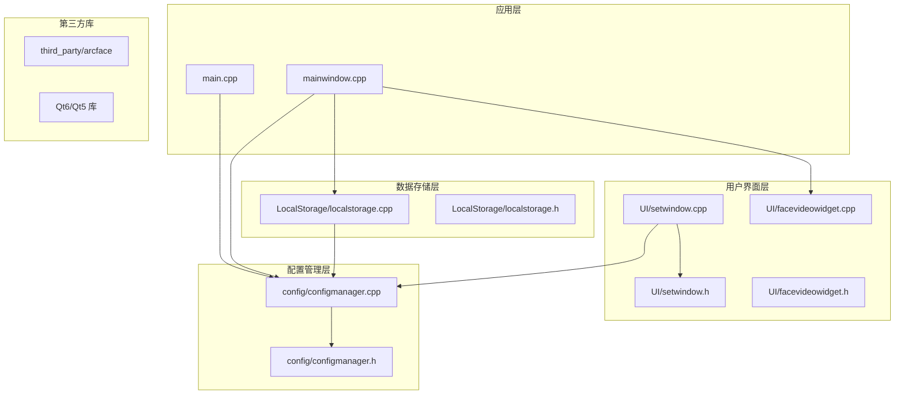
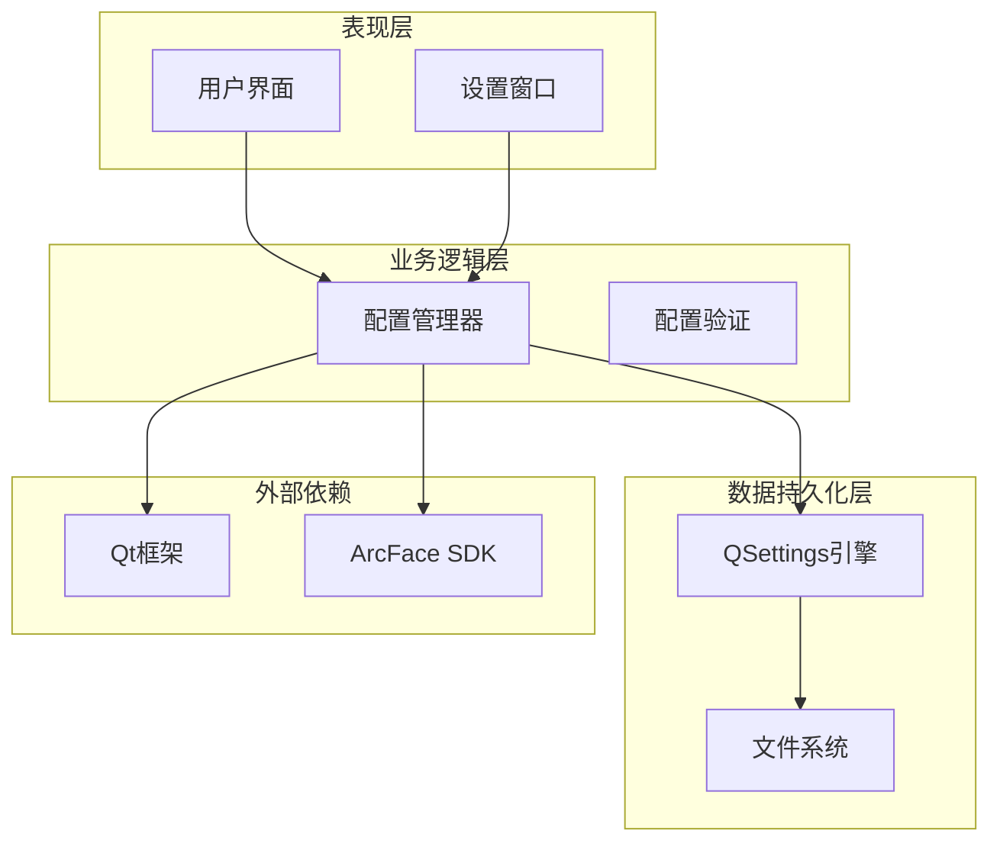
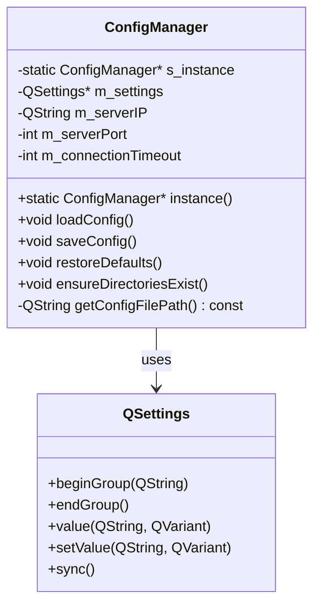
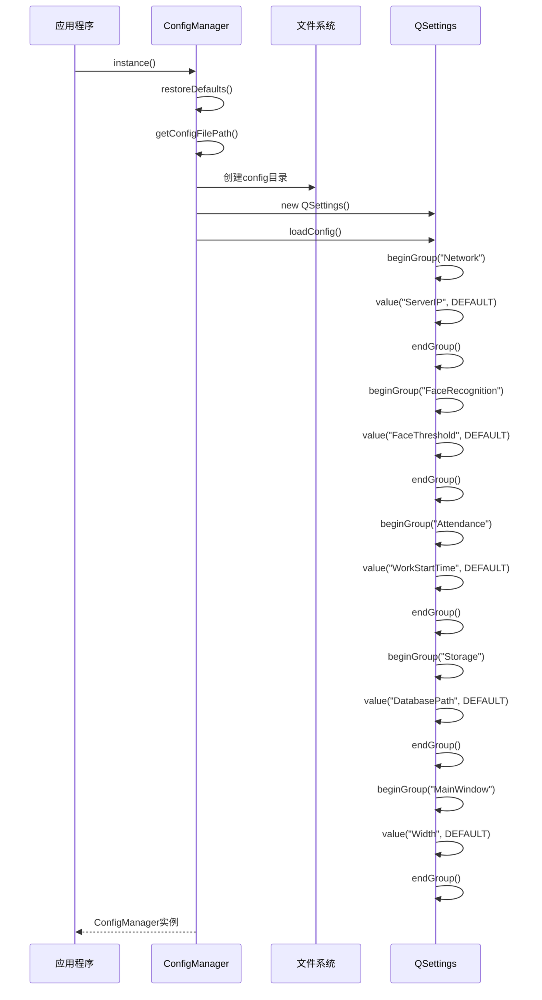
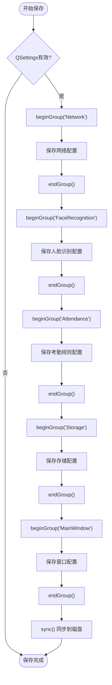
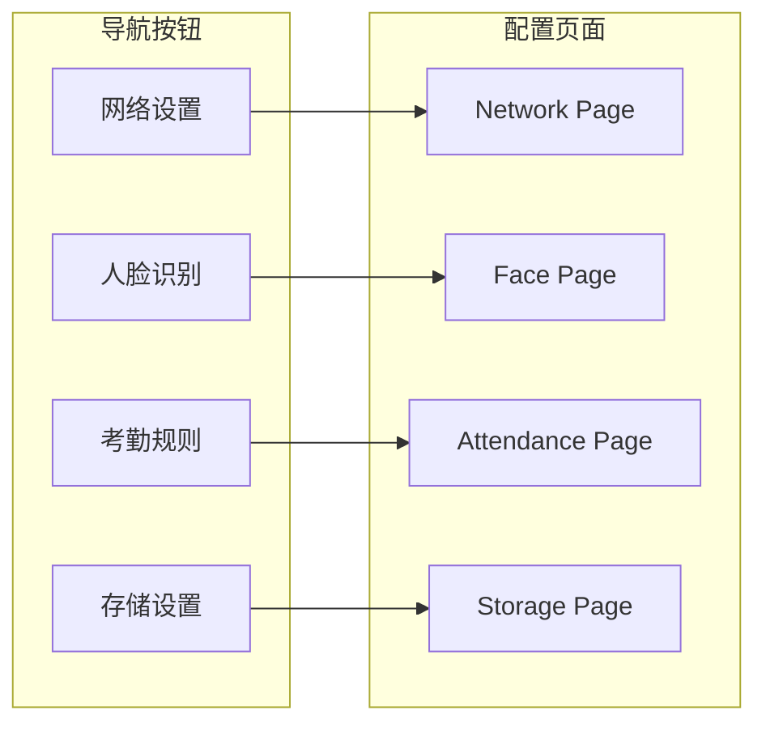
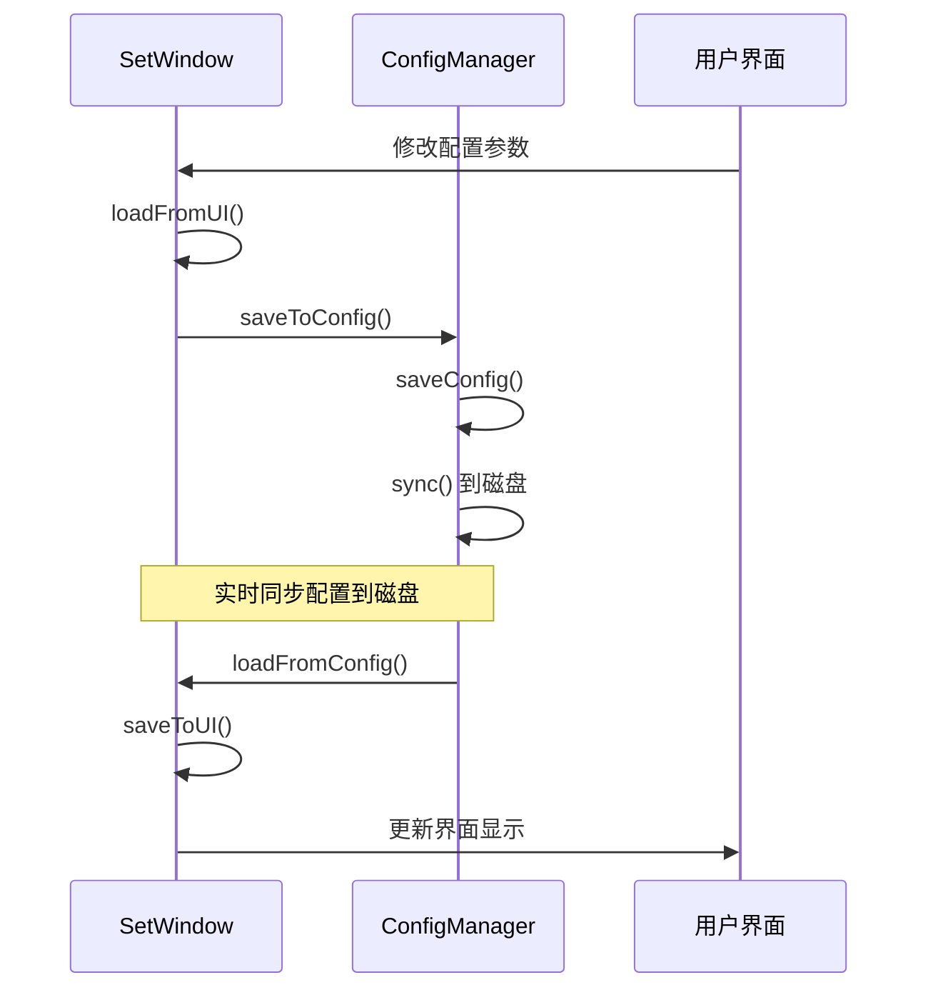
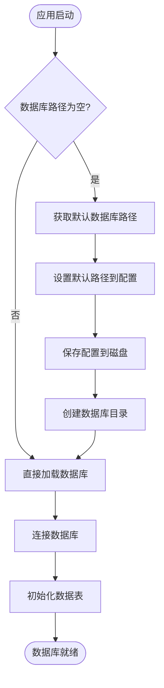
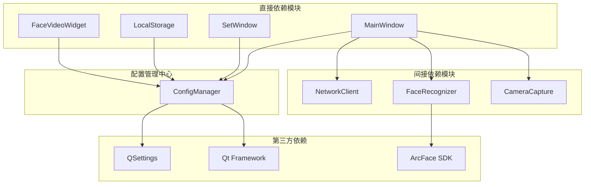

# 配置管理系统

<cite>
**本文档引用的文件**
- [configmanager.h](file://config/configmanager.h)
- [configmanager.cpp](file://config/configmanager.cpp)
- [main.cpp](file://main.cpp)
- [mainwindow.h](file://mainwindow.h)
- [mainwindow.cpp](file://mainwindow.cpp)
- [setwindow.h](file://UI/setwindow.h)
- [setwindow.cpp](file://UI/setwindow.cpp)
- [localstorage.h](file://LocalStorage/localstorage.h)
- [localstorage.cpp](file://LocalStorage/localstorage.cpp)
- [facevideowidget.h](file://UI/facevideowidget.h)
- [facevideowidget.cpp](file://UI/facevideowidget.cpp)
- [CMakeLists.txt](file://CMakeLists.txt)
</cite>

## 目录
1. [简介](#简介)
2. [项目结构](#项目结构)
3. [核心组件](#核心组件)
4. [架构概览](#架构概览)
5. [详细组件分析](#详细组件分析)
6. [依赖关系分析](#依赖关系分析)
7. [性能考虑](#性能考虑)
8. [故障排除指南](#故障排除指南)
9. [结论](#结论)

## 简介

配置管理系统是AttendanceSystem项目中的核心基础设施，负责管理应用程序的所有运行时配置参数。该系统采用单例模式设计，基于Qt框架的QSettings提供持久化存储，支持多种配置类别包括网络连接、人脸识别、考勤规则、存储设置等。系统通过统一的配置接口为各个功能模块提供配置访问，确保应用程序的可配置性和可维护性。

## 项目结构

AttendanceSystem项目采用模块化的组织结构，配置管理系统作为独立的模块与其他功能模块协同工作：

**图表来源**
- [main.cpp:12-43](file://main.cpp#L12-L43)
- [configmanager.cpp:8-36](file://config/configmanager.cpp#L8-L36)
- [mainwindow.cpp:9-32](file://mainwindow.cpp#L9-L32)

**章节来源**
- [CMakeLists.txt:19-58](file://CMakeLists.txt#L19-L58)
- [main.cpp:1-45](file://main.cpp#L1-45)

## 核心组件

配置管理系统的核心由以下关键组件构成：

### ConfigManager 单例类
ConfigManager是配置管理系统的中央控制器，采用单例模式确保全局唯一性。它继承自QObject，提供完整的配置读写接口，并封装了QSettings的使用细节。

### 配置分类体系
系统支持六大类配置参数：
- **网络连接设置**：服务器IP、端口、连接超时
- **人脸识别设置**：相似度阈值、最大检测数量、识别超时
- **ArcFace SDK配置**：App ID、SDK Key
- **考勤规则设置**：工作时间、允许迟到/早退时间
- **存储设置**：数据库路径、日志路径
- **主窗口设置**：窗口宽度、高度

### 文件存储机制
配置文件采用INI格式存储在应用程序目录下的config文件夹中，支持跨平台兼容性。

**章节来源**
- [configmanager.h:14-148](file://config/configmanager.h#L14-L148)
- [configmanager.cpp:16-43](file://config/configmanager.cpp#L16-L43)

## 架构概览

配置管理系统采用分层架构设计，确保各层职责清晰分离：

**图表来源**
- [configmanager.cpp:53-91](file://config/configmanager.cpp#L53-L91)
- [setwindow.cpp:352-391](file://UI/setwindow.cpp#L352-L391)

系统架构特点：
- **单例模式**：确保配置管理的全局一致性
- **分组存储**：按功能模块组织配置项
- **类型安全**：提供强类型的getter/setter方法
- **默认值管理**：内置合理的默认配置
- **线程安全**：支持多线程环境下的配置访问

## 详细组件分析

### ConfigManager 类详细分析

ConfigManager类实现了完整的配置管理功能，包含以下核心特性：

#### 单例模式实现

**图表来源**
- [configmanager.h:14-148](file://config/configmanager.h#L14-L148)
- [configmanager.cpp:6-43](file://config/configmanager.cpp#L6-L43)

#### 配置加载流程
配置系统启动时的完整加载过程如下：

**图表来源**
- [configmanager.cpp:53-91](file://config/configmanager.cpp#L53-L91)
- [configmanager.cpp:45-51](file://config/configmanager.cpp#L45-L51)

#### 配置保存机制
配置变更的保存采用异步机制，确保数据的一致性和完整性：

**图表来源**
- [configmanager.cpp:93-130](file://config/configmanager.cpp#L93-L130)

**章节来源**
- [configmanager.cpp:53-130](file://config/configmanager.cpp#L53-L130)

### SetWindow 配置界面分析

SetWindow提供了图形化的配置管理界面，支持实时配置编辑和预览：

#### 界面导航结构

**图表来源**
- [setwindow.cpp:21-36](file://UI/setwindow.cpp#L21-L36)
- [setwindow.cpp:54-63](file://UI/setwindow.cpp#L54-L63)

#### 配置同步机制
SetWindow与ConfigManager之间的配置同步采用双向绑定模式：

**图表来源**
- [setwindow.cpp:394-424](file://UI/setwindow.cpp#L394-L424)
- [setwindow.cpp:352-391](file://UI/setwindow.cpp#L352-L391)

**章节来源**
- [setwindow.cpp:21-424](file://UI/setwindow.cpp#L21-L424)

### LocalStorage 配置集成分析

LocalStorage模块与配置管理系统的深度集成体现在数据库路径管理上：

#### 数据库路径配置流程

**图表来源**
- [localStorage.cpp:32-136](file://LocalStorage/localstorage.cpp#L32-L136)
- [main.cpp:25-37](file://main.cpp#L25-L37)

**章节来源**
- [localStorage.cpp:32-136](file://LocalStorage/localstorage.cpp#L32-L136)

## 依赖关系分析

配置管理系统与其他模块的依赖关系呈现星型拓扑结构，ConfigManager作为中心节点：

**图表来源**
- [mainwindow.cpp:84-94](file://mainwindow.cpp#L84-L94)
- [setwindow.cpp:354-359](file://UI/setwindow.cpp#L354-L359)

**章节来源**
- [mainwindow.cpp:84-94](file://mainwindow.cpp#L84-L94)
- [setwindow.cpp:354-359](file://UI/setwindow.cpp#L354-L359)

## 性能考虑

配置管理系统在性能方面采用了多项优化策略：

### 内存管理优化
- **延迟初始化**：ConfigManager在首次访问时才创建实例
- **智能缓存**：配置值在内存中缓存，避免频繁磁盘访问
- **RAII模式**：使用智能指针和自动资源管理

### I/O性能优化
- **批量写入**：配置变更采用批量保存机制
- **异步操作**：文件系统操作不阻塞主线程
- **增量更新**：只更新变更的配置项

### 线程安全保证
- **互斥锁保护**：关键配置操作使用QMutex保护
- **原子操作**：配置读取操作保证原子性
- **线程隔离**：不同线程使用独立的配置副本

## 故障排除指南

### 常见问题及解决方案

#### 配置文件无法创建
**问题描述**：应用程序启动时报错，提示无法创建配置文件
**可能原因**：
- 权限不足，无法在应用程序目录创建config文件夹
- 磁盘空间不足
- 路径权限限制

**解决步骤**：
1. 检查应用程序目录的写入权限
2. 确认磁盘空间充足
3. 以管理员权限运行应用程序
4. 手动创建config文件夹并设置写入权限

#### 配置加载失败
**问题描述**：应用程序启动后配置未生效
**可能原因**：
- 配置文件格式错误
- 配置项名称不匹配
- 版本兼容性问题

**诊断方法**：
1. 检查config.ini文件格式
2. 验证配置项名称与代码一致
3. 查看应用程序日志输出
4. 使用配置验证工具检查文件完整性

#### 配置保存异常
**问题描述**：修改的配置无法保存到磁盘
**可能原因**：
- 文件被其他进程占用
- 磁盘写入权限问题
- QSettings同步失败

**修复方案**：
1. 关闭可能占用配置文件的其他程序
2. 检查磁盘写入权限
3. 手动重启应用程序
4. 清理配置文件并重新创建

**章节来源**
- [configmanager.cpp:166-197](file://config/configmanager.cpp#L166-L197)
- [localStorage.cpp:47-58](file://LocalStorage/localstorage.cpp#L47-L58)

## 结论

配置管理系统作为AttendanceSystem的核心基础设施，展现了优秀的软件工程实践：

### 设计优势
- **模块化设计**：清晰的职责分离和接口定义
- **可扩展性**：支持新增配置类别和参数
- **跨平台兼容**：基于Qt框架的平台无关性
- **用户友好**：提供图形化配置界面

### 技术亮点
- **单例模式**：确保配置管理的全局一致性
- **类型安全**：编译时类型检查和运行时验证
- **线程安全**：多线程环境下的可靠配置访问
- **持久化存储**：可靠的配置数据持久化机制

### 改进建议
- **配置版本控制**：支持配置文件版本管理和迁移
- **配置模板**：提供预设配置模板供用户选择
- **配置导入导出**：支持配置的批量导入导出功能
- **配置审计**：记录配置变更历史便于追踪

配置管理系统为整个AttendanceSystem提供了坚实的基础，通过其完善的架构设计和实现细节，确保了应用程序的可配置性、可维护性和用户体验的持续改进。