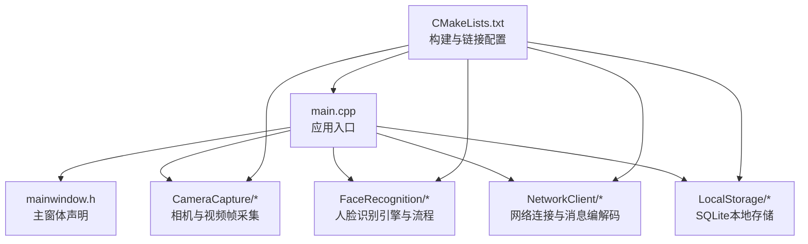
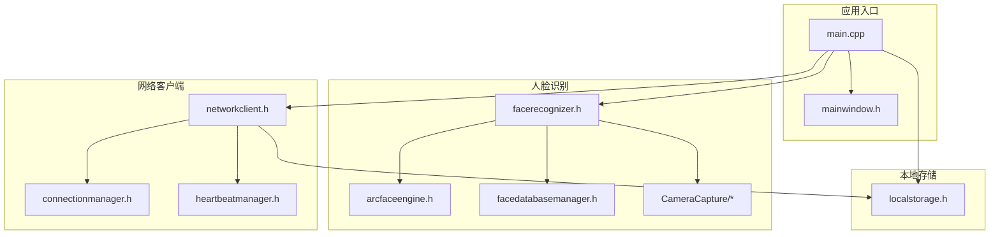
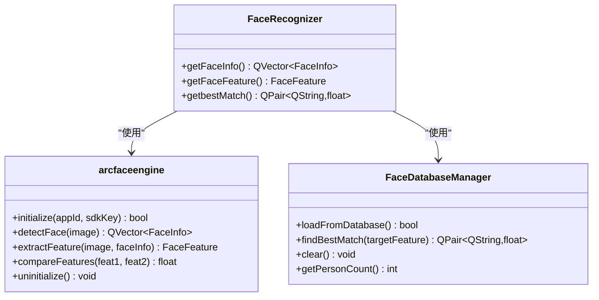
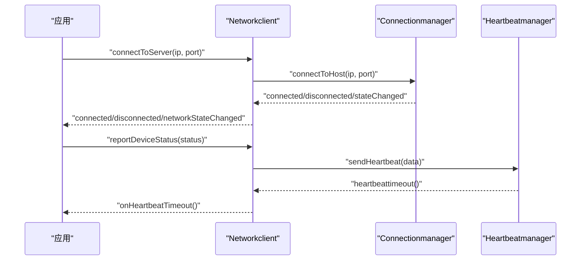
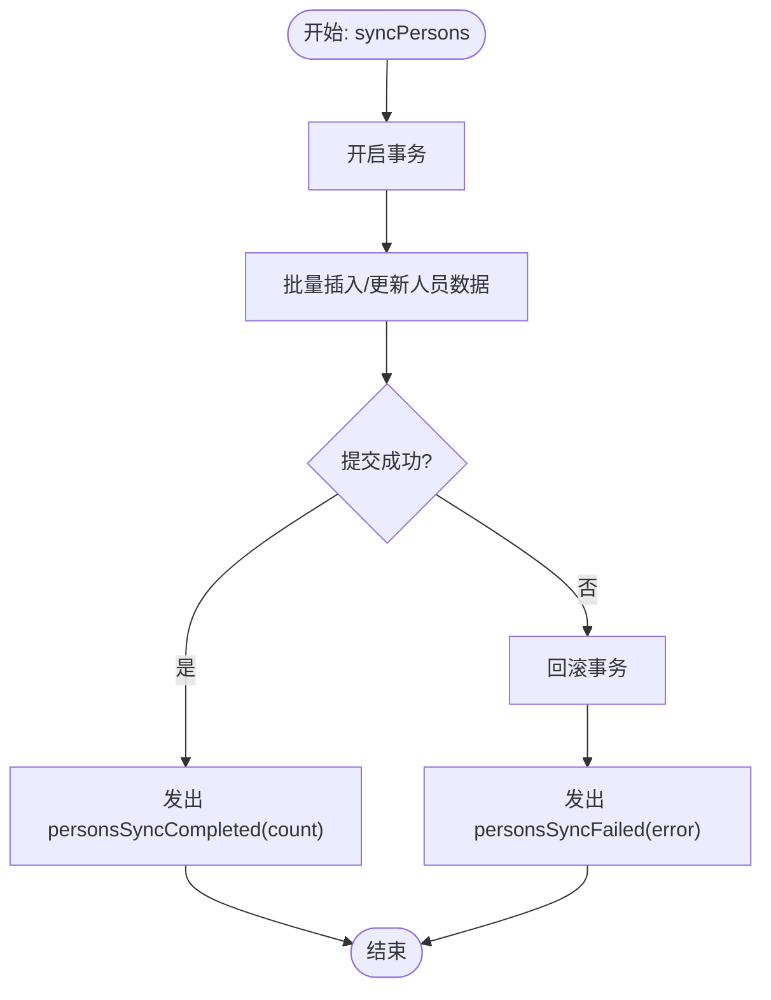
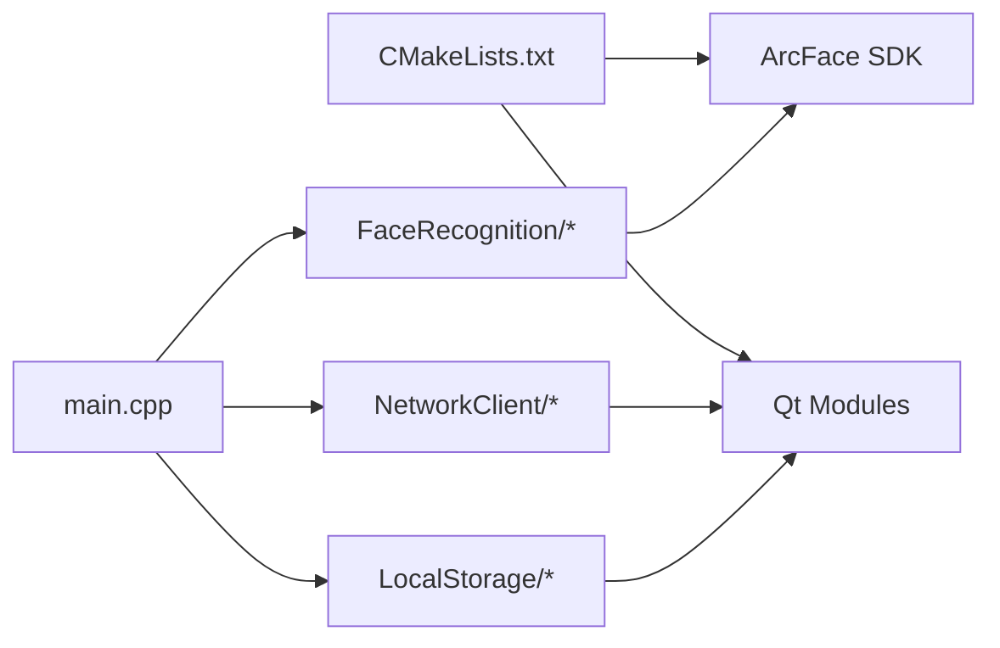

# 测试与调试

<cite>
**本文引用的文件**
- [main.cpp](file://main.cpp)
- [mainwindow.h](file://mainwindow.h)
- [CMakeLists.txt](file://CMakeLists.txt)
- [FaceRecognition/arcfaceengine.h](file://FaceRecognition/arcfaceengine.h)
- [FaceRecognition/facerecognizer.h](file://FaceRecognition/facerecognizer.h)
- [FaceRecognition/facedatabasemanager.h](file://FaceRecognition/facedatabasemanager.h)
- [NetworkClient/networkclient.h](file://NetworkClient/networkclient.h)
- [NetworkClient/connectionmanager.h](file://NetworkClient/connectionmanager.h)
- [NetworkClient/heartbeatmanager.h](file://NetworkClient/heartbeatmanager.h)
- [LocalStorage/localstorage.h](file://LocalStorage/localstorage.h)
- [CameraCapture/cameracapture.cpp](file://CameraCapture/cameracapture.cpp)
- [CameraCapture/videoframeconverter.cpp](file://CameraCapture/videoframeconverter.cpp)
- [FaceRecognition/arcfaceengine.cpp](file://FaceRecognition/arcfaceengine.cpp)
- [third_party/dlib/include/dlib/test/main.cpp](file://third_party/dlib/include/dlib/test/main.cpp)
</cite>

## 目录
1. [引言](#引言)
2. [项目结构](#项目结构)
3. [核心组件](#核心组件)
4. [架构总览](#架构总览)
5. [详细组件分析](#详细组件分析)
6. [依赖关系分析](#依赖关系分析)
7. [性能考量](#性能考量)
8. [故障排查指南](#故障排查指南)
9. [结论](#结论)
10. [附录](#附录)

## 引言
本指南面向测试与调试场景，围绕人脸识别、网络通信与本地存储三大核心模块，制定单元测试、集成测试与系统测试策略，并提供调试技巧、日志分析方法、错误代码说明、性能分析工具使用建议以及自动化测试与持续集成配置要点。文档同时给出人脸识别精度测试、网络连接稳定性测试与数据库事务性测试的具体实施方案，帮助在真实设备与开发环境中高效定位问题并提升系统稳定性。

## 项目结构
项目采用Qt框架构建，按功能域划分模块：主入口负责应用生命周期；UI层通过窗体类承载界面；核心业务由人脸识别、网络客户端与本地存储三部分组成；第三方库包括虹软ArcFace SDK与dlib测试框架。

图表来源
- [main.cpp:1-28](file://main.cpp#L1-L28)
- [mainwindow.h:1-23](file://mainwindow.h#L1-L23)
- [CMakeLists.txt:1-87](file://CMakeLists.txt#L1-L87)

章节来源
- [main.cpp:1-28](file://main.cpp#L1-L28)
- [mainwindow.h:1-23](file://mainwindow.h#L1-L23)
- [CMakeLists.txt:1-87](file://CMakeLists.txt#L1-L87)

## 核心组件
- 人脸识别模块：包含引擎封装、特征提取、特征对比与数据库管理，负责人脸检测、特征提取与识别匹配。
- 网络客户端模块：提供连接管理、心跳保活、消息读写与队列处理，支撑人员同步与考勤上传。
- 本地存储模块：提供数据库连接、人员同步事务、未上传记录管理等能力。
- 相机与视频帧模块：负责摄像头访问、视频帧采集与像素格式转换。

章节来源
- [FaceRecognition/arcfaceengine.h:1-115](file://FaceRecognition/arcfaceengine.h#L1-L115)
- [FaceRecognition/facerecognizer.h:1-61](file://FaceRecognition/facerecognizer.h#L1-L61)
- [FaceRecognition/facedatabasemanager.h:1-47](file://FaceRecognition/facedatabasemanager.h#L1-L47)
- [NetworkClient/networkclient.h:1-75](file://NetworkClient/networkclient.h#L1-L75)
- [NetworkClient/connectionmanager.h:1-45](file://NetworkClient/connectionmanager.h#L1-L45)
- [NetworkClient/heartbeatmanager.h:1-41](file://NetworkClient/heartbeatmanager.h#L1-L41)
- [LocalStorage/localstorage.h:1-49](file://LocalStorage/localstorage.h#L1-L49)
- [CameraCapture/cameracapture.cpp:1-200](file://CameraCapture/cameracapture.cpp#L1-L200)
- [CameraCapture/videoframeconverter.cpp:1-280](file://CameraCapture/videoframeconverter.cpp#L1-L280)

## 架构总览
系统以主入口为起点，UI层作为交互载体，业务层由人脸识别、网络与存储三部分构成。人脸识别链路串联相机采集、引擎检测与特征对比；网络链路由连接管理、心跳保活与消息编解码组成；存储层负责事务化数据同步与离线记录管理。

图表来源
- [main.cpp:1-28](file://main.cpp#L1-L28)
- [mainwindow.h:1-23](file://mainwindow.h#L1-L23)
- [FaceRecognition/facerecognizer.h:1-61](file://FaceRecognition/facerecognizer.h#L1-L61)
- [FaceRecognition/arcfaceengine.h:1-115](file://FaceRecognition/arcfaceengine.h#L1-L115)
- [FaceRecognition/facedatabasemanager.h:1-47](file://FaceRecognition/facedatabasemanager.h#L1-L47)
- [NetworkClient/networkclient.h:1-75](file://NetworkClient/networkclient.h#L1-L75)
- [NetworkClient/connectionmanager.h:1-45](file://NetworkClient/connectionmanager.h#L1-L45)
- [NetworkClient/heartbeatmanager.h:1-41](file://NetworkClient/heartbeatmanager.h#L1-L41)
- [LocalStorage/localstorage.h:1-49](file://LocalStorage/localstorage.h#L1-L49)

## 详细组件分析

### 人脸识别模块测试验证
- 测试目标
  - 人脸检测正确性与鲁棒性
  - 特征提取稳定性与一致性
  - 特征对比阈值与误识率控制
  - 内存特征库加载与匹配性能
- 测试策略
  - 单元测试：针对引擎的检测、提取、对比接口进行输入输出断言；对数据库管理器的加载与匹配接口进行边界条件与并发访问测试。
  - 集成测试：串联相机采集、引擎处理与匹配流程，验证端到端识别效果；引入不同光照、角度、遮挡场景的数据集评估精度。
  - 系统测试：在目标设备上运行完整流程，记录识别耗时、准确率与异常日志。
- 关键接口与数据结构
  - 引擎接口：初始化、检测、特征提取、特征对比
  - 数据结构：人脸信息与特征向量
  - 匹配流程：内存特征库加载、逐条对比、最佳匹配返回
- 调试要点
  - 使用日志定位引擎初始化失败、检测失败与提取失败的错误码
  - 检查图像格式转换与像素对齐，避免SDK调用前数据失效
  - 并发访问时使用互斥锁保护共享状态

图表来源
- [FaceRecognition/arcfaceengine.h:1-115](file://FaceRecognition/arcfaceengine.h#L1-L115)
- [FaceRecognition/facedatabasemanager.h:1-47](file://FaceRecognition/facedatabasemanager.h#L1-L47)
- [FaceRecognition/facerecognizer.h:1-61](file://FaceRecognition/facerecognizer.h#L1-L61)

章节来源
- [FaceRecognition/arcfaceengine.h:1-115](file://FaceRecognition/arcfaceengine.h#L1-L115)
- [FaceRecognition/facedatabasemanager.h:1-47](file://FaceRecognition/facedatabasemanager.h#L1-L47)
- [FaceRecognition/facerecognizer.h:1-61](file://FaceRecognition/facerecognizer.h#L1-L61)
- [CameraCapture/cameracapture.cpp:1-200](file://CameraCapture/cameracapture.cpp#L1-L200)
- [CameraCapture/videoframeconverter.cpp:1-280](file://CameraCapture/videoframeconverter.cpp#L1-L280)

### 网络通信连通性测试
- 测试目标
  - TCP连接建立与断开流程
  - 心跳保活与超时处理
  - 消息发送与接收的可靠性
  - 连接异常与重连机制
- 测试策略
  - 单元测试：对连接管理器与心跳管理器分别进行状态机与定时器行为验证。
  - 集成测试：模拟服务端，验证握手、心跳、消息编解码与队列处理。
  - 系统测试：在弱网或断网环境下验证重连次数与恢复时间。
- 关键接口与事件
  - 连接管理：连接、断开、状态变更
  - 心跳管理：启动、停止、超时与发送心跳
  - 业务接口：人员同步、考勤上传、设备状态上报

图表来源
- [NetworkClient/networkclient.h:1-75](file://NetworkClient/networkclient.h#L1-L75)
- [NetworkClient/connectionmanager.h:1-45](file://NetworkClient/connectionmanager.h#L1-L45)
- [NetworkClient/heartbeatmanager.h:1-41](file://NetworkClient/heartbeatmanager.h#L1-L41)

章节来源
- [NetworkClient/networkclient.h:1-75](file://NetworkClient/networkclient.h#L1-L75)
- [NetworkClient/connectionmanager.h:1-45](file://NetworkClient/connectionmanager.h#L1-L45)
- [NetworkClient/heartbeatmanager.h:1-41](file://NetworkClient/heartbeatmanager.h#L1-L41)

### 数据库事务性测试
- 测试目标
  - 人员同步的原子性与一致性
  - 未上传记录的持久化与批量标记
  - 并发访问下的线程安全
- 测试策略
  - 单元测试：对同步接口进行事务包裹与回滚验证；对记录增删改查进行边界测试。
  - 集成测试：模拟多线程并发写入与读取，验证互斥锁与数据库连接池行为。
  - 系统测试：在高并发场景下观察事务提交与异常恢复表现。
- 关键接口与信号
  - 同步接口：syncPersons(persons)
  - 记录接口：addAttendanceRecord、getUnuploadedRecords、markAsUploaded/markBatchAsUploaded
  - 信号：personsSyncCompleted/personsSyncFailed

图表来源
- [LocalStorage/localstorage.h:1-49](file://LocalStorage/localstorage.h#L1-L49)

章节来源
- [LocalStorage/localstorage.h:1-49](file://LocalStorage/localstorage.h#L1-L49)

## 依赖关系分析
- 构建与链接
  - 使用CMake组织源文件与第三方库，链接Qt Widgets、Network、Sql、Multimedia等模块及虹软SDK库。
- 组件耦合
  - 人脸识别模块依赖相机与引擎；网络模块依赖连接与心跳；存储模块被网络与UI共同依赖。
- 外部依赖
  - 虹软ArcFace SDK提供人脸检测与特征处理能力；dlib测试框架用于构建系统与日志级别控制。

图表来源
- [CMakeLists.txt:1-87](file://CMakeLists.txt#L1-L87)

章节来源
- [CMakeLists.txt:1-87](file://CMakeLists.txt#L1-L87)

## 性能考量
- 人脸识别
  - 图像格式转换与像素对齐成本较高，应尽量减少重复转换；在引擎初始化后复用转换缓冲。
  - 特征提取与对比可并行化，但需注意互斥锁开销；内存特征库加载应在启动阶段完成。
- 网络通信
  - 心跳间隔与超时阈值需平衡实时性与带宽占用；重连次数与退避策略避免雪崩效应。
  - 消息队列长度与背压处理影响吞吐；批量上传可降低请求频率。
- 本地存储
  - 批量插入与事务化操作显著提升写入性能；索引设计与查询优化减少I/O。
- 工具与方法
  - 使用Qt内置计时器与性能分析工具测量关键路径耗时；结合日志采样定位瓶颈。
  - 内存泄漏检测：利用Qt的内存分析工具与静态分析工具扫描未释放对象；关注跨线程对象生命周期。

## 故障排查指南
- 常见问题与定位
  - 引擎初始化失败：检查SDK密钥与授权状态；查看错误码与日志输出。
  - 人脸检测失败：确认图像格式与尺寸；检查像素对齐与SDK输入参数。
  - 特征提取失败：验证人脸框与角度方向；确保图像质量满足SDK要求。
  - 相机访问失败：检查设备权限与驱动；确认像素格式支持情况。
  - 网络连接异常：核对IP/端口与防火墙；观察重连定时器与错误信号。
  - 心跳超时：调整心跳间隔与超时阈值；检查网络抖动与丢包。
  - 数据库事务失败：检查并发写入与锁竞争；确认事务边界与回滚点。
- 日志分析
  - 利用Qt的调试输出与dlib测试框架的日志级别控制，区分trace/debug/info/warn/error/fatal等级，便于快速定位问题范围。
- 错误代码说明
  - 引擎错误码：参考ArcFace SDK文档与日志中的错误码含义，对应初始化、检测、提取等阶段。
  - 网络错误码：参考Qt Socket错误类型，区分连接失败、超时、权限等问题。
  - 数据库错误：参考Qt SQL错误类型，定位SQL语法、约束冲突与锁等待。

章节来源
- [CameraCapture/cameracapture.cpp:1-200](file://CameraCapture/cameracapture.cpp#L1-L200)
- [CameraCapture/videoframeconverter.cpp:1-280](file://CameraCapture/videoframeconverter.cpp#L1-L280)
- [FaceRecognition/arcfaceengine.cpp:1-260](file://FaceRecognition/arcfaceengine.cpp#L1-L260)
- [third_party/dlib/include/dlib/test/main.cpp:82-110](file://third_party/dlib/include/dlib/test/main.cpp#L82-L110)

## 结论
通过分层测试策略与系统化调试方法，可有效保障人脸识别精度、网络连接稳定性和数据库事务可靠性。建议在CI流水线中集成单元测试、集成测试与端到端验证，配合日志与性能分析工具，持续优化系统稳定性与用户体验。

## 附录
- 自动化测试与持续集成
  - 在CI中执行单元测试与集成测试，收集覆盖率与性能指标；对关键模块增加回归测试。
  - 使用日志与测试报告归档，便于问题追溯与趋势分析。
- 具体实施清单
  - 人脸识别：准备多场景样本集，设定阈值与评估指标；记录识别耗时与误识率。
  - 网络通信：构造弱网环境与异常注入，验证重连与容错；记录丢包率与延迟。
  - 数据库：并发压力测试与事务回滚验证；监控慢查询与锁等待。