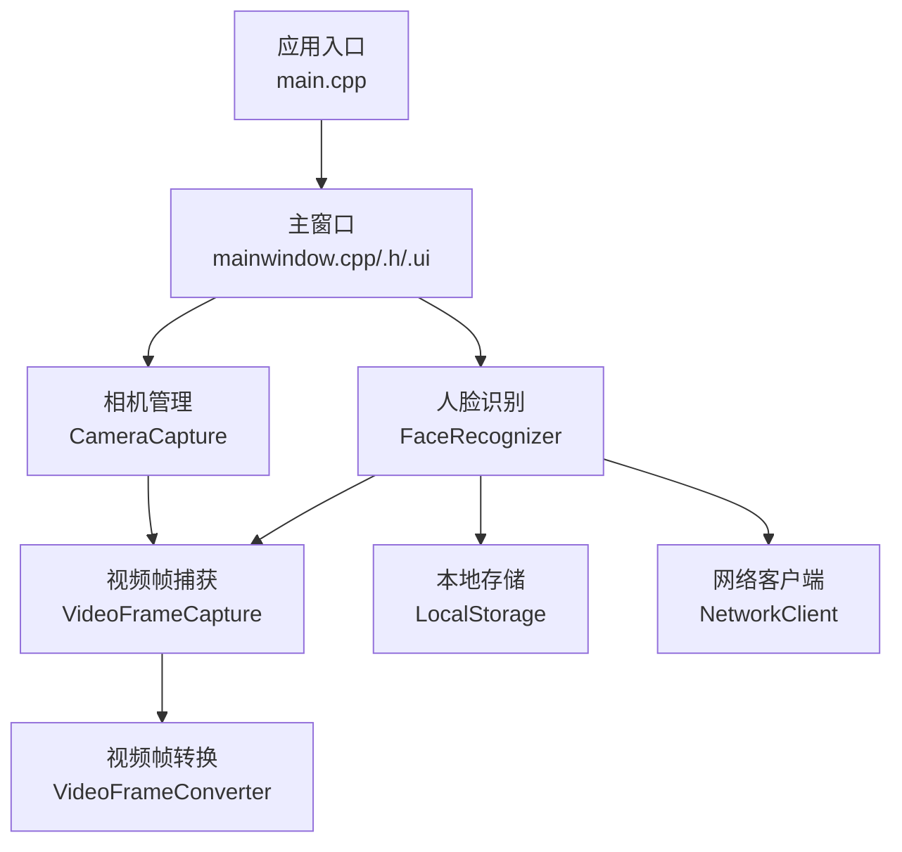
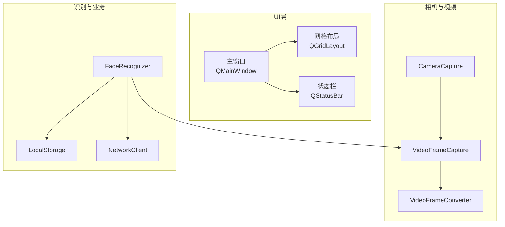
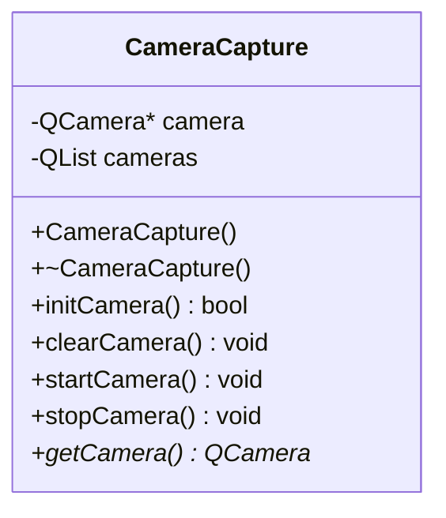
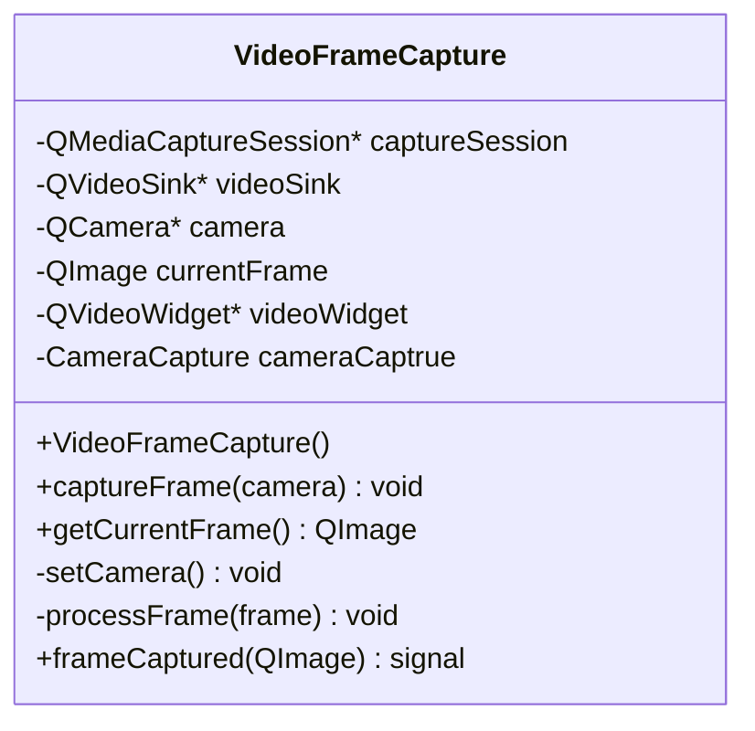
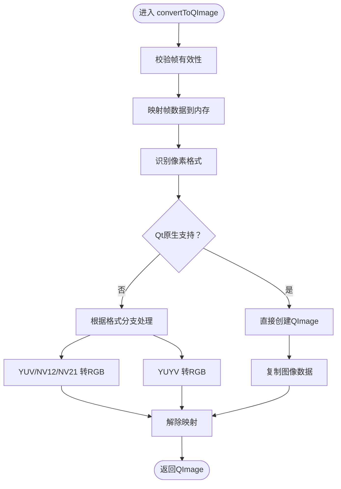
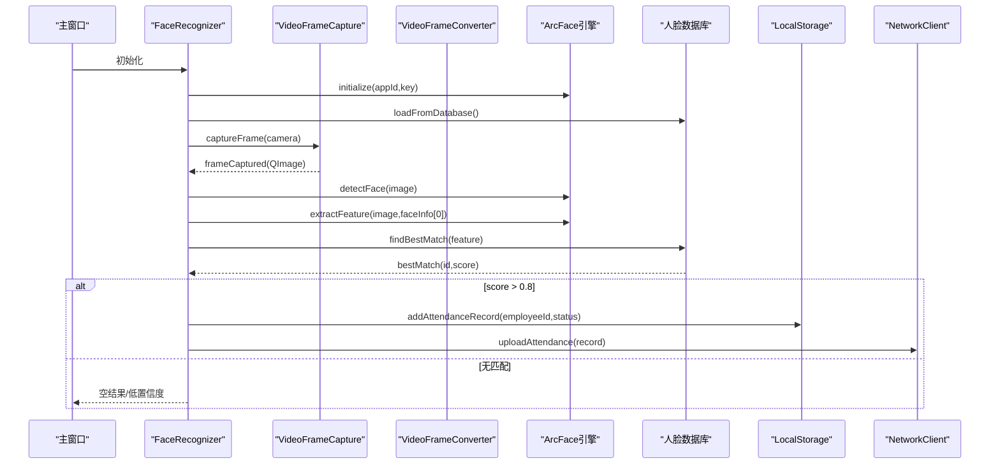
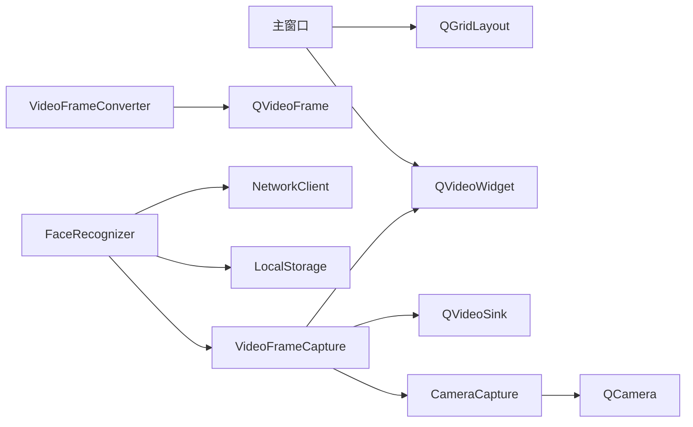

# 用户界面设计

<cite>
**本文引用的文件**
- [main.cpp](file://main.cpp)
- [mainwindow.h](file://mainwindow.h)
- [mainwindow.cpp](file://mainwindow.cpp)
- [mainwindow.ui](file://mainwindow.ui)
- [cameracapture.h](file://CameraCapture/cameracapture.h)
- [cameracapture.cpp](file://CameraCapture/cameracapture.cpp)
- [videoframecapture.h](file://CameraCapture/videoframecapture.h)
- [videoframecapture.cpp](file://CameraCapture/videoframecapture.cpp)
- [videoframeconverter.h](file://CameraCapture/videoframeconverter.h)
- [videoframeconverter.cpp](file://CameraCapture/videoframeconverter.cpp)
- [facerecognizer.h](file://FaceRecognition/facerecognizer.h)
- [facerecognizer.cpp](file://FaceRecognition/facerecognizer.cpp)
</cite>

## 目录
1. [简介](#简介)
2. [项目结构](#项目结构)
3. [核心组件](#核心组件)
4. [架构总览](#架构总览)
5. [详细组件分析](#详细组件分析)
6. [依赖关系分析](#依赖关系分析)
7. [性能考虑](#性能考虑)
8. [故障排查指南](#故障排查指南)
9. [结论](#结论)
10. [附录](#附录)

## 简介
本文件面向用户界面组件，系统化梳理考勤系统的主窗口布局、实时视频预览与人脸打卡业务流的UI设计理念与实现要点。文档覆盖以下方面：
- 视觉外观与布局：主窗口容器、网格布局、状态栏的组织方式
- 行为与交互：摄像头初始化、视频帧捕获与转换、人脸识别流程、状态提示与记录上传
- 属性、事件、槽与自定义选项：摄像头实例、视频帧信号、识别结果与相似度阈值
- 响应式设计与无障碍：基于Qt布局策略与可访问性建议
- 动画与过渡：当前未实现，建议采用Qt动画框架扩展
- 样式与主题：通过样式表与主题切换策略进行统一风格管理
- 跨浏览器/平台兼容：Qt跨平台特性与Windows控制台编码设置
- 组件组合与集成：主窗口与相机、视频帧、人脸识别模块的协作模式
- 设计理念：以“主窗口承载容器 + 实时预览 + 业务状态反馈”为核心

## 项目结构
项目采用Qt/C++工程，UI由UI文件定义，核心逻辑分布在多个模块中：
- 应用入口与主窗口：main.cpp、mainwindow.h/.cpp、mainwindow.ui
- 相机与视频：CameraCapture、VideoFrameCapture、VideoFrameConverter
- 人脸识别：FaceRecognizer（整合引擎、数据库、网络上传）
- 其他模块：LocalStorage、NetworkClient、CacheManager等（本文件聚焦UI相关）

图表来源
- [main.cpp:13-27](file://main.cpp#L13-L27)
- [mainwindow.cpp:3-7](file://mainwindow.cpp#L3-L7)
- [cameracapture.h:9-28](file://CameraCapture/cameracapture.h#L9-L28)
- [videoframecapture.h:14-42](file://CameraCapture/videoframecapture.h#L14-L42)
- [videoframeconverter.h:25-72](file://CameraCapture/videoframeconverter.h#L25-L72)
- [facerecognizer.h:25-58](file://FaceRecognition/facerecognizer.h#L25-L58)

章节来源
- [main.cpp:13-27](file://main.cpp#L13-L27)
- [mainwindow.ui:16-19](file://mainwindow.ui#L16-L19)

## 核心组件
- 主窗口（QMainWindow）
  - 中央部件采用网格布局，便于后续插入实时预览与控制面板
  - 状态栏用于展示运行状态与错误提示
- 相机管理（CameraCapture）
  - 负责枚举设备、初始化、启停摄像头
  - 对外提供QCamera指针，供视频捕获模块使用
- 视频帧捕获（VideoFrameCapture）
  - 通过QMediaCaptureSession与QVideoSink连接摄像头输出
  - 将QVideoFrame转换为QImage并通过信号向外发送
- 视频帧转换（VideoFrameConverter）
  - 自动识别像素格式，优先使用Qt原生转换；对YUV/NV12/NV21/YUYV等格式进行手动转换
- 人脸识别（FaceRecognizer）
  - 整合引擎初始化、人脸检测、特征提取、匹配与记录保存/上传
  - 通过信号槽与视频捕获模块联动，形成“帧到达 -> 识别 -> 结果上报”的闭环

章节来源
- [mainwindow.ui:16-19](file://mainwindow.ui#L16-L19)
- [cameracapture.h:9-28](file://CameraCapture/cameracapture.h#L9-L28)
- [videoframecapture.h:14-42](file://CameraCapture/videoframecapture.h#L14-L42)
- [videoframeconverter.h:25-72](file://CameraCapture/videoframeconverter.h#L25-L72)
- [facerecognizer.h:25-58](file://FaceRecognition/facerecognizer.h#L25-L58)

## 架构总览
下图展示了UI层与底层模块的交互关系，突出主窗口作为容器与协调者的角色。

图表来源
- [mainwindow.ui:16-19](file://mainwindow.ui#L16-L19)
- [cameracapture.h:9-28](file://CameraCapture/cameracapture.h#L9-L28)
- [videoframecapture.h:14-42](file://CameraCapture/videoframecapture.h#L14-L42)
- [videoframeconverter.h:25-72](file://CameraCapture/videoframeconverter.h#L25-L72)
- [facerecognizer.h:25-58](file://FaceRecognition/facerecognizer.h#L25-L58)

## 详细组件分析

### 主窗口（QMainWindow）
- 视觉外观
  - 几何尺寸在UI文件中定义，窗口标题可按需调整
  - 中央部件采用QGridLayout，适合放置预览控件与控制面板
  - 状态栏用于显示运行状态、错误或识别结果提示
- 行为与交互
  - 初始化时调用setupUi完成控件装配
  - 后续可通过网格布局动态插入视频预览控件与按钮
- 属性与事件
  - 可通过setWindowTitle、resize等标准QMainWindow属性控制外观
  - 状态栏可通过setText显示文本，结合样式表实现主题化
- 自定义选项
  - 可在UI文件中添加更多控件（按钮、标签、列表等），并将其加入网格布局

章节来源
- [mainwindow.ui:4-19](file://mainwindow.ui#L4-L19)
- [mainwindow.cpp:3-7](file://mainwindow.cpp#L3-L7)

### 相机管理（CameraCapture）
- 视觉外观
  - 该类为纯逻辑组件，不直接渲染UI
- 行为与交互
  - 枚举可用摄像头设备，实例化QCamera
  - 提供初始化、启停、释放接口，保证生命周期安全
- 属性与事件
  - 外部通过getCamera()获取QCamera指针
  - 错误场景（无设备、初始化失败）通过日志输出
- 自定义选项
  - 可扩展为多摄像头选择、分辨率/帧率配置（当前未实现）

图表来源
- [cameracapture.h:9-28](file://CameraCapture/cameracapture.h#L9-L28)

章节来源
- [cameracapture.cpp:15-33](file://CameraCapture/cameracapture.cpp#L15-L33)
- [cameracapture.cpp:48-65](file://CameraCapture/cameracapture.cpp#L48-L65)
- [cameracapture.cpp:68-71](file://CameraCapture/cameracapture.cpp#L68-L71)

### 视频帧捕获（VideoFrameCapture）
- 视觉外观
  - 通过QVideoWidget展示实时预览（当前实现中临时创建控件并显示）
- 行为与交互
  - 将QCamera与QMediaCaptureSession绑定，连接QVideoSink
  - 监听videoFrameChanged信号，转换为QImage并通过frameCaptured信号发出
- 属性与事件
  - 信号：frameCaptured(QImage)
  - 外部通过getCurrentFrame()获取最新帧（注意线程与互斥）
- 自定义选项
  - 可替换为QLabel+QPixmap或自绘控件以适配不同UI风格

图表来源
- [videoframecapture.h:14-42](file://CameraCapture/videoframecapture.h#L14-L42)

章节来源
- [videoframecapture.cpp:10-19](file://CameraCapture/videoframecapture.cpp#L10-L19)
- [videoframecapture.cpp:22-62](file://CameraCapture/videoframecapture.cpp#L22-L62)
- [videoframecapture.cpp:65-79](file://CameraCapture/videoframecapture.cpp#L65-L79)

### 视频帧转换（VideoFrameConverter）
- 视觉外观
  - 无UI组件，纯图像处理工具
- 行为与交互
  - 自动识别像素格式，优先Qt原生转换；对YUV/NV12/NV21/YUYV进行手动转换
  - 返回QImage供上层使用
- 属性与事件
  - 无信号/槽，静态方法直接返回结果
- 自定义选项
  - 可扩展支持更多格式或引入硬件加速路径（当前未实现）

图表来源
- [videoframeconverter.cpp:16-85](file://CameraCapture/videoframeconverter.cpp#L16-L85)
- [videoframeconverter.cpp:99-187](file://CameraCapture/videoframeconverter.cpp#L99-L187)
- [videoframeconverter.cpp:199-245](file://CameraCapture/videoframeconverter.cpp#L199-L245)

章节来源
- [videoframeconverter.cpp:16-85](file://CameraCapture/videoframeconverter.cpp#L16-L85)
- [videoframeconverter.cpp:99-187](file://CameraCapture/videoframeconverter.cpp#L99-L187)
- [videoframeconverter.cpp:199-245](file://CameraCapture/videoframeconverter.cpp#L199-L245)

### 人脸识别（FaceRecognizer）
- 视觉外观
  - 无UI组件，但其流程直接影响预览与状态提示
- 行为与交互
  - 初始化：加载引擎、数据库，初始化摄像头，启动视频捕获
  - 识别流程：检测人脸 -> 特征提取 -> 匹配 -> 保存本地记录 -> 上传网络
  - 结果：通过getFaceInfo/getFaceFeature/getbestMatch获取识别状态
- 属性与事件
  - 通过信号槽与VideoFrameCapture联动
  - 相似度阈值用于判定识别可信度
- 自定义选项
  - 可扩展为多阈值策略、多目标识别、结果可视化框（当前未实现）

图表来源
- [facerecognizer.cpp:20-51](file://FaceRecognition/facerecognizer.cpp#L20-L51)
- [facerecognizer.cpp:53-88](file://FaceRecognition/facerecognizer.cpp#L53-L88)
- [facerecognizer.h:25-58](file://FaceRecognition/facerecognizer.h#L25-L58)

章节来源
- [facerecognizer.cpp:20-51](file://FaceRecognition/facerecognizer.cpp#L20-L51)
- [facerecognizer.cpp:53-88](file://FaceRecognition/facerecognizer.cpp#L53-L88)
- [facerecognizer.h:25-58](file://FaceRecognition/facerecognizer.h#L25-L58)

## 依赖关系分析
- 主窗口依赖UI文件定义的布局与控件
- 相机管理依赖Qt多媒体模块（QCamera、QMediaDevices）
- 视频帧捕获依赖QMediaCaptureSession、QVideoSink、QVideoWidget
- 视频帧转换依赖QVideoFrameFormat与QImage
- 人脸识别依赖相机、引擎、数据库与网络模块

图表来源
- [mainwindow.ui:16-19](file://mainwindow.ui#L16-L19)
- [cameracapture.h:23](file://CameraCapture/cameracapture.h#L23)
- [videoframecapture.h:29-34](file://CameraCapture/videoframecapture.h#L29-L34)
- [videoframeconverter.h:4](file://CameraCapture/videoframeconverter.h#L4)
- [facerecognizer.h:10-11](file://FaceRecognition/facerecognizer.h#L10-L11)

章节来源
- [mainwindow.ui:16-19](file://mainwindow.ui#L16-L19)
- [cameracapture.h:23](file://CameraCapture/cameracapture.h#L23)
- [videoframecapture.h:29-34](file://CameraCapture/videoframecapture.h#L29-L34)
- [videoframeconverter.h:4](file://CameraCapture/videoframeconverter.h#L4)
- [facerecognizer.h:10-11](file://FaceRecognition/facerecognizer.h#L10-L11)

## 性能考虑
- 帧格式与转换
  - 优先使用Qt原生支持的像素格式，避免手动转换开销
  - 对YUV/NV12/NV21/YUYV等格式进行逐像素转换，注意内存拷贝与边界检查
- 线程与同步
  - 视频帧信号来自底层回调线程，建议在主线程中消费并避免长时间阻塞UI
  - 使用互斥锁保护共享数据（如识别结果）
- 资源管理
  - 相机启停与释放需成对调用，防止资源泄漏
  - QVideoWidget的生命周期与显示时机需谨慎处理
- 识别阈值
  - 相似度阈值过高导致漏检，过低导致误检，需结合实际场景调优

## 故障排查指南
- 无可用摄像头
  - 现象：初始化失败并输出日志
  - 排查：确认设备枚举、权限与驱动
  - 参考路径：[cameracapture.cpp:18-21](file://CameraCapture/cameracapture.cpp#L18-L21)
- 帧无效或无法映射
  - 现象：转换失败并输出警告
  - 排查：检查帧格式、尺寸与映射状态
  - 参考路径：[videoframeconverter.cpp:19-30](file://CameraCapture/videoframeconverter.cpp#L19-L30)
- 识别结果为空或低置信度
  - 现象：无匹配或score<=阈值
  - 排查：确认人脸检测、特征提取与数据库匹配流程
  - 参考路径：[facerecognizer.cpp:59-62](file://FaceRecognition/facerecognizer.cpp#L59-L62)、[facerecognizer.cpp:71-71](file://FaceRecognition/facerecognizer.cpp#L71-L71)
- 状态栏提示
  - 建议在主窗口状态栏显示简要状态（如“识别中”、“上传成功/失败”）

## 结论
本UI设计以“主窗口容器 + 实时预览 + 业务状态反馈”为核心，通过模块化拆分实现了相机、视频帧处理与人脸识别的解耦。当前实现聚焦功能完整性与可维护性，未来可在样式主题、动画过渡、结果可视化框等方面进一步增强用户体验。

## 附录

### 使用示例（步骤说明）
- 在主窗口网格布局中插入视频预览控件（参考路径：[mainwindow.ui:17](file://mainwindow.ui#L17)）
- 初始化相机与视频捕获（参考路径：[cameracapture.cpp:15-33](file://CameraCapture/cameracapture.cpp#L15-L33)、[videoframecapture.cpp:10-19](file://CameraCapture/videoframecapture.cpp#L10-L19)）
- 连接帧信号并更新UI（参考路径：[videoframecapture.cpp:60](file://CameraCapture/videoframecapture.cpp#L60)）
- 启动人脸识别流程（参考路径：[facerecognizer.cpp:20-51](file://FaceRecognition/facerecognizer.cpp#L20-L51)）

### 响应式设计与无障碍建议
- 响应式设计
  - 使用QGridLayout自适应窗口大小变化，预留给预览区域固定比例
  - 控制面板采用QFormLayout或QVBoxLayout，保证在小屏下仍可滚动阅读
- 无障碍访问
  - 为按钮与状态栏提供可读性标签与键盘快捷键
  - 状态栏文本可配合屏幕阅读器朗读

### 样式自定义与主题支持
- 建议通过样式表（QSS）统一控件风格，支持浅色/深色主题切换
- 主题切换时更新控件颜色、边框与图标

### 跨浏览器/平台兼容性
- 平台差异
  - Windows控制台编码设置已在入口处处理（参考路径：[main.cpp:15-19](file://main.cpp#L15-L19)）
- 浏览器无关
  - 本项目为桌面应用，不涉及浏览器兼容问题