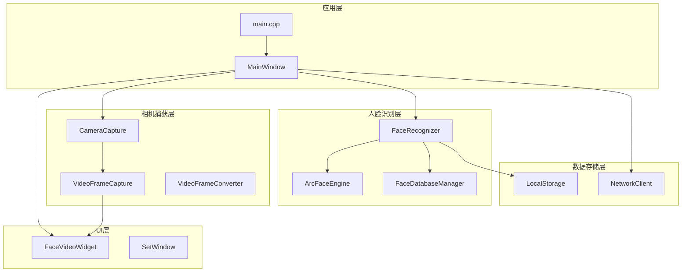
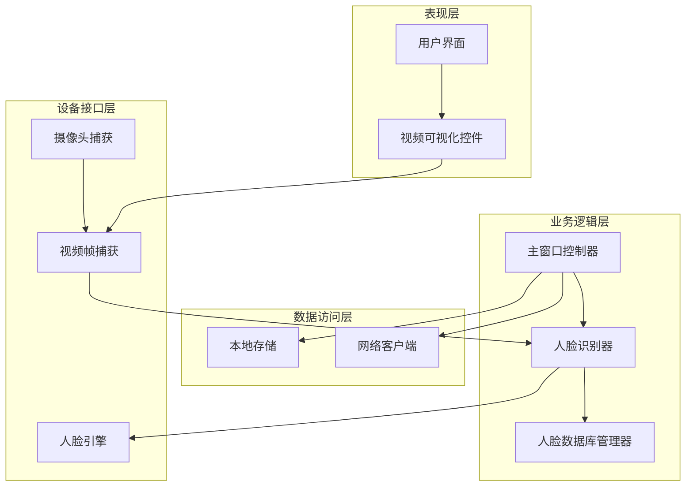
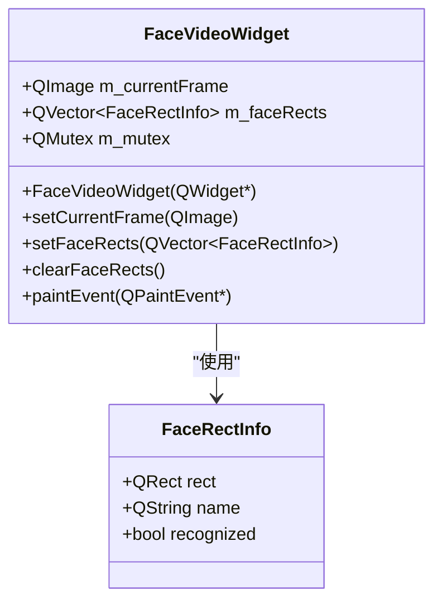
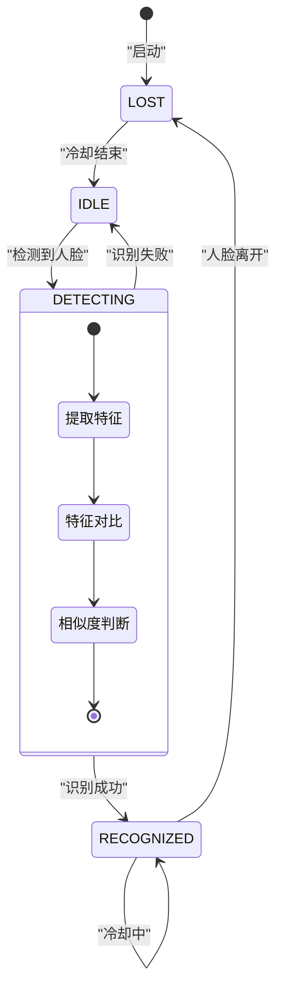
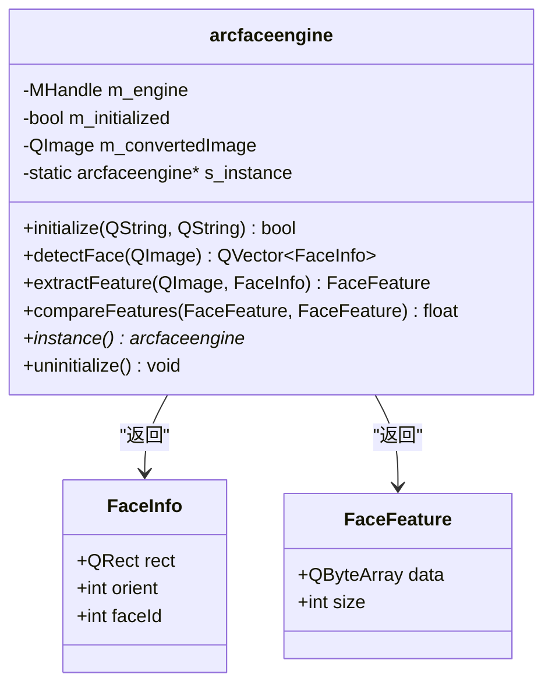
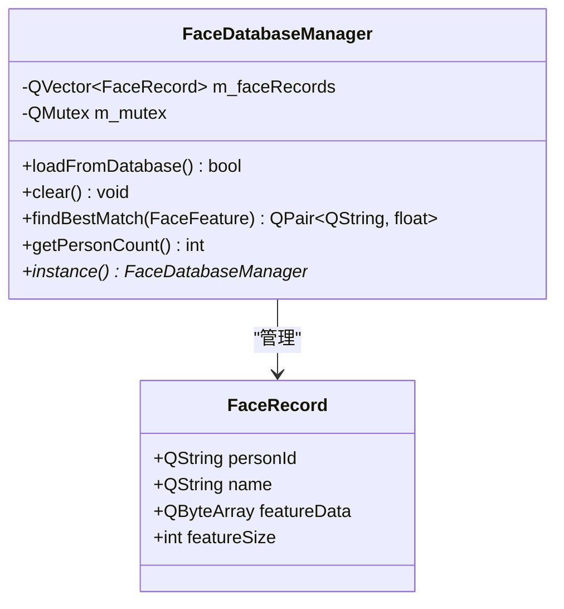
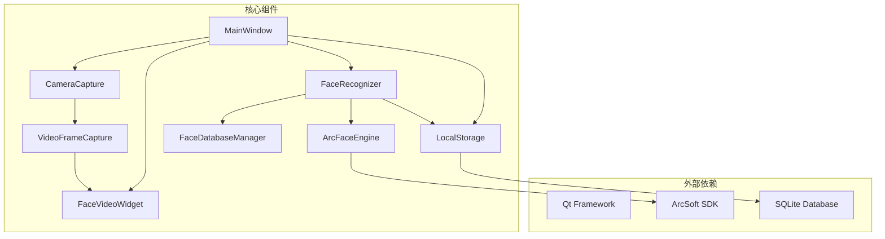

# 人脸视频可视化组件

<cite>
**本文档引用的文件**
- [main.cpp](file://main.cpp)
- [mainwindow.h](file://mainwindow.h)
- [mainwindow.cpp](file://mainwindow.cpp)
- [UI/facevideowidget.h](file://UI/facevideowidget.h)
- [UI/facevideowidget.cpp](file://UI/facevideowidget.cpp)
- [CameraCapture/cameracapture.h](file://CameraCapture/cameracapture.h)
- [CameraCapture/cameracapture.cpp](file://CameraCapture/cameracapture.cpp)
- [CameraCapture/videoframecapture.h](file://CameraCapture/videoframecapture.h)
- [CameraCapture/videoframecapture.cpp](file://CameraCapture/videoframecapture.cpp)
- [FaceRecognition/arcfaceengine.h](file://FaceRecognition/arcfaceengine.h)
- [FaceRecognition/arcfaceengine.cpp](file://FaceRecognition/arcfaceengine.cpp)
- [FaceRecognition/facerecognizer.h](file://FaceRecognition/facerecognizer.h)
- [FaceRecognition/facerecognizer.cpp](file://FaceRecognition/facerecognizer.cpp)
- [FaceRecognition/facedatabasemanager.h](file://FaceRecognition/facedatabasemanager.h)
- [FaceRecognition/facedatabasemanager.cpp](file://FaceRecognition/facedatabasemanager.cpp)
- [LocalStorage/localstorage.h](file://LocalStorage/localstorage.h)
- [LocalStorage/localstorage.cpp](file://LocalStorage/localstorage.cpp)
</cite>

## 更新摘要
**变更内容**
- 更新FaceVideoWidget组件分析，反映从QVideoWidget到QWidget的继承变更
- 新增自定义paintEvent实现的详细说明
- 增强线程安全机制的文档描述
- 更新架构图以反映新的组件关系

## 目录
1. [简介](#简介)
2. [项目结构](#项目结构)
3. [核心组件](#核心组件)
4. [架构概览](#架构概览)
5. [详细组件分析](#详细组件分析)
6. [依赖关系分析](#依赖关系分析)
7. [性能考虑](#性能考虑)
8. [故障排除指南](#故障排除指南)
9. [结论](#结论)

## 简介

人脸视频可视化组件是一个基于Qt框架开发的智能考勤系统，专门用于实时人脸检测和识别。该系统集成了摄像头捕获、人脸检测、特征提取、特征对比和可视化显示等多个功能模块，为用户提供完整的视频人脸可视化解决方案。

该组件采用模块化设计，通过清晰的接口分离各个功能模块，实现了高内聚、低耦合的架构。系统支持多线程处理，确保UI界面的流畅性和人脸识别的实时性。

**更新** 系统架构经过重大优化，FaceVideoWidget组件从继承QVideoWidget改为直接继承QWidget，新增了自定义绘制功能和完善的线程安全机制。

## 项目结构

项目采用按功能模块划分的组织结构，主要包含以下核心模块：

**图表来源**
- [main.cpp:12-45](file://main.cpp#L12-L45)
- [mainwindow.h:22-94](file://mainwindow.h#L22-L94)
- [mainwindow.cpp:59-112](file://mainwindow.cpp#L59-L112)

**章节来源**
- [main.cpp:12-45](file://main.cpp#L12-L45)
- [mainwindow.h:22-94](file://mainwindow.h#L22-L94)
- [mainwindow.cpp:59-112](file://mainwindow.cpp#L59-L112)

## 核心组件

### 主窗口组件 (MainWindow)

MainWindow作为应用程序的主控制器，负责协调各个子系统的运行。它管理着摄像头初始化、人脸识别引擎配置、UI界面更新以及网络通信等功能。

**主要职责：**
- 初始化和配置各个子系统
- 管理多线程环境下的组件协作
- 处理用户界面交互
- 实现业务逻辑的协调控制

### 视频可视化组件 (FaceVideoWidget)

**更新** FaceVideoWidget是专门用于视频画面显示和人脸框绘制的自定义控件。该组件经过重大重构，从继承QVideoWidget改为直接继承QWidget，实现了更加灵活和高效的视频显示方案。

**核心功能：**
- 实时显示摄像头捕获的视频帧
- 自定义绘制人脸检测框和识别结果
- 支持图像缩放和居中显示
- 线程安全的数据访问机制
- 抗锯齿渲染提升视觉效果

**更新** 新增的自定义绘制功能包括：
- 使用QPainter进行人脸框叠加绘制
- 支持绿色（识别成功）和红色（识别失败）不同颜色的人脸框
- 实现姓名标签的绘制和显示
- 智能坐标转换确保人脸框与实际位置匹配

### 相机捕获组件 (CameraCapture & VideoFrameCapture)

相机捕获系统负责从物理摄像头获取视频流，并将其转换为应用程序可用的图像格式。

**CameraCapture职责：**
- 设备发现和初始化
- 摄像头生命周期管理
- 基础设备控制

**VideoFrameCapture职责：**
- 视频帧捕获和处理
- 图像格式转换
- 实时视频流输出

### 人脸识别组件 (FaceRecognizer)

FaceRecognizer是系统的核心业务逻辑组件，实现了完整的人脸识别工作流程。

**主要特性：**
- 状态机驱动的识别流程
- 多线程异步处理
- 相似度阈值控制
- 防重复识别机制

**章节来源**
- [mainwindow.h:22-94](file://mainwindow.h#L22-L94)
- [mainwindow.cpp:59-112](file://mainwindow.cpp#L59-L112)
- [UI/facevideowidget.h:18-41](file://UI/facevideowidget.h#L18-L41)
- [UI/facevideowidget.cpp:3-105](file://UI/facevideowidget.cpp#L3-L105)
- [CameraCapture/cameracapture.h:9-28](file://CameraCapture/cameracapture.h#L9-L28)
- [CameraCapture/cameracapture.cpp:13-71](file://CameraCapture/cameracapture.cpp#L13-L71)
- [CameraCapture/videoframecapture.h:13-42](file://CameraCapture/videoframecapture.h#L13-L42)
- [CameraCapture/videoframecapture.cpp:8-60](file://CameraCapture/videoframecapture.cpp#L8-L60)
- [FaceRecognition/facerecognizer.h:35-104](file://FaceRecognition/facerecognizer.h#L35-L104)
- [FaceRecognition/facerecognizer.cpp:4-254](file://FaceRecognition/facerecognizer.cpp#L4-L254)

## 架构概览

**更新** 系统采用分层架构设计，各层之间通过清晰的接口进行通信，实现了良好的模块化和可维护性。经过重构后，FaceVideoWidget组件的架构更加清晰。

**图表来源**
- [mainwindow.cpp:114-166](file://mainwindow.cpp#L114-L166)
- [FaceRecognition/facerecognizer.cpp:25-43](file://FaceRecognition/facerecognizer.cpp#L25-L43)
- [FaceRecognition/facedatabasemanager.cpp:15-49](file://FaceRecognition/facedatabasemanager.cpp#L15-L49)

系统采用事件驱动和信号槽机制实现组件间的松耦合通信，通过多线程技术确保系统的实时性和响应性。

**章节来源**
- [mainwindow.cpp:114-166](file://mainwindow.cpp#L114-L166)
- [FaceRecognition/facerecognizer.cpp:25-43](file://FaceRecognition/facerecognizer.cpp#L25-L43)

## 详细组件分析

### FaceVideoWidget 组件分析

**更新** FaceVideoWidget是一个专门用于视频显示和人脸框绘制的自定义控件，经过重大重构实现了从QVideoWidget到QWidget的继承变更，并新增了完善的自定义绘制功能和线程安全机制。

**图表来源**
- [UI/facevideowidget.h:12-41](file://UI/facevideowidget.h#L12-L41)
- [UI/facevideowidget.cpp:3-105](file://UI/facevideowidget.cpp#L3-L105)

**核心实现特点：**

1. **继承关系重构**：从QVideoWidget改为QWidget，提供更灵活的自定义绘制能力
2. **线程安全设计**：使用QMutex确保多线程环境下数据访问的安全性
3. **智能缩放算法**：自动计算图像缩放比例，保持宽高比不变
4. **自定义绘制功能**：使用QPainter实现人脸框叠加绘制
5. **实时绘制优化**：采用抗锯齿渲染提升视觉效果
6. **坐标系转换**：实现图像坐标到控件坐标的精确转换

**更新** 新增的绘制功能包括：
- 支持绿色（识别成功）和红色（识别失败）不同颜色的人脸框
- 实现姓名标签的绘制和显示
- 黑色背景填充确保人脸框的可见性
- 抗锯齿渲染提升边框质量

**章节来源**
- [UI/facevideowidget.h:12-41](file://UI/facevideowidget.h#L12-L41)
- [UI/facevideowidget.cpp:35-105](file://UI/facevideowidget.cpp#L35-L105)

### FaceRecognizer 状态机分析

FaceRecognizer实现了复杂的状态机来管理人脸识别的完整流程，确保系统在不同状态下能够正确处理各种情况。

**图表来源**
- [FaceRecognition/facerecognizer.cpp:78-133](file://FaceRecognition/facerecognizer.cpp#L78-L133)

**状态机详细流程：**

1. **IDLE状态**：等待检测到人脸，执行人脸检测
2. **DETECTING状态**：正在进行识别处理，跳过新帧
3. **RECOGNIZED状态**：识别成功，检查人脸是否仍在画面中
4. **LOST状态**：人脸丢失，准备重置

**章节来源**
- [FaceRecognition/facerecognizer.cpp:46-214](file://FaceRecognition/facerecognizer.cpp#L46-L214)

### ArcFaceEngine 引擎分析

ArcFaceEngine是对虹软AI人脸SDK的封装，提供了完整的人脸检测和识别功能。

**图表来源**
- [FaceRecognition/arcfaceengine.h:21-112](file://FaceRecognition/arcfaceengine.h#L21-L112)
- [FaceRecognition/arcfaceengine.cpp:31-79](file://FaceRecognition/arcfaceengine.cpp#L31-L79)

**核心功能实现：**

1. **单例模式**：确保全局只有一个引擎实例
2. **图像格式转换**：处理Qt QImage与SDK格式的兼容性
3. **内存对齐处理**：满足SDK对图像宽度的4字节对齐要求
4. **线程安全**：使用互斥锁保护共享资源

**章节来源**
- [FaceRecognition/arcfaceengine.h:21-112](file://FaceRecognition/arcfaceengine.h#L21-L112)
- [FaceRecognition/arcfaceengine.cpp:97-180](file://FaceRecognition/arcfaceengine.cpp#L97-L180)

### 数据库管理系统分析

FaceDatabaseManager负责管理人脸特征数据的加载、存储和查询操作。

**图表来源**
- [FaceRecognition/facedatabasemanager.h:9-44](file://FaceRecognition/facedatabasemanager.h#L9-L44)
- [FaceRecognition/facedatabasemanager.cpp:15-95](file://FaceRecognition/facedatabasemanager.cpp#L15-L95)

**数据库操作流程：**

1. **特征加载**：启动时从SQLite数据库加载所有人员特征
2. **内存管理**：将特征数据存储在内存中提高查询效率
3. **快速匹配**：使用1:N对比算法找到最佳匹配
4. **线程安全**：使用互斥锁保护并发访问

**章节来源**
- [FaceRecognition/facedatabasemanager.h:9-44](file://FaceRecognition/facedatabasemanager.h#L9-L44)
- [FaceRecognition/facedatabasemanager.cpp:58-88](file://FaceRecognition/facedatabasemanager.cpp#L58-L88)

## 依赖关系分析

**更新** 系统中的组件依赖关系体现了清晰的层次结构和模块化设计。经过重构后，FaceVideoWidget组件的依赖关系更加明确。

**图表来源**
- [mainwindow.cpp:82-89](file://mainwindow.cpp#L82-L89)
- [FaceRecognition/arcfaceengine.cpp:31-62](file://FaceRecognition/arcfaceengine.cpp#L31-L62)
- [LocalStorage/localstorage.cpp:61-136](file://LocalStorage/localstorage.cpp#L61-L136)

**依赖关系特点：**

1. **单向依赖**：上层组件依赖下层组件，但下层组件不依赖上层组件
2. **接口隔离**：通过清晰的接口定义实现模块间解耦
3. **第三方库集成**：通过适配层封装第三方SDK的复杂性
4. **组件解耦**：FaceVideoWidget与VideoFrameCapture通过信号槽机制松耦合通信

**章节来源**
- [mainwindow.cpp:82-89](file://mainwindow.cpp#L82-L89)
- [FaceRecognition/arcfaceengine.cpp:31-62](file://FaceRecognition/arcfaceengine.cpp#L31-L62)

## 性能考虑

**更新** 系统在设计时充分考虑了性能优化，采用了多种策略确保实时性和响应性。经过重构后，性能优化策略更加完善。

### 多线程架构优化

系统采用多线程设计，将CPU密集型任务与UI线程分离：

1. **人脸识别线程**：独立处理人脸检测和识别任务
2. **网络通信线程**：异步处理网络请求和数据传输
3. **UI线程**：专注于界面响应和用户交互

### 内存管理优化

1. **特征数据缓存**：将人脸特征数据加载到内存中，避免频繁数据库访问
2. **图像格式转换**：优化图像格式转换过程，减少内存复制
3. **资源释放**：确保所有动态分配的资源都能正确释放

### 算法优化策略

1. **相似度阈值控制**：通过配置参数调整识别精度和速度的平衡
2. **防重复识别机制**：避免短时间内重复识别同一人
3. **冷却时间管理**：合理设置识别间隔，提高系统稳定性

**更新** 新增的性能优化：
- **线程安全优化**：使用QMutexLocker简化互斥锁使用，减少锁竞争
- **绘制性能优化**：自定义绘制避免硬件渲染层覆盖，提升绘制效率
- **内存访问优化**：使用QMutex保护共享数据，避免数据竞争

## 故障排除指南

### 常见问题及解决方案

**摄像头无法初始化**
- 检查摄像头设备权限设置
- 确认摄像头驱动程序正确安装
- 验证摄像头设备是否被其他程序占用

**人脸识别失败**
- 检查光线条件是否充足
- 确认人脸是否完全进入检测框
- 调整相似度阈值参数

**图像显示异常**
- 检查显示器分辨率设置
- 确认视频格式转换是否正确
- 验证OpenGL硬件加速设置

**更新** 新增的故障排除：
- **人脸框绘制异常**：检查paintEvent中的坐标转换逻辑
- **线程安全问题**：确认QMutexLocker的正确使用
- **自定义绘制失效**：验证QPainter的设置和绘制命令

**章节来源**
- [CameraCapture/cameracapture.cpp:14-32](file://CameraCapture/cameracapture.cpp#L14-L32)
- [FaceRecognition/facerecognizer.cpp:136-196](file://FaceRecognition/facerecognizer.cpp#L136-L196)
- [UI/facevideowidget.cpp:47-50](file://UI/facevideowidget.cpp#L47-L50)

### 调试和监控

系统提供了丰富的调试信息输出，帮助开发者定位问题：

1. **日志输出**：详细记录系统运行状态和错误信息
2. **状态监控**：实时显示各组件的工作状态
3. **性能指标**：监控识别速度和资源使用情况
4. **线程安全监控**：通过QMutexLocker确认互斥锁使用正确

## 结论

**更新** 人脸视频可视化组件是一个设计精良、功能完整的人脸识别系统。经过重大重构后，系统在架构设计、性能优化和用户体验方面都有显著提升。

**主要优势：**
- 清晰的分层架构设计
- 完善的多线程处理机制
- 线程安全的组件实现
- 友好的用户界面设计
- 稳定可靠的识别算法
- **自定义绘制功能**：支持人脸框叠加绘制，提升可视化效果

**技术亮点：**
- 基于Qt框架的跨平台兼容性
- 集成虹软AI SDK的专业级识别能力
- SQLite数据库的本地数据存储
- 网络通信的云端数据同步
- **灵活的组件架构**：从QVideoWidget到QWidget的重构提升了组件的灵活性
- **完善的线程安全机制**：确保多线程环境下的稳定运行

**更新** 重构后的FaceVideoWidget组件具有以下技术特色：
- **自定义绘制能力**：直接继承QWidget，提供更灵活的绘制控制
- **线程安全设计**：使用QMutex和QMutexLocker确保数据访问安全
- **高效的人脸框绘制**：支持多种颜色和样式的绘制选项
- **智能坐标转换**：精确的人脸框位置映射

该系统为智能考勤、门禁控制等应用场景提供了可靠的技术解决方案，具有良好的实用价值和推广前景。