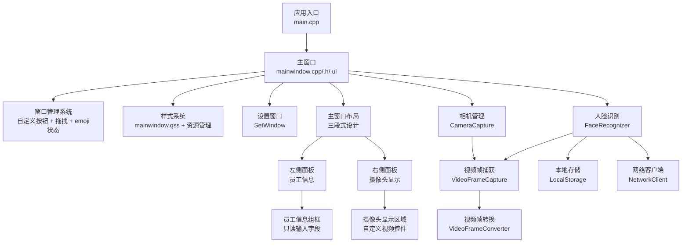
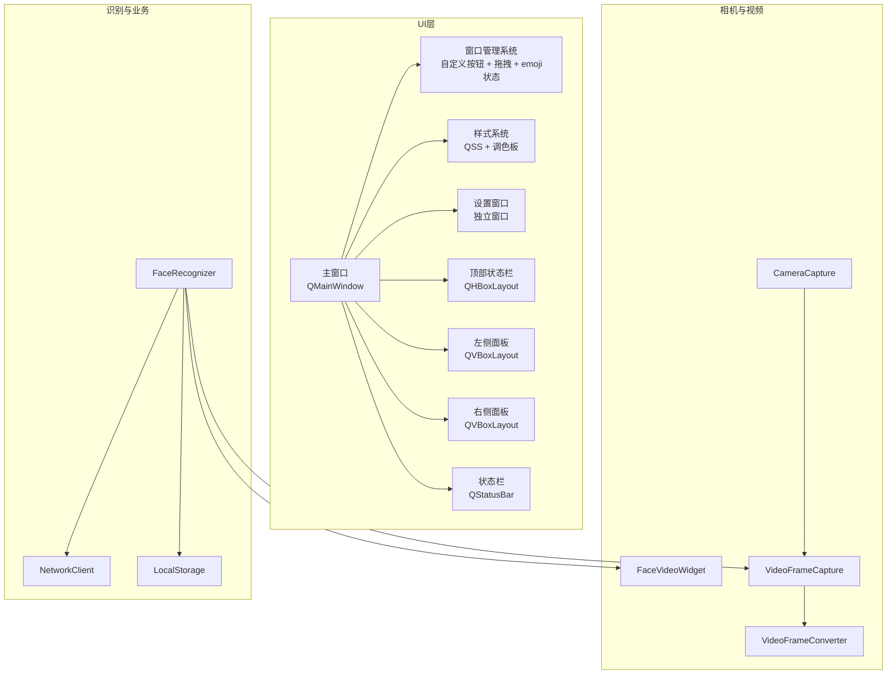
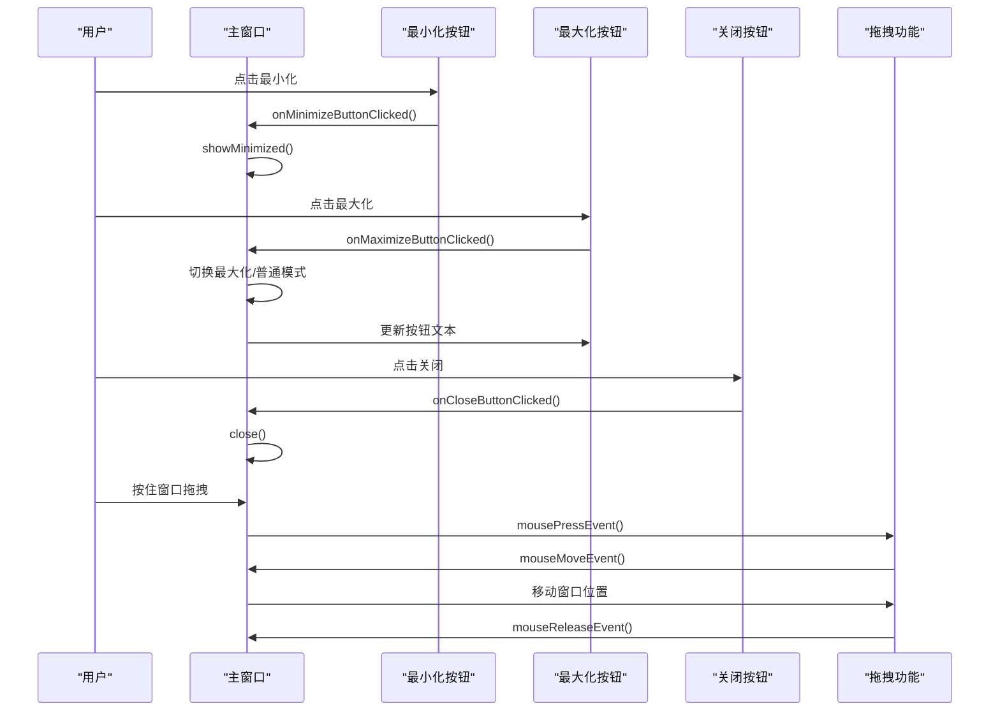
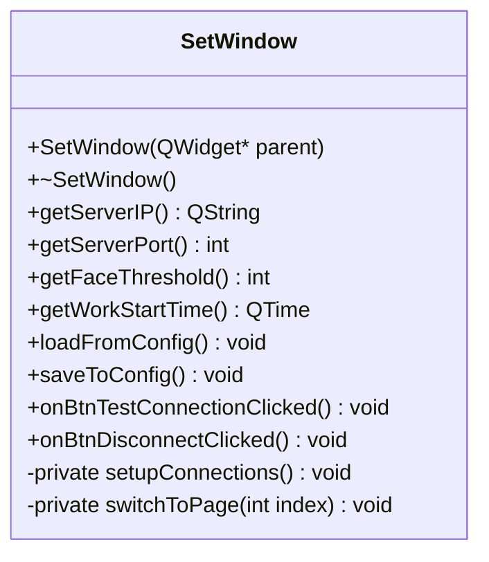
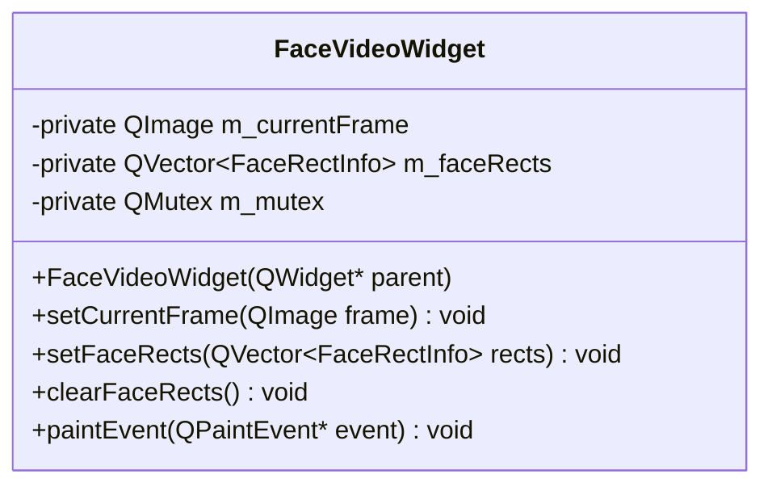
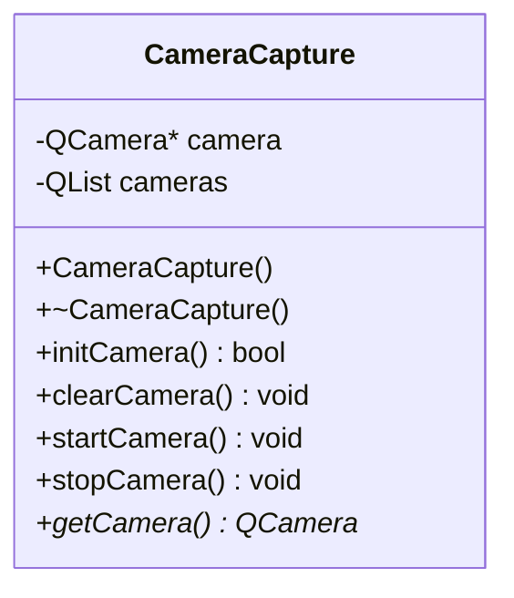
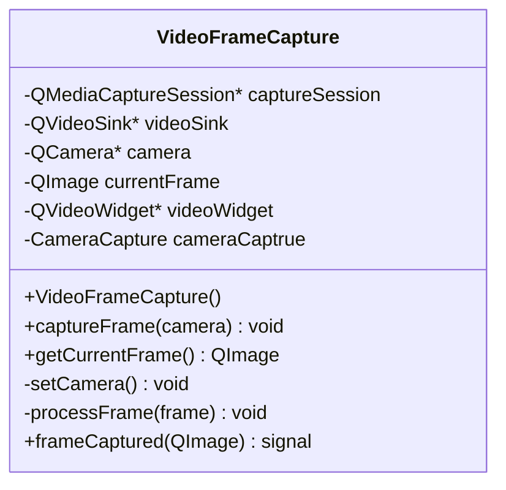
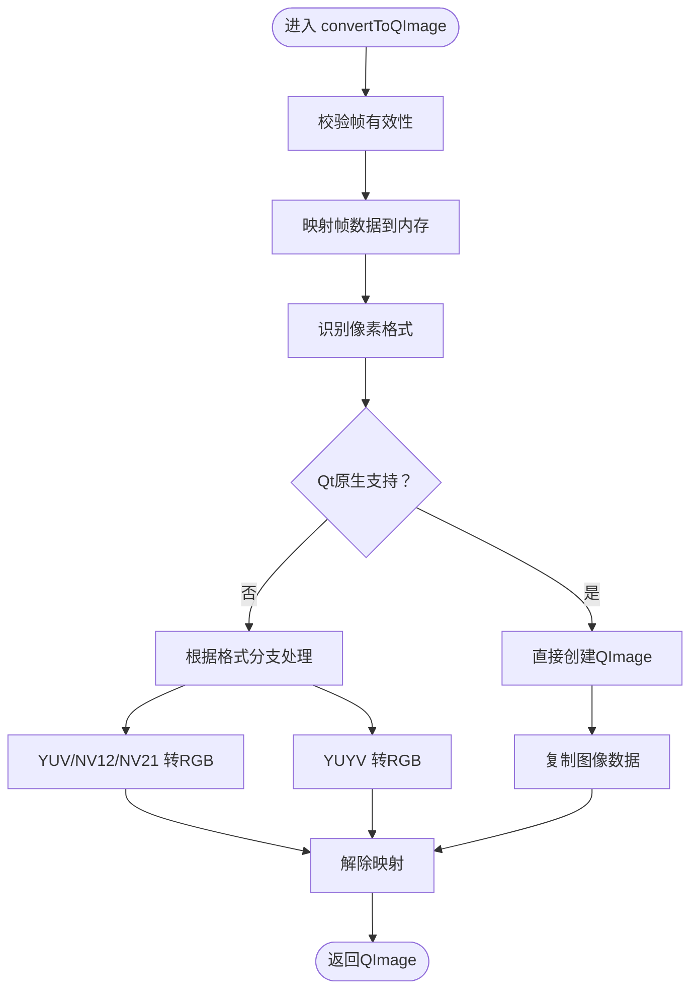
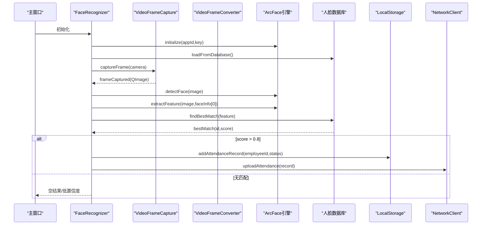
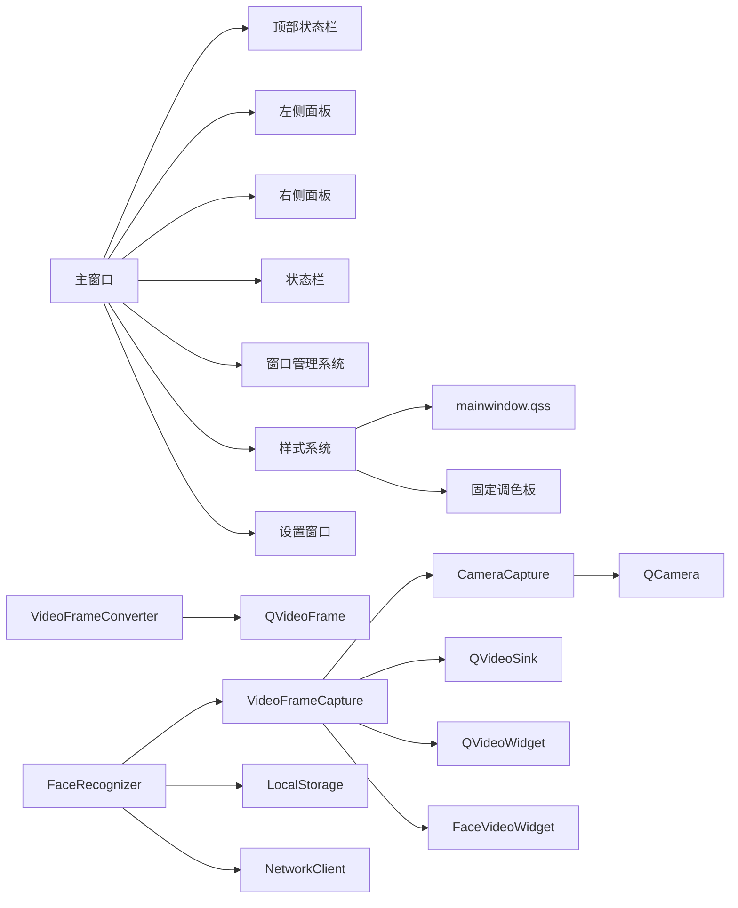

# 用户界面设计

<cite>
**本文档引用的文件**
- [main.cpp](file://main.cpp)
- [mainwindow.h](file://mainwindow.h)
- [mainwindow.cpp](file://mainwindow.cpp)
- [mainwindow.ui](file://mainwindow.ui)
- [mainwindow.qss](file://resources/qss/mainwindow.qss)
- [resources.qrc](file://resources/resources.qrc)
- [facevideowidget.h](file://UI/facevideowidget.h)
- [facevideowidget.cpp](file://UI/facevideowidget.cpp)
- [setwindow.h](file://UI/setwindow.h)
- [setwindow.cpp](file://UI/setwindow.cpp)
- [setwindow.ui](file://UI/setwindow.ui)
- [cameracapture.h](file://CameraCapture/cameracapture.h)
- [cameracapture.cpp](file://CameraCapture/cameracapture.cpp)
- [videoframecapture.h](file://CameraCapture/videoframecapture.h)
- [videoframecapture.cpp](file://CameraCapture/videoframecapture.cpp)
- [videoframeconverter.h](file://CameraCapture/videoframeconverter.h)
- [videoframeconverter.cpp](file://CameraCapture/videoframeconverter.cpp)
- [facerecognizer.h](file://FaceRecognition/facerecognizer.h)
- [facerecognizer.cpp](file://FaceRecognition/facerecognizer.cpp)
</cite>

## 更新摘要
**所做更改**
- 全面升级为现代化深色科技风主题，采用全新的QSS样式系统
- 实现完全自定义的窗口控制按钮，支持emoji状态指示器
- 新增无边框窗口拖拽功能，提供流畅的窗口操作体验
- 优化摄像头显示区域，使用FaceVideoWidget进行人脸框绘制
- 统一的深色主题配色方案，包括#0d1117背景、#161b22面板、#00d4ff强调色
- 增强的网络状态显示，使用emoji符号直观表示连接状态
- 完善的样式表管理，支持按钮悬停、按下状态的视觉反馈

## 目录
1. [简介](#简介)
2. [项目结构](#项目结构)
3. [核心组件](#核心组件)
4. [架构总览](#架构总览)
5. [详细组件分析](#详细组件分析)
6. [依赖关系分析](#依赖关系分析)
7. [性能考虑](#性能考虑)
8. [故障排查指南](#故障排查指南)
9. [结论](#结论)
10. [附录](#附录)

## 简介
本文档面向用户界面组件，系统化梳理考勤系统的主窗口布局、实时视频预览与人脸打卡业务流的UI设计理念与实现要点。经过全面的现代化改造后，系统从传统的浅色主题升级为深色科技风主题，采用全新的QSS样式系统，实现了更加现代化和专业的用户界面。文档覆盖以下方面：
- 视觉外观与布局：深色科技风主题、三段式布局、顶部状态栏的组织方式
- 行为与交互：摄像头初始化、视频帧捕获与转换、人脸识别流程、状态提示与记录上传
- 属性、事件、槽与自定义选项：摄像头实例、视频帧信号、识别结果与相似度阈值
- 响应式设计与无障碍：基于Qt布局策略与可访问性建议
- 动画与过渡：当前未实现，建议采用Qt动画框架扩展
- 样式与主题：通过QSS样式表与主题切换策略进行统一风格管理
- 跨浏览器/平台兼容：Qt跨平台特性与Windows控制台编码设置
- 组件组合与集成：主窗口与相机、视频帧、人脸识别模块的协作模式
- 设计理念：以"深色科技风 + 无边框窗口 + 自定义控制按钮 + 实时预览 + 网络状态指示"为核心

## 项目结构
项目采用Qt/C++工程，UI由UI文件定义，核心逻辑分布在多个模块中：
- 应用入口与主窗口：main.cpp、mainwindow.h/.cpp、mainwindow.ui
- 窗口管理系统：自定义窗口控制按钮、无边框拖拽功能、emoji网络状态指示器
- 样式系统：mainwindow.qss样式表、resources.qrc资源管理
- 设置窗口：SetWindow组件，提供系统配置管理界面
- 相机与视频：CameraCapture、VideoFrameCapture、VideoFrameConverter
- 人脸识别：FaceRecognizer（整合引擎、数据库、网络上传）
- 自定义视频控件：FaceVideoWidget，用于人脸框绘制
- 其他模块：LocalStorage、NetworkClient、CacheManager等（本文件聚焦UI相关）

**图表来源**
- [main.cpp:15-75](file://main.cpp#L15-L75)
- [mainwindow.cpp:9-51](file://mainwindow.cpp#L9-L51)
- [mainwindow.ui:16-243](file://mainwindow.ui#L16-L243)
- [mainwindow.qss:1-266](file://resources/qss/mainwindow.qss#L1-L266)
- [setwindow.h:12-137](file://UI/setwindow.h#L12-L137)
- [cameracapture.h:9-28](file://CameraCapture/cameracapture.h#L9-L28)
- [videoframecapture.h:14-42](file://CameraCapture/videoframecapture.h#L14-L42)
- [videoframeconverter.h:25-72](file://CameraCapture/videoframeconverter.h#L25-L72)
- [facerecognizer.h:25-58](file://FaceRecognition/facerecognizer.h#L25-L58)

**章节来源**
- [main.cpp:15-75](file://main.cpp#L15-L75)
- [mainwindow.ui:16-243](file://mainwindow.ui#L16-L243)

## 核心组件
- 主窗口（QMainWindow）
  - 几何尺寸扩展至1299x892，采用垂直布局组织顶部状态栏和中心内容区域
  - 顶部状态栏包含时间显示、emoji网络状态、设置按钮和自定义窗口控制按钮
  - 中心区域采用水平布局分为左侧面板（员工信息）和右侧面板（摄像头显示）
  - 状态栏用于展示运行状态与错误提示
  - 支持无边框窗口拖拽功能，提供现代化的视觉体验
- 窗口管理系统
  - 自定义最小化、最大化、关闭按钮，提供统一的视觉风格
  - 无边框窗口拖拽功能，通过鼠标事件实现窗口移动
  - 窗口大小记忆功能，支持配置文件保存和恢复
  - emoji网络状态指示器，使用🟢在线和🔴离线符号
- 样式系统
  - 采用深色科技风主题，主色调#0d1117/#161b22/#00d4ff
  - 通过mainwindow.qss样式表实现统一的视觉风格
  - 固定调色板，确保颜色不随系统主题变化
  - 支持按钮悬停、按下状态的视觉反馈
- 设置窗口（SetWindow）
  - 独立窗口，提供系统配置管理界面
  - 支持网络连接、人脸识别、考勤规则、存储设置四个功能页面
  - 内置连接测试功能，支持服务器连通性验证
- 相机管理（CameraCapture）
  - 负责枚举设备、初始化、启停摄像头
  - 对外提供QCamera指针，供视频捕获模块使用
- 视频帧捕获（VideoFrameCapture）
  - 通过QMediaCaptureSession与QVideoSink连接摄像头输出
  - 将QVideoFrame转换为QImage并通过信号向外发送
- 视频帧转换（VideoFrameConverter）
  - 自动识别像素格式，优先使用Qt原生转换；对YUV/NV12/NV21/YUYV等格式进行手动转换
- 人脸识别（FaceRecognizer）
  - 整合引擎初始化、人脸检测、特征提取、匹配与记录保存/上传
  - 通过信号槽与视频捕获模块联动，形成"帧到达 -> 识别 -> 结果上报"的闭环
- 自定义视频控件（FaceVideoWidget）
  - 继承自QWidget，专门用于摄像头画面显示和人脸框绘制
  - 支持实时人脸框绘制、缩放适配、线程安全更新

**章节来源**
- [mainwindow.ui:16-243](file://mainwindow.ui#L16-L243)
- [mainwindow.cpp:18-51](file://mainwindow.cpp#L18-L51)
- [mainwindow.qss:1-266](file://resources/qss/mainwindow.qss#L1-L266)
- [setwindow.h:12-137](file://UI/setwindow.h#L12-L137)
- [cameracapture.h:9-28](file://CameraCapture/cameracapture.h#L9-L28)
- [videoframecapture.h:14-42](file://CameraCapture/videoframecapture.h#L14-L42)
- [videoframeconverter.h:25-72](file://CameraCapture/videoframeconverter.h#L25-L72)
- [facerecognizer.h:25-58](file://FaceRecognition/facerecognizer.h#L25-L58)
- [facevideowidget.h:18-44](file://UI/facevideowidget.h#L18-L44)

## 架构总览
下图展示了UI层与底层模块的交互关系，突出主窗口作为容器与协调者的角色。

**图表来源**
- [mainwindow.ui:16-243](file://mainwindow.ui#L16-L243)
- [mainwindow.cpp:18-51](file://mainwindow.cpp#L18-L51)
- [mainwindow.qss:1-266](file://resources/qss/mainwindow.qss#L1-L266)
- [setwindow.h:12-137](file://UI/setwindow.h#L12-L137)
- [cameracapture.h:9-28](file://CameraCapture/cameracapture.h#L9-L28)
- [videoframecapture.h:14-42](file://CameraCapture/videoframecapture.h#L14-L42)
- [videoframeconverter.h:25-72](file://CameraCapture/videoframeconverter.h#L25-L72)
- [facerecognizer.h:25-58](file://FaceRecognition/facerecognizer.h#L25-L58)
- [facevideowidget.h:18-44](file://UI/facevideowidget.h#L18-L44)

## 详细组件分析

### 主窗口（QMainWindow）
- 视觉外观
  - 几何尺寸扩展至1299x892像素，提供更丰富的界面布局空间
  - 顶部状态栏采用深色科技风主题，背景#161b22，带蓝色边框#00d4ff
  - 中心区域采用水平布局分为左侧面板（比例1）和右侧面板（比例2）
  - 左侧面板包含员工信息组框，移除了人脸识别图像显示区域
  - 右侧面板包含摄像头实时画面显示区域，使用自定义FaceVideoWidget
  - 状态栏用于显示运行状态、错误或识别结果提示
  - 支持无边框窗口模式，提供现代化的视觉体验
- 行为与交互
  - 初始化时调用setupUi完成控件装配
  - 顶部状态栏定时更新当前时间显示，使用青蓝等宽字体
  - 左侧面板动态更新员工信息和打卡状态
  - 右侧面板显示摄像头实时预览画面，支持人脸框绘制
  - 支持窗口拖拽功能，通过鼠标事件实现窗口移动
  - 支持窗口大小记忆功能，自动保存和恢复窗口尺寸
  - 网络状态使用emoji符号直观显示（🟢在线/🔴离线）
- 属性与事件
  - 可通过setWindowTitle、resize等标准QMainWindow属性控制外观
  - 状态栏可通过setText显示文本，结合样式表实现主题化
  - 支持无边框窗口标志，提供自定义装饰
- 自定义选项
  - 可在UI文件中添加更多控件（按钮、标签、列表等），并将其加入对应布局
  - 支持窗口控制按钮的自定义样式和行为

**章节来源**
- [mainwindow.ui:16-243](file://mainwindow.ui#L16-L243)
- [mainwindow.cpp:18-51](file://mainwindow.cpp#L18-L51)
- [mainwindow.cpp:317-343](file://mainwindow.cpp#L317-L343)
- [mainwindow.cpp:345-386](file://mainwindow.cpp#L345-L386)

### 窗口管理系统
- 自定义窗口控制按钮
  - 最小化按钮（—）：实现窗口最小化功能，透明背景，悬停时显示半透明背景
  - 最大化/恢复按钮（□/❐）：根据窗口状态切换最大化和普通模式，透明背景
  - 关闭按钮（×）：提供红色警示的关闭功能，悬停时变为深红色
  - 统一的视觉风格，支持悬停和按下状态，使用深色科技风主题配色
- 无边框窗口拖拽功能
  - 通过mousePressEvent、mouseMoveEvent、mouseReleaseEvent实现窗口拖拽
  - 支持在窗口任意非控件区域进行拖拽
  - 提供流畅的拖拽体验和视觉反馈
- 窗口大小记忆功能
  - 从配置文件恢复窗口大小
  - 自动保存窗口尺寸到配置文件
  - 支持合理的尺寸范围限制
- emoji网络状态指示器
  - 使用🟢在线和🔴离线符号直观表示网络状态
  - 支持动态颜色变化（绿色/红色）和字体加粗效果

**图表来源**
- [mainwindow.cpp:293-315](file://mainwindow.cpp#L293-L315)
- [mainwindow.cpp:317-343](file://mainwindow.cpp#L317-L343)

**章节来源**
- [mainwindow.cpp:293-315](file://mainwindow.cpp#L293-L315)
- [mainwindow.cpp:317-343](file://mainwindow.cpp#L317-L343)
- [mainwindow.cpp:345-386](file://mainwindow.cpp#L345-L386)

### 样式系统
- 深色科技风主题
  - 主窗口背景色：#0d1117（深空灰）
  - 顶部工具栏：#161b22（深海蓝灰），带#00d4ff蓝色边框
  - 面板背景：#161b22，带#21262d边框和#30363d滚动条
  - 强调色：#00d4ff（青蓝色），用于边框、按钮和状态指示
- 按钮样式设计
  - 通用按钮：#1f6feb蓝色背景，悬停#388bfd，按下#1158c7
  - 设置按钮：#21262d背景，#30363d边框，悬停#00d4ff强调色
  - 窗口控制按钮：透明背景，悬停半透明#8b949e，按下#161b22
  - 关闭按钮：透明背景，悬停#da3633红色，按下#b91c1c
- 文本与标签样式
  - 时间标签：#00d4ff青蓝色，#00d4ff半透明背景，#30363d边框
  - 网络状态标签：#21262d背景，#30363d边框，支持动态颜色变化
  - 员工信息标签：#8b949e灰色，#00d4ff强调色标题
- 输入框样式
  - 通用输入框：#0d1117背景，底部#30363d边框，焦点#00d4ff边框
  - 只读输入框：#161b22背景，#21262d边框，#c9d1d9文字颜色
- 滚动条样式
  - 垂直滚动条：#161b22背景，#30363d手柄，悬停#484f58
  - 水平滚动条：#161b22背景，#30363d手柄，悬停#484f58

**章节来源**
- [mainwindow.qss:1-300](file://resources/qss/mainwindow.qss#L1-L300)
- [resources.qrc:1-6](file://resources/resources.qrc#L1-L6)
- [main.cpp:25-50](file://main.cpp#L25-L50)

### 设置窗口（SetWindow）
- 独立窗口设计
  - 使用Qt::Window标志，独立于主窗口显示
  - 几何尺寸：700x600像素，提供充足的配置空间
  - 导航式布局，左侧为功能导航，右侧为配置内容
- 多页面配置管理
  - 网络连接设置：服务器地址、端口、连接超时
  - 人脸识别设置：相似度阈值、最大检测人数、识别超时
  - 考勤规则设置：工作时间、迟到早退允许时间
  - 存储设置：数据库路径、日志路径
- 连接测试功能
  - 内置服务器连接测试按钮
  - 实时显示连接状态（未连接、连接中、已连接、连接失败）
  - 支持一键断开连接

**图表来源**
- [setwindow.h:12-137](file://UI/setwindow.h#L12-L137)

**章节来源**
- [setwindow.h:12-137](file://UI/setwindow.h#L12-L137)
- [setwindow.cpp:10-510](file://UI/setwindow.cpp#L10-L510)
- [setwindow.ui:1-911](file://UI/setwindow.ui#L1-L911)

### 左侧面板组件
- 员工信息组框（infoGroupBox）
  - 包含员工号、姓名、打卡状态、打卡时间四个只读输入字段
  - 采用水平布局组织标签和输入框，提供清晰的信息层次
  - 支持动态更新，实时反映识别结果
  - 移除了人脸识别图像显示区域，简化布局
- 布局优化
  - 采用QVBoxLayout组织员工信息控件
  - 支持响应式设计，适应不同窗口尺寸
  - 与右侧面板形成合理的比例分配

**章节来源**
- [mainwindow.ui:106-184](file://mainwindow.ui#L106-L184)

### 右侧面板组件
- 摄像头实时画面显示（cameraDisplay）
  - 使用自定义FaceVideoWidget进行视频显示
  - 支持人脸框绘制功能，实时显示识别结果
  - 黑色背景配蓝色边框，提供良好的视觉对比
  - 支持实时视频预览显示和人脸框绘制
- 自定义视频控件（FaceVideoWidget）
  - 继承自QWidget，专门用于摄像头画面显示
  - 支持线程安全的帧更新和人脸框绘制
  - 实现抗锯齿绘制，提供高质量的视觉效果
  - 自动适配窗口尺寸，保持宽高比

**图表来源**
- [facevideowidget.h:18-44](file://UI/facevideowidget.h#L18-L44)

**章节来源**
- [mainwindow.ui:203-226](file://mainwindow.ui#L203-L226)
- [facevideowidget.h:18-44](file://UI/facevideowidget.h#L18-L44)
- [facevideowidget.cpp:35-105](file://UI/facevideowidget.cpp#L35-L105)

### 相机管理（CameraCapture）
- 视觉外观
  - 该类为纯逻辑组件，不直接渲染UI
- 行为与交互
  - 枚举可用摄像头设备，实例化QCamera
  - 提供初始化、启停、释放接口，保证生命周期安全
- 属性与事件
  - 外部通过getCamera()获取QCamera指针
  - 错误场景（无设备、初始化失败）通过日志输出
- 自定义选项
  - 可扩展为多摄像头选择、分辨率/帧率配置（当前未实现）

**图表来源**
- [cameracapture.h:9-28](file://CameraCapture/cameracapture.h#L9-L28)

**章节来源**
- [cameracapture.cpp:15-33](file://CameraCapture/cameracapture.cpp#L15-L33)
- [cameracapture.cpp:48-65](file://CameraCapture/cameracapture.cpp#L48-L65)
- [cameracapture.cpp:68-71](file://CameraCapture/cameracapture.cpp#L68-L71)

### 视频帧捕获（VideoFrameCapture）
- 视觉外观
  - 通过QVideoWidget展示实时预览（当前实现中临时创建控件并显示）
- 行为与交互
  - 将QCamera与QMediaCaptureSession绑定，连接QVideoSink
  - 监听videoFrameChanged信号，转换为QImage并通过frameCaptured信号发出
- 属性与事件
  - 信号：frameCaptured(QImage)
  - 外部通过getCurrentFrame()获取最新帧（注意线程与互斥）
- 自定义选项
  - 可替换为QLabel+QPixmap或自绘控件以适配不同UI风格

**图表来源**
- [videoframecapture.h:14-42](file://CameraCapture/videoframecapture.h#L14-L42)

**章节来源**
- [videoframecapture.cpp:10-19](file://CameraCapture/videoframecapture.cpp#L10-L19)
- [videoframecapture.cpp:22-62](file://CameraCapture/videoframecapture.cpp#L22-L62)
- [videoframecapture.cpp:65-79](file://CameraCapture/videoframecapture.cpp#L65-L79)

### 视频帧转换（VideoFrameConverter）
- 视觉外观
  - 无UI组件，纯图像处理工具
- 行为与交互
  - 自动识别像素格式，优先Qt原生转换；对YUV/NV12/NV21/YUYV进行手动转换
  - 返回QImage供上层使用
- 属性与事件
  - 无信号/槽，静态方法直接返回结果
- 自定义选项
  - 可扩展支持更多格式或引入硬件加速路径（当前未实现）

**图表来源**
- [videoframeconverter.cpp:16-85](file://CameraCapture/videoframeconverter.cpp#L16-L85)
- [videoframeconverter.cpp:99-187](file://CameraCapture/videoframeconverter.cpp#L99-L187)
- [videoframeconverter.cpp:199-245](file://CameraCapture/videoframeconverter.cpp#L199-L245)

**章节来源**
- [videoframeconverter.cpp:16-85](file://CameraCapture/videoframeconverter.cpp#L16-L85)
- [videoframeconverter.cpp:99-187](file://CameraCapture/videoframeconverter.cpp#L99-L187)
- [videoframeconverter.cpp:199-245](file://CameraCapture/videoframeconverter.cpp#L199-L245)

### 人脸识别（FaceRecognizer）
- 视觉外观
  - 无UI组件，但其流程直接影响预览与状态提示
- 行为与交互
  - 初始化：加载引擎、数据库，初始化摄像头，启动视频捕获
  - 识别流程：检测人脸 -> 特征提取 -> 匹配 -> 保存本地记录 -> 上传网络
  - 结果：通过getFaceInfo/getFaceFeature/getbestMatch获取识别状态
- 属性与事件
  - 通过信号槽与VideoFrameCapture联动
  - 相似度阈值用于判定识别可信度
- 自定义选项
  - 可扩展为多阈值策略、多目标识别、结果可视化框（当前未实现）

**图表来源**
- [facerecognizer.cpp:20-51](file://FaceRecognition/facerecognizer.cpp#L20-L51)
- [facerecognizer.cpp:53-88](file://FaceRecognition/facerecognizer.cpp#L53-L88)
- [facerecognizer.h:25-58](file://FaceRecognition/facerecognizer.h#L25-L58)

**章节来源**
- [facerecognizer.cpp:20-51](file://FaceRecognition/facerecognizer.cpp#L20-L51)
- [facerecognizer.cpp:53-88](file://FaceRecognition/facerecognizer.cpp#L53-L88)
- [facerecognizer.h:25-58](file://FaceRecognition/facerecognizer.h#L25-L58)

## 依赖关系分析
- 主窗口依赖UI文件定义的布局与控件
- 窗口管理系统依赖Qt的鼠标事件处理机制
- 样式系统依赖QSS资源管理和固定调色板
- 设置窗口依赖独立的UI文件和配置管理
- 相机管理依赖Qt多媒体模块（QCamera、QMediaDevices）
- 视频帧捕获依赖QMediaCaptureSession、QVideoSink、QVideoWidget
- 视频帧转换依赖QVideoFrameFormat与QImage
- 人脸识别依赖相机、引擎、数据库与网络模块
- 自定义视频控件依赖QPainter和线程安全机制

**图表来源**
- [mainwindow.ui:16-243](file://mainwindow.ui#L16-L243)
- [mainwindow.cpp:18-51](file://mainwindow.cpp#L18-L51)
- [mainwindow.qss:1-266](file://resources/qss/mainwindow.qss#L1-L266)
- [setwindow.h:12-137](file://UI/setwindow.h#L12-L137)
- [cameracapture.h:23](file://CameraCapture/cameracapture.h#L23)
- [videoframecapture.h:29-34](file://CameraCapture/videoframecapture.h#L29-L34)
- [videoframeconverter.h:4](file://CameraCapture/videoframeconverter.h#L4)
- [facerecognizer.h:10-11](file://FaceRecognition/facerecognizer.h#L10-L11)
- [facevideowidget.h:18-44](file://UI/facevideowidget.h#L18-L44)

**章节来源**
- [mainwindow.ui:16-243](file://mainwindow.ui#L16-L243)
- [mainwindow.cpp:18-51](file://mainwindow.cpp#L18-L51)
- [mainwindow.qss:1-266](file://resources/qss/mainwindow.qss#L1-L266)
- [setwindow.h:12-137](file://UI/setwindow.h#L12-L137)
- [cameracapture.h:23](file://CameraCapture/cameracapture.h#L23)
- [videoframecapture.h:29-34](file://CameraCapture/videoframecapture.h#L29-L34)
- [videoframeconverter.h:4](file://CameraCapture/videoframeconverter.h#L4)
- [facerecognizer.h:10-11](file://FaceRecognition/facerecognizer.h#L10-L11)
- [facevideowidget.h:18-44](file://UI/facevideowidget.h#L18-L44)

## 性能考虑
- 帧格式与转换
  - 优先使用Qt原生支持的像素格式，避免手动转换开销
  - 对YUV/NV12/NV21/YUYV等格式进行逐像素转换，注意内存拷贝与边界检查
- 线程与同步
  - 视频帧信号来自底层回调线程，建议在主线程中消费并避免长时间阻塞UI
  - 使用互斥锁保护共享数据（如识别结果）
- 资源管理
  - 相机启停与释放需成对调用，防止资源泄漏
  - QVideoWidget的生命周期与显示时机需谨慎处理
- 识别阈值
  - 相似度阈值过高导致漏检，过低导致误检，需结合实际场景调优
- UI响应性
  - 三段式布局增加了UI更新频率，需确保状态栏定时更新不影响主界面响应性
  - 左右面板的独立更新机制提高了界面流畅度
- 样式性能
  - QSS样式表的频繁更新可能影响性能，建议批量更新样式
  - 固定调色板减少了颜色计算开销
- 自定义控件性能
  - FaceVideoWidget使用抗锯齿绘制，注意在高帧率下的性能影响
  - 线程安全机制增加了同步开销，需要平衡性能和安全性

## 故障排查指南
- 无可用摄像头
  - 现象：初始化失败并输出日志
  - 排查：确认设备枚举、权限与驱动
  - 参考路径：[cameracapture.cpp:18-21](file://CameraCapture/cameracapture.cpp#L18-L21)
- 帧无效或无法映射
  - 现象：转换失败并输出警告
  - 排查：检查帧格式、尺寸与映射状态
  - 参考路径：[videoframeconverter.cpp:19-30](file://CameraCapture/videoframeconverter.cpp#L19-L30)
- 识别结果为空或低置信度
  - 现象：无匹配或score<=阈值
  - 排查：确认人脸检测、特征提取与数据库匹配流程
  - 参考路径：[facerecognizer.cpp:59-62](file://FaceRecognition/facerecognizer.cpp#L59-L62)、[facerecognizer.cpp:71-71](file://FaceRecognition/facerecognizer.cpp#L71-L71)
- 窗口拖拽失效
  - 现象：无法通过鼠标拖拽移动窗口
  - 排查：确认无边框标志设置、鼠标事件处理
  - 参考路径：[mainwindow.cpp:317-343](file://mainwindow.cpp#L317-L343)
- 样式加载失败
  - 现象：界面显示为默认样式而非QSS样式
  - 排查：确认QSS文件路径、资源文件配置
  - 参考路径：[main.cpp:44-50](file://main.cpp#L44-L50)、[resources.qrc:1-6](file://resources/resources.qrc#L1-L6)
- 设置窗口无法打开
  - 现象：点击设置按钮无反应
  - 排查：确认SetWindow实例创建、父子关系设置
  - 参考路径：[mainwindow.cpp:21-22](file://mainwindow.cpp#L21-L22)
- 状态栏提示
  - 建议在主窗口状态栏显示简要状态（如"识别中"、"上传成功/失败"）
- UI布局问题
  - 确认三段式布局的拉伸比例设置正确
  - 检查最小尺寸限制是否影响界面显示效果

## 结论
本UI设计经过全面的现代化改造后，从传统的浅色主题升级为深色科技风主题，显著提升了用户体验和专业感。新的布局架构以"顶部状态栏 + 左右分栏 + 实时预览"为核心，通过模块化拆分实现了相机、视频帧处理与人脸识别的解耦。新增的窗口管理系统提供了现代化的窗口控制体验，emoji网络状态指示器直观易懂，统一的QSS样式系统确保了视觉一致性，独立的设置窗口增强了系统的可配置性。当前实现聚焦功能完整性与可维护性，未来可在动画过渡、结果可视化框、主题切换等方面进一步增强用户体验。

## 附录

### 使用示例（步骤说明）
- 在主窗口中配置三段式布局（参考路径：[mainwindow.ui:101-231](file://mainwindow.ui#L101-L231)）
- 初始化窗口管理系统（自定义按钮、拖拽功能、emoji状态）
- 设置样式系统（QSS样式表、固定调色板）
- 初始化设置窗口（参考路径：[setwindow.cpp:10-26](file://UI/setwindow.cpp#L10-L26)）
- 初始化顶部状态栏组件（时间、网络、设备状态）
- 设置左侧面板的员工信息显示区域
- 配置右侧面板的摄像头实时显示区域
- 初始化相机与视频捕获（参考路径：[cameracapture.cpp:15-33](file://CameraCapture/cameracapture.cpp#L15-L33)、[videoframecapture.cpp:10-19](file://CameraCapture/videoframecapture.cpp#L10-L19)）
- 连接帧信号并更新UI（参考路径：[videoframecapture.cpp:60](file://CameraCapture/videoframecapture.cpp#L60)）
- 启动人脸识别流程（参考路径：[facerecognizer.cpp:20-51](file://FaceRecognition/facerecognizer.cpp#L20-L51)）

### 响应式设计与无障碍建议
- 响应式设计
  - 使用QHBoxLayout和QVBoxLayout实现灵活的布局调整
  - 左右面板采用不同的拉伸比例，确保内容合理分配
  - 控制面板采用QFormLayout或QVBoxLayout，保证在小屏下仍可滚动阅读
  - 支持窗口大小记忆功能，适应不同用户的显示偏好
- 无障碍访问
  - 为按钮与状态栏提供可读性标签与键盘快捷键
  - 状态栏文本可配合屏幕阅读器朗读
  - 图像控件提供适当的替代文本
  - 支持键盘导航和焦点管理

### 样式自定义与主题支持
- 建议通过样式表（QSS）统一控件风格，支持浅色/深色主题切换
- 主题切换时更新控件颜色、边框与图标
- 顶部状态栏采用统一的样式表配置
- 固定调色板确保颜色一致性，不受系统主题影响
- 支持按钮状态的视觉反馈（悬停、按下、禁用）

### 跨浏览器/平台兼容性
- 平台差异
  - Windows控制台编码设置已在入口处处理（参考路径：[main.cpp:17-21](file://main.cpp#L17-L21)）
  - Qt跨平台特性确保在不同操作系统上的兼容性
- 浏览器无关
  - 本项目为桌面应用，不涉及浏览器兼容问题
- 窗口系统兼容性
  - 支持Windows、Linux、macOS等主流桌面环境
  - 无边框窗口在不同平台上的行为可能略有差异

### 窗口管理系统使用指南
- 自定义按钮使用
  - 最小化按钮：实现窗口最小化功能
  - 最大化/恢复按钮：根据窗口状态自动切换
  - 关闭按钮：提供红色警示，确保用户明确操作后果
- 拖拽功能使用
  - 在窗口任意非控件区域按住鼠标左键拖拽
  - 支持跨显示器拖拽
  - 拖拽过程中提供视觉反馈
- 窗口大小记忆
  - 窗口关闭时自动保存尺寸
  - 启动时从配置文件恢复尺寸
  - 支持合理的尺寸范围限制

### 设置窗口功能说明
- 网络连接设置
  - 服务器地址：支持IPv4地址格式
  - 端口号：1-65535范围内的有效端口
  - 连接超时：5-60秒的合理范围
- 人脸识别设置
  - 相似度阈值：50-99%的可调节范围
  - 最大检测人数：1-10人的合理范围
  - 识别超时：3-30秒的可调节范围
- 考勤规则设置
  - 工作时间：支持24小时制时间设置
  - 迟到允许：0-60分钟的可调节范围
  - 早退允许：0-60分钟的可调节范围
- 存储设置
  - 数据库路径：支持自定义数据库文件位置
  - 日志路径：支持自定义日志文件位置
- 连接测试
  - 实时连接状态显示
  - 支持一键断开连接
  - 提供连接成功/失败的明确反馈