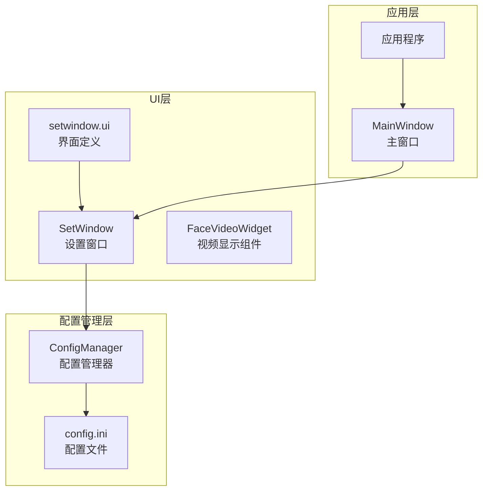
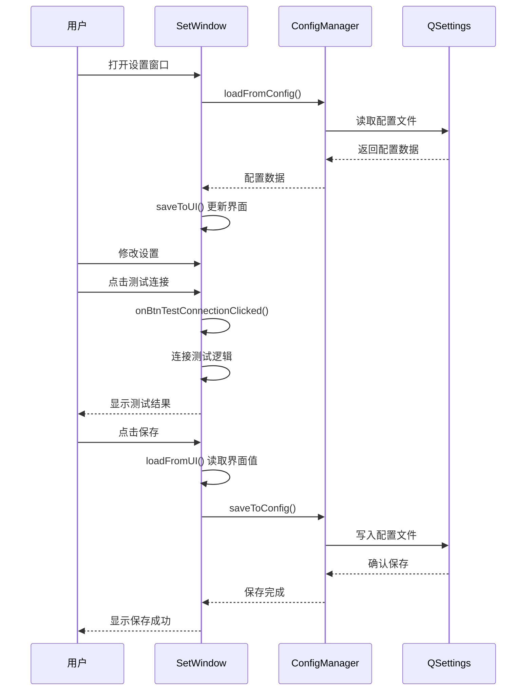
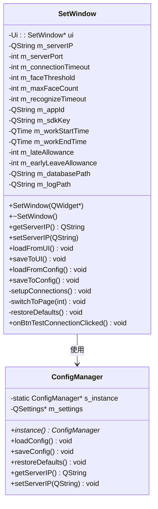
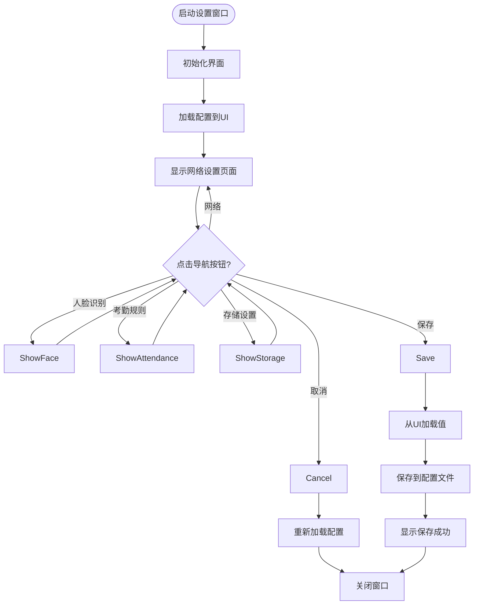
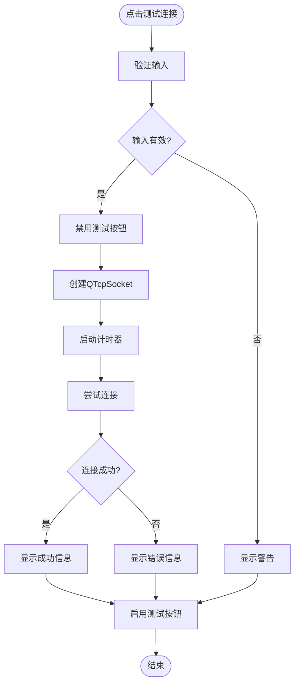
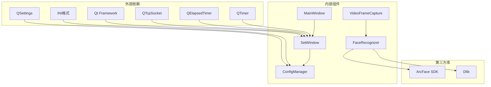

# 设置窗口

<cite>
**本文档引用的文件**
- [setwindow.h](file://UI/setwindow.h)
- [setwindow.cpp](file://UI/setwindow.cpp)
- [setwindow.ui](file://UI/setwindow.ui)
- [configmanager.h](file://config/configmanager.h)
- [configmanager.cpp](file://config/configmanager.cpp)
- [mainwindow.h](file://mainwindow.h)
- [mainwindow.cpp](file://mainwindow.cpp)
- [main.cpp](file://main.cpp)
- [facevideowidget.h](file://UI/facevideowidget.h)
</cite>

## 更新摘要
**变更内容**
- 新增连接测试功能，添加"测试连接"按钮和状态指示器
- 实现完整的连接验证机制，包括错误处理、状态指示和响应时间测量
- 增强网络连接设置页面的用户体验
- 添加连接超时处理机制

## 目录
1. [简介](#简介)
2. [项目结构](#项目结构)
3. [核心组件](#核心组件)
4. [架构概览](#架构概览)
5. [详细组件分析](#详细组件分析)
6. [连接测试功能](#连接测试功能)
7. [依赖关系分析](#依赖关系分析)
8. [性能考虑](#性能考虑)
9. [故障排除指南](#故障排除指南)
10. [结论](#结论)

## 简介

设置窗口是人脸识别考勤系统中的关键配置管理界面，提供了全面的系统参数配置功能。该窗口采用分页式设计，支持网络连接设置、人脸识别参数配置、考勤规则设置和存储路径配置四大功能模块。通过直观的用户界面和完善的配置持久化机制，用户可以轻松调整系统行为以满足不同的业务需求。

**更新** 新增了连接测试功能，用户现在可以在保存配置之前验证网络连接的有效性。

## 项目结构

设置窗口位于UI模块中，与配置管理系统紧密集成，形成了完整的配置管理架构：



**图表来源**
- [setwindow.h:1-136](file://UI/setwindow.h#L1-L136)
- [configmanager.h:1-148](file://config/configmanager.h#L1-L148)
- [mainwindow.h:1-94](file://mainwindow.h#L1-L94)

**章节来源**
- [setwindow.h:1-136](file://UI/setwindow.h#L1-L136)
- [setwindow.cpp:1-540](file://UI/setwindow.cpp#L1-L540)
- [configmanager.h:1-148](file://config/configmanager.h#L1-L148)

## 核心组件

设置窗口包含四个主要的功能模块，每个模块都提供相应的Getter和Setter方法：

### 网络连接设置
- **服务器地址**: 支持IPv4地址配置，默认值为192.168.1.100
- **服务器端口**: TCP端口配置，默认8080，范围1-65535
- **连接超时**: 网络连接超时时间，默认30秒，范围5-60秒
- **连接测试**: 新增连接测试功能，支持实时连接验证

### 人脸识别设置
- **相似度阈值**: 人脸识别相似度阈值，默认80%，范围50-99%
- **最大检测人脸数**: 同时检测的最大人脸数量，默认5个，范围1-10
- **识别超时时间**: 单次识别超时限制，默认10秒，范围3-30秒
- **ArcFace SDK配置**: App ID和SDK Key配置

### 考勤规则设置
- **工作时间**: 上班时间和下班时间配置，默认9:00-18:00
- **允许时间**: 迟到和早退允许时间，默认各15分钟

### 存储设置
- **数据库路径**: SQLite数据库文件路径
- **日志路径**: 应用日志文件存储路径

**章节来源**
- [setwindow.h:20-78](file://UI/setwindow.h#L20-L78)
- [setwindow.cpp:125-290](file://UI/setwindow.cpp#L125-L290)

## 架构概览

设置窗口采用MVC架构模式，通过配置管理器实现数据持久化：



**图表来源**
- [setwindow.cpp:351-424](file://UI/setwindow.cpp#L351-L424)
- [configmanager.cpp:53-130](file://config/configmanager.cpp#L53-L130)

**章节来源**
- [setwindow.cpp:351-424](file://UI/setwindow.cpp#L351-L424)
- [configmanager.cpp:53-130](file://config/configmanager.cpp#L53-L130)

## 详细组件分析

### SetWindow类设计

SetWindow类采用面向对象的设计原则，提供了完整的配置管理功能：



**图表来源**
- [setwindow.h:12-136](file://UI/setwindow.h#L12-L136)
- [configmanager.h:14-148](file://config/configmanager.h#L14-L148)

### 导航系统设计

设置窗口采用QStackedWidget实现的导航系统，支持四个功能页面的切换：



**图表来源**
- [setwindow.cpp:38-93](file://UI/setwindow.cpp#L38-L93)
- [setwindow.ui:176-180](file://UI/setwindow.ui#L176-L180)

**章节来源**
- [setwindow.cpp:38-93](file://UI/setwindow.cpp#L38-L93)
- [setwindow.ui:176-180](file://UI/setwindow.ui#L176-L180)

### 配置持久化机制

配置管理器使用QSettings实现跨平台的配置文件管理：

```mermaid
erDiagram
CONFIG {
QString SERVER_IP
int SERVER_PORT
int CONNECTION_TIMEOUT
int FACE_THRESHOLD
int MAX_FACE_COUNT
int RECOGNIZE_TIMEOUT
QString APP_ID
QString SDK_KEY
TIME WORK_START_TIME
TIME WORK_END_TIME
int LATE_ALLOWANCE
int EARLY_LEAVE_ALLOWANCE
QString DATABASE_PATH
QString LOG_PATH
int MAIN_WINDOW_WIDTH
int MAIN_WINDOW_HEIGHT
}
QSETTINGS {
FILE config.ini
GROUP Network
GROUP FaceRecognition
GROUP Attendance
GROUP Storage
GROUP MainWindow
}
CONFIG ||--|| QSETTINGS : 持久化
```

**图表来源**
- [configmanager.h:106-132](file://config/configmanager.h#L106-L132)
- [configmanager.cpp:53-130](file://config/configmanager.cpp#L53-L130)

**章节来源**
- [configmanager.h:106-132](file://config/configmanager.h#L106-L132)
- [configmanager.cpp:53-130](file://config/configmanager.cpp#L53-L130)

## 连接测试功能

**新增** 连接测试功能是本次更新的核心特性，为用户提供了一个完整的网络连接验证工具。

### 功能概述

连接测试功能允许用户在保存配置之前验证网络连接的有效性，提供了以下特性：

- **实时连接测试**: 点击"测试连接"按钮立即验证服务器连通性
- **状态指示**: 通过颜色和图标显示连接状态（绿色成功、红色失败、橙色测试中）
- **响应时间测量**: 自动测量并显示连接响应时间（毫秒）
- **详细错误报告**: 提供针对不同错误类型的详细诊断信息
- **超时处理**: 5秒超时机制，防止长时间等待

### 技术实现

连接测试功能通过以下技术组件实现：



**图表来源**
- [setwindow.cpp:434-539](file://UI/setwindow.cpp#L434-L539)

### 错误处理机制

连接测试实现了全面的错误处理机制：

| 错误类型 | 错误码 | 处理方式 | 用户提示 |
|---------|--------|----------|----------|
| 连接被拒绝 | ConnectionRefusedError | 检查服务器运行状态和端口配置 | "连接被拒绝，请检查：1. 服务器是否运行 2. 端口是否正确" |
| 主机未找到 | HostNotFoundError | 验证IP地址格式和DNS解析 | "无法找到服务器地址，请检查IP地址是否正确" |
| 网络错误 | NetworkError | 检查网络连接和防火墙设置 | "网络错误，请检查网络连接" |
| 连接超时 | SocketTimeoutError | 检查服务器可达性和防火墙设置 | "连接超时，请检查：1. 服务器是否运行 2. IP地址和端口是否正确 3. 防火墙设置" |

### 状态指示系统

连接测试使用颜色编码的状态指示器：

- **测试中**: 橙色文本，显示"正在连接..."
- **连接成功**: 绿色粗体文本，显示"✓ 连接成功"
- **连接失败**: 红色粗体文本，显示"✗ 连接失败"

### 用户体验优化

连接测试功能在用户体验方面进行了多项优化：

- **防重复点击**: 测试过程中禁用按钮，防止重复测试
- **自动恢复**: 测试完成后自动恢复按钮状态和文本
- **详细反馈**: 成功时显示服务器信息、连接状态和响应时间
- **超时保护**: 5秒超时机制，确保不会无限等待

**章节来源**
- [setwindow.cpp:434-539](file://UI/setwindow.cpp#L434-L539)
- [setwindow.ui:298-321](file://UI/setwindow.ui#L298-L321)

## 依赖关系分析

设置窗口与系统其他组件的依赖关系如下：



**图表来源**
- [setwindow.h:4-10](file://UI/setwindow.h#L4-L10)
- [mainwindow.h:4-9](file://mainwindow.h#L4-L9)

**章节来源**
- [setwindow.h:4-10](file://UI/setwindow.h#L4-L10)
- [mainwindow.h:4-9](file://mainwindow.h#L4-L9)

## 性能考虑

设置窗口在设计时充分考虑了性能优化：

### 内存管理
- 使用智能指针和RAII原则管理UI资源
- 避免重复创建和销毁UI控件
- 合理使用信号槽机制减少耦合

### 线程安全
- 配置操作在主线程执行，避免并发问题
- UI更新通过事件队列异步处理
- 使用QMutex保护共享资源

### 资源优化
- 懒加载配置文件，按需读取
- 合理的默认值设置，减少不必要的配置项
- 优化的UI布局，提高渲染效率

### 连接测试性能
- **内存管理**: 使用deleteLater()确保socket正确释放
- **计时精度**: 使用QElapsedTimer提供高精度时间测量
- **超时控制**: 使用QTimer单次触发机制避免资源泄漏
- **UI响应**: 测试期间禁用按钮防止重复点击

## 故障排除指南

### 常见问题及解决方案

**配置文件无法保存**
- 检查应用程序目录权限
- 确认config目录存在且可写
- 验证INI格式配置文件语法

**网络连接测试失败**
- 验证服务器IP和端口配置
- 检查防火墙设置
- 确认网络连通性
- **新增**: 使用连接测试功能获取详细错误信息

**人脸识别参数调整无效**
- 确认ArcFace SDK密钥正确
- 验证相似度阈值范围(50-99)
- 检查摄像头设备状态

**连接测试功能异常**
- **新增**: 检查网络连接是否正常
- **新增**: 确认服务器IP格式正确
- **新增**: 验证端口是否开放
- **新增**: 检查防火墙是否阻止连接

**章节来源**
- [configmanager.cpp:166-197](file://config/configmanager.cpp#L166-L197)
- [setwindow.cpp:65-74](file://UI/setwindow.cpp#L65-L74)

## 结论

设置窗口作为人脸识别考勤系统的核心配置界面，实现了以下关键特性：

1. **模块化设计**: 四个独立的功能模块，每个模块都有明确的职责边界
2. **用户友好**: 直观的界面设计和即时反馈机制
3. **配置持久化**: 完善的配置管理和文件存储机制
4. **扩展性强**: 清晰的接口设计，便于后续功能扩展
5. **稳定性好**: 完善的错误处理和异常恢复机制
6. **** 新增** 连接测试功能**: 提供完整的网络连接验证机制，增强用户体验

**更新** 本次更新显著增强了设置窗口的功能完整性，特别是新增的连接测试功能为用户提供了强大的网络连接验证能力。通过实时连接测试、详细错误报告和响应时间测量，用户可以更加自信地配置系统网络参数，大大提升了系统的易用性和可靠性。

通过合理的架构设计和实现，设置窗口为整个考勤系统提供了可靠的配置管理基础，用户可以通过简单的界面操作完成复杂的系统参数调整，大大提升了系统的易用性和可维护性。