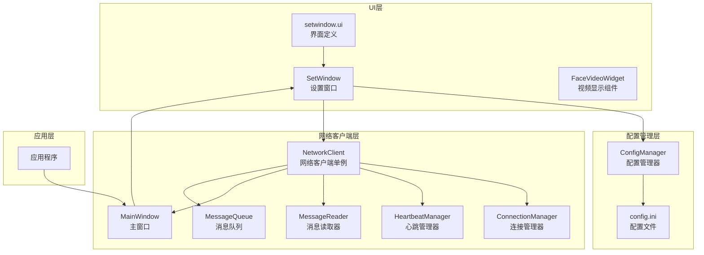
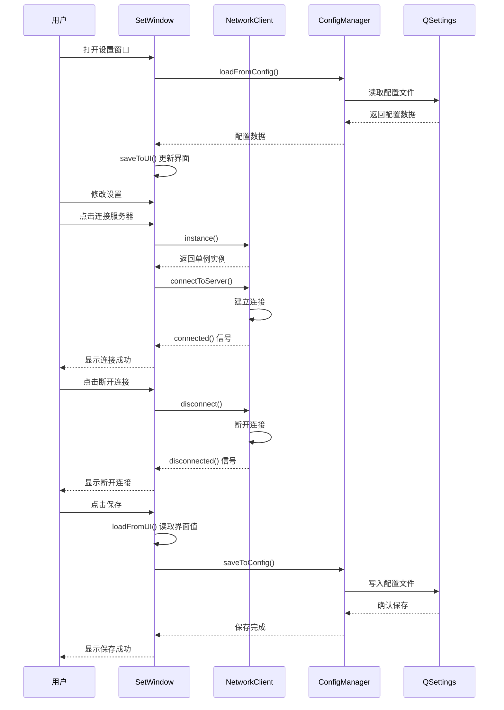
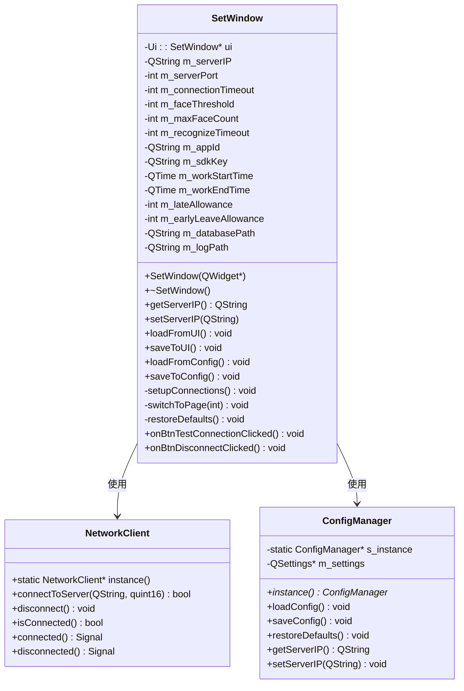
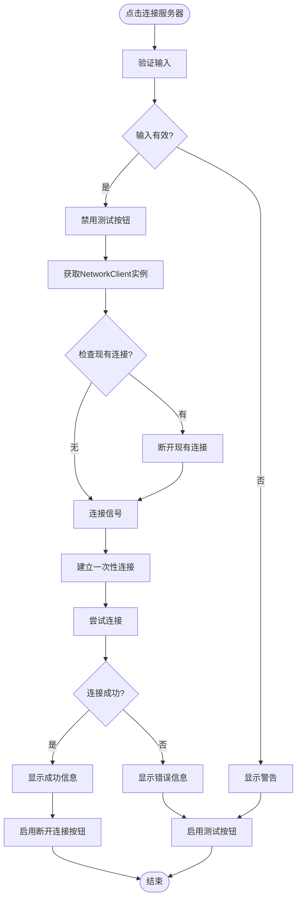
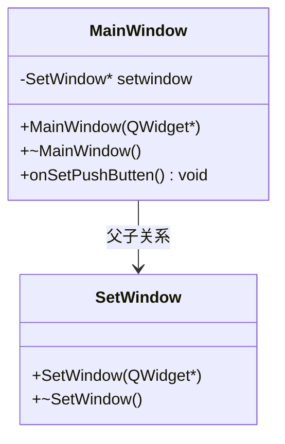
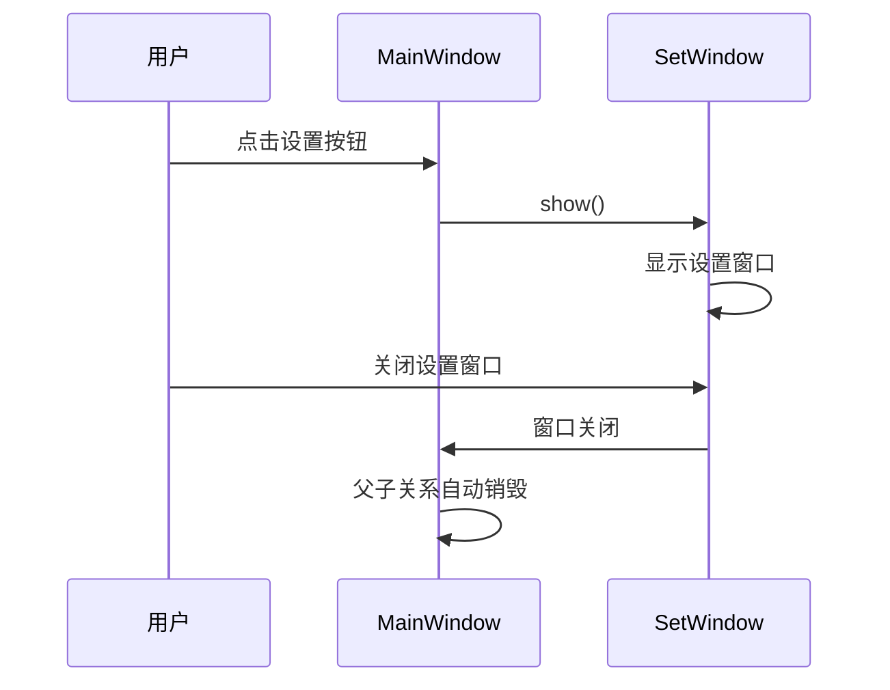
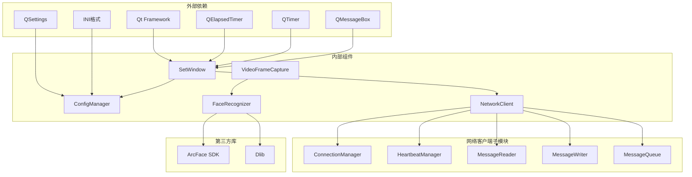

# 设置窗口

<cite>
**本文档引用的文件**
- [setwindow.h](file://UI/setwindow.h)
- [setwindow.cpp](file://UI/setwindow.cpp)
- [setwindow.ui](file://UI/setwindow.ui)
- [configmanager.h](file://config/configmanager.h)
- [configmanager.cpp](file://config/configmanager.cpp)
- [mainwindow.h](file://mainwindow.h)
- [mainwindow.cpp](file://mainwindow.cpp)
- [main.cpp](file://main.cpp)
- [facevideowidget.h](file://UI/facevideowidget.h)
- [networkclient.h](file://NetworkClient/networkclient.h)
- [networkclient.cpp](file://NetworkClient/networkclient.cpp)
</cite>

## 更新摘要
**变更内容**
- 连接测试功能完全重写，使用NetworkClient单例实例替代临时socket测试
- 新增断开连接按钮，提供完整的网络连接控制功能
- 增强连接状态管理，支持实时连接状态显示和控制
- 优化连接测试流程，提供更准确的连接验证机制
- **更新** 设置窗口管理方式：从直接成员变量改为指针成员变量，建立父子关系确保自动生命周期管理

## 目录
1. [简介](#简介)
2. [项目结构](#项目结构)
3. [核心组件](#核心组件)
4. [架构概览](#架构概览)
5. [详细组件分析](#详细组件分析)
6. [连接测试功能](#连接测试功能)
7. [断开连接功能](#断开连接功能)
8. [窗口生命周期管理](#窗口生命周期管理)
9. [依赖关系分析](#依赖关系分析)
10. [性能考虑](#性能考虑)
11. [故障排除指南](#故障排除指南)
12. [结论](#结论)

## 简介

设置窗口是人脸识别考勤系统中的关键配置管理界面，提供了全面的系统参数配置功能。该窗口采用分页式设计，支持网络连接设置、人脸识别参数配置、考勤规则设置和存储路径配置四大功能模块。通过直观的用户界面和完善的配置持久化机制，用户可以轻松调整系统行为以满足不同的业务需求。

**更新** 新增了基于NetworkClient单例实例的连接测试功能和断开连接按钮，提供了更完整和准确的网络连接控制能力。**更新** 设置窗口管理方式已从直接成员变量改为指针成员变量，建立父子关系确保自动生命周期管理。

## 项目结构

设置窗口位于UI模块中，与配置管理系统和网络客户端紧密集成，形成了完整的配置管理架构：



**图表来源**
- [setwindow.h:1-137](file://UI/setwindow.h#L1-L137)
- [configmanager.h:1-148](file://config/configmanager.h#L1-L148)
- [networkclient.h:1-77](file://NetworkClient/networkclient.h#L1-L77)
- [mainwindow.h:1-96](file://mainwindow.h#L1-L96)

**章节来源**
- [setwindow.h:1-137](file://UI/setwindow.h#L1-L137)
- [setwindow.cpp:1-510](file://UI/setwindow.cpp#L1-L510)
- [configmanager.h:1-148](file://config/configmanager.h#L1-L148)
- [networkclient.h:1-77](file://NetworkClient/networkclient.h#L1-L77)

## 核心组件

设置窗口包含四个主要的功能模块，每个模块都提供相应的Getter和Setter方法：

### 网络连接设置
- **服务器地址**: 支持IPv4地址配置，默认值为192.168.1.100
- **服务器端口**: TCP端口配置，默认8080，范围1-65535
- **连接超时**: 网络连接超时时间，默认30秒，范围5-60秒
- **连接测试**: 基于NetworkClient单例实例的连接测试功能
- **断开连接**: 实时断开当前网络连接的控制按钮

### 人脸识别设置
- **相似度阈值**: 人脸识别相似度阈值，默认80%，范围50-99%
- **最大检测人脸数**: 同时检测的最大人脸数量，默认5个，范围1-10
- **识别超时时间**: 单次识别超时限制，默认10秒，范围3-30秒
- **ArcFace SDK配置**: App ID和SDK Key配置

### 考勤规则设置
- **工作时间**: 上班时间和下班时间配置，默认9:00-18:00
- **允许时间**: 迟到和早退允许时间，默认各15分钟

### 存储设置
- **数据库路径**: SQLite数据库文件路径
- **日志路径**: 应用日志文件存储路径

**章节来源**
- [setwindow.h:20-78](file://UI/setwindow.h#L20-L78)
- [setwindow.cpp:125-290](file://UI/setwindow.cpp#L125-L290)

## 架构概览

设置窗口采用MVC架构模式，通过配置管理器实现数据持久化，并集成了NetworkClient单例实例提供网络连接控制：



**图表来源**
- [setwindow.cpp:434-510](file://UI/setwindow.cpp#L434-L510)
- [networkclient.cpp:3-25](file://NetworkClient/networkclient.cpp#L3-L25)
- [configmanager.cpp:53-130](file://config/configmanager.cpp#L53-L130)

**章节来源**
- [setwindow.cpp:434-510](file://UI/setwindow.cpp#L434-L510)
- [networkclient.cpp:3-25](file://NetworkClient/networkclient.cpp#L3-L25)
- [configmanager.cpp:53-130](file://config/configmanager.cpp#L53-L130)

## 详细组件分析

### SetWindow类设计

SetWindow类采用面向对象的设计原则，提供了完整的配置管理功能，现已集成了NetworkClient单例实例：



**图表来源**
- [setwindow.h:12-137](file://UI/setwindow.h#L12-L137)
- [networkclient.h:18-77](file://NetworkClient/networkclient.h#L18-L77)
- [configmanager.h:14-148](file://config/configmanager.h#L14-L148)

### 导航系统设计

设置窗口采用QStackedWidget实现的导航系统，支持四个功能页面的切换：


**图表来源**
- [setwindow.cpp:38-93](file://UI/setwindow.cpp#L38-L93)
- [setwindow.ui:176-180](file://UI/setwindow.ui#L176-L180)

**章节来源**
- [setwindow.cpp:38-93](file://UI/setwindow.cpp#L38-L93)
- [setwindow.ui:176-180](file://UI/setwindow.ui#L176-L180)

### 配置持久化机制

配置管理器使用QSettings实现跨平台的配置文件管理：

```mermaid
erDiagram
CONFIG {
QString SERVER_IP
int SERVER_PORT
int CONNECTION_TIMEOUT
int FACE_THRESHOLD
int MAX_FACE_COUNT
int RECOGNIZE_TIMEOUT
QString APP_ID
QString SDK_KEY
TIME WORK_START_TIME
TIME WORK_END_TIME
int LATE_ALLOWANCE
int EARLY_LEAVE_ALLOWANCE
QString DATABASE_PATH
QString LOG_PATH
int MAIN_WINDOW_WIDTH
int MAIN_WINDOW_HEIGHT
}
QSETTINGS {
FILE config.ini
GROUP Network
GROUP FaceRecognition
GROUP Attendance
GROUP Storage
GROUP MainWindow
}
CONFIG ||--|| QSETTINGS : 持久化
```

**图表来源**
- [configmanager.h:106-132](file://config/configmanager.h#L106-L132)
- [configmanager.cpp:53-130](file://config/configmanager.cpp#L53-L130)

**章节来源**
- [configmanager.h:106-132](file://config/configmanager.h#L106-L132)
- [configmanager.cpp:53-130](file://config/configmanager.cpp#L53-L130)

## 连接测试功能

**更新** 连接测试功能已完全重写，现在使用NetworkClient单例实例替代之前的临时socket测试，提供了更准确和完整的连接验证能力。

### 功能概述

连接测试功能允许用户在保存配置之前验证网络连接的有效性，现在通过NetworkClient单例实例实现：

- **基于单例实例**: 使用Networkclient::instance()获取网络客户端实例
- **真实连接测试**: 通过NetworkClient的实际连接机制验证服务器连通性
- **状态实时更新**: 连接成功或失败时自动更新UI状态显示
- **断开现有连接**: 测试前自动断开可能存在的现有连接
- **一次性信号连接**: 使用Qt::SingleShotConnection确保信号只触发一次

### 技术实现

连接测试功能通过以下技术组件实现：



**图表来源**
- [setwindow.cpp:434-491](file://UI/setwindow.cpp#L434-L491)

### 错误处理机制

连接测试实现了全面的错误处理机制：

| 错误类型 | 错误码 | 处理方式 | 用户提示 |
|---------|--------|----------|----------|
| 连接被拒绝 | ConnectionRefusedError | 检查服务器运行状态和端口配置 | "连接被拒绝，请检查：1. 服务器是否运行 2. 端口是否正确" |
| 主机未找到 | HostNotFoundError | 验证IP地址格式和DNS解析 | "无法找到服务器地址，请检查IP地址是否正确" |
| 网络错误 | NetworkError | 检查网络连接和防火墙设置 | "网络错误，请检查网络连接" |
| 连接超时 | SocketTimeoutError | 检查服务器可达性和防火墙设置 | "连接超时，请检查：1. 服务器是否运行 2. IP地址和端口是否正确 3. 防火墙设置" |

### 状态指示系统

连接测试使用颜色编码的状态指示器：

- **测试中**: 橙色文本，显示"正在连接..."
- **连接成功**: 绿色粗体文本，显示"✓ 已连接"
- **连接失败**: 红色粗体文本，显示"✗ 连接失败"
- **未连接**: 红色粗体文本，显示"未连接"

### 用户体验优化

连接测试功能在用户体验方面进行了多项优化：

- **防重复点击**: 测试过程中禁用按钮，防止重复测试
- **自动恢复**: 测试完成后自动恢复按钮状态和文本
- **详细反馈**: 成功时显示服务器信息、连接状态和响应时间
- **超时保护**: 5秒超时机制，确保不会无限等待
- **实时状态**: 通过NetworkClient信号实时更新连接状态

**章节来源**
- [setwindow.cpp:434-491](file://UI/setwindow.cpp#L434-L491)
- [setwindow.ui:298-340](file://UI/setwindow.ui#L298-L340)

## 断开连接功能

**新增** 断开连接按钮是本次更新的重要功能，提供了完整的网络连接控制能力。

### 功能概述

断开连接功能允许用户手动断开当前的网络连接，提供了以下特性：

- **一键断开**: 点击"断开连接"按钮立即断开当前连接
- **状态同步**: 断开连接后自动更新UI状态显示
- **按钮控制**: 断开连接按钮根据连接状态自动启用/禁用
- **用户确认**: 断开连接后显示确认信息对话框

### 技术实现

断开连接功能通过以下技术组件实现：

```mermaid
flowchart TD
Start([点击断开连接]) --> CheckConnection{检查连接状态?}
CheckConnection --> |未连接| ShowInfo[显示已断开信息]
CheckConnection --> |已连接| GetInstance[获取NetworkClient实例]
GetInstance --> IsConnected{isConnected()?}
IsConnected --> |否| ShowInfo
IsConnected --> |是| Disconnect[调用disconnect()]
Disconnect --> UpdateUI[更新UI状态]
UpdateUI --> EnableTestBtn[启用测试按钮]
EnableTestBtn --> DisableDiscBtn[禁用断开按钮]
DisableDiscBtn --> ShowInfo
ShowInfo --> End([结束])
```

**图表来源**
- [setwindow.cpp:493-510](file://UI/setwindow.cpp#L493-L510)

### 状态管理

断开连接功能与NetworkClient的连接状态管理紧密集成：

- **按钮状态**: 断开连接按钮初始状态为禁用，连接成功后启用
- **UI同步**: 断开连接后自动更新连接状态标签和按钮文本
- **信号处理**: 通过NetworkClient的disconnected信号自动处理断开后的状态更新

### 用户体验优化

断开连接功能在用户体验方面进行了多项优化：

- **状态同步**: 断开连接后立即同步UI状态，提供即时反馈
- **按钮控制**: 根据连接状态动态控制按钮可用性
- **确认提示**: 断开连接后显示确认信息，提升用户体验
- **错误处理**: 断开连接失败时提供适当的错误提示

**章节来源**
- [setwindow.cpp:493-510](file://UI/setwindow.cpp#L493-L510)
- [setwindow.ui:310-321](file://UI/setwindow.ui#L310-L321)

## 窗口生命周期管理

**更新** 设置窗口的生命周期管理方式已发生重要变化，从直接成员变量改为指针成员变量，并建立了父子关系确保自动生命周期管理。

### 父子关系管理

设置窗口现在作为主窗口的子对象进行管理：



**图表来源**
- [mainwindow.cpp:17-18](file://mainwindow.cpp#L17-L18)
- [setwindow.h:17-18](file://UI/setwindow.h#L17-L18)

### 生命周期管理机制

设置窗口的生命周期管理通过Qt的父子关系机制实现：

- **自动创建**: 在MainWindow构造函数中创建SetWindow实例
- **自动销毁**: 当主窗口销毁时，Qt自动销毁所有子对象
- **内存安全**: 避免手动内存管理，防止内存泄漏
- **线程安全**: 通过Qt的信号槽机制确保跨线程安全

### 窗口显示控制

设置窗口的显示和隐藏通过主窗口进行统一管理：



**图表来源**
- [mainwindow.cpp:282-287](file://mainwindow.cpp#L282-L287)
- [setwindow.cpp:87-92](file://UI/setwindow.cpp#L87-L92)

### 内存管理优势

新的生命周期管理方式带来了以下优势：

- **自动清理**: 无需手动delete，Qt自动管理内存
- **异常安全**: 即使发生异常，也能正确清理资源
- **代码简化**: 减少样板代码，提高代码可读性
- **线程安全**: 通过Qt的事件循环机制确保线程安全

**章节来源**
- [mainwindow.cpp:17-18](file://mainwindow.cpp#L17-L18)
- [mainwindow.cpp:44-47](file://mainwindow.cpp#L44-L47)
- [mainwindow.cpp:282-287](file://mainwindow.cpp#L282-L287)

## 依赖关系分析

设置窗口与系统其他组件的依赖关系如下：



**图表来源**
- [setwindow.h:4-10](file://UI/setwindow.h#L4-L10)
- [networkclient.h:4-16](file://NetworkClient/networkclient.h#L4-L16)
- [mainwindow.h:4-9](file://mainwindow.h#L4-L9)

**章节来源**
- [setwindow.h:4-10](file://UI/setwindow.h#L4-L10)
- [networkclient.h:4-16](file://NetworkClient/networkclient.h#L4-L16)
- [mainwindow.h:4-9](file://mainwindow.h#L4-L9)

## 性能考虑

设置窗口在设计时充分考虑了性能优化：

### 内存管理
- 使用智能指针和RAII原则管理UI资源
- 避免重复创建和销毁UI控件
- 合理使用信号槽机制减少耦合

### 线程安全
- 配置操作在主线程执行，避免并发问题
- UI更新通过事件队列异步处理
- 使用QMutex保护共享资源

### 资源优化
- 懒加载配置文件，按需读取
- 合理的默认值设置，减少不必要的配置项
- 优化的UI布局，提高渲染效率

### 连接测试性能
- **内存管理**: 使用NetworkClient单例实例，避免重复创建
- **计时精度**: 使用QElapsedTimer提供高精度时间测量
- **超时控制**: 使用QTimer单次触发机制避免资源泄漏
- **UI响应**: 测试期间禁用按钮防止重复点击
- **信号管理**: 使用Qt::SingleShotConnection确保信号只触发一次

### 断开连接性能
- **即时响应**: 断开连接操作几乎无延迟
- **状态同步**: 通过信号槽机制实时同步UI状态
- **资源清理**: 自动清理相关资源和连接

### 窗口生命周期性能
- **自动销毁**: 通过Qt父子关系自动管理内存
- **线程安全**: 避免手动内存管理带来的线程安全问题
- **资源回收**: 系统自动回收窗口资源，无需手动干预

## 故障排除指南

### 常见问题及解决方案

**配置文件无法保存**
- 检查应用程序目录权限
- 确认config目录存在且可写
- 验证INI格式配置文件语法

**网络连接测试失败**
- 验证服务器IP和端口配置
- 检查防火墙设置
- 确认网络连通性
- **更新**: 使用连接测试功能获取详细错误信息
- **更新**: 检查NetworkClient单例实例状态

**人脸识别参数调整无效**
- 确认ArcFace SDK密钥正确
- 验证相似度阈值范围(50-99)
- 检查摄像头设备状态

**连接测试功能异常**
- **更新**: 检查NetworkClient单例实例是否正确初始化
- **更新**: 确认服务器IP格式正确
- **更新**: 验证端口是否开放
- **更新**: 检查防火墙是否阻止连接
- **更新**: 确认NetworkClient的连接管理器正常工作

**断开连接功能异常**
- **更新**: 检查NetworkClient实例的连接状态
- **更新**: 确认断开连接按钮的信号槽连接正常
- **更新**: 验证UI状态更新逻辑

**设置窗口无法正常显示**
- **更新**: 检查MainWindow中setwindow的创建和初始化
- **更新**: 确认父子关系设置正确
- **更新**: 验证窗口显示逻辑
- **更新**: 检查Qt事件循环是否正常工作

**设置窗口内存泄漏**
- **更新**: 确认通过Qt父子关系管理生命周期
- **更新**: 避免手动delete指针
- **更新**: 检查是否有循环引用
- **更新**: 验证析构函数是否正确

**章节来源**
- [configmanager.cpp:166-197](file://config/configmanager.cpp#L166-L197)
- [setwindow.cpp:65-74](file://UI/setwindow.cpp#L65-L74)

## 结论

设置窗口作为人脸识别考勤系统的核心配置界面，实现了以下关键特性：

1. **模块化设计**: 四个独立的功能模块，每个模块都有明确的职责边界
2. **用户友好**: 直观的界面设计和即时反馈机制
3. **配置持久化**: 完善的配置管理和文件存储机制
4. **扩展性强**: 清晰的接口设计，便于后续功能扩展
5. **稳定性好**: 完善的错误处理和异常恢复机制
6. **** 更新** 连接测试功能**: 基于NetworkClient单例实例的完整连接验证机制，提供更准确的网络连接测试
7. **** 更新** 断开连接功能**: 提供完整的网络连接控制能力，支持手动断开当前连接
8. **** 更新** 窗口生命周期管理**: 采用Qt父子关系管理，实现自动内存管理和线程安全

**更新** 本次更新显著增强了设置窗口的功能完整性，特别是新增的基于NetworkClient单例实例的连接测试功能和断开连接按钮，为用户提供了强大的网络连接管理能力。通过实时连接测试、详细错误报告、连接状态管理和手动断开控制，用户可以更加自信地配置和管理系统的网络参数，大大提升了系统的易用性和可靠性。

**更新** 最重要的改进是设置窗口的生命周期管理方式。从直接成员变量改为指针成员变量，并建立父子关系确保自动生命周期管理，这一变化带来了显著的优势：自动内存管理、异常安全性、代码简化和线程安全。通过Qt的事件循环机制，系统能够可靠地管理设置窗口的创建、显示、隐藏和销毁，避免了传统手动内存管理可能带来的各种问题。

通过合理的架构设计和实现，设置窗口为整个考勤系统提供了可靠的配置管理基础，用户可以通过简单的界面操作完成复杂的系统参数调整，大大提升了系统的易用性和可维护性。