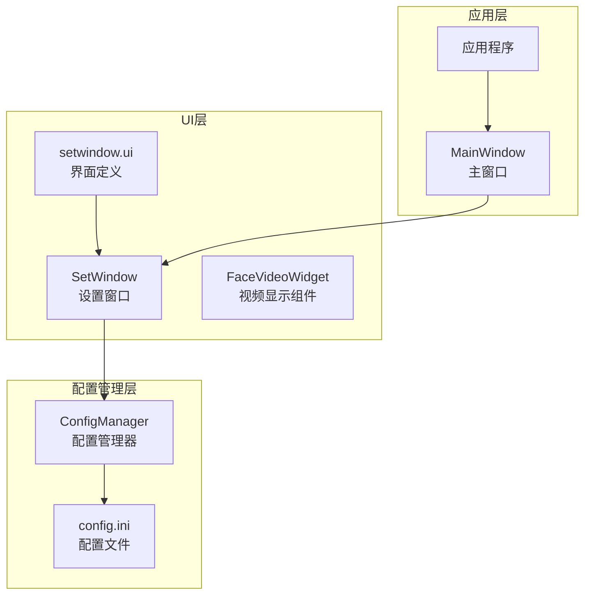
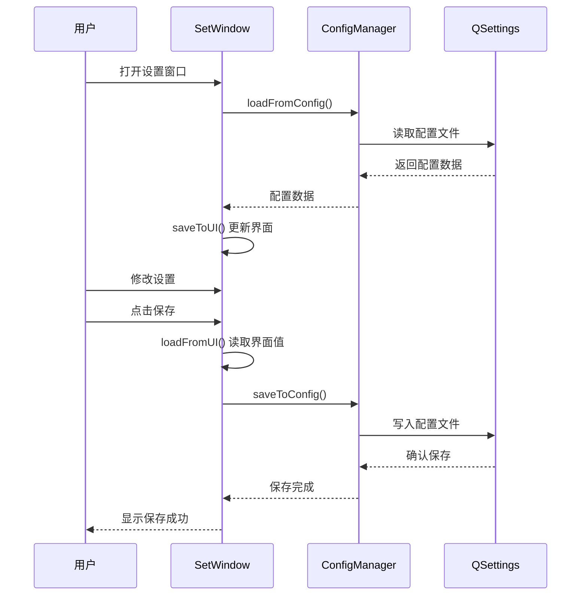
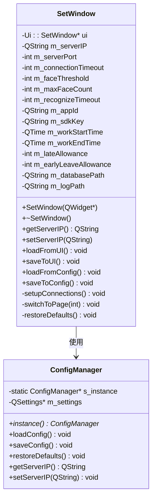
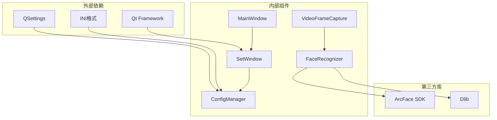

# 设置窗口

<cite>
**本文档引用的文件**
- [setwindow.h](file://UI/setwindow.h)
- [setwindow.cpp](file://UI/setwindow.cpp)
- [setwindow.ui](file://UI/setwindow.ui)
- [configmanager.h](file://config/configmanager.h)
- [configmanager.cpp](file://config/configmanager.cpp)
- [mainwindow.h](file://mainwindow.h)
- [mainwindow.cpp](file://mainwindow.cpp)
- [main.cpp](file://main.cpp)
- [facevideowidget.h](file://UI/facevideowidget.h)
</cite>

## 目录
1. [简介](#简介)
2. [项目结构](#项目结构)
3. [核心组件](#核心组件)
4. [架构概览](#架构概览)
5. [详细组件分析](#详细组件分析)
6. [依赖关系分析](#依赖关系分析)
7. [性能考虑](#性能考虑)
8. [故障排除指南](#故障排除指南)
9. [结论](#结论)

## 简介

设置窗口是人脸识别考勤系统中的关键配置管理界面，提供了全面的系统参数配置功能。该窗口采用分页式设计，支持网络连接设置、人脸识别参数配置、考勤规则设置和存储路径配置四大功能模块。通过直观的用户界面和完善的配置持久化机制，用户可以轻松调整系统行为以满足不同的业务需求。

## 项目结构

设置窗口位于UI模块中，与配置管理系统紧密集成，形成了完整的配置管理架构：



**图表来源**
- [setwindow.h:1-134](file://UI/setwindow.h#L1-L134)
- [configmanager.h:1-148](file://config/configmanager.h#L1-L148)
- [mainwindow.h:1-94](file://mainwindow.h#L1-L94)

**章节来源**
- [setwindow.h:1-134](file://UI/setwindow.h#L1-L134)
- [setwindow.cpp:1-425](file://UI/setwindow.cpp#L1-L425)
- [configmanager.h:1-148](file://config/configmanager.h#L1-L148)

## 核心组件

设置窗口包含四个主要的功能模块，每个模块都提供相应的Getter和Setter方法：

### 网络连接设置
- **服务器地址**: 支持IPv4地址配置，默认值为192.168.1.100
- **服务器端口**: TCP端口配置，默认8080，范围1-65535
- **连接超时**: 网络连接超时时间，默认30秒，范围5-60秒

### 人脸识别设置
- **相似度阈值**: 人脸识别相似度阈值，默认80%，范围50-99%
- **最大检测人脸数**: 同时检测的最大人脸数量，默认5个，范围1-10
- **识别超时时间**: 单次识别超时限制，默认10秒，范围3-30秒
- **ArcFace SDK配置**: App ID和SDK Key配置

### 考勤规则设置
- **工作时间**: 上班时间和下班时间配置，默认9:00-18:00
- **允许时间**: 迟到和早退允许时间，默认各15分钟

### 存储设置
- **数据库路径**: SQLite数据库文件路径
- **日志路径**: 应用日志文件存储路径

**章节来源**
- [setwindow.h:20-78](file://UI/setwindow.h#L20-L78)
- [setwindow.cpp:125-290](file://UI/setwindow.cpp#L125-L290)

## 架构概览

设置窗口采用MVC架构模式，通过配置管理器实现数据持久化：



**图表来源**
- [setwindow.cpp:351-424](file://UI/setwindow.cpp#L351-L424)
- [configmanager.cpp:53-130](file://config/configmanager.cpp#L53-L130)

**章节来源**
- [setwindow.cpp:351-424](file://UI/setwindow.cpp#L351-L424)
- [configmanager.cpp:53-130](file://config/configmanager.cpp#L53-L130)

## 详细组件分析

### SetWindow类设计

SetWindow类采用面向对象的设计原则，提供了完整的配置管理功能：



**图表来源**
- [setwindow.h:12-134](file://UI/setwindow.h#L12-L134)
- [configmanager.h:14-148](file://config/configmanager.h#L14-L148)

### 导航系统设计

设置窗口采用QStackedWidget实现的导航系统，支持四个功能页面的切换：


**图表来源**
- [setwindow.cpp:38-93](file://UI/setwindow.cpp#L38-L93)
- [setwindow.ui:176-180](file://UI/setwindow.ui#L176-L180)

**章节来源**
- [setwindow.cpp:38-93](file://UI/setwindow.cpp#L38-L93)
- [setwindow.ui:176-180](file://UI/setwindow.ui#L176-L180)

### 配置持久化机制

配置管理器使用QSettings实现跨平台的配置文件管理：

```mermaid
erDiagram
CONFIG {
QString SERVER_IP
int SERVER_PORT
int CONNECTION_TIMEOUT
int FACE_THRESHOLD
int MAX_FACE_COUNT
int RECOGNIZE_TIMEOUT
QString APP_ID
QString SDK_KEY
TIME WORK_START_TIME
TIME WORK_END_TIME
int LATE_ALLOWANCE
int EARLY_LEAVE_ALLOWANCE
QString DATABASE_PATH
QString LOG_PATH
int MAIN_WINDOW_WIDTH
int MAIN_WINDOW_HEIGHT
}
QSETTINGS {
FILE config.ini
GROUP Network
GROUP FaceRecognition
GROUP Attendance
GROUP Storage
GROUP MainWindow
}
CONFIG ||--|| QSETTINGS : 持久化
```

**图表来源**
- [configmanager.h:106-132](file://config/configmanager.h#L106-L132)
- [configmanager.cpp:53-130](file://config/configmanager.cpp#L53-L130)

**章节来源**
- [configmanager.h:106-132](file://config/configmanager.h#L106-L132)
- [configmanager.cpp:53-130](file://config/configmanager.cpp#L53-L130)

## 依赖关系分析

设置窗口与系统其他组件的依赖关系如下：



**图表来源**
- [setwindow.h:4-10](file://UI/setwindow.h#L4-L10)
- [mainwindow.h:4-9](file://mainwindow.h#L4-L9)

**章节来源**
- [setwindow.h:4-10](file://UI/setwindow.h#L4-L10)
- [mainwindow.h:4-9](file://mainwindow.h#L4-L9)

## 性能考虑

设置窗口在设计时充分考虑了性能优化：

### 内存管理
- 使用智能指针和RAII原则管理UI资源
- 避免重复创建和销毁UI控件
- 合理使用信号槽机制减少耦合

### 线程安全
- 配置操作在主线程执行，避免并发问题
- UI更新通过事件队列异步处理
- 使用QMutex保护共享资源

### 资源优化
- 懒加载配置文件，按需读取
- 合理的默认值设置，减少不必要的配置项
- 优化的UI布局，提高渲染效率

## 故障排除指南

### 常见问题及解决方案

**配置文件无法保存**
- 检查应用程序目录权限
- 确认config目录存在且可写
- 验证INI格式配置文件语法

**网络连接测试失败**
- 验证服务器IP和端口配置
- 检查防火墙设置
- 确认网络连通性

**人脸识别参数调整无效**
- 确认ArcFace SDK密钥正确
- 验证相似度阈值范围(50-99)
- 检查摄像头设备状态

**章节来源**
- [configmanager.cpp:166-197](file://config/configmanager.cpp#L166-L197)
- [setwindow.cpp:65-74](file://UI/setwindow.cpp#L65-L74)

## 结论

设置窗口作为人脸识别考勤系统的核心配置界面，实现了以下关键特性：

1. **模块化设计**: 四个独立的功能模块，每个模块都有明确的职责边界
2. **用户友好**: 直观的界面设计和即时反馈机制
3. **配置持久化**: 完善的配置管理和文件存储机制
4. **扩展性强**: 清晰的接口设计，便于后续功能扩展
5. **稳定性好**: 完善的错误处理和异常恢复机制

通过合理的架构设计和实现，设置窗口为整个考勤系统提供了可靠的配置管理基础，用户可以通过简单的界面操作完成复杂的系统参数调整，大大提升了系统的易用性和可维护性。