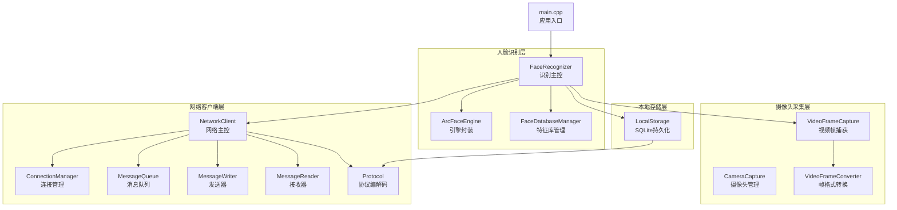
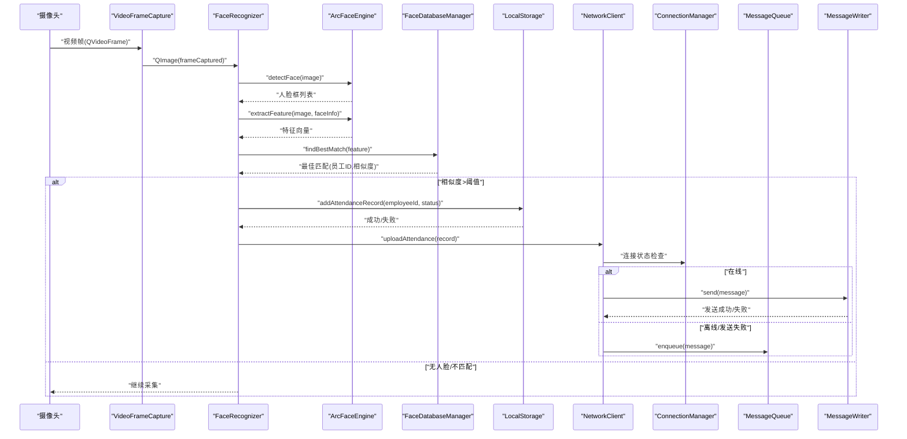
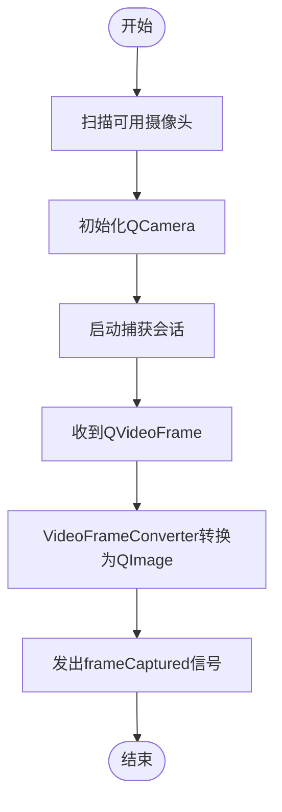
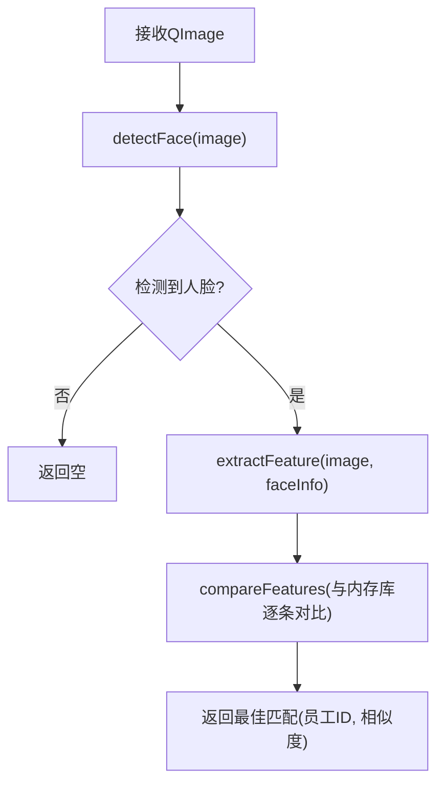
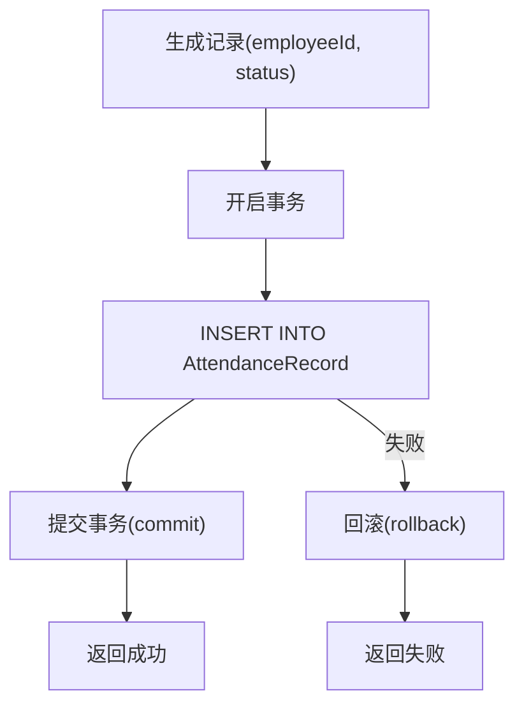
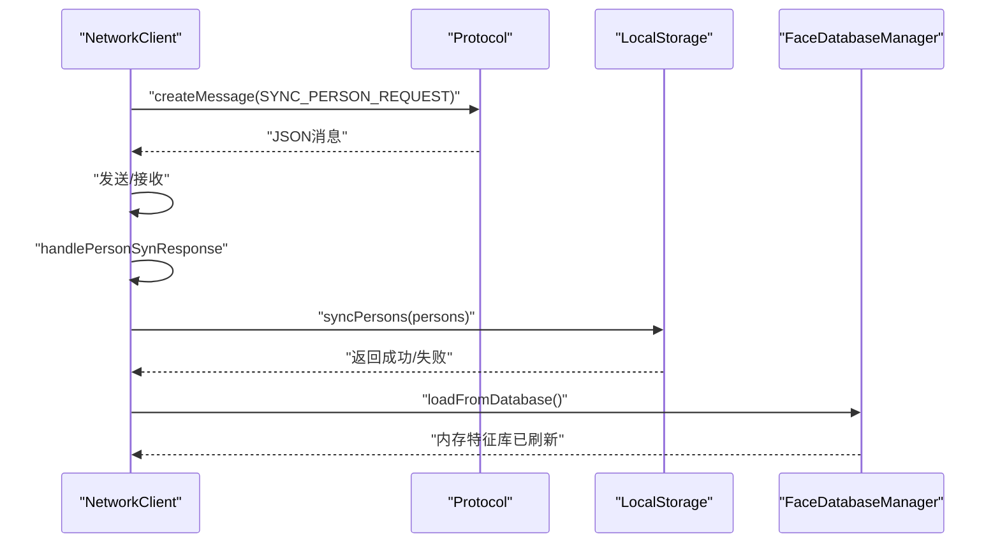
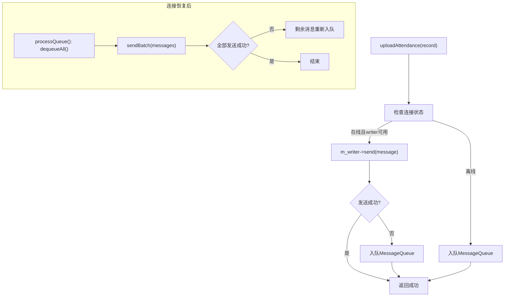
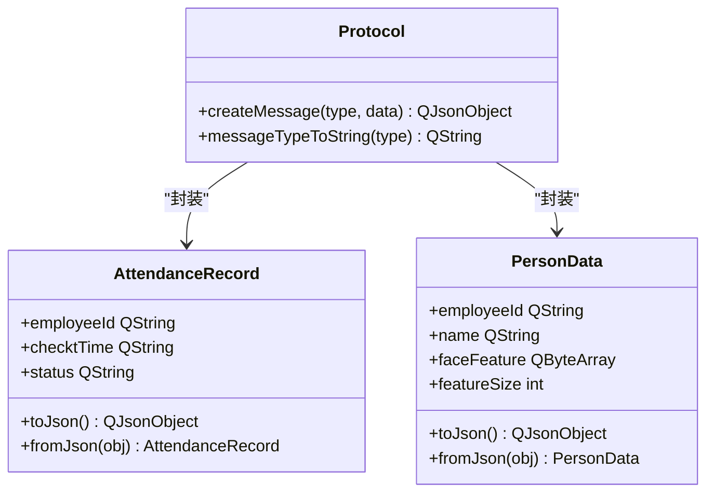
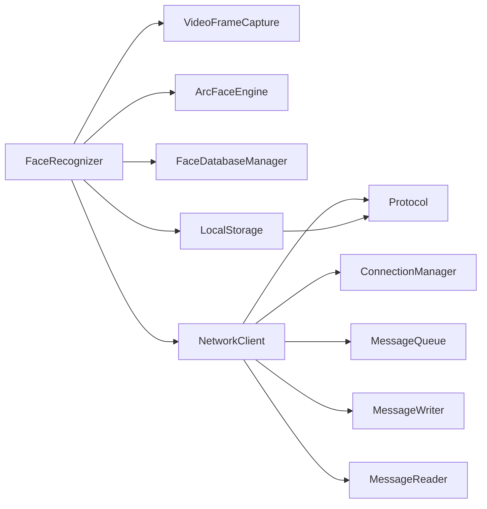

# 数据流架构

<cite>
**本文引用的文件**
- [main.cpp](file://main.cpp)
- [mainwindow.cpp](file://mainwindow.cpp)
- [CameraCapture/cameracapture.cpp](file://CameraCapture/cameracapture.cpp)
- [CameraCapture/videoframecapture.cpp](file://CameraCapture/videoframecapture.cpp)
- [CameraCapture/videoframeconverter.cpp](file://CameraCapture/videoframeconverter.cpp)
- [FaceRecognition/arcfaceengine.cpp](file://FaceRecognition/arcfaceengine.cpp)
- [FaceRecognition/facerecognizer.cpp](file://FaceRecognition/facerecognizer.cpp)
- [FaceRecognition/facedatabasemanager.cpp](file://FaceRecognition/facedatabasemanager.cpp)
- [FaceRecognition/facefeatureextractor.cpp](file://FaceRecognition/facefeatureextractor.cpp)
- [LocalStorage/localstorage.cpp](file://LocalStorage/localstorage.cpp)
- [NetworkClient/networkclient.cpp](file://NetworkClient/networkclient.cpp)
- [NetworkClient/connectionmanager.cpp](file://NetworkClient/connectionmanager.cpp)
- [NetworkClient/messagequeue.cpp](file://NetworkClient/messagequeue.cpp)
- [NetworkClient/messagewriter.cpp](file://NetworkClient/messagewriter.cpp)
- [NetworkClient/messagereader.cpp](file://NetworkClient/messagereader.cpp)
- [NetworkClient/protocol.cpp](file://NetworkClient/protocol.cpp)
</cite>

## 目录
1. [简介](#简介)
2. [项目结构](#项目结构)
3. [核心组件](#核心组件)
4. [架构总览](#架构总览)
5. [详细组件分析](#详细组件分析)
6. [依赖关系分析](#依赖关系分析)
7. [性能考量](#性能考量)
8. [故障排查指南](#故障排查指南)
9. [结论](#结论)
10. [附录](#附录)

## 简介
本文件面向AttendanceSystem项目的“数据流架构”，系统性梳理从摄像头采集、视频帧处理、人脸识别、特征提取与匹配、打卡记录生成、本地存储、网络上传、以及人员数据同步的完整数据链路。文档还包含数据缓存策略、断网处理机制、一致性保障与错误处理、监控与调试方法，并提供多种可视化图表帮助理解。

## 项目结构
项目采用模块化分层组织，主要模块如下：
- 摄像头采集层：负责设备发现、初始化、帧捕获与转换
- 人脸识别层：负责人脸检测、特征提取、特征对比与匹配
- 本地存储层：负责SQLite数据库初始化、人员与考勤记录的增删改查、事务控制
- 网络客户端层：负责TCP连接、心跳、消息编解码、发送/接收、队列缓存与断网重传
- 主程序入口：应用启动与窗口初始化

**图表来源**
- [main.cpp:13-27](file://main.cpp#L13-L27)
- [CameraCapture/cameracapture.cpp:15-71](file://CameraCapture/cameracapture.cpp#L15-L71)
- [CameraCapture/videoframecapture.cpp:10-79](file://CameraCapture/videoframecapture.cpp#L10-L79)
- [FaceRecognition/facerecognizer.cpp:20-51](file://FaceRecognition/facerecognizer.cpp#L20-L51)
- [FaceRecognition/arcfaceengine.cpp:31-79](file://FaceRecognition/arcfaceengine.cpp#L31-L79)
- [FaceRecognition/facedatabasemanager.cpp:16-49](file://FaceRecognition/facedatabasemanager.cpp#L16-L49)
- [LocalStorage/localstorage.cpp:30-121](file://LocalStorage/localstorage.cpp#L30-L121)
- [NetworkClient/networkclient.cpp:12-42](file://NetworkClient/networkclient.cpp#L12-L42)

**章节来源**
- [main.cpp:13-27](file://main.cpp#L13-L27)
- [mainwindow.cpp:3-13](file://mainwindow.cpp#L3-L13)

## 核心组件
- 摄像头采集：扫描设备、初始化相机、启动捕获会话、将QVideoFrame转换为QImage并发出frameCaptured信号
- 人脸识别：检测人脸、提取特征、在内存特征库中对比，得到最佳匹配
- 本地存储：初始化SQLite、建表与索引、事务化插入/更新、查询未上传记录、标记上传状态
- 网络客户端：建立TCP连接、心跳保活、消息编解码、发送/接收、断网缓存与重试、处理人员同步与上传响应
- 协议编解码：统一消息类型与JSON结构，提供序列化/反序列化工具

**章节来源**
- [CameraCapture/cameracapture.cpp:15-71](file://CameraCapture/cameracapture.cpp#L15-L71)
- [CameraCapture/videoframecapture.cpp:10-79](file://CameraCapture/videoframecapture.cpp#L10-L79)
- [FaceRecognition/facerecognizer.cpp:20-51](file://FaceRecognition/facerecognizer.cpp#L20-L51)
- [FaceRecognition/arcfaceengine.cpp:98-180](file://FaceRecognition/arcfaceengine.cpp#L98-L180)
- [FaceRecognition/facedatabasemanager.cpp:58-88](file://FaceRecognition/facedatabasemanager.cpp#L58-L88)
- [LocalStorage/localstorage.cpp:30-121](file://LocalStorage/localstorage.cpp#L30-L121)
- [NetworkClient/networkclient.cpp:12-42](file://NetworkClient/networkclient.cpp#L12-L42)
- [NetworkClient/protocol.cpp:5,23,42-62:5-62](file://NetworkClient/protocol.cpp#L5-L62)

## 架构总览
下图展示从摄像头到网络上传的端到端数据流，标注关键节点与数据形态变化。

**图表来源**
- [CameraCapture/videoframecapture.cpp:71-79](file://CameraCapture/videoframecapture.cpp#L71-L79)
- [FaceRecognition/facerecognizer.cpp:53-88](file://FaceRecognition/facerecognizer.cpp#L53-L88)
- [FaceRecognition/arcfaceengine.cpp:98-180](file://FaceRecognition/arcfaceengine.cpp#L98-L180)
- [FaceRecognition/facedatabasemanager.cpp:58-88](file://FaceRecognition/facedatabasemanager.cpp#L58-L88)
- [LocalStorage/localstorage.cpp:184-224](file://LocalStorage/localstorage.cpp#L184-L224)
- [NetworkClient/networkclient.cpp:45-65](file://NetworkClient/networkclient.cpp#L45-L65)
- [NetworkClient/connectionmanager.cpp:20-48](file://NetworkClient/connectionmanager.cpp#L20-L48)
- [NetworkClient/messagequeue.cpp:8-17](file://NetworkClient/messagequeue.cpp#L8-L17)
- [NetworkClient/messagewriter.cpp:13-76](file://NetworkClient/messagewriter.cpp#L13-L76)

## 详细组件分析

### 摄像头采集与视频帧处理
- 设备发现与初始化：扫描可用摄像头，创建QCamera实例并启动
- 帧捕获：通过QMediaCaptureSession与QVideoSink接收QVideoFrame
- 帧转换：将QVideoFrame转换为QImage，供后续人脸识别使用
- 信号驱动：将QImage通过frameCaptured信号传递给识别主控

**图表来源**
- [CameraCapture/cameracapture.cpp:15-71](file://CameraCapture/cameracapture.cpp#L15-L71)
- [CameraCapture/videoframecapture.cpp:10-79](file://CameraCapture/videoframecapture.cpp#L10-L79)

**章节来源**
- [CameraCapture/cameracapture.cpp:15-71](file://CameraCapture/cameracapture.cpp#L15-L71)
- [CameraCapture/videoframecapture.cpp:10-79](file://CameraCapture/videoframecapture.cpp#L10-L79)

### 人脸识别与特征匹配
- 人脸检测：将QImage转换为SDK期望格式，调用检测接口，返回人脸框集合
- 特征提取：基于检测到的人脸区域，提取特征向量
- 特征对比：在内存特征库中遍历比对，返回最高相似度与对应员工ID
- 识别主控：在frameCaptured信号回调中串联上述流程，并根据阈值决定是否生成打卡记录

**图表来源**
- [FaceRecognition/arcfaceengine.cpp:98-180](file://FaceRecognition/arcfaceengine.cpp#L98-L180)
- [FaceRecognition/arcfaceengine.cpp:183-249](file://FaceRecognition/arcfaceengine.cpp#L183-L249)
- [FaceRecognition/facedatabasemanager.cpp:58-88](file://FaceRecognition/facedatabasemanager.cpp#L58-L88)

**章节来源**
- [FaceRecognition/facerecognizer.cpp:53-88](file://FaceRecognition/facerecognizer.cpp#L53-L88)
- [FaceRecognition/arcfaceengine.cpp:98-294](file://FaceRecognition/arcfaceengine.cpp#L98-L294)
- [FaceRecognition/facedatabasemanager.cpp:16-95](file://FaceRecognition/facedatabasemanager.cpp#L16-L95)

### 打卡记录生成与本地存储
- 记录生成：当识别匹配且相似度超过阈值时，构造考勤记录
- 本地存储：事务化插入AttendanceRecord表，包含员工ID、时间戳、状态、上传标记等字段
- 查询与标记：提供查询未上传记录与标记已上传的能力，支持单条与批量

**图表来源**
- [LocalStorage/localstorage.cpp:184-224](file://LocalStorage/localstorage.cpp#L184-L224)
- [LocalStorage/localstorage.cpp:227-258](file://LocalStorage/localstorage.cpp#L227-L258)
- [LocalStorage/localstorage.cpp:261-299](file://LocalStorage/localstorage.cpp#L261-L299)

**章节来源**
- [LocalStorage/localstorage.cpp:30-121](file://LocalStorage/localstorage.cpp#L30-L121)
- [LocalStorage/localstorage.cpp:184-224](file://LocalStorage/localstorage.cpp#L184-L224)
- [LocalStorage/localstorage.cpp:227-299](file://LocalStorage/localstorage.cpp#L227-L299)

### 人员数据同步与特征库更新
- 请求同步：通过NetworkClient发起同步请求，携带设备标识与时间戳
- 接收响应：解析人员数据数组，批量写入Person表（事务化）
- 内存刷新：同步成功后重新从数据库加载特征到内存特征库

**图表来源**
- [NetworkClient/networkclient.cpp:28-42](file://NetworkClient/networkclient.cpp#L28-L42)
- [NetworkClient/networkclient.cpp:269-299](file://NetworkClient/networkclient.cpp#L269-L299)
- [LocalStorage/localstorage.cpp:124-181](file://LocalStorage/localstorage.cpp#L124-L181)
- [FaceRecognition/facedatabasemanager.cpp:16-49](file://FaceRecognition/facedatabasemanager.cpp#L16-L49)

**章节来源**
- [NetworkClient/networkclient.cpp:28-42](file://NetworkClient/networkclient.cpp#L28-L42)
- [NetworkClient/networkclient.cpp:269-299](file://NetworkClient/networkclient.cpp#L269-L299)
- [LocalStorage/localstorage.cpp:124-181](file://LocalStorage/localstorage.cpp#L124-L181)
- [FaceRecognition/facedatabasemanager.cpp:16-49](file://FaceRecognition/facedatabasemanager.cpp#L16-L49)

### 网络上传与断网缓存
- 单条上传：若在线则直接发送；若发送失败或离线，则入队缓存
- 批量上传：构建消息列表，优先在线批量发送，未发送部分入队
- 断线恢复：连接恢复后，批量取出队列消息并发送，失败部分重新入队
- 心跳保活：心跳超时触发重连，维持长连接稳定

**图表来源**
- [NetworkClient/networkclient.cpp:45-94](file://NetworkClient/networkclient.cpp#L45-L94)
- [NetworkClient/networkclient.cpp:241-267](file://NetworkClient/networkclient.cpp#L241-L267)
- [NetworkClient/messagequeue.cpp:8-44](file://NetworkClient/messagequeue.cpp#L8-L44)
- [NetworkClient/messagewriter.cpp:115-128](file://NetworkClient/messagewriter.cpp#L115-L128)

**章节来源**
- [NetworkClient/networkclient.cpp:45-94](file://NetworkClient/networkclient.cpp#L45-L94)
- [NetworkClient/networkclient.cpp:108-181](file://NetworkClient/networkclient.cpp#L108-L181)
- [NetworkClient/networkclient.cpp:241-267](file://NetworkClient/networkclient.cpp#L241-L267)
- [NetworkClient/messagequeue.cpp:8-66](file://NetworkClient/messagequeue.cpp#L8-L66)
- [NetworkClient/messagewriter.cpp:13-76](file://NetworkClient/messagewriter.cpp#L13-L76)

### 协议编解码与消息模型
- 消息类型：心跳、人员同步请求/响应、打卡上传、上传响应、设备状态
- 数据模型：考勤记录与人员数据的JSON序列化/反序列化
- 编解码：统一的createMessage与类型字符串映射

**图表来源**
- [NetworkClient/protocol.cpp:5,14,23,33,42-62:5-62](file://NetworkClient/protocol.cpp#L5-L62)

**章节来源**
- [NetworkClient/protocol.cpp:5,23,42-62:5-62](file://NetworkClient/protocol.cpp#L5-L62)

## 依赖关系分析
- 组件耦合
  - FaceRecognizer依赖VideoFrameCapture、CameraCapture、ArcFaceEngine、FaceDatabaseManager、LocalStorage、NetworkClient
  - NetworkClient依赖ConnectionManager、MessageQueue、MessageWriter、MessageReader、Protocol
  - LocalStorage独立于网络层，提供事务化持久化能力
- 直接依赖
  - ArcFaceEngine为第三方SDK封装，提供检测与特征提取能力
  - SQLite通过QSqlDatabase提供本地持久化
  - QTcpSocket提供网络通信基础
- 循环依赖
  - 未见明显循环依赖；识别主控与存储/网络通过接口解耦

**图表来源**
- [FaceRecognition/facerecognizer.cpp:20-51](file://FaceRecognition/facerecognizer.cpp#L20-L51)
- [NetworkClient/networkclient.cpp:221-231](file://NetworkClient/networkclient.cpp#L221-L231)
- [LocalStorage/localstorage.cpp:30-121](file://LocalStorage/localstorage.cpp#L30-L121)

**章节来源**
- [FaceRecognition/facerecognizer.cpp:20-51](file://FaceRecognition/facerecognizer.cpp#L20-L51)
- [NetworkClient/networkclient.cpp:221-231](file://NetworkClient/networkclient.cpp#L221-L231)

## 性能考量
- 图像格式与对齐：SDK要求BGR格式与宽度对齐，减少无效像素与提高处理效率
- 线程安全：多处使用QMutexLocker保护共享状态（识别主控、数据库、消息队列）
- 事务化写入：数据库操作使用事务，降低磁盘写放大，提升吞吐
- 批量发送：网络层支持批量发送与断点续发，减少网络往返
- 缓存策略：断网时将消息入队，连接恢复后批量重放，避免丢包与重复发送

[本节为通用性能建议，无需具体文件引用]

## 故障排查指南
- 摄像头问题
  - 无可用设备：检查设备枚举与权限
  - 相机启动失败：确认设备状态与会话配置
- 人脸识别失败
  - 引擎未初始化：检查激活与初始化流程
  - 无检测结果：调整光照、角度或分辨率
- 本地存储异常
  - 数据库未连接：检查路径与权限
  - 事务失败：查看回滚日志与错误码
- 网络问题
  - 连接失败：检查IP、端口与防火墙
  - 心跳超时：观察重连计时与错误类型
  - 发送失败：检查socket状态与缓冲区
- 断网处理
  - 队列积压：监控队列长度与重发频率
  - 恢复后重放：确认批量发送与剩余消息重新入队

**章节来源**
- [CameraCapture/cameracapture.cpp:15-71](file://CameraCapture/cameracapture.cpp#L15-L71)
- [FaceRecognition/arcfaceengine.cpp:31-79](file://FaceRecognition/arcfaceengine.cpp#L31-L79)
- [LocalStorage/localstorage.cpp:30-121](file://LocalStorage/localstorage.cpp#L30-L121)
- [NetworkClient/connectionmanager.cpp:79-103](file://NetworkClient/connectionmanager.cpp#L79-L103)
- [NetworkClient/messagewriter.cpp:13-76](file://NetworkClient/messagewriter.cpp#L13-L76)
- [NetworkClient/networkclient.cpp:206-213](file://NetworkClient/networkclient.cpp#L206-L213)

## 结论
本架构以事件驱动与模块解耦为核心设计原则，摄像头采集与人脸识别形成稳定的前端数据通路，LocalStorage提供可靠持久化，NetworkClient通过心跳与队列实现断网容错与重试。整体具备良好的扩展性与鲁棒性，适合在边缘场景部署与维护。

[本节为总结性内容，无需具体文件引用]

## 附录

### 数据一致性与错误处理机制
- 一致性
  - 识别到匹配后才写入本地数据库，随后尝试上传，上传成功后再标记为已上传
  - 人员同步采用事务化全量替换，失败回滚，确保特征库一致性
- 错误处理
  - 引擎与网络层均提供错误码与错误字符串，便于定位问题
  - 断线自动重连与指数退避，降低网络抖动影响

**章节来源**
- [LocalStorage/localstorage.cpp:184-224](file://LocalStorage/localstorage.cpp#L184-L224)
- [LocalStorage/localstorage.cpp:124-181](file://LocalStorage/localstorage.cpp#L124-L181)
- [NetworkClient/connectionmanager.cpp:79-103](file://NetworkClient/connectionmanager.cpp#L79-L103)

### 数据流监控与调试方法
- 日志输出：各模块广泛使用qDebug/qWarning输出关键状态与错误
- 关键指标
  - 识别成功率、特征提取耗时、网络发送成功率、队列长度、重连次数
- 调试要点
  - 检查frameCaptured信号是否持续触发
  - 核对人脸检测与特征提取返回值
  - 监控队列入队/出队与批量发送进度

**章节来源**
- [CameraCapture/videoframecapture.cpp:71-79](file://CameraCapture/videoframecapture.cpp#L71-L79)
- [FaceRecognition/arcfaceengine.cpp:98-180](file://FaceRecognition/arcfaceengine.cpp#L98-L180)
- [NetworkClient/networkclient.cpp:241-267](file://NetworkClient/networkclient.cpp#L241-L267)