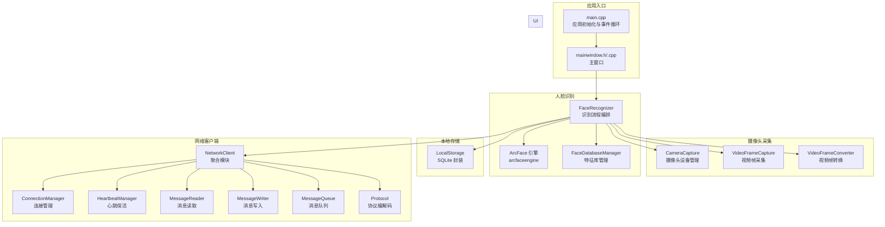
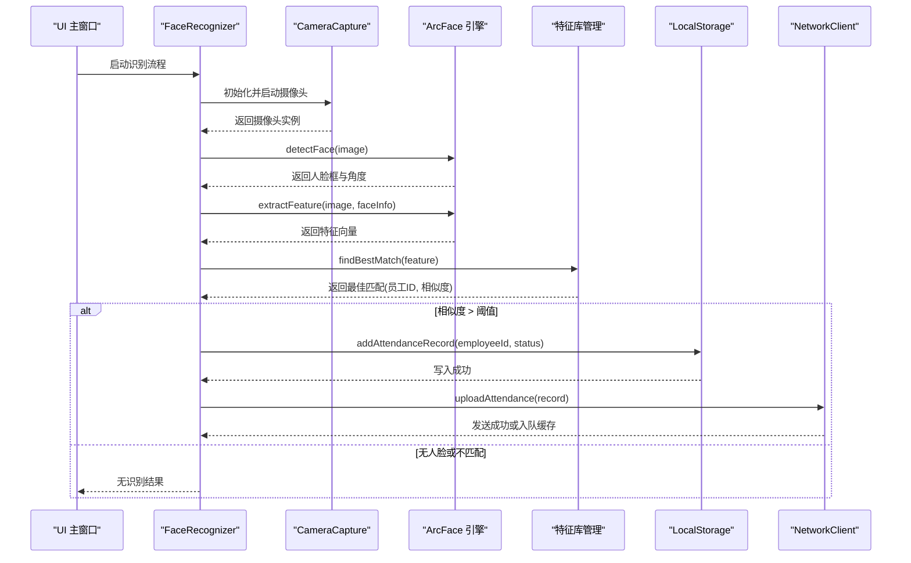
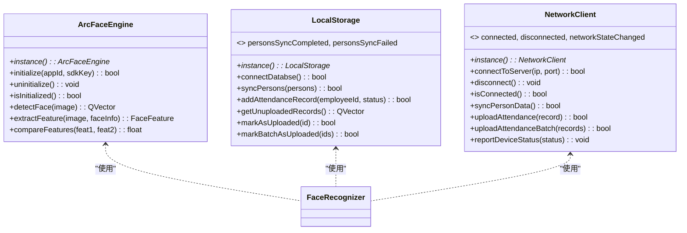
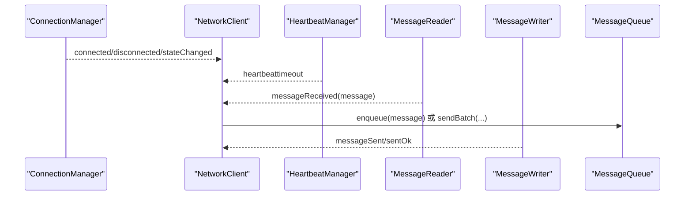
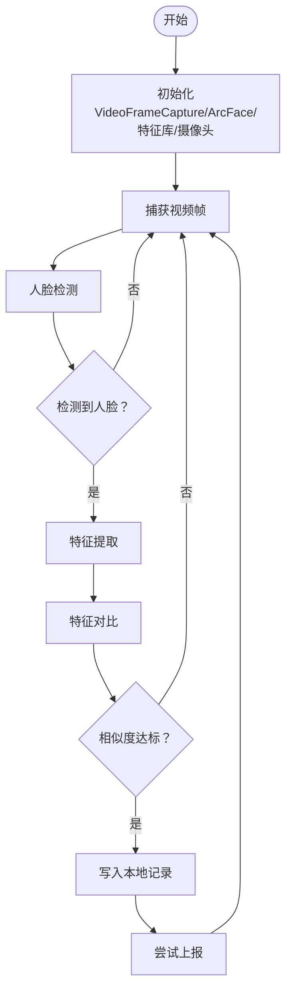
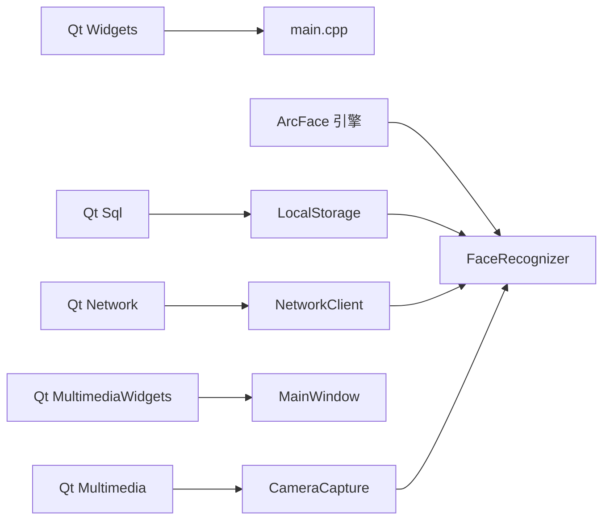

# 整体设计

<cite>
**本文引用的文件**
- [main.cpp](file://main.cpp)
- [mainwindow.h](file://mainwindow.h)
- [mainwindow.cpp](file://mainwindow.cpp)
- [CMakeLists.txt](file://CMakeLists.txt)
- [AttendanceCheckClient开发文档.md](file://AttendanceCheckClient开发文档.md)
- [arcfaceengine.h](file://FaceRecognition/arcfaceengine.h)
- [arcfaceengine.cpp](file://FaceRecognition/arcfaceengine.cpp)
- [localstorage.h](file://LocalStorage/localstorage.h)
- [localstorage.cpp](file://LocalStorage/localstorage.cpp)
- [networkclient.h](file://NetworkClient/networkclient.h)
- [networkclient.cpp](file://NetworkClient/networkclient.cpp)
- [connectionmanager.h](file://NetworkClient/connectionmanager.h)
- [facerecognizer.h](file://FaceRecognition/facerecognizer.h)
- [facerecognizer.cpp](file://FaceRecognition/facerecognizer.cpp)
</cite>

## 目录
1. [简介](#简介)
2. [项目结构](#项目结构)
3. [核心组件](#核心组件)
4. [架构总览](#架构总览)
5. [详细组件分析](#详细组件分析)
6. [依赖分析](#依赖分析)
7. [性能考虑](#性能考虑)
8. [故障排查指南](#故障排查指南)
9. [结论](#结论)
10. [附录](#附录)

## 简介
本项目为局域网智能考勤系统的打卡端客户端，基于 Qt 框架开发，采用 C++17 与 CMake 构建。系统以“模块化 + 单例 + 观察者（信号槽）”为核心设计理念，围绕人脸识别、摄像头采集、本地存储、网络通信与 UI 界面五大模块协同工作，实现人脸采集、识别、本地打卡、断网缓存与 TCP 上报的完整闭环。

- 系统定位：C/S 架构中的客户端，负责现场人脸识别与考勤数据的采集与上报。
- 技术栈：Qt5/6、C++17、CMake、SQLite3、ArcFace 人脸识别库、Multimedia/MultimediaWidgets。
- 关键特性：单例模式统一管理引擎与存储；Qt 信号槽解耦模块间通信；断网缓存与心跳保活保障可靠性。

## 项目结构
项目采用按功能域分层的模块化组织方式，核心模块如下：
- FaceRecognition：人脸识别引擎封装、特征提取与对比、人员特征数据库管理。
- CameraCapture：摄像头设备管理、视频帧采集与转换。
- LocalStorage：SQLite 文件数据库封装，提供人员与考勤记录的增删改查与事务。
- NetworkClient：TCP 客户端聚合模块，包含连接管理、心跳、消息读写、消息队列与协议编解码。
- UI：基于 Qt 的主窗口界面（mainwindow）。
- third_party：第三方依赖（ArcFace SDK 头文件与库）。



图表来源
- [main.cpp:13-27](file://main.cpp#L13-L27)
- [mainwindow.h:11-17](file://mainwindow.h#L11-L17)
- [facerecognizer.h:25-58](file://FaceRecognition/facerecognizer.h#L25-L58)
- [arcfaceengine.h:21-112](file://FaceRecognition/arcfaceengine.h#L21-L112)
- [localstorage.h:15-46](file://LocalStorage/localstorage.h#L15-L46)
- [networkclient.h:17-73](file://NetworkClient/networkclient.h#L17-L73)
- [connectionmanager.h:8-42](file://NetworkClient/connectionmanager.h#L8-L42)

章节来源
- [CMakeLists.txt:16-82](file://CMakeLists.txt#L16-L82)
- [AttendanceCheckClient开发文档.md:22-29](file://AttendanceCheckClient开发文档.md#L22-L29)

## 核心组件
- 应用入口与生命周期
  - main 函数创建 QApplication、MainWindow，并进入事件循环，负责应用启动、窗口展示与退出。
- 主窗口管理
  - MainWindow 继承自 QMainWindow，通过 UI 文件初始化界面布局与控件。
- 模块化设计
  - 各模块职责清晰：采集、识别、存储、网络、UI 分离，通过接口与信号槽耦合。
- 单例模式
  - ArcFace 引擎、LocalStorage、NetworkClient 均采用单例，确保全局唯一性与资源复用。
- 观察者模式（Qt 信号槽）
  - 模块间通过信号槽解耦，连接管理、消息读写、心跳保活均以信号驱动状态变更。

章节来源
- [main.cpp:13-27](file://main.cpp#L13-L27)
- [mainwindow.h:11-17](file://mainwindow.h#L11-L17)
- [mainwindow.cpp:3-13](file://mainwindow.cpp#L3-L13)
- [arcfaceengine.h:48](file://FaceRecognition/arcfaceengine.h#L48)
- [localstorage.h:20](file://LocalStorage/localstorage.h#L20)
- [networkclient.h:22](file://NetworkClient/networkclient.h#L22)

## 架构总览
系统采用“前端 UI + 识别编排 + 引擎与数据库 + 网络客户端”的分层架构。识别流程由 FaceRecognizer 统筹，调用 ArcFace 引擎进行检测与特征提取，与内存中的特征库比对，成功后写入本地 SQLite，并通过 NetworkClient 上报或缓存。



图表来源
- [facerecognizer.cpp:53-88](file://FaceRecognition/facerecognizer.cpp#L53-L88)
- [arcfaceengine.h:74](file://FaceRecognition/arcfaceengine.h#L74)
- [arcfaceengine.h:82](file://FaceRecognition/arcfaceengine.h#L82)
- [localstorage.h:29](file://LocalStorage/localstorage.h#L29)
- [networkclient.h:31](file://NetworkClient/networkclient.h#L31)

## 详细组件分析

### 单例模式与资源管理
- ArcFace 引擎单例
  - 通过静态 instance() 返回全局唯一实例，内部使用互斥锁与双重检查锁保证线程安全；提供 initialize/uninitialize 生命周期管理。
- 本地存储单例
  - 通过 instance() 获取数据库访问入口，提供人员同步、打卡记录增删改查与批量上传标记；内部使用互斥锁保护并发访问。
- 网络客户端单例
  - 通过 instance() 获取 TCP 客户端聚合入口，负责连接、心跳、消息读写、队列与协议编解码；对外发出连接状态与业务信号。



图表来源
- [arcfaceengine.h:21-112](file://FaceRecognition/arcfaceengine.h#L21-L112)
- [localstorage.h:15-46](file://LocalStorage/localstorage.h#L15-L46)
- [networkclient.h:17-73](file://NetworkClient/networkclient.h#L17-L73)
- [facerecognizer.h:40-44](file://FaceRecognition/facerecognizer.h#L40-L44)

章节来源
- [arcfaceengine.cpp:18-28](file://FaceRecognition/arcfaceengine.cpp#L18-L28)
- [arcfaceengine.cpp:31-73](file://FaceRecognition/arcfaceengine.cpp#L31-L73)
- [localstorage.cpp:7-17](file://LocalStorage/localstorage.cpp#L7-L17)
- [networkclient.cpp:3-10](file://NetworkClient/networkclient.cpp#L3-L10)

### 观察者模式（Qt 信号槽）
- 连接管理
  - ConnectionManager 在连接建立/断开/错误/状态变化时发出信号，NetworkClient 作为观察者订阅这些信号并进行相应处理。
- 心跳保活
  - HeartbeatManager 在心跳超时时发出信号，NetworkClient 订阅该信号以触发重连或状态切换。
- 消息读写
  - MessageReader 在收到消息时发出 messageReceived 信号，NetworkClient 解析消息类型并分发处理。
- 识别流程
  - VideoFrameCapture 在捕获到帧时发出 frameCaptured 信号，FaceRecognizer 订阅该信号执行检测与识别。



图表来源
- [connectionmanager.h:23-27](file://NetworkClient/connectionmanager.h#L23-L27)
- [networkclient.cpp:108-181](file://NetworkClient/networkclient.cpp#L108-L181)
- [networkclient.h:46-54](file://NetworkClient/networkclient.h#L46-L54)

章节来源
- [connectionmanager.h:29-33](file://NetworkClient/connectionmanager.h#L29-L33)
- [networkclient.cpp:108-181](file://NetworkClient/networkclient.cpp#L108-L181)

### 人脸识别模块
- 功能职责
  - 负责摄像头初始化、视频帧采集、人脸检测、特征提取、特征对比与最佳匹配输出。
- 流程要点
  - 初始化阶段：创建 VideoFrameCapture，绑定帧捕获信号；初始化 ArcFace 引擎；加载特征库；初始化摄像头并启动采集。
  - 识别流程：检测到人脸后提取特征并与内存特征库比对，相似度达标则写入本地并尝试上报。



图表来源
- [facerecognizer.cpp:20-51](file://FaceRecognition/facerecognizer.cpp#L20-L51)
- [facerecognizer.cpp:53-88](file://FaceRecognition/facerecognizer.cpp#L53-L88)
- [arcfaceengine.h:74](file://FaceRecognition/arcfaceengine.h#L74)
- [arcfaceengine.h:82](file://FaceRecognition/arcfaceengine.h#L82)

章节来源
- [facerecognizer.h:25-58](file://FaceRecognition/facerecognizer.h#L25-L58)
- [facerecognizer.cpp:20-51](file://FaceRecognition/facerecognizer.cpp#L20-L51)
- [facerecognizer.cpp:53-88](file://FaceRecognition/facerecognizer.cpp#L53-L88)

### 本地存储模块
- 数据库设计
  - 人员表：主键为工号，包含姓名、特征数据与更新时间；索引优化查询。
  - 打卡记录表：外键关联人员表，包含打卡时间、状态、上传标记与上传时间；索引优化查询。
- 事务与并发
  - 同步人员数据与新增打卡记录均使用事务，保证原子性；多处使用互斥锁保护并发访问。
- 业务接口
  - 提供人员同步、新增打卡记录、查询未上传记录、标记已上传等接口，并发出同步完成/失败信号。

章节来源
- [localstorage.cpp:30-121](file://LocalStorage/localstorage.cpp#L30-L121)
- [localstorage.cpp:124-181](file://LocalStorage/localstorage.cpp#L124-L181)
- [localstorage.cpp:184-200](file://LocalStorage/localstorage.cpp#L184-L200)
- [localstorage.h:25-33](file://LocalStorage/localstorage.h#L25-L33)

### 网络客户端模块
- 职责边界
  - 负责 TCP 连接、心跳保活、消息读写、消息队列与协议编解码；向上提供业务接口与状态信号。
- 断网缓存
  - 发送失败或断网时将消息入队，网络恢复后自动重试；批量上传时未发送部分继续入队。
- 状态管理
  - 通过连接管理器的状态变化信号驱动自身状态切换，并对外发出网络状态变化信号。

章节来源
- [networkclient.cpp:12-42](file://NetworkClient/networkclient.cpp#L12-L42)
- [networkclient.cpp:44-94](file://NetworkClient/networkclient.cpp#L44-L94)
- [networkclient.cpp:108-181](file://NetworkClient/networkclient.cpp#L108-L181)
- [networkclient.h:24-34](file://NetworkClient/networkclient.h#L24-L34)

## 依赖分析
- Qt 组件依赖
  - Widgets、Network、Sql、Multimedia、MultimediaWidgets，满足 UI、网络、数据库与多媒体需求。
- 外部库依赖
  - ArcFace SDK：提供人脸检测与特征提取能力。
- 模块间依赖
  - FaceRecognizer 依赖 CameraCapture、VideoFrameCapture、ArcFace 引擎与特征库；识别成功后依赖 LocalStorage 与 NetworkClient。
  - NetworkClient 依赖 ConnectionManager、HeartbeatManager、MessageReader、MessageWriter、MessageQueue 与 Protocol。



图表来源
- [CMakeLists.txt:16-17](file://CMakeLists.txt#L16-L17)
- [CMakeLists.txt:75-82](file://CMakeLists.txt#L75-L82)
- [main.cpp:1-6](file://main.cpp#L1-L6)
- [mainwindow.h:4](file://mainwindow.h#L4)

章节来源
- [CMakeLists.txt:16-82](file://CMakeLists.txt#L16-L82)

## 性能考虑
- 识别性能
  - ArcFace 引擎初始化参数（检测模式、角度、最小人脸尺寸、最大人脸数）影响速度与精度，应结合硬件与场景调优。
  - 图像格式转换与宽度对齐（4 字节对齐）减少 SDK 处理开销。
- 数据库性能
  - SQLite 事务批量写入提升吞吐；合理索引（人员姓名、记录外键与时间）提升查询效率。
- 网络性能
  - 心跳周期与重连策略平衡稳定性与资源消耗；批量发送减少握手次数。
- UI 与线程
  - 识别流程在后台线程执行，避免阻塞 UI；单例与互斥锁保证线程安全。

## 故障排查指南
- 引擎初始化失败
  - 检查 AppId 与 SDK Key 是否正确；确认网络可访问激活接口；查看初始化日志与错误码。
- 识别无结果
  - 确认摄像头初始化成功；检查图像格式转换与宽度对齐；调整最小人脸尺寸与检测阈值。
- 数据库连接失败
  - 检查数据目录创建权限与数据库文件路径；确认 UTF-8 编码与外键约束开启。
- 网络断开或发送失败
  - 查看连接管理器错误信号；确认心跳是否超时；检查消息队列大小与重试策略。
- UI 无响应
  - 确认事件循环正常；避免在主线程执行耗时任务；使用信号槽异步处理。

章节来源
- [arcfaceengine.cpp:31-73](file://FaceRecognition/arcfaceengine.cpp#L31-L73)
- [localstorage.cpp:30-121](file://LocalStorage/localstorage.cpp#L30-L121)
- [networkclient.cpp:108-181](file://NetworkClient/networkclient.cpp#L108-L181)

## 结论
本系统以 Qt 为基础，采用模块化与单例模式实现资源集中管理，借助 Qt 信号槽实现松耦合的观察者通信。人脸识别、摄像头采集、本地存储与网络客户端形成清晰的职责边界，配合断网缓存与心跳保活机制，满足局域网考勤场景的稳定性与可靠性要求。后续可在引擎参数调优、数据库索引与网络批处理等方面持续优化。

## 附录
- 系统上下文图（与外部环境交互）
  - 与管理端：TCP 长连接、心跳保活、人员数据同步、打卡记录上传、设备状态上报。
  - 与本地：SQLite 文件数据库、摄像头设备、系统控制台（Windows）。

```mermaid
graph TB
subgraph "外部环境"
Server["管理端服务器"]
Cam["摄像头设备"]
FS["文件系统<br/>SQLite 数据库"]
OS["操作系统<br/>Windows 控制台"]
end
subgraph "打卡端客户端"
NC["NetworkClient"]
LS["LocalStorage"]
FR["FaceRecognizer"]
ARENG["ArcFace 引擎"]
CC["CameraCapture"]
end
NC <- --> Server
LS <- --> FS
FR <- --> ARENG
FR <- --> CC
OS --> NC
OS --> FR
```

图表来源
- [networkclient.h:24-34](file://NetworkClient/networkclient.h#L24-L34)
- [localstorage.cpp:30-121](file://LocalStorage/localstorage.cpp#L30-L121)
- [facerecognizer.cpp:20-51](file://FaceRecognition/facerecognizer.cpp#L20-L51)
- [arcfaceengine.cpp:31-73](file://FaceRecognition/arcfaceengine.cpp#L31-L73)
- [main.cpp:15-26](file://main.cpp#L15-L26)