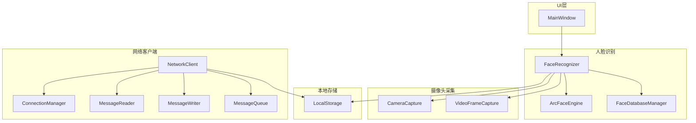
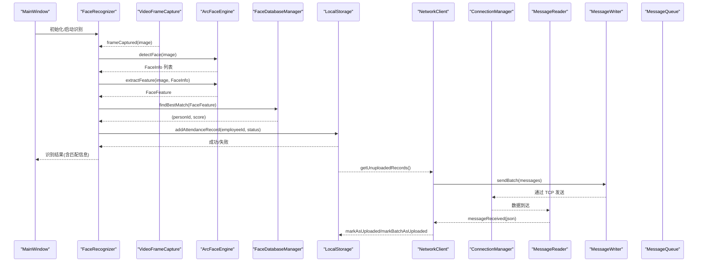
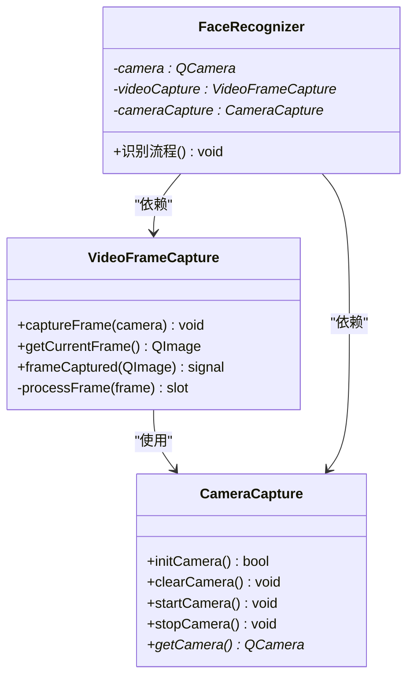
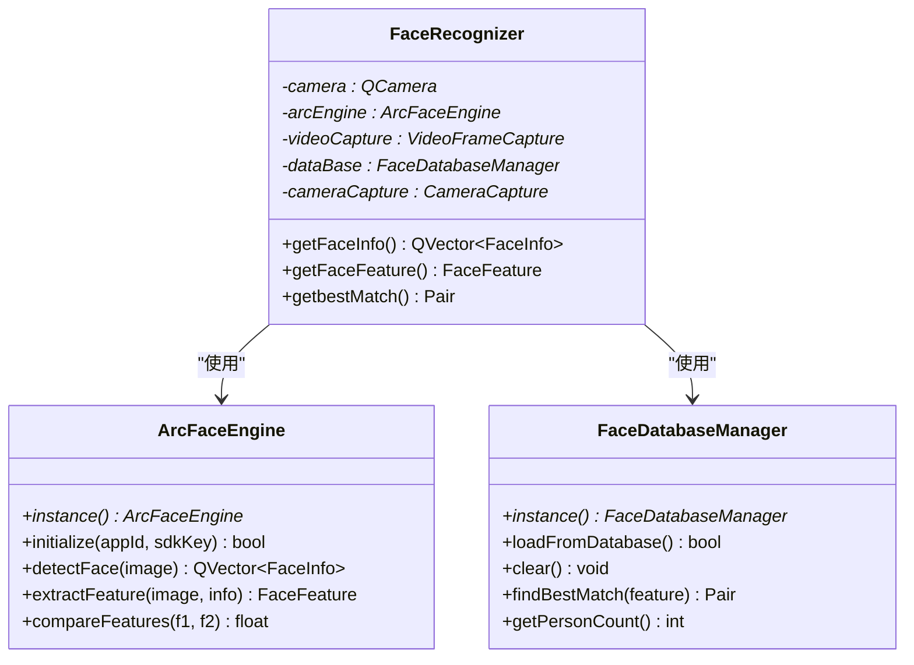
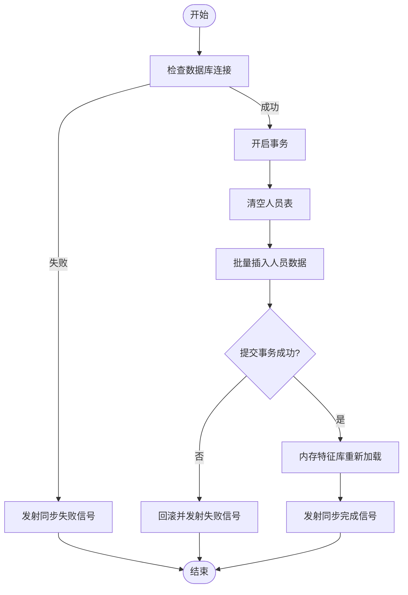
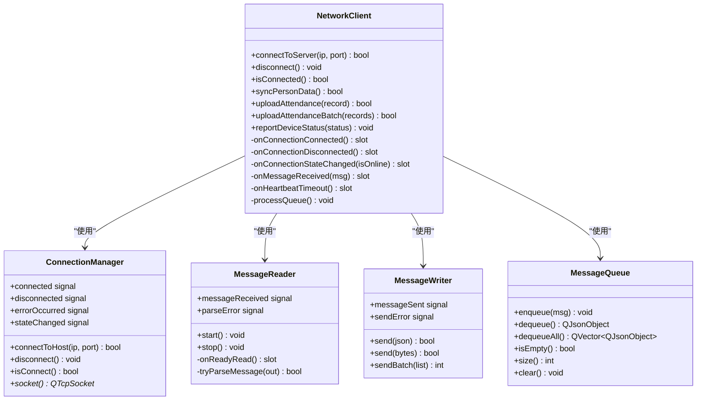
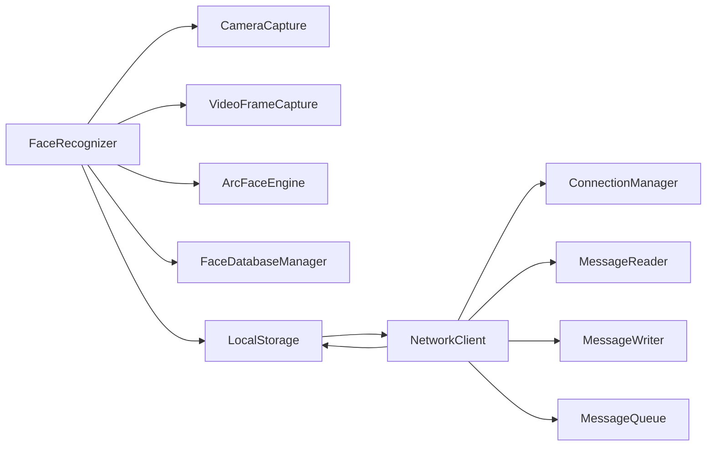

# 模块关系

<cite>
**本文引用的文件**
- [mainwindow.h](file://mainwindow.h)
- [mainwindow.cpp](file://mainwindow.cpp)
- [main.cpp](file://main.cpp)
- [CameraCapture/cameracapture.h](file://CameraCapture/cameracapture.h)
- [CameraCapture/videoframecapture.h](file://CameraCapture/videoframecapture.h)
- [FaceRecognition/facerecognizer.h](file://FaceRecognition/facerecognizer.h)
- [FaceRecognition/arcfaceengine.h](file://FaceRecognition/arcfaceengine.h)
- [FaceRecognition/arcfaceengine.cpp](file://FaceRecognition/arcfaceengine.cpp)
- [FaceRecognition/facedatabasemanager.h](file://FaceRecognition/facedatabasemanager.h)
- [LocalStorage/localstorage.h](file://LocalStorage/localstorage.h)
- [LocalStorage/localstorage.cpp](file://LocalStorage/localstorage.cpp)
- [NetworkClient/networkclient.h](file://NetworkClient/networkclient.h)
- [NetworkClient/networkclient.cpp](file://NetworkClient/networkclient.cpp)
- [NetworkClient/connectionmanager.h](file://NetworkClient/connectionmanager.h)
- [NetworkClient/messagewriter.h](file://NetworkClient/messagewriter.h)
- [NetworkClient/messagereader.h](file://NetworkClient/messagereader.h)
- [NetworkClient/messagequeue.h](file://NetworkClient/messagequeue.h)
</cite>

## 目录
1. [简介](#简介)
2. [项目结构](#项目结构)
3. [核心组件](#核心组件)
4. [架构总览](#架构总览)
5. [详细组件分析](#详细组件分析)
6. [依赖分析](#依赖分析)
7. [性能考虑](#性能考虑)
8. [故障排查指南](#故障排查指南)
9. [结论](#结论)
10. [附录](#附录)

## 简介
本文件面向 AttendanceSystem 项目的模块关系与交互，系统性梳理以下方面：
- 各核心模块之间的依赖关系与交互模式
- MainWindow 作为主控制器如何协调子模块工作
- 人脸识别模块与摄像头采集模块的耦合关系及与本地存储的数据流转
- 网络客户端模块与本地存储模块的协作机制
- 模块间接口设计与数据传递方式
- 模块依赖图与调用关系图
- 模块解耦的设计原则与实现方式
- 模块间消息传递机制与事件处理流程
- 模块接口规范与集成指南

## 项目结构
项目采用按功能域划分的模块化组织方式，主要模块包括：
- UI 层：MainWindow（界面入口）
- 摄像头采集：CameraCapture、VideoFrameCapture
- 人脸识别：FaceRecognizer、ArcFaceEngine、FaceDatabaseManager
- 本地存储：LocalStorage（SQLite）
- 网络客户端：NetworkClient 及其子组件（ConnectionManager、MessageReader、MessageWriter、MessageQueue）

图表来源
- [mainwindow.h:11-21](file://mainwindow.h#L11-L21)
- [mainwindow.cpp:1-14](file://mainwindow.cpp#L1-L14)
- [CameraCapture/cameracapture.h:9-28](file://CameraCapture/cameracapture.h#L9-L28)
- [CameraCapture/videoframecapture.h:14-42](file://CameraCapture/videoframecapture.h#L14-L42)
- [FaceRecognition/facerecognizer.h:25-58](file://FaceRecognition/facerecognizer.h#L25-L58)
- [FaceRecognition/arcfaceengine.h:21-112](file://FaceRecognition/arcfaceengine.h#L21-L112)
- [FaceRecognition/facedatabasemanager.h:9-44](file://FaceRecognition/facedatabasemanager.h#L9-L44)
- [LocalStorage/localstorage.h:15-46](file://LocalStorage/localstorage.h#L15-L46)
- [NetworkClient/networkclient.h:17-73](file://NetworkClient/networkclient.h#L17-L73)
- [NetworkClient/connectionmanager.h:8-42](file://NetworkClient/connectionmanager.h#L8-L42)
- [NetworkClient/messagereader.h:8-35](file://NetworkClient/messagereader.h#L8-L35)
- [NetworkClient/messagewriter.h:8-33](file://NetworkClient/messagewriter.h#L8-L33)
- [NetworkClient/messagequeue.h:8-30](file://NetworkClient/messagequeue.h#L8-L30)

章节来源
- [mainwindow.h:1-23](file://mainwindow.h#L1-L23)
- [mainwindow.cpp:1-14](file://mainwindow.cpp#L1-L14)
- [main.cpp:1-28](file://main.cpp#L1-L28)

## 核心组件
- MainWindow：应用入口窗口，负责界面初始化与生命周期管理。
- CameraCapture：封装 QCamera 设备管理，提供初始化、启动、停止等能力。
- VideoFrameCapture：基于 QMediaCaptureSession 和 QVideoSink 捕获视频帧，输出 QImage，并发出 frameCaptured 信号。
- FaceRecognizer：人脸识别主控制器，协调摄像头、引擎、数据库与存储模块，执行完整识别流程。
- ArcFaceEngine：单例引擎封装，提供人脸检测、特征提取、特征对比等能力。
- FaceDatabaseManager：内存特征库管理，负责从数据库加载特征、快速匹配最佳人员。
- LocalStorage：单例本地存储，提供 SQLite 数据库连接、人员同步、打卡记录增删改查与未上传记录查询。
- NetworkClient：网络客户端总控，聚合 ConnectionManager、MessageReader、MessageWriter、MessageQueue，负责连接、心跳、消息编解码、队列处理与业务信号转发。
- ConnectionManager：TCP 连接管理，带重连定时器与状态信号。
- MessageReader：基于 QTcpSocket 的消息读取器，负责粘包处理与 JSON 解析。
- MessageWriter：基于 QTcpSocket 的消息写入器，支持 JSON 与二进制发送与批量发送。
- MessageQueue：线程安全消息队列，用于断网缓存与恢复后批量发送。

章节来源
- [mainwindow.h:11-21](file://mainwindow.h#L11-L21)
- [mainwindow.cpp:1-14](file://mainwindow.cpp#L1-L14)
- [CameraCapture/cameracapture.h:9-28](file://CameraCapture/cameracapture.h#L9-L28)
- [CameraCapture/videoframecapture.h:14-42](file://CameraCapture/videoframecapture.h#L14-L42)
- [FaceRecognition/facerecognizer.h:25-58](file://FaceRecognition/facerecognizer.h#L25-L58)
- [FaceRecognition/arcfaceengine.h:21-112](file://FaceRecognition/arcfaceengine.h#L21-L112)
- [FaceRecognition/facedatabasemanager.h:9-44](file://FaceRecognition/facedatabasemanager.h#L9-L44)
- [LocalStorage/localstorage.h:15-46](file://LocalStorage/localstorage.h#L15-L46)
- [NetworkClient/networkclient.h:17-73](file://NetworkClient/networkclient.h#L17-L73)
- [NetworkClient/connectionmanager.h:8-42](file://NetworkClient/connectionmanager.h#L8-L42)
- [NetworkClient/messagereader.h:8-35](file://NetworkClient/messagereader.h#L8-L35)
- [NetworkClient/messagewriter.h:8-33](file://NetworkClient/messagewriter.h#L8-L33)
- [NetworkClient/messagequeue.h:8-30](file://NetworkClient/messagequeue.h#L8-L30)

## 架构总览
系统采用“主控制器 + 子模块”的分层架构：
- 主控制器：MainWindow 作为 UI 入口，负责应用生命周期与界面展示。
- 识别链路：VideoFrameCapture 捕获帧 → FaceRecognizer 统一流程 → ArcFaceEngine 执行检测/提取/对比 → FaceDatabaseManager 内存匹配 → LocalStorage 记录考勤。
- 网络链路：LocalStorage 产生待上传记录 → NetworkClient 将记录打包 → MessageWriter 发送 → MessageReader 接收响应 → NetworkClient 分发业务信号 → LocalStorage 标记已上传。
- 解耦策略：通过 Qt 信号槽解耦模块间调用；通过协议与单例避免循环依赖；通过消息队列处理断网场景。

图表来源
- [FaceRecognition/facerecognizer.h:25-58](file://FaceRecognition/facerecognizer.h#L25-L58)
- [CameraCapture/videoframecapture.h:14-42](file://CameraCapture/videoframecapture.h#L14-L42)
- [FaceRecognition/arcfaceengine.h:21-112](file://FaceRecognition/arcfaceengine.h#L21-L112)
- [FaceRecognition/facedatabasemanager.h:9-44](file://FaceRecognition/facedatabasemanager.h#L9-L44)
- [LocalStorage/localstorage.h:15-46](file://LocalStorage/localstorage.h#L15-L46)
- [NetworkClient/networkclient.h:17-73](file://NetworkClient/networkclient.h#L17-L73)
- [NetworkClient/connectionmanager.h:8-42](file://NetworkClient/connectionmanager.h#L8-L42)
- [NetworkClient/messagereader.h:8-35](file://NetworkClient/messagereader.h#L8-L35)
- [NetworkClient/messagewriter.h:8-33](file://NetworkClient/messagewriter.h#L8-L33)
- [NetworkClient/messagequeue.h:8-30](file://NetworkClient/messagequeue.h#L8-L30)

## 详细组件分析

### MainWindow 作为主控制器
- 职责：继承 QMainWindow，完成 UI 初始化与窗口生命周期管理。
- 与其他模块的关系：作为应用入口，通常在应用启动后被 main 函数创建；具体业务逻辑由 FaceRecognizer、NetworkClient 等模块承担。
- 注意：当前 MainWindow 未直接持有摄像头/识别/网络等模块实例，而是通过其他模块自行管理生命周期与信号。

章节来源
- [mainwindow.h:11-21](file://mainwindow.h#L11-L21)
- [mainwindow.cpp:1-14](file://mainwindow.cpp#L1-L14)
- [main.cpp:13-26](file://main.cpp#L13-L26)

### 摄像头采集模块（CameraCapture 与 VideoFrameCapture）
- CameraCapture：封装 QCamera 设备，提供初始化、启动、停止与实例访问。
- VideoFrameCapture：基于 QMediaCaptureSession 与 QVideoSink 捕获帧，维护当前帧 QImage，并发出 frameCaptured 信号。
- 耦合关系：FaceRecognizer 直接依赖 VideoFrameCapture 获取图像帧；同时持有 CameraCapture 以复用摄像头实例。

图表来源
- [CameraCapture/cameracapture.h:9-28](file://CameraCapture/cameracapture.h#L9-L28)
- [CameraCapture/videoframecapture.h:14-42](file://CameraCapture/videoframecapture.h#L14-L42)
- [FaceRecognition/facerecognizer.h:25-58](file://FaceRecognition/facerecognizer.h#L25-L58)

章节来源
- [CameraCapture/cameracapture.h:9-28](file://CameraCapture/cameracapture.h#L9-L28)
- [CameraCapture/videoframecapture.h:14-42](file://CameraCapture/videoframecapture.h#L14-L42)
- [FaceRecognition/facerecognizer.h:25-58](file://FaceRecognition/facerecognizer.h#L25-L58)

### 人脸识别模块（FaceRecognizer、ArcFaceEngine、FaceDatabaseManager）
- ArcFaceEngine：单例引擎，提供 detectFace、extractFeature、compareFeatures 等能力，内部完成图像格式转换、SDK 调用与结果封装。
- FaceDatabaseManager：内存特征库，提供从数据库加载特征、清空、最佳匹配与人数统计等能力。
- FaceRecognizer：协调摄像头、引擎与数据库，执行完整识别流程，输出人脸检测信息、特征与最佳匹配结果；同时与 LocalStorage 交互记录考勤。

图表来源
- [FaceRecognition/arcfaceengine.h:21-112](file://FaceRecognition/arcfaceengine.h#L21-L112)
- [FaceRecognition/arcfaceengine.cpp:18-28](file://FaceRecognition/arcfaceengine.cpp#L18-L28)
- [FaceRecognition/facedatabasemanager.h:9-44](file://FaceRecognition/facedatabasemanager.h#L9-L44)
- [FaceRecognition/facerecognizer.h:25-58](file://FaceRecognition/facerecognizer.h#L25-L58)

章节来源
- [FaceRecognition/arcfaceengine.h:21-112](file://FaceRecognition/arcfaceengine.h#L21-L112)
- [FaceRecognition/arcfaceengine.cpp:31-79](file://FaceRecognition/arcfaceengine.cpp#L31-L79)
- [FaceRecognition/facedatabasemanager.h:9-44](file://FaceRecognition/facedatabasemanager.h#L9-L44)
- [FaceRecognition/facerecognizer.h:25-58](file://FaceRecognition/facerecognizer.h#L25-L58)

### 本地存储模块（LocalStorage）
- 职责：单例本地存储，负责 SQLite 数据库连接、人员同步（事务）、打卡记录增删改查、未上传记录查询与标记已上传。
- 与人脸识别：在人员同步完成后，触发内存特征库重新加载。
- 与网络客户端：提供未上传记录查询与标记已上传，支撑网络上传流程。

图表来源
- [LocalStorage/localstorage.cpp:124-181](file://LocalStorage/localstorage.cpp#L124-L181)
- [LocalStorage/localstorage.cpp:227-258](file://LocalStorage/localstorage.cpp#L227-L258)
- [LocalStorage/localstorage.cpp:261-299](file://LocalStorage/localstorage.cpp#L261-L299)
- [LocalStorage/localstorage.cpp:303-345](file://LocalStorage/localstorage.cpp#L303-L345)

章节来源
- [LocalStorage/localstorage.h:15-46](file://LocalStorage/localstorage.h#L15-L46)
- [LocalStorage/localstorage.cpp:30-121](file://LocalStorage/localstorage.cpp#L30-L121)
- [LocalStorage/localstorage.cpp:124-181](file://LocalStorage/localstorage.cpp#L124-L181)
- [LocalStorage/localstorage.cpp:227-258](file://LocalStorage/localstorage.cpp#L227-L258)
- [LocalStorage/localstorage.cpp:261-299](file://LocalStorage/localstorage.cpp#L261-L299)
- [LocalStorage/localstorage.cpp:303-345](file://LocalStorage/localstorage.cpp#L303-L345)

### 网络客户端模块（NetworkClient 及其子组件）
- NetworkClient：聚合 ConnectionManager、MessageReader、MessageWriter、MessageQueue，负责连接管理、心跳、消息编解码、队列处理与业务信号转发。
- ConnectionManager：维护 TCP 连接与重连定时器，向上游发出连接状态信号。
- MessageReader：从 Socket 读取数据，粘包处理后解析 JSON 并发出 messageReceived。
- MessageWriter：将消息序列化后发送，支持批量发送与错误信号。
- MessageQueue：线程安全队列，用于断网缓存与恢复后批量发送。

图表来源
- [NetworkClient/networkclient.h:17-73](file://NetworkClient/networkclient.h#L17-L73)
- [NetworkClient/networkclient.cpp:221-231](file://NetworkClient/networkclient.cpp#L221-L231)
- [NetworkClient/connectionmanager.h:8-42](file://NetworkClient/connectionmanager.h#L8-L42)
- [NetworkClient/messagereader.h:8-35](file://NetworkClient/messagereader.h#L8-L35)
- [NetworkClient/messagewriter.h:8-33](file://NetworkClient/messagewriter.h#L8-L33)
- [NetworkClient/messagequeue.h:8-30](file://NetworkClient/messagequeue.h#L8-L30)

章节来源
- [NetworkClient/networkclient.h:17-73](file://NetworkClient/networkclient.h#L17-L73)
- [NetworkClient/networkclient.cpp:12-42](file://NetworkClient/networkclient.cpp#L12-L42)
- [NetworkClient/networkclient.cpp:241-267](file://NetworkClient/networkclient.cpp#L241-L267)
- [NetworkClient/networkclient.cpp:269-299](file://NetworkClient/networkclient.cpp#L269-L299)
- [NetworkClient/networkclient.cpp:301-310](file://NetworkClient/networkclient.cpp#L301-L310)
- [NetworkClient/connectionmanager.h:8-42](file://NetworkClient/connectionmanager.h#L8-L42)
- [NetworkClient/messagereader.h:8-35](file://NetworkClient/messagereader.h#L8-L35)
- [NetworkClient/messagewriter.h:8-33](file://NetworkClient/messagewriter.h#L8-L33)
- [NetworkClient/messagequeue.h:8-30](file://NetworkClient/messagequeue.h#L8-L30)

## 依赖分析
- 模块内聚与耦合
  - FaceRecognizer 与摄像头、引擎、数据库耦合紧密，但通过接口与单例降低跨模块依赖复杂度。
  - NetworkClient 通过 ConnectionManager、MessageReader、MessageWriter、MessageQueue 松耦合地管理网络通信。
  - LocalStorage 通过单例与协议结构体与网络模块交互，避免直接依赖网络实现细节。
- 直接依赖
  - FaceRecognizer 依赖 CameraCapture、VideoFrameCapture、ArcFaceEngine、FaceDatabaseManager、LocalStorage。
  - NetworkClient 依赖 ConnectionManager、MessageReader、MessageWriter、MessageQueue、LocalStorage。
  - LocalStorage 依赖 Protocol 结构体（通过头文件前置声明）。
- 循环依赖规避
  - 通过前置声明与头文件分离减少循环依赖风险；单例模式避免构造期循环。
- 外部依赖
  - Qt 框架（QCamera、QMediaDevices、QMediaCaptureSession、QVideoSink、QSqlDatabase 等）
  - 第三方 SDK（ArcSoft Face SDK）

图表来源
- [FaceRecognition/facerecognizer.h:5-23](file://FaceRecognition/facerecognizer.h#L5-L23)
- [NetworkClient/networkclient.h:8-15](file://NetworkClient/networkclient.h#L8-L15)
- [LocalStorage/localstorage.h:14-14](file://LocalStorage/localstorage.h#L14-L14)

章节来源
- [FaceRecognition/facerecognizer.h:5-23](file://FaceRecognition/facerecognizer.h#L5-L23)
- [NetworkClient/networkclient.h:8-15](file://NetworkClient/networkclient.h#L8-L15)
- [LocalStorage/localstorage.h:14-14](file://LocalStorage/localstorage.h#L14-L14)

## 性能考虑
- 图像格式与对齐：ArcFaceEngine 在检测与特征提取前进行图像格式转换与宽度对齐，避免 SDK 调用失败与性能损耗。
- 内存特征库：FaceDatabaseManager 将特征加载至内存，提升匹配性能；结合索引优化数据库查询。
- 断网缓存与批量发送：MessageQueue 与 MessageWriter 的批量发送减少网络往返与 CPU 开销。
- 线程安全：多处使用 QMutex（ArcFaceEngine、LocalStorage、MessageQueue）保障并发安全。
- 建议
  - 识别流程中尽量减少不必要的图像拷贝与格式转换。
  - 批量上传时根据网络状况动态调整批次大小。
  - 对于高频信号（如帧捕获），考虑降采样或异步处理。

## 故障排查指南
- 摄像头无画面
  - 检查 CameraCapture 的初始化与启动流程；确认 VideoFrameCapture 的 frameCaptured 是否发出。
- 人脸识别失败
  - 检查 ArcFaceEngine 是否已初始化；确认 detectFace/extractFeature 返回值；核对图像格式与对齐。
- 人员同步失败
  - 查看 LocalStorage 的事务日志与错误信号；确认数据库连接与表结构。
- 网络上传失败
  - 检查 ConnectionManager 的连接状态与重连机制；查看 MessageWriter 的发送错误信号；确认 MessageQueue 是否正确出队。
- 心跳超时
  - NetworkClient 收到心跳超时后会断开连接并触发重连；检查服务器状态与网络稳定性。

章节来源
- [CameraCapture/cameracapture.h:17-20](file://CameraCapture/cameracapture.h#L17-L20)
- [CameraCapture/videoframecapture.h:36-41](file://CameraCapture/videoframecapture.h#L36-L41)
- [FaceRecognition/arcfaceengine.cpp:31-62](file://FaceRecognition/arcfaceengine.cpp#L31-L62)
- [LocalStorage/localstorage.cpp:134-181](file://LocalStorage/localstorage.cpp#L134-L181)
- [NetworkClient/networkclient.cpp:108-138](file://NetworkClient/networkclient.cpp#L108-L138)
- [NetworkClient/networkclient.cpp:205-213](file://NetworkClient/networkclient.cpp#L205-L213)
- [NetworkClient/messagewriter.h:23-29](file://NetworkClient/messagewriter.h#L23-L29)

## 结论
本项目通过明确的模块边界与信号槽解耦，实现了摄像头采集、人脸识别、本地存储与网络通信的协同工作。MainWindow 作为 UI 入口，FaceRecognizer 作为识别主控制器，NetworkClient 作为网络主控制器，三者配合形成清晰的职责分工。ArcFaceEngine 与 FaceDatabaseManager 提供高性能的人脸识别能力，LocalStorage 保障数据一致性，NetworkClient 通过队列与心跳机制提升鲁棒性。建议在后续迭代中进一步抽象协议与接口，增强可测试性与可扩展性。

## 附录

### 模块接口规范与集成指南
- 摄像头采集
  - CameraCapture：提供 initCamera/startCamera/stopCamera/clearCamera/getCamera。
  - VideoFrameCapture：提供 captureFrame/getCurrentFrame/frameCaptured 信号。
- 人脸识别
  - ArcFaceEngine：instance/initialize/detectFace/extractFeature/compareFeatures。
  - FaceDatabaseManager：instance/loadFromDatabase/clear/findBestMatch/getPersonCount。
  - FaceRecognizer：对外暴露识别流程与结果查询接口。
- 本地存储
  - LocalStorage：connectDatabse/syncPersons/addAttendanceRecord/getUnuploadedRecords/markAsUploaded/markBatchAsUploaded；发射 personsSyncCompleted/personsSyncFailed。
- 网络客户端
  - NetworkClient：connectToServer/disconnect/isConnected/syncPersonData/uploadAttendance/uploadAttendanceBatch/reportDeviceStatus；发射 connected/disconnected/networkStateChanged/personDataReceived/uploadFinished。
  - ConnectionManager：connectToHost/disconnect/isConnect/socket；发射 connected/disconnected/errorOccurred/stateChanged。
  - MessageReader：start/stop/messageReceived/parseError。
  - MessageWriter：send/sendBatch/messageSent/sendError。
  - MessageQueue：enqueue/dequeue/dequeueAll/isEmpty/size/clear。

章节来源
- [CameraCapture/cameracapture.h:17-28](file://CameraCapture/cameracapture.h#L17-L28)
- [CameraCapture/videoframecapture.h:19-41](file://CameraCapture/videoframecapture.h#L19-L41)
- [FaceRecognition/arcfaceengine.h:48-91](file://FaceRecognition/arcfaceengine.h#L48-L91)
- [FaceRecognition/facedatabasemanager.h:25-39](file://FaceRecognition/facedatabasemanager.h#L25-L39)
- [FaceRecognition/facerecognizer.h:51-57](file://FaceRecognition/facerecognizer.h#L51-L57)
- [LocalStorage/localstorage.h:22-33](file://LocalStorage/localstorage.h#L22-L33)
- [NetworkClient/networkclient.h:24-34](file://NetworkClient/networkclient.h#L24-L34)
- [NetworkClient/connectionmanager.h:15-22](file://NetworkClient/connectionmanager.h#L15-L22)
- [NetworkClient/messagereader.h:15-25](file://NetworkClient/messagereader.h#L15-L25)
- [NetworkClient/messagewriter.h:16-22](file://NetworkClient/messagewriter.h#L16-L22)
- [NetworkClient/messagequeue.h:15-26](file://NetworkClient/messagequeue.h#L15-L26)