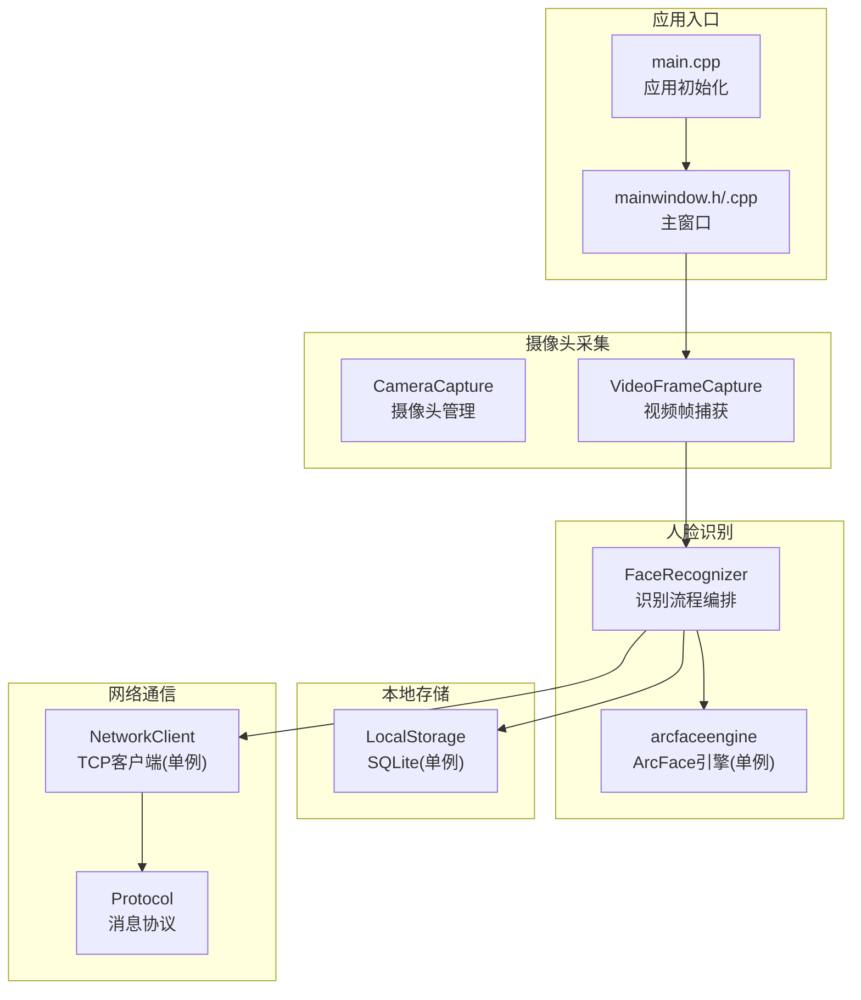
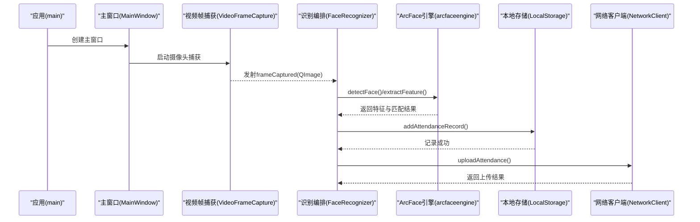
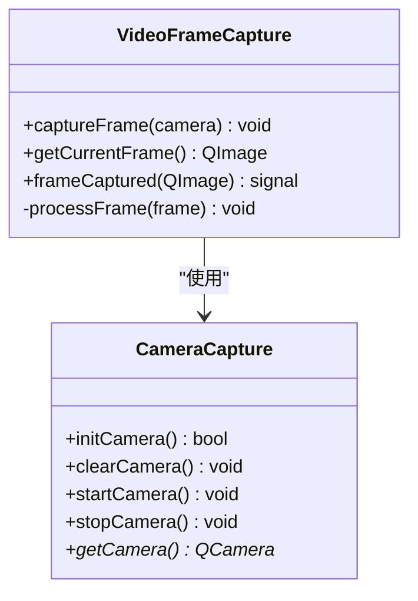
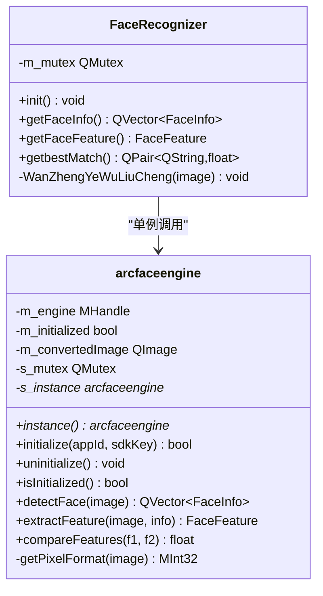
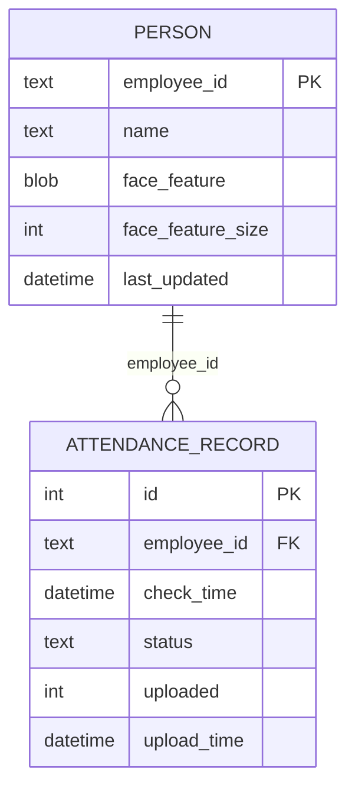
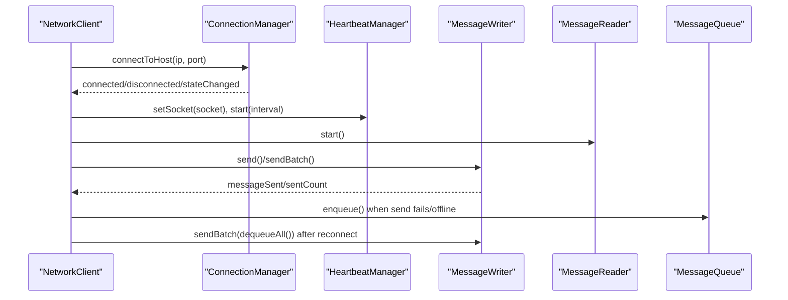
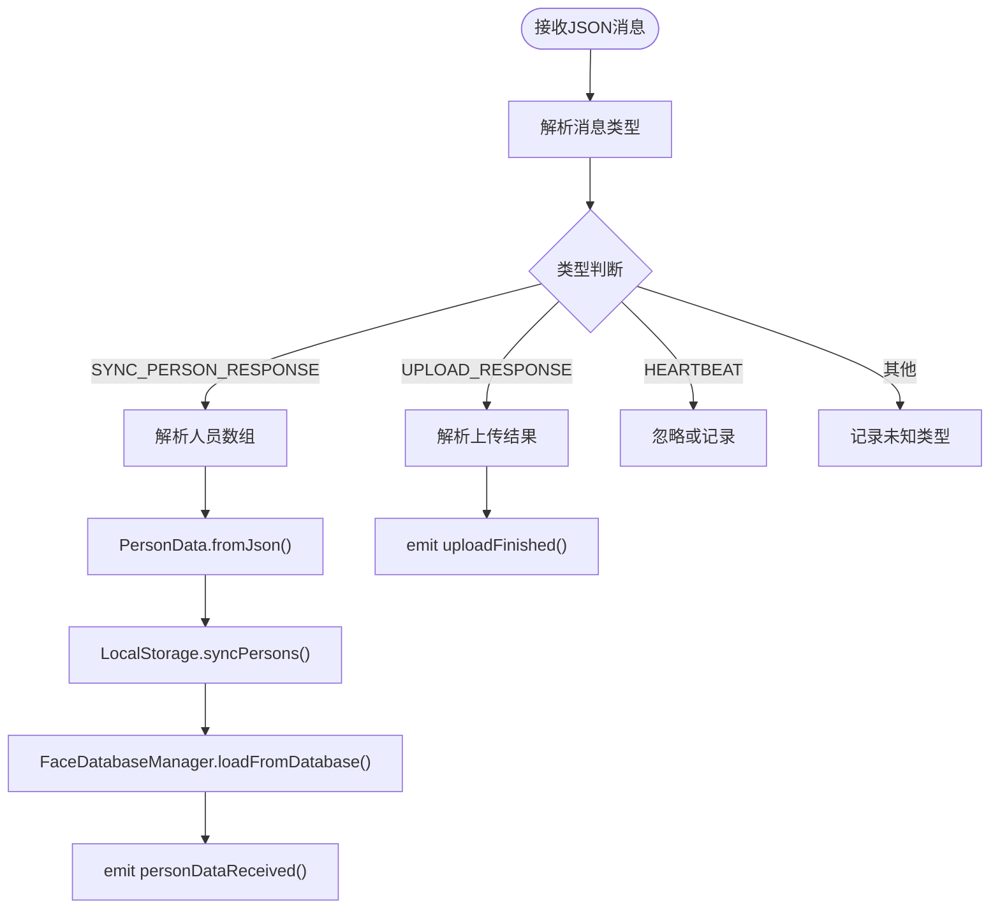
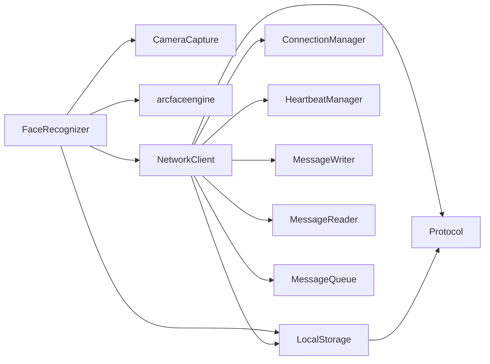

# 系统架构

<cite>
**本文引用的文件**
- [CMakeLists.txt](file://CMakeLists.txt)
- [main.cpp](file://main.cpp)
- [mainwindow.h](file://mainwindow.h)
- [mainwindow.cpp](file://mainwindow.cpp)
- [AttendanceCheckClient开发文档.md](file://AttendanceCheckClient开发文档.md)
- [CameraCapture/cameracapture.h](file://CameraCapture/cameracapture.h)
- [CameraCapture/cameracapture.cpp](file://CameraCapture/cameracapture.cpp)
- [CameraCapture/videoframecapture.h](file://CameraCapture/videoframecapture.h)
- [CameraCapture/videoframecapture.cpp](file://CameraCapture/videoframecapture.cpp)
- [FaceRecognition/arcfaceengine.h](file://FaceRecognition/arcfaceengine.h)
- [FaceRecognition/arcfaceengine.cpp](file://FaceRecognition/arcfaceengine.cpp)
- [FaceRecognition/facerecognizer.h](file://FaceRecognition/facerecognizer.h)
- [FaceRecognition/facerecognizer.cpp](file://FaceRecognition/facerecognizer.cpp)
- [LocalStorage/localstorage.h](file://LocalStorage/localstorage.h)
- [LocalStorage/localstorage.cpp](file://LocalStorage/localstorage.cpp)
- [NetworkClient/networkclient.h](file://NetworkClient/networkclient.h)
- [NetworkClient/networkclient.cpp](file://NetworkClient/networkclient.cpp)
- [NetworkClient/protocol.h](file://NetworkClient/protocol.h)
- [NetworkClient/protocol.cpp](file://NetworkClient/protocol.cpp)
</cite>

## 目录
1. [简介](#简介)
2. [项目结构](#项目结构)
3. [核心组件](#核心组件)
4. [架构总览](#架构总览)
5. [详细组件分析](#详细组件分析)
6. [依赖关系分析](#依赖关系分析)
7. [性能考量](#性能考量)
8. [故障排查指南](#故障排查指南)
9. [结论](#结论)
10. [附录](#附录)

## 简介
本系统为局域网智能考勤打卡端，基于 Qt 框架开发，采用 C++17 标准，结合 ArcFace 人脸识别引擎与 SQLite 本地存储，实现“人脸采集—识别—本地记录—断网缓存—TCP 上报”的完整闭环。系统遵循 C/S 架构，客户端负责现场人脸识别与数据上报，服务端负责人员数据下发与业务处理。

技术栈与模块划分：
- Qt 模块：Widgets、Network、Sql、Multimedia、MultimediaWidgets
- 人脸识别：ArcFace 引擎（单例）
- 本地存储：SQLite（LocalStorage 单例）
- 网络通信：TCP 客户端（NetworkClient 单例），心跳与消息队列
- 摄像头采集：Qt Multimedia 框架（VideoFrameCapture）

## 项目结构
系统采用按功能域分层的模块化组织，主要模块如下：
- CameraCapture：摄像头初始化、视频帧捕获与信号发射
- FaceRecognition：人脸识别引擎封装（ArcFace）、特征提取与匹配、业务流程编排
- LocalStorage：SQLite 数据库连接、人员与打卡记录表、事务与索引
- NetworkClient：TCP 客户端、连接管理、心跳、消息读写、消息队列、协议编解码
- UI：主窗口（MainWindow）承载界面布局
- third_party：ArcFace SDK 头文件与库

图表来源
- [main.cpp:13-27](file://main.cpp#L13-L27)
- [mainwindow.h:11-17](file://mainwindow.h#L11-L17)
- [mainwindow.cpp:3-7](file://mainwindow.cpp#L3-L7)
- [CameraCapture/cameracapture.h:9-27](file://CameraCapture/cameracapture.h#L9-L27)
- [CameraCapture/videoframecapture.h:14-40](file://CameraCapture/videoframecapture.h#L14-L40)
- [FaceRecognition/arcfaceengine.h:21-48](file://FaceRecognition/arcfaceengine.h#L21-L48)
- [FaceRecognition/facerecognizer.h:25-57](file://FaceRecognition/facerecognizer.h#L25-L57)
- [LocalStorage/localstorage.h:15-45](file://LocalStorage/localstorage.h#L15-L45)
- [NetworkClient/networkclient.h:17-73](file://NetworkClient/networkclient.h#L17-L73)
- [NetworkClient/protocol.h:15-58](file://NetworkClient/protocol.h#L15-L58)

章节来源
- [CMakeLists.txt:19-54](file://CMakeLists.txt#L19-L54)
- [AttendanceCheckClient开发文档.md:22-29](file://AttendanceCheckClient开发文档.md#L22-L29)

## 核心组件
- 应用入口与主窗口
  - main.cpp 初始化 QApplication 与 MainWindow，作为应用生命周期入口
  - MainWindow 提供 UI 容器，承载摄像头预览与业务界面
- 摄像头采集
  - CameraCapture 负责摄像头设备发现、实例化与启停
  - VideoFrameCapture 通过 QMediaCaptureSession 与 QVideoSink 接收视频帧，转换为 QImage 并发出 frameCaptured 信号
- 人脸识别
  - arcfaceengine 封装 ArcFace 引擎，提供人脸检测、特征提取、特征对比，并以单例模式提供全局唯一实例
  - FaceRecognizer 组织完整业务流程：检测—提取—对比—本地记录—尝试上报
- 本地存储
  - LocalStorage 封装 SQLite 连接、建表、索引、事务、人员同步与打卡记录的增删改查
- 网络通信
  - NetworkClient 以单例提供连接管理、心跳、消息读写、消息队列与协议编解码
  - Protocol 定义消息类型、结构体与序列化/反序列化

章节来源
- [main.cpp:13-27](file://main.cpp#L13-L27)
- [mainwindow.h:11-17](file://mainwindow.h#L11-L17)
- [mainwindow.cpp:3-7](file://mainwindow.cpp#L3-L7)
- [CameraCapture/cameracapture.h:9-27](file://CameraCapture/cameracapture.h#L9-L27)
- [CameraCapture/cameracapture.cpp:14-33](file://CameraCapture/cameracapture.cpp#L14-L33)
- [CameraCapture/videoframecapture.h:14-40](file://CameraCapture/videoframecapture.h#L14-L40)
- [CameraCapture/videoframecapture.cpp:10-19](file://CameraCapture/videoframecapture.cpp#L10-L19)
- [FaceRecognition/arcfaceengine.h:21-48](file://FaceRecognition/arcfaceengine.h#L21-L48)
- [FaceRecognition/arcfaceengine.cpp:18-28](file://FaceRecognition/arcfaceengine.cpp#L18-L28)
- [FaceRecognition/facerecognizer.h:25-57](file://FaceRecognition/facerecognizer.h#L25-L57)
- [FaceRecognition/facerecognizer.cpp:20-51](file://FaceRecognition/facerecognizer.cpp#L20-L51)
- [LocalStorage/localstorage.h:15-45](file://LocalStorage/localstorage.h#L15-L45)
- [LocalStorage/localstorage.cpp:30-121](file://LocalStorage/localstorage.cpp#L30-L121)
- [NetworkClient/networkclient.h:17-73](file://NetworkClient/networkclient.h#L17-L73)
- [NetworkClient/networkclient.cpp:221-231](file://NetworkClient/networkclient.cpp#L221-L231)
- [NetworkClient/protocol.h:15-58](file://NetworkClient/protocol.h#L15-L58)
- [NetworkClient/protocol.cpp:42-61](file://NetworkClient/protocol.cpp#L42-L61)

## 架构总览
系统采用 Qt 的事件驱动与信号槽机制，结合单例模式与观察者模式（信号槽）实现模块间松耦合。核心交互链路如下：

图表来源
- [main.cpp:21-26](file://main.cpp#L21-L26)
- [mainwindow.cpp:3-7](file://mainwindow.cpp#L3-L7)
- [CameraCapture/videoframecapture.cpp:71-79](file://CameraCapture/videoframecapture.cpp#L71-L79)
- [FaceRecognition/facerecognizer.cpp:53-88](file://FaceRecognition/facerecognizer.cpp#L53-L88)
- [FaceRecognition/arcfaceengine.cpp:97-180](file://FaceRecognition/arcfaceengine.cpp#L97-L180)
- [LocalStorage/localstorage.cpp:183-224](file://LocalStorage/localstorage.cpp#L183-L224)
- [NetworkClient/networkclient.cpp:44-65](file://NetworkClient/networkclient.cpp#L44-L65)

## 详细组件分析

### 摄像头采集模块（CameraCapture/VideoFrameCapture）
- 职责
  - CameraCapture：扫描设备、实例化 QCamera、启停控制
  - VideoFrameCapture：建立 QMediaCaptureSession 与 QVideoSink，接收 QVideoFrame，转换为 QImage 并发出 frameCaptured 信号
- 关键点
  - 使用 Qt Multimedia 模块，支持多平台摄像头
  - 通过信号槽与识别模块解耦
- 错误处理
  - 无可用摄像头、摄像头实例化失败、帧转换失败均输出日志并短路

图表来源
- [CameraCapture/cameracapture.h:9-27](file://CameraCapture/cameracapture.h#L9-L27)
- [CameraCapture/cameracapture.cpp:14-33](file://CameraCapture/cameracapture.cpp#L14-L33)
- [CameraCapture/videoframecapture.h:14-40](file://CameraCapture/videoframecapture.h#L14-L40)
- [CameraCapture/videoframecapture.cpp:10-19](file://CameraCapture/videoframecapture.cpp#L10-L19)

章节来源
- [CameraCapture/cameracapture.h:9-27](file://CameraCapture/cameracapture.h#L9-L27)
- [CameraCapture/cameracapture.cpp:14-33](file://CameraCapture/cameracapture.cpp#L14-L33)
- [CameraCapture/videoframecapture.h:14-40](file://CameraCapture/videoframecapture.h#L14-L40)
- [CameraCapture/videoframecapture.cpp:10-19](file://CameraCapture/videoframecapture.cpp#L10-L19)

### 人脸识别模块（arcfaceengine/FaceRecognizer）
- 职责
  - arcfaceengine：单例封装 ArcSoft SDK，提供人脸检测、特征提取、特征对比
  - FaceRecognizer：组织业务流程，连接摄像头与引擎，完成识别—记录—上报
- 关键点
  - 单例模式：全局唯一引擎实例，线程安全（QMutex）
  - 观察者模式：VideoFrameCapture 的 frameCaptured 信号驱动识别流程
  - 识别阈值：相似度大于 0.8 视为同一人
- 错误处理
  - 引擎未初始化、图像为空、SDK 调用失败均输出警告并短路

图表来源
- [FaceRecognition/arcfaceengine.h:21-48](file://FaceRecognition/arcfaceengine.h#L21-L48)
- [FaceRecognition/arcfaceengine.cpp:18-28](file://FaceRecognition/arcfaceengine.cpp#L18-L28)
- [FaceRecognition/facerecognizer.h:25-57](file://FaceRecognition/facerecognizer.h#L25-L57)
- [FaceRecognition/facerecognizer.cpp:20-51](file://FaceRecognition/facerecognizer.cpp#L20-L51)

章节来源
- [FaceRecognition/arcfaceengine.h:21-48](file://FaceRecognition/arcfaceengine.h#L21-L48)
- [FaceRecognition/arcfaceengine.cpp:30-62](file://FaceRecognition/arcfaceengine.cpp#L30-L62)
- [FaceRecognition/facerecognizer.h:25-57](file://FaceRecognition/facerecognizer.h#L25-L57)
- [FaceRecognition/facerecognizer.cpp:53-88](file://FaceRecognition/facerecognizer.cpp#L53-L88)

### 本地存储模块（LocalStorage）
- 职责
  - SQLite 文件数据库，建表与索引、事务、人员同步、打卡记录增删改查
  - 单例模式，线程安全（QMutex）
- 关键点
  - 人员表 Person：主键 employee_id，字段含人脸特征二进制与大小
  - 打卡记录表 AttendanceRecord：外键关联 Person，状态约束与索引
  - 事务：人员同步与记录写入均使用事务保证一致性
- 错误处理
  - 数据库未连接、事务失败、SQL 执行失败均输出日志并回滚

图表来源
- [LocalStorage/localstorage.cpp:68-121](file://LocalStorage/localstorage.cpp#L68-L121)
- [LocalStorage/localstorage.cpp:183-224](file://LocalStorage/localstorage.cpp#L183-L224)

章节来源
- [LocalStorage/localstorage.h:15-45](file://LocalStorage/localstorage.h#L15-L45)
- [LocalStorage/localstorage.cpp:30-121](file://LocalStorage/localstorage.cpp#L30-L121)
- [LocalStorage/localstorage.cpp:183-224](file://LocalStorage/localstorage.cpp#L183-L224)

### 网络通信模块（NetworkClient/Protocol）
- 职责
  - NetworkClient：TCP 客户端，连接管理、心跳、消息读写、消息队列、协议编解码
  - Protocol：消息类型枚举、结构体与序列化/反序列化
- 关键点
  - 单例模式：全局唯一网络客户端实例
  - 心跳：定期心跳维持连接，超时触发重连
  - 断网缓存：发送失败或断网时将消息入队，恢复后批量重发
  - 业务接口：同步人员数据、上传打卡记录、上报设备状态
- 错误处理
  - 连接失败、发送错误、心跳超时均输出日志并触发重连或入队

图表来源
- [NetworkClient/networkclient.cpp:12-25](file://NetworkClient/networkclient.cpp#L12-L25)
- [NetworkClient/networkclient.cpp:108-138](file://NetworkClient/networkclient.cpp#L108-L138)
- [NetworkClient/networkclient.cpp:241-267](file://NetworkClient/networkclient.cpp#L241-L267)
- [NetworkClient/protocol.h:15-58](file://NetworkClient/protocol.h#L15-L58)
- [NetworkClient/protocol.cpp:42-61](file://NetworkClient/protocol.cpp#L42-L61)

章节来源
- [NetworkClient/networkclient.h:17-73](file://NetworkClient/networkclient.h#L17-L73)
- [NetworkClient/networkclient.cpp:221-231](file://NetworkClient/networkclient.cpp#L221-L231)
- [NetworkClient/protocol.h:15-58](file://NetworkClient/protocol.h#L15-L58)
- [NetworkClient/protocol.cpp:42-61](file://NetworkClient/protocol.cpp#L42-L61)

### 协议与消息流程（Protocol）
- 消息类型
  - 心跳、人员数据同步请求/响应、上传打卡记录、上传响应、设备状态上报
- 结构体
  - AttendanceRecord：employeeId、checkTime、status
  - PersonData：employeeId、name、faceFeature(Base64 文本传输）、featureSize
- 序列化/反序列化
  - 人员特征以 Base64 文本传输，确保 JSON 可移植性

图表来源
- [NetworkClient/networkclient.cpp:183-203](file://NetworkClient/networkclient.cpp#L183-L203)
- [NetworkClient/networkclient.cpp:269-299](file://NetworkClient/networkclient.cpp#L269-L299)
- [NetworkClient/protocol.cpp:14-21](file://NetworkClient/protocol.cpp#L14-L21)
- [NetworkClient/protocol.cpp:33-40](file://NetworkClient/protocol.cpp#L33-L40)

章节来源
- [NetworkClient/protocol.h:15-58](file://NetworkClient/protocol.h#L15-L58)
- [NetworkClient/protocol.cpp:42-61](file://NetworkClient/protocol.cpp#L42-L61)
- [NetworkClient/networkclient.cpp:269-299](file://NetworkClient/networkclient.cpp#L269-L299)

## 依赖关系分析
- 构建与运行时依赖
  - Qt6/Qt5 Widgets、Network、Sql、Multimedia、MultimediaWidgets
  - ArcFace SDK 头文件与库
- 模块耦合
  - FaceRecognizer 依赖 CameraCapture、arcfaceengine、LocalStorage、NetworkClient
  - NetworkClient 依赖 ConnectionManager、HeartbeatManager、MessageWriter、MessageReader、MessageQueue、Protocol、LocalStorage
  - LocalStorage 与 Protocol 低耦合，仅在序列化结构体时使用
- 循环依赖
  - 未见循环依赖；若后续扩展，应避免跨模块 include 导致的编译期环

图表来源
- [FaceRecognition/facerecognizer.h:25-57](file://FaceRecognition/facerecognizer.h#L25-L57)
- [NetworkClient/networkclient.h:17-73](file://NetworkClient/networkclient.h#L17-L73)
- [LocalStorage/localstorage.h:15-45](file://LocalStorage/localstorage.h#L15-L45)

章节来源
- [CMakeLists.txt:75-82](file://CMakeLists.txt#L75-L82)
- [FaceRecognition/facerecognizer.h:25-57](file://FaceRecognition/facerecognizer.h#L25-L57)
- [NetworkClient/networkclient.h:17-73](file://NetworkClient/networkclient.h#L17-L73)

## 性能考量
- 人脸识别
  - 图像格式转换与宽度对齐（4 字节对齐）降低 SDK 调用失败概率
  - 单例引擎避免重复初始化带来的性能损耗
  - 相似度阈值 0.8 作为识别通过门槛，兼顾准确率与性能
- 摄像头采集
  - 使用 QMediaCaptureSession 与 QVideoSink，避免手动像素处理
  - 帧转换为 QImage 后立即发出信号，避免阻塞
- 本地存储
  - 事务批量写入，减少磁盘 IO
  - 为 Person 与 AttendanceRecord 建立索引，提升查询效率
- 网络通信
  - 心跳维持连接，断网缓存与批量重发减少网络抖动影响
  - 发送失败或断网时入队，恢复后批量发送，降低频繁握手成本

## 故障排查指南
- 摄像头问题
  - 症状：无可用摄像头、启动失败
  - 排查：确认设备枚举、实例化与启停流程，查看日志输出
  - 参考
    - [CameraCapture/cameracapture.cpp:14-33](file://CameraCapture/cameracapture.cpp#L14-L33)
    - [CameraCapture/videoframecapture.cpp:21-62](file://CameraCapture/videoframecapture.cpp#L21-L62)
- 人脸识别失败
  - 症状：检测不到人脸、特征提取失败、对比失败
  - 排查：检查引擎初始化、图像格式转换、SDK 返回码
  - 参考
    - [FaceRecognition/arcfaceengine.cpp:97-180](file://FaceRecognition/arcfaceengine.cpp#L97-L180)
    - [FaceRecognition/arcfaceengine.cpp:182-249](file://FaceRecognition/arcfaceengine.cpp#L182-L249)
- 本地存储异常
  - 症状：数据库未连接、事务失败、SQL 错误
  - 排查：检查数据库路径、建表与索引、事务提交
  - 参考
    - [LocalStorage/localstorage.cpp:30-121](file://LocalStorage/localstorage.cpp#L30-L121)
    - [LocalStorage/localstorage.cpp:183-224](file://LocalStorage/localstorage.cpp#L183-L224)
- 网络通信问题
  - 症状：连接失败、心跳超时、发送错误、断网缓存未生效
  - 排查：检查连接参数、心跳间隔、消息队列处理、批量发送
  - 参考
    - [NetworkClient/networkclient.cpp:12-25](file://NetworkClient/networkclient.cpp#L12-L25)
    - [NetworkClient/networkclient.cpp:108-138](file://NetworkClient/networkclient.cpp#L108-L138)
    - [NetworkClient/networkclient.cpp:241-267](file://NetworkClient/networkclient.cpp#L241-L267)

章节来源
- [CameraCapture/cameracapture.cpp:14-33](file://CameraCapture/cameracapture.cpp#L14-L33)
- [CameraCapture/videoframecapture.cpp:21-62](file://CameraCapture/videoframecapture.cpp#L21-L62)
- [FaceRecognition/arcfaceengine.cpp:97-180](file://FaceRecognition/arcfaceengine.cpp#L97-L180)
- [LocalStorage/localstorage.cpp:30-121](file://LocalStorage/localstorage.cpp#L30-L121)
- [NetworkClient/networkclient.cpp:12-25](file://NetworkClient/networkclient.cpp#L12-L25)

## 结论
本系统以 Qt 为核心，围绕单例模式与观察者模式构建了清晰的模块边界与职责分工。摄像头采集、人脸识别、本地存储与网络通信四大模块协同工作，形成稳定的“识别—记录—上报”闭环。通过事务、索引、心跳与断网缓存等机制，系统在准确性、可靠性与可维护性方面达到良好平衡。建议后续在 UI 与监控告警方面进一步完善，以满足生产环境的运维需求。

## 附录
- 技术栈与版本
  - Qt：5.15/6.2+（自动 MOC/UIC/RCC）
  - C++：C++17
  - 数据库：SQLite3
  - 人脸识别：ArcFace SDK
- 基础设施与部署
  - 部署位置：考勤现场电脑或专用设备
  - 局域网访问：需可访问管理端 IP 与端口
  - 依赖库：ArcFace SDK（头文件与库）
- 可扩展性与安全
  - 可扩展性：模块化设计便于替换识别算法、存储介质与网络协议
  - 安全性：建议在网络层引入 TLS/证书校验、消息签名与鉴权机制
- 监控与灾难恢复
  - 建议：接入日志系统、指标采集（CPU/内存/网络/识别耗时）、断电/断网自动重启策略

章节来源
- [CMakeLists.txt:16-17](file://CMakeLists.txt#L16-L17)
- [AttendanceCheckClient开发文档.md:92-99](file://AttendanceCheckClient开发文档.md#L92-L99)