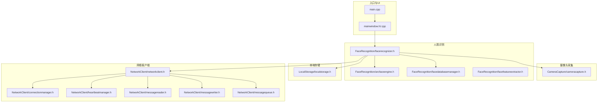
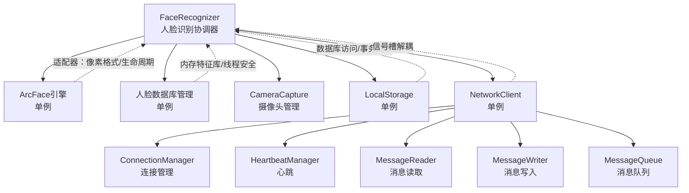
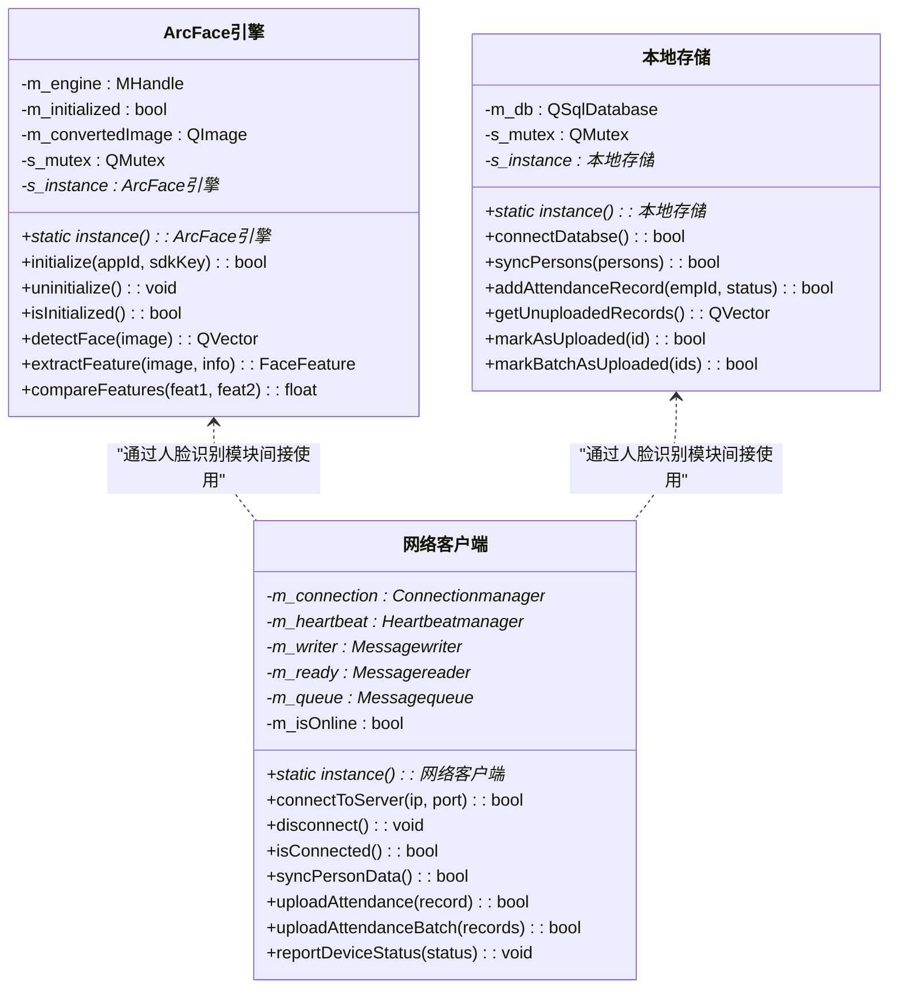
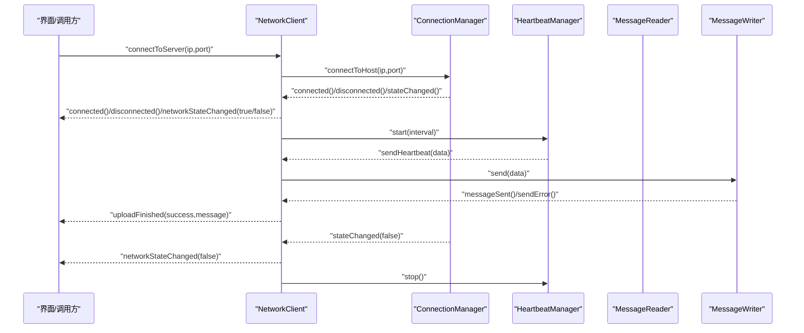
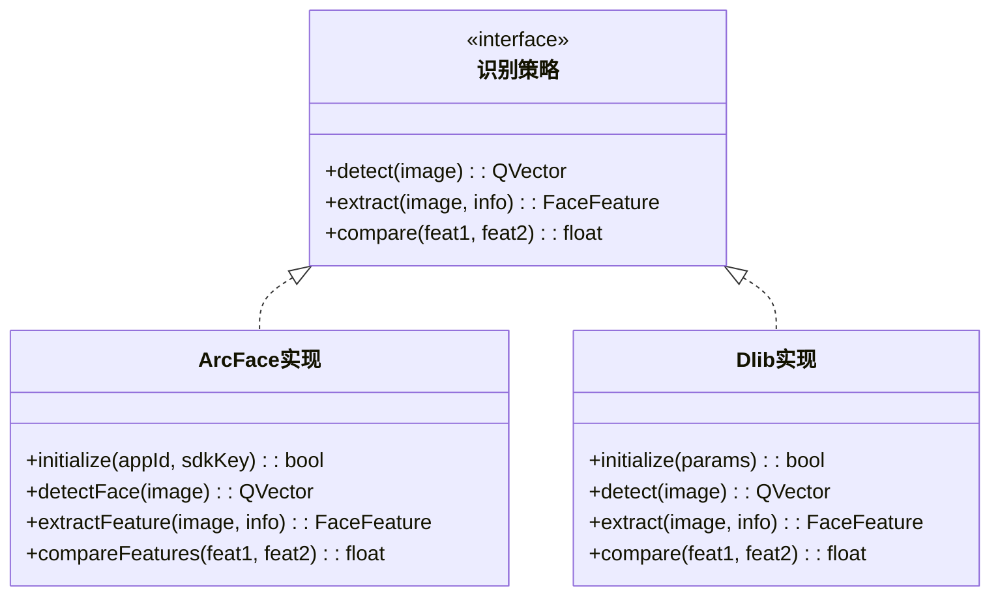
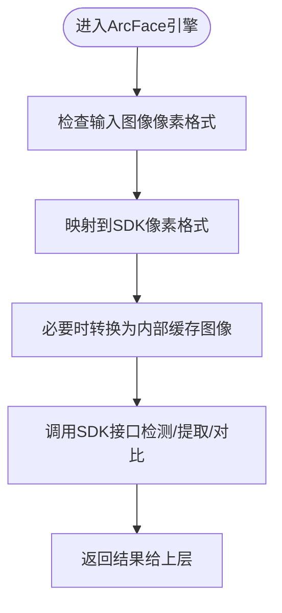
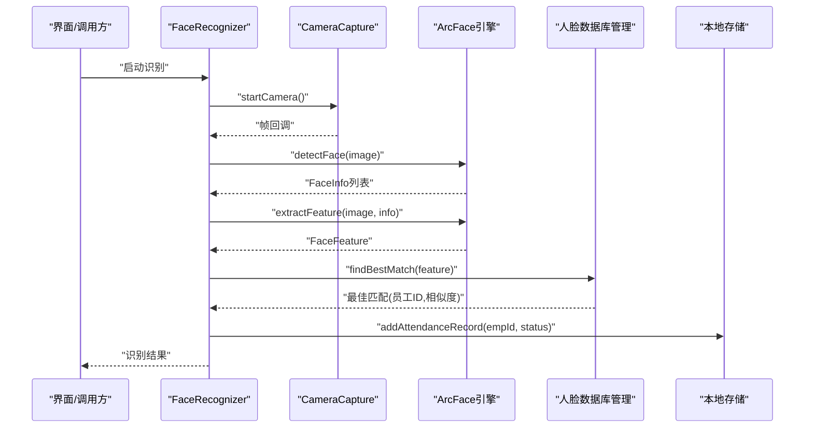
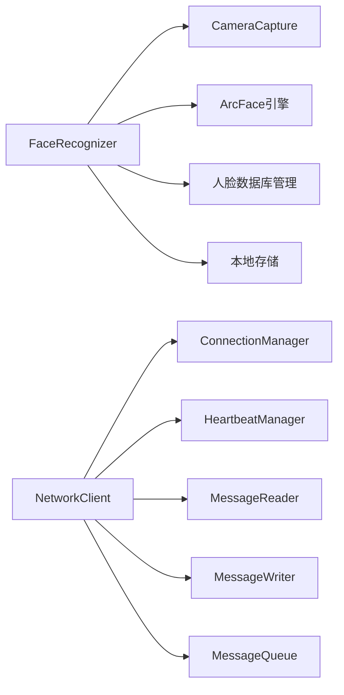

# 设计模式

<cite>
**本文引用的文件**
- [main.cpp](file://main.cpp)
- [mainwindow.h](file://mainwindow.h)
- [mainwindow.cpp](file://mainwindow.cpp)
- [arcfaceengine.h](file://FaceRecognition/arcfaceengine.h)
- [localstorage.h](file://LocalStorage/localstorage.h)
- [networkclient.h](file://NetworkClient/networkclient.h)
- [facerecognizer.h](file://FaceRecognition/facerecognizer.h)
- [facefeatureextractor.h](file://FaceRecognition/facefeatureextractor.h)
- [facedatabasemanager.h](file://FaceRecognition/facedatabasemanager.h)
- [connectionmanager.h](file://NetworkClient/connectionmanager.h)
- [messagequeue.h](file://NetworkClient/messagequeue.h)
- [messagereader.h](file://NetworkClient/messagereader.h)
- [messagewriter.h](file://NetworkClient/messagewriter.h)
- [heartbeatmanager.h](file://NetworkClient/heartbeatmanager.h)
- [cameracapture.h](file://CameraCapture/cameracapture.h)
</cite>

## 目录
1. [引言](#引言)
2. [项目结构](#项目结构)
3. [核心组件与设计模式总览](#核心组件与设计模式总览)
4. [架构概览](#架构概览)
5. [详细组件分析与模式详解](#详细组件分析与模式详解)
6. [依赖关系分析](#依赖关系分析)
7. [性能与并发特性](#性能与并发特性)
8. [故障排查与常见问题](#故障排查与常见问题)
9. [结论](#结论)
10. [附录：最佳实践与注意事项](#附录最佳实践与注意事项)

## 引言
本文件面向AttendanceSystem项目的“设计模式”主题，系统梳理并深入分析以下模式在项目中的应用与价值：
- 单例模式：ArcFace引擎、本地存储、网络客户端
- 观察者模式：Qt信号槽机制在连接、心跳、消息读写等模块中的体现
- 工厂模式：消息处理器（未在当前代码中直接出现）的潜在应用建议
- 策略模式：不同识别算法选择（当前使用ArcFace，策略化便于替换）
- 适配器模式：第三方SDK（ArcSoft）与Qt/QML层之间的适配

同时，本文提供UML类图、时序图与流程图，并结合具体文件路径给出实现示例，帮助读者理解这些模式如何提升系统的可维护性与可扩展性。

## 项目结构
项目采用按功能域划分的模块化组织方式：
- 入口与UI：main.cpp、mainwindow.*
- 摄像头采集：CameraCapture/*
- 人脸识别：FaceRecognition/*
- 本地存储：LocalStorage/*
- 网络客户端：NetworkClient/*
- 第三方库：third_party/*

图表来源
- [main.cpp:1-28](file://main.cpp#L1-L28)
- [mainwindow.h:1-23](file://mainwindow.h#L1-L23)
- [facerecognizer.h:1-61](file://FaceRecognition/facerecognizer.h#L1-L61)
- [arcfaceengine.h:1-115](file://FaceRecognition/arcfaceengine.h#L1-L115)
- [facedatabasemanager.h:1-47](file://FaceRecognition/facedatabasemanager.h#L1-L47)
- [localstorage.h:1-49](file://LocalStorage/localstorage.h#L1-L49)
- [networkclient.h:1-75](file://NetworkClient/networkclient.h#L1-L75)
- [connectionmanager.h:1-45](file://NetworkClient/connectionmanager.h#L1-L45)
- [heartbeatmanager.h:1-41](file://NetworkClient/heartbeatmanager.h#L1-L41)
- [messagereader.h:1-60](file://NetworkClient/messagereader.h#L1-L60)
- [messagewriter.h:1-50](file://NetworkClient/messagewriter.h#L1-L50)
- [messagequeue.h:1-33](file://NetworkClient/messagequeue.h#L1-L33)
- [cameracapture.h:1-31](file://CameraCapture/cameracapture.h#L1-L31)

章节来源
- [main.cpp:1-28](file://main.cpp#L1-L28)
- [mainwindow.h:1-23](file://mainwindow.h#L1-L23)
- [mainwindow.cpp:1-14](file://mainwindow.cpp#L1-L14)

## 核心组件与设计模式总览
- 单例模式：ArcFace引擎、本地存储、网络客户端均提供静态instance()方法，保证全局唯一实例，避免重复初始化与资源浪费。
- 观察者模式：广泛使用Qt信号槽，模块间通过信号解耦，连接状态、心跳、消息收发、上传结果等均以信号驱动。
- 工厂模式：当前未见显式工厂类；可在消息处理器处引入工厂，依据协议类型动态创建处理器实例。
- 策略模式：当前识别算法固定为ArcFace；可通过策略接口抽象，运行时切换算法（如后续接入Dlib或OpenCV）。
- 适配器模式：将ArcSoft SDK的接口与Qt类型（QImage、QRect、QByteArray）进行适配，统一数据格式与生命周期管理。

## 架构概览
下图展示系统主要模块间的交互关系，重点体现单例、观察者与适配器的协作：

图表来源
- [facerecognizer.h:1-61](file://FaceRecognition/facerecognizer.h#L1-L61)
- [arcfaceengine.h:1-115](file://FaceRecognition/arcfaceengine.h#L1-L115)
- [facedatabasemanager.h:1-47](file://FaceRecognition/facedatabasemanager.h#L1-L47)
- [localstorage.h:1-49](file://LocalStorage/localstorage.h#L1-L49)
- [networkclient.h:1-75](file://NetworkClient/networkclient.h#L1-L75)
- [connectionmanager.h:1-45](file://NetworkClient/connectionmanager.h#L1-L45)
- [heartbeatmanager.h:1-41](file://NetworkClient/heartbeatmanager.h#L1-L41)
- [messagereader.h:1-60](file://NetworkClient/messagereader.h#L1-L60)
- [messagewriter.h:1-50](file://NetworkClient/messagewriter.h#L1-L50)
- [messagequeue.h:1-33](file://NetworkClient/messagequeue.h#L1-L33)
- [cameracapture.h:1-31](file://CameraCapture/cameracapture.h#L1-L31)

## 详细组件分析与模式详解

### 单例模式：ArcFace引擎、本地存储、网络客户端
- 实现要点
  - 静态instance()方法返回唯一实例
  - 私有构造/析构，删除拷贝构造与赋值，防止多实例
  - 使用QMutex保证线程安全
  - 资源在析构时释放，避免泄漏
- 优势
  - 统一资源管理，避免重复初始化
  - 线程安全，降低竞态条件
  - 易于跨模块共享与访问
- 应用场景
  - ArcFace引擎：全局唯一，避免重复注册/初始化
  - 本地存储：数据库连接与事务一致性
  - 网络客户端：统一连接、心跳、消息编排

图表来源
- [arcfaceengine.h:1-115](file://FaceRecognition/arcfaceengine.h#L1-L115)
- [localstorage.h:1-49](file://LocalStorage/localstorage.h#L1-L49)
- [networkclient.h:1-75](file://NetworkClient/networkclient.h#L1-L75)

章节来源
- [arcfaceengine.h:48-112](file://FaceRecognition/arcfaceengine.h#L48-L112)
- [localstorage.h:19-46](file://LocalStorage/localstorage.h#L19-L46)
- [networkclient.h:21-73](file://NetworkClient/networkclient.h#L21-L73)

### 观察者模式：Qt信号槽机制
- 连接管理模块
  - signals：connected、disconnected、errorOccurred、stateChanged
  - slots：onSocketConnected、onSocketDisconnected、onSocketError、onReconnectTimeout
- 心跳管理模块
  - signals：heartbeattimeout、sendHeartbeat
  - slots：onTimeout
- 消息读写模块
  - Messagereader：messageReceived、parseError
  - Messagewriter：messageSent、sendError
- 网络客户端聚合
  - 将子模块信号连接到内部槽，再发出高层信号（connected/disconnected/networkStateChanged等）

图表来源
- [networkclient.h:36-73](file://NetworkClient/networkclient.h#L36-L73)
- [connectionmanager.h:23-42](file://NetworkClient/connectionmanager.h#L23-L42)
- [heartbeatmanager.h:25-38](file://NetworkClient/heartbeatmanager.h#L25-L38)
- [messagereader.h:20-35](file://NetworkClient/messagereader.h#L20-L35)
- [messagewriter.h:23-33](file://NetworkClient/messagewriter.h#L23-L33)

章节来源
- [connectionmanager.h:23-42](file://NetworkClient/connectionmanager.h#L23-L42)
- [heartbeatmanager.h:25-38](file://NetworkClient/heartbeatmanager.h#L25-L38)
- [messagereader.h:20-35](file://NetworkClient/messagereader.h#L20-L35)
- [messagewriter.h:23-33](file://NetworkClient/messagewriter.h#L23-L33)
- [networkclient.h:36-73](file://NetworkClient/networkclient.h#L36-L73)

### 工厂模式：消息处理器（建议）
- 当前现状：NetworkClient聚合多个子模块并通过信号槽编排，但未见根据协议类型动态创建处理器的工厂类。
- 建议实现
  - 定义消息处理器接口（如handle(message)），针对不同协议类型返回具体处理器实例
  - 在NetworkClient中引入工厂，按协议号/类型选择处理器
- 优点
  - 新增协议无需修改主流程，易于扩展
  - 降低switch/if分支复杂度，提高可维护性

[本小节为概念性建议，不直接分析具体文件，故无章节来源]

### 策略模式：识别算法选择（建议）
- 当前现状：人脸识别固定使用ArcFace引擎，数据结构与接口在arcfaceengine.h中定义。
- 建议实现
  - 抽象识别接口（如detect/extract/compare），ArcFace实现该接口
  - 运行时通过配置或参数选择算法（如Dlib/OpenCV），替换实现不影响上层调用
- 优点
  - 算法可插拔，便于A/B测试与迁移
  - 保持人脸识别流程不变，仅替换底层实现

图表来源
- [arcfaceengine.h:28-90](file://FaceRecognition/arcfaceengine.h#L28-L90)

章节来源
- [arcfaceengine.h:28-90](file://FaceRecognition/arcfaceengine.h#L28-L90)

### 适配器模式：第三方库集成
- 适配内容
  - 将ArcSoft SDK的MInt32/MHandle与Qt类型（QImage、QRect、QByteArray）进行转换
  - 统一像素格式、生命周期与内存管理
- 关键点
  - getPixelFormat映射像素格式
  - m_convertedImage作为中间缓存，确保SDK调用期间数据有效
- 价值
  - 降低SDK耦合度，便于未来替换或升级
  - 保持上层接口稳定，屏蔽底层差异

图表来源
- [arcfaceengine.h:101-104](file://FaceRecognition/arcfaceengine.h#L101-L104)

章节来源
- [arcfaceengine.h:101-104](file://FaceRecognition/arcfaceengine.h#L101-L104)

### 人脸识别流程与模块协作
- 整体流程
  - 摄像头采集帧 -> 人脸检测 -> 特征提取 -> 内存库对比 -> 结果上报/记录
- 关键模块
  - FaceRecognizer协调摄像头、引擎、数据库与存储
  - FaceDatabaseManager负责内存特征库加载与查找
  - LocalStorage负责本地记录与未上传数据管理

图表来源
- [facerecognizer.h:25-58](file://FaceRecognition/facerecognizer.h#L25-L58)
- [cameracapture.h:13-28](file://CameraCapture/cameracapture.h#L13-L28)
- [arcfaceengine.h:74-90](file://FaceRecognition/arcfaceengine.h#L74-L90)
- [facedatabasemanager.h:25-42](file://FaceRecognition/facedatabasemanager.h#L25-L42)
- [localstorage.h:22-32](file://LocalStorage/localstorage.h#L22-L32)

章节来源
- [facerecognizer.h:25-58](file://FaceRecognition/facerecognizer.h#L25-L58)
- [cameracapture.h:13-28](file://CameraCapture/cameracapture.h#L13-L28)
- [arcfaceengine.h:74-90](file://FaceRecognition/arcfaceengine.h#L74-L90)
- [facedatabasemanager.h:25-42](file://FaceRecognition/facedatabasemanager.h#L25-L42)
- [localstorage.h:22-32](file://LocalStorage/localstorage.h#L22-L32)

## 依赖关系分析
- 模块内聚与耦合
  - FaceRecognizer聚合摄像头、引擎、数据库与存储，承担协调职责
  - NetworkClient聚合连接、心跳、读写、队列，形成清晰的边界
- 外部依赖
  - ArcSoft SDK（通过arcfaceengine.h声明）
  - Qt SQL（LocalStorage）
  - Qt Network（NetworkClient各子模块）
- 循环依赖
  - 未发现循环依赖；模块间通过信号槽与单例访问，降低耦合

图表来源
- [facerecognizer.h:40-44](file://FaceRecognition/facerecognizer.h#L40-L44)
- [networkclient.h:66-70](file://NetworkClient/networkclient.h#L66-L70)
- [arcfaceengine.h:106-108](file://FaceRecognition/arcfaceengine.h#L106-L108)
- [facedatabasemanager.h:41-42](file://FaceRecognition/facedatabasemanager.h#L41-L42)
- [localstorage.h:43-45](file://LocalStorage/localstorage.h#L43-L45)

章节来源
- [facerecognizer.h:40-44](file://FaceRecognition/facerecognizer.h#L40-L44)
- [networkclient.h:66-70](file://NetworkClient/networkclient.h#L66-L70)
- [arcfaceengine.h:106-108](file://FaceRecognition/arcfaceengine.h#L106-L108)
- [facedatabasemanager.h:41-42](file://FaceRecognition/facedatabasemanager.h#L41-L42)
- [localstorage.h:43-45](file://LocalStorage/localstorage.h#L43-L45)

## 性能与并发特性
- 线程安全
  - 单例类使用QMutex保护实例与关键路径
  - 人脸数据库管理与消息队列使用QMutex保护共享数据
- 并发模型
  - Qt事件循环+信号槽天然异步，避免阻塞UI
  - 网络读写与心跳独立线程，减少相互影响
- 性能建议
  - 图像格式转换尽量复用缓存（m_convertedImage）
  - 批量上传与队列合并，降低网络抖动影响
  - 数据库事务同步，减少频繁IO

章节来源
- [arcfaceengine.h:110-111](file://FaceRecognition/arcfaceengine.h#L110-L111)
- [facedatabasemanager.h:42](file://FaceRecognition/facedatabasemanager.h#L42)
- [messagequeue.h:29](file://NetworkClient/messagequeue.h#L29)

## 故障排查与常见问题
- 单例未初始化
  - 现象：调用instance()返回空或功能异常
  - 排查：确认initialize()已调用且isInitialized()为真
- 线程安全问题
  - 现象：多线程访问导致崩溃或数据错乱
  - 排查：检查QMutex使用是否覆盖关键路径
- 网络不稳定
  - 现象：频繁断连、心跳超时
  - 排查：查看ConnectionManager的重连次数与HeartbeatManager超时配置
- 数据库事务失败
  - 现象：同步人员或上传记录失败
  - 排查：关注LocalStorage的事务与错误信号

章节来源
- [arcfaceengine.h:56-67](file://FaceRecognition/arcfaceengine.h#L56-L67)
- [connectionmanager.h:39-41](file://NetworkClient/connectionmanager.h#L39-L41)
- [heartbeatmanager.h:35-36](file://NetworkClient/heartbeatmanager.h#L35-L36)
- [localstorage.h:25-32](file://LocalStorage/localstorage.h#L25-L32)

## 结论
本项目在实践中自然体现了多种设计模式：
- 单例模式确保关键资源的唯一性与线程安全
- Qt信号槽构成的观察者模式使模块解耦、易于扩展
- 适配器模式有效隔离第三方SDK差异
- 工厂与策略模式在当前版本尚未显式实现，但具备良好的扩展空间

通过持续引入工厂与策略模式，系统将具备更强的可扩展性与可维护性；配合现有单例与信号槽机制，整体架构清晰、职责明确、易于演进。

## 附录：最佳实践与注意事项
- 单例
  - 严格私有化构造，提供静态instance()与线程安全
  - 在析构中释放资源，避免泄漏
- 观察者（Qt信号槽）
  - 信号与槽命名规范，避免歧义
  - 合理使用Qt::QueuedConnection进行跨线程通信
- 工厂与策略
  - 抽象接口先行，实现延迟绑定
  - 通过配置或参数切换策略，避免硬编码
- 适配器
  - 统一数据格式与生命周期，避免裸指针
  - 明确转换边界，减少不必要的拷贝