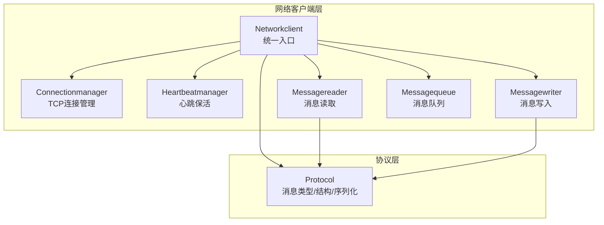
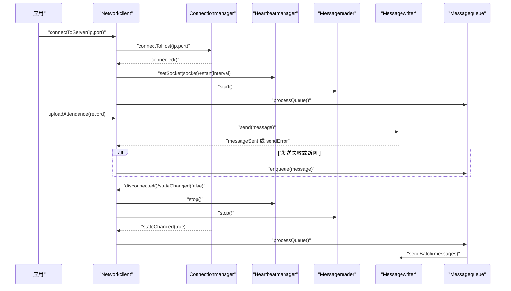
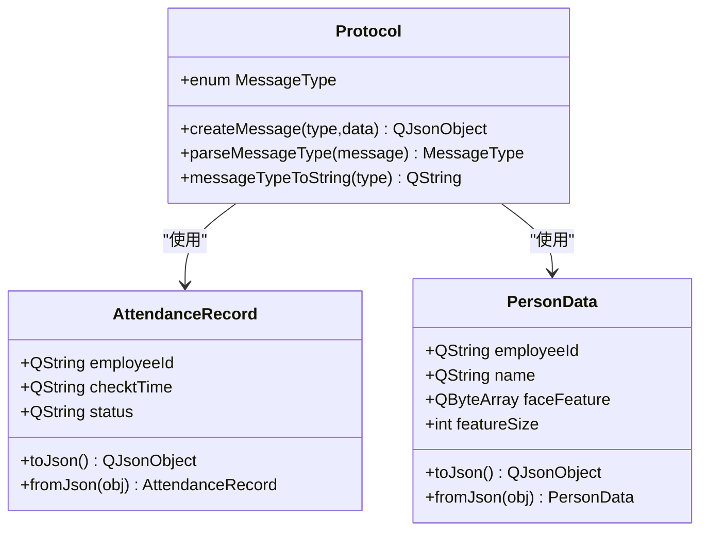
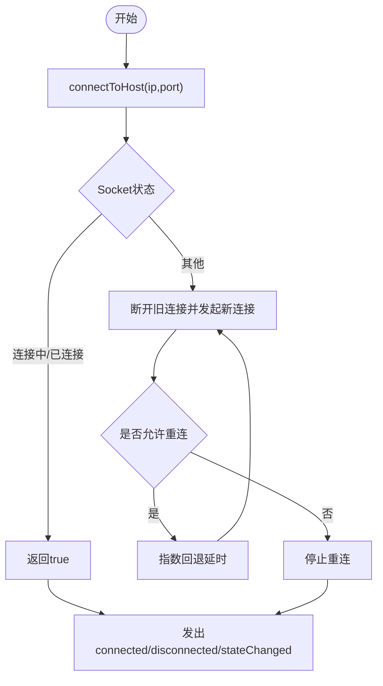
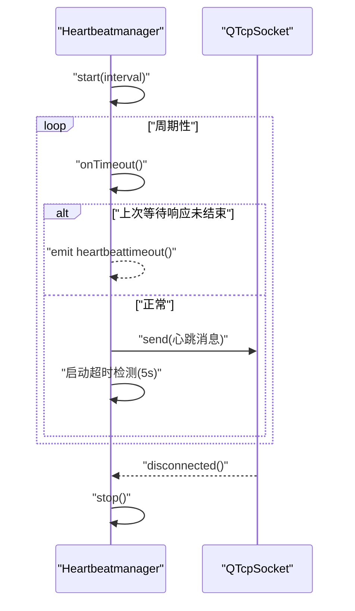
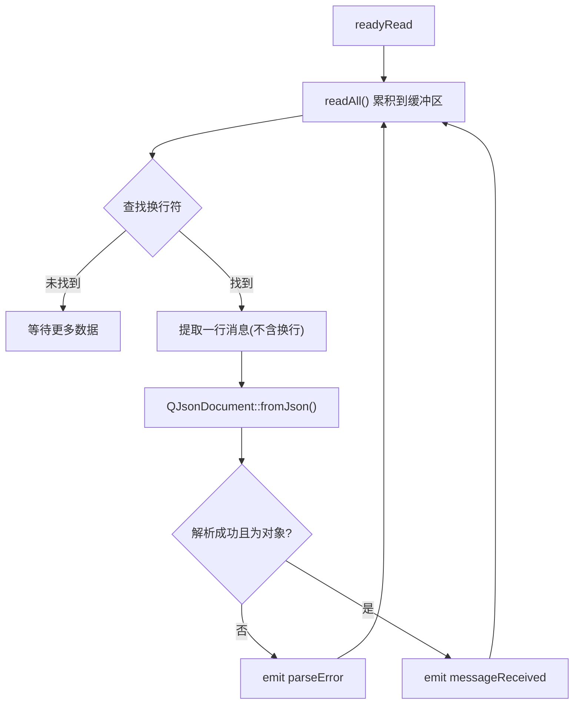
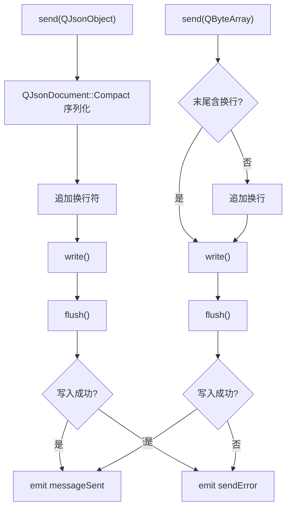
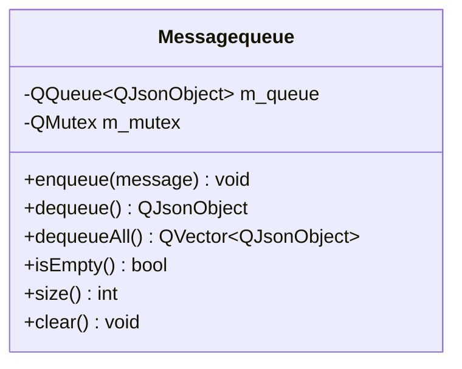
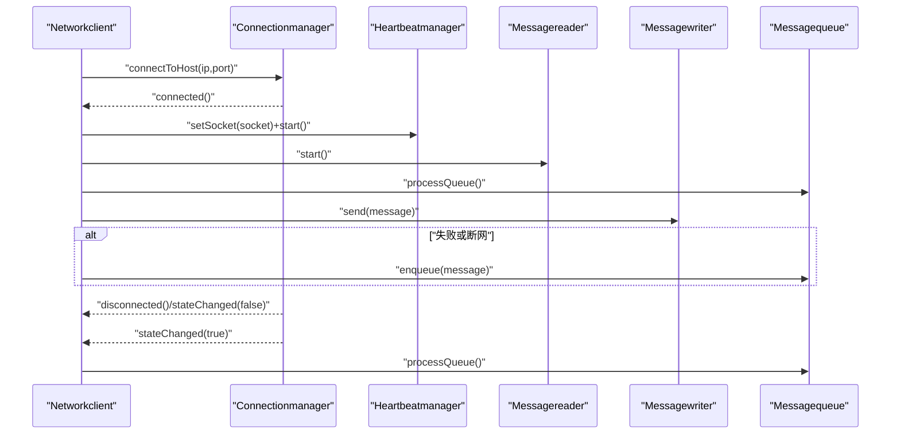
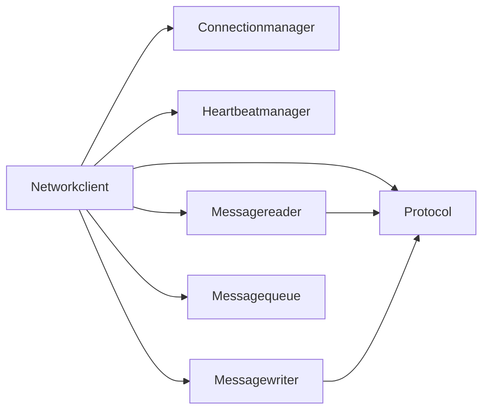

# 通信协议

<cite>
**本文引用的文件**
- [protocol.h](file://NetworkClient/protocol.h)
- [protocol.cpp](file://NetworkClient/protocol.cpp)
- [networkclient.h](file://NetworkClient/networkclient.h)
- [networkclient.cpp](file://NetworkClient/networkclient.cpp)
- [connectionmanager.h](file://NetworkClient/connectionmanager.h)
- [connectionmanager.cpp](file://NetworkClient/connectionmanager.cpp)
- [heartbeatmanager.h](file://NetworkClient/heartbeatmanager.h)
- [heartbeatmanager.cpp](file://NetworkClient/heartbeatmanager.cpp)
- [messagewriter.h](file://NetworkClient/messagewriter.h)
- [messagewriter.cpp](file://NetworkClient/messagewriter.cpp)
- [messagereader.h](file://NetworkClient/messagereader.h)
- [messagereader.cpp](file://NetworkClient/messagereader.cpp)
- [messagequeue.h](file://NetworkClient/messagequeue.h)
- [messagequeue.cpp](file://NetworkClient/messagequeue.cpp)
- [mainwindow.h](file://mainwindow.h)
</cite>

## 目录
1. [简介](#简介)
2. [项目结构](#项目结构)
3. [核心组件](#核心组件)
4. [架构总览](#架构总览)
5. [详细组件分析](#详细组件分析)
6. [依赖关系分析](#依赖关系分析)
7. [性能与可靠性](#性能与可靠性)
8. [故障排查指南](#故障排查指南)
9. [结论](#结论)
10. [附录](#附录)

## 简介
本文件为考勤系统中的自定义通信协议API文档，覆盖TCP连接协议、消息帧格式、状态管理、错误处理策略、安全与可靠性建议、速率限制与版本管理建议、常见用例、客户端实现指南以及性能优化技巧。协议基于JSON消息封装，采用“换行符”作为消息边界分隔；心跳保活与断线重连保障连接稳定性；消息队列实现离线缓存与批量发送。

## 项目结构
网络通信相关模块集中在 NetworkClient 目录，围绕以下职责划分：
- 协议定义与序列化：protocol.h/.cpp
- 连接管理：connectionmanager.h/.cpp
- 心跳保活：heartbeatmanager.h/.cpp
- 消息读写：messagereader.h/.cpp、messagewriter.h/.cpp
- 消息队列：messagequeue.h/.cpp
- 统一客户端入口：networkclient.h/.cpp

图表来源
- [networkclient.h:17-75](file://NetworkClient/networkclient.h#L17-L75)
- [connectionmanager.h:8-45](file://NetworkClient/connectionmanager.h#L8-L45)
- [heartbeatmanager.h:10-41](file://NetworkClient/heartbeatmanager.h#L10-L41)
- [messagereader.h:8-60](file://NetworkClient/messagereader.h#L8-L60)
- [messagewriter.h:8-50](file://NetworkClient/messagewriter.h#L8-L50)
- [messagequeue.h:8-33](file://NetworkClient/messagequeue.h#L8-L33)
- [protocol.h:15-58](file://NetworkClient/protocol.h#L15-L58)

章节来源
- [networkclient.h:17-75](file://NetworkClient/networkclient.h#L17-L75)
- [protocol.h:15-58](file://NetworkClient/protocol.h#L15-L58)

## 核心组件
- 协议层（Protocol）
  - 消息类型枚举：心跳、人员同步请求/响应、打卡上传、上传响应、设备状态上报
  - 数据模型：打卡记录、人员数据（含人脸特征二进制字段）
  - 序列化/反序列化：对象与JSON互转，人员数据特征以Base64传输
  - 消息打包/解析：统一的“type+data”结构，字符串化消息类型
- 连接管理（Connectionmanager）
  - TCP连接、断开、状态查询
  - 断线自动重连，指数回退上限控制
  - 错误分类与信号上报
- 心跳管理（Heartbeatmanager）
  - 定时发送心跳，超时检测触发重连
  - 与Socket生命周期绑定
- 消息读写（Messagereader/Messagewriter）
  - 读：按换行符切分，逐条JSON解析，粘包处理
  - 写：紧凑JSON序列化，追加换行，flush保证发送
  - 批量发送与原始字节发送
- 消息队列（Messagequeue）
  - 线程安全队列，支持批量入队/出队
  - 断网缓存与网络恢复后批量重发

章节来源
- [protocol.h:17-58](file://NetworkClient/protocol.h#L17-L58)
- [protocol.cpp:5-61](file://NetworkClient/protocol.cpp#L5-L61)
- [connectionmanager.h:12-42](file://NetworkClient/connectionmanager.h#L12-L42)
- [connectionmanager.cpp:20-109](file://NetworkClient/connectionmanager.cpp#L20-L109)
- [heartbeatmanager.h:14-38](file://NetworkClient/heartbeatmanager.h#L14-L38)
- [heartbeatmanager.cpp:24-113](file://NetworkClient/heartbeatmanager.cpp#L24-L113)
- [messagereader.h:12-35](file://NetworkClient/messagereader.h#L12-L35)
- [messagereader.cpp:35-107](file://NetworkClient/messagereader.cpp#L35-L107)
- [messagewriter.h:12-33](file://NetworkClient/messagewriter.h#L12-L33)
- [messagewriter.cpp:13-127](file://NetworkClient/messagewriter.cpp#L13-L127)
- [messagequeue.h:8-30](file://NetworkClient/messagequeue.h#L8-L30)
- [messagequeue.cpp:8-66](file://NetworkClient/messagequeue.cpp#L8-L66)

## 架构总览
整体交互流程：客户端通过连接管理建立TCP连接，启动心跳保活与消息读取；业务侧通过统一入口发送消息；发送失败或断网时入队缓存，网络恢复后批量重发；服务端通过心跳维持连接，按需下发人员同步与上传响应。

图表来源
- [networkclient.cpp:108-213](file://NetworkClient/networkclient.cpp#L108-L213)
- [connectionmanager.cpp:55-109](file://NetworkClient/connectionmanager.cpp#L55-L109)
- [heartbeatmanager.cpp:24-113](file://NetworkClient/heartbeatmanager.cpp#L24-L113)
- [messagewriter.cpp:13-127](file://NetworkClient/messagewriter.cpp#L13-L127)
- [messagereader.cpp:35-107](file://NetworkClient/messagereader.cpp#L35-L107)
- [messagequeue.cpp:33-66](file://NetworkClient/messagequeue.cpp#L33-L66)

## 详细组件分析

### 协议层（Protocol）
- 消息类型
  - 心跳包：保持连接活跃
  - 同步人员数据请求/响应：请求携带设备标识与时间戳，响应包含人员数组
  - 上传打卡记录：业务数据封装为JSON
  - 上传响应：包含成功标志与消息
  - 设备状态上报：上报设备运行状态
- 数据模型
  - 打卡记录：员工ID、打卡时间、状态
  - 人员数据：员工ID、姓名、人脸特征（二进制，传输前Base64编码）、特征长度
- 序列化/反序列化
  - 对象转JSON：toJson
  - JSON转对象：fromJson（静态工厂）
  - 人员特征字段以Base64字符串传输，接收端还原为二进制
- 消息封装
  - createMessage：统一添加“type”和“data”
  - parseMessageType：从JSON解析消息类型
  - messageTypeToString：类型转字符串，便于日志与调试

图表来源
- [protocol.h:19-49](file://NetworkClient/protocol.h#L19-L49)
- [protocol.cpp:5-40](file://NetworkClient/protocol.cpp#L5-L40)

章节来源
- [protocol.h:17-58](file://NetworkClient/protocol.h#L17-L58)
- [protocol.cpp:5-61](file://NetworkClient/protocol.cpp#L5-L61)

### 连接管理（Connectionmanager）
- 功能
  - 建立/断开TCP连接，查询连接状态
  - 断线自动重连，指数回退（最大延迟上限）
  - 错误分类与错误信号
- 关键点
  - 主动断开时重置重连计数，避免触发重连
  - 连接成功/断开/状态变化均向上层发出信号

图表来源
- [connectionmanager.cpp:20-109](file://NetworkClient/connectionmanager.cpp#L20-L109)

章节来源
- [connectionmanager.h:12-42](file://NetworkClient/connectionmanager.h#L12-L42)
- [connectionmanager.cpp:20-109](file://NetworkClient/connectionmanager.cpp#L20-L109)

### 心跳管理（Heartbeatmanager）
- 功能
  - 定时发送心跳，等待响应；超时则触发重连
  - 与Socket生命周期绑定：连接成功自动启动，断开停止
- 关键点
  - 使用紧凑JSON封装心跳消息
  - 超时检测定时器单次触发，避免重复等待

图表来源
- [heartbeatmanager.cpp:42-113](file://NetworkClient/heartbeatmanager.cpp#L42-L113)

章节来源
- [heartbeatmanager.h:14-38](file://NetworkClient/heartbeatmanager.h#L14-L38)
- [heartbeatmanager.cpp:24-113](file://NetworkClient/heartbeatmanager.cpp#L24-L113)

### 消息读取（Messagereader）
- 功能
  - 监听Socket可读事件，累积缓冲区数据
  - 按换行符切分完整消息，逐条JSON解析
  - 解析失败发出错误信号
- 关键点
  - 支持粘包/拆包：缓冲区持续累积，直到找到换行符
  - 非对象JSON或解析错误均上报

图表来源
- [messagereader.cpp:35-107](file://NetworkClient/messagereader.cpp#L35-L107)

章节来源
- [messagereader.h:12-35](file://NetworkClient/messagereader.h#L12-L35)
- [messagereader.cpp:35-107](file://NetworkClient/messagereader.cpp#L35-L107)

### 消息写入（Messagewriter）
- 功能
  - JSON对象/原始字节发送
  - 紧凑JSON序列化，追加换行作为消息边界
  - flush确保立即发送
  - 批量发送：逐条发送，遇到失败停止
- 关键点
  - 严格检查Socket状态与写入结果
  - 发送成功/失败分别发出信号

图表来源
- [messagewriter.cpp:13-127](file://NetworkClient/messagewriter.cpp#L13-L127)

章节来源
- [messagewriter.h:12-33](file://NetworkClient/messagewriter.h#L12-L33)
- [messagewriter.cpp:13-127](file://NetworkClient/messagewriter.cpp#L13-L127)

### 消息队列（Messagequeue）
- 功能
  - 线程安全的队列入/出队
  - 支持批量出队，清空队列
- 关键点
  - 使用互斥锁保护并发访问
  - 与发送器配合实现断网缓存与恢复重发

图表来源
- [messagequeue.h:8-30](file://NetworkClient/messagequeue.h#L8-L30)
- [messagequeue.cpp:8-66](file://NetworkClient/messagequeue.cpp#L8-L66)

章节来源
- [messagequeue.h:8-30](file://NetworkClient/messagequeue.h#L8-L30)
- [messagequeue.cpp:8-66](file://NetworkClient/messagequeue.cpp#L8-L66)

### 统一客户端（Networkclient）
- 功能
  - 连接管理、心跳、读写、队列与业务接口聚合
  - 同步人员数据、上传打卡记录（单条/批量）、上报设备状态
  - 处理连接状态变化、心跳超时、发送错误
- 关键点
  - 连接成功后创建读写器，启动心跳与接收
  - 断网期间所有发送均入队；网络恢复后批量重发
  - 业务响应解析与本地同步

图表来源
- [networkclient.cpp:108-213](file://NetworkClient/networkclient.cpp#L108-L213)
- [connectionmanager.cpp:55-109](file://NetworkClient/connectionmanager.cpp#L55-L109)
- [heartbeatmanager.cpp:24-113](file://NetworkClient/heartbeatmanager.cpp#L24-L113)
- [messagewriter.cpp:13-127](file://NetworkClient/messagewriter.cpp#L13-L127)
- [messagereader.cpp:35-107](file://NetworkClient/messagereader.cpp#L35-L107)
- [messagequeue.cpp:33-66](file://NetworkClient/messagequeue.cpp#L33-L66)

章节来源
- [networkclient.h:17-75](file://NetworkClient/networkclient.h#L17-L75)
- [networkclient.cpp:108-312](file://NetworkClient/networkclient.cpp#L108-L312)

## 依赖关系分析
- 组件耦合
  - Networkclient聚合Connectionmanager、Heartbeatmanager、Messagereader、Messagewriter、Messagequeue
  - Protocol独立于网络栈，仅提供数据结构与序列化
  - Messagereader/Messagewriter依赖QTcpSocket与JSON工具
- 外部依赖
  - Qt网络与JSON模块
  - Qt信号/槽与定时器机制

图表来源
- [networkclient.h:66-70](file://NetworkClient/networkclient.h#L66-L70)
- [protocol.h:15-16](file://NetworkClient/protocol.h#L15-L16)

章节来源
- [networkclient.h:66-70](file://NetworkClient/networkclient.h#L66-L70)
- [protocol.h:15-16](file://NetworkClient/protocol.h#L15-L16)

## 性能与可靠性
- 性能
  - 紧凑JSON序列化减少带宽占用
  - 批量发送降低握手开销
  - flush确保及时投递，避免系统缓冲延迟
- 可靠性
  - 心跳保活与超时重连
  - 断网缓存与恢复重发
  - 错误信号化，便于上层处理
- 建议
  - 速率限制：根据网络状况调整心跳间隔与批量大小
  - 版本管理：在消息头引入版本字段，逐步推进升级
  - 安全：在现有基础上增加TLS/签名/鉴权层

## 故障排查指南
- 常见问题与定位
  - 连接失败：检查IP/端口、防火墙、服务端状态；查看错误信号
  - 心跳超时：确认网络质量、服务端存活、心跳间隔配置
  - JSON解析失败：检查消息边界与完整性、字符集一致性
  - 发送失败：确认Socket状态、缓冲区写入结果、错误信号
- 调试工具与监控
  - 日志输出：连接、断开、状态变化、消息收发、解析错误
  - 信号监听：connected/disconnected/stateChanged/messageReceived/sendError/parseError
  - 队列监控：入队/出队/清空日志，评估缓存压力

章节来源
- [connectionmanager.cpp:79-103](file://NetworkClient/connectionmanager.cpp#L79-L103)
- [heartbeatmanager.cpp:16-21](file://NetworkClient/heartbeatmanager.cpp#L16-L21)
- [messagereader.cpp:83-96](file://NetworkClient/messagereader.cpp#L83-L96)
- [messagewriter.cpp:61-71](file://NetworkClient/messagewriter.cpp#L61-L71)
- [networkclient.cpp:108-213](file://NetworkClient/networkclient.cpp#L108-L213)

## 结论
本协议以简洁的JSON消息与“换行符”边界实现可靠的数据传输，结合心跳保活与断线重连，满足考勤场景的实时性与稳定性需求。通过消息队列实现离线缓存与批量重发，进一步提升鲁棒性。建议后续引入版本字段与安全层，以支撑长期演进与生产部署。

## 附录

### 协议规范与示例

- 消息帧格式
  - 每条消息为紧凑JSON对象，末尾追加换行符作为帧边界
  - 示例路径：[消息写入实现:13-76](file://NetworkClient/messagewriter.cpp#L13-L76)
- 消息类型与字段
  - 心跳包：type=HEARTBEAT
  - 同步请求：type=SYNC_PERSON_REQUEST，data包含设备标识与时间戳
  - 同步响应：type=SYNC_PERSON_RESPONSE，data包含人员数组
  - 上传打卡：type=UPLOAD_ATTENDANCE，data为打卡记录JSON
  - 上传响应：type=UPLOAD_RESPONSE，data包含success与message
  - 设备状态：type=DEVICE_STATUS，data为状态JSON
  - 示例路径：[消息类型定义:19-26](file://NetworkClient/protocol.h#L19-L26)，[消息封装:42-48](file://NetworkClient/protocol.cpp#L42-L48)
- 数据模型与序列化
  - 打卡记录：employeeId、checktTime、status
  - 人员数据：employeeId、name、faceFeature(Base64)、featureSize
  - 示例路径：[数据模型与序列化:5-40](file://NetworkClient/protocol.cpp#L5-L40)
- 错误码与错误处理
  - 连接错误：连接被拒绝、主机未找到、超时、网络错误等
  - 解析错误：JSON解析失败、非对象JSON
  - 发送错误：socket未初始化、未连接、写入失败
  - 示例路径：[连接错误分类:79-103](file://NetworkClient/connectionmanager.cpp#L79-L103)，[解析错误:83-96](file://NetworkClient/messagereader.cpp#L83-L96)，[发送错误:61-71](file://NetworkClient/messagewriter.cpp#L61-L71)
- 安全考虑
  - 建议启用TLS加密传输
  - 引入鉴权与签名机制，防止中间人攻击与篡改
  - 限制消息大小与频率，缓解DDoS风险
- 速率限制与版本管理
  - 建议在消息头加入version字段，逐步推进协议升级
  - 根据网络质量动态调整心跳间隔与批量大小
- 常见用例
  - 同步人员数据：调用同步接口，解析响应并持久化
  - 上传打卡记录：单条或批量发送，断网缓存，恢复后重发
  - 上报设备状态：周期性上报运行状态
  - 示例路径：[同步与上传实现:28-106](file://NetworkClient/networkclient.cpp#L28-L106)
- 客户端实现指南
  - 初始化Networkclient，注册连接与消息信号
  - 连接成功后启动心跳与接收
  - 发送失败或断网时入队，网络恢复后批量重发
  - 示例路径：[统一入口与处理流程:108-213](file://NetworkClient/networkclient.cpp#L108-L213)
- 性能优化技巧
  - 使用紧凑JSON与flush提升吞吐
  - 批量发送减少握手次数
  - 合理的心跳间隔与指数回退重连
  - 示例路径：[批量发送:115-127](file://NetworkClient/messagewriter.cpp#L115-L127)，[指数回退:73-76](file://NetworkClient/connectionmanager.cpp#L73-L76)
- 调试工具与监控
  - 监听connected/disconnected/stateChanged/messageReceived/sendError/parseError信号
  - 查看队列入队/出队日志，评估缓存压力
  - 示例路径：[信号与日志:108-213](file://NetworkClient/networkclient.cpp#L108-L213)，[队列日志:16-66](file://NetworkClient/messagequeue.cpp#L16-L66)
- 已弃用功能与迁移指南
  - 若未来引入二进制协议，建议保留向后兼容：新增version字段，旧版客户端仍可解析
  - 渐进式迁移：先在消息头引入version，再逐步替换序列化与帧格式
  - 兼容性说明：保持消息类型字符串与常用字段不变，仅扩展新字段

章节来源
- [protocol.h:19-26](file://NetworkClient/protocol.h#L19-L26)
- [protocol.cpp:42-48](file://NetworkClient/protocol.cpp#L42-L48)
- [protocol.cpp:5-40](file://NetworkClient/protocol.cpp#L5-L40)
- [connectionmanager.cpp:79-103](file://NetworkClient/connectionmanager.cpp#L79-L103)
- [messagewriter.cpp:13-76](file://NetworkClient/messagewriter.cpp#L13-L76)
- [messagewriter.cpp:115-127](file://NetworkClient/messagewriter.cpp#L115-L127)
- [messagereader.cpp:83-96](file://NetworkClient/messagereader.cpp#L83-L96)
- [networkclient.cpp:28-106](file://NetworkClient/networkclient.cpp#L28-L106)
- [networkclient.cpp:108-213](file://NetworkClient/networkclient.cpp#L108-L213)
- [messagequeue.cpp:16-66](file://NetworkClient/messagequeue.cpp#L16-L66)