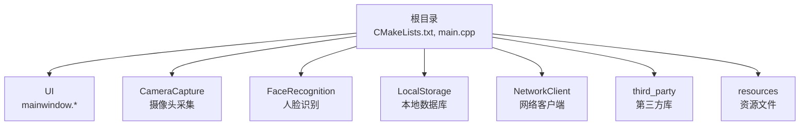
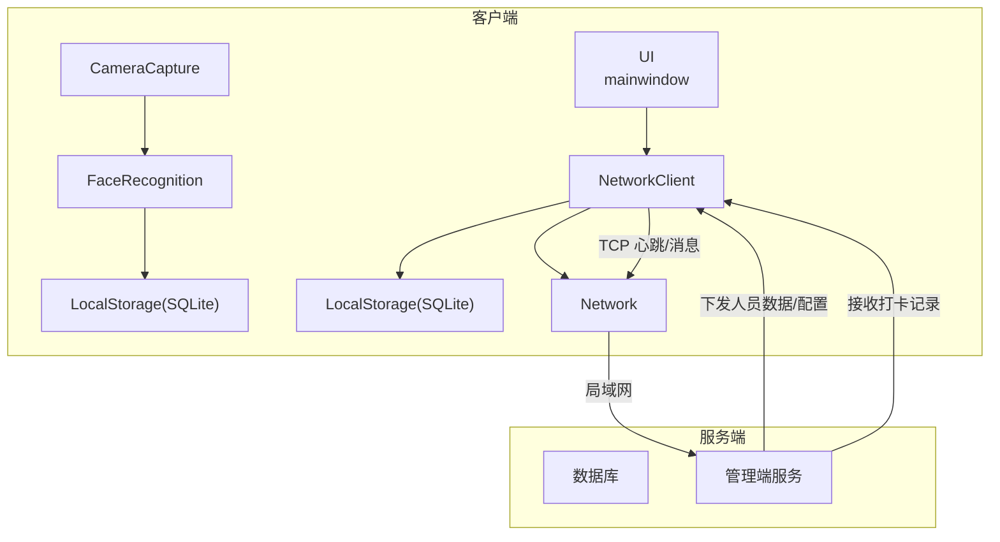
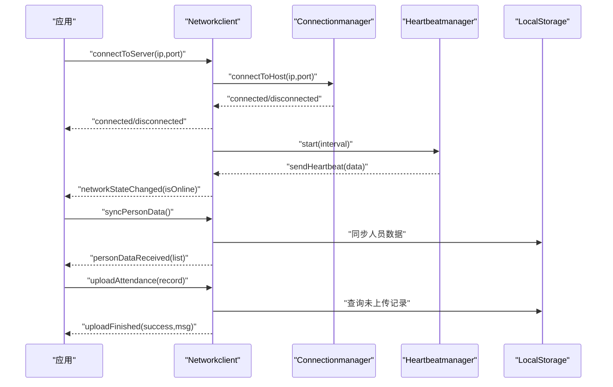
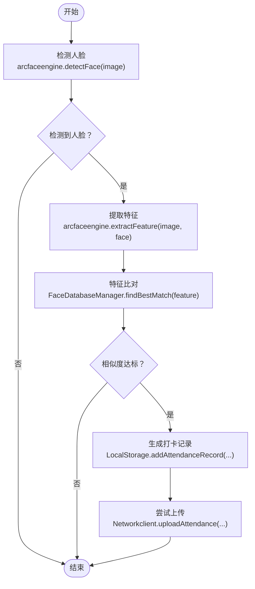
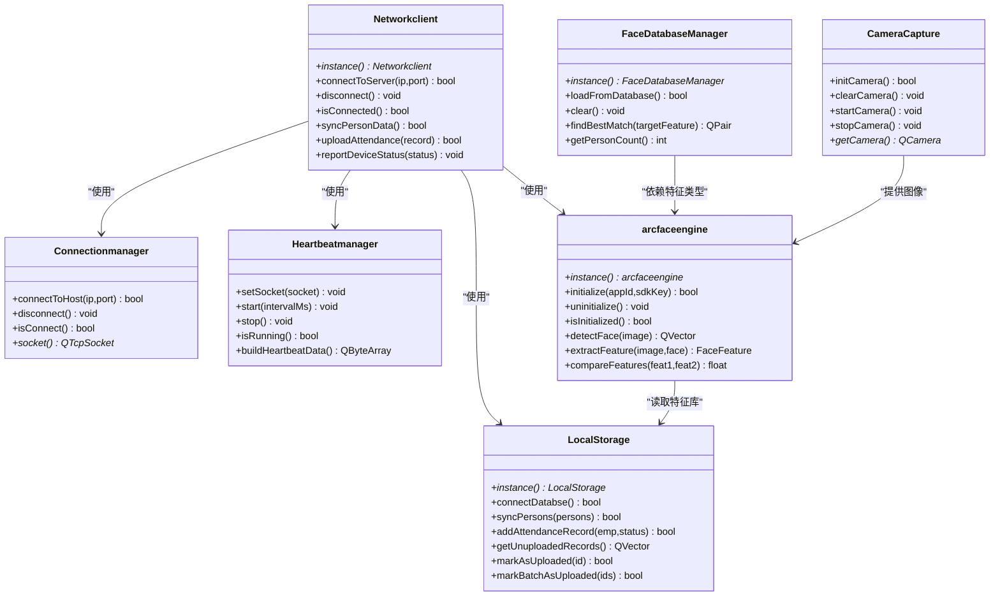
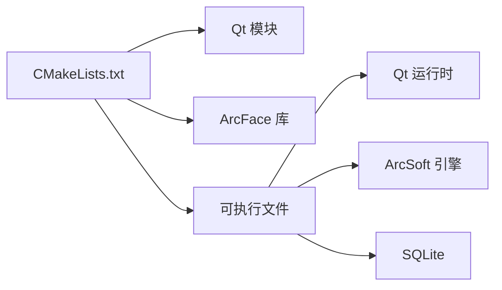

# 部署与配置

<cite>
**本文引用的文件**
- [CMakeLists.txt](file://CMakeLists.txt)
- [main.cpp](file://main.cpp)
- [mainwindow.h](file://mainwindow.h)
- [mainwindow.cpp](file://mainwindow.cpp)
- [NetworkClient/networkclient.h](file://NetworkClient/networkclient.h)
- [NetworkClient/connectionmanager.h](file://NetworkClient/connectionmanager.h)
- [NetworkClient/heartbeatmanager.h](file://NetworkClient/heartbeatmanager.h)
- [LocalStorage/localstorage.h](file://LocalStorage/localstorage.h)
- [FaceRecognition/arcfaceengine.h](file://FaceRecognition/arcfaceengine.h)
- [FaceRecognition/facedatabasemanager.h](file://FaceRecognition/facedatabasemanager.h)
- [CameraCapture/cameracapture.h](file://CameraCapture/cameracapture.h)
- [AttendanceCheckClient开发文档.md](file://AttendanceCheckClient开发文档.md)
</cite>

## 目录
1. [简介](#简介)
2. [项目结构](#项目结构)
3. [核心组件](#核心组件)
4. [架构总览](#架构总览)
5. [详细组件分析](#详细组件分析)
6. [依赖关系分析](#依赖关系分析)
7. [性能考虑](#性能考虑)
8. [故障排查指南](#故障排查指南)
9. [结论](#结论)
10. [附录](#附录)

## 简介
本指南面向部署与运维工程师，提供针对该考勤客户端项目的完整部署与配置说明。内容覆盖编译配置、运行环境要求、网络配置、资源文件与第三方库管理、生产环境检查清单、性能调优、日志与监控、安全与权限、容器化与自动化部署思路，以及关键配置步骤如 ArcFace SDK、Qt 库路径与 SQLite 初始化等。

## 项目结构
该项目采用 CMake + Qt 的工程组织方式，模块化清晰：
- 根目录包含构建入口与顶层入口程序
- 功能模块按领域划分：CameraCapture（摄像头采集）、FaceRecognition（人脸识别）、LocalStorage（本地数据库）、NetworkClient（网络通信）
- third_party 目录存放第三方库头文件与静态库
- resources 目录存放图标、样式与模型资源

章节来源
- [CMakeLists.txt:1-87](file://CMakeLists.txt#L1-L87)
- [AttendanceCheckClient开发文档.md:107-121](file://AttendanceCheckClient开发文档.md#L107-L121)

## 核心组件
- 构建与入口
  - CMakeLists.txt：定义 Qt 版本、模块、编译标准、第三方库链接与可执行目标
  - main.cpp：应用入口，Windows 平台设置控制台编码
- 网络客户端
  - Networkclient：对外业务接口与信号聚合，协调连接、心跳、消息读写与队列
  - Connectionmanager：TCP 连接与重连
  - Heartbeatmanager：心跳发送与超时检测
- 本地存储
  - LocalStorage：SQLite 数据库连接、人员同步、打卡记录增删改查与未上传记录管理
- 人脸识别
  - arcfaceengine：ArcFace 引擎封装（单例），提供检测、特征提取与比对
  - FaceDatabaseManager：人脸特征库加载与内存检索
- 摄像头采集
  - CameraCapture：摄像头初始化、启动/停止与设备枚举

章节来源
- [CMakeLists.txt:12-87](file://CMakeLists.txt#L12-L87)
- [main.cpp:13-28](file://main.cpp#L13-L28)
- [NetworkClient/networkclient.h:17-75](file://NetworkClient/networkclient.h#L17-L75)
- [NetworkClient/connectionmanager.h:8-45](file://NetworkClient/connectionmanager.h#L8-L45)
- [NetworkClient/heartbeatmanager.h:10-41](file://NetworkClient/heartbeatmanager.h#L10-L41)
- [LocalStorage/localstorage.h:15-49](file://LocalStorage/localstorage.h#L15-L49)
- [FaceRecognition/arcfaceengine.h:21-115](file://FaceRecognition/arcfaceengine.h#L21-L115)
- [FaceRecognition/facedatabasemanager.h:9-47](file://FaceRecognition/facedatabasemanager.h#L9-L47)
- [CameraCapture/cameracapture.h:9-31](file://CameraCapture/cameracapture.h#L9-L31)

## 架构总览
系统采用 C/S 局域网架构，客户端负责人脸采集与识别、本地记录与断网缓存、TCP 上报；服务端负责下发人员数据与接收打卡记录。核心交互通过 NetworkClient 统一编排。

图表来源
- [NetworkClient/networkclient.h:17-75](file://NetworkClient/networkclient.h#L17-L75)
- [NetworkClient/connectionmanager.h:8-45](file://NetworkClient/connectionmanager.h#L8-L45)
- [NetworkClient/heartbeatmanager.h:10-41](file://NetworkClient/heartbeatmanager.h#L10-L41)
- [LocalStorage/localstorage.h:15-49](file://LocalStorage/localstorage.h#L15-L49)
- [FaceRecognition/arcfaceengine.h:21-115](file://FaceRecognition/arcfaceengine.h#L21-L115)
- [AttendanceCheckClient开发文档.md:8-21](file://AttendanceCheckClient开发文档.md#L8-L21)

## 详细组件分析

### 网络客户端序列图
展示从连接建立到业务数据上报的关键调用链。

图表来源
- [NetworkClient/networkclient.h:21-54](file://NetworkClient/networkclient.h#L21-L54)
- [NetworkClient/connectionmanager.h:15-27](file://NetworkClient/connectionmanager.h#L15-L27)
- [NetworkClient/heartbeatmanager.h:17-27](file://NetworkClient/heartbeatmanager.h#L17-L27)
- [LocalStorage/localstorage.h:25-32](file://LocalStorage/localstorage.h#L25-L32)

章节来源
- [NetworkClient/networkclient.h:17-75](file://NetworkClient/networkclient.h#L17-L75)
- [NetworkClient/connectionmanager.h:8-45](file://NetworkClient/connectionmanager.h#L8-L45)
- [NetworkClient/heartbeatmanager.h:10-41](file://NetworkClient/heartbeatmanager.h#L10-L41)
- [LocalStorage/localstorage.h:15-49](file://LocalStorage/localstorage.h#L15-L49)

### 人脸识别流程图
展示从图像输入到特征比对的处理流程。

图表来源
- [FaceRecognition/arcfaceengine.h:74-90](file://FaceRecognition/arcfaceengine.h#L74-L90)
- [FaceRecognition/facedatabasemanager.h:35-35](file://FaceRecognition/facedatabasemanager.h#L35-L35)
- [LocalStorage/localstorage.h:29-32](file://LocalStorage/localstorage.h#L29-L32)
- [NetworkClient/networkclient.h:30-33](file://NetworkClient/networkclient.h#L30-L33)

章节来源
- [FaceRecognition/arcfaceengine.h:21-115](file://FaceRecognition/arcfaceengine.h#L21-L115)
- [FaceRecognition/facedatabasemanager.h:9-47](file://FaceRecognition/facedatabasemanager.h#L9-L47)
- [LocalStorage/localstorage.h:15-49](file://LocalStorage/localstorage.h#L15-L49)
- [NetworkClient/networkclient.h:29-34](file://NetworkClient/networkclient.h#L29-L34)

### 类关系图（代码级）
展示核心类之间的依赖与协作。

图表来源
- [NetworkClient/networkclient.h:17-75](file://NetworkClient/networkclient.h#L17-L75)
- [NetworkClient/connectionmanager.h:8-45](file://NetworkClient/connectionmanager.h#L8-L45)
- [NetworkClient/heartbeatmanager.h:10-41](file://NetworkClient/heartbeatmanager.h#L10-L41)
- [LocalStorage/localstorage.h:15-49](file://LocalStorage/localstorage.h#L15-L49)
- [FaceRecognition/arcfaceengine.h:21-115](file://FaceRecognition/arcfaceengine.h#L21-L115)
- [FaceRecognition/facedatabasemanager.h:9-47](file://FaceRecognition/facedatabasemanager.h#L9-L47)
- [CameraCapture/cameracapture.h:9-31](file://CameraCapture/cameracapture.h#L9-L31)

## 依赖关系分析
- 构建依赖
  - Qt 模块：Widgets、Network、Sql、Multimedia、MultimediaWidgets
  - ArcFace SDK：头文件与静态库（Windows 平台）
  - C++17 标准与 MSVC UTF-8 编码设置
- 运行时依赖
  - Qt 运行时库
  - ArcSoft 人脸引擎动态库（随 SDK 分发）
  - SQLite3（Qt Sql 模块）
  - 摄像头驱动与多媒体框架

图表来源
- [CMakeLists.txt:16-82](file://CMakeLists.txt#L16-L82)

章节来源
- [CMakeLists.txt:12-87](file://CMakeLists.txt#L12-L87)
- [AttendanceCheckClient开发文档.md:11-12](file://AttendanceCheckClient开发文档.md#L11-L12)

## 性能考虑
- 图像处理与识别
  - 合理选择摄像头分辨率与帧率，降低 CPU/GPU 压力
  - 在 arcfaceengine 中复用转换后图像缓冲，避免重复格式转换
- 数据库
  - 为人员表与打卡记录表建立合适索引，提升查询与去重效率
  - 批量上传未上传记录，减少网络往返
- 网络
  - 心跳间隔与超时阈值根据网络质量调整
  - 采用队列与事务保证数据一致性与可靠性
- 内存
  - FaceDatabaseManager 加载特征至内存，注意内存占用与刷新策略

章节来源
- [FaceRecognition/arcfaceengine.h:104-108](file://FaceRecognition/arcfaceengine.h#L104-L108)
- [FaceRecognition/facedatabasemanager.h:41-42](file://FaceRecognition/facedatabasemanager.h#L41-L42)
- [LocalStorage/localstorage.h:29-32](file://LocalStorage/localstorage.h#L29-L32)
- [NetworkClient/heartbeatmanager.h:20-21](file://NetworkClient/heartbeatmanager.h#L20-L21)

## 故障排查指南
- 启动与平台
  - Windows 控制台编码问题：确认已在入口设置 UTF-8
- 网络连接
  - 检查 Connectionmanager 的连接/断开信号与错误信号
  - 心跳超时：确认 Heartbeatmanager 的定时器与超时检测
  - 最大重连次数限制：避免无限重连导致资源浪费
- 人脸识别
  - ArcFace 初始化失败：核对 appId 与 sdkKey 参数
  - 特征提取失败：确认图像格式转换与像素格式映射
  - 匹配不到人员：检查特征库加载与阈值设置
- 本地存储
  - 数据库连接失败：确认 SQLite 驱动与数据库文件路径
  - 未上传记录堆积：检查上传回调与标记逻辑
- 摄像头
  - 设备不可用：确认设备枚举与权限
  - 采集异常：检查初始化与释放流程

章节来源
- [main.cpp:15-19](file://main.cpp#L15-L19)
- [NetworkClient/connectionmanager.h:36-42](file://NetworkClient/connectionmanager.h#L36-L42)
- [NetworkClient/heartbeatmanager.h:33-37](file://NetworkClient/heartbeatmanager.h#L33-L37)
- [FaceRecognition/arcfaceengine.h:56-67](file://FaceRecognition/arcfaceengine.h#L56-L67)
- [FaceRecognition/arcfaceengine.h:104-108](file://FaceRecognition/arcfaceengine.h#L104-L108)
- [LocalStorage/localstorage.h:23-32](file://LocalStorage/localstorage.h#L23-L32)
- [CameraCapture/cameracapture.h:17-28](file://CameraCapture/cameracapture.h#L17-L28)

## 结论
本项目以 Qt 与 CMake 为基础，结合 ArcFace 与 SQLite，实现了局域网考勤客户端的完整闭环。通过合理的模块划分、统一的网络编排与本地缓存机制，可在复杂网络环境下稳定运行。部署时应重点关注 Qt/SDK 路径、ArcFace 许可参数、数据库初始化与网络连通性，并结合本文提供的检查清单与调优建议保障生产可用。

## 附录

### 编译配置与运行环境
- 构建工具
  - CMake 3.16+
  - Qt 5.15 或 Qt 6.x（自动识别）
  - C++17 支持
- 平台与编译器
  - Windows：MSVC（UTF-8 编码设置）
  - Linux/macOS：GCC/Clang（需满足 Qt 与 CMake 版本）
- Qt 模块
  - Widgets、Network、Sql、Multimedia、MultimediaWidgets
- ArcFace SDK
  - 头文件与静态库放置于 third_party/arcface 下
  - 链接静态库：libarcsoft_face_engine.lib（Windows）

章节来源
- [CMakeLists.txt:12-14](file://CMakeLists.txt#L12-L14)
- [CMakeLists.txt:16-17](file://CMakeLists.txt#L16-L17)
- [CMakeLists.txt:30-66](file://CMakeLists.txt#L30-L66)
- [CMakeLists.txt:68-82](file://CMakeLists.txt#L68-L82)

### 网络配置说明
- 连接管理
  - 目标：管理端 IP 与端口
  - 重连策略：最大重连次数限制
- 心跳机制
  - 心跳间隔与超时阈值可调
- 业务接口
  - 同步人员数据、上传打卡记录、上报设备状态

章节来源
- [NetworkClient/networkclient.h:25-34](file://NetworkClient/networkclient.h#L25-L34)
- [NetworkClient/connectionmanager.h:16-18](file://NetworkClient/connectionmanager.h#L16-L18)
- [NetworkClient/connectionmanager.h:41-41](file://NetworkClient/connectionmanager.h#L41-L41)
- [NetworkClient/heartbeatmanager.h:20-21](file://NetworkClient/heartbeatmanager.h#L20-L21)

### 资源文件管理与第三方库
- 资源文件
  - 图标、样式与模型位于 resources 目录，CMake 自动资源处理
- 第三方库
  - ArcFace：头文件与静态库
  - dlib：文档中提及，实际使用以当前代码为准
- 依赖项处理
  - CMake 显式包含头文件目录并链接静态库

章节来源
- [CMakeLists.txt:28-28](file://CMakeLists.txt#L28-L28)
- [CMakeLists.txt:68-73](file://CMakeLists.txt#L68-L73)
- [CMakeLists.txt:75-82](file://CMakeLists.txt#L75-L82)
- [AttendanceCheckClient开发文档.md:16-17](file://AttendanceCheckClient开发文档.md#L16-L17)

### 生产环境部署检查清单
- 系统与运行时
  - 安装对应版本 Qt 运行时
  - 准备 ArcSoft 引擎所需动态库（随 SDK 分发）
  - 配置摄像头与权限
- 配置项
  - 管理端 IP/端口
  - ArcFace appId/sdkKey
  - 心跳间隔与超时
- 数据库
  - 初始化 SQLite 数据库与表结构
  - 校验人员数据同步与打卡记录表
- 网络
  - 局域网可达性测试
  - 防火墙放行与带宽评估
- 监控与日志
  - 记录连接状态、上传结果与错误日志
  - 关键指标：识别耗时、上传成功率、未上传积压

章节来源
- [NetworkClient/networkclient.h:25-34](file://NetworkClient/networkclient.h#L25-L34)
- [FaceRecognition/arcfaceengine.h:56-56](file://FaceRecognition/arcfaceengine.h#L56-L56)
- [LocalStorage/localstorage.h:23-32](file://LocalStorage/localstorage.h#L23-L32)
- [AttendanceCheckClient开发文档.md:92-99](file://AttendanceCheckClient开发文档.md#L92-L99)

### 日志配置、监控与诊断
- 日志
  - 使用 Qt 的调试输出（qDebug）记录关键事件
  - 建议增加文件日志与级别过滤
- 监控
  - 连接状态、心跳超时、上传结果
  - 识别耗时与命中率统计
- 诊断
  - 逐步验证摄像头、ArcFace 初始化、数据库连接、网络连通性

章节来源
- [NetworkClient/connectionmanager.h:26-26](file://NetworkClient/connectionmanager.h#L26-L26)
- [NetworkClient/heartbeatmanager.h:26-26](file://NetworkClient/heartbeatmanager.h#L26-L26)
- [LocalStorage/localstorage.h:34-37](file://LocalStorage/localstorage.h#L34-L37)

### 安全配置、权限管理与访问控制
- 许可参数
  - ArcFace appId/sdkKey 必须正确配置
- 网络安全
  - 局域网内通信，建议限制访问来源与最小权限原则
- 文件与数据库
  - 限定应用对 SQLite 文件的读写权限
  - 避免敏感信息明文存储

章节来源
- [FaceRecognition/arcfaceengine.h:56-56](file://FaceRecognition/arcfaceengine.h#L56-L56)
- [LocalStorage/localstorage.h:23-23](file://LocalStorage/localstorage.h#L23-L23)

### 容器化部署、自动化与持续集成
- 容器化
  - 基于桌面 Linux 发行版，安装 Qt 运行时与依赖
  - 挂载摄像头设备节点与权限配置
- 自动化与 CI
  - CMake + Ninja/Makefile 构建流水线
  - 单元测试与集成测试脚本化
  - 产物打包与分发

章节来源
- [CMakeLists.txt:30-66](file://CMakeLists.txt#L30-L66)
- [AttendanceCheckClient开发文档.md:100-106](file://AttendanceCheckClient开发文档.md#L100-L106)

### 关键配置步骤
- ArcFace SDK 配置
  - 在 arcfaceengine 中传入正确的 appId 与 sdkKey
  - 确认引擎初始化成功后再进行检测与提取
- Qt 库路径设置
  - CMake 自动查找 Qt，确保环境变量与 IDE 设置一致
- SQLite 数据库初始化
  - 启动时连接数据库并创建人员表与打卡记录表
  - 同步人员数据时使用事务保证一致性

章节来源
- [FaceRecognition/arcfaceengine.h:56-67](file://FaceRecognition/arcfaceengine.h#L56-L67)
- [CMakeLists.txt:16-17](file://CMakeLists.txt#L16-L17)
- [LocalStorage/localstorage.h:23-32](file://LocalStorage/localstorage.h#L23-L32)