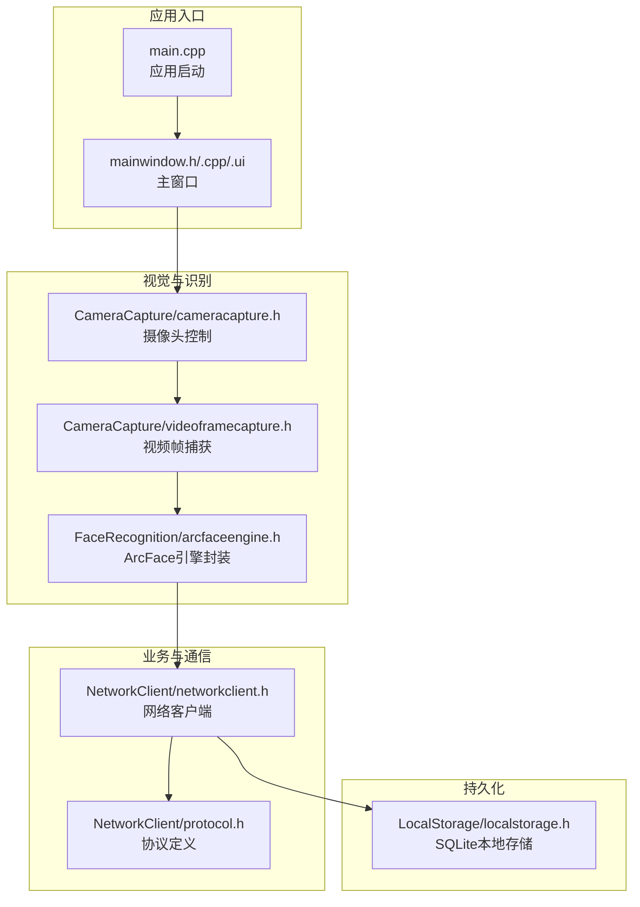
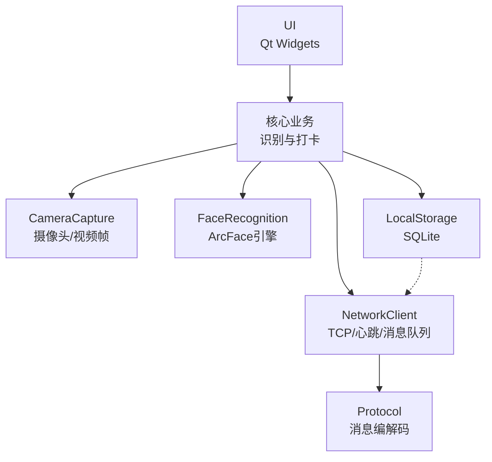
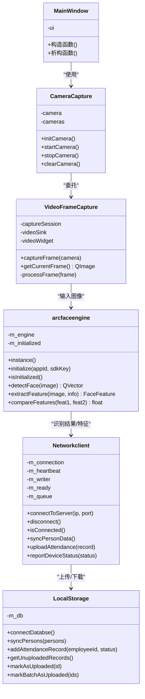
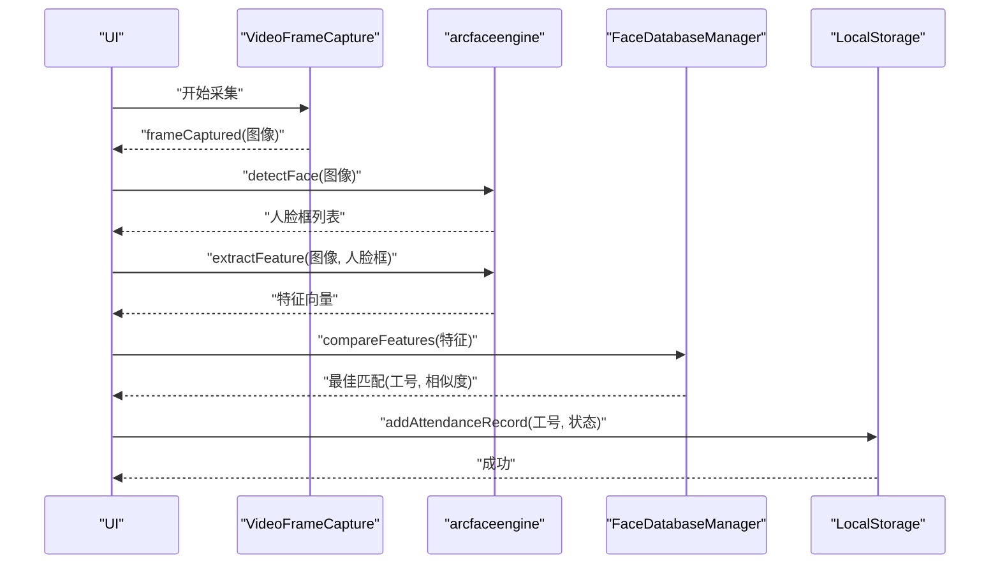
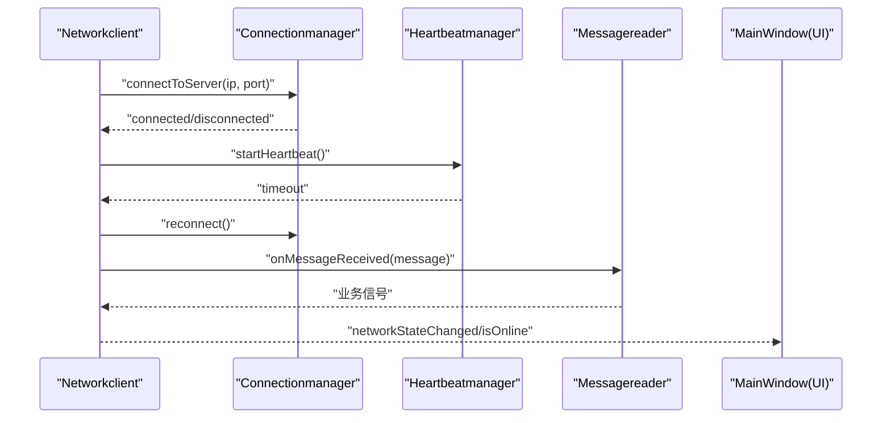
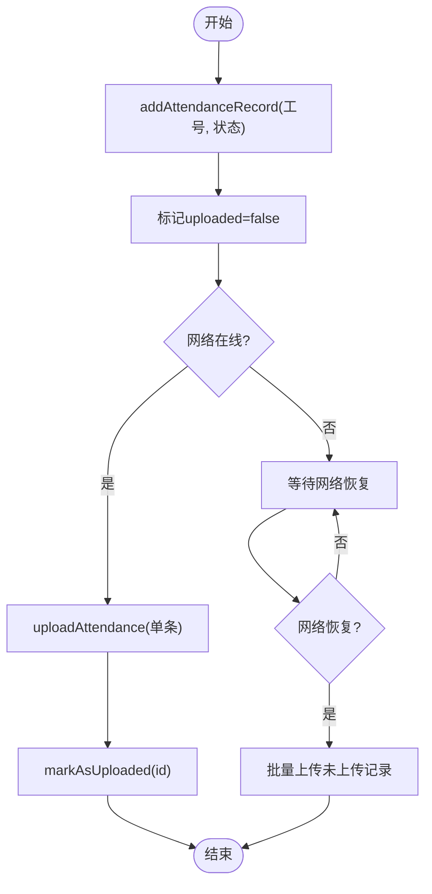
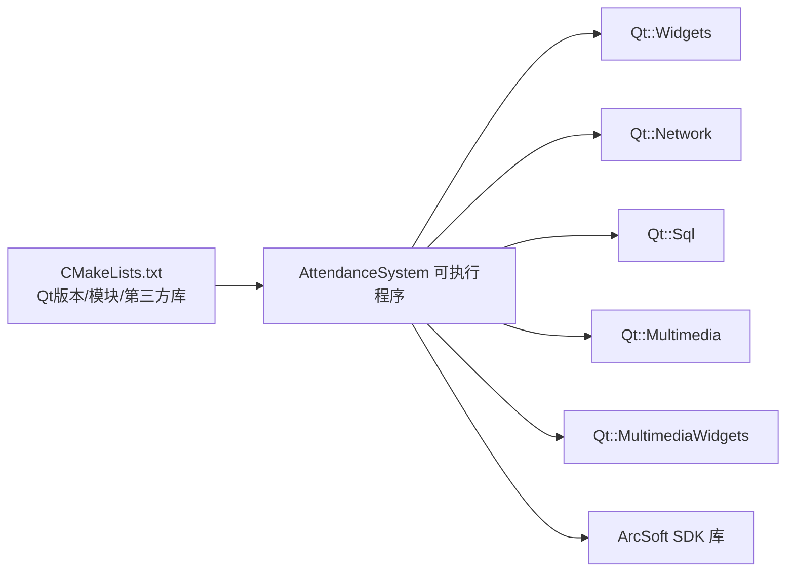

# 技术栈说明

<cite>
**本文引用的文件**
- [CMakeLists.txt](file://CMakeLists.txt)
- [main.cpp](file://main.cpp)
- [mainwindow.h](file://mainwindow.h)
- [mainwindow.cpp](file://mainwindow.cpp)
- [mainwindow.ui](file://mainwindow.ui)
- [FaceRecognition/arcfaceengine.h](file://FaceRecognition/arcfaceengine.h)
- [CameraCapture/cameracapture.h](file://CameraCapture/cameracapture.h)
- [CameraCapture/videoframecapture.h](file://CameraCapture/videoframecapture.h)
- [NetworkClient/networkclient.h](file://NetworkClient/networkclient.h)
- [NetworkClient/protocol.h](file://NetworkClient/protocol.h)
- [LocalStorage/localstorage.h](file://LocalStorage/localstorage.h)
- [AttendanceCheckClient开发文档.md](file://AttendanceCheckClient开发文档.md)
</cite>

## 目录
1. [简介](#简介)
2. [项目结构](#项目结构)
3. [核心组件](#核心组件)
4. [架构总览](#架构总览)
5. [详细组件分析](#详细组件分析)
6. [依赖关系分析](#依赖关系分析)
7. [性能考量](#性能考量)
8. [故障排查指南](#故障排查指南)
9. [结论](#结论)
10. [附录](#附录)

## 简介
本项目为局域网智能考勤系统中的打卡端客户端，围绕“Qt + C++17 + CMake + SQLite3 + dlib/ArcFace”的技术栈构建，目标是在现场完成人脸采集与识别、本地记录存储、断网缓存与TCP上传等核心能力。本文档聚焦技术选型背景、模块协作方式、关键实现要点与最佳实践，帮助开发者快速理解并高效迭代。

## 项目结构
项目采用按功能域分层的目录组织方式，核心模块包括：
- CameraCapture：摄像头采集与视频帧捕获
- FaceRecognition：ArcFace引擎封装、特征提取与匹配、人脸数据库管理
- LocalStorage：基于Qt Sql的SQLite本地存储
- NetworkClient：TCP客户端、心跳、消息编解码与队列
- UI：基于Qt Widgets的主窗口与布局
- third_party：ArcFace SDK头文件与库路径

图示来源
- [main.cpp:13-27](file://main.cpp#L13-L27)
- [mainwindow.h:11-21](file://mainwindow.h#L11-L21)
- [mainwindow.cpp:3-7](file://mainwindow.cpp#L3-L7)
- [CameraCapture/cameracapture.h:9-28](file://CameraCapture/cameracapture.h#L9-L28)
- [CameraCapture/videoframecapture.h:14-42](file://CameraCapture/videoframecapture.h#L14-L42)
- [FaceRecognition/arcfaceengine.h:21-112](file://FaceRecognition/arcfaceengine.h#L21-L112)
- [NetworkClient/networkclient.h:17-73](file://NetworkClient/networkclient.h#L17-L73)
- [NetworkClient/protocol.h:15-58](file://NetworkClient/protocol.h#L15-L58)
- [LocalStorage/localstorage.h:15-46](file://LocalStorage/localstorage.h#L15-L46)

章节来源
- [CMakeLists.txt:19-82](file://CMakeLists.txt#L19-L82)
- [AttendanceCheckClient开发文档.md:107-121](file://AttendanceCheckClient开发文档.md#L107-L121)

## 核心组件
- Qt 5.15/6.2+：提供跨平台GUI、多媒体、网络与SQL支持；通过CMake自动MOC/UIC/RCC开启，简化开发流程。
- C++17：启用现代C++特性，提升可读性与安全性，配合Qt容器与智能指针，降低资源泄漏风险。
- CMake 3.16+：统一构建配置，支持Qt6新命令与Qt5兼容分支，集中管理第三方库链接。
- SQLite3：轻量级嵌入式数据库，满足本地记录存储与断网缓存需求。
- dlib/ArcFace：高性能人脸检测与特征提取，结合特征库实现快速比对。

章节来源
- [CMakeLists.txt:1-14](file://CMakeLists.txt#L1-L14)
- [CMakeLists.txt:16-17](file://CMakeLists.txt#L16-L17)
- [AttendanceCheckClient开发文档.md:8-12](file://AttendanceCheckClient开发文档.md#L8-L12)

## 架构总览
系统采用“本地采集—识别—本地存储—网络上传”的闭环架构。Qt Widgets负责UI展示，Multimedia/MultimediaWidgets负责相机与视频流，Network模块负责与管理端建立长连接并进行心跳维持，LocalStorage负责离线记录的落盘与批量上传，FaceRecognition模块完成人脸检测、特征提取与比对。

图示来源
- [mainwindow.h:11-21](file://mainwindow.h#L11-L21)
- [CameraCapture/cameracapture.h:9-28](file://CameraCapture/cameracapture.h#L9-L28)
- [CameraCapture/videoframecapture.h:14-42](file://CameraCapture/videoframecapture.h#L14-L42)
- [FaceRecognition/arcfaceengine.h:21-112](file://FaceRecognition/arcfaceengine.h#L21-L112)
- [LocalStorage/localstorage.h:15-46](file://LocalStorage/localstorage.h#L15-L46)
- [NetworkClient/networkclient.h:17-73](file://NetworkClient/networkclient.h#L17-L73)
- [NetworkClient/protocol.h:15-58](file://NetworkClient/protocol.h#L15-L58)

## 详细组件分析

### Qt 模块协同工作机制
- Core：提供事件循环、信号槽、线程与基础容器，贯穿所有模块。
- Gui：提供QImage/QRect等图形抽象，支撑人脸框与图像处理。
- Widgets：主窗口与布局，承载UI交互。
- Network：TCP客户端、心跳与消息编解码。
- Sql：SQLite数据库访问与事务处理。
- Multimedia/MultimediaWidgets：相机设备发现、媒体捕获会话、视频预览与帧回调。

图示来源
- [mainwindow.h:11-21](file://mainwindow.h#L11-L21)
- [CameraCapture/cameracapture.h:9-28](file://CameraCapture/cameracapture.h#L9-L28)
- [CameraCapture/videoframecapture.h:14-42](file://CameraCapture/videoframecapture.h#L14-L42)
- [FaceRecognition/arcfaceengine.h:21-112](file://FaceRecognition/arcfaceengine.h#L21-L112)
- [NetworkClient/networkclient.h:17-73](file://NetworkClient/networkclient.h#L17-L73)
- [LocalStorage/localstorage.h:15-46](file://LocalStorage/localstorage.h#L15-L46)

章节来源
- [CMakeLists.txt:16-17](file://CMakeLists.txt#L16-L17)
- [mainwindow.h:11-21](file://mainwindow.h#L11-L21)
- [mainwindow.cpp:3-7](file://mainwindow.cpp#L3-L7)
- [mainwindow.ui:4-22](file://mainwindow.ui#L4-L22)

### 人脸识别与特征比对流程
- 摄像头初始化与视频帧捕获
- 图像格式转换与人脸检测
- 特征提取与与特征库比对
- 结果回传并触发打卡记录生成

图示来源
- [CameraCapture/videoframecapture.h:19-41](file://CameraCapture/videoframecapture.h#L19-L41)
- [FaceRecognition/arcfaceengine.h:74-90](file://FaceRecognition/arcfaceengine.h#L74-L90)
- [LocalStorage/localstorage.h:29-32](file://LocalStorage/localstorage.h#L29-L32)

章节来源
- [FaceRecognition/arcfaceengine.h:21-112](file://FaceRecognition/arcfaceengine.h#L21-L112)
- [CameraCapture/cameracapture.h:9-28](file://CameraCapture/cameracapture.h#L9-L28)
- [CameraCapture/videoframecapture.h:14-42](file://CameraCapture/videoframecapture.h#L14-L42)
- [LocalStorage/localstorage.h:15-46](file://LocalStorage/localstorage.h#L15-L46)

### 网络通信与心跳机制
- 主动连接管理端，维护长连接
- 心跳超时检测与断线重连
- 消息编解码与队列化上传
- 人员数据同步与打卡记录上报

图示来源
- [NetworkClient/networkclient.h:24-54](file://NetworkClient/networkclient.h#L24-L54)
- [NetworkClient/protocol.h:19-26](file://NetworkClient/protocol.h#L19-L26)

章节来源
- [NetworkClient/networkclient.h:17-73](file://NetworkClient/networkclient.h#L17-L73)
- [NetworkClient/protocol.h:15-58](file://NetworkClient/protocol.h#L15-L58)

### 本地存储与断网缓存
- 人员数据同步写入本地库
- 打卡记录落盘并标记上传状态
- 网络恢复后批量上传未上传记录

图示来源
- [LocalStorage/localstorage.h:29-32](file://LocalStorage/localstorage.h#L29-L32)
- [NetworkClient/networkclient.h:30-33](file://NetworkClient/networkclient.h#L30-L33)

章节来源
- [LocalStorage/localstorage.h:15-46](file://LocalStorage/localstorage.h#L15-L46)
- [NetworkClient/networkclient.h:17-73](file://NetworkClient/networkclient.h#L17-L73)

## 依赖关系分析
- 构建系统与Qt版本适配：CMake根据Qt版本选择不同命令与产物类型，同时链接Multimedia/MultimediaWidgets以启用相机与视频能力。
- 第三方库集成：ArcFace SDK头文件与库通过CMake变量引入，确保编译期包含路径与链接库正确。
- 模块耦合：NetworkClient聚合Connectionmanager/Heartbeatmanager/Messagequeue等子模块，形成清晰的职责边界；LocalStorage与NetworkClient通过Protocol进行松耦合交互。

图示来源
- [CMakeLists.txt:30-82](file://CMakeLists.txt#L30-L82)

章节来源
- [CMakeLists.txt:1-14](file://CMakeLists.txt#L1-L14)
- [CMakeLists.txt:16-17](file://CMakeLists.txt#L16-L17)
- [CMakeLists.txt:68-82](file://CMakeLists.txt#L68-L82)

## 性能考量
- 图像处理与特征提取：尽量在非UI线程执行，避免阻塞主线程；合理设置帧率与分辨率，平衡识别精度与性能。
- 数据库事务：批量插入与更新使用事务，减少磁盘IO次数；为常用查询字段建立索引。
- 网络层优化：心跳周期与重连策略折中，避免频繁握手；消息队列按优先级与批次处理，减少拥塞。
- 内存管理：利用Qt容器与RAII语义，避免裸指针；多线程场景使用互斥锁保护共享状态。

## 故障排查指南
- 启动无画面/黑屏：检查摄像头权限与设备可用性，确认VideoFrameCapture与CameraCapture初始化顺序与生命周期。
- 识别失败/误报：调整相似度阈值，优化光照与角度；确认ArcFace引擎初始化参数与图像格式转换正确。
- 网络断连/掉线：核查心跳超时与重连逻辑，检查协议消息类型与序列化/反序列化一致性。
- 数据不一致：核对SQLite事务提交与上传标记流程，确保幂等性与去重策略。

章节来源
- [CameraCapture/cameracapture.h:17-20](file://CameraCapture/cameracapture.h#L17-L20)
- [CameraCapture/videoframecapture.h:37-41](file://CameraCapture/videoframecapture.h#L37-L41)
- [FaceRecognition/arcfaceengine.h:56-67](file://FaceRecognition/arcfaceengine.h#L56-L67)
- [NetworkClient/networkclient.h:48-54](file://NetworkClient/networkclient.h#L48-L54)
- [LocalStorage/localstorage.h:30-32](file://LocalStorage/localstorage.h#L30-L32)

## 结论
本项目以Qt为核心，结合ArcFace与SQLite，构建了稳定高效的局域网打卡端。通过模块化设计与清晰的职责划分，既保证了开发效率，也为后续扩展（如dlib替换、协议扩展、UI增强）提供了良好基础。建议持续关注Qt版本演进与C++17新特性应用，进一步提升代码质量与可维护性。

## 附录
- 技术选型背景与优势
  - Qt：跨平台、模块化、生态成熟，适合GUI与多媒体场景。
  - C++17：现代语法提升表达力与安全性，配合Qt容器与智能指针更易维护。
  - CMake：统一构建配置，便于CI与多平台部署。
  - SQLite3：零配置、可靠性高，满足本地存储与断网缓存。
  - dlib/ArcFace：业界主流，特征提取与比对性能优异。

章节来源
- [AttendanceCheckClient开发文档.md:8-12](file://AttendanceCheckClient开发文档.md#L8-L12)
- [CMakeLists.txt:9-10](file://CMakeLists.txt#L9-L10)