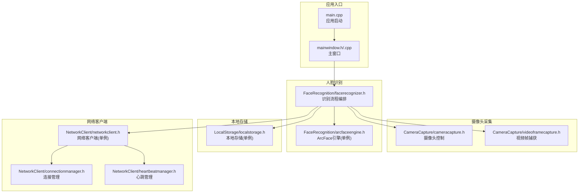
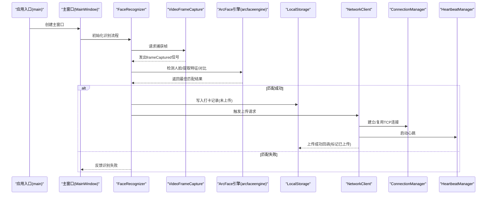
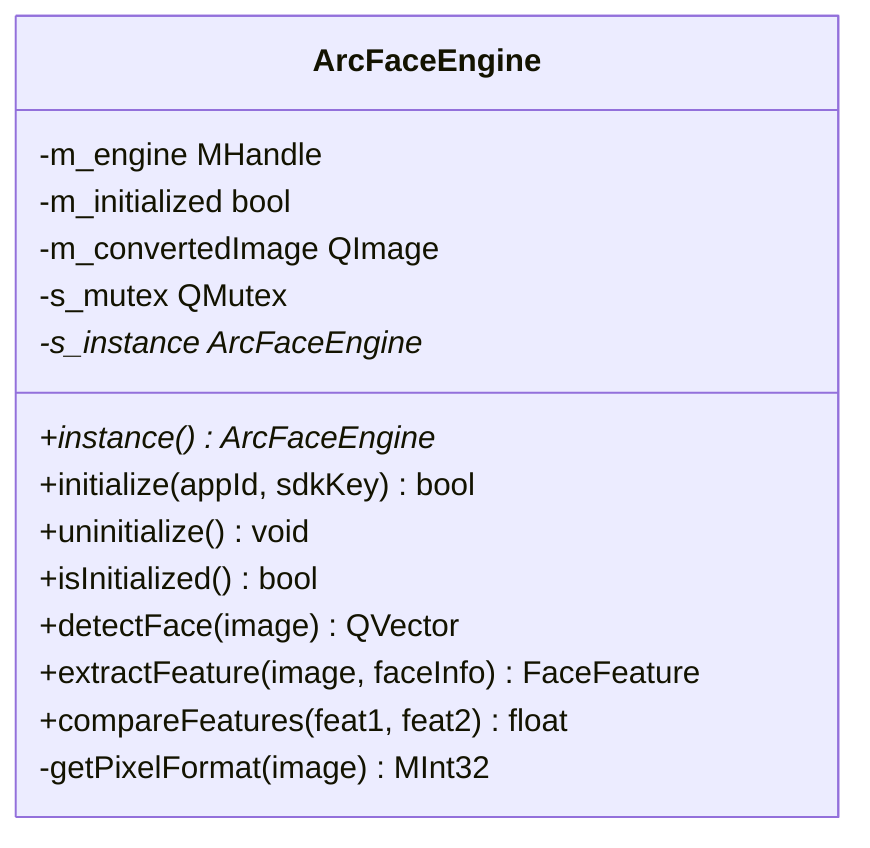
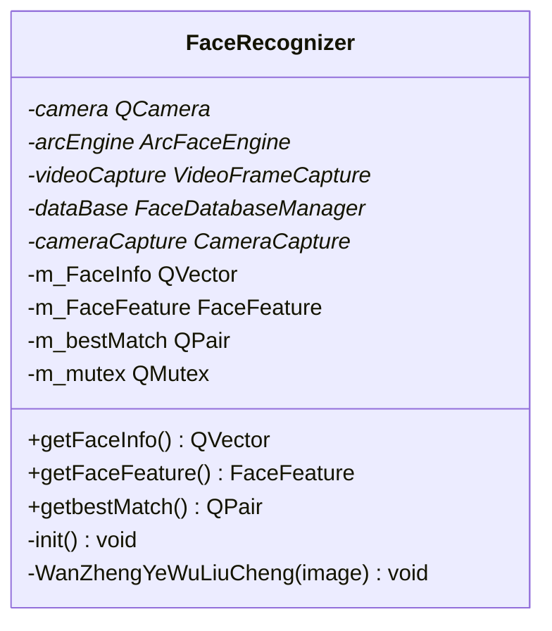
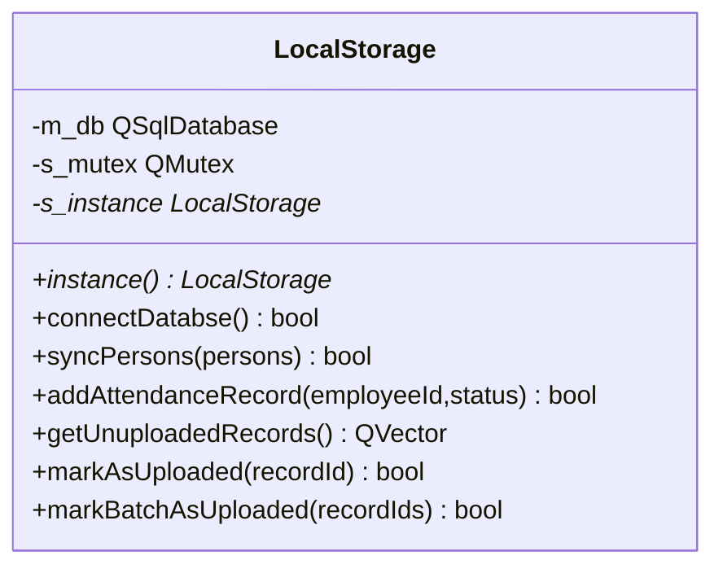
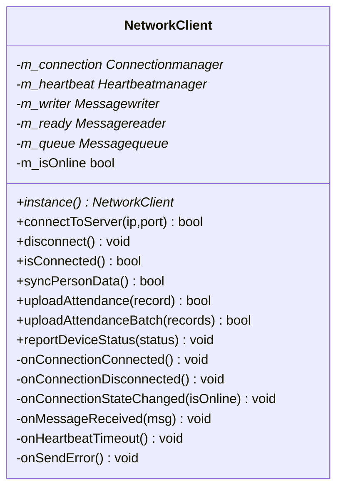
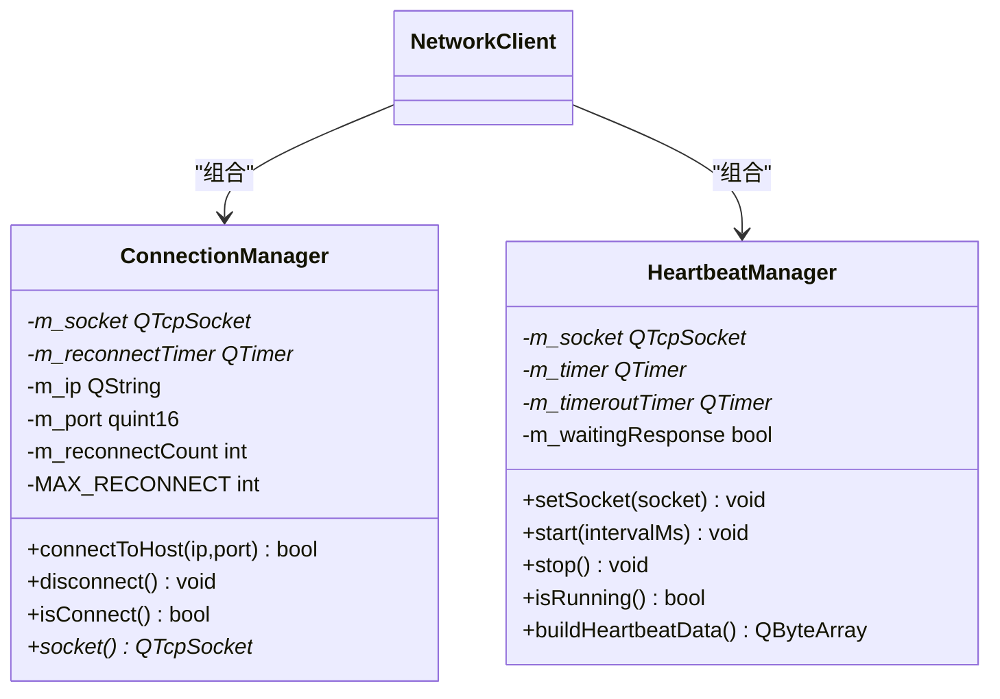
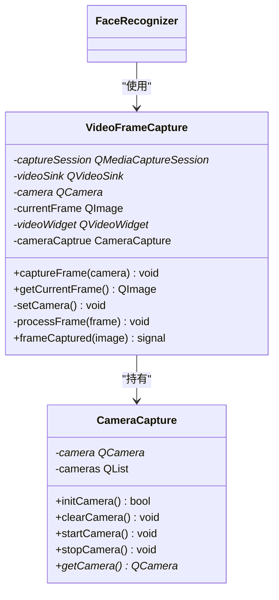
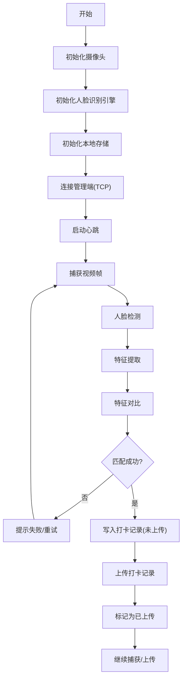
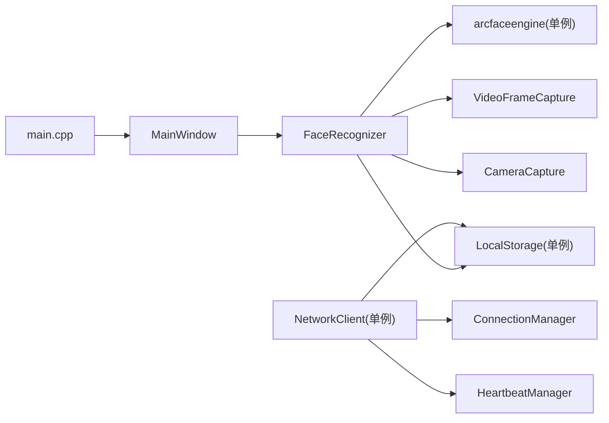

# 架构设计概述

<cite>
**本文引用的文件**
- [main.cpp](file://main.cpp)
- [mainwindow.h](file://mainwindow.h)
- [mainwindow.cpp](file://mainwindow.cpp)
- [CMakeLists.txt](file://CMakeLists.txt)
- [AttendanceCheckClient开发文档.md](file://AttendanceCheckClient开发文档.md)
- [CameraCapture/cameracapture.h](file://CameraCapture/cameracapture.h)
- [CameraCapture/videoframecapture.h](file://CameraCapture/videoframecapture.h)
- [FaceRecognition/arcfaceengine.h](file://FaceRecognition/arcfaceengine.h)
- [FaceRecognition/facerecognizer.h](file://FaceRecognition/facerecognizer.h)
- [LocalStorage/localstorage.h](file://LocalStorage/localstorage.h)
- [NetworkClient/networkclient.h](file://NetworkClient/networkclient.h)
- [NetworkClient/connectionmanager.h](file://NetworkClient/connectionmanager.h)
- [NetworkClient/heartbeatmanager.h](file://NetworkClient/heartbeatmanager.h)
</cite>

## 目录
1. [简介](#简介)
2. [项目结构](#项目结构)
3. [核心组件](#核心组件)
4. [架构总览](#架构总览)
5. [详细组件分析](#详细组件分析)
6. [依赖分析](#依赖分析)
7. [性能考虑](#性能考虑)
8. [故障排查指南](#故障排查指南)
9. [结论](#结论)
10. [附录](#附录)

## 简介
本项目为局域网智能考勤系统的“打卡端客户端”，部署于考勤现场，承担以下职责：
- 实时摄像头采集与视频帧处理
- 人脸识别与特征匹配
- 本地数据库存储与断网缓存
- 通过TCP长连接与管理端通信，定时心跳维持连接，上传打卡记录
- 提供设备状态监控与可视化界面入口

系统采用C/S局域网架构中的客户端角色，围绕模块化设计，将摄像头采集、人脸识别、本地存储、网络通信等能力解耦为独立模块，便于维护与扩展。

## 项目结构
项目采用按功能域分层的模块化组织方式，核心模块如下：
- CameraCapture：摄像头采集与视频帧捕获
- FaceRecognition：人脸识别引擎与识别流程编排
- LocalStorage：本地SQLite数据库封装与业务数据持久化
- NetworkClient：TCP客户端、连接管理、心跳、消息编解码与队列
- UI：窗口与界面（当前以主窗口类作为入口）
- 资源与第三方库：模型、图标、样式与ArcFace SDK

图表来源
- [main.cpp:13-27](file://main.cpp#L13-L27)
- [mainwindow.h:11-17](file://mainwindow.h#L11-L17)
- [CameraCapture/videoframecapture.h:14-42](file://CameraCapture/videoframecapture.h#L14-L42)
- [FaceRecognition/arcfaceengine.h:21-112](file://FaceRecognition/arcfaceengine.h#L21-L112)
- [FaceRecognition/facerecognizer.h:25-58](file://FaceRecognition/facerecognizer.h#L25-L58)
- [LocalStorage/localstorage.h:15-46](file://LocalStorage/localstorage.h#L15-L46)
- [NetworkClient/networkclient.h:17-73](file://NetworkClient/networkclient.h#L17-L73)
- [NetworkClient/connectionmanager.h:8-42](file://NetworkClient/connectionmanager.h#L8-L42)
- [NetworkClient/heartbeatmanager.h:10-38](file://NetworkClient/heartbeatmanager.h#L10-L38)

章节来源
- [CMakeLists.txt:19-55](file://CMakeLists.txt#L19-L55)
- [AttendanceCheckClient开发文档.md:107-121](file://AttendanceCheckClient开发文档.md#L107-L121)

## 核心组件
- 应用入口与主窗口
  - main.cpp负责初始化Qt应用与主窗口，作为事件循环入口
  - mainwindow.h/.cpp提供主窗口类，承载UI布局与交互入口
- 摄像头采集模块
  - CameraCapture：封装QCamera设备管理与生命周期
  - VideoFrameCapture：基于QMediaCaptureSession与QVideoSink捕获视频帧，发出frameCaptured信号
- 人脸识别模块
  - arcfaceengine：ArcFace引擎封装，采用单例模式，提供人脸检测、特征提取、特征对比
  - FaceRecognizer：编排采集、检测、提取、对比的整体流程，持有引擎与数据库管理器实例
- 本地存储模块
  - LocalStorage：单例封装SQLite访问，提供人员同步、打卡记录增删改查与上传标记
- 网络客户端模块
  - Networkclient：单例网络客户端，聚合连接管理、心跳、消息读写与队列，向上游提供业务接口
  - Connectionmanager：主动TCP连接、断线重连、状态信号
  - Heartbeatmanager：心跳发送与超时检测

章节来源
- [main.cpp:13-27](file://main.cpp#L13-L27)
- [mainwindow.h:11-17](file://mainwindow.h#L11-L17)
- [mainwindow.cpp:3-13](file://mainwindow.cpp#L3-L13)
- [CameraCapture/cameracapture.h:9-28](file://CameraCapture/cameracapture.h#L9-L28)
- [CameraCapture/videoframecapture.h:14-42](file://CameraCapture/videoframecapture.h#L14-L42)
- [FaceRecognition/arcfaceengine.h:21-112](file://FaceRecognition/arcfaceengine.h#L21-L112)
- [FaceRecognition/facerecognizer.h:25-58](file://FaceRecognition/facerecognizer.h#L25-L58)
- [LocalStorage/localstorage.h:15-46](file://LocalStorage/localstorage.h#L15-L46)
- [NetworkClient/networkclient.h:17-73](file://NetworkClient/networkclient.h#L17-L73)
- [NetworkClient/connectionmanager.h:8-42](file://NetworkClient/connectionmanager.h#L8-L42)
- [NetworkClient/heartbeatmanager.h:10-38](file://NetworkClient/heartbeatmanager.h#L10-L38)

## 架构总览
系统采用C/S局域网架构中的客户端侧，核心数据流如下：
- 摄像头采集：CameraCapture + VideoFrameCapture持续捕获视频帧，输出frameCaptured信号
- 人脸识别：FaceRecognizer接收帧，调用arcfaceengine进行检测与特征提取，再与本地特征库对比
- 本地存储：识别成功后，调用LocalStorage写入打卡记录；若网络不可用，则标记为未上传
- 网络上传：Networkclient通过Connectionmanager维持长连接，Heartbeatmanager维持心跳；上传成功后回调LocalStorage标记已上传
- 状态反馈：网络状态、识别结果、上传进度等通过信号向上层UI或日志反馈

图表来源
- [main.cpp:21-26](file://main.cpp#L21-L26)
- [mainwindow.h:11-17](file://mainwindow.h#L11-L17)
- [FaceRecognition/facerecognizer.h:37-58](file://FaceRecognition/facerecognizer.h#L37-L58)
- [CameraCapture/videoframecapture.h:39-41](file://CameraCapture/videoframecapture.h#L39-L41)
- [FaceRecognition/arcfaceengine.h:74-90](file://FaceRecognition/arcfaceengine.h#L74-L90)
- [LocalStorage/localstorage.h:29-32](file://LocalStorage/localstorage.h#L29-L32)
- [NetworkClient/networkclient.h:30-33](file://NetworkClient/networkclient.h#L30-L33)
- [NetworkClient/connectionmanager.h:16-18](file://NetworkClient/connectionmanager.h#L16-L18)
- [NetworkClient/heartbeatmanager.h:20-23](file://NetworkClient/heartbeatmanager.h#L20-L23)

## 详细组件分析

### 组件A：人脸识别引擎（ArcFaceEngine）
- 设计要点
  - 单例模式：全局唯一引擎实例，避免重复初始化与资源争用
  - 线程安全：提供静态互斥锁，保证多线程访问安全
  - 功能完备：检测、特征提取、特征对比
- 关键接口
  - 初始化/反初始化
  - 检测人脸、提取特征、对比特征
- 复杂度与性能
  - 特征提取与对比为CPU密集型，建议在非UI线程执行
  - 图像格式转换与缓存减少SDK调用开销

图表来源
- [FaceRecognition/arcfaceengine.h:21-112](file://FaceRecognition/arcfaceengine.h#L21-L112)

章节来源
- [FaceRecognition/arcfaceengine.h:21-112](file://FaceRecognition/arcfaceengine.h#L21-L112)

### 组件B：识别流程编排（FaceRecognizer）
- 设计要点
  - 聚合摄像头、视频帧捕获、引擎与数据库管理器
  - 串行化处理：采集→检测→提取→对比→落库→上传
  - 线程安全：使用互斥锁保护共享状态
- 关键流程
  - 初始化：加载引擎、数据库、摄像头
  - 整体流程：捕获帧→检测→提取→对比→记录→上传
- 与引擎/数据库/摄像头的关系
  - 依赖arcfaceengine单例
  - 依赖LocalStorage单例
  - 依赖VideoFrameCapture与CameraCapture

图表来源
- [FaceRecognition/facerecognizer.h:25-58](file://FaceRecognition/facerecognizer.h#L25-L58)

章节来源
- [FaceRecognition/facerecognizer.h:25-58](file://FaceRecognition/facerecognizer.h#L25-L58)

### 组件C：本地存储（LocalStorage）
- 设计要点
  - 单例封装SQLite访问，提供人员同步与打卡记录管理
  - 支持事务性人员同步与批量未上传记录查询
  - 上传标记与批量标记接口，避免重复上传
- 关键接口
  - 连接数据库
  - 同步人员数据（事务）
  - 新增打卡记录、查询未上传记录、标记已上传/批量标记

图表来源
- [LocalStorage/localstorage.h:15-46](file://LocalStorage/localstorage.h#L15-L46)

章节来源
- [LocalStorage/localstorage.h:15-46](file://LocalStorage/localstorage.h#L15-L46)

### 组件D：网络客户端（NetworkClient）
- 设计要点
  - 单例网络客户端，聚合连接管理、心跳、消息读写与队列
  - 通过Connectionmanager维持长连接与断线重连
  - 通过Heartbeatmanager维持心跳，防止空闲断开
  - 业务接口：同步人员、上传单条/批量打卡记录、上报设备状态
- 关键流程
  - 连接建立→心跳启动→业务数据传输→上传成功回调→标记已上传

图表来源
- [NetworkClient/networkclient.h:17-73](file://NetworkClient/networkclient.h#L17-L73)

章节来源
- [NetworkClient/networkclient.h:17-73](file://NetworkClient/networkclient.h#L17-L73)

### 组件E：连接管理与心跳（ConnectionManager / HeartbeatManager）
- ConnectionManager
  - 主动连接、断开、状态信号、断线重连定时器
- HeartbeatManager
  - 心跳发送与超时检测，避免空闲断开
- 交互关系
  - NetworkClient组合两者，统一对外提供网络能力

图表来源
- [NetworkClient/connectionmanager.h:8-42](file://NetworkClient/connectionmanager.h#L8-L42)
- [NetworkClient/heartbeatmanager.h:10-38](file://NetworkClient/heartbeatmanager.h#L10-L38)
- [NetworkClient/networkclient.h:66-70](file://NetworkClient/networkclient.h#L66-L70)

章节来源
- [NetworkClient/connectionmanager.h:8-42](file://NetworkClient/connectionmanager.h#L8-L42)
- [NetworkClient/heartbeatmanager.h:10-38](file://NetworkClient/heartbeatmanager.h#L10-L38)

### 组件F：摄像头采集（CameraCapture / VideoFrameCapture）
- CameraCapture
  - QCamera设备管理与生命周期控制
- VideoFrameCapture
  - 基于QMediaCaptureSession与QVideoSink捕获帧，发出frameCaptured信号
- 交互关系
  - FaceRecognizer通过VideoFrameCapture获取帧，驱动识别流程

图表来源
- [CameraCapture/cameracapture.h:9-28](file://CameraCapture/cameracapture.h#L9-L28)
- [CameraCapture/videoframecapture.h:14-42](file://CameraCapture/videoframecapture.h#L14-L42)
- [FaceRecognition/facerecognizer.h:40-44](file://FaceRecognition/facerecognizer.h#L40-L44)

章节来源
- [CameraCapture/cameracapture.h:9-28](file://CameraCapture/cameracapture.h#L9-L28)
- [CameraCapture/videoframecapture.h:14-42](file://CameraCapture/videoframecapture.h#L14-L42)

### 概念性总览
以下为概念性流程图，展示从摄像头采集到上传的完整闭环：

## 依赖分析
- 模块内聚与耦合
  - FaceRecognizer聚合多个子模块，承担编排职责，耦合度适中
  - arcfaceengine与LocalStorage均为单例，降低全局状态复杂度
  - NetworkClient聚合ConnectionManager与HeartbeatManager，职责清晰
- 外部依赖
  - Qt模块：Widgets、Network、Sql、Multimedia、MultimediaWidgets
  - ArcFace SDK：第三方人脸识别引擎
- 构建与链接
  - CMakeLists集中声明Qt模块与第三方库链接

图表来源
- [FaceRecognition/facerecognizer.h:40-44](file://FaceRecognition/facerecognizer.h#L40-L44)
- [FaceRecognition/arcfaceengine.h:48-61](file://FaceRecognition/arcfaceengine.h#L48-L61)
- [LocalStorage/localstorage.h:20-23](file://LocalStorage/localstorage.h#L20-L23)
- [NetworkClient/networkclient.h:66-70](file://NetworkClient/networkclient.h#L66-L70)
- [main.cpp:21-26](file://main.cpp#L21-L26)

章节来源
- [CMakeLists.txt:16-82](file://CMakeLists.txt#L16-L82)

## 性能考虑
- 识别性能
  - 将ArcFace引擎调用置于非UI线程，避免阻塞界面
  - 合理设置视频帧采样频率，平衡实时性与计算负载
- 存储性能
  - SQLite事务批量同步人员数据，减少磁盘IO
  - 未上传记录采用批量上传策略，降低网络与数据库压力
- 网络性能
  - 心跳间隔与超时阈值根据局域网延迟调整
  - JSON消息体精简字段，减少带宽占用
- 资源管理
  - 单例模式避免重复初始化与资源泄漏
  - 互斥锁保护共享状态，避免竞态条件

## 故障排查指南
- 摄像头无法启动
  - 检查CameraCapture初始化与设备权限
  - 确认VideoFrameCapture的捕获会话与视频sink配置
- 识别失败
  - 检查arcfaceengine初始化参数与图像格式转换
  - 确认特征提取与对比阈值设置合理
- 本地存储异常
  - 检查数据库连接与事务提交
  - 核对未上传记录查询与标记逻辑
- 网络连接问题
  - 查看ConnectionManager的重连次数与状态信号
  - 检查HeartbeatManager的心跳超时与断线重连
- 上传失败
  - 检查NetworkClient的上传回调与LocalStorage标记

章节来源
- [CameraCapture/cameracapture.h:17-20](file://CameraCapture/cameracapture.h#L17-L20)
- [CameraCapture/videoframecapture.h:20,36-41](file://CameraCapture/videoframecapture.h#L20,L36-L41)
- [FaceRecognition/arcfaceengine.h:56,67,104](file://FaceRecognition/arcfaceengine.h#L56,L67,L104)
- [LocalStorage/localstorage.h:23-32](file://LocalStorage/localstorage.h#L23-L32)
- [NetworkClient/connectionmanager.h:16-27](file://NetworkClient/connectionmanager.h#L16-L27)
- [NetworkClient/heartbeatmanager.h:20-27](file://NetworkClient/heartbeatmanager.h#L20-L27)
- [NetworkClient/networkclient.h:30-44](file://NetworkClient/networkclient.h#L30-L44)

## 结论
本项目以Qt为统一技术栈，围绕模块化设计将摄像头采集、人脸识别、本地存储与网络通信解耦，采用单例模式与观察者模式（信号槽）提升可维护性与扩展性。通过心跳与断线重连保障局域网稳定性，结合本地缓存与批量上传实现断网场景下的数据一致性。整体架构清晰、职责明确，适合在考勤现场稳定运行并易于后续迭代。

## 附录
- 技术选型说明
  - Qt：跨平台GUI与多媒体框架，满足C/S客户端需求
  - ArcFace：高性能人脸识别SDK，适合嵌入式与桌面端部署
  - SQLite：轻量级本地数据库，满足小规模数据持久化
  - CMake：跨平台构建工具，便于多平台编译与第三方库集成
- 部署建议
  - 在考勤现场部署专用终端，确保稳定的局域网访问
  - 预先配置管理端IP与端口，确保首次连接与心跳正常
  - 定期检查摄像头与识别模型有效性，确保识别准确率