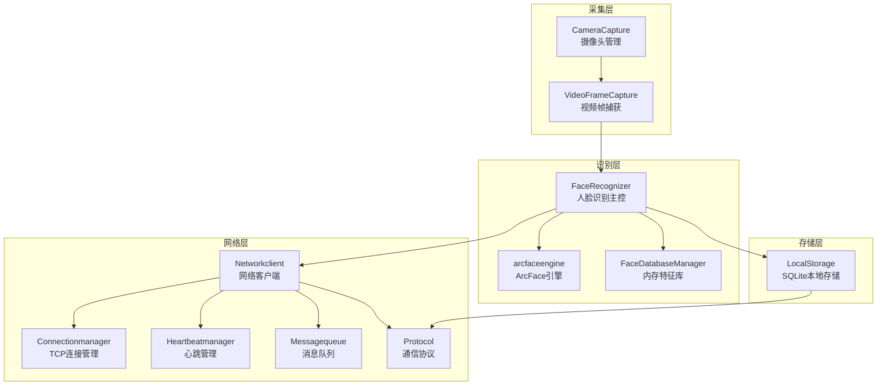
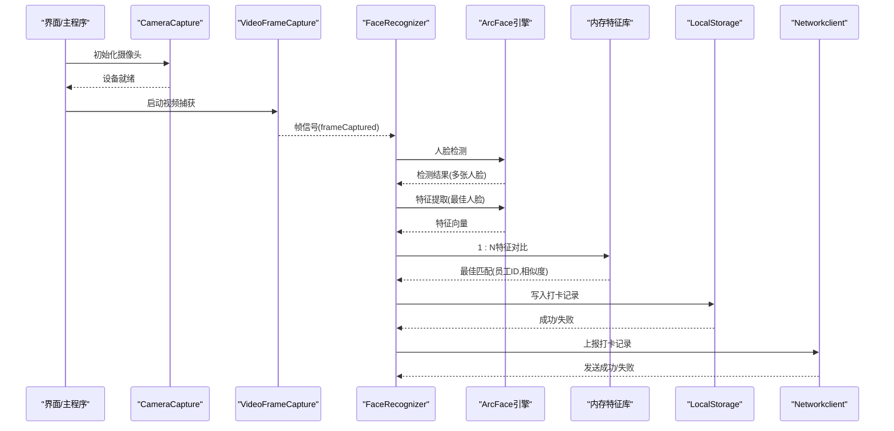
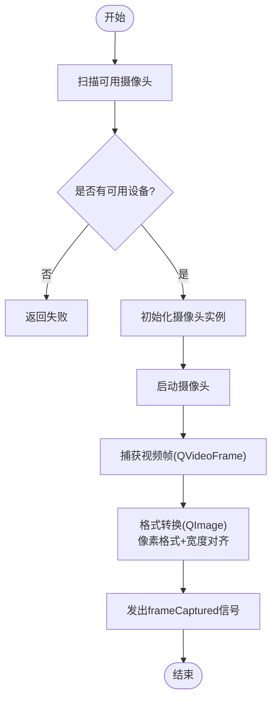
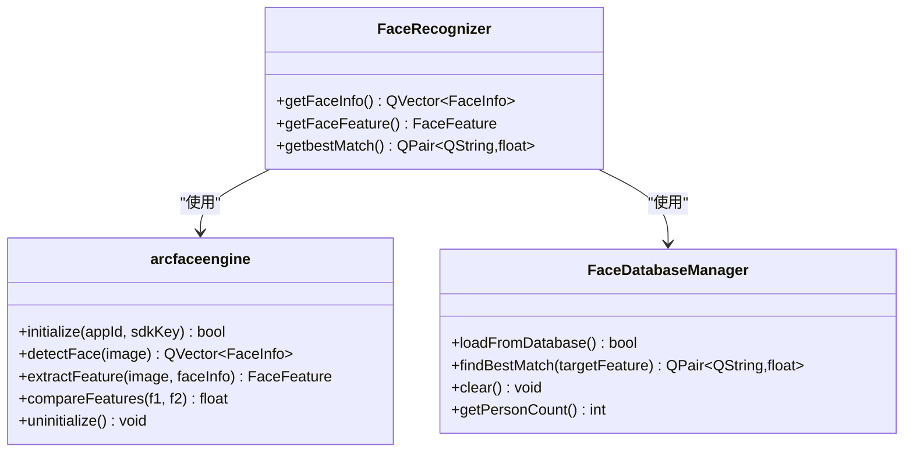
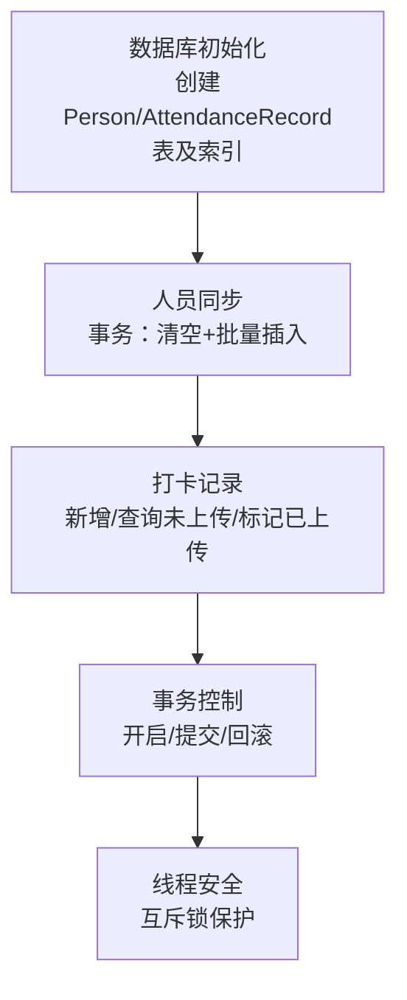
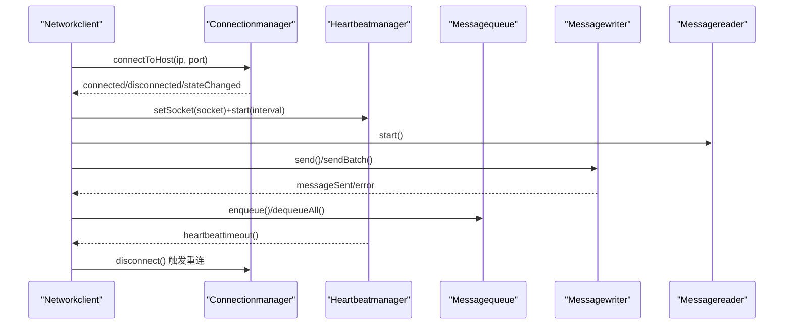
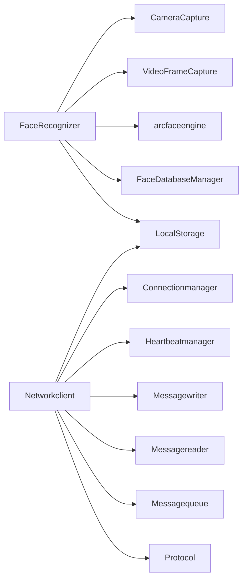

# 核心功能特性

<cite>
**本文引用的文件**
- [main.cpp](file://main.cpp)
- [mainwindow.h](file://mainwindow.h)
- [mainwindow.cpp](file://mainwindow.cpp)
- [CameraCapture/cameracapture.h](file://CameraCapture/cameracapture.h)
- [CameraCapture/cameracapture.cpp](file://CameraCapture/cameracapture.cpp)
- [CameraCapture/videoframecapture.h](file://CameraCapture/videoframecapture.h)
- [FaceRecognition/arcfaceengine.h](file://FaceRecognition/arcfaceengine.h)
- [FaceRecognition/arcfaceengine.cpp](file://FaceRecognition/arcfaceengine.cpp)
- [FaceRecognition/facedatabasemanager.h](file://FaceRecognition/facedatabasemanager.h)
- [FaceRecognition/facerecognizer.h](file://FaceRecognition/facerecognizer.h)
- [LocalStorage/localstorage.h](file://LocalStorage/localstorage.h)
- [LocalStorage/localstorage.cpp](file://LocalStorage/localstorage.cpp)
- [NetworkClient/networkclient.h](file://NetworkClient/networkclient.h)
- [NetworkClient/networkclient.cpp](file://NetworkClient/networkclient.cpp)
- [NetworkClient/connectionmanager.h](file://NetworkClient/connectionmanager.h)
- [NetworkClient/heartbeatmanager.h](file://NetworkClient/heartbeatmanager.h)
- [NetworkClient/messagequeue.h](file://NetworkClient/messagequeue.h)
- [NetworkClient/protocol.h](file://NetworkClient/protocol.h)
</cite>

## 目录
1. [简介](#简介)
2. [项目结构](#项目结构)
3. [核心组件](#核心组件)
4. [架构总览](#架构总览)
5. [详细组件分析](#详细组件分析)
6. [依赖分析](#依赖分析)
7. [性能考虑](#性能考虑)
8. [故障排查指南](#故障排查指南)
9. [结论](#结论)
10. [附录](#附录)

## 简介
本文件面向局域网智能考勤系统打卡端客户端，系统围绕“摄像头采集—人脸识别—本地存储—网络通信”闭环展开，提供稳定、可靠的实时人脸检测与识别、特征提取与对比、本地数据库持久化以及基于 TCP 的心跳保活与消息队列容错的网络通信能力。本文档旨在帮助用户全面理解系统核心功能模块及其协作关系与数据流转过程。

## 项目结构
系统采用按功能分层的模块化组织方式：
- CameraCapture：负责摄像头设备发现、视频帧捕获与格式转换
- FaceRecognition：封装 ArcFace 引擎，提供人脸检测、特征提取、特征对比与内存特征库管理
- LocalStorage：基于 SQLite 的本地数据库，提供人员同步、打卡记录增删改查与上传状态标记
- NetworkClient：统一网络客户端，整合连接管理、心跳、消息读写与消息队列，负责与服务端通信
- 协议层 Protocol：定义消息类型、数据结构与序列化/反序列化方法
- 主入口与界面：main.cpp 与 MainWindow 提供应用启动与界面承载

图表来源
- [CameraCapture/cameracapture.h:1-31](file://CameraCapture/cameracapture.h#L1-L31)
- [CameraCapture/videoframecapture.h:1-45](file://CameraCapture/videoframecapture.h#L1-L45)
- [FaceRecognition/arcfaceengine.h:1-115](file://FaceRecognition/arcfaceengine.h#L1-L115)
- [FaceRecognition/facedatabasemanager.h:1-47](file://FaceRecognition/facedatabasemanager.h#L1-L47)
- [FaceRecognition/facerecognizer.h:1-61](file://FaceRecognition/facerecognizer.h#L1-L61)
- [LocalStorage/localstorage.h:1-49](file://LocalStorage/localstorage.h#L1-L49)
- [NetworkClient/networkclient.h:1-75](file://NetworkClient/networkclient.h#L1-L75)
- [NetworkClient/connectionmanager.h:1-45](file://NetworkClient/connectionmanager.h#L1-L45)
- [NetworkClient/heartbeatmanager.h:1-41](file://NetworkClient/heartbeatmanager.h#L1-L41)
- [NetworkClient/messagequeue.h:1-33](file://NetworkClient/messagequeue.h#L1-L33)
- [NetworkClient/protocol.h:1-61](file://NetworkClient/protocol.h#L1-L61)

章节来源
- [main.cpp:1-28](file://main.cpp#L1-L28)
- [mainwindow.h:1-23](file://mainwindow.h#L1-L23)
- [mainwindow.cpp:1-14](file://mainwindow.cpp#L1-L14)

## 核心组件
- 摄像头采集：通过 QMediaDevices 扫描设备，QCamera 启停，QMediaCaptureSession 与 QVideoSink 捕获帧，输出 QImage 供后续处理
- 人脸识别：ArcFace 引擎提供人脸检测、特征提取、特征对比；内存特征库支持快速 1:N 匹配；主线程与识别流程通过互斥锁保护
- 本地存储：SQLite 数据库，包含人员表与打卡记录表，支持事务性人员同步、未上传记录查询与上传标记
- 网络通信：TCP 连接管理、心跳保活、消息读写、消息队列容错，协议层定义消息类型与数据结构

章节来源
- [CameraCapture/cameracapture.h:1-31](file://CameraCapture/cameracapture.h#L1-L31)
- [CameraCapture/cameracapture.cpp:1-72](file://CameraCapture/cameracapture.cpp#L1-L72)
- [CameraCapture/videoframecapture.h:1-45](file://CameraCapture/videoframecapture.h#L1-L45)
- [FaceRecognition/arcfaceengine.h:1-115](file://FaceRecognition/arcfaceengine.h#L1-L115)
- [FaceRecognition/arcfaceengine.cpp:1-295](file://FaceRecognition/arcfaceengine.cpp#L1-L295)
- [FaceRecognition/facedatabasemanager.h:1-47](file://FaceRecognition/facedatabasemanager.h#L1-L47)
- [FaceRecognition/facerecognizer.h:1-61](file://FaceRecognition/facerecognizer.h#L1-L61)
- [LocalStorage/localstorage.h:1-49](file://LocalStorage/localstorage.h#L1-L49)
- [LocalStorage/localstorage.cpp:1-346](file://LocalStorage/localstorage.cpp#L1-L346)
- [NetworkClient/networkclient.h:1-75](file://NetworkClient/networkclient.h#L1-L75)
- [NetworkClient/networkclient.cpp:1-312](file://NetworkClient/networkclient.cpp#L1-L312)
- [NetworkClient/connectionmanager.h:1-45](file://NetworkClient/connectionmanager.h#L1-L45)
- [NetworkClient/heartbeatmanager.h:1-41](file://NetworkClient/heartbeatmanager.h#L1-L41)
- [NetworkClient/messagequeue.h:1-33](file://NetworkClient/messagequeue.h#L1-L33)
- [NetworkClient/protocol.h:1-61](file://NetworkClient/protocol.h#L1-L61)

## 架构总览
系统以“采集—识别—存储—通信”为主线，辅以协议与队列保障可靠性与一致性：
- 采集层：摄像头设备发现与启停、视频帧捕获与格式转换
- 识别层：人脸检测、特征提取、特征对比、内存特征库管理
- 存储层：人员同步（事务）、打卡记录增删改查、上传状态标记
- 网络层：连接管理、心跳保活、消息读写、消息队列容错、协议编解码

图表来源
- [CameraCapture/cameracapture.h:1-31](file://CameraCapture/cameracapture.h#L1-L31)
- [CameraCapture/videoframecapture.h:1-45](file://CameraCapture/videoframecapture.h#L1-L45)
- [FaceRecognition/facerecognizer.h:1-61](file://FaceRecognition/facerecognizer.h#L1-L61)
- [FaceRecognition/arcfaceengine.h:1-115](file://FaceRecognition/arcfaceengine.h#L1-L115)
- [FaceRecognition/facedatabasemanager.h:1-47](file://FaceRecognition/facedatabasemanager.h#L1-L47)
- [LocalStorage/localstorage.h:1-49](file://LocalStorage/localstorage.h#L1-L49)
- [NetworkClient/networkclient.h:1-75](file://NetworkClient/networkclient.h#L1-L75)

## 详细组件分析

### 摄像头采集功能
- 设备发现与实例化：通过 QMediaDevices::videoInputs() 扫描可用设备，选择首个设备实例化 QCamera
- 生命周期管理：initCamera()/clearCamera()/startCamera()/stopCamera() 提供完整的启停与释放流程
- 视频帧捕获：QMediaCaptureSession + QVideoSink 接收 QVideoFrame，转换为 QImage 并发出 frameCaptured 信号
- 格式转换：针对 SDK 需求进行像素格式与宽度对齐处理，确保后续识别稳定性

图表来源
- [CameraCapture/cameracapture.cpp:1-72](file://CameraCapture/cameracapture.cpp#L1-L72)
- [CameraCapture/videoframecapture.h:1-45](file://CameraCapture/videoframecapture.h#L1-L45)

章节来源
- [CameraCapture/cameracapture.h:1-31](file://CameraCapture/cameracapture.h#L1-L31)
- [CameraCapture/cameracapture.cpp:1-72](file://CameraCapture/cameracapture.cpp#L1-L72)
- [CameraCapture/videoframecapture.h:1-45](file://CameraCapture/videoframecapture.h#L1-L45)

### 人脸识别功能
- 人脸检测：调用 ArcFace 引擎 detectFace，返回多张人脸的矩形框、角度与追踪 ID
- 特征提取：对最佳人脸区域调用 extractFeature，得到二进制特征向量
- 特征对比：使用 compareFeatures 计算相似度，结合阈值判断身份
- 内存特征库：启动时从数据库加载所有人脸特征至内存，提供快速 1:N 匹配
- 主控流程：FaceRecognizer 组织上述步骤，提供线程安全的查询接口与互斥保护

图表来源
- [FaceRecognition/arcfaceengine.h:1-115](file://FaceRecognition/arcfaceengine.h#L1-L115)
- [FaceRecognition/arcfaceengine.cpp:1-295](file://FaceRecognition/arcfaceengine.cpp#L1-L295)
- [FaceRecognition/facedatabasemanager.h:1-47](file://FaceRecognition/facedatabasemanager.h#L1-L47)
- [FaceRecognition/facerecognizer.h:1-61](file://FaceRecognition/facerecognizer.h#L1-L61)

章节来源
- [FaceRecognition/arcfaceengine.h:1-115](file://FaceRecognition/arcfaceengine.h#L1-L115)
- [FaceRecognition/arcfaceengine.cpp:1-295](file://FaceRecognition/arcfaceengine.cpp#L1-L295)
- [FaceRecognition/facedatabasemanager.h:1-47](file://FaceRecognition/facedatabasemanager.h#L1-L47)
- [FaceRecognition/facerecognizer.h:1-61](file://FaceRecognition/facerecognizer.h#L1-L61)

### 本地存储功能
- 数据库初始化：自动创建 data/attendance.db，建表与索引，启用外键与 UTF-8 编码
- 人员同步：事务性清空与批量插入，支持失败回滚与错误信号
- 打卡记录：新增记录、查询未上传记录、单条与批量标记已上传
- 线程安全：通过互斥锁保护数据库访问，避免并发冲突

图表来源
- [LocalStorage/localstorage.cpp:1-346](file://LocalStorage/localstorage.cpp#L1-L346)
- [LocalStorage/localstorage.h:1-49](file://LocalStorage/localstorage.h#L1-L49)

章节来源
- [LocalStorage/localstorage.h:1-49](file://LocalStorage/localstorage.h#L1-L49)
- [LocalStorage/localstorage.cpp:1-346](file://LocalStorage/localstorage.cpp#L1-L346)

### 网络通信功能
- 连接管理：Connectionmanager 封装 TCP 连接、断开、重连与状态信号
- 心跳机制：Heartbeatmanager 定时发送心跳，检测超时并触发重连
- 消息队列：Messagequeue 提供线程安全的入队/出队，支持批量发送失败回退
- 协议编解码：Protocol 定义消息类型与数据结构，提供序列化/反序列化
- 网络客户端：Networkclient 整合上述模块，负责业务消息发送、队列处理与状态广播

图表来源
- [NetworkClient/networkclient.h:1-75](file://NetworkClient/networkclient.h#L1-L75)
- [NetworkClient/networkclient.cpp:1-312](file://NetworkClient/networkclient.cpp#L1-L312)
- [NetworkClient/connectionmanager.h:1-45](file://NetworkClient/connectionmanager.h#L1-L45)
- [NetworkClient/heartbeatmanager.h:1-41](file://NetworkClient/heartbeatmanager.h#L1-L41)
- [NetworkClient/messagequeue.h:1-33](file://NetworkClient/messagequeue.h#L1-L33)
- [NetworkClient/protocol.h:1-61](file://NetworkClient/protocol.h#L1-L61)

章节来源
- [NetworkClient/networkclient.h:1-75](file://NetworkClient/networkclient.h#L1-L75)
- [NetworkClient/networkclient.cpp:1-312](file://NetworkClient/networkclient.cpp#L1-L312)
- [NetworkClient/connectionmanager.h:1-45](file://NetworkClient/connectionmanager.h#L1-L45)
- [NetworkClient/heartbeatmanager.h:1-41](file://NetworkClient/heartbeatmanager.h#L1-L41)
- [NetworkClient/messagequeue.h:1-33](file://NetworkClient/messagequeue.h#L1-L33)
- [NetworkClient/protocol.h:1-61](file://NetworkClient/protocol.h#L1-L61)

## 依赖分析
- 组件耦合
  - FaceRecognizer 依赖 CameraCapture、VideoFrameCapture、arcfaceengine、FaceDatabaseManager、LocalStorage
  - Networkclient 依赖 Connectionmanager、Heartbeatmanager、Messagewriter、Messagereader、Messagequeue、Protocol、LocalStorage
- 外部依赖
  - Qt 框架（Core/Gui/Media/Camera/Sensors/Sql）
  - ArcSoft SDK（人脸检测与识别）
  - SQLite（本地持久化）

图表来源
- [FaceRecognition/facerecognizer.h:1-61](file://FaceRecognition/facerecognizer.h#L1-L61)
- [NetworkClient/networkclient.h:1-75](file://NetworkClient/networkclient.h#L1-L75)
- [LocalStorage/localstorage.h:1-49](file://LocalStorage/localstorage.h#L1-L49)

章节来源
- [FaceRecognition/facerecognizer.h:1-61](file://FaceRecognition/facerecognizer.h#L1-L61)
- [NetworkClient/networkclient.h:1-75](file://NetworkClient/networkclient.h#L1-L75)
- [LocalStorage/localstorage.h:1-49](file://LocalStorage/localstorage.h#L1-L49)

## 性能考虑
- 识别性能
  - 图像格式转换与宽度对齐减少 SDK 调用失败率，提升稳定性
  - 视频模式下的人脸检测与追踪有助于降低重复计算
- 存储性能
  - 事务性批量插入减少磁盘 IO 次数，提高同步效率
  - 合理索引（人员名、记录员工ID、记录时间）优化查询性能
- 网络性能
  - 心跳保活与断线重连降低长连接异常风险
  - 消息队列支持批量发送与失败回退，提升吞吐与可靠性

## 故障排查指南
- 摄像头问题
  - 无可用设备：确认设备权限与驱动，检查设备扫描结果
  - 启停异常：确保先 clearCamera() 释放旧实例，再 initCamera() 重建
- 识别失败
  - 引擎未初始化：确认 initialize(appId, sdkKey) 返回成功
  - 图像为空或格式不匹配：检查帧捕获与格式转换流程
  - 特征提取/对比失败：查看错误码与日志，确认特征数据非空
- 存储异常
  - 数据库未连接：确认 connectDatabse() 成功并建表完成
  - 事务失败：关注回滚日志，检查字段绑定与约束
- 网络问题
  - 连接失败：检查 IP/端口与防火墙，观察重连定时器
  - 心跳超时：确认服务器可达与消息读写正常
  - 发送错误：检查队列处理与批量发送返回值

章节来源
- [CameraCapture/cameracapture.cpp:1-72](file://CameraCapture/cameracapture.cpp#L1-L72)
- [FaceRecognition/arcfaceengine.cpp:1-295](file://FaceRecognition/arcfaceengine.cpp#L1-L295)
- [LocalStorage/localstorage.cpp:1-346](file://LocalStorage/localstorage.cpp#L1-L346)
- [NetworkClient/networkclient.cpp:1-312](file://NetworkClient/networkclient.cpp#L1-L312)

## 结论
本系统通过清晰的模块划分与稳健的技术选型，实现了从摄像头采集到人脸识别、本地存储与网络通信的完整闭环。人脸识别采用成熟的 ArcFace 引擎，结合内存特征库实现高效 1:N 匹配；本地存储以 SQLite 为基础，提供事务性与索引优化；网络层以心跳与消息队列保障连接可靠性与消息有序性。整体架构具备良好的扩展性与可维护性，适合在局域网环境下部署与运行。

## 附录
- 主入口与界面
  - main.cpp 启动应用，MainWindow 提供界面承载
- 协议与数据结构
  - Protocol 定义消息类型与数据结构，便于前后端一致化对接

章节来源
- [main.cpp:1-28](file://main.cpp#L1-L28)
- [mainwindow.h:1-23](file://mainwindow.h#L1-L23)
- [mainwindow.cpp:1-14](file://mainwindow.cpp#L1-L14)
- [NetworkClient/protocol.h:1-61](file://NetworkClient/protocol.h#L1-L61)