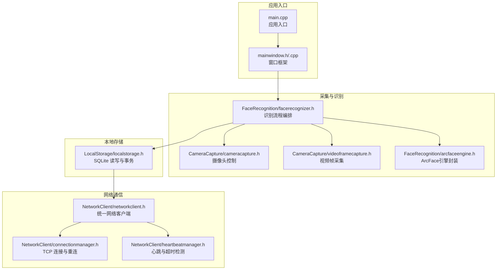
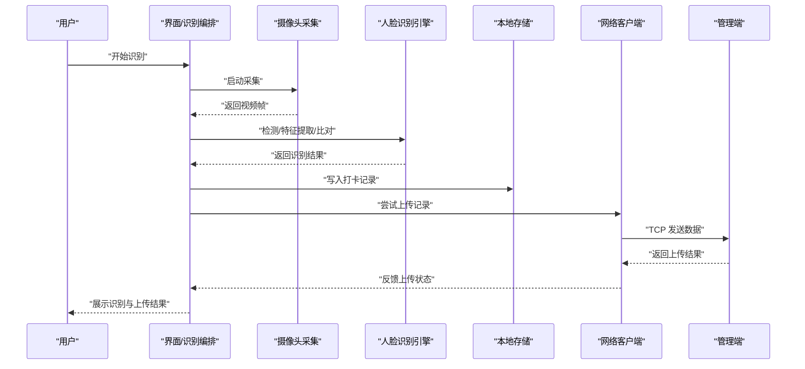
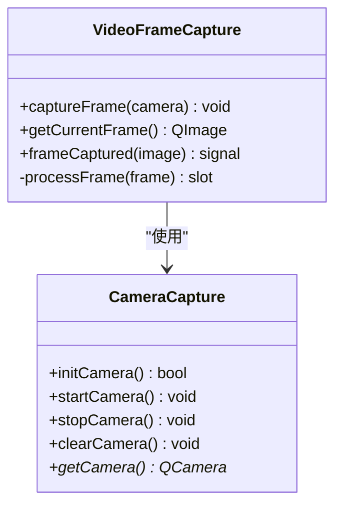
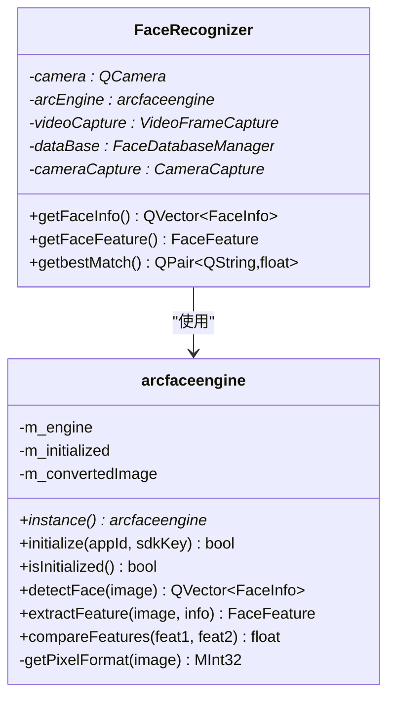
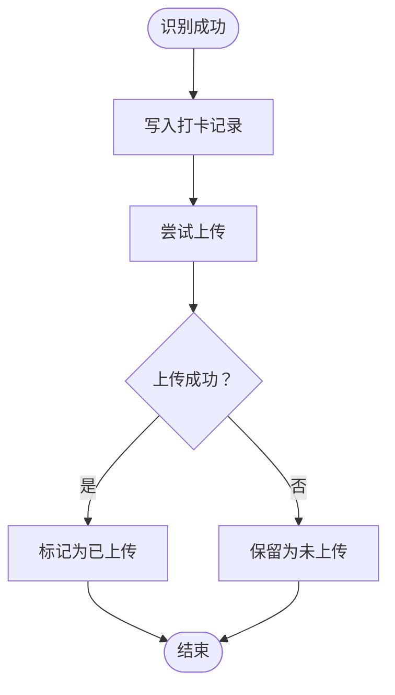
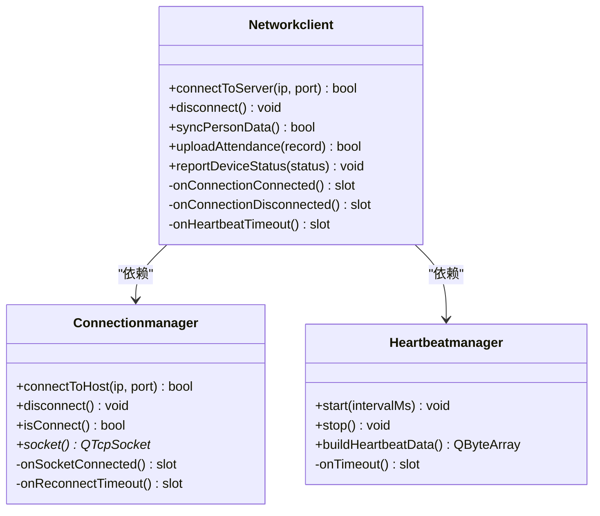
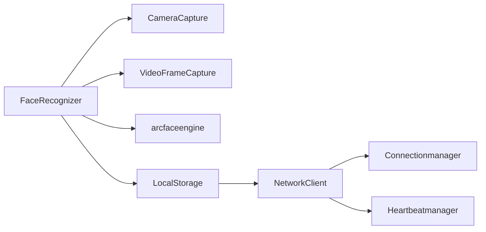

# 项目介绍

<cite>
**本文引用的文件**
- [main.cpp](file://main.cpp)
- [mainwindow.h](file://mainwindow.h)
- [mainwindow.cpp](file://mainwindow.cpp)
- [AttendanceCheckClient开发文档.md](file://AttendanceCheckClient开发文档.md)
- [CMakeLists.txt](file://CMakeLists.txt)
- [CameraCapture/cameracapture.h](file://CameraCapture/cameracapture.h)
- [CameraCapture/videoframecapture.h](file://CameraCapture/videoframecapture.h)
- [FaceRecognition/arcfaceengine.h](file://FaceRecognition/arcfaceengine.h)
- [FaceRecognition/facerecognizer.h](file://FaceRecognition/facerecognizer.h)
- [LocalStorage/localstorage.h](file://LocalStorage/localstorage.h)
- [NetworkClient/networkclient.h](file://NetworkClient/networkclient.h)
- [NetworkClient/connectionmanager.h](file://NetworkClient/connectionmanager.h)
- [NetworkClient/heartbeatmanager.h](file://NetworkClient/heartbeatmanager.h)
</cite>

## 目录
1. [引言](#引言)
2. [项目结构](#项目结构)
3. [核心组件](#核心组件)
4. [架构总览](#架构总览)
5. [详细组件分析](#详细组件分析)
6. [依赖关系分析](#依赖关系分析)
7. [性能与可靠性考虑](#性能与可靠性考虑)
8. [部署与应用场景](#部署与应用场景)
9. [故障排查指南](#故障排查指南)
10. [结论](#结论)
11. [附录](#附录)

## 引言
本项目是局域网智能考勤系统的“打卡端客户端”，面向企业或组织在本地网络环境下进行高效、稳定的考勤管理。其核心定位是在现场完成“人脸采集—实时识别—本地记录—断网缓存—TCP上传”的闭环流程，既保证识别的准确性与实时性，又兼顾网络不稳定时的数据可靠性。

业务价值体现在：
- 替代传统刷卡/指纹/手工签到，降低管理成本，提升效率与可信度；
- 在局域网内实现低延迟、可审计的考勤数据流转；
- 通过断网缓存与自动重连机制，保障业务连续性；
- 以模块化架构支撑后续扩展（如多机布控、设备状态上报、策略下发等）。

## 项目结构
项目采用 C/S 架构中的客户端角色，围绕“摄像头采集—人脸识别—本地存储—网络上传”四条主线构建，辅以 Qt 的 UI 与多媒体能力，形成完整的桌面应用。

图示来源
- [main.cpp:13-27](file://main.cpp#L13-L27)
- [mainwindow.h:11-17](file://mainwindow.h#L11-L17)
- [mainwindow.cpp:3-7](file://mainwindow.cpp#L3-L7)
- [CameraCapture/cameracapture.h:9-27](file://CameraCapture/cameracapture.h#L9-L27)
- [CameraCapture/videoframecapture.h:14-37](file://CameraCapture/videoframecapture.h#L14-L37)
- [FaceRecognition/facerecognizer.h:25-58](file://FaceRecognition/facerecognizer.h#L25-L58)
- [FaceRecognition/arcfaceengine.h:21-112](file://FaceRecognition/arcfaceengine.h#L21-L112)
- [LocalStorage/localstorage.h:15-46](file://LocalStorage/localstorage.h#L15-L46)
- [NetworkClient/networkclient.h:17-73](file://NetworkClient/networkclient.h#L17-L73)
- [NetworkClient/connectionmanager.h:8-42](file://NetworkClient/connectionmanager.h#L8-L42)
- [NetworkClient/heartbeatmanager.h:10-38](file://NetworkClient/heartbeatmanager.h#L10-L38)

章节来源
- [CMakeLists.txt:19-82](file://CMakeLists.txt#L19-L82)
- [AttendanceCheckClient开发文档.md:22-29](file://AttendanceCheckClient开发文档.md#L22-L29)

## 核心组件
- 打卡端职责
  - 人脸采集与实时识别：基于摄像头与 ArcFace 引擎，完成检测、特征提取与比对。
  - 本地记录与持久化：识别成功后生成打卡记录，写入本地 SQLite。
  - 网络上传与断网缓存：通过 TCP 与管理端通信，上传打卡记录；网络异常时本地暂存，恢复后自动补传。
  - 设备状态监控：显示网络状态、运行状态，便于运维与问题定位。

- 技术栈与模块边界
  - Qt 5.15/6.x、C++17、CMake、SQLite3、ArcSoft ArcFace 人脸识别 SDK。
  - 关键模块：CameraCapture（采集）、FaceRecognition（识别）、LocalStorage（本地存储）、NetworkClient（网络通信）。

章节来源
- [AttendanceCheckClient开发文档.md:5-21](file://AttendanceCheckClient开发文档.md#L5-L21)
- [AttendanceCheckClient开发文档.md:22-29](file://AttendanceCheckClient开发文档.md#L22-L29)

## 架构总览
打卡端作为 C/S 架构中的客户端，承担“识别—记录—上传”的执行端职责。整体流程如下：

图示来源
- [FaceRecognition/facerecognizer.h:37](file://FaceRecognition/facerecognizer.h#L37)
- [LocalStorage/localstorage.h:29-32](file://LocalStorage/localstorage.h#L29-L32)
- [NetworkClient/networkclient.h:30-33](file://NetworkClient/networkclient.h#L30-L33)

## 详细组件分析

### 组件一：摄像头采集与视频帧捕获
- 职责
  - 管理摄像头设备、打开/关闭设备；
  - 通过媒体捕获会话持续获取视频帧，输出 QImage 供识别模块使用；
  - 提供当前帧接口，支持识别流程按帧驱动。

- 关键点
  - 与 Qt Multimedia 模块集成，使用 QMediaCaptureSession/QVideoSink；
  - 通过信号槽机制异步推送帧数据，避免阻塞 UI。

图示来源
- [CameraCapture/cameracapture.h:9-28](file://CameraCapture/cameracapture.h#L9-L28)
- [CameraCapture/videoframecapture.h:14-42](file://CameraCapture/videoframecapture.h#L14-L42)

章节来源
- [CameraCapture/cameracapture.h:17-27](file://CameraCapture/cameracapture.h#L17-L27)
- [CameraCapture/videoframecapture.h:20-26](file://CameraCapture/videoframecapture.h#L20-L26)

### 组件二：人脸识别引擎与识别流程
- 职责
  - 封装 ArcFace 引擎，提供人脸检测、特征提取、特征比对能力；
  - 识别流程编排：从视频帧中检测人脸，提取特征，与本地特征库比对，输出最佳匹配及相似度。

- 关键点
  - 单例模式确保引擎生命周期与线程安全；
  - 输出结构体包含人脸框、朝向、追踪 ID，以及二进制特征数据；
  - 识别结果用于触发本地记录与上传。

图示来源
- [FaceRecognition/arcfaceengine.h:21-112](file://FaceRecognition/arcfaceengine.h#L21-L112)
- [FaceRecognition/facerecognizer.h:25-58](file://FaceRecognition/facerecognizer.h#L25-L58)

章节来源
- [FaceRecognition/arcfaceengine.h:48-90](file://FaceRecognition/arcfaceengine.h#L48-L90)
- [FaceRecognition/facerecognizer.h:37](file://FaceRecognition/facerecognizer.h#L37)

### 组件三：本地存储与数据库交互
- 职责
  - 连接本地 SQLite 数据库；
  - 支持人员数据同步（事务）、新增打卡记录、查询未上传记录、标记已上传等；
  - 通过信号通知同步完成/失败。

- 关键点
  - 单例模式与互斥锁保证并发安全；
  - 与网络模块配合，实现“先本地、后上传”的容错策略。

图示来源
- [LocalStorage/localstorage.h:29-32](file://LocalStorage/localstorage.h#L29-L32)

章节来源
- [LocalStorage/localstorage.h:22-32](file://LocalStorage/localstorage.h#L22-L32)

### 组件四：网络客户端与心跳重连
- 职责
  - 主动连接管理端，维持长连接；
  - 心跳保活与超时检测，断线自动重连；
  - 负责人员数据同步、打卡记录上传、设备状态上报等业务消息。

- 关键点
  - 连接管理器负责 TCP 套接字与重连定时器；
  - 心跳管理器周期发送心跳包并检测超时；
  - 网络客户端聚合子模块，统一业务接口与信号。

图示来源
- [NetworkClient/networkclient.h:17-73](file://NetworkClient/networkclient.h#L17-L73)
- [NetworkClient/connectionmanager.h:8-42](file://NetworkClient/connectionmanager.h#L8-L42)
- [NetworkClient/heartbeatmanager.h:10-38](file://NetworkClient/heartbeatmanager.h#L10-L38)

章节来源
- [NetworkClient/networkclient.h:25-33](file://NetworkClient/networkclient.h#L25-L33)
- [NetworkClient/connectionmanager.h:16-18](file://NetworkClient/connectionmanager.h#L16-L18)
- [NetworkClient/heartbeatmanager.h:20-23](file://NetworkClient/heartbeatmanager.h#L20-L23)

## 依赖关系分析
- 构建与运行时依赖
  - Qt 模块：Widgets、Network、Sql、Multimedia、MultimediaWidgets；
  - 人脸识别 SDK：ArcSoft ArcFace（通过 CMake 链接库）；
  - 数据库：SQLite3（Qt Sql 模块）。

- 模块耦合
  - FaceRecognizer 依赖 CameraCapture、VideoFrameCapture、arcfaceengine；
  - NetworkClient 依赖 Connectionmanager、Heartbeatmanager；
  - LocalStorage 与 NetworkClient 协作完成“记录—上传”闭环。

图示来源
- [CMakeLists.txt:75-81](file://CMakeLists.txt#L75-L81)
- [FaceRecognition/facerecognizer.h:40-44](file://FaceRecognition/facerecognizer.h#L40-L44)
- [NetworkClient/networkclient.h:66-70](file://NetworkClient/networkclient.h#L66-L70)

章节来源
- [CMakeLists.txt:16-17](file://CMakeLists.txt#L16-L17)
- [CMakeLists.txt:75-81](file://CMakeLists.txt#L75-L81)

## 性能与可靠性考虑
- 识别性能
  - 优化图像格式与尺寸，减少特征提取开销；
  - 合理设置识别频率与帧采样策略，避免过度占用 CPU/GPU。

- 存储性能
  - 为常用查询字段建立索引，提升未上传记录检索效率；
  - 采用事务批量写入，降低磁盘 IO 压力。

- 网络可靠性
  - 心跳间隔与超时阈值根据局域网质量调整；
  - 断线重连次数与退避策略避免频繁抖动；
  - 上传失败时本地持久化，恢复后自动补传。

- UI 与采集
  - 采集与识别在后台线程执行，避免阻塞 UI；
  - 通过信号槽解耦，保证界面流畅。

## 部署与应用场景
- 部署位置
  - 考勤现场的专用电脑或嵌入式设备，确保摄像头视角覆盖主要通道。

- 环境要求
  - 局域网可达，配置管理端 IP 与端口；
  - 安装 Qt 运行时与 ArcFace SDK 所需依赖；
  - 本地具备 SQLite 可写权限。

- 典型场景
  - 办公楼/厂区入口：快速通行、无接触打卡；
  - 多机布控：多个打卡端协同，统一汇聚至管理端；
  - 断电/断网：本地记录不丢失，网络恢复后自动补齐。

章节来源
- [AttendanceCheckClient开发文档.md:92-99](file://AttendanceCheckClient开发文档.md#L92-L99)

## 故障排查指南
- 无法启动/黑屏
  - 检查摄像头权限与设备可用性；
  - 确认 Qt Multimedia 后端与驱动正常。

- 识别失败/误识别
  - 调整摄像头角度与光照条件；
  - 清洗/重建特征库，提高比对阈值合理性。

- 上传失败/断网
  - 查看网络状态与防火墙设置；
  - 检查心跳超时与重连日志；
  - 确认本地未上传记录数量与上传批次。

- 数据不一致
  - 核对“已上传/未上传”标记；
  - 手动触发重新上传或修复记录状态。

章节来源
- [NetworkClient/heartbeatmanager.h:20-23](file://NetworkClient/heartbeatmanager.h#L20-L23)
- [NetworkClient/connectionmanager.h:30-33](file://NetworkClient/connectionmanager.h#L30-L33)
- [LocalStorage/localstorage.h:30-32](file://LocalStorage/localstorage.h#L30-L32)

## 结论
本项目以模块化、低耦合的方式实现了“局域网智能考勤打卡端”的完整闭环：从现场采集到识别、从本地记录到网络上传，兼顾了准确性、稳定性与可维护性。对于初学者而言，建议先从 UI 与采集模块入手，逐步理解识别与网络模块的协作方式，再深入数据库与协议细节，最终形成对系统全貌的掌握。

## 附录
- 应用入口与窗口框架
  - main.cpp 负责初始化应用与主窗口；
  - mainwindow.h/.cpp 提供窗口基类与 UI 初始化。

章节来源
- [main.cpp:13-27](file://main.cpp#L13-L27)
- [mainwindow.h:11-17](file://mainwindow.h#L11-L17)
- [mainwindow.cpp:3-7](file://mainwindow.cpp#L3-L7)