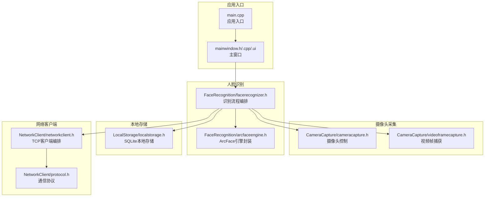
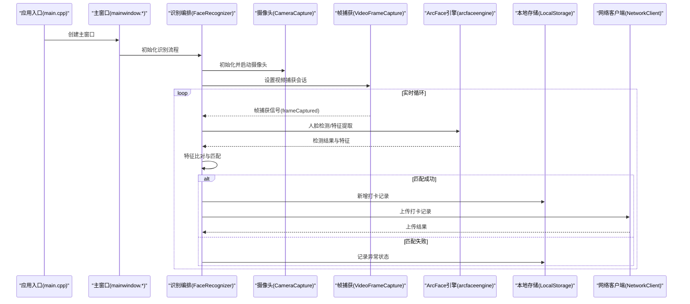
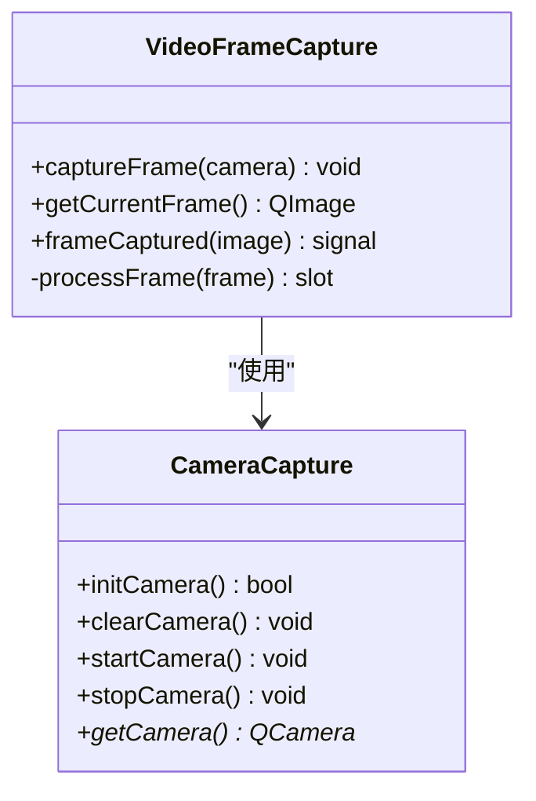
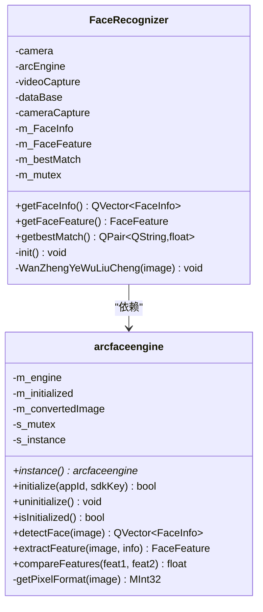
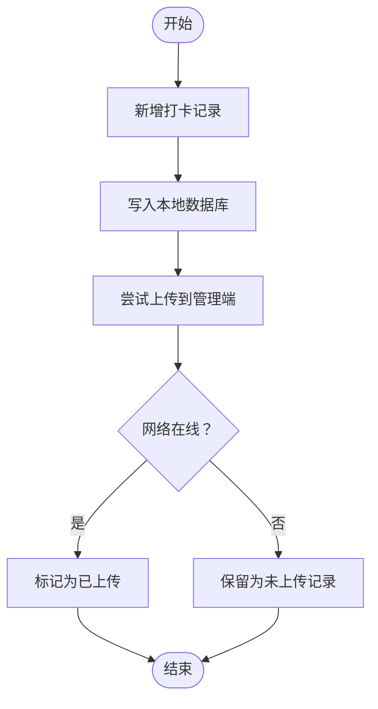
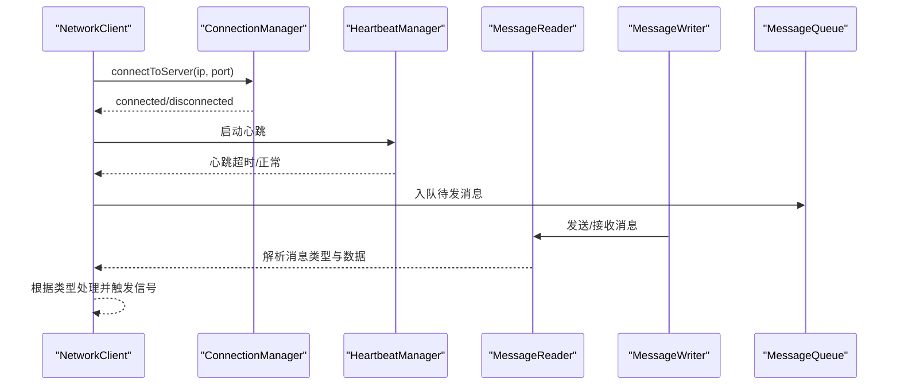
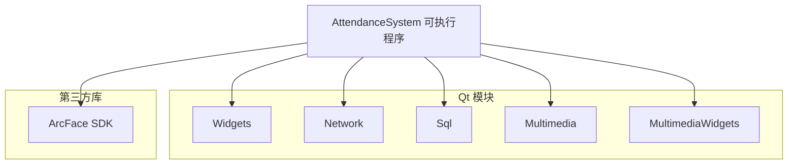

# 项目概述

<cite>
**本文引用的文件**
- [main.cpp](file://main.cpp)
- [mainwindow.h](file://mainwindow.h)
- [mainwindow.cpp](file://mainwindow.cpp)
- [mainwindow.ui](file://mainwindow.ui)
- [CMakeLists.txt](file://CMakeLists.txt)
- [AttendanceCheckClient开发文档.md](file://AttendanceCheckClient开发文档.md)
- [CameraCapture/cameracapture.h](file://CameraCapture/cameracapture.h)
- [CameraCapture/videoframecapture.h](file://CameraCapture/videoframecapture.h)
- [FaceRecognition/arcfaceengine.h](file://FaceRecognition/arcfaceengine.h)
- [FaceRecognition/facerecognizer.h](file://FaceRecognition/facerecognizer.h)
- [LocalStorage/localstorage.h](file://LocalStorage/localstorage.h)
- [NetworkClient/networkclient.h](file://NetworkClient/networkclient.h)
- [NetworkClient/protocol.h](file://NetworkClient/protocol.h)
</cite>

## 目录
1. [简介](#简介)
2. [项目结构](#项目结构)
3. [核心组件](#核心组件)
4. [架构总览](#架构总览)
5. [详细组件分析](#详细组件分析)
6. [依赖分析](#依赖分析)
7. [性能考虑](#性能考虑)
8. [故障排查指南](#故障排查指南)
9. [结论](#结论)
10. [附录](#附录)

## 简介
本项目是局域网智能考勤系统的“打卡端客户端”，部署于考勤现场，承担以下职责：
- 实时摄像头采集与人脸检测
- 本地人脸特征库比对与识别
- 本地数据库记录生成与持久化
- 通过 TCP 与管理端建立长连接，进行人员数据同步、打卡记录上传与设备状态上报
- 在网络断开时进行本地缓存与后续自动重传

系统采用 Qt 技术栈与 C++17 语言，结合 ArcFace 人脸识别引擎，实现稳定、可扩展且易于维护的桌面级智能考勤终端。

## 项目结构
项目采用模块化分层组织，核心模块包括：
- 摄像头采集模块：负责设备发现、打开、帧捕获与预览
- 人脸识别模块：封装 ArcFace 引擎，提供检测、特征提取与比对
- 本地存储模块：基于 SQLite 的本地数据库，支撑人员与打卡记录的持久化
- 网络客户端模块：负责 TCP 连接、心跳、消息编解码与队列管理
- 协议定义模块：统一消息类型与数据结构，保证通信一致性
- 主窗口与 UI：承载界面布局与状态展示

**图表来源**
- [main.cpp:1-28](file://main.cpp#L1-L28)
- [mainwindow.h:1-23](file://mainwindow.h#L1-L23)
- [mainwindow.cpp:1-14](file://mainwindow.cpp#L1-L14)
- [mainwindow.ui:1-24](file://mainwindow.ui#L1-L24)
- [CameraCapture/cameracapture.h:1-31](file://CameraCapture/cameracapture.h#L1-L31)
- [CameraCapture/videoframecapture.h:1-45](file://CameraCapture/videoframecapture.h#L1-L45)
- [FaceRecognition/arcfaceengine.h:1-115](file://FaceRecognition/arcfaceengine.h#L1-L115)
- [FaceRecognition/facerecognizer.h:1-61](file://FaceRecognition/facerecognizer.h#L1-L61)
- [LocalStorage/localstorage.h:1-49](file://LocalStorage/localstorage.h#L1-L49)
- [NetworkClient/networkclient.h:1-75](file://NetworkClient/networkclient.h#L1-L75)
- [NetworkClient/protocol.h:1-61](file://NetworkClient/protocol.h#L1-L61)

**章节来源**
- [CMakeLists.txt:1-87](file://CMakeLists.txt#L1-L87)
- [AttendanceCheckClient开发文档.md:107-121](file://AttendanceCheckClient开发文档.md#L107-L121)

## 核心组件
- 摄像头采集与帧处理：通过 Qt Multimedia 模块的摄像头与视频捕获接口，实现设备初始化、帧回调与图像输出，供人脸识别模块使用。
- 人脸识别引擎：以 ArcFace 引擎为核心，提供人脸检测、特征提取与相似度比对；采用单例模式确保全局唯一与线程安全。
- 识别流程编排：整合摄像头、帧转换、引擎与特征库，形成“检测-提取-比对-落库-上报”的闭环。
- 本地存储：提供人员同步、打卡记录新增、未上传记录查询与批量标记上传等能力，保障离线场景的数据完整性。
- 网络客户端：封装连接管理、心跳、消息读写与队列，负责与管理端的长连接维护与业务数据交互。
- 通信协议：统一消息类型与结构，支持人员同步、打卡上传、心跳与设备状态上报，便于扩展与维护。

**章节来源**
- [CameraCapture/cameracapture.h:1-31](file://CameraCapture/cameracapture.h#L1-L31)
- [CameraCapture/videoframecapture.h:1-45](file://CameraCapture/videoframecapture.h#L1-L45)
- [FaceRecognition/arcfaceengine.h:1-115](file://FaceRecognition/arcfaceengine.h#L1-L115)
- [FaceRecognition/facerecognizer.h:1-61](file://FaceRecognition/facerecognizer.h#L1-L61)
- [LocalStorage/localstorage.h:1-49](file://LocalStorage/localstorage.h#L1-L49)
- [NetworkClient/networkclient.h:1-75](file://NetworkClient/networkclient.h#L1-L75)
- [NetworkClient/protocol.h:1-61](file://NetworkClient/protocol.h#L1-L61)

## 架构总览
系统采用 C/S 局域网架构，打卡端作为客户端，管理端作为服务端。整体工作流如下：
- 启动阶段：初始化摄像头与人脸识别引擎，连接管理端并同步人员数据
- 运行阶段：持续采集视频帧，进行人脸检测与识别，识别成功则生成打卡记录并落库，尝试上传；若网络断开，则进入本地缓存等待重传
- 状态监控：通过心跳与状态上报，实时反馈网络与设备运行状态

**图表来源**
- [main.cpp:1-28](file://main.cpp#L1-L28)
- [mainwindow.h:1-23](file://mainwindow.h#L1-L23)
- [mainwindow.cpp:1-14](file://mainwindow.cpp#L1-L14)
- [FaceRecognition/facerecognizer.h:1-61](file://FaceRecognition/facerecognizer.h#L1-L61)
- [CameraCapture/cameracapture.h:1-31](file://CameraCapture/cameracapture.h#L1-L31)
- [CameraCapture/videoframecapture.h:1-45](file://CameraCapture/videoframecapture.h#L1-L45)
- [FaceRecognition/arcfaceengine.h:1-115](file://FaceRecognition/arcfaceengine.h#L1-L115)
- [LocalStorage/localstorage.h:1-49](file://LocalStorage/localstorage.h#L1-L49)
- [NetworkClient/networkclient.h:1-75](file://NetworkClient/networkclient.h#L1-L75)

## 详细组件分析

### 摄像头采集模块
- 职责：设备发现、初始化、启动/停止、释放；提供当前帧图像给上层识别流程
- 关键点：基于 Qt Multimedia 的 QCamera 与 QMediaCaptureSession，通过 QVideoSink 接收帧并转换为 QImage
- 适用场景：多摄像头环境下的设备选择与切换、低延迟帧捕获

**图表来源**
- [CameraCapture/cameracapture.h:1-31](file://CameraCapture/cameracapture.h#L1-L31)
- [CameraCapture/videoframecapture.h:1-45](file://CameraCapture/videoframecapture.h#L1-L45)

**章节来源**
- [CameraCapture/cameracapture.h:1-31](file://CameraCapture/cameracapture.h#L1-L31)
- [CameraCapture/videoframecapture.h:1-45](file://CameraCapture/videoframecapture.h#L1-L45)

### 人脸识别引擎与识别流程
- ArcFace 引擎封装：提供单例、初始化/反初始化、人脸检测、特征提取与相似度比对
- 识别流程编排：串联摄像头、帧捕获、引擎与特征库，形成“检测-提取-比对-落库-上报”的完整链路
- 复杂度与性能：检测与特征提取为 O(n) 与 O(d) 级别，相似度比对取决于特征维度与比对策略

**图表来源**
- [FaceRecognition/arcfaceengine.h:1-115](file://FaceRecognition/arcfaceengine.h#L1-L115)
- [FaceRecognition/facerecognizer.h:1-61](file://FaceRecognition/facerecognizer.h#L1-L61)

**章节来源**
- [FaceRecognition/arcfaceengine.h:1-115](file://FaceRecognition/arcfaceengine.h#L1-L115)
- [FaceRecognition/facerecognizer.h:1-61](file://FaceRecognition/facerecognizer.h#L1-L61)

### 本地存储模块
- 职责：连接数据库、人员同步（事务）、新增打卡记录、查询未上传记录、批量标记上传完成
- 数据一致性：通过事务与互斥锁保障并发安全；提供信号通知同步结果
- 与网络模块协作：在断网场景下暂存未上传记录，网络恢复后自动重试

**图表来源**
- [LocalStorage/localstorage.h:1-49](file://LocalStorage/localstorage.h#L1-L49)
- [NetworkClient/networkclient.h:1-75](file://NetworkClient/networkclient.h#L1-L75)

**章节来源**
- [LocalStorage/localstorage.h:1-49](file://LocalStorage/localstorage.h#L1-L49)

### 网络客户端与通信协议
- 网络客户端：封装连接管理、心跳、消息读写与队列，负责与管理端的长连接维护与业务数据交互
- 通信协议：定义消息类型（心跳、人员同步请求/响应、打卡上传、上传响应、设备状态），并提供序列化/反序列化
- 业务流程：启动后连接管理端，请求同步人员数据；识别成功后上传打卡记录；周期性心跳维持连接

**图表来源**
- [NetworkClient/networkclient.h:1-75](file://NetworkClient/networkclient.h#L1-L75)
- [NetworkClient/protocol.h:1-61](file://NetworkClient/protocol.h#L1-L61)

**章节来源**
- [NetworkClient/networkclient.h:1-75](file://NetworkClient/networkclient.h#L1-L75)
- [NetworkClient/protocol.h:1-61](file://NetworkClient/protocol.h#L1-L61)

### 应用入口与主窗口
- 应用入口：创建 Qt 应用与主窗口，进入事件循环
- 主窗口：基于 UI 文件生成，承载界面布局与状态栏

**图表来源**
- [main.cpp:1-28](file://main.cpp#L1-L28)
- [mainwindow.h:1-23](file://mainwindow.h#L1-L23)
- [mainwindow.cpp:1-14](file://mainwindow.cpp#L1-L14)
- [mainwindow.ui:1-24](file://mainwindow.ui#L1-L24)

**章节来源**
- [main.cpp:1-28](file://main.cpp#L1-L28)
- [mainwindow.h:1-23](file://mainwindow.h#L1-L23)
- [mainwindow.cpp:1-14](file://mainwindow.cpp#L1-L14)
- [mainwindow.ui:1-24](file://mainwindow.ui#L1-L24)

## 依赖分析
- 构建工具与语言标准：CMake、C++17
- Qt 模块：Widgets、Network、Sql、Multimedia、MultimediaWidgets
- 人脸识别引擎：ArcFace SDK（通过第三方目录引入）
- 数据库：SQLite3（Qt Sql 模块）

**图表来源**
- [CMakeLists.txt:16-82](file://CMakeLists.txt#L16-L82)

**章节来源**
- [CMakeLists.txt:1-87](file://CMakeLists.txt#L1-L87)

## 性能考虑
- 图像处理与识别：尽量在非 UI 线程执行，避免阻塞界面；合理设置帧率与分辨率，平衡识别精度与性能
- 数据库访问：批量插入与查询时使用事务；为常用查询字段建立索引；避免频繁 IO
- 网络传输：压缩数据结构、合并小消息、合理的心跳间隔；在网络抖动环境下采用指数退避重试
- 内存管理：及时释放摄像头与图像资源；ArcFace 引擎生命周期管理；避免重复转换像素格式

## 故障排查指南
- 无法启动摄像头
  - 检查设备权限与驱动；确认摄像头枚举与初始化流程
  - 参考：[CameraCapture/cameracapture.h:1-31](file://CameraCapture/cameracapture.h#L1-L31)
- 人脸识别失败或误识别
  - 核对 ArcFace 引擎初始化参数与模型文件；检查特征提取与比对阈值
  - 参考：[FaceRecognition/arcfaceengine.h:1-115](file://FaceRecognition/arcfaceengine.h#L1-L115)
- 本地记录未上传
  - 检查网络状态与心跳；确认未上传记录查询与批量标记逻辑
  - 参考：[LocalStorage/localstorage.h:1-49](file://LocalStorage/localstorage.h#L1-L49)，[NetworkClient/networkclient.h:1-75](file://NetworkClient/networkclient.h#L1-L75)
- 断网后无法恢复
  - 检查重连策略与消息队列；确保网络状态信号正确传播
  - 参考：[NetworkClient/networkclient.h:1-75](file://NetworkClient/networkclient.h#L1-L75)

**章节来源**
- [CameraCapture/cameracapture.h:1-31](file://CameraCapture/cameracapture.h#L1-L31)
- [FaceRecognition/arcfaceengine.h:1-115](file://FaceRecognition/arcfaceengine.h#L1-L115)
- [LocalStorage/localstorage.h:1-49](file://LocalStorage/localstorage.h#L1-L49)
- [NetworkClient/networkclient.h:1-75](file://NetworkClient/networkclient.h#L1-L75)

## 结论
本项目以 Qt 与 C++17 为基础，结合 ArcFace 人脸识别引擎，构建了面向局域网的智能考勤打卡端。通过模块化设计与清晰的职责划分，系统实现了从摄像头采集、人脸识别、本地存储到网络通信的全链路能力。其单例化的引擎封装、事务化的本地存储与心跳驱动的网络管理，共同保障了在复杂现场环境下的稳定性与可维护性。

## 附录
- 术语说明
  - 识别流程：从摄像头采集到最终打卡记录生成与上传的完整过程
  - 未上传记录：网络断开时暂存在本地数据库的打卡记录
  - 心跳机制：维持 TCP 长连接活跃度，检测连接状态
- 实际应用场景示例
  - 考勤现场部署：在固定工位或通道口部署打卡端，实现无人值守的高效考勤
  - 断网容错：网络短暂中断后自动缓存记录，恢复后自动补传，确保数据不丢失
  - 人员同步：首次连接或定期从管理端拉取最新人员信息，保障识别库的时效性