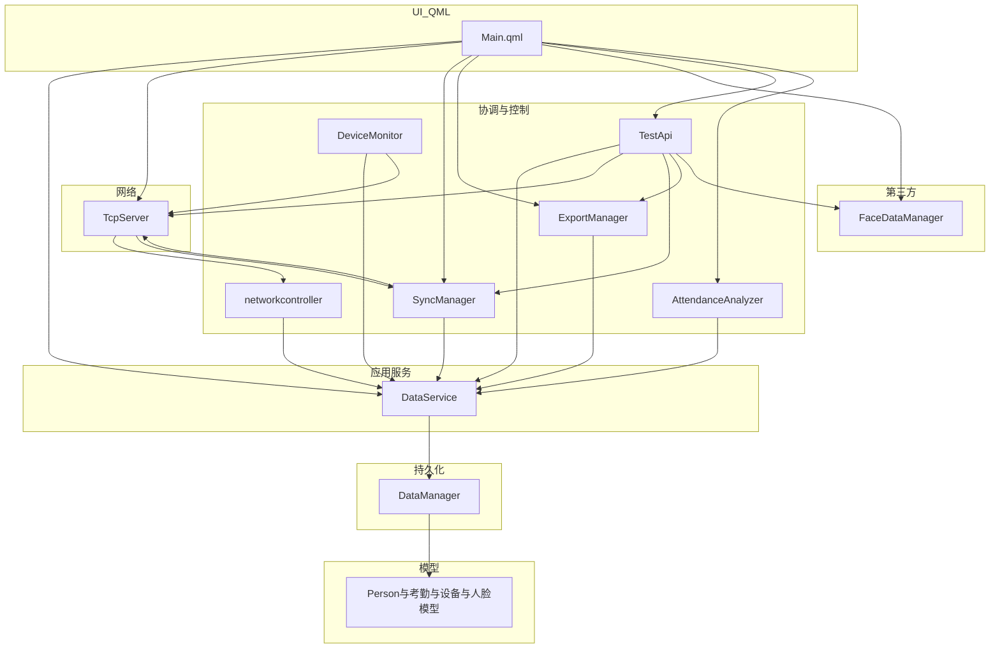
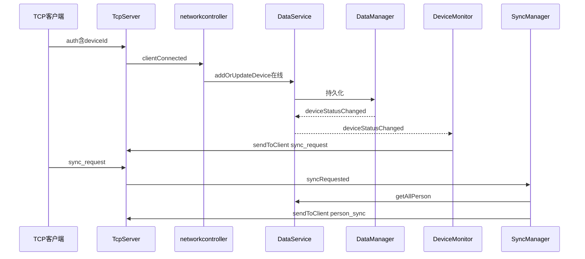

# AttendanceServer 项目说明

本文档说明本仓库的模块划分、主要类职责、分层调用关系以及典型业务流程。结构以 `[main.cpp](../main.cpp)` 中的对象装配与 `[CMakeLists.txt](../CMakeLists.txt)` 中的源码清单为准。

---

## 1. 项目概述与技术栈

**用途**：考勤服务端程序。在本机监听 TCP 端口（默认 **8080**），接收考勤终端或其它客户端按行发送的 JSON 消息；校验后将人员、设备、考勤记录、人脸特征等数据持久化到 SQL 数据库；同时提供基于 Qt Quick 的 QML **测试工作台**，并集成 ArcSoft 人脸引擎用于人脸检测与特征提取。

**技术栈**：

- Qt 6（Quick / QML、Core、Gui、**Network**、**Sql**、Widgets）
- CMake 构建
- 数据库：通过 `QSqlDatabase` 连接（`main.cpp` 中示例为 MySQL：`localhost` / `textAttendance` / `root` / `root`）
- 第三方：`src/third_party/arcface`，由 `[FaceDataManager](../src/FaceDataManager/facedatamanager.h)` 封装调用

---

## 2. 模块一览（按源码目录）

| 目录                                                    | 主要职责                                                                                                        |
| ----------------------------------------------------- | ----------------------------------------------------------------------------------------------------------- |
| `[src/TcpServer](../src/TcpServer)`                   | `**TcpServer`**：`QTcpServer` 监听、`QTcpSocket` 管理、按换行符切分 JSON、设备认证与心跳、业务信号分发                                  |
| `[src/Protocol](../src/Protocol)`                     | `**Protocol` 命名空间**（`[protocol.h](../src/Protocol/protocol.h)`）：消息 `type` 与常用字段名常量，不是类模块                    |
| `[src/Controllers](../src/Controllers)`               | `**networkcontroller`**：订阅 `TcpServer` 信号，将连接/考勤/设备状态写入 `**DataService**`（类名为小写，与源码一致）                      |
| `[src/Services](../src/Services)`                     | `**DataService**`：面向 QML 与上层的 `Q_INVOKABLE` API、入参校验，内部委托 `**DataManager**`，并转发部分数据库信号                      |
| `[src/DataManager](../src/DataManager)`               | `**DataManager**`：数据库连接、建表、CRUD、发出 `operationResult`、`deviceStatusChanged` 等信号                              |
| `[src/Models](../src/Models)`                         | `**Person**`、`**AttendanceRecord**`、`**Device**`、`**FaceData**`：`QObject` + `Q_PROPERTY`，用于查询结果与 QML 交互     |
| `[src/SyncManager](../src/SyncManager)`               | `**SyncManager**`：响应同步请求，从数据库拉取全部人员，通过 TCP 下发 `**person_sync**`                                             |
| `[src/DeviceMonitor](../src/DeviceMonitor)`           | `**DeviceMonitor**`：监听 `**DataService::deviceStatusChanged**`，当状态为 `**online**` 时向对应设备发送 `**sync_request**` |
| `[src/ExportManager](../src/ExportManager)`           | `**ExportManager**`：基于 `**DataService**` 查询结果导出 CSV（考勤 / 人员 / 设备）                                           |
| `[src/AttendanceAnalyzer](../src/AttendanceAnalyzer)` | `**AttendanceAnalyzer**`：基于 `**DataService**` 做按日 / 按人 / 按部门等统计，返回 `QJsonArray`                             |
| `[src/FaceDataManager](../src/FaceDataManager)`       | `**FaceDataManager**`：ArcSoft 引擎生命周期、人脸检测与特征提取                                                              |
| `[src/TestApi](../src/TestApi)`                       | `**TestApi**`：供 QML 调试的聚合入口（人脸引擎、Base64 特征、TCP 发送、触发同步、人脸库 CRUD 等）                                          |
| `[ui](../ui/Main.qml)`                                | `**Main.qml**`：主界面；通过 `QQmlContext::setContextProperty` 注入 C++ 单例                                           |

---

## 3. 主要类与调用层级

本项目几乎没有「深层继承树」，而是以 **组合 + Qt 信号槽** 为主。下面用 **分层** 描述谁调用谁、谁监听谁。

### 3.1 分层依赖示意

### 3.2 要点说明

- **UI → `DataService`**：`Main.qml` 直接调用人员、考勤、设备、人脸等 `Q_INVOKABLE` 方法；`DataService` 统一转调 `**DataManager**`。
- `**TcpServer` → `networkcontroller**`：连接 `clientConnected`、`clientDisconnected`、`attendanceRecordReceived`、`deviceStatusReceived`，在槽函数中调用 `**DataService**` 完成落库或更新状态。
- `**TcpServer` → `SyncManager**`：收到已认证客户端发来的 `**sync_request**`（见 `[Protocol::kSyncRequest](../src/Protocol/protocol.h)`）时发出 `syncRequested`；`SyncManager` 查询全员 `**Person**`，再调用 `**TcpServer::sendToClient**` 发送 `**person_sync**`。
- **设备在线 → 触发同步**：`DataManager` 在设备状态变更时发出 `deviceStatusChanged` → `**DataService`** 原样转发 → `**DeviceMonitor**` 在状态为 `**online**` 时调用 `**TcpServer::sendToClient**` 下发 `**sync_request**`（与客户端协议配合，形成「上线即提醒同步」的策略）。
- `**FaceDataManager**`：可由 QML 直接使用；`**TestApi**` 在此基础上封装 Base64、选图等调试接口，并持有 `**DataService**`、`TcpServer`、`SyncManager` 等指针。
- `**AttendanceAnalyzer` / `ExportManager**`：仅依赖 `**DataService**`，不直接操作 `**TcpServer**`。
- `**DeviceMonitor**`：在 `[main.cpp](../main.cpp)` 中**未**注册到 QML，仅在后台运行。

---

## 4. 工作流程（典型场景）

### 4.1 应用启动顺序

对应 `[main.cpp](../main.cpp)`：

1. 构造 `**TcpServer`**、`**DataManager**`、`**DataService(&dataManager)**`。
2. 构造 `**DeviceMonitor(&tcpServer, &dataService)**`、`**ExportManager**`、`**FaceDataManager**`、`**AttendanceAnalyzer(&dataService)**`。
3. 调用 `**dataManager.initialize(...)**` 连接数据库并建表。
4. 构造 `**networkcontroller(&tcpServer, &dataService)**`、`**SyncManager(&tcpServer, &dataService)**`、`**TestApi(...)**`。
5. `**tcpServer.startServer(8080)**`。
6. `**QQmlApplicationEngine**`：向根上下文注册 `tcpServer`、`dataManager`、`dataService`、`exportManager`、`syncManager`、`faceDataManager`、`testApi`、`attendanceAnalyzer`，加载模块 `**AttendanceServer**` 中的 `**Main**` QML。

### 4.2 设备连接与人员同步（示意）

**文字摘要**：

1. 客户端发送 `**auth`**，`[TcpServer::processMessage](../src/TcpServer/tcpserver.cpp)` 记录 `deviceId`、加入 `m_deviceMap`，并 `**emit clientConnected**`。
2. `**networkcontroller::onClientConnected**` 在数据库已连接时调用 `**DataService::addOrUpdateDevice**`，将设备标为在线等。
3. 数据库层状态变化经 `**DataService::deviceStatusChanged**` 到达 `**DeviceMonitor**`；若状态为 `**online**`，向该设备发送 `**sync_request**`（`type` 字段与 `[Protocol](../src/Protocol/protocol.h)` 一致）。
4. 客户端收到后可上行 `**sync_request**`；`**SyncManager**` 组装全员列表 JSON，`**type**` 为 `**person_sync**`，发回该设备。

### 4.3 考勤记录上报

1. 已认证客户端发送 `**attendance_record**`（单行 JSON + `\n`）。
2. `**TcpServer**` 发出 `**attendanceRecordReceived**`。
3. `**networkcontroller::onAttendanceRecordReceived**` 校验 `type`、`employeeId`、`checkTime`（ISO8601），确认员工存在于库中后，调用 `**DataService::addAttendanceRecord**`（含 `deviceId`、状态等；状态字段与客户端 JSON 约定一致，实现中见控制器内对 `Protocol::kStatus` 的读取）。

### 4.4 设备状态上报

已认证客户端发送 `**device_status**` → `**deviceStatusReceived**` → `**networkcontroller::onDeviceStatusReceiced**` 校验后，通过 `**addOrUpdateDevice**` 或 `**updateDeviceStatus**` 更新库中设备信息。

### 4.5 QML 测试工作台与调试

- 日常数据操作：主要通过 `**dataService**`、`**dataManager**`。
- 导出： `**exportManager**`。
- 统计： `**attendanceAnalyzer**`（如 `dailySummary` 等）。
- 网络测试： `**tcpServer**`、`**syncManager**`、`**testApi**`。
- 人脸： `**faceDataManager**` 与 `**testApi**`（引擎初始化、Base64 特征提取与人脸库操作等）。

协议中的消息类型与字段名均以 `[src/Protocol/protocol.h](../src/Protocol/protocol.h)` 为准，此处不重复罗列。

---

## 5. 数据库与模型对应关系（简述）

`**DataManager**` 在初始化时创建（若不存在）主要表：

| 表名                        | 用途概要                |
| ------------------------- | ------------------- |
| `Person`                  | 人员基本信息              |
| `AttendanceRecord`        | 考勤流水                |
| `AttendanceRecordArchive` | 考勤归档（与历史/归档策略相关）    |
| `Device`                  | 设备标识、IP、在线状态等       |
| `face_data`               | 与人脸特征向量相关的记录（与员工关联） |

运行时查询返回的 `**QObject***` 多为 `**Person**`、`**AttendanceRecord**`、`**Device**`、`**FaceData**` 实例，供 QML 绑定或在使用完毕后按约定释放（部分路径使用 `qDeleteAll` 管理临时列表）。

---

## 6. 延伸阅读

- 入口与依赖注入：`[main.cpp](../main.cpp)`
- TCP 消息分支：`TcpServer::processMessage`（`[tcpserver.cpp](../src/TcpServer/tcpserver.cpp)`）
- 常量定义：`[protocol.h](../src/Protocol/protocol.h)`

