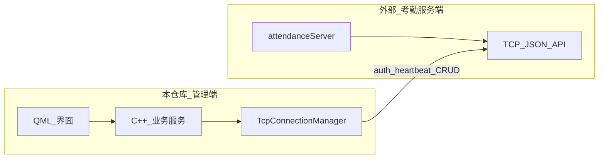
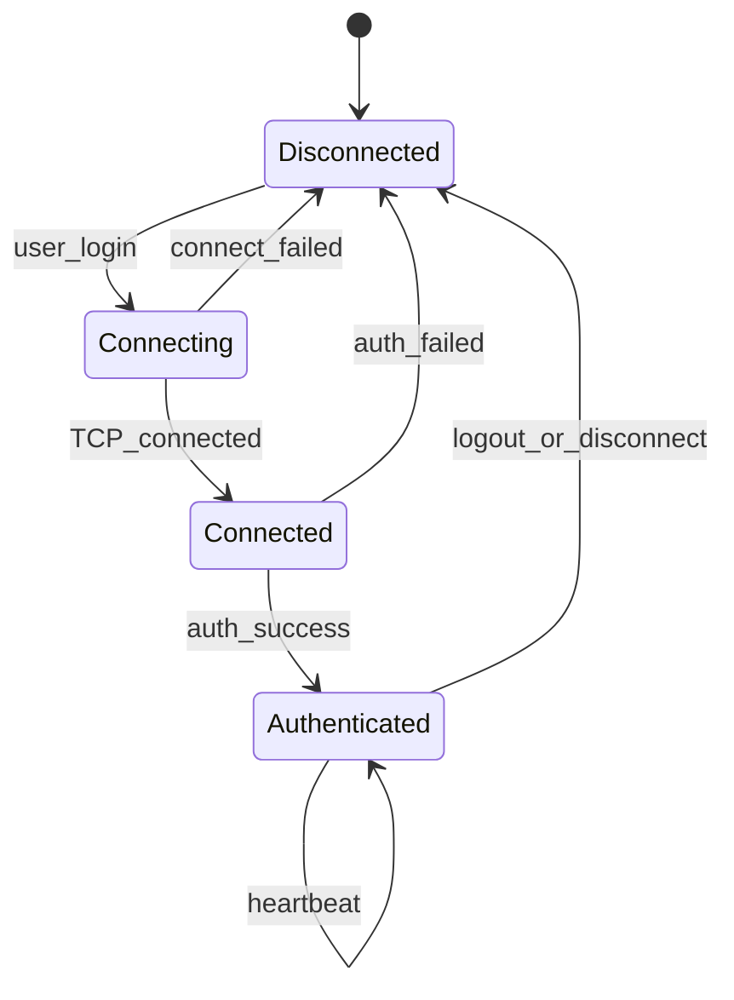

# 考勤系统管理端 — 界面开发规划文档

> **版本**：v1.2  
> **日期**：2026-05-18  
> **项目定位**：本仓库为 **考勤系统管理端**（Admin Client），非考勤服务端  
> **产品名称**：AttendanceAdmin（CMake 工程名 / 可执行程序名）  
> **协议参考**：[管理端开发指导文档.md](./管理端开发指导文档.md)（描述管理端与 **attendanceServer** 的通信协议）

---

## 目录

1. [文档目的](#1-文档目的)
2. [项目现状分析](#2-项目现状分析)
3. [设计目标与原则](#3-设计目标与原则)（含 [§3.3 权限驱动界面规范](#33-权限驱动界面规范)）
4. [信息架构与导航](#4-信息架构与导航)
5. [全局壳层设计](#5-全局壳层设计)
6. [页面级 UI 规格](#6-页面级-ui-规格)
7. [技术实施方案](#7-技术实施方案)
8. [API 与页面对照表](#8-api-与页面对照表)
9. [分阶段实施计划](#9-分阶段实施计划)
10. [组件与文件清单](#10-组件与文件清单)
11. [风险与依赖](#11-风险与依赖)
12. [验收标准](#12-验收标准)（含 [§12.6 权限驱动 UI](#126-权限驱动-ui)）
- [附录 D — 界面控件权限矩阵](#附录-d--界面控件权限矩阵)

---

## 1. 文档目的

本文档用于指导 **本仓库（考勤系统管理端）** UI 的后续开发，明确：

- 当前代码与 API 文档之间的差距；
- 信息架构、页面布局与交互规范；
- C++ 服务层与 QML 页面的绑定关系；
- 分阶段任务、工期估算与验收标准；
- **权限驱动界面**：不同角色可见导航与操作、无权限控件隐藏（[§3.3](#33-权限驱动界面规范)）。

**本文档阶段不包含代码实现**，仅作为设计与排期依据。实施时以本文档与《管理端开发指导文档》为准。

---

## 2. 项目现状分析

### 2.1 项目定位

**本仓库即考勤系统的管理端（Admin Client）**，面向人事、设备、考勤审核等运维人员，通过桌面客户端连接远端 **attendanceServer** 完成人员、设备、考勤、人脸、账号与权限等管理操作。仓库目录名可能为 `AttendanceServer`，与后端服务进程名相近，但 **代码范围仅包含管理端**；服务端实现、部署与运维不在本文档范围内。

| 维度 | 说明 |
|------|------|
| **项目角色** | 管理端（Admin Client）— 本仓库全部开发对象 |
| **产品/程序名** | AttendanceAdmin（窗口标题「考勤管理端」；CMake `project(AttendanceAdmin)`） |
| **技术栈** | Qt 6.8+、Qt Quick、Fusion 控件、浅色主题 |
| **对外依赖** | 已部署的 **attendanceServer**（TCP 服务，协议见《管理端开发指导文档》） |
| **通信方式** | TCP 长连接，JSON 行分帧（`\n` 结尾），首包 `auth` 认证后心跳保活 |
| **职责边界** | 本项目管理端 UI、本地配置、协议客户端；**不包含** 考勤服务端业务逻辑与数据库 |



**与后端的关系**：管理端为纯客户端；开发、联调、验收均以「管理端 ↔ attendanceServer」的协议交互为准，勿将本仓库当作服务端工程规划。

### 2.2 已有资产

#### 2.2.1 应用壳层与导航

| 文件 | 状态 | 说明 |
|------|------|------|
| `ui/Main.qml` | 已完成布局 | 侧栏 + 主内容 Stack + 底部日志面板 |
| `ui/components/SideBar.qml` | 可用 | 分组导航 |
| `ui/components/StatusBar.qml` | 待增强 | 仅展示 Logger 文案，未绑定连接/登录态 |
| `ui/components/LogPanel.qml` | 可用 | 底部可伸缩日志区 |

当前导航（7 项）：

- 仪表盘、人员管理、设备管理、考勤记录、人脸库、调用历史、配置预设

#### 2.2.2 设计系统

| 文件 | 说明 |
|------|------|
| `ui/theme/Theme.qml` | 色板、间距、字号、状态色函数 `statusColor()` |
| `ui/components/Card.qml` | 卡片容器 |
| `ui/components/DataTable.qml` | 数据表格 |
| `ui/components/LabeledField.qml` | 标签 + 输入控件 |
| `ui/components/ToolBarRow.qml` | 页标题 + 副标题 + 操作区 |
| `ui/components/ConfirmDialog.qml` | 确认对话框 |
| `ui/components/JsonEditor.qml` / `JsonViewer.qml` | JSON 编辑/查看（可用于设备指令等） |
| `ui/components/BadgeStatus.qml` | 状态徽章 |

全局样式：`main.cpp` 中 `QT_QUICK_CONTROLS_STYLE=Fusion`，`ColorScheme::Light`。

#### 2.2.3 单例模型（QML）

| 单例 | 文件 | 功能 |
|------|------|------|
| Logger | `ui/models/Logger.qml` | 运行日志、最近错误/信息 |
| History | `ui/models/History.qml` | 调用历史 ListModel |
| Presets | `ui/models/Presets.qml` | QSettings 持久化：服务器地址、端口、默认筛选值 |

#### 2.2.4 C++ 基础设施与业务服务

| 模块 | 路径 | 状态 |
|------|------|------|
| 协议常量 | `src/Protocol/protocol.h` | 完整 |
| TCP 连接 | `src/Network/TcpConnectionManager.{h,cpp}` | 已实现：连接、认证、心跳、重连、请求超时 |
| 会话管理 | `src/Auth/SessionManager.{h,cpp}` | 已实现：`login` / `logout` / `hasPermission` |
| 人员服务 | `src/Person/PersonServer.{h,cpp}` | 已实现 CRUD |
| 考勤服务 | `src/Attendance/AttendanceService.{h,cpp}` | 已实现实时 + 归档 API |
| 人脸服务 | `src/Face/FaceServer.{h,cpp}` | 已实现查询/注册/删除 |
| RBAC 服务 | `src/Rbac/RbacServer.{h,cpp}` | 已实现角色/权限/用户角色 |
| 事件订阅 | `src/Event/EventSubscriptionService.{h,cpp}` | 已实现订阅与推送信号 |
| 设备服务 | — | **未实现**（仅有 protocol 常量） |
| 用户账号服务 | — | **未实现**（仅有 protocol 常量） |
| 数据模型 | `src/Models/*` | Person、Device、AttendanceRecord、FaceData 等 |

#### 2.2.5 页面骨架（QML）

| 页面 | 文件 | UI 骨架 | 业务绑定 |
|------|------|---------|----------|
| 仪表盘 | `ui/pages/PageDashboard.qml` | 有 | 占位（离线状态、无真实指标） |
| 人员管理 | `ui/pages/PagePerson.qml` | 有 | **全部 TODO** |
| 设备管理 | `ui/pages/PageDevice.qml` | 有 | **全部 TODO** |
| 考勤记录 | `ui/pages/PageAttendance.qml` | 有 | **全部 TODO** |
| 人脸库 | `ui/pages/PageFace.qml` | 有 | **全部 TODO** |
| 调用历史 | `ui/pages/PageHistory.qml` | 有 | 仅本地 History，未接 TCP 自动记录 |
| 配置预设 | `ui/pages/PageSettings.qml` | 有 | Presets 读写可用，**无登录/连接操作** |

### 2.3 关键断点（阻塞项）

1. **QML 未接入 C++ 服务**  
   `main.cpp` 仅通过 `engine.setInitialProperties` 注入 `sessionManager`、`tcpManager`，未注入 PersonServer 等；QML 中无任何 `sessionManager` / `personServer` 引用。

2. **无登录界面**  
   用户无法触发 `SessionManager.login()`；应用启动后处于未认证状态，所有业务 API 将被服务端拒绝（错误码 2001）。

3. **配置端口不一致**  
   - `Presets.serverPort` 默认：**8080**  
   - `TcpConnectionManager::ConnectionConfig::port` 默认：**9527**  
   实施时需与服务端实际端口统一。

4. **API 覆盖缺口**  
   对照《管理端开发指导文档》，以下能力尚无对应页面或服务：

   | 文档章节 | 能力 | 页面 | C++ Service |
   |----------|------|------|-------------|
   | §7 | 考勤归档 | 无独立 Tab | AttendanceService 已有 API |
   | §9 | 用户账号 | 无 | 待建 UserServer |
   | §12–14 | RBAC | 无 | RbacServer 已有 |
   | §15 | 设备指令 | 无 | 待建 DeviceServer 扩展 |
   | §16 | 事件订阅/推送 | 无 | EventSubscriptionService 已有 |

5. **业务页占位实现**  
   各页按钮当前仅 `Logger.info("TODO: xxx via TCP")`，不产生真实网络请求。

6. **权限驱动 UI 未落地**  
   `SessionManager.hasPermission` / `refreshPermissions` / `permission.self` 热更新已在 C++ 实现，但 QML 未绑定 `sessionManager`，无 `PermissionCatalog`、`PermissionButton` 及导航过滤（见 [§3.3](#33-权限驱动界面规范)）。

---

## 3. 设计目标与原则

### 3.1 目标用户

| 角色 | 典型操作 |
|------|----------|
| super_admin | 全部功能、角色与用户管理 |
| hr_admin | 人员、考勤、归档、人脸 |
| device_admin | 设备 CRUD、设备指令、事件订阅 |
| attendance_auditor | 考勤查询与修改、归档查询 |
| viewer | 只读查询 |

权限清单见《管理端开发指导文档》§18（共 23 项权限 key）。

### 3.2 设计原则

1. **一致性**：延续现有浅色企业后台风格（`Theme` + Fusion），不引入第二套视觉语言。  
2. **表格 + 表单**：列表页 = 筛选区 + 工具栏 + `DataTable`；编辑通过行点击回填表单或对话框。  
3. **权限驱动 UI**：遵循 [§3.3 权限驱动界面规范](#33-权限驱动界面规范)；无权限操作 **隐藏**，操作前二次校验，权限变更后界面自动同步。  
4. **可观测性**：每次 API 调用写入 `History`；结果写入 `Logger`；TCP 收发建议自动记录。  
5. **防重复提交**：各 Service 的 `busy` 属性绑定全局或页面级 Busy 遮罩。  
6. **安全交互**：删除、覆盖人脸、重置密码等使用 `ConfirmDialog`；密码强度提示对照文档 §9。

### 3.3 权限驱动界面规范

管理端采用 **RBAC + 细粒度 permission key**（共 23 项，见《管理端开发指导文档》§18）。界面必须做到：**不同权限用户仅能看到并操作与其权限匹配的功能；无权限的操作默认隐藏，不展示为不可点按钮。**

#### 3.3.1 权限数据来源

| 数据 | 来源 | QML 访问 |
|------|------|----------|
| 是否已登录 | `auth` 成功 | `sessionManager.isLoggedIn` |
| 角色列表 | `auth_response.data.roles` | `sessionManager.roles` |
| 权限列表 | `auth_response.data.permissions`（多角色并集） | `sessionManager.permissions` |
| 单权限判断 | 客户端缓存 | `sessionManager.hasPermission("person.create")` |
| 角色判断 | 客户端缓存 | `sessionManager.hasRole("super_admin")` |
| 热更新 | 服务端推送或 `permission.self` | `permissionsChanged` 信号 → 绑定自动刷新 |

**角色管理类操作**（`role.*`、`user.role.assign` / `user.role.revoke`）按协议检查 **`super_admin` 角色**，不单用 permission key（见指导文档 §18.3）。

> **实现状态**：C++ 层 `SessionManager` 已具备上述 API；QML 绑定与控件矩阵在 **Phase 0 注入 sessionManager** 后、于 **Phase 2** 按本章与 [附录 D](#附录-d--界面控件权限矩阵) 落地。

#### 3.3.2 显示策略（强制）

| 场景 | 策略 | 说明 |
|------|------|------|
| 侧栏导航项 | **`visible: false`（隐藏）** | 用户无该模块读权限时，整项不显示 |
| 工具栏写操作（新增/修改/删除/注册/订阅等） | **隐藏** | 无对应 `*.create` / `*.update` / `*.delete` / `*.register` 时不渲染按钮 |
| 只读页内「查询」「刷新」「清空表单」 | **隐藏** | 无 `*.read` 时隐藏；有 read 无 write 时仅显示查询类 |
| 列表行内操作（编辑/删除） | **隐藏** | 无 `*.update` / `*.delete` 时不显示行操作列或按钮 |
| 表单输入区 | **只读或隐藏写入口** | `viewer`：筛选 + 查询可用，表单 `readOnly: true`，不显示提交类按钮 |
| 误触兜底（极少数） | `enabled: false` + Tooltip | 仅用于特殊说明场景；**默认不用灰显代替隐藏** |

> **原则**：用户不应看到大量灰色不可点按钮；应理解为「没有这个菜单/按钮」，而非「功能坏了」。

#### 3.3.3 操作前二次校验

所有会触发 TCP 写请求或敏感操作的流程：

```text
onClicked → sessionManager.isLoggedIn?
         → sessionManager.hasPermission(requiredKey)?  // 或 hasRole
         → 否：PermissionDeniedDialog + Logger.warn，不发请求
         → 是：ConfirmDialog（若属敏感操作）→ xxxServer API
         → 服务端 code 3001：统一文案「权限不足」
```

客户端校验为体验层；**服务端 3001 为最终权威**。

#### 3.3.4 权限热更新与界面同步

- 登录后缓存 `permissions`；`SessionManager` 收到 `permission.self.response` 时更新并 `emit permissionsChanged()`。
- 所有 `visible` / `enabled` 绑定必须直接或间接依赖 `sessionManager.permissions` 或 `hasPermission()`，**禁止**在 `Component.onCompleted` 里写死一次判断。
- 管理员在 `PageRbac` 修改**当前在线用户**角色后，服务端推送新权限集；界面应在数秒内自动隐藏/显示相关按钮，**无需重启应用**。
- 设置页提供「刷新权限」，调用 `sessionManager.refreshPermissions()`。

#### 3.3.5 权限状态反馈

| 位置 | 内容 |
|------|------|
| StatusBar | 工号 + 角色（`roles.join(", ")`） |
| 仪表盘 | 权限摘要卡片：角色名、权限数量、可管理模块列表 |
| 连接与预设 | 可折叠展示完整 `permissions` 列表 |
| 越权尝试 | `PermissionDeniedDialog`：说明缺少的 permission key 及联系管理员 |

#### 3.3.6 预置角色可见范围（摘要）

| 角色 | 侧栏可见（典型） | 页内写操作 |
|------|------------------|------------|
| super_admin | 全部导航含「账号与权限」 | 全部 |
| hr_admin | 总览、人员、考勤、人脸、事件；无设备/用户/RBAC | 人员/考勤/人脸写；归档删若有权限 |
| device_admin | 总览、设备、事件 | 设备 CRUD + 指令 |
| attendance_auditor | 总览、人员(只读)、考勤、事件 | 考勤改；归档查；人员无增删改 |
| viewer | 有 `*.read` 的数据页 | **仅查询**，无任何写按钮 |

完整控件级矩阵见 [附录 D](#附录-d--界面控件权限矩阵)。

---

## 4. 信息架构与导航

### 4.1 目标导航结构

在现有 `Main.qml` `navItems` 基础上扩展为：

```text
总览
  └─ 仪表盘                 [增强] 连接状态、权限摘要、最近推送

数据管理
  ├─ 人员管理               [打通] PersonServer
  ├─ 设备管理               [新建 Service + 打通]
  ├─ 考勤记录               [打通] 含 Tab：实时记录 / 归档
  └─ 人脸库                 [打通] FaceServer + 本地选图注册

账号与权限                  [新建分组]
  ├─ 用户账号               [新建] UserServer + PageUser
  └─ 角色权限               [新建] PageRbac

系统
  ├─ 事件中心               [新建] 订阅与推送流水
  ├─ 调用历史               [增强] TCP 自动记录
  └─ 连接与预设             [改造] 原「配置预设」+ 登录/登出
```

#### 4.1.1 导航项可见性规则

| nav key | 显示条件 | 无权限时 |
|---------|----------|----------|
| dashboard | 已登录 | 隐藏 |
| person | `person.read` | 隐藏整项 |
| device | `device.read` | 隐藏 |
| attendance | `attendance.read` 或 `attendance.archive.read` | 隐藏 |
| face | `face.read` | 隐藏 |
| user | `user.read` | 隐藏 |
| rbac | `hasRole("super_admin")` | 隐藏 |
| events | `event.subscribe` | 隐藏 |
| history | 已登录 | 显示（审计只读） |
| settings | 已登录 | 显示 |

**实现**：`Main.qml` 使用 `PermissionCatalog.filteredNavItems(sessionManager)` 作为 `SideBar.items`，勿维护多份 nav 列表。若过滤后当前页不可访问，自动跳转至仪表盘。

### 4.2 登录与连接状态机



**规则（来自协议文档）**：

- 连接后首条消息必须为 `auth`，否则业务消息返回 `2001 未认证`。  
- 连续 5 次认证失败锁定 15 分钟。  
- 认证成功后按 `heartbeatSec` 发送心跳，超时断开。

### 4.3 未登录时的 UX

- 应用启动：若 `!sessionManager.isLoggedIn`，显示全屏或模态 **登录对话框**。  
- 已登录：主界面可用；侧栏底部提供「退出登录」。  
- 连接断开：StatusBar 显示 offline；可选自动重连（TcpConnectionManager 已具备重连逻辑，UI 需展示状态）。

---

## 5. 全局壳层设计

### 5.1 StatusBar（改造 `ui/components/StatusBar.qml`）

| 区域 | 内容 |
|------|------|
| 左侧 | 应用名「考勤管理端」 |
| 中部 | 连接状态 Badge：`offline` / `connecting` / `connected` / `authenticated` |
| 中部 | 当前用户工号、主角色（取自 `sessionManager`） |
| 右侧 | 最近错误（红色）或提示（灰色），沿用 Logger |

绑定属性建议：

- `sessionManager.connectionState` 或 `tcpManager.connectionState`
- `sessionManager.isLoggedIn`
- `sessionManager.currentUsername`
- `sessionManager.roles[0]`（或多角色逗号拼接）

### 5.2 SideBar（改造 `ui/components/SideBar.qml`）

- 数据源为过滤后的 `navItems`（见 [§4.1.1](#411-导航项可见性规则)）。  
- **无权限导航项：不渲染**（从 model 剔除或 `visible: false`）。  
- 若当前页因权限变更不可访问，自动 `navigate` 至仪表盘。  
- 底部固定：**退出登录**（已登录时可见）。  
- Logo 区保持现有「A」标识与 AttendanceAdmin 标题。

### 5.3 新增全局组件（规划）

| 组件 | 路径建议 | 用途 |
|------|----------|------|
| PermissionCatalog | `ui/models/PermissionCatalog.qml` | 单例：导航/页面/按钮 ↔ permission 映射；`filteredNavItems()` |
| PermissionButton | `ui/components/PermissionButton.qml` | **必建**：无权限默认 **隐藏**（见下表） |
| PermissionDeniedDialog | `ui/components/PermissionDeniedDialog.qml` | 越权操作友好提示 |
| LoginDialog | `ui/components/LoginDialog.qml` | 主机、端口、工号、密码、客户端 ID；连接并登录 |
| BusyOverlay | `ui/components/BusyOverlay.qml` | 半透明遮罩 + 等待指示，绑定 `service.busy` |

**PermissionButton 属性约定**：

| 属性 | 类型 | 说明 |
|------|------|------|
| sessionManager | var | 必填 |
| requiredPermission | string | 与协议 key 一致；空则仅检查登录 |
| requiredRole | string | 可选，如 `super_admin` |
| hideWhenDenied | bool | 默认 `true`（隐藏）；`false` 时仅 `enabled: false` |
| onDenied | signal | 可选，触发 `PermissionDeniedDialog` |

### 5.4 LogPanel

保持现有底部可伸缩日志面板；Logger 级别区分 info / ok / warn / error（若尚未区分颜色，实施时可增强）。

---

## 6. 页面级 UI 规格

### 6.1 仪表盘 — `PageDashboard.qml`

**目标**：登录后的运营概览，而非空占位。

| 区块 | 内容 |
|------|------|
| 指标卡片 ×4 | ① 连接状态 ② 当前用户/角色 ③ 已订阅事件数 ④ 今日推送条数（来自 EventSubscriptionService + 本地计数） |
| 快捷操作 | 跳转：人员查询、考勤查询、人脸注册（预填 Presets 默认值） |
| 最近动态 | 最近 5 条 History 或推送记录 |

**线框示意**：

```text
+------------------------------------------------------------------+
| [概览]                                                            |
+----------+----------+----------+----------+
| 连接状态  | 当前用户  | 订阅主题  | 今日推送  |
+----------+----------+----------+----------+
| 快捷操作: [人员查询] [考勤查询] [人脸注册]                          |
+------------------------------------------------------------------+
| 最近动态列表                                                       |
+------------------------------------------------------------------+
```

#### 6.1.1 控件权限表

| 控件 | requiredPermission | 无权限时 |
|------|-------------------|----------|
| 人员查询（快捷） | `person.read` | 隐藏 |
| 考勤查询（快捷） | `attendance.read` | 隐藏 |
| 人脸注册（快捷） | `face.register` | 隐藏 |
| 权限摘要卡片 | 已登录 | 展示 `roles` / `permissions` 数量与模块摘要 |

---

### 6.2 人员管理 — `PagePerson.qml`

**绑定**：`PersonServer`

| 区域 | 字段/控件 |
|------|-----------|
| 表单 | 姓名、工号、部门、岗位 |
| 操作 | 新增、修改、删除、查询、清空表单 |
| 列表 | `personServer.records` → DataTable |
| 交互 | 行点击回填表单；删除前 ConfirmDialog |

**API**：`person.create` | `person.query` | `person.update` | `person.delete`

#### 6.2.1 控件权限表

| 控件 | requiredPermission | 无权限时 |
|------|-------------------|----------|
| 查询 | `person.read` | 隐藏 |
| 新增 | `person.create` | 隐藏 |
| 修改 | `person.update` | 隐藏 |
| 删除 | `person.delete` | 隐藏；保留 ConfirmDialog |
| 清空表单 | `person.read` | 隐藏 |
| 表单字段编辑 | `person.update` | 无 update 时 `readOnly: true` |
| 行点击回填 | `person.update` | 无 update 时列表只读，不回填 |
| 行内删除 | `person.delete` | 隐藏 |

**viewer**：仅显示「查询」；列表只读，无增删改与行内操作。

---

### 6.3 设备管理 — `PageDevice.qml`

**绑定**：`DeviceServer`（**待新建 C++**）

| 区域 | 字段/控件 |
|------|-----------|
| 表单 | deviceId、deviceName、ipAddress、status（online/offline/maintenance） |
| 操作 | 新增、修改、查询、删除、刷新 |
| 列表 | deviceServer.records |
| 扩展（P3） | 设备指令区：deviceId + command + params（JsonEditor），需 `device.command` |

**API**：`device.create` | `device.query` | `device.update` | `device.delete` | `device.command`

#### 6.3.1 控件权限表

| 控件 | requiredPermission | 无权限时 |
|------|-------------------|----------|
| 查询 / 刷新 | `device.read` | 隐藏 |
| 新增 | `device.create` | 隐藏 |
| 修改 | `device.update` | 隐藏 |
| 删除 | `device.delete` | 隐藏 |
| 表单编辑 | `device.update` | 无 update 时只读 |
| 行点击回填 | `device.update` | 无 update 时不回填 |
| 发送指令（P3） | `device.command` | 隐藏整个指令区 |

---

### 6.4 考勤记录 — `PageAttendance.qml`

**绑定**：`AttendanceService`

采用 **Tab 切换**：

#### Tab A：实时考勤

| 区域 | 内容 |
|------|------|
| 筛选 | 工号、打卡时间范围、设备 ID、状态（normal/late/early/absent/manual） |
| 操作 | 查询、新增打卡记录、「使用当前时间」 |
| 列表列 | id、employeeId、personName、checkTime、deviceId、status、receivedTime |
| 行操作 | 编辑（Dialog → updateRecord）、删除 |

#### Tab B：归档记录

| 区域 | 内容 |
|------|------|
| 筛选 | 工号、姓名、部门、岗位、时间、设备、状态、archivedAt、archiveReason |
| 操作 | 查询归档、删除归档 |
| 列表列 | 按文档 archive 响应字段配置 |

**API**：`attendance.*` | `attendance.archive.query` | `attendance.archive.delete`

#### 6.4.1 控件权限表 — Tab A（实时考勤）

| 控件 | requiredPermission | 无权限时 |
|------|-------------------|----------|
| 查询 | `attendance.read` | 隐藏 |
| 新增打卡 / 使用当前时间 | `attendance.create` | 隐藏 |
| 行内编辑 | `attendance.update` | 隐藏 |
| 行内删除 | `attendance.delete` | 隐藏 |

#### 6.4.2 控件权限表 — Tab B（归档）

| 控件 | requiredPermission | 无权限时 |
|------|-------------------|----------|
| 查询归档 | `attendance.archive.read` | 隐藏；无 read 时隐藏整个 Tab |
| 删除归档 | `attendance.archive.delete` | 隐藏 |

无 `attendance.read` 且无 `attendance.archive.read` 时，侧栏隐藏「考勤记录」导航项。

---

### 6.5 人脸库 — `PageFace.qml`

**绑定**：`FaceServer`

| 区域 | 内容 |
|------|------|
| 输入 | 工号 |
| 操作 | 查询、注册人脸、删除 |
| 注册 | `FileDialog` → `registerFaceFromFile`；Checkbox「覆盖已有」 |
| 结果展示 | `lastRecord`：featureSize、createdAt、updatedAt、found 状态 |
| 说明文案 | 人脸 API 按工号单条查询，非全量列表；列表区展示当前查询结果或历史查询缓存 |

**API**：`face.query` | `face.register`（Base64 照片）| `face.delete`

> 注意：不再使用二进制帧注册方式（文档 §11）。

#### 6.5.1 控件权限表

| 控件 | requiredPermission | 无权限时 |
|------|-------------------|----------|
| 查询 | `face.read` | 隐藏 |
| 注册人脸 / FileDialog | `face.register` | 隐藏 |
| 覆盖已有 Checkbox | `face.register` | 随注册按钮隐藏 |
| 删除 | `face.delete` | 隐藏 |

---

### 6.6 用户账号 — `PageUser.qml`（新建）

**绑定**：`UserServer`（**待新建 C++**）

| 区域 | 内容 |
|------|------|
| 表单 | 工号、密码、显示名称 |
| 操作 | 新增、修改（改名/改密）、删除、查询 |
| 列表列 | id、employeeId、name、createdAt、lastLoginTime |
| 校验 | 密码 ≥8 位且含字母和数字（文档 §9）；删除唯一 super_admin 时展示服务端错误 |

**API**：`user.create` | `user.query` | `user.update` | `user.delete`

#### 6.6.1 控件权限表

| 控件 | requiredPermission / 角色 | 无权限时 |
|------|----------------------------|----------|
| 查询 | `user.read` | 隐藏 |
| 新增 | `user.create` | 隐藏 |
| 修改 | `user.update` | 隐藏 |
| 删除 | `user.delete` | 隐藏 |
| 表单编辑 | `user.update` | 无 update 时只读 |

无 `user.read` 时侧栏隐藏「用户账号」。

---

### 6.7 角色权限 — `PageRbac.qml`（新建）

**绑定**：`RbacServer`

**布局**：左右分栏

| 左栏 | 右栏 |
|------|------|
| 角色列表（roleKey、roleName、isSystem） | 权限多选列表（queryPermissions） |
| 新建/编辑/删除角色（仅 super_admin） | 保存权限到 updateRole |
| 底部：用户 ID 输入 | 查询/分配/撤销用户角色 |

**API**：`role.*` | `permission.query` | `user.role.assign` | `user.role.revoke` | `user.role.query`

#### 6.7.1 控件权限表

| 控件 | requiredPermission / 角色 | 无权限时 |
|------|----------------------------|----------|
| 进入本页（导航） | `hasRole("super_admin")` | 隐藏「角色权限」导航 |
| 查询角色 / 权限 / 用户角色 | `user.read` | 隐藏对应按钮（super_admin 通常具备） |
| 新建 / 编辑 / 删除角色 | `super_admin` | 隐藏 |
| 保存角色权限 | `super_admin` | 隐藏 |
| 分配 / 撤销用户角色 | `super_admin` | 隐藏 |

非 `super_admin` 用户不应看到本页；`viewer` / `hr_admin` 等均无 RBAC 写入口。

---

### 6.8 事件中心 — `PageEvents.qml`（新建）

**绑定**：`EventSubscriptionService`

| 区域 | 内容 |
|------|------|
| 主题多选 | 如 `attendance.push`（对照文档 §16） |
| 操作 | 订阅、取消订阅 |
| 推送列表 | 监听 `serverPushReceived` → 追加到 ListModel / History（category: `push`） |
#### 6.8.1 控件权限表

| 控件 | requiredPermission | 无权限时 |
|------|-------------------|----------|
| 订阅 / 取消订阅 | `event.subscribe` | 隐藏 |
| 主题多选 | `event.subscribe` | 无权限时隐藏或只读展示 |
| 推送列表 | 已登录 | 只读展示（接收 push 不额外要 write 权限） |

无 `event.subscribe` 时侧栏隐藏「事件中心」。

---

### 6.9 连接与预设 — `PageSettings.qml`（改造）

保留现有：

- 服务器地址、端口  
- 默认 deviceId、employeeId、时间范围  

**新增**：

| 功能 | 说明 |
|------|------|
| 连接并登录 | 调用 `sessionManager.login(host, port, username, password, clientId)` |
| 断开 / 登出 | `sessionManager.logout()` |
| 端口默认值 | 统一为 **9527**（实施时按部署环境确认） |
| 认证信息只读展示 | 登录成功后显示 roles、permissions 摘要（可选折叠） |
| 刷新权限 | 已登录 | 调用 `sessionManager.refreshPermissions()` |

#### 6.9.1 控件权限表

| 控件 | 条件 | 无权限/未登录时 |
|------|------|----------------|
| 连接并登录 | 未登录 | 显示 |
| 断开 / 登出 | 已登录 | 隐藏登录区 |
| 权限列表折叠区 | 已登录 | 隐藏 |

---

### 6.10 调用历史 — `PageHistory.qml`（增强）

保留：关键词过滤、分类过滤、JSON 详情查看。

**增强**：

- 在 `TcpConnectionManager.sendMessage` / `messageReceived` 处统一 `History.record`（direction: `SEND` / `RECV`）。  
- 各业务页可保留精简的 `INVOKE` 记录，但以 TCP 层为准保证完整。

**History 分类（category）规范**：

`auth` | `tcp` | `person` | `device` | `attendance` | `face` | `user` | `rbac` | `event` | `push`

---

## 7. 技术实施方案

### 7.1 QML 依赖注入（`main.cpp`）

实施时在 `QQmlApplicationEngine::setInitialProperties` 中注入：

| 属性名 | 类型 |
|--------|------|
| `sessionManager` | SessionManager * |
| `tcpManager` | TcpConnectionManager * |
| `personServer` | PersonServer * |
| `attendanceService` | AttendanceService * |
| `faceServer` | FaceServer * |
| `rbacServer` | RbacServer * |
| `eventService` | EventSubscriptionService * |
| `deviceServer` | DeviceServer *（新建） |
| `userServer` | UserServer *（新建） |

`Main.qml` 根节点声明 `required property var ...` 并向下传递，或经 `StackLayout` 子页通过父级访问。

各 Service 构造后调用 `setTcpManager(tcpManager)`；`SessionManager` 已关联同一 `tcpManager`。

### 7.2 待新建 C++ 模块

#### DeviceServer

- **路径**：`src/Device/DeviceServer.h`、`src/Device/DeviceServer.cpp`  
- **接口**：`create` / `query` / `update` / `delete`；可选 `sendCommand(deviceId, command, params)`  
- **模式**：对齐 `PersonServer`（认证检查 → JSON 组装 → sendMessage → 解析 records）

#### UserServer

- **路径**：`src/User/UserServer.h`、`src/User/UserServer.cpp`  
- **接口**：`createUser` / `queryUsers` / `updateUser` / `deleteUser`  
- **属性**：`busy`、`records`

### 7.3 页面与 C++ 绑定模式（统一约定）

```text
用户点击按钮
  → PermissionGuard / hasPermission 二次校验（§3.3.3）
  → 调用 xxxServer Q_INVOKABLE
  → Service 内 tcp->sendMessage(...)
  → operationSucceeded / operationFailed
  → QML Connections → Logger + History + 刷新表格
```

### 7.4 CMake 变更（实施时）

在 `CMakeLists.txt` 的 `qt_add_qml_module` 中：

- 添加新 QML：`LoginDialog.qml`、`BusyOverlay.qml`、`PermissionButton.qml`、`PermissionDeniedDialog.qml`、`PageUser.qml`、`PageRbac.qml`、`PageEvents.qml`  
- 注册单例：`PermissionCatalog.qml`（`qmldir` 或 `qt_add_qml_module` SINGLETON）  
- 添加新 SOURCES：`DeviceServer`、`UserServer`  
- 更新 `Main.qml`：注入 `sessionManager`、过滤 navItems、StackLayout 子项

### 7.5 权限相关 QML/C++ 约定

1. `main.cpp` 注入 `sessionManager`；`Main.qml` 声明 `required property var sessionManager` 并下发子页。  
2. 新建 `PermissionCatalog.qml`（Singleton），集中维护 [附录 D](#附录-d--界面控件权限矩阵) 中的 nav / 控件映射。  
3. 页面内优先使用 `PermissionButton { requiredPermission: "person.create" }`，避免重复 `visible` 表达式。  
4. 提供 `PermissionGuard.invoke(sessionManager, permKey, callback)`（可放在 `PermissionCatalog` 或 `Main.qml`），统一二次校验与越权提示。  
5. （建议）各 `*Server` 发请求前增加与 UI 一致的 permission 检查；服务端 `3001` 仍作最终校验。  
6. 错误码 `3001` 映射为：「权限不足，请联系管理员」并可附带 `response.msg`。

---

## 8. API 与页面对照表

| 文档 § | 消息 type | 所需权限（典型） | 页面 | C++ Service |
|--------|-----------|------------------|------|-------------|
| §2–4 | auth, heartbeat | — | LoginDialog, Settings | SessionManager |
| §5 | person.* | person.* | PagePerson | PersonServer ✓ |
| §6 | attendance.create/query/update/delete | attendance.* | PageAttendance Tab A | AttendanceService ✓ |
| §7 | attendance.archive.* | archive.read/delete | PageAttendance Tab B | AttendanceService ✓ |
| §8 | device.* | device.* | PageDevice | DeviceServer 待建 |
| §9 | user.* | user.* | PageUser | UserServer 待建 |
| §10–11 | face.* | face.* | PageFace | FaceServer ✓ |
| §12 | role.* | super_admin 角色 | PageRbac | RbacServer ✓ |
| §13 | user.role.* | super_admin 角色 | PageRbac | RbacServer ✓ |
| §14 | permission.* | user.read 等 | PageRbac | RbacServer ✓ |
| §15 | device.command | device.command | PageDevice 扩展 | DeviceServer |
| §16 | subscribe, *.push | event.subscribe | PageEvents | EventSubscriptionService ✓ |

---

## 9. 分阶段实施计划

### Phase 0 — 基础设施（约 2–3 人天）

| 序号 | 任务 | 产出 |
|------|------|------|
| 0.1 | 统一 Presets 默认端口与服务端一致 | 配置一致 |
| 0.2 | main.cpp 注册全部 Service 并注入 QML | 属性可访问 |
| 0.3 | 实现 LoginDialog + 启动时未登录拦截 | 可登录 |
| 0.4 | StatusBar / SideBar 绑定会话与连接态 | 状态可见 |
| 0.5 | TCP 层自动写入 History | 历史完整 |
| 0.6 | 全局错误提示映射（错误码 → 中文文案） | 体验统一 |

**里程碑**：能完成登录/登出，StatusBar 正确显示 authenticated。

---

### Phase 1 — 核心业务打通（约 4–5 人天）

| 序号 | 任务 | 产出 |
|------|------|------|
| 1.1 | PagePerson ↔ PersonServer | 人员 CRUD 端到端 |
| 1.2 | 新建 DeviceServer + PageDevice | 设备 CRUD 端到端 |
| 1.3 | PageAttendance Tab A/B ↔ AttendanceService | 考勤与归档 |
| 1.4 | PageFace ↔ FaceServer + FileDialog | 人脸查询/注册/删除 |
| 1.5 | BusyOverlay 接入各页 | 防重复提交 |

**里程碑**：数据管理 4 页无 TODO 占位，History 可见成功记录。

---

### Phase 2 — 账号与权限（约 4–5 人天）

| 序号 | 任务 | 产出 |
|------|------|------|
| 2.1 | 新建 UserServer + PageUser | 用户账号管理 |
| 2.2 | PageRbac ↔ RbacServer | 角色/权限/用户角色 |
| 2.3 | PermissionCatalog + PermissionButton + PermissionDeniedDialog | 权限 UI 基础设施 |
| 2.4 | Main / SideBar 导航过滤（§4.1.1） | 不同角色侧栏不同 |
| 2.5 | 数据管理 4 页控件权限表（§6.2–6.5） | 写按钮按权限隐藏 |
| 2.6 | PageUser / PageRbac / PageEvents / 仪表盘快捷入口 | 账号与权限页合规 |
| 2.7 | 权限热更新联调（在线改角色 + permission.self） | 无需重启即生效 |

**里程碑**：super_admin 与 viewer 登录后导航、按钮差异符合 [§3.3](#33-权限驱动界面规范) 与 [§12.6](#126-权限驱动-ui)。

---

### Phase 3 — 运维与体验（约 2–3 人天）

| 序号 | 任务 | 产出 |
|------|------|------|
| 3.1 | PageEvents + 推送列表 | 事件订阅可用 |
| 3.2 | PageDashboard 真实指标与快捷入口 | 仪表盘可用 |
| 3.3 | PageDevice 设备指令区（可选） | device.command |
| 3.4 | 表单校验与密码强度 UI 提示 | 减少无效请求 |

**里程碑**：订阅 attendance.push 后仪表盘/事件页可见推送。

---

### Phase 4 — 打磨与文档（约 1–2 人天）

| 序号 | 任务 | 产出 |
|------|------|------|
| 4.1 | 与 attendanceServer 联调全 API | 问题清单关闭 |
| 4.2 | 清理所有 `TODO: *.via TCP` Logger 占位 | 代码整洁 |
| 4.3 | 更新本文档「实施状态」章节 | 文档与代码同步 |
| 4.4 | 可选：管理端截图 appendix | 交付材料 |

---

### 总工期估算

| 阶段 | 人天 |
|------|------|
| Phase 0 | 2–3 |
| Phase 1 | 4–5 |
| Phase 2 | 4–5 |
| Phase 3 | 2–3 |
| Phase 4 | 1–2 |
| **合计** | **13–18 人天** |

---

## 10. 组件与文件清单

### 10.1 现有文件（保持不变或改造）

```
ui/
├── Main.qml                          [改造] 导航扩展、注入属性、LoginDialog
├── theme/Theme.qml
├── models/Logger.qml, History.qml, Presets.qml, PermissionCatalog.qml
├── components/
│   ├── Card, SideBar, StatusBar, DataTable, ...
│   └── (见 2.2.2)
└── pages/
    ├── PageDashboard.qml             [改造]
    ├── PagePerson.qml                [改造]
    ├── PageDevice.qml                [改造]
    ├── PageAttendance.qml            [改造]
    ├── PageFace.qml                  [改造]
    ├── PageHistory.qml               [增强]
    └── PageSettings.qml              [改造]
```

### 10.2 规划新增文件

```
ui/components/
├── LoginDialog.qml                   [新建]
├── BusyOverlay.qml                   [新建]
├── PermissionButton.qml              [新建, 必建]
└── PermissionDeniedDialog.qml        [新建]

ui/models/
└── PermissionCatalog.qml             [新建, Singleton]

ui/pages/
├── PageUser.qml                      [新建]
├── PageRbac.qml                      [新建]
└── PageEvents.qml                    [新建]

src/Device/
├── DeviceServer.h                    [新建]
└── DeviceServer.cpp                  [新建]

src/User/
├── UserServer.h                      [新建]
└── UserServer.cpp                    [新建]
```

---

## 11. 风险与依赖

| 风险 | 影响 | 缓解措施 |
|------|------|----------|
| attendanceServer 未就绪 | 无法联调 | 提前约定测试环境与端口 |
| 端口/防火墙不一致 | 连接失败 | Phase 0 统一 Presets 与文档 |
| 缺少多角色测试账号 | RBAC UI 无法验证 | 准备 super_admin、viewer 等账号 |
| 人脸照片过大 | 接近 1MB 行限制 | UI 限制文件大小并提示压缩 |
| 考勤/归档字段多 | 表格过宽 | DataTable 横向滚动；二期列配置 |
| QML 与 C++ 属性名不一致 | 绑定失败 | 统一命名并文档化 initialProperties |

**外部依赖**：

- Qt 6.8+ 开发环境  
- 可运行的 attendanceServer 实例  
- 《管理端开发指导文档》作为协议唯一来源  

---

## 12. 验收标准

### 12.1 Phase 0

- [ ] 启动后弹出登录框，成功登录进入主界面  
- [ ] StatusBar 显示 authenticated 与当前用户名  
- [ ] 登出后回到未登录状态  
- [ ] History 中可见 SEND/RECV 的 auth 相关记录  

### 12.2 Phase 1

- [ ] 人员：新增 → 查询列表可见 → 修改 → 删除  
- [ ] 设备：同上  
- [ ] 考勤：查询实时记录；归档 Tab 可查询  
- [ ] 人脸：按工号查询；选图注册；删除  
- [ ] 无页面按钮仅打印 TODO 日志  

### 12.3 Phase 2

- [ ] 用户账号 CRUD 可用  
- [ ] super_admin 可管理角色；viewer 无写权限按钮（均已隐藏，非灰显）  
- [ ] 导航项与权限一致（见 §4.1.1）  
- [ ] 满足 [§12.6](#126-权限驱动-ui) 全部项  

### 12.4 Phase 3

- [ ] 可订阅/取消订阅事件主题  
- [ ] 收到 push 后在事件页/History 可见  
- [ ] 仪表盘展示连接与推送摘要  

### 12.5 Phase 4

- [ ] 对照 §8 API 表逐项打勾  
- [ ] 本文档实施状态已更新  
- [ ] 已知问题写入文档附录  

### 12.6 权限驱动 UI

- [ ] `viewer` 登录：侧栏无「用户账号」「角色权限」；人员页无新增/修改/删除  
- [ ] `hr_admin` 登录：有人员/考勤/人脸；无设备管理导航（无 `device.read`）  
- [ ] `device_admin` 登录：仅有设备 + 事件相关导航与写按钮  
- [ ] `super_admin` 登录：可见 RBAC，可管理角色与用户角色  
- [ ] 在线将 `viewer` 升为 `hr_admin`：对方界面自动出现写按钮（≤5s，不重启应用）  
- [ ] 无权限操作不发起 TCP 写请求，弹出 `PermissionDeniedDialog`  
- [ ] 服务端返回 `3001` 时显示统一中文「权限不足」提示  

---

## 附录 A — 实施状态跟踪（实施后填写）

| 模块 | 计划阶段 | 实施状态 | 完成日期 | 备注 |
|------|----------|----------|----------|------|
| Phase 0 基础设施 | P0 | 未开始 | | |
| PagePerson | P1 | 未开始 | | |
| PageDevice + DeviceServer | P1 | 未开始 | | |
| PageAttendance | P1 | 未开始 | | |
| PageFace | P1 | 未开始 | | |
| PageUser + UserServer | P2 | 未开始 | | |
| PageRbac | P2 | 未开始 | | |
| PermissionCatalog + PermissionButton | P2 | 未开始 | | |
| 全站导航/按钮权限隐藏 | P2 | 未开始 | | |
| PageEvents | P3 | 未开始 | | |
| PageDashboard | P3 | 未开始 | | |

---

## 附录 B — 预置角色与权限速查

（摘自《管理端开发指导文档》§18）

| 角色 Key | 名称 | 权限范围摘要 |
|----------|------|--------------|
| super_admin | 超级管理员 | 全部 23 项 |
| hr_admin | 人事管理员 | 人员 + 考勤 + 归档 + 人脸 + 订阅 |
| device_admin | 设备管理员 | 设备 + 指令 + 订阅 |
| attendance_auditor | 考勤审核员 | 人员只读 + 考勤读写 + 归档查询 + 订阅 |
| viewer | 只读观察者 | 各资源只读查询 |

权限 key 命名规则：`{resource}.{action}`，如 `person.create`、`attendance.archive.read`。

---

## 附录 D — 界面控件权限矩阵

> 实施与 [§12.6](#126-权限驱动-ui) 验收的对照表；permission key 以《管理端开发指导文档》§18.2 为准。页面细则见 §6.x.1。

### D.1 导航（与 §4.1.1 一致）

| nav key | 显示条件 |
|---------|----------|
| dashboard | 已登录 |
| person | `person.read` |
| device | `device.read` |
| attendance | `attendance.read` 或 `attendance.archive.read` |
| face | `face.read` |
| user | `user.read` |
| rbac | `hasRole("super_admin")` |
| events | `event.subscribe` |
| history | 已登录 |
| settings | 已登录 |

### D.2 人员管理（PagePerson）

| 控件 | permission |
|------|------------|
| 查询 / 清空表单 | `person.read` |
| 新增 | `person.create` |
| 修改 / 回填 | `person.update` |
| 删除 | `person.delete` |

### D.3 设备管理（PageDevice）

| 控件 | permission |
|------|------------|
| 查询 / 刷新 | `device.read` |
| 新增 | `device.create` |
| 修改 | `device.update` |
| 删除 | `device.delete` |
| 发送指令 | `device.command` |

### D.4 考勤记录（PageAttendance）

| 控件 | permission |
|------|------------|
| Tab A 查询 | `attendance.read` |
| Tab A 新增 | `attendance.create` |
| Tab A 编辑 | `attendance.update` |
| Tab A 删除 | `attendance.delete` |
| Tab B 查询归档 | `attendance.archive.read` |
| Tab B 删除归档 | `attendance.archive.delete` |

### D.5 人脸库（PageFace）

| 控件 | permission |
|------|------------|
| 查询 | `face.read` |
| 注册 | `face.register` |
| 删除 | `face.delete` |

### D.6 用户账号（PageUser）

| 控件 | permission |
|------|------------|
| 查询 | `user.read` |
| 新增 | `user.create` |
| 修改 | `user.update` |
| 删除 | `user.delete` |

### D.7 角色权限（PageRbac）

| 控件 | 条件 |
|------|------|
| 导航可见 | `super_admin` |
| 角色 CRUD、用户角色分配/撤销 | `super_admin` |
| 查询角色/权限/用户角色 | `user.read`（super_admin 通常具备） |

### D.8 事件中心（PageEvents）

| 控件 | permission |
|------|------------|
| 订阅 / 取消订阅 | `event.subscribe` |

### D.9 仪表盘快捷入口（PageDashboard）

| 控件 | permission |
|------|------------|
| 人员查询 | `person.read` |
| 考勤查询 | `attendance.read` |
| 人脸注册 | `face.register` |

---

## 附录 C — 修订记录

| 版本 | 日期 | 说明 |
|------|------|------|
| v1.0 | 2026-05-18 | 初版：现状分析、IA、页面规格、分阶段计划 |
| v1.1 | 2026-05-18 | 明确本仓库为管理端，区分与 attendanceServer 的职责边界 |
| v1.2 | 2026-05-18 | 新增 §3.3 权限驱动界面规范、§4.1.1 导航规则、各页控件权限表、§7.5、附录 D；强化隐藏策略；扩展 Phase 2 与 §12.6 验收 |

---

*文档结束*
